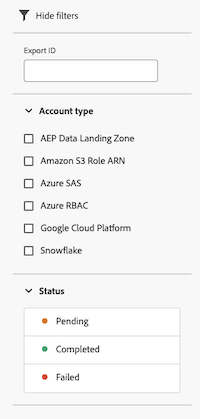

# Hantera exportloggar

Exportloggar innehåller information om varje export och genereras när Analysis Workspace-data exporteras till molnet. (Mer information om hur data kan exporteras till molnet finns i [Exportera Customer Journey Analytics-rapporter till molnet](/help/analysis-workspace/export/export-cloud.md).)

Vid schemalagd export återspeglar loggarna exportinställningarna som de var när loggen skickades. Det går inte att ta bort loggar.

## Visa exportloggar

1. I Customer Journey Analytics väljer du [!UICONTROL **Komponenter**] > [!UICONTROL **Export**].

1. Välj [!UICONTROL **Loggar**] -fliken.

   

   Information om loggarna visas i de tillgängliga kolumnerna.

1. Gör något av följande:

   * [Anpassa kolumnerna](#configure-columns) som visas.

   * Välj **Informationsikon**  bredvid loggnamnet för att visa exporten som är kopplad till loggen.

   * Välj **Ikonen Redigera export**  bredvid loggnamnet för att redigera exporten som är kopplad till loggen.

     Mer information om hur du redigerar och exporterar finns i [Exportera Customer Journey Analytics-rapporter till molnet](/help/analysis-workspace/export/export-cloud.md).

## Filtrera och söka efter loggar

Om du vill hitta den information du behöver kan du antingen filtrera listan med loggar eller söka efter en logg.

### Filtrera listan med loggar

1. I Customer Journey Analytics väljer du [!UICONTROL **Komponenter**] > [!UICONTROL **Export**].

1. Välj [!UICONTROL **Loggar**] -fliken.

1. Välj **Filter** -ikon.

   

   Du kan filtrera efter följande kriterier:

   | Filter | Beskrivning |
   |---------|----------|
   | [!UICONTROL **Export-ID**] | Ange export-ID för den exportlogg som du vill visa. |
   | [!UICONTROL **Kontotyp**] | Kontotypen som loggen är associerad med. Följande kontotyper är tillgängliga: <ul><li>[!UICONTROL **AEP Data Landing Zone**]</li><li>[!UICONTROL **Amazon S3 Role ARN**]</li><li>[!UICONTROL **Azure SAS**]</li><li>[!UICONTROL **Azure RBAC**]</li><li>[!UICONTROL **Google Cloud Platform**]</li><li>[!UICONTROL **Snowflake**]</li></ul>. |
   | [!UICONTROL **Status**] | Exportstatus. Följande statusar är tillgängliga: <ul><li>[!UICONTROL **Väntande**]: En specifik instans av en export har startats men är inte slutförd ännu.
Om du kör om en export som har statusen Väntande fördröjs exportprocessen.
</li><li>[!UICONTROL **Complete**]: En specifik instans av en export har bearbetats och är tillgänglig på exportkontot.</li><li>[!UICONTROL **Misslyckades**]
Olika situationer kan leda till en misslyckad export. Håll muspekaren över statusen Misslyckades för att se information om felet.
Mer information om möjliga orsaker till ett fel finns i [Felsökning av misslyckade exporter](/help/components/exports/troubleshoot-exports.md).
 |

   {style="table-layout:auto"}

### Sök efter loggar

1. I Customer Journey Analytics väljer du [!UICONTROL **Komponenter**] > [!UICONTROL **Export**].

1. Välj [!UICONTROL **Loggar**] -fliken.

1. I sökfältet börjar du skriva in information som är kopplad till loggen som du söker efter. Du kan söka efter data från alla kolumner som är tillgängliga i tabellen.

<!-- removed for MVP: Retry an export You can re-run the export associated with the selected log, using the data as it was on the day the log was originally exported. This is useful when selecting a log that show a failed export or when selecting a log that was accidentally deleted. 

Retrying an export that has a status of Pending will delay the export process.

This option is not available when selecting multiple logs. -->

<!-- 1. In Customer Journey Analytics, select [!UICONTROL **Components**] > [!UICONTROL **Exports**].

1. Select the [!UICONTROL **Logs**] tab, then select a log.

1. Select [!UICONTROL **Retry**]. -->

## Redigera och exportera

Du kan redigera exporten som är kopplad till en viss logg.

Det här alternativet är inte tillgängligt när du markerar flera loggar.

1. I Customer Journey Analytics väljer du [!UICONTROL **Komponenter**] > [!UICONTROL **Export**].

1. Välj [!UICONTROL **Loggar**] -fliken.

1. Leta reda på loggen som är associerad med den export som du vill redigera.

1. Välj **Redigera export** icon  bredvid loggnamnet.

   eller

   Markera kryssrutan intill loggen och välj sedan [!UICONTROL **Redigera export**].

## Konfigurera kolumner

Du kan lägga till eller ta bort kolumner på [!UICONTROL Logs] för att konfigurera vilken information som visas.

Välj en kolumnrubrik för att sortera loggarna efter den kolumnen. Som standard sorteras loggarna efter det datum och den tidpunkt då exporten påbörjades.

Konfigurera kolumner på [!UICONTROL Logs] tab:

1. I Customer Journey Analytics väljer du [!UICONTROL **Komponenter**] > [!UICONTROL **Export**].

1. Välj [!UICONTROL **Loggar**] -fliken.

1. Välj **Anpassa tabell** icon  i det övre högra hörnet av [!UICONTROL Logs] sida.

   Följande kolumner är tillgängliga:

   | Tillgänglig kolumn | Beskrivning |
   |---------|----------|
   | Exportnamn | Namnet på exporten. Användare ger exporterar ett namn när de skapar dem, vilket beskrivs i [Exportera Customer Journey Analytics-rapporter till molnet](/help/analysis-workspace/export/export-cloud.md). |
   | Export-ID | Det ID som automatiskt tilldelas till exporten när den skapas. <!-- True? --> |
   | Instans-ID | ID:t för instansen Customer Journey Analytics. <!-- True? --> |
   | Datavy name | Namnet på datavyn som är associerad med exporten. Användarna kan välja datavyn när de skapar exporten, vilket beskrivs i [Exportera Customer Journey Analytics-rapporter till molnet](/help/analysis-workspace/export/export-cloud.md). |
   | Antal filer | Antalet filer som ingår i exporten. |
   | Storlek | Storleken på exporten.
Filstorleken beräknas med basen 1024, som ibland representeras som KIB och MIB. Om din molnleverantör beräknar storleken med basen 1000 kan det leda till att storleken som visas i din molnleverantör skiljer sig något från storleken som visas här.
 |
   | Plats | Platsen på kontot där data exporterades. |
   | Konto | Kontot där data exporterades. |
   | Status | Exportstatus. Tillgängliga statusvärden är [!UICONTROL Pending], [!UICONTROL Delivered]och [!UICONTROL Failed]. |
   | Leveransdatum | Datumet då exporten ägde rum. |
   | Kontotyp | Typen av molnkonto där data exporterades. Tillgängliga kontotyper är [!UICONTROL Amazon S3 Role ARN], [!UICONTROL Google Cloud Platform], [!UICONTROL Azure SAS], [!UICONTROL Azure RBAC], [!UICONTROL Snowflake]och [!UICONTROL Adobe Experience Platform]. |
   | Antal rader | Antalet rader som ingår i den exporterade tabellen. |

   {style="table-layout:auto"}

1. Kontrollera att alla kolumner som du vill visa är markerade. Markerade kolumner visas på [!UICONTROL Logs] och visa relevant information.

## Visa granskningsloggar

Export i fullformat kan även spåras i [Customer Journey Analytics granskningsloggar](/help/privacy/audit-log.md). <!-- Need to see what the Component Type for full-table export will be and add it here. Also, under "Event type captured by audit logs" there would be a new event type called "Full-table export". 4 actions would be "Create, Delete, Edit, Export" and "API_Request"? Also information about the locations. Probably have a different component for the location credentials.-->
