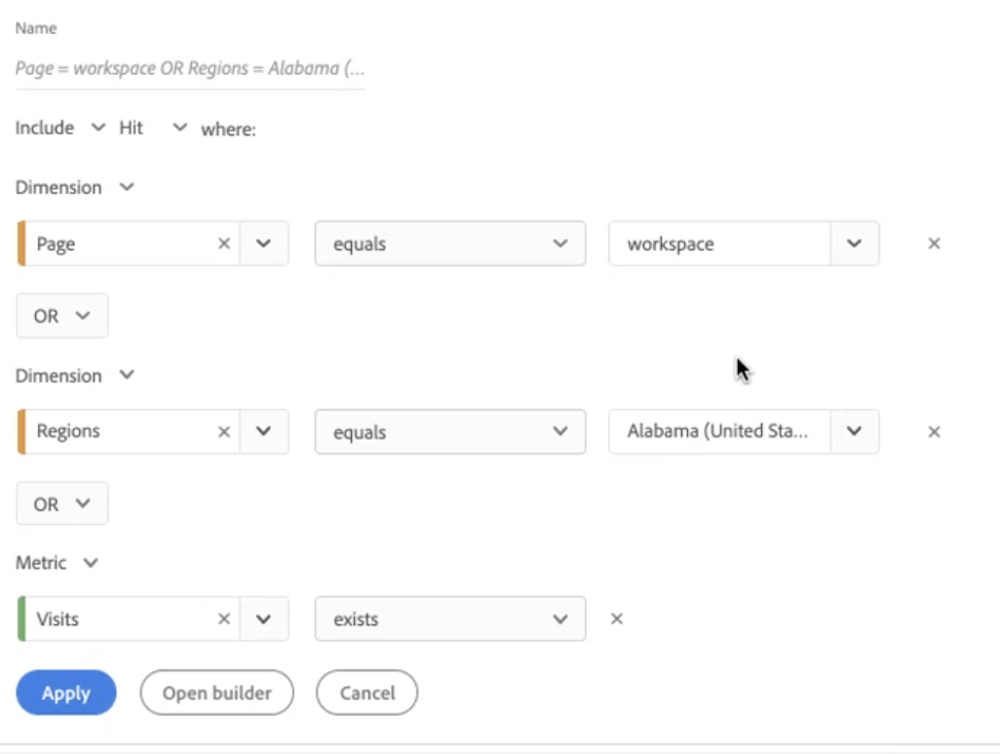

# Snabbfilter

Med snabbfilter kan du enkelt utforska data i ett visst projekt, utan att behöva skapa ett mer komplext komponentlistfilter i [Filter Builder](/help/components/filters/create-filters.md).

Tänk på följande när du skapar snabbfilter:

* Snabbfilter gäller bara för det projekt där de skapades. De är inte tillgängliga i andra projekt och kan inte delas med andra användare.
* Högst tre regler tillåts.
* Kapslade behållare eller sekventiella regler stöds inte.
* Om du delar ett projekt med andra användare kan dessa användare redigera snabbfilter och andra komponenter som bara är till för projektet och som är inbäddade i det delade projektet.

I följande video visas hur du använder snabbfilter. (Obs! I den här videon används termen&quot;snabbsegment&quot; i stället för&quot;snabbfilter&quot;. Funktionen är dock densamma.)

>[!VIDEO](https://video.tv.adobe.com/v/341466/?quality=12&learn=on)

## Skapa ett snabbfilter {#create}

Alla användare i Analysis Workspace kan skapa snabbfilter.

Så här skapar du ett snabbfilter:

1. Välj en av följande metoder för att börja skapa snabbfiltret:

   * **Ad hoc (dra och släpp):** Dra en komponent från den vänstra listen till filtersläppzonen i panelhuvudet.

     

     Du kan redigera snabbfiltret enligt beskrivningen i [Redigera ett snabbfilter](#edit-a-quick-filter).

     >[!NOTE]
     >
     > Tänk på följande när du skapar ett snabbfilter med ad hoc-funktioner (dra och släpp):
     > * Följande komponenttyper stöds inte: beräknade värden och dimensioner samt mätvärden som du inte kan skapa filter från.
     > * För fullständiga dimensioner och händelser skapar Analysis Workspace händelsefilter för &quot;finns&quot;. Exempel: `Hit where eVar1 exists` eller `Hit where event1 exists`.
     > * Om &quot;unspecified&quot; eller &quot;none&quot; släpps i filtersläppzonen konverteras den automatiskt till filtret &quot;does not exist&quot; så att det behandlas korrekt vid filtrering.

   * **Använda filterikonen:** I en Freeform-tabell väljer du **Filter** -ikonen i panelhuvudet.

     

1. Justera någon av följande inställningar:

   | Inställning | Beskrivning |
   | --- | --- |
   | [!UICONTROL Name] | Standardnamnet för ett filter är en kombination av regelnamnen i filtret. Du kan byta namn på filtret till ett mer eget namn. |
   | [!UICONTROL Include/exclude] | Du kan antingen inkludera eller exkludera komponenter i filterdefinitionen, men inte båda. |
   | [!UICONTROL Hit/Visit/Visitor] container | Snabbfilter innehåller ett [filterbehållare](https://experienceleague.adobe.com/docs/analytics-platform/using/cja-components/cja-filters/filters-overview.html#filter-containers) bara det som gör att du kan inkludera ett mått/mått/datumintervall i (eller exkludera det från) filtret. [!UICONTROL Visitor] innehåller övergripande data som är specifika för personen vid besök och sidvisningar. A [!UICONTROL Visit] kan du ange regler för att dela upp persondata baserat på besök och en [!UICONTROL Hit] kan du dela upp personinformation baserat på enskilda sidvyer. Standardbehållaren är [!UICONTROL Hit]. |
   | [!UICONTROL Components] (Dimension/mått/datumintervall) | Definiera upp till tre regler genom att lägga till komponenter (dimensioner, mått, datumintervall eller dimensionsvärden). Det finns tre sätt att hitta rätt komponent:<ul><li>Börja skriva så hittar snabbfilterverktyget automatiskt rätt komponent.</li><li>Använd listrutan för att hitta komponenten.</li><li>Dra och släpp komponenter från den vänstra listen.</li></ul> |
   | [!UICONTROL Operator] | Använd listrutan för att hitta standardoperatorer och [!UICONTROL Distinct Count] operatorer. Se [Filteroperatorer](operators.md). |
   | Plustecken (+) | Lägg till en annan regel |
   | OCH/ELLER-kvalificerare | Du kan lägga till&quot;AND&quot;- eller&quot;OR&quot;-kvalificerare i reglerna, men du kan inte blanda&quot;AND&quot; och&quot;OR&quot; i en enda filterdefinition. |
   | [!UICONTROL Apply] | Använd filtret på panelen. Om filtret inte innehåller några data tillfrågas du om du vill fortsätta. |
   | [!UICONTROL Open builder] | Öppnar Filter Builder. När du har sparat eller använt filtret i Filter Builder betraktas det inte längre som ett snabbfilter. Den blir en del av komponentlistens filterbibliotek. 
Markera alternativet om du vill att komponenten ska vara tillgänglig i alla dina projekt och i den vänstra listen [!UICONTROL **Gör det här filtret tillgängligt för alla projekt och lägg till det i komponentlistan**].

Mer information finns i avsnittet [Spara ett snabbfilter som ett komponentlistfilter](#save-a-quick-filter-as-a-component-list-filter) i den här artikeln.

**Obs!** Endast användare med behörigheten Skapa segment i [Adobe Admin Console](https://experienceleague.adobe.com/docs/analytics/admin/admin-console/permissions/analytics-tools.html) I kan du öppna Filter Builder.
 |
   | [!UICONTROL Cancel] | Avbryt det här snabbfiltret (använd det inte). |
   | [!UICONTROL Date range] | Valideraren använder panelens datumintervall för sin datasökning. Alla datumintervall som används i ett snabbfilter åsidosätter panelens datumintervall högst upp på panelen. |
   | Förhandsgranska (överst till höger) | Här kan du se om du har ett giltigt filter och hur brett filtret är. Representerar den uppdelning av datauppsättningen som du kan förvänta dig att se när du använder det här filtret. Du kan få ett meddelande som anger att det här filtret saknar data. I så fall kan du fortsätta eller ändra filterdefinitionen. |

1. Välj [!UICONTROL **Använd**] för att spara ändringarna.

## Redigera ett snabbfilter {#edit}

1. Håll muspekaren över det snabbfilter som du vill redigera och välj sedan **Redigera** -ikon.

   

1. Redigera filterdefinitionen eller filternamnet.
1. Välj [!UICONTROL **Använd**] för att spara ändringarna.

## Spara ett snabbfilter som ett komponentlistfilter {#save}

>[!IMPORTANT]
>
> Tänk på följande när du sparar ett snabbfilter:
> 
> * Om du vill spara ett snabbfilter måste du ha behörigheten Skapa segment i [Adobe Admin Console](https://experienceleague.adobe.com/docs/analytics/admin/admin-console/permissions/analytics-tools.html).
> 
> * När du har sparat eller använt filtret kan det inte längre redigeras i snabbfilterverktyget. I stället måste du använda den vanliga filterverktyget.

Du kan välja att spara snabbfilter som komponentlistfilter. Fördelar med komponentlistfilter:

* Tillgänglighet i alla dina arbetsyteprojekt
* Stöd för mer komplexa filter och sekventiella filter

Du kan spara filter antingen från snabbfilterverktyget eller från [!UICONTROL Filter Builder].

### Spara i snabbfilterverktyget {#save2}

1. När du har tillämpat snabbfiltret håller du pekaren över det och väljer ikonen för info (&quot;i&quot;).
1. Välj **[!UICONTROL Make available to all projects and add to your component list]**.
1. (Valfritt) Byt namn på filtret.
1. Välj **[!UICONTROL Save]**.

   Filtret visas nu i komponentlistan i den vänstra listen. Observera också att filtrets sidofält ändras från ljusblått till mörkblått, vilket anger att det inte längre kan redigeras eller öppnas i snabbfilterverktyget.

### Spara i filterverktyget {#save3}

1. När du har tillämpat snabbfiltret håller du pekaren över det och väljer ikonen för info (&quot;i&quot;).
1. Välj **[!UICONTROL Save filter]**
1. (Valfritt) Byt namn på filtret och välj sedan [!UICONTROL **Använd**].

   Gå tillbaka till arbetsytan och observera att filtrets sidofält ändras från ljusblå till mörkblå, vilket anger att det inte längre kan redigeras eller öppnas i snabbfilterverktyget. Och genom att spara det blir det en del av komponentlistan.

   

När du har tillämpat filtret kan du välja att lägga till det i filterkomponentlistan och göra det tillgängligt för alla projekt.

1. Håll pekaren över det sparade filtret och välj pennikonen.

1. Välj [!UICONTROL **Open Builder**].

1. Lägg märke till den här dialogrutan längst upp i Filter Builder:

   

1. Markera kryssrutan intill **[!UICONTROL Make this filtr available to all your projects and add it to your component list.]**

1. Välj **[!UICONTROL Save]**.

   Filtret visas nu i filterkomponentlistan för alla dina projekt.
Du kan också [dela filtret](/help/components/filters/filters-share.md) med andra i organisationen.

## Exempel på snabbfilter

I följande exempel kombineras mått och mätvärden:

