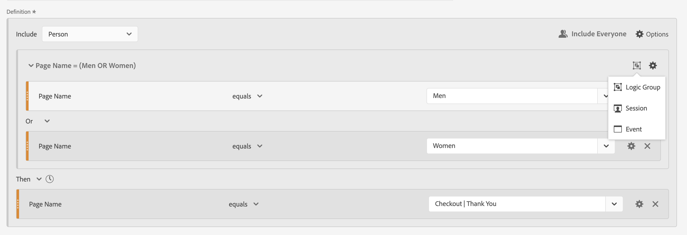

# Sekventiella filter

Du skapar sekventiella filter med hjälp av operatorn Sedan, i stället för operatorn And eller Or mellan komponent, behållare och komponenter eller behållare. Den logiska operatorn then anger att ett filtervillkor inträffar, följt av ett annat.

+++ Här är en video som visar sekventiell segmentering.

>[!VIDEO](https://video.tv.adobe.com/v/25405/?quality=12)

{{videoaa}}

+++

Ett sekventiellt filter har [grundläggande funktioner](#basics) och ytterligare alternativ som du kan konfigurera för att göra sekventiellt filter mer komplext:

* [Efter- och inom](#after-and-within)-begränsningar för logiken Sedan i sekvensfilterdefinitionen:

* Vilka data som ska [inkluderas](#include) som en del av den övergripande sekvensen för filterdefinitionen. Eller för en sekvens som definieras som en del av en behållare. Som standard beaktas alla matchande data som identifieras av  [!UICONTROL Include Everyone].

   * Välj  **[!UICONTROL Only Before Sequence]** om du bara vill ta hänsyn till data före sekvensen.
   * Välj  **[!UICONTROL Only After Sequence]** om du bara vill ta hänsyn till data efter sekvensen.

* Vilka data som ska [exkluderas](#exclude) som en del av sekventiell filterdefinition.

* Så här [grupperar du ](#logic-group)-villkor logiskt i din sekventiella filterdefinition.

## Grunderna

Grunderna för att skapa ett sekventiellt filter skiljer sig inte från att skapa ett vanligt filter med [filterverktyget](filter-builder.md). Du använder [Definitionsverktyget](filter-builder.md#definition-builder) för att skapa filterdefinitionen. I den konstruktionen använder du komponenter, behållare, operatorer och logik. Ett vanligt filter blir automatiskt ett sekventiellt filter så snart du väljer operatorn **[!UICONTROL Then]** i huvuddefinitionen eller i någon av behållarna som du använder i [Definitionsbyggaren](filter-builder.md#definition-builder).

### Exempel

Exemplen nedan visar hur du använder sekventiella filter i olika fall.

#### Enkel sekvens

Identifiera personer som visade en sida och sedan såg en annan sida. Data på händelsenivå filtrerar den här sekvensen oavsett tidigare, tidigare eller tillfälliga sessioner eller tidpunkten eller antalet sidvisningar mellan sessionerna.

#### Sekvens mellan sessioner

Identifiera personer som visade en sida i en session och sedan visade en annan sida i en annan session. Använd behållare för att skapa sekvensen och definiera nivån  **[!UICONTROL Session]** för varje behållare för att skilja på sessionerna.

#### Sekvens på blandnivå

Identifiera personer som visar två sidor över ett obestämt antal sessioner och sedan visa en tredje sida i en separat session. Använd behållare igen för att skapa sekvensen och definiera nivån  **[!UICONTROL Session]** i behållaren som definierar den separata sessionen.

#### Sammanställd sekvens

Identifiera personer som vid sin första session besökte en viss sida och sedan besökte några andra sidor. Om du vill skilja mellan händelsesekvenser använder du behållare för att separera logiken på en  **[!UICONTROL Session]** -behållarnivå.

#### Kapsla en sekvens

Identifiera alla sessioner där en person besöker en sida före en annan och sedan har uppföljningssessioner som inbegriper två andra sidor. Exempel: identifiera alla sessioner där en person först besöker hemsidan, sedan sidan i kategori 1 och sedan har andra sessioner där sidan i kategori 2 och kategori 3 besöktes.

## Efter och inom

Du kan använda operatorn  **[!UICONTROL After]** och  **[!UICONTROL Within]** **[!UICONTROL Then]** för att definiera ytterligare [tidsbegränsningar](#time-constraints) eller [begränsningar för händelser, sessioner eller Dimensioner](#event-session-and-dimension-constraints).

### Tidsbegränsningar

Så här använder du tidsbegränsningar för operatorn **[!UICONTROL Then]**:

1. Välj .
1. Välj **[!UICONTROL Within]** eller **[!UICONTROL After]** på snabbmenyn.
1. Ange en tidsperiod (**[!UICONTROL Minute]**, **[!UICONTROL Hour]**, fram till **[!UICONTROL Years]**).
1. Välj  **[!UICONTROL *number *]**för att öppna ett popup-fönster där du kan skriva in eller ange ett nummer med **[!UICONTROL -]**eller **[!UICONTROL +]**.

Använd  om du vill ta bort en tidskonflikt.

I tabellen nedan förklaras i detalj operatorerna för tidsbegränsning.

| Operatorer | Beskrivning |
|--- |--- |
| **[!UICONTROL After]** | Operatorn [!UICONTROL After] används för att ange en minimigräns för hur lång tid det tar mellan två kontrollpunkter. När du anger After-värdena börjar tidsgränsen när filtret används. Om till exempel operatorn Efter är inställd på en behållare för att identifiera personer som besöker sida A men inte återvänder till sida B förrän efter en dag, börjar den dagen när besökaren lämnar sida A.  För att besökaren ska kunna inkluderas i filtret måste minst 1440 minuter (en dag) visas efter att sidan A har lämnat sidan A för att sidan B ska kunna visas. |
| **[!UICONTROL Within]** | Operatorn [!UICONTROL Within] används för att ange en maximal tidsgräns mellan två kontrollpunkter. Om operatorn [!UICONTROL Within] till exempel är inställd på en behållare för att identifiera personer som besöker sida A och sedan återbesöker sida B inom en dag, börjar den dagen när personen lämnar sida A. För att inkluderas i filtret har personen högst en dag innan sidan B öppnas. För den person som ska inkluderas i filtret måste öppningssida B visas inom högst 1440 minuter (en dag) efter att sidan A har lämnat sidan B. |
| **[!UICONTROL After but Within]** | När du använder både operatorn [!UICONTROL After] och operatorn [!UICONTROL Within] börjar och slutar båda operatorerna parallellt, inte sekventiellt.  Du kan till exempel skapa ett filter med behållaren inställd på: `After = 1 Week(s) and Within = 2 Week(s)`. Villkoren för att identifiera besökare i det här filtret uppfylls bara mellan en och två veckor. Båda villkoren tillämpas från och med den första sidvyn. |

#### Exempel

Några exempel på hur du använder tidsbegränsningar.

##### Efter operator

Identifiera personer som besökt en sida och sedan en annan sida först efter två veckor. Till exempel personer som besökte hemsidan, men Kvinnorna | Shoes page only after two week.

Om en sidvy för hemsidan inträffar den 1 juni 2024, kl. 00:01, visas sidan Women | Shoes kommer att matchas så länge som den sidvyn visas efter 15 juni 2024 00:01.

##### Inom operator

Identifiera personer som besökt en sida och sedan en annan inom fem minuter. Till exempel personer som besökte hemsidan och sedan Kvinnorna | Shoes page within 5 minutes.

Om en sidvy för hemsidan inträffar den 1 juni 2024, kl. 12:01, visas sidan Women | Shoes kommer att matchas så länge som sidvyn visas före 15 juni 2024 12:16.

##### Efter men inom operator

Identifiera personer som besökte en sida och sedan besökte en annan sida efter två veckor, men inom en månad. Till exempel personer som besökte hemsidan och sedan efter två veckor och inom en månad | Shoes page.

Alla som besöker hemsidan den 1 juni 2024 och som återvänder till damerna | Shoes page after 15 juni 2019 00:01, but before juli1, 2019 eligible for the segment.

### Begränsningar för händelser, sessioner och Dimensioner

Med begränsningarna  **[!UICONTROL After]** och  **[!UICONTROL Within]** kan du inte bara ange en tidsbegränsning utan även en händelse-, sessions- eller dimensionsbegränsning. Markera **[!UICONTROL Event(s)]**, **[!UICONTROL Session(s)]** eller **[!UICONTROL Other dimensions]**  **[!UICONTROL *Dimensionens namn *]**. Du kan använda fältet [!UICONTROL *Sök*] för att söka efter en dimension.

#### Exempel

Nedan visas ett exempel på ett sekventiellt filter som söker efter personer som besökt en produktkategorisida (Kvinna | Showen), följt av en utcheckningssida (utcheckning) | Tack) på en sida.

Följande exempelsekvenser matchar eller matchar inte:

| Sekvens |  |
|--- | :---: |
| Sidan `Women \| Shoes` följt av sidan `Checkout \| Thank You` |  |
| Sidan `Women \| Shoes` följt av sidan `Women \| Tops` följt av sidan `Checkout \| Thank You` |  |

## Inkludera

Du kan ange vilka data som ska inkluderas i sekvensfiltret eller i en sekventiell behållare som ingår i sekvensfiltret.

### Alla {#include_everyone}

Om du vill skapa ett sekventiellt filter som innehåller alla väljer du alternativet  **[!UICONTROL Include Everyone]**.

Sekvensfiltret identifierar data som matchar det angivna mönstret som helhet.  Nedan visas ett exempel på ett grundläggande sekvensfilter som söker efter personer som besökt en produktkategorisida (Kvinna | Showen), följt av en utcheckningssida (utcheckning) | Tack). Filtret är inställt på  **[!UICONTROL Include Everyone]**.

Följande exempelsekvenser matchar eller matchar inte:

| Sekvens |  |
|--- | --- |
| A och sedan B i samma session |  |
| A, sedan C och sedan D och B (mellan olika sessioner) |  |
| B och A |  |

### Endast före sekvens och Endast efter sekvens

Alternativen  **[!UICONTROL Only Before Sequence]** och  **[!UICONTROL Only After Sequence]** filtrerar data till en delmängd före eller efter den angivna sekvensen.

*  **Endast före sekvens**: Inkluderar alla data före en sekvens och de första data i själva sekvensen (se exempel 1, 3). Om en sekvens visas flera gånger som en del av data, inkluderar [!UICONTROL Only Before Sequence] den första träffen av den sista sekvensen och alla tidigare träffar (se exempel 2).
*  **Endast efter sekvens**: Inkluderar alla träffar efter en sekvens och de sista data som finns i själva sekvensen (se exempel 1, 3). Om en sekvens visas flera gånger som en del av data, inkluderar Endast efter den senaste träffen av den första sekvensen och alla efterföljande träffar (se exempel 2).

Överväg en definition som specificerar en sekvens av en komponent med kriterier som identifieras av B, följt (därefter) av en komponent med kriterier som identifieras av D. De tre alternativen identifierar data enligt följande:

| B, sedan D | A | B | C | D | E | F |
|---|:---:|:---:|:---:|:---:|:---:|:---:|
| Inkludera alla |  |  |  |  |  |  |
| Endast före sekvens |  |  |  |  |  |  |
| Endast efter sekvens |  |  |  |  |  |  |

| B och sedan D (inträffar flera gånger) | A | B | C | D | B | C | D | E |
|---|:---:|:---:|:---:|:---:|:---:|:---:|:---:|:---:|
| Inkludera alla |  |  |  |  |  |  |  |  |
| Endast före sekvens |  |  |  |  |  |  |  |  |
| Endast efter sekvens |  |  |  |  |  |  |  |  |

#### Exempel

Du har definierat tre versioner av ett sekventiellt filter för webbplatsavsnitt. En med alternativet  **[!UICONTROL Include Everyone]**, en med alternativet  **[!UICONTROL Only Before Sequence]** och en med alternativet  **[!UICONTROL Only After Sequence]** . Du namngav de tre filtren därefter.

När du rapporterar om webbplatsavsnitt med dessa tre filter är det här exempelutdata i en friformstabell.

## Exkludera

Filterdefinitioner inkluderar alla data såvida du inte uttryckligen exkluderar  [!UICONTROL Person]-,  [!UICONTROL Session] - eller  [!UICONTROL Event] -data med **[!UICONTROL Exclude]**.

Med [!UICONTROL Exclude] kan du stänga av vanliga data och skapa filter med mer fokus. Med Exkludera kan du också skapa filter som utesluter specifika grupper av personer. Om du till exempel vill definiera ett filter som anger personer som har beställt och sedan exkluderar den gruppen med personer för att identifiera *icke-köpare*. Det bästa sättet är att skapa regler som använder en bred definition i stället för att använda [!UICONTROL Exclude] för att rikta in sig på en specifik profil som matchar specifika inkluderingsvärden.

Exempel på uteslutningsdefinitioner är:

* **Uteslut sidor**. Använd en filterdefinition om du vill ta bort en viss sida (till exempel *Hemsida*) från en rapport, skapa en händelseregel där sidan är lika med `Home Page` och exkludera sedan regeln. Den här definitionen inkluderar automatiskt alla sidor utom *hemsidan*.
* **Uteslut refererande domäner**. Använd en definition som endast innehåller refererande domäner från Google.com och utesluter alla andra.
* **Identifiera icke-köpare**. Identifiera när order är större än noll och exkludera sedan [!UICONTROL Person].

[!UICONTROL Exclude] kan användas för att identifiera en sekvens där specifika sessioner eller händelser inte utförs av personen. [!UICONTROL Exclude] kan också ingå i en logikgrupp (se nedan).

Du kan exkludera behållare, inte komponenter.

### Exempel

Nedan finns exempel på [!UICONTROL Exclude].

#### Uteslut inom

Identifiera personer som besökt en sida, inte besökt en annan sida och sedan besökt ytterligare en sida. Du utelämnar behållaren med . En exkluderad behållare identifieras av ett rött tunt streck till vänster.

#### Uteslut vid start

Identifiera personer som besökt en sida utan att någonsin gå till en annan. Exempel: personer som checkat ut ett köp utan att någonsin besökt hemsidan.

#### Uteslut i slutet

Identifiera personer som besökt en sida men aldrig besökt andra sidor. Till exempel personer som besökte din hemsida men aldrig någon av dina utcheckningssidor.

## Logikgrupp

>[!NOTE]
>
>[!UICONTROL Logic Group] kan bara definieras i ett sekventiellt filter, vilket innebär att operatorn [!UICONTROL Then] används i behållaren.

Med Logic Group kan du gruppera villkor i en enda sekventiell filterkontrollpunkt. Som en del av sekvensen utvärderas logiken som definieras i behållaren som identifieras som logikgrupp efter en sekventiell kontrollpunkt och före efterföljande sekventiell kontrollpunkt.

Villkoren inom logikgruppen kan uppfyllas i vilken ordning som helst. Icke-sekventiella behållare (händelse, session, person) kräver däremot inte att deras villkor uppfylls i den övergripande sekvensen, vilket ger ett möjligt intuitivt resultat om de används med en Då-operator.

[!UICONTROL Logic Group] har utformats för att behandla *flera villkor som en grupp, utan någon ordning* bland de grupperade villkoren. I annat fall anges att ordningen för villkoren i en logikgrupp inte är relevant.

Här följer några tips om hur du använder logikgruppen:

* Om du vill gruppera sammanhängande kontrollpunkter.
* Att förenkla skapandet av sekventiella filter.

### Exempel

Här är några exempel på hur du använder logikgruppsbehållaren.

#### Alla beställningar

Identifiera personer som visade en sida och sedan visade varje sida från en annan uppsättning sidor i valfri ordning. Till exempel besökte personer som besökte hemsidan och sedan alla sidor på Men, Kvinnor och Barn, oavsett ordningsföljd.

Du kan skapa det här filtret utan en [!UICONTROL Logic Group], men konstruktionen kommer att bli komplex och krånglig. Du måste ange alla sidsekvenser som besökaren kan visa. Av tydlighetsskäl öppnas bara den första behållaren  och de andra behållarna stängs  . Du kan härleda innehållet i de andra behållarna med hjälp av rubrikerna.

Du kan använda [!UICONTROL Logic Group] för att förenkla skapandet av det här filtret, vilket visas nedan. Se till att du väljer  **[!UICONTROL Logic Group]** för behållaren.

#### Första matchningen

Identifiera personer som besökt en sida eller en annan sida och sedan besökt ytterligare en sida. Till exempel besökte personer som besökte sidan Kvinnor eller sidan Män och sedan utcheckningen | Tack.

#### Uteslut och

Identifiera personer som besökt en sida och sedan uttryckligen inte besökt en uppsättning andra sidor, utan besökt en annan sida. Till exempel besökte de personer som besökte hemsidan inte någon av sidorna Män eller Kvinnor, utan besökte barnsidan.

#### Uteslut eller

Identifiera personer som besökt en sida och sedan uttryckligen inte besökt någon sida i en uppsättning sidor, men som besökt en annan sida. Till exempel besökte de som besökte hemsidan inte sidan Män och Kvinnor, utan besökte barnsidan.

<!--
An example of a complex sequential filter if you want to find the persons that 

| Session One | Session Two | Session Three |
| --- | --- | --- |
| The person went to the main landing page A, excluded the campaign page B, and then viewed the Product page C.| The person again went to the main landing page A, excluded the campaign page B, and went again to the Product page C, and then to a new page D. | The person entered and followed that same path as in the first and second visits, then excluded page F to go directly to a targeted product on page G. |
-->

## Ett exempel

Som ett sista exempel vill ni identifiera personer som har lärt sig om en viss produktsida, utan att de här personerna någonsin påverkas av er kampanj Empower Your Move. Och vid sitt första besök i din webbutik tittade de på hemsidan men inte närmare på några friskvårdsprodukter (kugghjulsprodukter) från kategorin Män. Under nästa session gick de dock direkt efter det till en produktsida och lade en onlinebeställning utan att gå igenom startsidan först.

