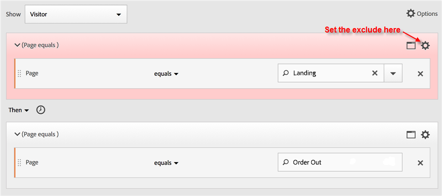
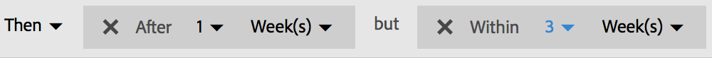
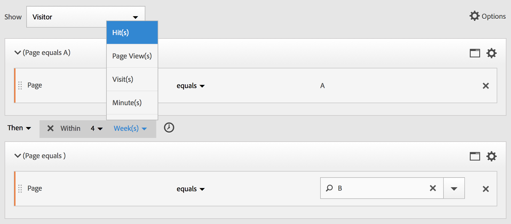

# Skapa sekventiella filter

Sekventiella filter skapas med operatorn THEN i stället för AND eller OR. ANGER SEDAN att ett filtervillkor inträffar, följt av ett annat. Som standard identifierar ett sekventiellt filter alla matchande data och visar filtret Inkludera alla. Sekventiella filter kan filtreras ytterligare till en delmängd av matchande träffar med alternativen Endast före sekvens och Endast efter sekvens.

Här är en video om sekventiell segmentering:

>[!VIDEO](https://video.tv.adobe.com/v/25405/?quality=12)

## Inkludera alla {#include_everyone}

När du skapar ett filter där &quot;Inkludera alla&quot; är inställt identifierar filtret banor som matchar det angivna mönstret som helhet. Detta är ett exempel på ett grundläggande sekvensfilter som söker efter en träff (sida A) följt av en annan (sida B) som besökts av samma besökare. Filtret är inställt på Inkludera alla.

| Om resultatet.. | Sekvens |
|--- | --- |
| Matchar | A then B A then (in a different visit) BA then D then B |
| Matchar inte | B och A |

## Endast före sekvens och Endast efter sekvens {#only_before_after}

Alternativen **[!UICONTROL Only Before Sequence]** och **[!UICONTROL Only After Sequence]** filtrerar filtret till en delmängd med data före eller efter den angivna sekvensen.

* **Endast före sekvens**: Inkluderar alla träffar före en sekvens + den första träffen i själva sekvensen (se exempel 1, 3). Om en sekvens visas flera gånger i en bana innehåller&quot;Endast före sekvens&quot; den första träffen av den sista sekvensen i sekvensen och alla tidigare träffar (se exempel 2).
* **Endast efter sekvens**: Inkluderar alla träffar efter en sekvens + den sista träffen i själva sekvensen (se exempel 1, 3). Om en sekvens visas flera gånger i en bana innehåller&quot;Endast efter&quot; den senaste träffen av den första sekvensen och alla efterföljande träffar (se exempel 2).

Ta till exempel en sekvens av B -> D. De tre filtren identifierar träffar på följande sätt:

**Exempel 1: B och D visas en gång**

| Exempel | A | B | C | D | E | F |
|---|---|---|---|---|---|---|
| Inkludera alla | A | B | C | D | E | F |
| Endast före sekvens | A | B |  |  |  |  |
| Endast efter sekvens |  |  |  | D | E | F |

**Exempel 2: B visas sedan D flera gånger**

| Exempel | A | B | C | D | B | C | D | E |
|---|---|---|---|---|---|---|---|---|
| Inkludera alla | A | B | C | D | B | C | D | E |
| Endast före sekvens | A | B | C | D | B |  |  |  |
| Endast efter sekvens |  |  |  | D | B | C | D | E |

Låt oss även sätta ihop det här konceptet med djupdimensionen.

**Exempel 3: Träffdjup 3 och sedan 5**

## Begränsningar för Dimension {#constraints}

I en&quot;inom&quot;-sats mellan THEN-programsatser kan du lägga till, till exempel,&quot;inom 1 nyckelordsinstans för sökning&quot;,&quot;inom 1 eVar 47-instans&quot;. Detta begränsar filtret till en instans av en dimension.

Om du ställer in en Within Dimension-sats mellan regler kan ett filter begränsa data till sekvenser där den satsen uppfylls. Se exemplet nedan, där begränsningen är inställd på &quot;Inom 1 sida&quot;:

| Om resultatet.. | Sekvens |
|--- |--- |
| Matchar | A och sedan B |
| Matchar inte | A then C then B (därför att B inte var inom 1 sida av A) **Obs!** Om dimensionsbegränsningen är borttagen kommer både A och B och A och C och B att matcha. |

## Enkel sidvisningssekvens {#simple_sequence}

Identifiera besökare som visade en sida och sedan visade en annan sida. Data på träffnivå filtrerar den här sekvensen oavsett tidigare, tidigare eller tillfälliga besökssessioner eller tidpunkten eller antalet sidvisningar som inträffar mellan.

**Exempel**: Besökaren visade sida A och visade sedan sida B i samma eller ett annat besök.

**Användningsexempel**

Här följer några exempel på hur filtret kan användas.

1. Besökarna på en sportsajt kan se landningssidan för fotboll och sedan se landningssidan för basketboll i ordningsföljd, men inte nödvändigtvis på samma besök. Detta får en kampanj för att göra basketinnehåll till fotbollstittare under fotbollssäsongen.
1. Bilhandlarna ser en relation mellan dem som landar på kundlojalitetssidan och sedan går till videon när som helst under besöket eller vid ett annat besök.

**Skapa det här filtret**

Du kapslar in två sidlinjaler i en [!UICONTROL Visitor]-behållare på den översta nivån och sekventierar sidträffarna med operatorn [!UICONTROL THEN] .

## Besökssekvens mellan besök {#sequence_across}

Identifiera de besökare som föll ned från en kampanj men sedan återvände till sekvensen av sidvisningar i en annan session.

**Exempel**: Besökaren visade sida A vid ett besök och visade sedan sida B vid ett annat besök.

**Användningsexempel**

Här följer några exempel på hur den här typen av filter kan användas:

* Besökarna på Sports-sidan på en nyhetsplats går sedan igenom Sports-sidan i en annan session.
* En klädhandlare ser en relation mellan besökare som landar på en landningssida under en session och sedan går direkt till utcheckningssidan under en annan session.

**Skapa det här filtret**

I det här exemplet kapslas två **[!UICONTROL Visit]**-behållare in den översta **[!UICONTROL Visitor]** -behållaren och filtret sekventieras med operatorn [!UICONTROL THEN] .

## Sekvens på blandnivå {#mixed_level}

Identifiera besökare som tittar på två sidor över ett obestämt antal besök, men sedan visa en tredje sida vid ett separat besök.

**Exempel**: Besökarna besöker sida A och sedan sida B i ett eller flera besök, följt av ett besök på sida C i ett separat besök.

**Användningsexempel**

Här följer några exempel på hur den här typen av filter kan användas:

* Besökarna besöker först en nyhetssajt och ser sedan sportsidan i samma besök. På ett annat besök besöker besökaren vädersidan.
* Återförsäljaren definierar besökare som går in på huvudsidan och sedan går till sidan Mitt konto. De besöker även sidan Visa kundvagn.

**Skapa det här filtret**

1. Släpp två siddimensioner från de vänstra rutorna i en [!UICONTROL Visitor]-behållare på den översta nivån.
1. Lägg till operatorn THEN mellan dem.
1. Klicka på **[!UICONTROL Options]** > **[!UICONTROL Add container]** och lägg till en [!UICONTROL Visit]-behållare under nivån [!UICONTROL Visitor] och sekvenserad med operatorn [!UICONTROL THEN].

## Sammanställningsbehållare {#aggregate_containers}

Om du lägger till flera [!UICONTROL Hit]-behållare i en [!UICONTROL Visitor] -behållare kan du använda lämpliga operatorer mellan samma typ av behållare och använda regler och dimensioner som Sida och Besöksnummer för att definiera sidvyn och tillhandahålla en sekvensdimension i [!UICONTROL Hit]-behållaren. Genom att använda logik på träff-nivå kan du begränsa och kombinera matchningar på samma träffnivå i [!UICONTROL Visitor]-behållaren för att skapa en mängd olika filtertyper.

**Exempel**: Besökarna besökte sida A efter den första träffen i sidvysekvensen (sida D i exemplet) och besökte sedan antingen sida B eller sida C utan hänsyn till antalet besök.

**Användningsexempel**

Här följer några exempel på hur den här typen av filter kan användas:

* Identifiera besökare som går till huvudlandningssidan på ett besök, och se sedan sidan med kläder för män på ett annat besök, och titta sedan på antingen Womans eller Children&#39;s landningssida vid ett annat besök.
* Ett e-zine fångar de besökare som går till hemsidan vid ett besök, på en annan sajt och på en annan besökssida.

**Skapa det här filtret**

1. Välj behållaren [!UICONTROL Visitor] som behållare på den översta nivån.
1. Lägg till två behållare på [!UICONTROL Hit]-nivå - en dimension med en lämplig numerisk dimension som förenas på samma [!UICONTROL Hit]-nivå av operatorn [!UICONTROL AND] och [!UICONTROL OR] .
1. Lägg till ytterligare en [!UICONTROL Hit]-behållare i behållaren [!UICONTROL Visit] och kapsla ytterligare två [!UICONTROL Hit]-behållare som är kopplade till en [!UICONTROL OR] - eller [!UICONTROL AND] -operator.

   Sekvens för dessa kapslade [!UICONTROL Hit]-behållare med operatorn [!UICONTROL THEN].

## &quot;Kapsling&quot; i sekventiella filter {#nesting}

Genom att placera kontrollpunkter på både [!UICONTROL Visit]- och [!UICONTROL Hit]-nivå kan du begränsa filtret så att det uppfyller kraven inom ett visst besök samt en viss träff.

**Exempel**: Besökaren besökte sida A och besökte sedan sida B vid samma besök. Vid ett nytt besök gick besökaren till sida C.

**Skapa det här filtret**

1. Dra i två sidstorlekar under en [!UICONTROL Visit]-behållare på den översta nivån.
1. Markera båda reglerna flera gånger, klicka **[!UICONTROL Options]** > **[!UICONTROL Add container from selection]** och ändra den till en [!UICONTROL Visit]-behållare.
1. Koppla dem till en [!UICONTROL THEN]-operator.
1. Skapa en Träff-behållare som en peer-dator till [!UICONTROL Visit]-behållaren och dra i en siddimension.
1. Koppla den kapslade sekvensen i [!UICONTROL Visit]-behållaren med [!UICONTROL Hit]-behållaren med en annan [!UICONTROL THEN]-operator.

## Exkludera träffar {#exclude}

Segmentregler inkluderar alla data såvida du inte uttryckligen utesluter [!UICONTROL Visitor]-, [!UICONTROL Visit]- eller [!UICONTROL Hit]-data med regeln [!UICONTROL Exclude]. Du kan stänga av vanliga data och skapa filter med större fokus. Eller så kan du skapa filter som utesluter hittade grupper för att identifiera den återstående datauppsättningen, till exempel skapa en regel som innefattar framgångsrika besökare som lade order och sedan exkludera dem för att identifiera&quot;icke-köpare&quot;. I de flesta fall är det dock bättre att skapa regler som utesluter breda värden i stället för att använda regeln [!UICONTROL Exclude] för att ange specifika inkluderingsvärden som mål.

Exempel:

* **Uteslut sidor**. Använd en filterregel om du vill ta bort en viss sida (till exempel *`Home Page`*) från en rapport, skapa en träff-regel där sidan är lika med&quot;Hemsida&quot; och exkludera den sedan. Den här regeln inkluderar automatiskt alla värden förutom hemsidan.
* **Uteslut refererande domäner**. Använd en regel som endast inkluderar refererande domäner från Google.com och exkluderar alla andra.
* **Identifiera icke-köpare**. Identifiera när order är större än noll och exkludera sedan [!UICONTROL Visitor].

Operatorn [!UICONTROL Exclude] kan användas för att identifiera en sekvens där specifika besök eller träffar inte utförs av besökaren. [!UICONTROL Exclude Checkpoints] kan också ingå i en logikgrupp (se nedan).

### Uteslut mellan kontrollpunkter {#exclude_between}

Använd logik för att filtrera besökare där en kontrollpunkt inte uttryckligen förekommer mellan två andra kontrollpunkter.

**Exempel**: Besökare som besökt sida A och sedan besökt sida C - men som inte besökt sida B.

**Användningsexempel**

Här följer några exempel på hur den här typen av filter kan användas:

* Besökare på en livsstilssida och sedan på Theatre utan att gå till Arts-sidan.
* En bilhandlare ser en relation mellan dem som besöker landningssidan och sedan går direkt till kampanjen&quot;Inget intresse&quot; utan att gå till sidan&quot;Fordon&quot;.

**Skapa det här filtret**

Skapa ett filter på samma sätt som för ett enkelt, blandat eller kapslat sekventiellt filter och ange sedan operatorn [!UICONTROL EXCLUDE] för behållarelementet. Exemplet nedan är ett aggregeringsfilter där de tre [!UICONTROL Hit]-behållarna dras till arbetsytan, operatorn [!UICONTROL THEN] som är tilldelad att ansluta till behållarlogiken, och sedan utelämnar behållaren för den mellersta sidvyn så att endast besökare som gick från sidan A till sidan C inkluderas i sekvensen.

### Uteslut i början av sekvensen {#exclude_beginning}

Om kontrollpunkten för exkludering är i början av ett sekventiellt filter ser den till att ingen utesluten sidvy inträffade före den första icke-exkluderade träffen.

En restaurang vill till exempel se användare som tenderar att undvika huvudlandningssidan och gå direkt till sidan Beställ ut. Du kan visa dessa data genom att utesluta träffar på landningssidan och inkludera träffar på sidan Ordna ut i ett sekventiellt filter.

**Skapa det här filtret**

Skapa två separata träff-behållare i en besöksbehållare på den översta nivån. Ange sedan operatorn [!UICONTROL EXCLUDE] för den första behållaren.

### Uteslut vid sekvensslut {#exclude_end}

Om den utelämnade kontrollpunkten finns i slutet av en sekvens ser det till att kontrollpunkten inte inträffade mellan den sista icke-utelämnade kontrollpunkten och slutet av besökarsekvensen.

En klädbutik vill till exempel se alla besökare som tittade på en produktsida men aldrig besökt sin kundvagn efteråt. Det här exemplet kan förenklas för en besökare som går till sida A och sedan aldrig kommer till sida B vid aktuella eller efterföljande besök.

**Skapa det här filtret**

Skapa ett enkelt sekvensfilter genom att dra två [!UICONTROL Hit]-behållare till arbetsytan och koppla dem med operatorn [!UICONTROL THEN] . Tilldela sedan operatorn [!UICONTROL EXCLUDE] till den andra [!UICONTROL Hit]-behållaren i sekvensen.

## Behållare för logikgrupp {#logic_group}

Behållare för logikgrupp krävs för att gruppera villkor i en enda sekventiell filterkontrollpunkt. Den speciella logikgruppsbehållaren är endast tillgänglig i sekventiell segmentering för att säkerställa att villkoren uppfylls efter en sekventiell kontrollpunkt och före efterföljande kontrollpunkter. Villkoren i Logic Group-kontrollpunkten kan uppfyllas i vilken ordning som helst. Icke-sekventiella behållare (träff, besök, besökare) kräver däremot inte att deras villkor uppfylls i den övergripande sekvensen, vilket ger ointuitiva resultat om de används med en THEN-operator.
Behållaren [!UICONTROL Logic Group] har utformats för att behandla *flera kontrollpunkter som en grupp*, *utan någon ordning* bland de grupperade kontrollpunkterna. Med andra ord, vi bryr oss inte om ordningen på kontrollpunkterna i den gruppen. Du kan till exempel inte kapsla en [!UICONTROL Visitor]-behållare i en [!UICONTROL Visitor]-behållare. I stället kan du kapsla en [!UICONTROL Logic Group]-behållare i en [!UICONTROL Visitor]-behållare med specifika kontrollpunkter på [!UICONTROL Visit]- och [!UICONTROL Hit]-nivå.

>[!NOTE]
>
>[!UICONTROL Logic Group] kan bara definieras i ett sekventiellt filter, vilket innebär att operatorn [!UICONTROL THEN] används i uttrycket.

| Behållarhierarki | Illustration | Definition |
|---|---|---|
| Standardbehållarhierarki |  | I behållaren [!UICONTROL Visitor] kapslas behållarna [!UICONTROL Visit] och [!UICONTROL Hit] sekventiellt för att extrahera filter baserat på träffar, antalet besök och besökaren. |
| Logikbehållarhierarki |  | Standardbehållarhierarkin krävs även utanför behållaren [!UICONTROL Logic Group]. Men i behållaren [!UICONTROL Logic Group] kräver kontrollpunkterna ingen etablerad ordning eller hierarki. Dessa kontrollpunkter måste bara uppfyllas av besökaren i valfri ordning. |

Logikgrupper kan verka skrämmande - här följer några tips om hur du använder dem:

**Logggrupp eller Träff/Besök behållare?**
Om du vill gruppera sekventiella kontrollpunkter är din&quot;behållare&quot; logikgrupp. Om dessa sekventiella kontrollpunkter måste finnas inom ett enda träffs- eller besöksomfång, krävs dock en träff- eller besöksbehållare. (En träff passar förstås inte för en grupp av sekventiella kontrollpunkter, när en träff inte kan kreditera mer än en kontrollpunkt).

**Förenklar logiska grupper skapandet av sekventiella filter?**
Ja, det kan de. Låt oss anta att du försöker identifiera det här besökarfiltret: **Besökare som visade sida A och sedan visade varje sida i B, C och D**

Du kan skapa det här filtret utan en logikgruppsbehållare, men det är komplicerat och mödosamt. Du måste ange varje sidsekvens som besökaren kan visa:
* `Visitor Container [Page A THEN Page B THEN Page C THEN Page D] or`
* `Visitor Container [Page A THEN Page B THEN Page D THEN Page C] or`
* `Visitor Container [Page A THEN Page C THEN Page B THEN Page D] or`
* `Visitor Container [Page A THEN Page C THEN Page D THEN Page B] or`
* `Visitor Container [Page A THEN Page D THEN Page B THEN Page C] or`
* `Visitor Container [Page A THEN Page D THEN Page C THEN Page B]`

En logikgruppsbehållare gör det enklare att skapa det här filtret, vilket visas här:

### Skapa ett logikgruppsfilter {#logic_group_filter}

Precis som andra behållare kan [!UICONTROL Logic Group]-behållare byggas på flera sätt i [!UICONTROL Segment Builder]. Här är ett föredraget sätt att kapsla [!UICONTROL Logic Group] behållare:

1. Dra mått, händelser eller filter från de vänstra rutorna.
1. Ändra den övre behållaren till en [!UICONTROL Visitor]-behållare.
1. Ändra operatorn [!UICONTROL AND] eller [!UICONTROL OR] infogad som standard till operatorn THEN.
1. Markera [!UICONTROL Hit]-behållarna (Dimensionen, händelsen eller objektet) och klicka på **[!UICONTROL Options]** > **[!UICONTROL Add container from selection]**.
1. Klicka på behållarikonen och välj **[!UICONTROL Logic Group]**. 
1. Du kan nu ange [!UICONTROL Hit] i [!UICONTROL Logic Group]-behållaren utan hänsyn till hierarkin.

### Kontrollpunkter för logikgrupp i vilken ordning som helst {#any_order}

Om du använder [!UICONTROL Logic Group] kan du uppfylla villkoren i den gruppen som ligger utanför sekvensen. Detta gör att du kan skapa filter där en [!UICONTROL Visit]- eller [!UICONTROL Hit]-behållare inträffar oavsett den normala hierarkin.

**Exempel**: Besökare som besökt sida A och sedan besökt sida B och sida C i valfri ordning.

**Skapa det här filtret**

Sida B och C är kapslade i en [!UICONTROL Logic Group]-behållare i den yttre [!UICONTROL Visitor]-behållaren. Behållaren [!UICONTROL Hit] för A följs sedan av behållaren [!UICONTROL Logic Group] med B och C som identifieras med operatorn [!UICONTROL AND]. Eftersom den finns i [!UICONTROL Logic Group] är sekvensen inte definierad och om du trycker på både sida B och C i någon ordning blir argumentet true.

**Ett annat exempel**: Besökare som besökt sida B eller sida C och sedan besökt sida A:

Filtret måste matcha vid minst en av logikgruppens kontrollpunkter (B eller C). Logikgruppsvillkor kan även uppfyllas i samma träff eller över flera träffar. &#x200B;

### Logggruppsmatchning {#first_match}

Om du använder [!UICONTROL Logic Group] kan du uppfylla villkoren i den gruppen som ligger utanför sekvensen. I det här osorterade första matchningsfiltret identifieras reglerna [!UICONTROL Logic Group] först som antingen en sidvy av sida B eller sida C, och därefter som en nödvändig vy av sida A.

**Exempel**: Besökare som besökt antingen sida B eller sida C och sedan besökt sida A.

**Skapa det här filtret**

Dimensionerna för sida B och C grupperas i en [!UICONTROL Logic Group]-behållare med operatorn [!UICONTROL OR] markerad, och sedan [!UICONTROL Hit]behållaren som identifierar en sidvy på sida A som värdet.

### Logikgrupp exkluderar OCH {#lg_exclude_and}

Bygg filter med [!UICONTROL Logic Group] där flera sidvyer slås samman för att definiera vilka sidor som behöver nås medan andra sidor specifikt missades. ****

**Exempel**: Besökaren besökte sida A, men besökte inte sida B eller C explicit, utan sidan D.

**Skapa det här filtret**

Bygg det här filtret genom att dra Dimensioner, händelser och fördefinierade filter från de vänstra rutorna. Se avsnittet Skapa ett filter för logikgrupp.

När du har kapslat värdena i [!UICONTROL Logic Group] klickar du på knappen **[!UICONTROL Exclude]** i behållaren [!UICONTROL Logic Group].

### Logikgrupp exkluderad ELLER {#lg_exclude_or}

Bygg filter med [!UICONTROL Logic Group] där flera sidvyer slås samman för att definiera vilka sidor som behöver nås medan andra sidor specifikt missades.

**Exempel**: Besökare som besökt sida A men inte besökt sida B eller sida C före sida A.

**Skapa det här filtret**

De första B- och C-sidorna identifieras i en [!UICONTROL Logic Group]-behållare som är exkluderad och följs sedan av besökaren en träff till sida A.

Bygg det här filtret genom att dra Dimensioner, händelser och färdiga segment från den vänstra rutan.

När du har kapslat värdena i [!UICONTROL Logic Group] klickar du på knappen **[!UICONTROL Exclude]** i behållaren [!UICONTROL Logic Group].

## Bygg tidsbesparande och tidsbesparande filter {#time_within_after}

Använd operatorerna [!UICONTROL Within] och [!UICONTROL After] som är inbyggda i huvudet för varje behållare för att definiera tid, händelser och antal.

Du kan begränsa matchningen till en angiven tidslängd genom att använda behållarna [!UICONTROL Within] och [!UICONTROL After] och ange en granularitet och ett antal. Operatorn [!UICONTROL Within] används för att ange en maxgräns för hur lång tid det tar mellan två kontrollpunkter. Operatorn [!UICONTROL After] används för att ange en minimigräns för hur lång tid det tar mellan två kontrollpunkter.

>[!NOTE]
>
>Det finns skillnader i utvärderingen mellan element med liknande namn, som **dag(ar)** eller **dag**. För tidsbaserade definitioner av Inom och efter använder du de alternativ som listas först i popup-fönstret:
>
>
>
>Använd alternativen under undermenyn *Andra Dimensioner* för dimensionsbaserade definitioner för Inom och efter:
>
>

### Efter och inom operatorer {#after_within}

Längden anges med en versal som representerar granulariteten följt av en siffra som representerar repetitionsantalet för granulariteten.

**[!UICONTROL Within]** innehåller slutpunkten (mindre än eller lika med).

**[!UICONTROL After]** innehåller inte slutpunkten (större än).

| Operatorer | Beskrivning |
|--- |--- |
| EFTER | Operatorn Efter används för att ange en minimigräns för hur lång tid det tar mellan två kontrollpunkter. När du anger After-värdena börjar tidsgränsen när filtret används. Om till exempel operatorn Efter är inställd på en behållare för att identifiera besökare som besöker sida A men inte återvänder till sida B förrän efter en dag, börjar den dagen när besökaren lämnar sida A.  För att besökaren ska kunna inkluderas i filtret måste minst 1440 minuter (en dag) visas efter att sidan A har lämnat sidan till sidan B. |
| INOM | Operatorn Inom används för att ange en maximal tidsgräns mellan två kontrollpunkter. Om till exempel operatorn Inom är inställd på en behållare för att identifiera besökare som besöker sida A och sedan återgår till sida B inom en dag, börjar den dagen när besökaren lämnar sida A. För att inkluderas i filtret har besökaren högst en dag innan sidan B öppnas.   För att besökaren ska kunna inkluderas i filtret måste besöket på sida B ske inom högst 1440 minuter (en dag) efter att sidan A har lämnat sidan B. |
| EFTER/INOM | När du använder operatorerna Efter och Inom är det viktigt att du förstår att båda operatorerna börjar och slutar parallellt, inte sekventiellt.   Om du till exempel skapar ett filter med behållaren inställd på: `After = 1 Week(s) and Within = 2 Week(s)` uppfylls villkoren för att identifiera besökare i filtret endast mellan 1 och 2 veckor. Båda villkoren tillämpas från och med den första sidträffen. |

### Använda operatorn Efter {#after}

* Med Tid efter kan du följa upp besök per år, månad, dag, timme och minut.
* Tid efter kan bara användas för en [!UICONTROL Hit]-behållare eftersom det är den enda nivån för vilken sådan fin granularitet har definierats.

**Exempel**: Besökare som besökt sida A besökte sida B först efter 2 veckor.***

**Skapa segmentet**: Det här filtret skapas genom att en [!UICONTROL Visitor]-behållare med två [!UICONTROL Hit]-behållare läggs till. Du kan sedan ange operatorn [!UICONTROL THEN], öppna listrutan [!UICONTROL AFTER] och ange antalet veckor.

**Matchar**

Om en träff på sida A inträffar den 1 juni 2019, kl. 00:01, kommer följande träff på sida B att matchas så länge som det kommer före den 15 juni 2019 kl. 00:01 (14 dagar senare).

| Tryck på A | Träff B | Matchande |
|--- |--- |--- |
| **En** träff: 1 juni 2019 00:01 | **B** träff: 15 juni 2019 00:01 | **Matchar:** Tidsbegränsningen matchar eftersom den är efter 1 juni 2019 (två veckor). |
| **En** träff: 1 juni 2019 00:01 | **B** träffad: 8 juni 2019 00:01 B träffad: 15 juni 2019 00:01 | **Matchar inte:** Den första träffen på sida B matchar inte eftersom den står i konflikt med begränsningen som kräver den efter två veckor. |

### Använda operatorn Inom {#within}

* Med [!UICONTROL Within] kan du spåra efter år, månad, dag, timme och minut för att matcha besöken.
* [!UICONTROL Within] kan bara användas på en [!UICONTROL Hit]-behållare eftersom det är den enda nivån för vilken sådan fin granularitet har definierats.

>[!TIP]
>
>I en&quot;inom&quot;-sats mellan THEN-programsatser kan du lägga till, till exempel,&quot;inom 1 nyckelordsinstans för sökning&quot;,&quot;inom 1 eVar 47-instans&quot;. Detta begränsar filtret till en instans av en dimension.

**Exempel**: Besökare som besökt sida A och sedan besökt sida B inom fem minuter.

**Skapa filtret**: Det här filtret skapas genom att du lägger till en [!UICONTROL Visitor]-behållare och sedan drar med två [!UICONTROL Hit]-behållare. Du kan sedan ange operatorn [!UICONTROL THEN] och öppna listrutan för operatorn [!UICONTROL AFTER] och ange intervallet: träffar, sidvisningar, besök, minuter, timmar, dagar, veckor, månader, kvartal eller år.

**Matchar**

Matchningar måste ske inom tidsgränsen. Om en besökare träffar sida A inträffar klockan 00:01 för uttrycket kommer nästa träff på sida B att matcha så länge som det kommer på eller före 00:06 (fem minuter senare, inklusive samma minut). Träffar inom samma minut kommer också att matcha.

### Operatorerna Inom och efter {#within_after}

Använd [!UICONTROL Within] och [!UICONTROL After] för att ange en högsta och lägsta slutpunkt i båda ändar av ett filter.

**Exempel**: Besökare som besökt sida A besökte sida B efter två veckor men inom en månad.

**Skapa segmentet**: Skapa filtret genom att sekvensera två [!UICONTROL Hit] -behållare i en [!UICONTROL Visitor] -behållare. Ange sedan operatorerna [!UICONTROL After] och [!UICONTROL Within].

**Matchar**

Alla besökare som träffar sida A den 1 juni 2019 återvänder efter den 15 juni 2019 00:01, men *före* 1 juli 2019 inkluderas i filtret. Jämför med avsnittet Tid mellan undantag.

Operatorerna [!UICONTROL After] och [!UICONTROL Within] kan användas tillsammans för att definiera ett sekventiellt filter.

I det här exemplet avbildas ett andra besök för att gå till sida B efter två veckor, men inom en månad.
