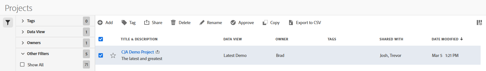

# Hantera projekt

Använd projektledaren för att dela, byta namn på eller ta bort projekt. Så här når du datumhanteraren:

1. Logga in på [analytics.adobe.com](https://analytics.adobe.com) med inloggningsuppgifterna för ditt AdobeID.
1. Navigera till [!UICONTROL Components] > [!UICONTROL Projects].

## Gränssnitt

Projektledaren innehåller följande alternativ:

* **Lägg till**: Skapa ett nytt projekt. Mer information finns i [Skapa ett projekt](create.md) .
* **Sök efter titel**: Sök efter ett projekt efter namn. Resultaten filtreras baserat på den text som anges här.
* **Filter**: Filtrera projekt med den vänstra kolumnen. Du kan filtrera efter anpassad tagg, ägare, skapad av dig, dina favoriter, godkänd eller delad med dig. Du kan också söka efter önskade filter.
* **Favorit**: Klicka på  bredvid ett projekt för att lägga till det i dina favoriter.
* **Anpassa kolumner**: Klicka på  om du vill visa eller dölja kolumner i projekthanteraren.

Klicka i kryssrutan bredvid ett eller flera projekt om du vill se fler alternativ.

* **Tagg**: Använd en tagg för alla markerade projekt. Med taggar kan du ordna projekt och filtrera dem med den vänstra kolumnen.
* **Dela**: Dela ett projekt med andra Experience Cloud-användare. Om du är produktadministratör kan du även dela filer till hela organisationen eller grupper. Projekt som delas med andra användare i organisationen innehåller en  ikon bredvid titeln.
* **Ta bort**: Ta bort markerade projekt permanent.
* **Byt namn**: Om du markerar ett enskilt projekt kan du ändra dess namn.
* **Godkänn**: Om du är produktadministratör kan du lägga till en godkännandestämpel i ett projekt. Godkända projekt informerar användarna i organisationen om att de är&quot;officiella&quot; och skiljer dem från projekt som skapats av andra användare i organisationen. Godkända projekt innehåller en  ikon bredvid titeln.
* **Ogodkänd**: Om du är produktadministratör och väljer ett projekt som redan har godkänts kan du avgodkänna det.
* **Copy**: Skapa en kopia av de markerade projekten. Kopieringsprojekt läggs `(Copy)` till i slutet av titeln på det/de nyligen kopierade projektet/projekten.
* **Exportera till CSV**: Exporterar alla markerade projekt till en CSV-fil. Kolumner i den resulterande CSV-filen innehåller alla synliga kolumner i projekthanteraren.
