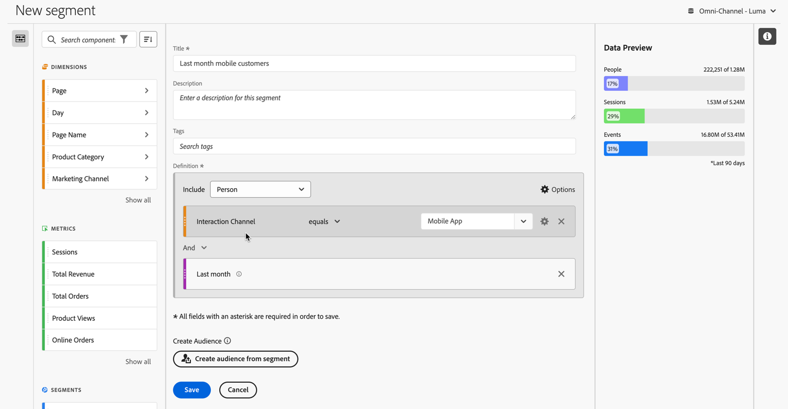
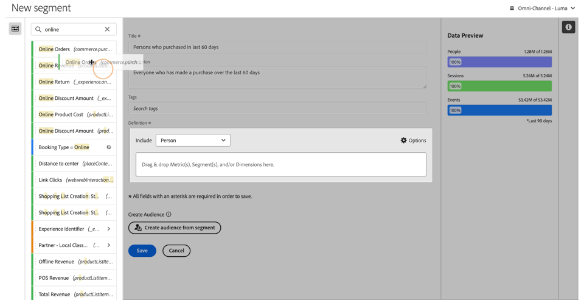
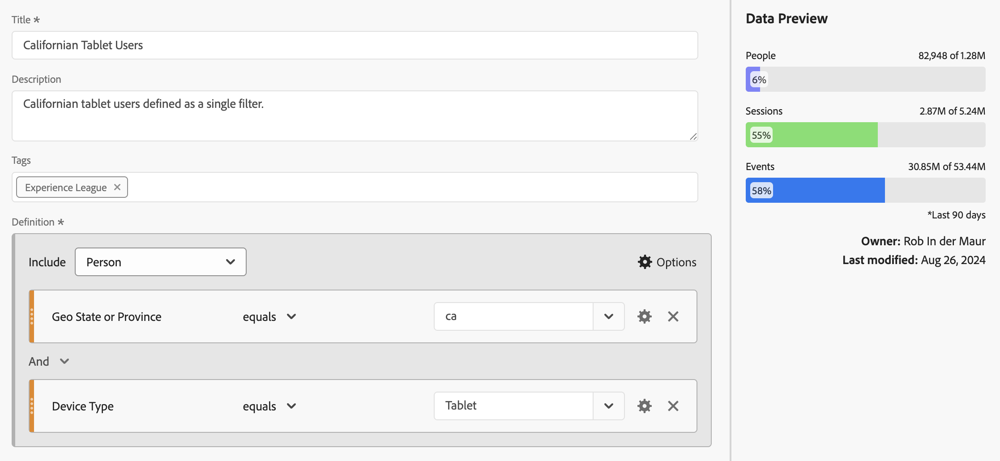

# Skapa segment {#build-segments}

<!-- markdownlint-disable MD034 -->

>[!CONTEXTUALHELP]
>id="components_filters_createaudience"
>title="Skapa publik"
>abstract="Målgrupper kan skapas från ett segment och delas med Adobe Experience Platform för aktivering."

>[!CONTEXTUALHELP]
>id="components_filters_datapreview"
>title="Förhandsgranska data"
>abstract="Jämför data i det här segmentet med data i datavyn. Procentandelen för förhandsgranskning baseras på det totala antalet i datavyn från de **senaste 90 dagarna**.  Om förhandsgranskningen inte läses in kan anslutningen fortfarande återfyllas."

Dialogrutan **[!UICONTROL Segment builder]** används för att skapa nya eller redigera befintliga segment. Dialogrutan heter **[!UICONTROL New segment]** eller **[!UICONTROL Edit segment]** för segment som du skapar eller hanterar från [[!UICONTROL Segment]-hanteraren ](/help/components/segments/seg-manage.md).

>[!BEGINTABS]

>[!TAB Segmentbyggare]

>[!TAB Skapa eller redigera segment]

>[!ENDTABS]

1. Ange följande information ( krävs):

   | Element | Beskrivning |
   | --- | --- |
   | **[!UICONTROL Data view]** | Du kan välja datavy för segmentet.  Segmentet som du definierar är tillgängligt som ett segment på fliken [Inställningar](/help/data-views/create-dataview.md#settings-filters) i en datavy. |
   | **[!UICONTROL Project-only segment]** | En informationsruta som förklarar att segmentet bara är synligt i det projekt där det skapas och att segmentet inte läggs till i komponentlistan. Aktivera **[!UICONTROL Make this segment available to all your projects and add it to your component list]** om du vill ändra den inställningen. Den här informationsrutan visas bara när du skapar ett [snabbsegment](seg-quick.md) och vrider snabbsegmentsinformationen till ett reguljärt segment med **[!UICONTROL Open builder]** från [!UICONTROL Quick segment]-gränssnittet. |
   | **[!UICONTROL Title]**  | Namnge segmentet, till exempel `Last month mobile customers`. |
   | **[!UICONTROL Description]** | Ange en beskrivning av segmentet, till exempel `Segment to define the mobile customers for the last month`. |
   | **[!UICONTROL Tags]** | Organisera segmentet genom att skapa eller använda en eller flera taggar. Börja skriva för att hitta befintliga taggar som du kan markera. Eller tryck på **[!UICONTROL ENTER]** för att lägga till en ny tagg. Välj  om du vill ta bort en tagg. |
   | **[!UICONTROL Definition]**  | Definiera ditt segment med [Definitionsverktyget](#definition-builder). |

   {style="table-layout:auto"}

1. Använd den ständigt uppdaterade förhandsgranskningen av segmentets resultat högst upp till höger för att kontrollera om segmentdefinitionen är korrekt.
1. Om du vill skapa en målgrupp från segmentet och dela målgruppen med Experience Platform väljer du **[!UICONTROL Create audience from segment]**. Mer information finns i [Skapa och publicera målgrupper](/help/components/audiences/publish.md).
1. Välj:
   * **[!UICONTROL Save]** om du vill spara segmentet.
   * **[!UICONTROL Save As]** om du vill spara en kopia av segmentet.
   * **[!UICONTROL Delete]** om du vill ta bort segmentet.
   * **[!UICONTROL Cancel]** om du vill avbryta ändringar som du har gjort i segmentet eller avbryta skapandet av ett nytt segment.

## Definition builder

Du använder Definitionsverktyget för att skapa segmentdefinitionen. I den konstruktionen använder du komponenter, behållare, operatorer och logik.

Du kan konfigurera typen och omfattningen av din definition:

1. Om du vill ange typen av definition anger du om du vill att definitionen ska vara inkluderad eller exkluderad. Välj  **[!UICONTROL Options]** och i listrutan **[!UICONTROL Include]** eller **[!UICONTROL Exclude]**.
1. Om du vill ange definitionens omfattning väljer du i listrutan **[!UICONTROL Include]** eller **[!UICONTROL Exclude]** om du vill att definitionens omfång ska vara **[!UICONTROL Event]**, **[!UICONTROL Session]**, **[!UICONTROL Person]**, **[!UICONTROL Global Account]** [!BADGE B2B edition]{type=Informative url="https://experienceleague.adobe.com/en/docs/analytics-platform/using/cja-overview/cja-b2b/cja-b2b-edition" newtab=true tooltip="Customer Journey Analytics B2B edition"}, **[!UICONTROL Account]** [!BADGE B2B edition]{type=Informative url="https://experienceleague.adobe.com/en/docs/analytics-platform/using/cja-overview/cja-b2b/cja-b2b-edition" newtab=true tooltip="Customer Journey Analytics B2B edition"}, **[!UICONTROL Opportunity]** [!BADGE B2B edition]{type=Informative url="https://experienceleague.adobe.com/en/docs/analytics-platform/using/cja-overview/cja-b2b/cja-b2b-edition" newtab=true tooltip="Customer Journey Analytics B2B edition"} eller **[!UICONTROL Buying Group]** [!BADGE B2B edition{11 6}]{type=Informative url="https://experienceleague.adobe.com/en/docs/analytics-platform/using/cja-overview/cja-b2b/cja-b2b-edition" newtab=true tooltip="Customer Journey Analytics B2B edition"}

Du kan alltid ändra de här inställningarna senare.

### Komponenter

En viktig del av arbetet med att skapa segmentdefinitionen är att använda mått, mätvärden, befintliga segment och datumintervall. Alla dessa komponenter är tillgängliga från komponentpanelen i segmentbyggaren.

{width=100%}

Så här lägger du till en komponent:

1. Dra och släpp en komponent från komponentpanelen till **[!UICONTROL Drag and drop Metric(s), Segment(s), and/or Dimensions here]**. Du kan använda  i komponentfältet för att söka efter specifika komponenter.
1. Ange information för komponenten. Välj till exempel ett värde från **[!UICONTROL Select value]**. Eller ange ett värde. Vad och hur du kan ange ett eller flera värden beror på komponenten och operatorn.
1. Om du vill kan du ändra standardoperatorn. Exempel: från **[!UICONTROL equals]** till **[!UICONTROL equals any of]**. Se [Operatorer](seg-operators.md) för en detaljerad översikt över tillgängliga operatorer.

Så här redigerar du en komponent:

* Välj en ny operator för komponenten i den nedrullningsbara menyn operator.
* Välj eller ange ett annat värde för operatorn om det är lämpligt.
* Om komponenttypen är en dimension kan du definiera attribueringsmodellen. Mer information finns i [Attributmodell](#attribution).

Så här tar du bort en komponent:

* Välj  i en komponent.

### Behållare

Du kan gruppera flera komponenter i en eller flera behållare och definiera logik i och mellan behållare. Med behållare kan du skapa komplexa definitioner för ditt segment.

{Width=100%}

* Om du vill lägga till en behållare väljer du **[!UICONTROL Add container]** från  **[!UICONTROL Options]**.
* Om du vill lägga till en befintlig komponent i behållaren drar och släpper du komponenten i behållaren.
* Om du vill lägga till en annan komponent i behållaren drar och släpper du en komponent från komponentpanelen i behållaren. Använd den blå infogningslinjen som stödlinje.
* Om du vill lägga till en annan komponent utanför behållaren drar och släpper du en komponent från komponentpanelen utanför behållaren, men inuti huvuddefinitionsbehållaren. Använd den blå infogningslinjen som stödlinje.
* Om du vill ändra logiken mellan komponenterna i en behållare, mellan behållare eller mellan en behållare och en komponent, väljer du lämplig **[!UICONTROL And]**, **[!UICONTROL Or]**, **[!UICONTROL Then]**. När du sedan markerar Omvandla du segmentet till ett sekventiellt segment. Mer information finns i [Skapa sekventiellt segment](seg-sequential-build.md).
* Om du vill ändra behållarnivån väljer du  **[!UICONTROL Global Account]** [!BADGE B2B edition]{type=Informative url="https://experienceleague.adobe.com/en/docs/analytics-platform/using/cja-overview/cja-b2b/cja-b2b-edition" newtab=true tooltip="Customer Journey Analytics B2B edition"},  **[!UICONTROL Account]** [!BADGE B2B edition]{type=Informative url="https://experienceleague.adobe.com/en/docs/analytics-platform/using/cja-overview/cja-b2b/cja-b2b-edition" newtab=true tooltip="Customer Journey Analytics B2B edition"},  **[!UICONTROL Opportunity]** [!BADGE B2B edition]{type=Informative url="https://experienceleague.adobe.com/en/docs/analytics-platform/using/cja-overview/cja-b2b/cja-b2b-edition" newtab=true tooltip="Customer Journey Analytics B2B edition"},  **[!UICONTROL Buying Group]** [!BADGE B2B edition **[!UICONTROL Event]** 19}, ![WebPage]{type=Informative url="https://experienceleague.adobe.com/en/docs/analytics-platform/using/cja-overview/cja-b2b/cja-b2b-edition" newtab=true tooltip="Customer Journey Analytics B2B edition"} ](/help/assets/icons/WebPage.svg),  **[!UICONTROL Session]** eller  **[!UICONTROL Person]**.

Du kan använda  i en behållare för följande åtgärder:

| Behållaråtgärd | Beskrivning |
|---|---|
| **[!UICONTROL Add container]** | Lägg till en kapslad behållare i behållaren. |
| **[!UICONTROL Exclude]** | Exkludera resultatet från behållaren i segmentdefinitionen. Ett tunt rött fält till vänster identifierar en exkluderingsbehållare. |
| **[!UICONTROL Include]** | Inkludera resultatet från behållaren i segmentdefinitionen. Inkludera är standard. Ett tunt grått fält till vänster identifierar en inkluderingsbehållare. |
| **[!UICONTROL Name container]** | Byt namn på behållaren från standardbeskrivningen. Skriv ett namn i textfältet. Om du inte anger några indata används standardbeskrivningen. |
| **[!UICONTROL Delete container]** | Ta bort behållaren från definitionen. |

## Datumintervall

Du kan skapa segment som innehåller rullande datumintervall. På så sätt kan ni besvara frågor om pågående kampanjer eller evenemang. Du kan till exempel skapa ett segment som innehåller *alla som har gjort ett onlineköp de senaste 60 dagarna*.

>[!BEGINSHADEBOX]

Se  [Rullande datumintervall i segment](https://video.tv.adobe.com/v/25403/?quality=12&learn=on){target="_blank"} för en demonstrationsvideo.

>[!ENDSHADEBOX]

## Stapla segment {#stack}

Du kan skapa ett segment med hjälp av segment. När du använder segment i ett segment kan du optimera segmentet och minska komplexiteten.

Tänk dig att du vill segmentera i kombinationen av enhetstyp (2) och USA (50). Du kan antingen skapa 100 segment, var och en för den unika kombinationen av enhetstyp (mobiltelefon kontra surfplatta) och USA. För att få surfplatteanvändare i Kalifornien använder du ett av de 100 segmenten:

Eller så kan du definiera 52 segment: 50 segment för USA, en för mobiltelefoner och en för surfplattor. Sedan staplar du segmenten för att få samma resultat. För surfplattorna i Kalifornien behöver du två segment:

## Tillskrivning {#attribution}

>[!CONTEXTUALHELP]
>id="components_filters_attribution_repeating"
>title="Upprepande"
>abstract="Inkluderar instanser och beständiga värden för dimensionen."

>[!CONTEXTUALHELP]
>id="components_filters_attribution_instance"
>title="Instance"
>abstract="Inkluderar instanser för dimensionen."

>[!CONTEXTUALHELP]
>id="components_filters_attribution_nonrepeatinginstance"
>title="Icke upprepande instans"
>abstract="Inkluderar unika (icke upprepande) instanser för dimensionen."

När du använder en dimension i segmentverktyget har du möjlighet att ange attribueringsmodellen för den dimensionen. Den attribueringsmodell du väljer avgör om data uppfyller villkoren som du har angett för dimensionskomponenten.

Välj  i dimensionskomponenten och välj en av attributmodellerna i popup-fönstret:

| Models | Beskrivning |
|---|---|
| **[!UICONTROL Repeating model (default)]** | Inkludera instans- och beständiga värden för dimensionen för att avgöra kvalificeringen. |
| **[!UICONTROL Instance]** | Inkludera endast instansvärden för dimensionen för att bestämma kvalificeringen. |
| **[!UICONTROL Non-repeating instance]** | Inkludera unika instansvärden (ej upprepade) för dimensionen för att fastställa kvalificeringen. |

### Exempel

Som en del av en segmentdefinition har du angett följande villkor: Sidnamn är lika med Kvinnor. Liknar exemplet ovan. Du upprepar den här segmentdefinitionen med två andra attribueringsmodeller. Ni har alltså tre segment var och en med sin egen attribueringsmodell:

* Kvinnors sida - Attribution - Upprepande (standard)
* Kvinnlig sida - Attribution - Instans
* Women Page - Attribution - Non-repeating instance

Tabellen nedan förklarar, för varje attribueringsmodell, vilka inkommande händelser som är kvalificerade  för det villkoret.

| Kvinnssida - Attribution -  *attribueringsmodell* | Händelse 1: Sidnamnet är lika med Kvinnor | Händelse 2: Sidnamnet är lika med Män | Händelse 3: Sidnamnet är lika med Kvinnor | Händelse 4: Sidnamnet är lika med Kvinnor (beständigt) | Händelse 5: Sidnamnet är lika med Utcheckning | Händelse 6: Sidnamnet är lika med Kvinnor | Händelse 7: Sidnamnet är lika med Hem |
|---|:---:|:---:|:---:|:---:|:---:|:---:|:--:|
| Upprepande (standard) |  |  |  |  |  |  |  |
| Instance |  |  |  |  |  |  |  |
| Icke upprepande instans |  |  |  |  |  |  |  |

En exempelrapport om händelser som använder de tre segmenten ser ut så här:

<!-- markdownlint-enable MD034 -->