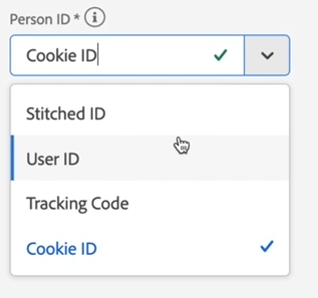
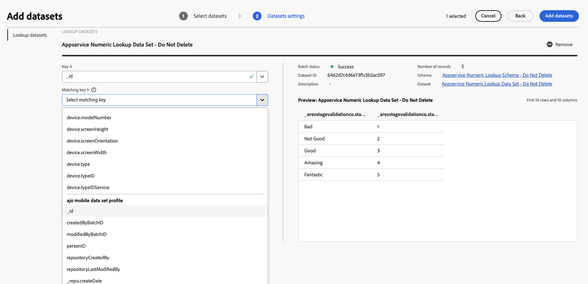
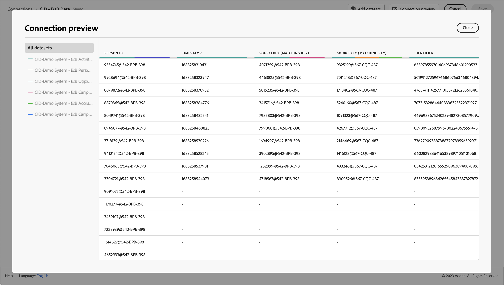
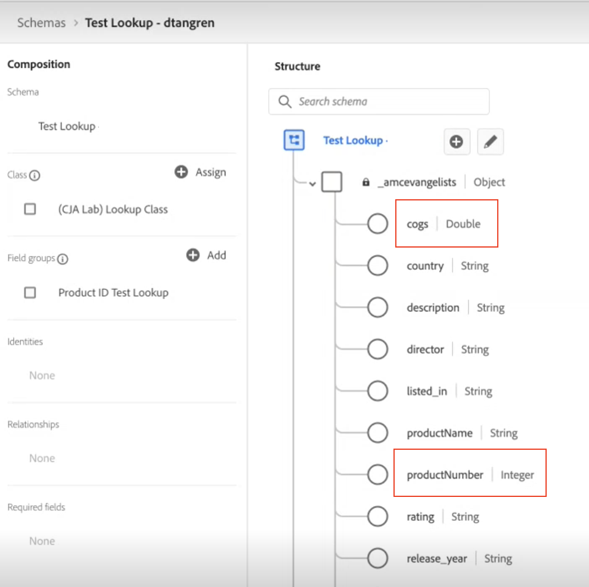
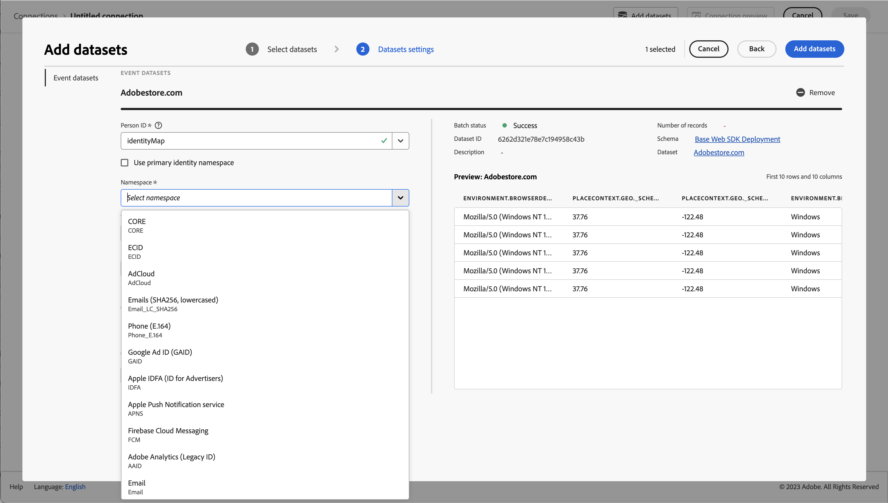

# Skapa eller redigera en anslutning {#create-or-edit-a-connection}

>[!CONTEXTUALHELP]
>id="cja_connections_recordsadded"
>title="Poster har lagts till"
>abstract="Antalet poster (rader) som lagts till i en anslutning under det valda tidsintervallet för de valda datauppsättningarna."

>[!CONTEXTUALHELP]
>id="cja_connections_recordsskipped"
>title="Överhoppade poster"
>abstract="Antalet poster (rader) som hoppats över under dataöverföring för en anslutning under det valda tidsintervallet för de valda datauppsättningarna."

>[!CONTEXTUALHELP]
>id="cja_connections_recordsdeleted"
>title="Borttagna poster"
>abstract="Antalet poster (rader) som tagits bort från en anslutning under det valda tidsintervallet för de valda datauppsättningarna."

>[!CONTEXTUALHELP]
>id="cja_connection_lastadded"
>title="Senast tillagd"
>abstract="Tidsstämpeln för den senaste batchen från en datauppsättning som överförts till en anslutning."

>[!CONTEXTUALHELP]
>id="cja_connection_enablerollingdatawindow"
>title="Aktivera rullande datafönster"
>abstract="Definiera datalagring som ett rullande fönster i månader på anslutningsnivå."

>[!CONTEXTUALHELP]
>id="cja_connection_averagenumberofdailyuses"
>title="Genomsnittligt antal dagliga användningar"
>abstract="Välj ett intervall för antalet förväntade dagliga händelser för hela anslutningen."

>[!CONTEXTUALHELP]
>id="connections_recordsadded"
>title="Poster har lagts till"
>abstract="Antalet poster (rader) som lagts till i en anslutning under det valda tidsintervallet för de valda datauppsättningarna."

>[!CONTEXTUALHELP]
>id="connections_recordsskipped"
>title="Överhoppade poster"
>abstract="Antalet poster (rader) som hoppats över under dataöverföring för en anslutning under det valda tidsintervallet för de valda datauppsättningarna."

>[!CONTEXTUALHELP]
>id="connections_recordsdeleted"
>title="Borttagna poster"
>abstract="Antalet poster (rader) som tagits bort från en anslutning under det valda tidsintervallet för de valda datauppsättningarna"

>[!CONTEXTUALHELP]
>id="connection_lastadded"
>title="Senast tillagd"
>abstract="Tidsstämpeln för den senaste batchen från en datauppsättning som överförts till en anslutning."

>[!CONTEXTUALHELP]
>id="connection_enablerollingdatawindow"
>title="Aktivera rullande datafönster"
>abstract="Definiera datalagring som ett rullande fönster i månader på anslutningsnivå."

>[!CONTEXTUALHELP]
>id="connection_averagenumberofdailyuses"
>title="Genomsnittligt antal dagliga användningar"
>abstract="Välj ett intervall för antalet förväntade dagliga händelser för hela anslutningen."

>[!CONTEXTUALHELP]
>id="connection_change_personid"
>title="Ändra identitetsinställningar "
>abstract="En ändring av identitetsinställningen tar bort anslutningsdata för den här datauppsättningen när du har sparat ändringarna i anslutningsgränssnittet. Du måste importera om data från datauppsättningen baserat på de nya inställningarna.<br/><br/>Rapporteringen kan fördröjas tills borttagningsprocessen har slutförts."

>[!CONTEXTUALHELP]
>id="connection_change_accountid"
>title="Ändra konto-ID"
>abstract="Om du ändrar konto-ID tas alla befintliga data i anslutningen bort och alla data från datauppsättningen hämtas igen baserat på det nya konto-ID:t. Den här åtgärden kan få konsekvenser för kostnaden. <br/><br/>När du väljer **[!UICONTROL Continue]** kan rapporteringen fördröjas tills processen har slutförts."

>[!CONTEXTUALHELP]
>id="connection_change_globalaccountid"
>title="Ändra globalt konto-ID"
>abstract="Om du ändrar det globala konto-ID:t tas alla befintliga data i anslutningen bort och alla data från datauppsättningen hämtas igen baserat på det nya globala konto-ID:t. Den här åtgärden kan få konsekvenser för kostnaden. <br/><br/>När du väljer **[!UICONTROL Continue]** kan rapporteringen fördröjas tills processen har slutförts."

>[!CONTEXTUALHELP]
>id="connection_change_opportunityid"
>title="Ändra affärsmöjlighets-ID"
>abstract="En ändring av affärsmöjlighets-ID tar bort alla befintliga data i anslutningen och återimporterar alla data från datauppsättningen baserat på det nya affärsmöjlighets-ID:t. Den här åtgärden kan få konsekvenser för kostnaden. <br/><br/>När du väljer **[!UICONTROL Continue]** kan rapporteringen fördröjas tills processen har slutförts."

>[!CONTEXTUALHELP]
>id="connection_change_buyinggroupid"
>title="Ändra inköpsgrupp-ID"
>abstract="En ändring av Buying Group ID tar bort alla befintliga data i anslutningen och alla data från datauppsättningen hämtas igen baserat på det nya Buying Group ID:t. Den här åtgärden kan få konsekvenser för kostnaden. <br/><br/>När du väljer **[!UICONTROL Continue]** kan rapporteringen fördröjas tills processen har slutförts."

>[!CONTEXTUALHELP]
>id="connection_change_persistentid"
>title="Ändra beständigt ID"
>abstract="En ändring av det beständiga ID:t tar bort alla befintliga data i anslutningen och återimporterar alla data från datauppsättningen baserat på det nya beständiga ID:t. Den här åtgärden kan få konsekvenser för kostnaden. <br/><br/>När du väljer **[!UICONTROL Continue]** kan rapporteringen fördröjas tills processen har slutförts."


<!-- Start of contextual help entries for CJA connection dialogs -->

>[!CONTEXTUALHELP]
>id="connections_useincja_exl_ajo"
>title="Använd den här anslutningen i Customer Journey Analytics"
>abstract="Med det här alternativet kan du utnyttja de avancerade rapportfunktionerna i Customer Journey Analytics med din Journey Optimizer-anslutning. Med dessa funktioner kan du:<ul><li>Utför en djupgående analys av Journey Optimizer-data i Customer Journey Analytics.</li><li>Redigera Journey Optimizer-anslutningen och associerade datavyer.</li><li>Analysera resehändelser, konversationsvägar och kampanjresultat.</li></ul>**När det här alternativet är aktiverat räknas varje datarad i anslutningen mot dina licensrader för Customer Journey Analytics varje månad och visas inom användargränssnittet för anslutningar.**<br><br/> Utforska bara det här alternativet om du känner dig bekväm med att använda rader med data i Customer Journey Analytics. [Läs mer](https://experienceleague.adobe.com/sv/docs/analytics-platform/using/integrations/ajo){target="_blank"}."

>[!CONTEXTUALHELP]
>id="connections_disableuseincja_exl_ajo"
>title="Ta bort den här anslutningen från Customer Journey Analytics"
>abstract="Den här Journey Optimizer-anslutningen används för närvarande i kundreseanalyser. Med anslutningarna kan du:<ul><li>Utför en djupgående analys av Journey Optimizer-data i Customer Journey Analytics.</li><li>Redigera Journey Optimizer-anslutningen och associerade datavyer.</li><li>Analysera resehändelser, konversationsvägar och kampanjresultat.</li></ul>**Om du tar bort anslutningen går det inte längre att göra en djupgående analys i Customer Journey Analytics. Anslutningen och eventuella associerade datavyer återställs till standardläget och kan inte längre redigeras.**<br/><br/>**Fakturering för den här anslutningen i Customer Journey Analytics omfattar hela månaden under vilken anslutningen tas bort.**<br/><br/> Anslutningen är fortfarande aktiverad i Journey Optimizer. [Läs mer](https://experienceleague.adobe.com/sv/docs/analytics-platform/using/integrations/ajo){target="_blank"}."

>[!CONTEXTUALHELP]
>id="connections_useincja_exl_brand_concierge"
>title="Använd den här anslutningen i Customer Journey Analytics"
>abstract="Med det här alternativet kan du utnyttja de avancerade rapportfunktionerna i Customer Journey Analytics med din Brand Concierge-anslutning. Med dessa funktioner kan du:<ul><li>Utför en djupgående analys av Brand Concierge-data i Customer Journey Analytics.</li><li>Redigera Brand Concierge-anslutningen och associerade datavyer.</li><li>Analysera konverteringsgraden, känslan och konverteringsgraden.</li></ul>**När det här alternativet är aktiverat räknas varje datarad i anslutningen mot dina licensrader för Customer Journey Analytics varje månad och visas inom användargränssnittet för anslutningar.**<br><br/> Utforska bara det här alternativet om du känner dig bekväm med att använda rader med data i Customer Journey Analytics. [Läs mer](https://experienceleague.adobe.com/sv/docs/analytics-platform/using/cja-workspace/templates/use-templates#brand-concierge-templates){target="_blank"}."

>[!CONTEXTUALHELP]
>id="connections_disableuseincja_exl_brand_concierge"
>title="Ta bort den här anslutningen från Customer Journey Analytics"
>abstract="Den här Brand Concierge-anslutningen används för närvarande i kundreseanalyser. Med anslutningarna kan du:<ul><li>Utför en djupgående analys av Brand Concierge-data i Customer Journey Analytics.</li><li>Redigera Brand Concierge-anslutningen och associerade datavyer.</li><li>Analysera konverteringsgraden, känslan och konverteringsgraden.</li></ul>**Om du tar bort anslutningen går det inte längre att göra en djupgående analys i Customer Journey Analytics. Anslutningen och eventuella associerade datavyer återställs till standardläget och kan inte längre redigeras.**<br/><br/>**Fakturering för den här anslutningen i Customer Journey Analytics omfattar hela månaden under vilken anslutningen tas bort.**<br/><br/> Anslutningen är fortfarande aktiverad i Brand Concierge. [Läs mer](https://experienceleague.adobe.com/sv/docs/analytics-platform/using/cja-workspace/templates/use-templates#brand-concierge-templates){target="_blank"}."

>[!CONTEXTUALHELP]
>id="connections_useincja_exl_product_usage"
>title="Använd den här anslutningen i Customer Journey Analytics"
>abstract="Med det här alternativet kan du utnyttja de avancerade rapporteringsfunktionerna i Customer Journey Analytics tillsammans med anslutningen för produktanvändning. Med dessa funktioner kan du:<ul><li>Utför djupgående analyser av produktanvändningsdata inom Customer Journey Analytics.</li><li>Redigera produktanvändningsanslutningen och associerade datavyer.</li></ul>**När det här alternativet är aktiverat räknas varje datarad i anslutningen mot dina licensrader för Customer Journey Analytics varje månad och visas inom användargränssnittet för anslutningar.**<br><br/> Utforska bara det här alternativet om du känner dig bekväm med att använda rader med data i Customer Journey Analytics. [Läs mer](https://experienceleague.adobe.com/sv/docs/analytics-platform/using/tools/product-usage/usage-overview){target="_blank"}."

>[!CONTEXTUALHELP]
>id="connections_disableuseincja_exl_product_usage"
>title="Ta bort den här anslutningen från Customer Journey Analytics"
>abstract="Den här produktanvändningsanslutningen används för närvarande i kundreseanalyser. Med anslutningarna kan du:<ul><li>Utför djupgående analyser av produktanvändningsdata inom Customer Journey Analytics.</li><li>Redigera produktanvändningsanslutningen och associerade datavyer.</li></ul>**Om du tar bort anslutningen går det inte längre att göra en djupgående analys i Customer Journey Analytics. Anslutningen och eventuella associerade datavyer återställs till standardläget och kan inte längre redigeras.**<br/><br/>**Fakturering för den här anslutningen i Customer Journey Analytics omfattar hela månaden under vilken anslutningen tas bort.**<br/><br/> Anslutningen är fortfarande aktiverad för produktanvändning. [Läs mer](https://experienceleague.adobe.com/sv/docs/analytics-platform/using/tools/product-usage/usage-overview){target="_blank"}."

>[!CONTEXTUALHELP]
>id="connections_useincja_legal_section_section"
>title="Juridiska konsekvenser"
>abstract="Customer Journey Analytics-användning kan leda till ytterligare avgifter baserat på integreringsdatavolymer. Se [information om fakturering och användning av Customer Journey Analytics](https://experienceleague.adobe.com/sv/docs/analytics-platform/using/cja-connections/manage-connections#connections-usage)"


>[!CONTEXTUALHELP]
>id="connections_useincja_exl_ajo_learn_more"
>title="Läs mer"
>abstract="[Läs mer](https://experienceleague.adobe.com/sv/docs/analytics-platform/using/cja-connections/manage-connections#connections-usage)."

>[!CONTEXTUALHELP]
>id="connections_useincja_exl_brand_concierge_learn_more"
>title="Läs mer"
>abstract="[Läs mer](https://experienceleague.adobe.com/sv/docs/analytics-platform/using/cja-workspace/templates/use-templates#brand-concierge-templates)."

>[!CONTEXTUALHELP]
>id="connections_useincja_exl_product_usage_learn_more"
>title="Läs mer"
>abstract="[Läs mer](https://experienceleague.adobe.com/sv/docs/analytics-platform/using/tools/product-usage/usage-overview)."

<!-- End of contextual help entries for CJA connection dialogs -->


Arbetsflödet för att skapa och redigera anslutningar gör att alla konfigurationsinställningar för datauppsättningar och anslutningar hamnar mitt på skärmen med ett hjälparbetsflöde. Den ger detaljerad information om val, konfiguration och granskning av datauppsättningar. Och gör att du kan ange viktig information som [datamängdstyp](#dataset-types), storlek, schema, datauppsättnings-ID, batchstatus, bakåtfyllnadsstatus, identiteter och mycket mer, för att minska risken för fel anslutningskonfiguration. Här är en översikt över funktionerna:

* Du kan aktivera ett rullande datalagringsfönster när du skapar anslutningen.
* Du kan lägga till och ta bort datauppsättningar från en anslutning. (Om du tar bort en datauppsättning tas den bort från anslutningen och påverkar associerade datavyer och underliggande Analysis Workspace-projekt.)
* Du kan aktivera och begära data för bakåtfyllnad per datauppsättning.
* Du kan redigera datauppsättningar, t.ex. för att begära en annan bakgrundsfyllning.
* Du kan importera befintliga data per datauppsättning.


>[!BEGINSHADEBOX]

Se  [Ansluta till datakällor](https://experienceleague.adobe.com/sv/docs/customer-journey-analytics-learn/tutorials/connections/connecting-customer-journey-analytics-to-data-sources-in-platform){target="_blank"} för en demonstrationsvideo.

>[!ENDSHADEBOX]


## Förutsättningar

Det maximala antalet datauppsättningar som du kan lägga till i en anslutning är 100. Blandningen beror på vilket Customer Journey Analytics-paket företaget har köpt.

Kontakta administratören om du är osäker på vilket Customer Journey Analytics-paket du har.

| **Välj**-paket | Paketet **Foundation** |
| --- | --- |
| Valfri kombination av händelse-, profil-, uppslags- eller sammanfattningsdatauppsättningar, vilket ger upp till 100 | En händelsedatamängd per anslutning |
|  | Upp till 99 profil-, uppslags- eller sammanfattningsdatauppsättningar per anslutning |

{style="table-layout:auto"}

## Skapa en anslutning {#create-connection}

Så här skapar du en anslutning:

1. I Customer Journey Analytics väljer du **[!UICONTROL Connections]**, eventuellt från **[!UICONTROL Data management]**, på den översta menyn.
1. Välj **[!UICONTROL Create new connection]**.

Du kan nu [redigera informationen för din anslutning](#edit-a-connection).

## Redigera en anslutning {#edit-connection}

Hur du redigerar anslutningen beror på vilket Customer Journey Analytics-paket du har licensierat:

* [Customer Journey Analytics](#customer-journey-analytics)
* [Customer Journey Analytics B2B edition](#customer-journey-analytics-b2b-edition)

### Customer Journey Analytics

På skärmen **[!UICONTROL Connections]** > **[!UICONTROL *Anslutningens namn *]**:


1. Konfigurera anslutningsinställningarna.

   | Inställning | Beskrivning |
   | --- | --- |
   | **[!UICONTROL Connection name]** | Ange ett unikt namn för anslutningen. |
   | **[!UICONTROL Connection description]** | Beskriv syftet med den här anslutningen. |
   | **[!UICONTROL Tags]** | Ange taggar för att lägga till taggar i anslutningen så att du kan använda de här taggarna för att söka efter anslutningen i ett senare skede. |
   | **[!UICONTROL Enable rolling data window]** | Om den här kryssrutan är markerad kan du definiera Customer Journey Analytics datalagring som ett rullande fönster på anslutningsnivå i månader (1 månad, 3 månader, 6 månader och så vidare).<p>Datalagringen baseras på tidsstämplar för händelsedatamängder och gäller endast för händelsedatamängder. Det finns ingen inställning för rullande datafönster för profil- eller uppslagsdatauppsättningar eftersom det inte finns några tillämpliga tidsstämplar. Om din anslutning innehåller en profil- eller uppslagsdatauppsättning (förutom en eller flera händelsedatamängder), behålls dessa data för samma tidsperiod.<p> Den största fördelen är att du bara lagrar eller rapporterar data som är tillämpliga och användbara och tar bort äldre data som inte längre är användbara. Det hjälper er att hålla er inom avtalsgränserna och minskar risken för överlagringskostnader.<p><ul><li>Om du låter standardinställningen (inte markerad) stå över kvarhållningsperioden för data i Adobe Experience Platform. Om ni har 25 månaders data i Experience Platform får Customer Journey Analytics 25 månaders data genom förifyllning. Om du raderade 10 av dessa månader i Experience Platform behåller Customer Journey Analytics de återstående 15 månaderna.</li><li>Om du aktiverar ett rullande datafönster anger du i **[!UICONTROL Select number of months]** det antal månader som du aktiverar det rullande datafönstret för. |
   | **[!UICONTROL Sandbox]** | Välj en sandlåda i Experience Platform som innehåller de datauppsättningar som du vill skapa en anslutning för.<p>Adobe Experience Platform tillhandahåller [sandlådor](https://experienceleague.adobe.com/sv/docs/experience-platform/sandbox/home) som partitionerar en enda plattformsinstans till separata virtuella miljöer för att utveckla och utveckla program för digitala upplevelser. Du kan tänka dig sandlådor som&quot;dataisoleringar&quot; som innehåller datauppsättningar. Sandlådor används för att styra åtkomst till datauppsättningar.<p>När du har valt sandlådan visas alla datauppsättningar i den sandlådan som du kan hämta från den vänstra listen. |
   | **[!UICONTROL Add datasets]** | Välj  **[!UICONTROL Add datasets]** om du vill lägga till datauppsättningar. Om anslutningen ännu inte har några datauppsättningar kan du även välja **[!UICONTROL Add datasets]** i datamängdstabellen. |


   För de datauppsättningar som du har konfigurerat visas följande kolumner i datatabellen:

   | Kolumn | Beskrivning |
   |---|---|
   | **[!UICONTROL Dataset name]** | Markera en eller flera datauppsättningar som du vill hämta till Customer Journey Analytics och välj **[!UICONTROL Add]**.<p>(Om du har många datauppsättningar att välja bland kan du söka efter rätt datauppsättningar med sökfältet Sök efter datauppsättningar ovanför listan med datauppsättningar.) |
   |  | Välj  om du vill öppna en snabbmeny för den valda datauppsättningen. Baserat på (typ av) datauppsättning kan du välja:<ul><li>  **[!UICONTROL Delete dataset]** till [ta bort en datauppsättning &#x200B;](#delete-a-dataset) .</li><li> **[!UICONTROL Edit dataset]** om du vill [redigera en datauppsättning](#edit-a-dataset).</li><li> **[!UICONTROL Past backfills]** om du vill visa [tidigare efterfyllningar för datauppsättningen](#past-backfills). |
   | **[!UICONTROL Last updated]** | Endast för händelsedatamängder anges den här inställningen automatiskt till standardfältet för tidsstämpling från händelsebaserade scheman i Experience Platform. &quot;Ej tillämpligt&quot; innebär att den här datauppsättningen inte innehåller några data. |
   | **[!UICONTROL Number of records]** | Det totala antalet poster under den föregående månaden för datauppsättningen i Experience Platform. |
   | **[!UICONTROL Schema]** | Det [schema](https://experienceleague.adobe.com/sv/docs/experience-platform/xdm/schema/composition) som baserar sig på vilken datauppsättningen skapades i Adobe Experience Platform. |
   | **[!UICONTROL Dataset type]** | För varje datauppsättning som du har lagt till i den här anslutningen anger Customer Journey Analytics automatiskt [datamängdstypen](#dataset-types) baserat på de data som kommer in. Det finns tre olika datamängdstyper: Händelsedata, Profildata och Uppslagsdata. Se tabellen nedan för en förklaring av datamängdstyperna. |
   | **[!UICONTROL Stitched]** | Om en datauppsättning är [aktiverad för sammanfogning i anslutningsgränssnittet &#x200B;](/help/stitching/use-stitching-ui.md) är värdet **[!UICONTROL true]**. Annars är värdet **[!UICONTROL false]**. Namngivna datamängder som är resultatet av [begäran om att fästa proceduren](/help/stitching//use-stitching.md) identifieras inte som sammanfogade i den här tabellen och har som standard värdet **[!UICONTROL false]**. |
   | **[!UICONTROL Granularity]** | Detaljrikedomen för data i datauppsättningen. Gäller endast för sammanfattningsdatauppsättningar. |
   | **[!UICONTROL Data source type]** | Datamängdens datakälltyp. Gäller inte för sammanfattningsdatauppsättningar. |
   | **[!UICONTROL Person ID]** | Det person-ID som används för att stödja personbaserad rapportering för datauppsättningen. |
   | **[!UICONTROL Key]** | Nyckeln som används för en uppslagsdatauppsättning. |
   | **[!UICONTROL Matching Key]** | Den matchande nyckel som används för en uppslagsdatauppsättning. |
   | **[!UICONTROL Import new data]** | Status för import av nya data för datauppsättningen: <p>   **[!UICONTROL _x _On]**&#x200B;om datauppsättningen är konfigurerad att importera nya data, och<p>   **[!UICONTROL _x Av_]** om datauppsättningen är konfigurerad att inte importera nya data. |
   | **[!UICONTROL Backfill data]** | Status för data för bakgrundsfyllning för datauppsättningen.<p>   **[!UICONTROL _x _backfills failed]**&#x200B;for number of failed backfills,<p>   **[!UICONTROL _x _backfills processing]**&#x200B;för antal bearbetning av bakåtfyllningar,<p>   **[!UICONTROL _x _backfills completed]**&#x200B;för antal slutförda backfiller, och<p>   **[!UICONTROL _Av_]** om inga bakåtfyllningar är konfigurerade. |

   Du kan söka efter en viss datauppsättning med hjälp av fältet .

### Customer Journey Analytics B2B edition

[!BADGE B2B edition]{type=Informative url="https://experienceleague.adobe.com/sv/docs/analytics-platform/using/cja-overview/cja-b2b/cja-b2b-edition" newtab=true tooltip="Customer Journey Analytics B2B edition"}

På skärmen **[!UICONTROL Connections]** > **[!UICONTROL *Anslutningens namn *]**:


1. Konfigurera anslutningsinställningarna.

   | Inställning | Beskrivning |
   | --- | --- |
   | **[!UICONTROL Connection name]** | Ange ett unikt namn för anslutningen. |
   | **[!UICONTROL Connection description]** | Beskriv syftet med den här anslutningen. |
   | **[!UICONTROL Tags]** | Ange taggar för att lägga till taggar i anslutningen så att du kan använda de här taggarna för att söka efter anslutningen i ett senare skede. |
   | **[!UICONTROL Primary ID]** | Välj rätt primärt ID för anslutningen: <ul><li> **[!UICONTROL Person]** för en personbaserad anslutning som du vanligtvis använder i ett B2C-scenario.</li><li>  **[!UICONTROL Account]** för en kontobaserad anslutning som du vanligtvis använder i ett B2B-scenario.</li></ul>När du lägger till en eller flera datauppsättningar i anslutningen kan du inte längre ändra det primära ID:t. <br/>Valet av det primära ID:t definierar om anslutningen är personbaserad eller kontobaserad. Anslutningsbasen avgör vilka [inställningar](#dataset-settings) som är tillgängliga för vissa typer av datauppsättningar. |
   | **[!UICONTROL Optional containers]** | Om du har valt  **[!UICONTROL Account]** som **[!UICONTROL Primary ID]** väljer du ytterligare behållare.<ul><li>**[!UICONTROL Global account]**: aktiverar konfiguration av globala konton i en anslutning.</li><li>**[!UICONTROL Opportunity]**: aktiverar konfiguration av affärsmöjligheter i en anslutning.</li><li>**[!UICONTROL Buying group]**: aktiverar konfiguration av inköpsgrupper i en anslutning.</li><ul> |
   | **[!UICONTROL Sandbox]** | Välj en sandlåda i Experience Platform som innehåller de datauppsättningar som du vill skapa en anslutning till.<p>Adobe Experience Platform tillhandahåller [sandlådor](https://experienceleague.adobe.com/sv/docs/experience-platform/sandbox/home) som partitionerar en enda plattformsinstans till separata virtuella miljöer för att utveckla och utveckla program för digitala upplevelser. Du kan tänka dig sandlådor som&quot;dataisoleringar&quot; som innehåller datauppsättningar. Sandlådor används för att styra åtkomst till datauppsättningar.<p>När du har valt sandlådan visas alla datauppsättningar i den sandlådan som du kan hämta från den vänstra listen. |
   | **[!UICONTROL Enable rolling data window]** | Om den här kryssrutan är markerad kan du definiera Customer Journey Analytics datalagring som ett rullande fönster på anslutningsnivå i månader (1 månad, 3 månader, 6 månader och så vidare).<p>Datalagringen baseras på tidsstämplar för händelsedatamängder och gäller endast för händelsedatamängder. Det finns ingen inställning för rullande datafönster för profil- eller uppslagsdatauppsättningar eftersom det inte finns några tillämpliga tidsstämplar. Om din anslutning innehåller en profil- eller uppslagsdatauppsättning (förutom en eller flera händelsedatamängder), behålls dessa data för samma tidsperiod.<p> Den största fördelen är att du bara lagrar eller rapporterar data som är tillämpliga och användbara och tar bort äldre data som inte längre är användbara. Det hjälper er att hålla er inom avtalsgränserna och minskar risken för överlagringskostnader.<p><ul><li>Om du låter standardinställningen (inte markerad) stå över kvarhållningsperioden för data i Adobe Experience Platform. Om ni har 25 månaders data i Experience Platform får Customer Journey Analytics 25 månaders data genom förifyllning. Om du raderade 10 av dessa månader i Platform behåller Customer Journey Analytics de återstående 15 månaderna.</li><li>Om du aktiverar ett rullande datafönster anger du i **[!UICONTROL Select number of months]** det antal månader som du aktiverar det rullande datafönstret för. |
   | **[!UICONTROL Add datasets]** | Välj  **[!UICONTROL Add datasets]** för att [lägga till datauppsättningar](#add-datasets). Om anslutningen ännu inte har några datauppsättningar kan du även välja **[!UICONTROL Add datasets]** i datamängdstabellen. |


   För de datauppsättningar som du har konfigurerat visas följande kolumner i datatabellen:

   | Kolumn | Beskrivning |
   |---|---|
   | **[!UICONTROL Dataset name]** | Markera en eller flera datauppsättningar som du vill hämta till Customer Journey Analytics och välj **[!UICONTROL Add]**.<p>(Om du har många datauppsättningar att välja bland kan du söka efter rätt datauppsättningar med sökfältet Sök efter datauppsättningar ovanför listan med datauppsättningar.) |
   |  | Välj  om du vill öppna en snabbmeny för den valda datauppsättningen. Baserat på (typ av) datauppsättning kan du välja:<ul><li>  **[!UICONTROL Delete dataset]** till [ta bort en datauppsättning &#x200B;](#delete-a-dataset) .</li><li> **[!UICONTROL Edit dataset]** om du vill [redigera en datauppsättning](#edit-a-dataset).</li><li> **[!UICONTROL Past backfills]** om du vill visa [tidigare efterfyllningar för datauppsättningen](#past-backfills). |
   | **[!UICONTROL Last updated]** | Endast för händelsedatamängder anges den här inställningen automatiskt till standardfältet för tidsstämpling från händelsebaserade scheman i Experience Platform. &quot;Ej tillämpligt&quot; innebär att den här datauppsättningen inte innehåller några data. |
   | **[!UICONTROL Number of records]** | Det totala antalet poster under den föregående månaden för datauppsättningen i Experience Platform. |
   | **[!UICONTROL Schema]** | Det [schema](https://experienceleague.adobe.com/sv/docs/experience-platform/xdm/schema/composition) som baserar sig på vilken datauppsättningen skapades i Adobe Experience Platform. |
   | **[!UICONTROL Dataset type]** | För varje datauppsättning som du har lagt till i den här anslutningen anger Customer Journey Analytics automatiskt [datamängdstypen](#dataset-types) baserat på de data som kommer in. |
   | **[!UICONTROL Granularity]** | Detaljrikedomen för data i datauppsättningen. Gäller endast för sammanfattningsdatauppsättningar. |
   | **[!UICONTROL Data source type]** | Datamängdens datakälltyp. Gäller inte för sammanfattningsdatauppsättningar. |
   | **[!UICONTROL Account ID]** | (visas endast för kontobaserade anslutningar) Det konto-ID som används för att stödja kontobaserad rapportering för datauppsättningen. |
   | **[!UICONTROL Global Account ID]** | (visas endast för kontobaserade anslutningar) Det globala konto-ID som används för att stödja kontobaserad rapportering för datauppsättningen. |
   | **[!UICONTROL Buying Group ID]** | (visas endast för kontobaserade anslutningar) Det ID för inköpsgrupp som används för att söka efter inköpsgruppsdata. |
   | **[!UICONTROL Opportunity ID]** | (visas endast för kontobaserade anslutningar) Det säljprojekt-ID som används för att söka efter affärsmöjlighetsdata. |
   | **[!UICONTROL Person ID]** | Det person-ID som används för att stödja personbaserad rapportering för datauppsättningen. |
   | **[!UICONTROL Key]** | Nyckeln som används för en uppslagsdatauppsättning. |
   | **[!UICONTROL Matching Key]** | Den matchande nyckel som används för en uppslagsdatauppsättning. |
   | **[!UICONTROL Import new data]** | Status för import av nya data för datauppsättningen: <p>   **[!UICONTROL _x _On]**&#x200B;om datauppsättningen är konfigurerad att importera nya data, och<p>   **[!UICONTROL _x Av_]** om datauppsättningen är konfigurerad att inte importera nya data. |
   | **[!UICONTROL Backfill data]** | Status för data för bakgrundsfyllning för datauppsättningen.<p>   **[!UICONTROL _x _backfills failed]**&#x200B;for number of failed backfills,<p>   **[!UICONTROL _x _backfills processing]**&#x200B;för antal bearbetning av bakåtfyllningar,<p>   **[!UICONTROL _x _backfills completed]**&#x200B;för antal slutförda backfiller, och<p>   **[!UICONTROL _Av_]** om inga bakåtfyllningar är konfigurerade. |

   Du kan söka efter en viss datauppsättning med hjälp av fältet .

## Datauppsättningar {#datasets}

Du [lägger till en eller flera datauppsättningar](#add-datasets) eller [redigerar befintliga datauppsättningar](#edit-a-dataset) som en del av anslutningsarbetsflödet.

>[!NOTE]
>
>Värden som är tidigare än år 1900 för datum- och datum-tid-fält i en rad i en datauppsättning ersätts med värdet `null` innan raden hämtas.<br/>Rader i en händelse- eller sammanfattningsdatauppsättning med ett tidsstämpelvärde före år 1900 tas bort från inmatningen.


{{relational-model-based}}


>[!CONTEXTUALHELP]
>id="cja_connection_primaryid"
>title="Primärt ID"
>abstract="Välj rätt primärt ID för anslutningen: Person för ett B2C-scenario. Konto för ett B2B-scenario."

>[!CONTEXTUALHELP]
>id="cja_connection_optionalcontainers"
>title="Valfria behållare"
>abstract="Välj ytterligare behållare.<br/><br/>**[!UICONTROL Global account]**: aktiverar konfiguration av globala konton i en anslutning.<br/>**[!UICONTROL Opportunity]**: aktiverar konfiguration av affärsmöjligheter i en anslutning.<br/>**[!UICONTROL Buying group]**: aktiverar konfiguration av inköpsgrupper i en anslutning."

>[!CONTEXTUALHELP]
>id="cja_connection_accountid"
>title="Konto-ID"
>abstract="Välj ett konto-ID (den unika identifieraren för ett konto) bland de tillgängliga identiteter som definieras i datauppsättningsschemat i Experience Platform."

>[!CONTEXTUALHELP]
>id="cja_connection_accountfield"
>title="Kontofält"
>abstract="Välj ett fält som representerar konto-ID:t (den unika identifieraren för ett konto)."

>[!CONTEXTUALHELP]
>id="cja_connection_globalaccountid"
>title="ID för globalt konto"
>abstract="Välj ett globalt konto-ID (den unika identifieraren för ett globalt konto) bland de tillgängliga identiteter som du har definierat i datauppsättningsschemat i Experience Platform."

>[!CONTEXTUALHELP]
>id="cja_connection_opportunityid"
>title="ID för affärsmöjlighet"
>abstract="Välj ett säljprojekt-ID (den unika identifieraren för en affärsmöjlighet) bland de tillgängliga identiteter som du har definierat i datauppsättningsschemat i Experience Platform."

>[!CONTEXTUALHELP]
>id="cja_connection_buyinggroupid"
>title="ID för inköpsgrupp"
>abstract="Välj ett Buying Group ID (den unika identifieraren för en inköpsgrupp) bland de tillgängliga identiteter som du har definierat i dataschemat i Experience Platform."

>[!CONTEXTUALHELP]
>id="cja_connection_personid"
>title="Person-ID"
>abstract="Välj ett person-ID (den unika identifieraren för en person) bland de tillgängliga identiteter som du har definierat i datauppsättningsschemat i Experience Platform."

>[!CONTEXTUALHELP]
>id="cja_connection_matchingkey"
>title="Matchningsnyckel"
>abstract="Välj ett fält som du vill koppla ihop med en av händelsedatamängderna. Om den här listan är tom har du förmodligen inte lagt till eller konfigurerat någon händelsedatamängd."

>[!CONTEXTUALHELP]
>id="cja_connection_importnewdata"
>title="Importera nya data"
>abstract="Eventuella nya batchar som läggs till i Experience Platform dataset läggs automatiskt till i den här anslutningen och blir tillgängliga för analys."

>[!CONTEXTUALHELP]
>id="cja_connection_datasetbackfill"
>title="Backfill-fyllning för datauppsättning"
>abstract="Med det här alternativet återfylls befintliga (historiska) data från Experience Platform för den här datauppsättningen i anslutningen."

>[!CONTEXTUALHELP]
>id="cja_connection_transformdataset"
>title="Omforma datauppsättning"
>abstract="Det här alternativet omformar datauppsättningen så att den kan användas för personbaserade sökningar i B2B-scenarier. När den är aktiverad är omvandlingen av datauppsättningen oåterkallelig."

>[!CONTEXTUALHELP]
>id="cja_connection_connectionmap"
>title="Anslutningskarta"
>abstract="Anslutningskartan visar relationerna mellan händelse-, person-, konto- och relevanta sökdatauppsättningar (som affärsmöjligheter, kampanjmedlemmar med mera)."

>[!CONTEXTUALHELP]
>id="connection_primaryid"
>title="Primärt ID"
>abstract="Välj rätt primärt ID för anslutningen: Person för ett B2C-scenario. Konto för ett B2B-scenario."

>[!CONTEXTUALHELP]
>id="connection_optionalcontainers"
>title="Valfria behållare"
>abstract="Välj ytterligare behållare.<br/><br/>**[!UICONTROL Global account]**: aktiverar konfiguration av globala konton i en anslutning.<br/>**[!UICONTROL Opportunity]**: aktiverar konfiguration av affärsmöjligheter i en anslutning.<br/>**[!UICONTROL Buying group]**: aktiverar konfiguration av inköpsgrupper i en anslutning."

>[!CONTEXTUALHELP]
>id="connection_personid"
>title="Person-ID"
>abstract="Välj ett person-ID bland de tillgängliga identiteter som definieras i datauppsättningsschemat i Experience Platform."

>[!CONTEXTUALHELP]
>id="connection_accountid"
>title="Konto-ID"
>abstract="Välj ett konto-ID (den unika identifieraren för ett konto) bland de tillgängliga identiteter som definieras i datauppsättningsschemat i Experience Platform."

>[!CONTEXTUALHELP]
>id="connection_accountfield"
>title="Kontofält"
>abstract="Välj ett fält som representerar konto-ID:t (den unika identifieraren för ett konto)."

>[!CONTEXTUALHELP]
>id="connection_globalaccountid"
>title="ID för globalt konto"
>abstract="Välj ett globalt konto-ID (den unika identifieraren för ett globalt konto) bland de tillgängliga identiteter som du har definierat i datauppsättningsschemat i Experience Platform."

>[!CONTEXTUALHELP]
>id="connection_opportunityid"
>title="ID för affärsmöjlighet"
>abstract="Välj ett säljprojekt-ID (den unika identifieraren för en affärsmöjlighet) bland de tillgängliga identiteter som du har definierat i datauppsättningsschemat i Experience Platform."

>[!CONTEXTUALHELP]
>id="connection_buyinggroupid"
>title="ID för inköpsgrupp"
>abstract="Välj ett Buying Group ID (den unika identifieraren för en inköpsgrupp) bland de tillgängliga identiteter som du har definierat i dataschemat i Experience Platform."

>[!CONTEXTUALHELP]
>id="connection_matchingkey"
>title="Matchningsnyckel"
>abstract="Välj ett fält som du vill koppla ihop med en av händelsedatamängderna. Om den här listan är tom har du förmodligen inte lagt till eller konfigurerat någon händelsedatamängd."

>[!CONTEXTUALHELP]
>id="connection_matchingkeytype"
>title="Matchande nyckeltyp"
>abstract="Välj hur du vill ansluta: baserat på en matchning per fält eller matchning per behållare.<br/><br/>**[!UICONTROL Match by field]**: Välj ett fält som du vill koppla ihop med en av händelsedatamängderna. Om den här listan är tom har du förmodligen inte lagt till eller konfigurerat någon händelsedatamängd.<br/>**[!UICONTROL Match by container]**: Välj en behållare som ska användas för att ansluta till en av händelsedatamängderna."

>[!CONTEXTUALHELP]
>id="connection_importnewdata"
>title="Importera nya data"
>abstract="Alla nya batchar som läggs till i Experience Platform dataset läggs till automatiskt i den här anslutningen och blir tillgängliga för analys."

>[!CONTEXTUALHELP]
>id="connection_datasetbackfill"
>title="Backfill-fyllning för datauppsättning"
>abstract="Med det här alternativet återfylls befintliga (historiska) data från Experience Platform för den här datauppsättningen i anslutningen."

>[!CONTEXTUALHELP]
>id="connection_transformdataset"
>title="Omforma datauppsättning"
>abstract="Det här alternativet omformar datauppsättningen så att den kan användas för personbaserade sökningar i B2B-scenarier. När den är aktiverad är omvandlingen av datauppsättningen oåterkallelig."

>[!CONTEXTUALHELP]
>id="connection_connectionmap"
>title="Anslutningskarta"
>abstract="Anslutningskartan visar relationerna mellan händelse-, person-, konto- och relevanta sökdatauppsättningar (som affärsmöjligheter, kampanjmedlemmar med mera)."

>[!CONTEXTUALHELP]
>id="connection_stitching_enable"
>title="Aktivera identitetssammanfogning"
>abstract="Aktivera identitetssammanfogning för att höja den här händelsedatauppsättningen för flerkanalsanalys."
>additional-url="https://experienceleague.adobe.com/sv/docs/analytics-platform/using/stitching/overview" text="Översikt över titlar"

>[!CONTEXTUALHELP]
>id="connection_stitching_dialog"
>title="Identitetssammanfogning"
>abstract="Aktivera identitetssammanfogning för att härleda användaridentitetsinformation från en datauppsättning eller från identitetsdiagrammet. Denna process kan omfatta sammanfogning av användardata från autentiserade och oautentiserade sessioner.<br/><br/>Du ansvarar för att följa tillämpliga lagar och bestämmelser. Kompatibiliteten innebär att du får de nödvändiga slutanvändarbehörigheterna innan du aktiverar sammanslagning på en datauppsättning."
>additional-url="https://experienceleague.adobe.com/sv/docs/analytics-platform/using/stitching/overview" text="Översikt över titlar"

>[!CONTEXTUALHELP]
>id="connection_persistentid"
>title="Beständigt ID"
>abstract="Välj ett beständigt ID bland de tillgängliga identiteterna. Ett beständigt ID är en identifierare som är tillgänglig för alla händelser i händelsedatamängden."
>additional-url="https://experienceleague.adobe.com/sv/docs/analytics-platform/using/stitching/overview" text="Översikt över titlar"

>[!CONTEXTUALHELP]
>id="connection_lookbackwindow"
>title="Uppspelningsfönster"
>abstract="Välj lämplig tidsperiod för repriseringsfönstret som ska användas vid sammanfogning."
>additional-url="https://experienceleague.adobe.com/sv/docs/analytics-platform/using/stitching/overview" text="Översikt över titlar"

>[!CONTEXTUALHELP]
>id="connection_namespace_map"
>title="Identitetskarta för namnområde"
>abstract="Välj det namnutrymme som ska användas för att välja identifierare från identitetskartan."
>additional-url="https://experienceleague.adobe.com/sv/docs/analytics-platform/using/stitching/overview" text="Översikt över titlar"

>[!CONTEXTUALHELP]
>id="connection_namespace_graph"
>title="Identitetsdiagram för namnområde"
>abstract="Välj det namnutrymme som ska användas för att välja identifierare från identitetskartan."
>additional-url="https://experienceleague.adobe.com/sv/docs/analytics-platform/using/stitching/overview" text="Översikt över titlar"


### Datamängdstyper {#dataset-types}

För varje datauppsättning som du lägger till i den här anslutningen anger [!UICONTROL Customer Journey Analytics] automatiskt datamängdstypen baserat på de data som kommer in.

>[!IMPORTANT]
>
>Lägg till minst en händelse- eller sammanfattningsdatauppsättning (standard eller av typen ad hoc eller relation) i anslutningen.

Det finns olika datamängdstyper: [!UICONTROL Event] data, [!UICONTROL Profile] data, [!UICONTROL Lookup] data och [!UICONTROL Summary] data, var och en baserat på deras motsvarande XDM-baserade schema.

| Datauppsättningstyp | Beskrivning | Tidsstämpel | Schema | Konto-ID <br/> för person-ID [!BADGE B2B edition]{type=Informative url="https://experienceleague.adobe.com/sv/docs/analytics-platform/using/cja-overview/cja-b2b/cja-b2b-edition" newtab=true tooltip="Customer Journey Analytics B2B edition"} |
|---|---|---|---|---|
| **[!UICONTROL Event]** | Data som representerar händelser i tid. Exempel: webbbesök, interaktioner, transaktioner, POS-data, undersökningsdata, annonsvisningsdata osv. Dessa data kan vara typiska klickströmsdata, med ett kund-ID eller ett cookie-ID och en tidsstämpel. Med händelsedata får du flexibilitet vad gäller vilket ID som används som person-ID. | Ange som standardtidsstämpelfält från händelsebaserade scheman i [!UICONTROL Experience Platform]. | Alla inbyggda eller anpassade scheman som baseras på en XDM-klass med beteendet *Tidsserie* . Exempel är *XDM Experience Event* eller *XDM Decision Event*. | Du kan välja vilket person-ID eller konto-ID [!BADGE B2B edition]{type=Informative url="https://experienceleague.adobe.com/sv/docs/analytics-platform/using/cja-overview/cja-b2b/cja-b2b-edition" newtab=true tooltip="Customer Journey Analytics B2B edition"} du vill inkludera. Varje datamängdsschema som definieras i Experience Platform kan ha en egen uppsättning av en eller flera identiteter som är definierade och associerade med ett identitetsnamnområde. Alla dessa identiteter kan användas som person-ID eller konto-ID [!BADGE B2B edition]{type=Informative url="https://experienceleague.adobe.com/sv/docs/analytics-platform/using/cja-overview/cja-b2b/cja-b2b-edition" newtab=true tooltip="Customer Journey Analytics B2B edition"}. Exempel är cookie-ID, Stitched ID, User ID, Tracking Code, Account ID [!BADGE B2B edition]{type=Informative url="https://experienceleague.adobe.com/sv/docs/analytics-platform/using/cja-overview/cja-b2b/cja-b2b-edition" newtab=true tooltip="Customer Journey Analytics B2B edition"} och så vidare. |
| **[!UICONTROL Lookup]** | Du kan lägga till datauppsättningar som uppslag med fält inom alla datamängdstyper: Profil-, uppslags- och händelsedatamängder (den sistnämnda stöds alltid). Den här extrafunktionen utökar Customer Journey Analytics förmåga att stödja komplexa datamodeller, inklusive B2B. Dessa data används för att söka efter värden eller nycklar som finns i dina Event-, Profile- eller Lookup-data. Du kan lägga till upp till tre söknivåer. (Observera att [Härledda fält](/help/data-views/derived-fields/derived-fields.md) inte kan användas som matchande nycklar för uppslag i anslutningar.) Du kan till exempel överföra sökdata som mappar numeriska ID:n i händelsedata till produktnamn. Se [B2B-exemplet](/help/use-cases/b2b/example.md) för ett exempel. | Ej tillämpligt | Alla inbyggda eller anpassade scheman som baseras på en XDM-klass med beteendet *Record*, förutom klassen *XDM Individual Profile* . | Ej tillämpligt |
| **[!UICONTROL Profile]** | Data som tillämpas på ditt konto, personer, användare eller kunder i [!UICONTROL Event]-data. Du kan till exempel överföra CRM-data om dina kunder. | Ej tillämpligt | Alla inbyggda eller anpassade scheman som baseras på klassen *XDM Individual Profile* . | Du kan välja vilket person-ID eller konto-ID [!BADGE B2B edition]{type=Informative url="https://experienceleague.adobe.com/sv/docs/analytics-platform/using/cja-overview/cja-b2b/cja-b2b-edition" newtab=true tooltip="Customer Journey Analytics B2B edition"} du vill inkludera. Varje datauppsättning (utom sammanfattningsdatauppsättningar), som definieras i [!DNL Experience Platform], har en egen uppsättning med ett eller flera person-ID:n eller konto-ID:n [!BADGE B2B edition]{type=Informative url="https://experienceleague.adobe.com/sv/docs/analytics-platform/using/cja-overview/cja-b2b/cja-b2b-edition" newtab=true tooltip="Customer Journey Analytics B2B edition"} definierade. Till exempel cookie-ID, Stitched ID, User ID, Tracking Code, Account ID och så vidare.<br>**Obs!** Om du skapar en anslutning som innehåller datauppsättningar med olika ID:n, visas detta i rapporten. Om du vill sammanfoga datauppsättningar måste du använda samma person-ID eller konto-ID [!BADGE B2B edition]{type=Informative url="https://experienceleague.adobe.com/sv/docs/analytics-platform/using/cja-overview/cja-b2b/cja-b2b-edition" newtab=true tooltip="Customer Journey Analytics B2B edition"}. |
| **Sammanfattning** | Tidsseriedata som inte är associerade med ett enskilt person-ID. Sammanfattningsdata representerar aggregerade data på en annan aggregeringsnivå, till exempel kampanjer. Du kan använda dessa data i Customer Journey Analytics för att stödja olika användningsfall. Mer information finns i [Sammanfattningsdata](/help/data-views/summary-data.md). | Ställ automatiskt in standardtidsstämpelsfältet från händelsebaserade scheman för summering i Experience Platform. Endast kornighet varje timme eller dag stöds. | Alla inbyggda eller anpassade scheman som baseras på klassen *XDM Summary Metrics* . | Ej tillämpligt |

Datamängdstyperna ovan kan också baseras på ett ad hoc- eller relationsschema i stället för ett generiskt XDM-baserat schema.

| Datauppsättningstyp | Beskrivning | Tidsstämpel | Schema | Person-ID |
|---|---|---|---|---|
| **[!UICONTROL Adhoc]** | Ad hoc-data baserade på ett [ad hoc-schema](https://experienceleague.adobe.com/sv/docs/experience-platform/xdm/api/ad-hoc) med fält som namnges för användning endast av en enskild datauppsättning. | Beroende på vilken datamängdstyp du väljer för ad hoc-datauppsättningen. | Alla ad hoc-scheman som baseras på en klass baserat på *ad hoc* -beteendet | Beroende på vilken datamängdstyp du väljer för ad hoc-datauppsättningen. |
| **[!UICONTROL Model]** | Relationsdata baserade på ett relationsschema. | Beroende på vilken datamängdstyp du väljer för relationsdatauppsättningen. | Alla relationsscheman. | Beroende på vilken datamängdstyp du väljer för relationsdatauppsättningen. |


### Lägg till datauppsättningar

Du kan lägga till en eller flera Experience Platform-datauppsättningar när du skapar eller redigerar en anslutning.


1. I **[!UICONTROL Connection]** > **[!UICONTROL _Namnet på anslutningsgränssnittet_]** väljer du  **[!UICONTROL Add datasets]**.

1. I steget ➊ **[!UICONTROL Select datasets]** visas en lista med Experience Platform-datauppsättningar.

   

   För varje datauppsättning visas följande i listan:

   | Kolumn | Beskrivning |
   |---|---|
   | **[!UICONTROL Dataset]** | Datauppsättningens namn. Markera namnet som du vill dirigera till datauppsättningen i Experience Platform. Välj  om du vill visa ett popup-fönster med mer information om datauppsättningen. Du kan välja **[!UICONTROL Edit in Platform]** om du vill redigera datauppsättningen direkt i Experience Platform. |
   | **[!UICONTROL Dataset type]** | Datatypen: [Event](#event-dataset), [Profile](#profile-dataset), [Lookup](#lookup-dataset), [Summary](#summary-dataset), [Adhoc](#ad-hoc-dataset) eller [Relational](#relational-dataset). |
   | **[!UICONTROL Number of records]** | Det totala antalet poster under den föregående månaden för datauppsättningen i Experience Platform. |
   | **[!UICONTROL Schema]** | Schemat för datauppsättningen. Markera namnet som du vill dirigera till schemat i Experience Platform. |
   | **[!UICONTROL Last batch]** | Status för den senaste batchen som importerats till Experience Platform. Mer information finns i [Gruppstatus](https://experienceleague.adobe.com/sv/docs/experience-platform/ingestion/batch/troubleshooting#batch-states). |
   | **[!UICONTROL Dataset ID]** | Datauppsättningens ID. |
   | **[!UICONTROL Last updated]** | Den senaste uppdaterade tidsstämpeln för datauppsättningen. |

   * Om du vill ändra vilka kolumner som visas för listan med datauppsättningar väljer du  och markerar de kolumner som ska visas i dialogrutan [!UICONTROL Customize table].
   * Om du vill söka efter en viss datauppsättning använder du sökfältet .
   * Om du vill växla mellan att visa eller dölja de markerade datauppsättningarna väljer du  **[!UICONTROL Hide selected]** eller **[!UICONTROL Show selected]**.
   * Om du vill ta bort en datauppsättning från listan med valda datauppsättningar använder du . Om du vill ta bort alla markerade datauppsättningar väljer du **[!UICONTROL Clear all]**.
   * Om du vill visa information om en datauppsättning väljer du .


1. Markera en eller flera datauppsättningar och välj **[!UICONTROL Next]**. Minst en händelse- eller sammanfattningsdatauppsättning måste ingå i anslutningen.

1. Konfigurera [inställningarna för var och en av de markerade datauppsättningarna](#dataset-settings), en i taget, i ➋ **[!UICONTROL Datasets settings]**-steget i dialogrutan **[!UICONTROL Add datasets]**.

   

1. Välj **[!UICONTROL Add datasets]** om du vill lägga till de konfigurerade datauppsättningarna i anslutningen. Du meddelas när du inte har angett alla nödvändiga inställningar för var och en av de datauppsättningar som du vill lägga till.

   Du kan också välja **[!UICONTROL Cancel]** om du vill avbryta tillägget av datauppsättningar i anslutningen. Eller välj **[!UICONTROL Back]** om du vill gå tillbaka till steget ➊ **[!UICONTROL Select datasets]**.


### Redigera en datauppsättning

Om du vill redigera en datauppsättning som redan har konfigurerats för en anslutning går du till **[!UICONTROL Connections]** > **[!UICONTROL _Anslutningens namn_]**:

1. Välj  för den datauppsättning som visas i datamängdstabellen som du vill redigera
1. Välj  **[!UICONTROL Edit dataset]**.

1. Konfigurera [datauppsättningsinställningarna](#dataset-settings) i dialogrutan **[!UICONTROL Edit dataset: _Datauppsättningsnamn_]**.

   

   >[!NOTE]
   >
   >Du kan inte redigera **[!UICONTROL Dataset type]**, **[!UICONTROL Person ID]**, **[!UICONTROL Identity namespace]** och **[!UICONTROL Timestamp]** för en [ad hoc](#ad-hoc-dataset)- eller [relationsdatauppsättning](#relational-dataset) som ingår i en sparad anslutning. Om du vill ändra någon av dessa inställningar:
   >
   >1. Ta bort den befintliga ad hoc- eller relationsdatauppsättningen från anslutningen.
   >1. Lägg till samma datauppsättning med uppdaterade inställningar för anslutningen.
   >

1. Välj **[!UICONTROL Apply]** om du vill använda datauppsättningsinställningarna. Välj **[!UICONTROL Cancel]** om du vill avbryta.


### Inställningar för datauppsättning

När du lägger till datauppsättningar eller redigerar en befintlig datauppsättning, konfigurerar du datauppsättningsinställningarna för varje datauppsättning. Vilka inställningar som är tillgängliga beror på [typen av datamängd](#dataset-types) och, för vissa datamängdstyper, på typen av anslutning (personbaserad eller [!BADGE B2B edition]{type=Informative url="https://experienceleague.adobe.com/sv/docs/analytics-platform/using/cja-overview/cja-b2b/cja-b2b-edition" newtab=true tooltip="Customer Journey Analytics B2B edition"} kontobaserad).

Alla datauppsättningar och datauppsättningstyper har [allmänna inställningar och information](#general-dataset-settings-and-details), t.ex. om nya data ska importeras eller inte samt efterfyllnad av begäran ska begäras.

#### Händelsedatamängd

De specifika inställningarna för en händelsedatamängd beror på typen av anslutning.

##### Personbaserad anslutning


För en händelsedatamängd i en personbaserad anslutning kan du ange:

| Inställning | Beskrivning |
| --- | --- |
| **[!UICONTROL Person ID]** | Välj ett person-ID i listrutan med tillgängliga identiteter. Dessa identiteter definierades i datauppsättningsschemat i Experience Platform. Mer information om hur du använder identitetskartan som ett person-ID finns i [Använd identitetskarta som ett person-ID](#use-identity-map-as-a-person-id).<p>Om det inte finns några person-ID:n att välja mellan, innebär det att inga person-ID:n definieras i schemat. Mer information finns i [Definiera identitetsfält i användargränssnittet](https://experienceleague.adobe.com/sv/docs/experience-platform/xdm/ui/fields/identity). <p>Värdet för det valda person-ID:t anses vara skiftlägeskänsligt. `abc123` och `ABC123` är till exempel två olika värden.<p>Om en post inte innehåller något värde för identiteten som du har valt som person-ID för händelsedatamängden, hoppas posten över. |
| **[!UICONTROL Enable identity stitching]** | Välj att [aktivera identitetssammanfogning](/help/stitching/overview.md) för den här händelsedatamängden. |
| **[!UICONTROL Timestamp]** | Den här inställningen ställs automatiskt in på standardfältet för tidsstämpling från händelsebaserade scheman i Experience Platform. |
| **[!UICONTROL Data source type]** | Välj en typ av datakälla. Typer av datakällor är bland annat: <ul><li>[!UICONTROL Web data]</li><li>[!UICONTROL Mobile App data]</li><li>[!UICONTROL POS data]</li><li>[!UICONTROL CRM data]</li><li>[!UICONTROL Survey data]</li><li>[!UICONTROL Call Center data]</li><li>[!UICONTROL Product data]</li><li> [!UICONTROL Accounts data]</li><li> [!UICONTROL Transaction data]</li><li>[!UICONTROL Customer Feedback data]</li><li> [!UICONTROL Other]</li></ul>Det här fältet används för att undersöka vilka typer av datakällor som används. |
| **[!UICONTROL Data source description]** | En beskrivning av datakällan när du har valt Annan som datakälltyp. |


##### Kontobaserad anslutning

[!BADGE B2B edition]{type=Informative url="https://experienceleague.adobe.com/sv/docs/analytics-platform/using/cja-overview/cja-b2b/cja-b2b-edition" newtab=true tooltip="Customer Journey Analytics B2B edition"}

Du kan ange följande för en händelsedatamängd i en kontobaserad anslutning:


| Inställning | Beskrivning |
| --- | --- |
| **[!UICONTROL Global Account ID]** | Välj ett globalt konto-ID (den unika identifieraren för ett konto) bland de tillgängliga identiteter som definieras i datauppsättningsschemat i Experience Platform. Gäller när du har lagt till ett globalt konto som en behållare i anslutningen. <p>Om en post inte innehåller något värde för identiteten som du har valt som konto-ID för händelsedatamängden, hoppas posten över. |
| **[!UICONTROL Account ID]** | Välj ett konto-ID (den unika identifieraren för ett konto) bland de tillgängliga identiteter som definieras i dataschemat i Experience Platform. Gäller när du inte har lagt till ett globalt konto som en behållare i anslutningen. |
| **[!UICONTROL Opportunity ID]** | Välj ett affärsmöjlighets-ID (den unika identifieraren för en affärsmöjlighet) bland de tillgängliga identiteter som definieras i datauppsättningsschemat i Experience Platform. |
| **[!UICONTROL Buying Group ID]** | Välj ett Buying Group ID (den unika identifieraren för en inköpsgrupp) bland de tillgängliga identiteter som definieras i dataschemat i Experience Platform. |
| **[!UICONTROL Person ID]** | Välj ett person-ID i listrutan med tillgängliga identiteter. Dessa identiteter definierades i datauppsättningsschemat i Experience Platform. Mer information om hur du använder identitetskartan som ett person-ID finns i [Använd identitetskarta som ett person-ID](#id-map).<p>Om det inte finns några person-ID:n att välja mellan, innebär det att ett eller flera person-ID:n inte har definierats i schemat. Mer information finns i [Definiera identitetsfält i användargränssnittet](https://experienceleague.adobe.com/sv/docs/experience-platform/xdm/ui/fields/identity). <p>Värdet för det valda person-ID:t anses vara skiftlägeskänsligt. `abc123` och `ABC123` är till exempel två olika värden. |
| **[!UICONTROL Timestamp]** | Den här inställningen ställs automatiskt in på standardfältet för tidsstämpling från händelsebaserade scheman i Experience Platform. |
| **[!UICONTROL Data source type]** | Välj en typ av datakälla. Typer av datakällor är bland annat: <ul><li>[!UICONTROL Web data]</li><li>[!UICONTROL Mobile App data]</li><li>[!UICONTROL POS data]</li><li>[!UICONTROL CRM data]</li><li>[!UICONTROL Survey data]</li><li>[!UICONTROL Call Center data]</li><li>[!UICONTROL Product data]</li><li> [!UICONTROL Accounts data]</li><li> [!UICONTROL Transaction data]</li><li>[!UICONTROL Customer Feedback data]</li><li> [!UICONTROL Other]</li></ul>Det här fältet används för att undersöka vilka typer av datakällor som används. |
| **[!UICONTROL Data source description]** | En beskrivning av datakällan när du har valt Annan som datakälltyp. |

#### Profildatamängd

De specifika inställningarna för en profildatauppsättning beror på anslutningstypen.

##### Personbaserad anslutning


För en profildatauppsättning i en personbaserad anslutning anger du:

| Inställning | Beskrivning |
| --- | --- |
| **[!UICONTROL Person ID]** | Välj ett person-ID i listrutan med tillgängliga identiteter. Dessa identiteter definierades i datauppsättningsschemat i Experience Platform. Mer information om hur du använder identitetskartan som ett person-ID finns i [Använd identitetskarta som ett person-ID](#id-map).<p>Om det inte finns några person-ID:n att välja bland definieras inga person-ID:n i schemat. Mer information finns i [Definiera identitetsfält i användargränssnittet](https://experienceleague.adobe.com/sv/docs/experience-platform/xdm/ui/fields/identity). <p>Värdet för det valda person-ID:t anses vara skiftlägeskänsligt. `abc123` och `ABC123` är till exempel två olika värden. <p>Om en post inte innehåller något värde för identiteten som du har valt som person-ID för profildatauppsättningen, hoppas posten över. |
| **[!UICONTROL Data source type]** | Välj en typ av datakälla. Typer av datakällor är bland annat: <ul><li>[!UICONTROL Web data]</li><li>[!UICONTROL Mobile App data]</li><li>[!UICONTROL POS data]</li><li>[!UICONTROL CRM data]</li><li>[!UICONTROL Survey data]</li><li>[!UICONTROL Call Center data]</li><li>[!UICONTROL Product data]</li><li> [!UICONTROL Accounts data]</li><li> [!UICONTROL Transaction data]</li><li>[!UICONTROL Customer Feedback data]</li><li> [!UICONTROL Other]</li></ul>Det här fältet används för att undersöka vilka typer av datakällor som används. |
| **[!UICONTROL Data source description]** | En beskrivning av datakällan när du har valt Annan som datakälltyp. |

#### Kontobaserad anslutning


För en profildatauppsättning i en kontobaserad anslutning anger du:

| Inställning | Beskrivning |
| --- | --- |
| **[!UICONTROL Person ID]** | Välj ett person-ID i listrutan med tillgängliga identiteter. Dessa identiteter definierades i datauppsättningsschemat i Experience Platform. Mer information om hur du använder identitetskartan som ett person-ID finns i [Använd identitetskarta som ett person-ID](#id-map).<p>Om det inte finns några person-ID:n att välja bland definieras inga person-ID:n i schemat. Mer information finns i [Definiera identitetsfält i användargränssnittet](https://experienceleague.adobe.com/sv/docs/experience-platform/xdm/ui/fields/identity). <p>Värdet för det valda person-ID:t anses vara skiftlägeskänsligt. `abc123` och `ABC123` är till exempel två olika värden. <p>Om en post inte innehåller något värde för identiteten som du har valt som person-ID för profildatauppsättningen, hoppas posten över. |
| **[!UICONTROL Global Account field]** | Välj ett globalt kontofält som ska ha stöd för kontobaserad rapportering för datauppsättningen från den nedrullningsbara menyn med tillgängliga identiteter. Gäller när du har lagt till ett globalt konto som en behållare i anslutningen. |
| **[!UICONTROL Account field]** | Välj ett kontofält som ska ha stöd för kontobaserad rapportering för datauppsättningen från den nedrullningsbara menyn med tillgängliga identiteter. Gäller när du inte har lagt till ett globalt konto som en behållare i anslutningen. |
| **[!UICONTROL Data source type]** | Välj en typ av datakälla. Typer av datakällor är bland annat: <ul><li>[!UICONTROL Web data]</li><li>[!UICONTROL Mobile App data]</li><li>[!UICONTROL POS data]</li><li>[!UICONTROL CRM data]</li><li>[!UICONTROL Survey data]</li><li>[!UICONTROL Call Center data]</li><li>[!UICONTROL Product data]</li><li> [!UICONTROL Accounts data]</li><li> [!UICONTROL Transaction data]</li><li>[!UICONTROL Customer Feedback data]</li><li> [!UICONTROL Other]</li></ul>Det här fältet används för att undersöka vilka typer av datakällor som används. |
| **[!UICONTROL Data source description]** | En beskrivning av datakällan när du har valt Annan som datakälltyp. |

#### Sök datauppsättning

De specifika inställningarna för en uppslagsdatauppsättning beror på anslutningstypen.

##### Personbaserad anslutning


För en uppslagsdatauppsättning i en personbaserad anslutning anger du:

| Inställningar | Beskrivning |
|---|---|
| **[!UICONTROL Key]** | Nyckeln som ska användas för en uppslagsdatauppsättning. <p>Om en post inte innehåller något värde för nyckeln som du har valt för uppslagsdatauppsättningen, hoppas posten över. |
| **[!UICONTROL Matching key]** | Den matchande nyckeln som ska användas i en av händelsedatamängderna. Om den här listan är tom har du förmodligen inte lagt till eller konfigurerat någon händelsedatamängd. |
| **[!UICONTROL Data source type]** | Välj en typ av datakälla. Typer av datakällor är bland annat: <ul><li>[!UICONTROL Web data]</li><li>[!UICONTROL Mobile App data]</li><li>[!UICONTROL POS data]</li><li>[!UICONTROL CRM data]</li><li>[!UICONTROL Survey data]</li><li>[!UICONTROL Call Center data]</li><li>[!UICONTROL Product data]</li><li> [!UICONTROL Accounts data]</li><li> [!UICONTROL Transaction data]</li><li>[!UICONTROL Customer Feedback data]</li><li> [!UICONTROL Other]</li></ul>Det här fältet används för att undersöka vilka typer av datakällor som används. |
| **[!UICONTROL Data source description]** | En beskrivning av datakällan när du har valt Annan som datakälltyp. |
| **[!UICONTROL Transform dataset]** | För specifika B2B-sökdatauppsättningar kan du aktivera omvandling av en datauppsättning för korrekta B2B-personbaserade rapportscenarier. Mer information finns i [Omforma datauppsättningar för B2B-sökningar](transform-datasets-b2b-lookups.md). |


##### Kontobaserad anslutning

[!BADGE B2B edition]{type=Informative url="https://experienceleague.adobe.com/sv/docs/analytics-platform/using/cja-overview/cja-b2b/cja-b2b-edition" newtab=true tooltip="Customer Journey Analytics B2B edition"}


För en uppslagsdatauppsättning i en kontobaserad anslutning kan du ange:

| Inställningar | Beskrivning |
|---|---|
| **[!UICONTROL Key]** | Nyckeln som ska användas för en uppslagsdatauppsättning. <p>Om en post inte innehåller något värde för nyckeln som du har valt för uppslagsdatauppsättningen, hoppas posten över. |
| **[!UICONTROL Matching key type]** | Välj hur du vill gå med i datauppsättningarna: baserat på en **[!UICONTROL Match by field]** eller **[!UICONTROL Match by container]**. Mer information finns i [Matcha efter fältbehållare](/help/getting-started/cja-b2b-concepts-features.md#match-by-container-or-field). |
| **[!UICONTROL Matching key]** | Den matchande nyckeln som ska användas i en av händelsedatamängderna. Om den här listan är tom har du förmodligen inte lagt till eller konfigurerat någon händelsedatamängd. <br/><br/>Baserat på din **[!UICONTROL Matching key type]** väljer du lämpligt värde:<ul><li>**[!UICONTROL Match by field]**: <br/>Välj ett fält på den nedrullningsbara menyn **[!UICONTROL Matching key]** för att ansluta till en av händelsedatamängderna. Om den här listan är tom har du förmodligen inte lagt till eller konfigurerat någon händelsedatamängd.</li><li>**[!UICONTROL Match by container]**: <br/>Välj en behållare på den nedrullningsbara menyn **[!UICONTROL Matching key]** som ska användas för att ansluta till en av händelsedatamängderna. Behållarna som du tog med som en del av konfigurationen av anslutningen avgör vilka behållare som är tillgängliga att välja.</li></ul> |
| **[!UICONTROL Global Account field]** | Det globala konto-ID som ska användas för kontobaserad rapportering. |


#### Sammanfattningsdatauppsättning

De specifika inställningarna för en sammanfattningsdatauppsättning är:

| Inställning | Beskrivning |
|---|---|
| **[!UICONTROL Timestamp]** | Den här inställningen ställs automatiskt in på standardfältet för tidsstämpling från händelsebaserade scheman i Experience Platform. |
| **[!UICONTROL Timezone]** | Välj lämplig tidszon för tidsseriens sammanfattningsdata. |
| **[!UICONTROL Granularity]** | Representerar tidsramen som används för att samla in sammanfattningsdata efter, för närvarande antingen timme eller dag. Härledd från data i datauppsättningen. |


#### Ad hoc-datauppsättning

>[!NOTE]
>
>Även om det går att konfigurera och välja bör du av prestandaskäl undvika att använda en ad hoc-datauppsättning för tidsseriedata (händelsesammanfattning, sammanfattning). Relationella eller generiska XDM-baserade datauppsättningar passar mycket bättre för tidsseriedata än ad hoc-datauppsättningar.

De specifika inställningarna för en ad hoc-datauppsättning är:

| Inställning | Vald datamängdstyp | Beskrivning |
|---|---|---|
| **[!UICONTROL Dataset type]** | Ej tillämpligt | Datatypen i ad hoc-datauppsättningen. Möjliga värden är: **[!UICONTROL Event]**, **[!UICONTROL Profile]**, **[!UICONTROL Lookup]** och **[!UICONTROL Summary]**. |
| **[!UICONTROL Person ID]** | Händelse, profil | Välj ett fält från ad hoc- eller relationsschemat som representerar person-ID:t. Det här fältet kan vara vilket fält som helst i datauppsättningen. Välj från **[!UICONTROL Identity namespace fields]** eller från **[!UICONTROL Non-identity fields]**. <br/>Du kan bara välja en identifierare från **[!UICONTROL Identity namespace]** om ett eller flera av fälten i ad hoc-schemat är märkta som en identitet och har ett identitetsnamnutrymme. |
| **[!UICONTROL Identity namespace]** | Händelse | Välj ett identitetsnamnutrymme om du har valt ett person-ID från **[!UICONTROL Non-identity]** fält. |
| **[!UICONTROL Timestamp]** | Händelse, sammanfattning | Välj ett fält från ad hoc-schemat som representerar tidsstämpelfältet. Det här fältet kan vara något av de tillgängliga fälten av typen `DateTime`. |
| **[!UICONTROL Key]** | Sök | Nyckeln som ska användas för en uppslagsdatauppsättning.<br/>Om en post inte innehåller något värde för nyckeln som du har valt för uppslagsdatauppsättningen, hoppas posten över. |
| **[!UICONTROL Matching key]** | Sök | Den matchande nyckeln som ska kopplas till i en av händelse- eller uppslagsdatauppsättningarna. Om den här listan är tom har du förmodligen inte lagt till eller konfigurerat någon händelse- eller uppslagsdatauppsättning. |


#### Relationsdatauppsättning

>[!NOTE]
>
>Relationsdatauppsättningar används främst för att stödja kommande funktioner i Experience Platform Data Mirror för Customer Journey Analytics.
>

De specifika inställningarna för en relationsdatauppsättning är:

| Inställning | Vald datamängdstyp | Beskrivning |
|---|---|---|
| **[!UICONTROL Dataset type]** | Ej tillämpligt | Typ av data i relationsdatauppsättningen.<br/>Om datauppsättningen innehåller tidsseriedata är de möjliga värdena: **[!UICONTROL Event]** och **[!UICONTROL Summary]**. <br/>Om datauppsättningen innehåller postdata är de möjliga värdena: **[!UICONTROL Profile]** och **[!UICONTROL Lookup]**. |
| **[!UICONTROL Person ID]** | Händelse, profil | Välj ett fält från relationsschemat som representerar person-ID:t. Markeringen är begränsad till listan med fält i relationsschemat som är markerade som Identitet och som har ett identitetsnamnutrymme. |
| **[!UICONTROL Timestamp]** | Händelse, sammanfattning | Fältet som definieras som tidsstämpelsbeskrivningen i schemat. Det här fältet fylls i automatiskt. |
| **[!UICONTROL Key]** | Sök | Nyckeln som ska användas för en uppslagsdatauppsättning.<br/>Om en post inte innehåller något värde för nyckeln som du har valt för uppslagsdatauppsättningen, hoppas posten över. |
| **[!UICONTROL Matching key]** | Sök | Den matchande nyckeln som ska användas i en av händelsedatamängderna. Om den här listan är tom har du förmodligen inte lagt till eller konfigurerat någon händelse- eller uppslagsdatauppsättning. |


#### Allmänna inställningar och detaljer för datauppsättning

Varje (typ av datauppsättning) har följande vanliga inställningar:

{{common-dataset-settings}}


### Importera om data

Du behöver ibland importera om data från en eller flera datauppsättningar till en anslutning. För ad hoc- eller relationsdatauppsättningar måste du [ta bort och sedan lägga till datauppsättningen igen](#edit-a-dataset). För andra datauppsättningar kan du uppdatera inställningarna. Så här gör du:

1. För den datauppsättning som du vill importera om data för:

   1. Ändra något av följande:

      * En identifierare (person-ID, konto-ID eller annat ID) för en redan inkapslad händelsedatamängd.
      * En nyckel, matchande nyckel eller matchande nyckeltyp (fält eller behållare) för en redan inkapslad profil eller sökdatamängd.

      Du kan även växla **[!UICONTROL Backfill all existing data backfill]** på datauppsättningen.

   1. **[!UICONTROL Apply]** ändringarna för datauppsättningen.


1. **[!UICONTROL Save]** anslutningen. Data hämtas om för de specifika datauppsättningarna.


### Ta bort en datauppsättning

När du tar bort en datauppsättning får du ett meddelande om konsekvenserna av borttagningen. Borttagning av en datauppsättning kan påverka alla associerade anslutningar, datavyer och projekt. Om du tar bort den enda händelse- eller sammanfattningsdatauppsättningen i anslutningen uppmanas du att lägga till ytterligare en händelse- eller sammanfattningsdatauppsättning. Du kan bara spara en anslutning som innehåller minst en händelse- eller sammanfattningsdatauppsättning.


### Tidigare bakåtfyllningar

När du väljer  **[!UICONTROL Past backfills]** i gränssnittet visar en **[!UICONTROL Past backfills: _Namn på datauppsättning_]** de senaste bakgrundsfyllningarna från datauppsättningen.


## Förhandsgranska anslutning {#preview}

Om du vill förhandsgranska anslutningen som du har skapat väljer du  **[!UICONTROL Connection preview]** i dialogrutan Anslutningsinställningar.



Den här förhandsgranskningen innehåller några kolumner med en lista över anslutningskonfigurationen. Vilka kolumntyper som visas beror på dina enskilda datauppsättningar.


## Anslutningskarta

Om du vill se en karta över relationerna mellan datauppsättningarna som är en del av anslutningen väljer du  **[!UICONTROL Connection map]** i dialogrutan Anslutningsinställningar.


Kartan hjälper dig att få en bättre förståelse för hur du har definierat din anslutning och hur du ställer in relationen mellan din händelse, profil, sökning och sammanfattningsdatauppsättningar med hjälp av behållare och identifierare.


## Använd numeriska fält som söknycklar och sökvärden {#numeric}

Den här sökfunktionen är användbar om du vill lägga till ett numeriskt fält, t.ex. en kostnad eller marginal, i ett strängbaserat nyckelfält. Det tillåter att numeriska värden ingår i uppslag, antingen som nycklar eller som värden. I sökschemat kan du ha numeriska värden kopplade till exempelvis produktnamn, COGS, kampanjmarknadsföringskostnader eller marginaler. Här är ett exempel på sökschema i Adobe Experience Platform:



Nu har ni stöd för att lägga in dessa värden som mått i Customer Journey Analytics-rapporter. När du konfigurerar anslutningen och hämtar in uppslagsdatauppsättningar kan du redigera datauppsättningarna och välja [!UICONTROL Key] och [!UICONTROL Matching Key]:


När du ställer in en datavy baserad på den här anslutningen lägger du till numeriska värden som komponenter i datavyn. Alla projekt som baseras på den här datavyn kan sedan rapportera dessa numeriska värden.

## Använd identitetskarta som person-ID {#id-map}

Customer Journey Analytics stöder möjligheten att använda identitetskartan för sitt person-ID. Identitetskarta är en kartdatastruktur som gör att du kan överföra nyckelvärdepar. Nycklarna är ID-namnutrymmen och värdet är den struktur som innehåller identitetsvärdet. Identitetskartan finns för varje överförd rad/händelse och fylls i för varje rad i enlighet med detta.

Identitetskartan är tillgänglig för alla datauppsättningar som använder ett schema baserat på [ExperienceEvent XDM](https://experienceleague.adobe.com/sv/docs/experience-platform/xdm/home) -klassen. När du väljer en sådan datauppsättning som ska inkluderas i en Customer Journey Analytics-anslutning kan du välja att antingen välja ett fält som primärt ID eller identitetskartan:



Om du väljer Identitetskarta får du ytterligare två konfigurationsalternativ:

| Alternativ | Beskrivning |
|---|---|
| **[!UICONTROL Use primary identity namespace]** | Det här alternativet instruerar Customer Journey Analytics att hitta identiteten i identitetskartan som är markerad med ett `primary=true`-attribut och använda identiteten som ID för den raden. Den här identiteten är den primärnyckel som används i Experience Platform för partitionering. Och den här identiteten är också den primära kandidaten för användning som Customer Journey Analytics person-ID (beroende på hur datauppsättningen konfigureras i en Customer Journey Analytics-anslutning). |
| **[!UICONTROL Namespace]** | (Det här alternativet är bara tillgängligt om du inte använder namnutrymmet för primärt ID.) Identitetsnamnutrymmen är en komponent i [Experience Platform Identity Service](https://experienceleague.adobe.com/sv/docs/experience-platform/identity/features/namespaces). Namnutrymmen fungerar som indikatorer för det sammanhang som en identitet relateras till. Om du anger ett namnutrymme söker Customer Journey Analytics igenom varje rads identitetskarta efter namnutrymmesnyckeln och använder identiteten under namnutrymmet som ID för den raden. Eftersom Customer Journey Analytics inte kan göra en fullständig datauppsättningssökning av alla rader för att avgöra vilka namnutrymmen som finns, visas alla möjliga namnutrymmen i listrutan. Ha koll på vilka namnutrymmen som anges i data. Dessa namnutrymmen identifieras inte automatiskt. |

{style="table-layout:auto"}

### Kantärenden för identitetskarta {#id-map-edge}

I den här tabellen visas de två konfigurationsalternativen när det finns kantfall och hur de hanteras:

| Alternativ | Det finns inga ID:n i identitetskartan | Flera ID:n, ingen markerade som primär | Flera ID:n är markerade som primära | Ett ID, markerat som primärt eller inte | Ogiltigt namnutrymme med ett ID markerat som primärt |
|---|---|---|---|---|---|
| **[!UICONTROL Use primary identity namespace]checked**<br/> | Customer Journey Analytics släpper raden. | Customer Journey Analytics släpper raden eftersom inget primärt ID har angetts. | Alla ID:n som markerats som primära, under alla namnutrymmen, extraheras till en lista. De sorteras sedan i bokstavsordning. Med den nya sorteringen används det första namnutrymmet med dess första ID som person-ID. | Det enskilda ID:t används som person-ID. | Även om namnutrymmet kan vara ogiltigt (inte finns i Adobe Experience Platform) använder Customer Journey Analytics det primära ID:t under det namnutrymmet som Person-ID. |
| **[!UICONTROL Specific Identity Map namespace]vald**<br/> | Customer Journey Analytics släpper raden. | Alla ID:n under det markerade namnutrymmet extraheras till en lista och det första används som person-ID. | Alla ID:n under det markerade namnutrymmet extraheras till en lista och det första används som person-ID. | Alla ID:n under det markerade namnutrymmet extraheras till en lista och det första används som person-ID. | Alla ID:n under det markerade namnutrymmet extraheras till en lista och det första används som person-ID. (Endast ett giltigt namnutrymme kan väljas när anslutningen skapas, så det är inte möjligt att använda ett ogiltigt namnutrymme/ID som person-ID) |

{style="table-layout:auto"}

## Beräkna det genomsnittliga antalet dagliga händelser {#average-number}

Beräkningen görs för varje datauppsättning i anslutningen.

1. Gå till [Adobe Experience Platform Query Services](https://experienceleague.adobe.com/sv/docs/experience-platform/query/home) och skapa en fråga.

   Frågan skulle se ut så här:

   ```
   Select AVG(A.total_events) from (Select DISTINCT COUNT (*) as total_events, date(TIMESTAMP) from analytics_demo_data GROUP BY 2 Having total_events>0) A;
   ```

   I det här exemplet är &quot;analytics_demo_data&quot; namnet på datauppsättningen.

2. Om du vill visa alla datauppsättningar som finns i Adobe Experience Platform ska du utföra frågan `Show Tables`.


>[!MORELIKETHIS]
>
>* [Översikt över dataöverföring](/help/data-ingestion/data-ingestion.md)
>* Blogg: [Så här använder du händelse-, sökning- och profildatauppsättningar i Adobe Customer Journey Analytics](https://experienceleaguecommunities.adobe.com/t5/adobe-analytics-blogs/how-to-leverage-event-lookup-and-profile-datasets-in-adobe/ba-p/681478?profile.language=sv)

