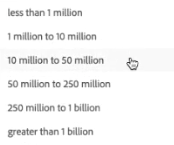

# Skapa en anslutning

Med en anslutning kan du integrera datauppsättningar från [!DNL Adobe Experience Platform] till [!UICONTROL Workspace]. För att rapportera [!DNL Experience Platform] datauppsättningar måste du först skapa en anslutning mellan datauppsättningar i [!DNL Experience Platform] och [!UICONTROL Workspace].

Klicka [här](https://docs.adobe.com/content/help/en/platform-learn/tutorials/cja/connecting-customer-journey-analytics-to-data-sources-in-platform.html) för en videoöversikt.

>[!IMPORTANT]
>
>Du kan kombinera flera [!DNL Experience Platform] datauppsättningar till en enda anslutning.

## Välj sandlåda och datauppsättningar

1. Gå till [https://analytics.adobe.com](https://analytics.adobe.com).

1. Klicka på **[!UICONTROL Connections]** -fliken.

1. Klicka **[!UICONTROL Create new connection]** överst till höger.

   

1. Välj en sandlåda i Experience Platform som innehåller den eller de datauppsättningar som du vill skapa en anslutning till.

   Adobe Experience Platform tillhandahåller [sandlådor](https://docs.adobe.com/content/help/en/experience-platform/sandbox/home.html) som partitionerar en enda plattformsinstans i separata virtuella miljöer för att utveckla och utveckla program för digitala upplevelser. Du kan tänka dig sandlådor som&quot;dataisoleringar&quot; som innehåller datauppsättningar. Sandlådor används för att styra åtkomst till datauppsättningar.  När du har valt sandlådan visas alla datauppsättningar i den sandlådan som du kan hämta från den vänstra listen.

   >[!IMPORTANT]
   >
   >Du kan inte komma åt data över sandlådor, d.v.s. du kan bara kombinera datauppsättningar som finns i samma sandlåda.

1. Välj en eller flera datauppsättningar som du vill hämta till [!UICONTROL Customer Journey Analytics] och klicka **[!UICONTROL Add]**.

   (Om du har många datauppsättningar att välja bland kan du söka efter rätt datauppsättningar med **[!UICONTROL Search datasets]** sökfältet ovanför listan med datauppsättningar.)

## Konfigurera datauppsättning

Till höger kan du nu konfigurera de datauppsättningar som du har lagt till.

1. **[!UICONTROL Dataset type]**: För varje datauppsättning som du har lagt till i den här anslutningen [!UICONTROL Customer Journey Analytics] anger automatiskt datamängdstypen baserat på de data som kommer in.

   Det finns tre olika datamängdstyper: [!UICONTROL Event] data, [!UICONTROL Profile] data, och [!UICONTROL Lookup] data.

   | Typ av datauppsättning | Beskrivning | Tidsstämpel | Schema | Person-ID |
   |---|---|---|---|---|
   | [!UICONTROL Event] | Data som representerar händelser i tid (t.ex. webbbesök, interaktioner, transaktioner, POS-data, undersökningsdata, annonsinformation osv.). Detta kan till exempel vara typiska klickströmsdata, med ett kund-ID eller ett cookie-ID och en tidsstämpel. Med händelsedata får du flexibilitet vad gäller vilket ID som används som person-ID. | ställs automatiskt in på standardfältet för tidsstämpling från händelsebaserade scheman i [!UICONTROL Experience Platform]. | Alla inbyggda eller anpassade scheman som baseras på en XDM-klass med beteendet&quot;Time Series&quot;. Exempel är &quot;XDM Experience Event&quot; eller &quot;XDM Decision Event&quot;. | Du kan välja vilket person-ID du vill inkludera. Varje datamängdsschema som definieras i Experience Platform kan ha en egen uppsättning av en eller flera identiteter som är definierade och associerade med ett identitetsnamnutrymme. Alla dessa kan användas som person-ID. Exempel är cookie-ID, Stitched ID, User ID, Tracking Code osv. |
   | [!UICONTROL Lookup] | (Motsvarar en klassificeringsfil i traditionell Adobe Analytics.) Dessa data används för att söka efter värden eller nycklar som finns i dina händelse- eller profildata. Du kan till exempel överföra sökdata som mappar numeriska ID:n i händelsedata till produktnamn. Se [det här användningsfallet](/help/use-cases/b2b.md) till exempel. | Ej tillämpligt | Alla inbyggda eller anpassade scheman som baseras på en XDM-klass med beteendet &quot;Record&quot;, förutom klassen &quot;XDM Individual Profile&quot;. | Ej tillämpligt |
   | [!UICONTROL Profile] | Motsvarar [!UICONTROL Customer Attributes] - för attribut som inte ändras eller inte ändras i tid. Data som tillämpas på era besökare, användare eller kunder i [!UICONTROL Event] data. Du kan till exempel överföra CRM-data om dina kunder. | Ej tillämpligt | Alla inbyggda eller anpassade scheman som baseras på klassen &quot;XDM Individual Profile&quot;. | Du kan välja vilket person-ID du vill inkludera. Varje datauppsättning som definieras i [!DNL Experience Platform] har en egen uppsättning av ett eller flera definierade person-ID, t.ex. cookie-ID, Stitched ID, User ID, Tracking Code osv. **Anteckning**: Om du skapar en anslutning som innehåller datauppsättningar med olika ID:n, återspeglas detta i rapporten. Om du verkligen vill sammanfoga datauppsättningar måste du använda samma person-ID. |

1. **[!UICONTROL Dataset ID]**: Detta ID genereras automatiskt.

1. **[!UICONTROL Time stamp]**: Endast för händelsedatamängder anges den här inställningen automatiskt till standardfältet för tidsstämpling från händelsebaserade scheman i [!UICONTROL Experience Platform].

1. **[!UICONTROL Schema]**: Det här är [schema](https://docs.adobe.com/content/help/en/experience-platform/xdm/schema/composition.html) baserat på vilket datauppsättningen skapades i Adobe Experience Platform.

1. **[!UICONTROL Person ID]**: Välj ett person-ID i listrutan med tillgängliga identiteter. Dessa identiteter definierades i datauppsättningsschemat i Experience Platform. Nedan finns information om hur du använder identitetskartan som ett person-ID.

   >[!IMPORTANT]
   >
   >Om det inte finns några person-ID:n att välja mellan, innebär det att ett eller flera person-ID:n inte har definierats i schemat. Visa [den här videon](https://youtu.be/G_ttmGl_LRU) om hur du definierar en identitet i Experience Platform.

1. Klicka **[!UICONTROL Next]** för att gå till [!UICONTROL Enable Connection] -dialogrutan.

### Använd identitetskarta som person-ID

Customer Journey Analytics har nu stöd för möjligheten att använda identitetskartan för sitt person-ID. Identitetskarta är en kartdatastruktur som gör att någon kan överföra nyckel -> värdepar. Nycklarna är ID-namnutrymmen och värdet är den struktur som innehåller identitetsvärdet. Identitetskartan finns för varje överförd rad/händelse och fylls i för varje rad i enlighet med detta.

Identitetskartan är tillgänglig för alla datauppsättningar som använder ett schema baserat på [ExperienceEvent XDM](https://docs.adobe.com/content/help/en/experience-platform/xdm/home.html) klassen. När du väljer en sådan datauppsättning som ska inkluderas i en CJA-anslutning kan du välja att antingen välja ett fält som primärt ID eller identitetskartan:

Om du väljer Identitetskarta får du ytterligare två konfigurationsalternativ:

| Alternativ | Beskrivning |
|---|---|
| [!UICONTROL Use Primary ID Namespace] | Detta instruerar CJA, per rad, att hitta identiteten i identitetskartan som är markerad med ett primär=true-attribut och använda det som ID för den raden. Detta innebär att det här är den primärnyckel som ska användas i Experience Platform för partitionering. Det är också den primära kandidaten för CJA:s besökar-ID (beroende på hur datauppsättningen konfigureras i en CJA-anslutning). |
| [!UICONTROL Namespace] | (Det här alternativet är bara tillgängligt om du inte använder namnutrymmet för primärt ID.) Identitetsnamnutrymmen är en komponent i [Adobe Experience Platform Identity Service](https://docs.adobe.com/content/help/en/experience-platform/identity/namespaces.html) som fungerar som indikatorer för det sammanhang som en identitet hör till. Om du anger ett namnutrymme söker CJA efter den här namnutrymmesnyckeln i varje rads identitetskarta och använder identiteten under namnutrymmet som ID för den raden. Observera att eftersom CJA inte kan göra en fullständig datauppsättningssökning av alla rader för att avgöra vilka namnutrymmen som faktiskt finns, visas alla möjliga namnutrymmen i listrutan. Du måste veta vilka namnutrymmen som anges i data; detta kan inte identifieras automatiskt. |

### Kantärenden för identitetskarta

I den här tabellen visas de två konfigurationsalternativen när det finns kantfall och hur de hanteras:

| Alternativ | Det finns inga ID:n i identitetskartan | Inga ID har markerats som primära | Flera ID:n är markerade som primära | Ett ID är markerat som primärt | Ogiltigt namnutrymme med ett ID markerat som primärt |
|---|---|---|---|---|---|
| **Använd namnutrymme för primärt ID markerat** | Raden tas bort av CJA. | Raden tas bort av CJA eftersom inget primärt ID har angetts. | Alla ID:n som markerats som primära, under alla namnutrymmen, extraheras till en lista. De sorteras sedan alfabetiskt, med den här nya sorteringen används det första namnutrymmet med dess första ID som person-ID. | Det enda ID som är markerat som primärt används som person-ID. | Även om namnutrymmet kan vara ogiltigt (inte finns i AEP) kommer CJA att använda det primära ID:t under namnutrymmet som Person-ID. |
| **Namnområdet Specifik identitetskarta har valts** | Raden tas bort av CJA. | Alla ID:n under det markerade namnutrymmet extraheras till en lista och det första används som person-ID. | Alla ID:n under det markerade namnutrymmet extraheras till en lista och det första används som person-ID. | Alla ID:n under det markerade namnutrymmet extraheras till en lista och det första används som person-ID. | Alla ID:n under det markerade namnutrymmet extraheras till en lista och det första används som person-ID. (Endast ett giltigt namnutrymme kan väljas när anslutningen skapas, så det är inte möjligt att använda ett ogiltigt namnutrymme/ID som person-ID) |

## Aktivera anslutning

1. Om du vill aktivera en anslutning definierar du de här inställningarna för hela anslutningen, dvs. alla datauppsättningar i anslutningen:

   | Alternativ | Beskrivning |
   | --- | --- |
   | [!UICONTROL Name Connection] | Ge anslutningen ett beskrivande namn. Anslutningen kan inte sparas utan ett namn. |
   | [!UICONTROL Description] | Lägg till mer information för att skilja den här anslutningen från andra. |
   | [!UICONTROL Datasets] | De datauppsättningar som ingår i den här anslutningen. |
   | [!UICONTROL Automatically import all new datasets in this connection, beginning today.] | Välj det här alternativet om du vill upprätta en pågående anslutning så att alla nya databatchar som läggs till i datauppsättningarna i den här anslutningen automatiskt flödar in i [!UICONTROL Workspace]. |
   | [!UICONTROL Import all existing data] | När du väljer det här alternativet och sparar anslutningen kommer alla befintliga (historiska) data från [!DNL Experience Platform] för alla datauppsättningar i den här anslutningen kommer att importeras eller fyllas i i bakgrunden. I framtiden kommer även alla befintliga historiska data för nya datauppsättningar som läggs till i den här sparade anslutningen att importeras automatiskt. Se även [Bakgrundsfyllningshistorikdata](https://docs.adobe.com/content/help/en/analytics-platform/using/cja-connections/create-connection.html#backfill-historical-data) nedan. **Observera att den här inställningen inte kan ändras när anslutningen har sparats.** |
   | [!UICONTROL Average number of daily events] | Du måste ange det genomsnittliga antalet dagliga händelser som ska importeras (nya data) **och** backfill-data) för alla datauppsättningar i anslutningen. Detta gör att Adobe kan tilldela tillräckligt med utrymme för dessa data. Om du inte känner till det genomsnittliga antalet dagliga händelser som ditt företag kommer att importera, kan du göra en enkel SQL-fråga i [Adobe Experience Platform Query Services](https://docs.adobe.com/content/help/en/experience-platform/query/home.html) för att ta reda på. Här är alternativen för det här alternativet:  |

1. Klicka på **[!UICONTROL Save and create data view]**. Dokumentation finns på [skapa en datavy](/help/data-views/create-dataview.md).

### Bakgrundsfyllningshistorikdata

**[!UICONTROL Import all existing data]** gör att du kan fylla i historiska data baklänges. Tänk på detta:

* Vi prioriterar nya data som läggs till i en datauppsättning i anslutningen, så att dessa nya data har den lägsta latensen.
* Eventuella bakåtfyllnadsdata (historiska) importeras i en långsammare takt. Latensen påverkas av hur mycket historisk information du har, i kombination med **[!UICONTROL Average number of daily events]** inställningen du valde. Om du till exempel har mer än en miljard rader data per dag, plus tre års historiska data, kan det ta flera veckor att importera dem. Å andra sidan, om du har mindre än en miljon rader per dag och en vecka med historiska data, tar det mindre än en timme.
* Påfyllning gäller för hela anslutningen, inte för varje enskild datauppsättning.
* The [Adobe Analytics Data Connector](https://docs.adobe.com/content/help/en/platform-learn/tutorials/data-ingestion/ingest-data-from-adobe-analytics.html) importerar upp till 13 månaders data, oavsett storlek.

<!--If you do not know the average number of daily events your company is going to import, you can do a simple SQL query in [Adobe Experience Platform Query Services](https://docs.adobe.com/content/help/en/experience-platform/query/home.html) to find out. Rohit to provide and make sure we include multiple datasets.-->
