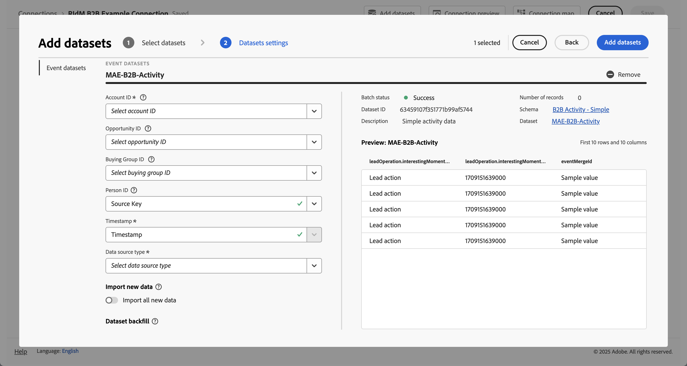

# Skapa eller redigera en anslutning {#create-or-edit-a-connection}

<!-- markdownlint-disable MD034 -->

>[!CONTEXTUALHELP]
>id="cja_connections_recordsadded"
>title="Poster har lagts till"
>abstract="Antalet poster (rader) som lagts till i en anslutning under det valda tidsintervallet för de valda datauppsättningarna."

<!-- markdownlint-enable MD034 -->

<!-- markdownlint-disable MD034 -->

>[!CONTEXTUALHELP]
>id="cja_connections_recordsskipped"
>title="Överhoppade poster"
>abstract="Antalet poster (rader) som hoppats över under dataöverföring för en anslutning under det valda tidsintervallet för de valda datauppsättningarna."

<!-- markdownlint-enable MD034 -->

<!-- markdownlint-disable MD034 -->

>[!CONTEXTUALHELP]
>id="cja_connections_recordsdeleted"
>title="Borttagna poster"
>abstract="Antalet poster (rader) som tagits bort från en anslutning under det valda tidsintervallet för de valda datauppsättningarna"

<!-- markdownlint-enable MD034 -->

<!-- markdownlint-disable MD034 -->

>[!CONTEXTUALHELP]
>id="cja_connection_lastadded"
>title="Senast tillagd"
>abstract="Tidsstämpeln för den senaste batchen från en datauppsättning som överförts till en anslutning."

<!-- markdownlint-enable MD034 -->

<!-- markdownlint-disable MD034 -->

>[!CONTEXTUALHELP]
>id="cja_connection_enablerollingdatawindow"
>title="Aktivera rullande datafönster"
>abstract="Definiera datalagring som ett rullande fönster i månader på anslutningsnivå."

<!-- markdownlint-enable MD034 -->

<!-- markdownlint-disable MD034 -->

>[!CONTEXTUALHELP]
>id="cja_connection_averagenumberofdailyuses"
>title="Genomsnittligt antal dagliga användningar"
>abstract="Välj ett intervall för antalet förväntade dagliga händelser för hela anslutningen."

<!-- markdownlint-enable MD034 -->

<!-- markdownlint-disable MD034 -->

>[!CONTEXTUALHELP]
>id="connections_recordsadded"
>title="Poster har lagts till"
>abstract="Antalet poster (rader) som lagts till i en anslutning under det valda tidsintervallet för de valda datauppsättningarna."

<!-- markdownlint-enable MD034 -->

<!-- markdownlint-disable MD034 -->

>[!CONTEXTUALHELP]
>id="connections_recordsskipped"
>title="Överhoppade poster"
>abstract="Antalet poster (rader) som hoppats över under dataöverföring för en anslutning under det valda tidsintervallet för de valda datauppsättningarna."

<!-- markdownlint-enable MD034 -->

<!-- markdownlint-disable MD034 -->

>[!CONTEXTUALHELP]
>id="connections_recordsdeleted"
>title="Borttagna poster"
>abstract="Antalet poster (rader) som tagits bort från en anslutning under det valda tidsintervallet för de valda datauppsättningarna"

<!-- markdownlint-enable MD034 -->

<!-- markdownlint-disable MD034 -->

>[!CONTEXTUALHELP]
>id="connection_lastadded"
>title="Senast tillagd"
>abstract="Tidsstämpeln för den senaste batchen från en datauppsättning som överförts till en anslutning."

<!-- markdownlint-enable MD034 -->

<!-- markdownlint-disable MD034 -->

>[!CONTEXTUALHELP]
>id="connection_enablerollingdatawindow"
>title="Aktivera rullande datafönster"
>abstract="Definiera datalagring som ett rullande fönster i månader på anslutningsnivå."

<!-- markdownlint-enable MD034 -->

<!-- markdownlint-disable MD034 -->

>[!CONTEXTUALHELP]
>id="connection_averagenumberofdailyuses"
>title="Genomsnittligt antal dagliga användningar"
>abstract="Välj ett intervall för antalet förväntade dagliga händelser för hela anslutningen."


Arbetsflödet för att skapa och redigera anslutningar gör att alla konfigurationsinställningar för datauppsättningar och anslutningar hamnar mitt på skärmen med ett hjälparbetsflöde. Den ger detaljerad information om val, konfiguration och granskning av datauppsättningar. Och gör att du kan ange viktig information som datamängdstyp, storlek, schema, datauppsättnings-ID, batchstatus, bakåtfyllnadsstatus, person-ID och mycket annat, för att minska risken för fel anslutningskonfiguration. Här är en översikt över funktionerna:

* Du kan aktivera ett rullande datalagringsfönster när du skapar anslutningen.
* Du kan lägga till och ta bort datauppsättningar från en anslutning. (Om du tar bort en datauppsättning tas den bort från anslutningen och påverkar associerade datavyer och underliggande Analysis Workspace-projekt.)
* Du kan aktivera och begära data för bakåtfyllnad per datauppsättning.
* Du kan redigera datauppsättningar, t.ex. för att begära en annan bakgrundsfyllning.
* Du kan importera befintliga data per datauppsättning.


>[!BEGINSHADEBOX]

Se  [Skapa och redigera en anslutning](https://video.tv.adobe.com/v/343044/?quality=12&learn=on){target="_blank"} för en demonstrationsvideo.

>[!ENDSHADEBOX]


## Förutsättningar

Det maximala antalet datauppsättningar som du kan lägga till i en anslutning är 100. Blandningen beror på vilket Customer Journey Analytics-paket företaget har köpt.

Kontakta administratören om du är osäker på vilket Customer Journey Analytics-paket du har.

| **Välj**-paket | Paketet **Foundation** |
| --- | --- |
| Valfri kombination av händelse-/profil-/uppslags-/sammanfattningsdatauppsättningar, vilket ger upp till 100 | En händelsedatamängd per anslutning |
|  | Upp till 99 profil-, uppslags- eller sammanfattningsdatauppsättningar per anslutning |

{style="table-layout:auto"}

## Skapa och konfigurera anslutningen {#create-connection}

1. I Customer Journey Analytics väljer du **[!UICONTROL Connections]**, eventuellt från **[!UICONTROL Data management]**, på den översta menyn.
1. Välj **[!UICONTROL Create new connection]**.

>[!BEGINTABS]

>[!TAB Standard]


>[!TAB B2B edition]


>[!ENDTABS]

På skärmen **[!UICONTROL Connections]** > **[!UICONTROL Untitled connection]**:

1. Konfigurera anslutningsinställningarna.

   | Inställning | Beskrivning |
   | --- | --- |
   | **[!UICONTROL Connection name]** | Ange ett unikt namn för anslutningen. |
   | **[!UICONTROL Connection description]** | Beskriv syftet med den här anslutningen. |
   | [!BADGE B2B edition]{type=Informative url="https://experienceleague.adobe.com/en/docs/analytics-platform/using/cja-overview/cja-b2b/cja-b2b-edition" newtab=true tooltip="Customer Journey Analytics B2B edition"}<br/>**[!UICONTROL Primary ID]** | Välj rätt primärt ID för anslutningen: <ul><li> **[!UICONTROL Person]** för ett B2C-scenario</li><li>  **[!UICONTROL Account]** för ett B2B-scenario.</li></ul> |
   | [!BADGE B2B edition]{type=Informative url="https://experienceleague.adobe.com/en/docs/analytics-platform/using/cja-overview/cja-b2b/cja-b2b-edition" newtab=true tooltip="Customer Journey Analytics B2B edition"}<br/>**[!UICONTROL Optional containers]** | Välj ytterligare behållare.<ul><li>**[!UICONTROL Global account]**: aktiverar konfiguration av globala konton i en anslutning.</li><li>**[!UICONTROL Opportunity]**: aktiverar konfiguration av affärsmöjligheter i en anslutning.</li><li>**[!UICONTROL Buying group]**: aktiverar konfiguration av inköpsgrupper i en anslutning.</li><ul> |
   | **[!UICONTROL Sandbox]** | Välj en sandlåda i Experience Platform som innehåller den eller de datauppsättningar som du vill skapa en anslutning till.<p>Adobe Experience Platform tillhandahåller [sandlådor](https://experienceleague.adobe.com/en/docs/experience-platform/sandbox/home) som partitionerar en enda plattformsinstans till separata virtuella miljöer för att utveckla och utveckla program för digitala upplevelser. Du kan tänka dig sandlådor som&quot;dataisoleringar&quot; som innehåller datauppsättningar. Sandlådor används för att styra åtkomst till datauppsättningar.<p>När du har valt sandlådan visas alla datauppsättningar i den sandlådan som du kan hämta från den vänstra listen. |
   | **[!UICONTROL Enable rolling data window]** | Om den här kryssrutan är markerad kan du definiera Customer Journey Analytics datalagring som ett rullande fönster på anslutningsnivå i månader (1 månad, 3 månader, 6 månader och så vidare).<p>Datalagringen baseras på tidsstämplar för händelsedatamängder och gäller endast för händelsedatamängder. Det finns ingen inställning för rullande datafönster för profil- eller uppslagsdatauppsättningar eftersom det inte finns några tillämpliga tidsstämplar. Om din anslutning innehåller en profil- eller uppslagsdatauppsättning (förutom en eller flera händelsedatamängder), behålls dessa data för samma tidsperiod.<p> Den största fördelen är att du bara lagrar eller rapporterar data som är tillämpliga och användbara och tar bort äldre data som inte längre är användbara. Det hjälper er att hålla er inom avtalsgränserna och minskar risken för överlagringskostnader.<p>Om du låter standardinställningen (inte markerad) stå över kvarhållningsperioden för data i Adobe Experience Platform. Om ni har 25 månaders data i Experience Platform får Customer Journey Analytics 25 månaders data genom förifyllning. Om du raderade 10 av dessa månader i Platform behåller Customer Journey Analytics de återstående 15 månaderna. |
   | **[!UICONTROL Add datasets]** (se nedan) | Lägg till datauppsättningar om inga datauppsättningar visas i datamängdsregistret. I annat fall visas en lista med de datauppsättningar som du redan har lagt till när anslutningen skapas. |


   För de datauppsättningar som du har konfigurerat visas följande kolumner i datatabellen:

   | Kolumn | Beskrivning |
   |---|---|
   | **[!UICONTROL Dataset name]** | Markera en eller flera datauppsättningar som du vill hämta till Customer Journey Analytics och välj **[!UICONTROL Add]**.<p>(Om du har många datauppsättningar att välja bland kan du söka efter rätt datauppsättningar med sökfältet Sök efter datauppsättningar ovanför listan med datauppsättningar.) |
   | **[!UICONTROL Last updated]** | Endast för händelsedatamängder anges den här inställningen automatiskt till standardfältet för tidsstämpling från händelsebaserade scheman i Experience Platform. &quot;Ej tillämpligt&quot; innebär att den här datauppsättningen inte innehåller några data. |
   | **[!UICONTROL Number of records]** | Det totala antalet poster under den föregående månaden för datauppsättningen i Experience Platform. |
   | **[!UICONTROL Schema]** | Det [schema](https://experienceleague.adobe.com/en/docs/experience-platform/xdm/schema/composition) som baserar sig på vilken datauppsättningen skapades i Adobe Experience Platform. |
   | **[!UICONTROL Dataset type]** | För varje datauppsättning som du har lagt till i den här anslutningen anger Customer Journey Analytics automatiskt datauppsättningstypen baserat på de data som kommer in. Det finns tre olika datamängdstyper: Händelsedata, Profildata och Uppslagsdata. Se tabellen nedan för en förklaring av datamängdstyperna. |
   | **[!UICONTROL Granularity]** | Detaljrikedomen för data i datauppsättningen. Gäller endast för sammanfattningsdatauppsättningar. |
   | **[!UICONTROL Data source type]** | Datamängdens datakälltyp. Gäller inte för sammanfattningsdatauppsättningar. |
   | [!BADGE B2B edition]{type=Informative url="https://experienceleague.adobe.com/en/docs/analytics-platform/using/cja-overview/cja-b2b/cja-b2b-edition" newtab=true tooltip="Customer Journey Analytics B2B edition"}<br/>**[!UICONTROL Account ID]** | Det konto-ID som används för att stödja kontobaserad rapportering för datauppsättningen. |
   | [!BADGE B2B edition]{type=Informative url="https://experienceleague.adobe.com/en/docs/analytics-platform/using/cja-overview/cja-b2b/cja-b2b-edition" newtab=true tooltip="Customer Journey Analytics B2B edition"}<br/>**[!UICONTROL Global Account ID]** | Det globala konto-ID som används för att söka efter globala kontodata. |
   | [!BADGE B2B edition]{type=Informative url="https://experienceleague.adobe.com/en/docs/analytics-platform/using/cja-overview/cja-b2b/cja-b2b-edition" newtab=true tooltip="Customer Journey Analytics B2B edition"}<br/>**[!UICONTROL Buying Group ID]** | Det Buying Group-ID som används för att söka efter köpgruppsdata. |
   | [!BADGE B2B edition]{type=Informative url="https://experienceleague.adobe.com/en/docs/analytics-platform/using/cja-overview/cja-b2b/cja-b2b-edition" newtab=true tooltip="Customer Journey Analytics B2B edition"}<br/>**[!UICONTROL Opportunity ID]** | Det affärsmöjlighets-ID som används för att söka efter affärsmöjlighetsdata. |
   | **[!UICONTROL Person ID]** | Det person-ID som används för att stödja personbaserad rapportering för datauppsättningen. |
   | **[!UICONTROL Key]** | Endast för uppslagsdatauppsättningar (till exempel _id). |
   | **[!UICONTROL Matching Key]** | Endast för uppslagsdatauppsättningar (till exempel _id). |
   | **[!UICONTROL Import new data]** | Inställd på På eller Av. |
   | **[!UICONTROL Backfill data]** | Du kan begära att data i en datauppsättning fylls i på nytt. Du kan till exempel begära att de senaste 7 dagarnas data ska fyllas i igen. Konfigurera datauppsättningen korrekt och testa anslutningen. Om allt ser bra ut kan du enkelt fylla i alla återstående data.<p>Dessutom kan du aktivera import av nya data per datauppsättning. |
   | **[!UICONTROL Backfill status]** | Den här statusen anger om några data för bakgrundsfyllning bearbetas. |

   Du kan söka efter en viss datauppsättning med hjälp av fältet .


## Lägg till datauppsättningar {#add-dataset}

<!-- markdownlint-disable MD034 -->

>[!CONTEXTUALHELP]
>id="cja_connection_primaryid"
>title="Primärt ID"
>abstract="Välj rätt primärt ID för anslutningen: Person för ett B2C-scenario. Konto för ett B2B-scenario."

<!-- markdownlint-enable MD034 -->

<!-- markdownlint-disable MD034 -->

>[!CONTEXTUALHELP]
>id="cja_connection_optionalcontainers"
>title="Valfria behållare"
>abstract="Välj ytterligare behållare.<br/><br/>**[!UICONTROL Global account]**: aktiverar konfiguration av globala konton i en anslutning.<br/>**[!UICONTROL Opportunity]**: aktiverar konfiguration av affärsmöjligheter i en anslutning.<br/>**[!UICONTROL Buying group]**: aktiverar konfiguration av inköpsgrupper i en anslutning."

<!-- markdownlint-enable MD034 -->

<!-- markdownlint-disable MD034 -->

>[!CONTEXTUALHELP]
>id="cja_connection_personid"
>title="Person-ID"
>abstract="Välj ett person-ID bland de tillgängliga identiteter som definieras i datauppsättningsschemat i Experience Platform."

<!-- markdownlint-enable MD034 -->

<!-- markdownlint-disable MD034 -->

>[!CONTEXTUALHELP]
>id="cja_connection_accountid"
>title="Konto-ID"
>abstract="Välj ett konto-ID (den unika identifieraren för ett konto) bland de tillgängliga identiteter som definieras i datauppsättningsschemat i Experience Platform."

<!-- markdownlint-enable MD034 -->

<!-- markdownlint-disable MD034 -->

>[!CONTEXTUALHELP]
>id="cja_connection_accountfield"
>title="Kontofält"
>abstract="Välj ett fält som representerar konto-ID:t (den unika identifieraren för ett konto)."

<!-- markdownlint-enable MD034 -->


<!-- markdownlint-disable MD034 -->

>[!CONTEXTUALHELP]
>id="cja_connection_globalaccountid"
>title="ID för globalt konto"
>abstract="Välj ett globalt konto-ID (den unika identifieraren för ett globalt konto) bland de tillgängliga identiteter som definieras i datauppsättningsschemat i Experience Platform."

<!-- markdownlint-enable MD034 -->

<!-- markdownlint-disable MD034 -->

>[!CONTEXTUALHELP]
>id="cja_connection_opportunityid"
>title="ID för affärsmöjlighet"
>abstract="Välj ett affärsmöjlighets-ID (den unika identifieraren för en affärsmöjlighet) bland de tillgängliga identiteter som definieras i datauppsättningsschemat i Experience Platform."

<!-- markdownlint-enable MD034 -->

<!-- markdownlint-disable MD034 -->

>[!CONTEXTUALHELP]
>id="cja_connection_buyinggroupid"
>title="ID för inköpsgrupp"
>abstract="Välj ett inköpsgrupp-ID (den unika identifieraren för en inköpsgrupp) bland de tillgängliga identiteter som definieras i dataschemat i Experience Platform."

<!-- markdownlint-enable MD034 -->

<!-- markdownlint-disable MD034 -->

>[!CONTEXTUALHELP]
>id="cja_connection_matchingkey"
>title="Matchningsnyckel"
>abstract="Välj hur du vill förena: baserat på en matchande nyckel eller en matchande behållare.<br/><br/>**[!UICONTROL Matching key]**: Välj ett fält som du vill koppla ihop med en av händelsedatamängderna. Om den här listan är tom har du förmodligen inte lagt till eller konfigurerat någon händelsedatamängd.<br/>**[!UICONTROL Matching container]**: Välj en behållare som ska användas för att ansluta till en av händelsedatamängderna. Om listan är tom har du förmodligen inte konfigurerat en eller flera behållare."

<!-- markdownlint-enable MD034 -->

<!-- markdownlint-disable MD034 -->

>[!CONTEXTUALHELP]
>id="cja_connection_importnewdata"
>title="Importera nya data"
>abstract="Eventuella nya batchar som läggs till i Experience Platform dataset läggs automatiskt till i den här anslutningen och blir tillgängliga för analys."

<!-- markdownlint-enable MD034 -->

<!-- markdownlint-disable MD034 -->

>[!CONTEXTUALHELP]
>id="cja_connection_datasetbackfill"
>title="Backfill-fyllning för datauppsättning"
>abstract="Med det här alternativet återfylls befintliga (historiska) data från Experience Platform för den här datauppsättningen i anslutningen."

<!-- markdownlint-enable MD034 -->

<!-- markdownlint-disable MD034 -->

>[!CONTEXTUALHELP]
>id="cja_connection_transformdataset"
>title="Omforma datauppsättning"
>abstract="Det här alternativet omformar datauppsättningen så att den kan användas för personbaserade sökningar i B2B-scenarier. När den är aktiverad är omvandlingen av datauppsättningen oåterkallelig."

<!-- markdownlint-enable MD034 -->

<!-- markdownlint-disable MD034 -->

>[!CONTEXTUALHELP]
>id="cja_connection_connectionmap"
>title="Anslutningskarta"
>abstract="Anslutningskartan visar relationerna mellan händelse-, person-, konto- och relevanta sökdatauppsättningar (som affärsmöjligheter, kampanjmedlemmar med mera)."

<!-- markdownlint-enable MD034 -->

<!-- markdownlint-disable MD034 -->

>[!CONTEXTUALHELP]
>id="connection_primaryid"
>title="Primärt ID"
>abstract="Välj rätt primärt ID för anslutningen: Person för ett B2C-scenario. Konto för ett B2B-scenario."

<!-- markdownlint-enable MD034 -->

<!-- markdownlint-disable MD034 -->

>[!CONTEXTUALHELP]
>id="connection_optionalcontainers"
>title="Valfria behållare"
>abstract="Välj ytterligare behållare.<br/><br/>**[!UICONTROL Global account]**: aktiverar konfiguration av globala konton i en anslutning.<br/>**[!UICONTROL Opportunity]**: aktiverar konfiguration av affärsmöjligheter i en anslutning.<br/>**[!UICONTROL Buying group]**: aktiverar konfiguration av inköpsgrupper i en anslutning."

<!-- markdownlint-enable MD034 -->

<!-- markdownlint-disable MD034 -->

>[!CONTEXTUALHELP]
>id="connection_personid"
>title="Person-ID"
>abstract="Välj ett person-ID bland de tillgängliga identiteter som definieras i datauppsättningsschemat i Experience Platform."

<!-- markdownlint-enable MD034 -->

<!-- markdownlint-disable MD034 -->

>[!CONTEXTUALHELP]
>id="connection_accountid"
>title="Konto-ID"
>abstract="Välj ett konto-ID (den unika identifieraren för ett konto) bland de tillgängliga identiteter som definieras i datauppsättningsschemat i Experience Platform."

<!-- markdownlint-enable MD034 -->

>[!CONTEXTUALHELP]
>id="connection_accountfield"
>title="Kontofält"
>abstract="Välj ett fält som representerar konto-ID:t (den unika identifieraren för ett konto)."

<!-- markdownlint-enable MD034 -->

<!-- markdownlint-disable MD034 -->

>[!CONTEXTUALHELP]
>id="connection_globalaccountid"
>title="ID för globalt konto"
>abstract="Välj ett globalt konto-ID (den unika identifieraren för ett globalt konto) bland de tillgängliga identiteter som definieras i datauppsättningsschemat i Experience Platform."

<!-- markdownlint-enable MD034 -->

<!-- markdownlint-disable MD034 -->

>[!CONTEXTUALHELP]
>id="connection_opportunityid"
>title="ID för affärsmöjlighet"
>abstract="Välj ett affärsmöjlighets-ID (den unika identifieraren för en affärsmöjlighet) bland de tillgängliga identiteter som definieras i datauppsättningsschemat i Experience Platform."

<!-- markdownlint-enable MD034 -->

<!-- markdownlint-disable MD034 -->

>[!CONTEXTUALHELP]
>id="connection_buyinggroupid"
>title="ID för inköpsgrupp"
>abstract="Välj ett inköpsgrupp-ID (den unika identifieraren för en inköpsgrupp) bland de tillgängliga identiteter som definieras i dataschemat i Experience Platform."

<!-- markdownlint-enable MD034 -->

<!-- markdownlint-disable MD034 -->

>[!CONTEXTUALHELP]
>id="connection_matchingkey"
>title="Matchningsnyckel"
>abstract="Välj hur du vill förena: baserat på en matchande nyckel eller en matchande behållare.<br/><br/>**[!UICONTROL Matching key]**: Välj ett fält som du vill koppla ihop med en av händelsedatamängderna. Om den här listan är tom har du förmodligen inte lagt till eller konfigurerat någon händelsedatamängd.<br/>**[!UICONTROL Matching container]**: Välj en behållare som ska användas för att ansluta till en av händelsedatamängderna. Om listan är tom har du förmodligen inte konfigurerat en eller flera behållare."

<!-- markdownlint-enable MD034 -->

<!-- markdownlint-disable MD034 -->

>[!CONTEXTUALHELP]
>id="connection_importnewdata"
>title="Importera nya data"
>abstract="Eventuella nya batchar som läggs till i Experience Platform dataset läggs automatiskt till i den här anslutningen och blir tillgängliga för analys."

<!-- markdownlint-enable MD034 -->

<!-- markdownlint-disable MD034 -->

>[!CONTEXTUALHELP]
>id="connection_datasetbackfill"
>title="Backfill-fyllning för datauppsättning"
>abstract="Med det här alternativet återfylls befintliga (historiska) data från Experience Platform för den här datauppsättningen i anslutningen."

<!-- markdownlint-enable MD034 -->

<!-- markdownlint-disable MD034 -->

>[!CONTEXTUALHELP]
>id="connection_transformdataset"
>title="Omforma datauppsättning"
>abstract="Det här alternativet omformar datauppsättningen så att den kan användas för personbaserade sökningar i B2B-scenarier. När den är aktiverad är omvandlingen av datauppsättningen oåterkallelig."

<!-- markdownlint-enable MD034 -->

<!-- markdownlint-disable MD034 -->

>[!CONTEXTUALHELP]
>id="connection_connectionmap"
>title="Anslutningskarta"
>abstract="Anslutningskartan visar relationerna mellan händelse-, person-, konto- och relevanta sökdatauppsättningar (som affärsmöjligheter, kampanjmedlemmar med mera)."


Med arbetsflödet kan du lägga till en eller flera Experience Platform-datauppsättningar när du skapar en anslutning.


1. Välj **[!UICONTROL Add datasets]** i dialogrutan Anslutningsinställningar.

1. I ➊ **[!UICONTROL Select datasets]**-steget visas en lista med Experience Platform-datauppsättningar.

   

   För varje datauppsättning visas följande i listan:

   | Kolumn | Beskrivning |
   |---|---|
   | **[!UICONTROL Dataset]** | Datauppsättningens namn. Markera namnet som du vill dirigera till datauppsättningen i Experience Platform. Välj  om du vill visa ett popup-fönster med mer information om datauppsättningen. Du kan välja **[!UICONTROL Edit in Platform]** om du vill redigera datauppsättningen direkt i Experience Platform. |
   | **[!UICONTROL Dataset type]** | Datatypen: Händelse, profil, sökning eller sammanfattning. |
   | **[!UICONTROL Number of records]** | Det totala antalet poster under den föregående månaden för datauppsättningen i Experience Platform. |
   | **[!UICONTROL Schema]** | Schemat för datauppsättningen. Markera namnet som du vill dirigera till schemat i Experience Platform. |
   | **[!UICONTROL Last batch]** | Status för den senaste batchen som importerats till Experience Platform. Mer information finns i [Gruppstatus](https://experienceleague.adobe.com/en/docs/experience-platform/ingestion/batch/troubleshooting#batch-states). |
   | **[!UICONTROL Dataset ID]** | Datauppsättningens ID. |
   | **[!UICONTROL Last updated]** | Den senaste uppdaterade tidsstämpeln för datauppsättningen. |

   * Om du vill ändra vilka kolumner som visas för listan med datauppsättningar väljer du  och markerar de kolumner som ska visas i dialogrutan [!UICONTROL Customize table].
   * Om du vill söka efter en viss datauppsättning använder du sökfältet .
   * Om du vill växla mellan att visa eller dölja de markerade datauppsättningarna väljer du  **[!UICONTROL Hide selected]** eller **[!UICONTROL Show selected]**.
   * Om du vill ta bort en datauppsättning från listan med valda datauppsättningar använder du . Om du vill ta bort alla markerade datauppsättningar väljer du **[!UICONTROL Clear all]**.


1. Markera en eller flera datauppsättningar och välj **[!UICONTROL Next]**. Du [konfigurerar](#configure-datasets) varje datauppsättning. Minst en händelsedatamängd måste ingå i anslutningen.


## Konfigurera datauppsättningar

Du konfigurerar de markerade datauppsättningarna, en i taget, i ➋ **[!UICONTROL Datasets settings]** i dialogrutan **[!UICONTROL Add datsets]**.

>[!BEGINTABS]

>[!TAB Standard]


>[!TAB B2B edition]



>[!ENDTABS]

| Inställning | Beskrivning |
| --- | --- |
| [!BADGE B2B edition]{type=Informative url="https://experienceleague.adobe.com/en/docs/analytics-platform/using/cja-overview/cja-b2b/cja-b2b-edition" newtab=true tooltip="Customer Journey Analytics B2B edition"}<br/>**[!UICONTROL Account ID]** | Endast tillgängligt för händelsedatamängder och för uppslagsdatamängder som [matchas av behållaren](/help/getting-started/cja-b2b-concepts-features.md#match-by-container-or-field). Välj ett konto-ID (den unika identifieraren för ett konto) bland de tillgängliga identiteter som definieras i datauppsättningsschemat i Experience Platform. |
| [!BADGE B2B edition]{type=Informative url="https://experienceleague.adobe.com/en/docs/analytics-platform/using/cja-overview/cja-b2b/cja-b2b-edition" newtab=true tooltip="Customer Journey Analytics B2B edition"}<br/>**[!UICONTROL Opportunity ID]** | Endast tillgängligt för händelsedatamängder. Välj ett affärsmöjlighets-ID (den unika identifieraren för en affärsmöjlighet) bland de tillgängliga identiteter som definieras i datauppsättningsschemat i Experience Platform. |
| [!BADGE B2B edition]{type=Informative url="https://experienceleague.adobe.com/en/docs/analytics-platform/using/cja-overview/cja-b2b/cja-b2b-edition" newtab=true tooltip="Customer Journey Analytics B2B edition"}<br/>**[!UICONTROL Buying Group ID]** | Endast tillgängligt för händelsedatamängder. Välj ett inköpsgrupp-ID (den unika identifieraren för en inköpsgrupp) bland de tillgängliga identiteter som definieras i dataschemat i Experience Platform. |
| **[!UICONTROL Person ID]** | Endast tillgängligt för händelse- och profildatauppsättningar. Välj ett person-ID i listrutan med tillgängliga identiteter. Dessa identiteter definierades i datauppsättningsschemat i Experience Platform. Nedan finns information om hur du använder identitetskartan som ett person-ID.<p>Om det inte finns några person-ID:n att välja mellan, innebär det att ett eller flera person-ID:n inte har definierats i schemat. Mer information finns i [Definiera identitetsfält i användargränssnittet](https://experienceleague.adobe.com/en/docs/experience-platform/xdm/ui/fields/identity). <p>Värdet för det valda person-ID:t anses vara skiftlägeskänsligt. `abc123` och `ABC123` är till exempel två olika värden. |
| **[!UICONTROL Timestamp]** | Endast för händelse- och sammanfattningsdatauppsättningar anges den här inställningen automatiskt till standardfältet för tidsstämpling från händelsebaserade scheman i Experience Platform. |
| **[!UICONTROL Key]** | Endast tillgängligt för uppslagsdatauppsättningar. Nyckeln som ska användas för en uppslagsdatauppsättning. |
| [!BADGE B2B edition]{type=Informative url="https://experienceleague.adobe.com/en/docs/analytics-platform/using/cja-overview/cja-b2b/cja-b2b-edition" newtab=true tooltip="Customer Journey Analytics B2B edition"} **[!UICONTROL Matching key type]** | Välj hur du vill gå med i datauppsättningarna: baserat på en **[!UICONTROL Match by field]** eller **[!UICONTROL Match by container]**. Mer information finns i [Matcha efter fältbehållare](/help/getting-started/cja-b2b-concepts-features.md#match-by-container-or-field). |
| **[!UICONTROL Matching key]** | Endast tillgängligt för uppslag eller profildatauppsättningar. Den matchande nyckeln som ska användas i en av händelsedatamängderna. Om den här listan är tom har du förmodligen inte lagt till eller konfigurerat någon händelsedatamängd. <br/><br/>[!BADGE B2B edition]{type=Informative url="https://experienceleague.adobe.com/en/docs/analytics-platform/using/cja-overview/cja-b2b/cja-b2b-edition" newtab=true tooltip="Customer Journey Analytics B2B edition"}<br/>Baserat på ditt **[!UICONTROL Matching key type]** väljer du lämpligt värde:<ul><li>**[!UICONTROL Match by field]**: Välj ett fält som du vill koppla ihop med en av händelsedatamängderna. Om den här listan är tom har du förmodligen inte lagt till eller konfigurerat någon händelsedatamängd.</li><li>**[!UICONTROL Match by container]**: Välj en behållare som ska användas för att ansluta till en av händelsedatamängderna. Vilka behållare som är tillgängliga att välja beror på vilka behållare som ingår i konfigurationen av anslutningen. Om listan är tom har du förmodligen inte konfigurerat en eller flera behållare.</li></ul> |
| [!BADGE B2B edition]{type=Informative url="https://experienceleague.adobe.com/en/docs/analytics-platform/using/cja-overview/cja-b2b/cja-b2b-edition" newtab=true tooltip="Customer Journey Analytics B2B edition"}<br/>**[!UICONTROL Account field]** | Konto-ID som ska användas för kontobaserad rapportering. |
| **[!UICONTROL Timezone]** | Endast tillgängligt för sammanfattningsdata. Välj lämplig tidszon för tidsseriens sammanfattningsdata. |
| **[!UICONTROL Data source type]** | Välj en typ av datakälla. <br/>Typer av datakällor omfattar: <ul><li>[!UICONTROL Web data]</li><li>[!UICONTROL Mobile App data]</li><li>[!UICONTROL POS data]</li><li>[!UICONTROL CRM data]</li><li>[!UICONTROL Survey data]</li><li>[!UICONTROL Call Center data]</li><li>[!UICONTROL Product data]</li><li> [!UICONTROL Accounts data]</li><li> [!UICONTROL Transaction data]</li><li>[!UICONTROL Customer Feedback data]</li><li> [!UICONTROL Other]</li></ul>Det här fältet används för att undersöka vilka typer av datakällor som används. |
| **[!UICONTROL Import new data]** | Aktivera det här alternativet om du vill upprätta en pågående anslutning. Med en pågående anslutning blir nya databatchar som läggs till i datauppsättningarna automatiskt tillgängliga i Workspace. |
| **[!UICONTROL Dataset backfill]** | Aktivera **[!UICONTROL Backfill all existing data]** för att se till att alla befintliga data är efterfyllda.<br/><br/>Välj **[!UICONTROL Request backfill]** om du vill fylla i historiska data baklänges för en viss period. Du kan definiera upp till 10 backfill-perioder för datauppsättningar.<ol><li>Definiera perioden genom att ange start- och slutdata eller välja datum med .</li><li>Välj **[!UICONTROL Queue backfill]** om du vill lägga till en bakgrundsfyllning i listan eller **[!UICONTROL Cancel]** om du vill avbryta.</li></ol>För varje post väljer du  om du vill redigera punkten eller  om du vill ta bort posten.<br/><br/>På bakåtfyllningar:<ul><li>Du kan fylla i varje datauppsättning separat.</li><li>Du prioriterar nya data som läggs till i en datauppsättning i anslutningen, så att dessa nya data har den lägsta fördröjningen.</li><li>Eventuella bakåtfyllnadsdata (historiska) importeras i en långsammare takt. Mängden historiska data påverkar latensen.</li><li>Analysens källanslutning importerar upp till 13 månaders data (oavsett storlek) för produktionssandlådor. Bakåtfyllnaden i icke-produktionssandlådor är begränsad till tre månader.</li></ul> |
| **[!UICONTROL Transform dataset]** | För specifika B2B-sökdatauppsättningar kan du aktivera omvandling av en datauppsättning för korrekta B2B-personbaserade rapportscenarier. Mer information finns i [Omforma datauppsättningar för B2B-sökningar](transform-datasets-b2b-lookups.md). |
| **[!UICONTROL Batch status]** | Möjliga statusindikatorer är:<ul><li>Lyckades</li><li>X-bearbetning av bakgrundsfyllning(ar)</li><li>Av</li></ul> |
| **[!UICONTROL Dataset ID]** | Detta ID genereras automatiskt. |
| **[!UICONTROL Description]** | Beskrivningen som den här datauppsättningen fick när datauppsättningen skapades. |
| **[!UICONTROL Number of records]** | Datauppsättningens storlek. |
| **[!UICONTROL Schema]** | Det schema som datamängden skapades utifrån i Adobe Experience Platform. |
| **[!UICONTROL Dataset]** | Datauppsättningens namn. |
| **[!UICONTROL Preview: *datauppsättningsnamn *]** | Förhandsgranskar datauppsättningen för de första 10 raderna och de första 10 kolumnerna. |
| **[!UICONTROL Remove]** | Du kan ta bort eller ta bort datauppsättningen och ändra [!UICONTROL Person ID] eller [!UICONTROL Account ID] [!BADGE B2B edition]{type=Informative url="https://experienceleague.adobe.com/en/docs/analytics-platform/using/cja-overview/cja-b2b/cja-b2b-edition" newtab=true tooltip="Customer Journey Analytics B2B edition"} utan att ta bort hela anslutningen. Att ta bort eller ta bort minskar kostnaderna för datainmatning och den krångliga processen att återskapa hela anslutningen och tillhörande datavyer. |

{style="table-layout:auto"}

## Förhandsgranska anslutning {#preview}

Om du vill förhandsgranska anslutningen som du har skapat väljer du  **[!UICONTROL Connection preview]** i dialogrutan Anslutningsinställningar.


Den här förhandsgranskningen innehåller några kolumner med en lista över anslutningskonfigurationen. Vilka kolumntyper som visas beror på dina enskilda datauppsättningar.


## Anslutningskarta

[!BADGE B2B edition]{type=Informative url="https://experienceleague.adobe.com/en/docs/analytics-platform/using/cja-overview/cja-b2b/cja-b2b-edition" newtab=true tooltip="Customer Journey Analytics B2B edition"}

Om du vill se en karta över relationerna mellan datauppsättningarna som är en del av anslutningen väljer du  **[!UICONTROL Connection map]** i dialogrutan Anslutningsinställningar.


Kartan hjälper dig att få en bättre förståelse för hur du har definierat din anslutning och hur du ställer in relationen mellan din händelse-, profil- och uppslagsdatauppsättning med hjälp av identifierare.

## Datamängdstyper {#dataset-types}

För varje datauppsättning som du lägger till i den här anslutningen anger [!UICONTROL Customer Journey Analytics] automatiskt datamängdstypen baserat på de data som kommer in.

>[!IMPORTANT]
>
>Lägg till minst en händelse- eller sammanfattningsdatauppsättning som en del av en anslutning.

Det finns olika datamängdstyper: [!UICONTROL Event] data, [!UICONTROL Profile] data, [!UICONTROL Lookup] data och [!UICONTROL Summary] data.

| Typ av datauppsättning | Beskrivning | Tidsstämpel | Schema | Konto-ID <br/> för person-ID [!BADGE B2B edition]{type=Informative url="https://experienceleague.adobe.com/en/docs/analytics-platform/using/cja-overview/cja-b2b/cja-b2b-edition" newtab=true tooltip="Customer Journey Analytics B2B edition"} |
|---|---|---|---|---|
| **[!UICONTROL Event]** | Data som representerar händelser i tid. Exempel: webbbesök, interaktioner, transaktioner, POS-data, undersökningsdata, annonsvisningsdata osv. Dessa data kan vara typiska klickströmsdata, med ett kund-ID eller ett cookie-ID och en tidsstämpel. Med händelsedata får du flexibilitet vad gäller vilket ID som används som person-ID. | Ange automatiskt till standardtidsstämpelfältet från händelsebaserade scheman i [!UICONTROL Experience Platform]. | Alla inbyggda eller anpassade scheman som baseras på en XDM-klass med beteendet&quot;Time Series&quot;. Exempel är &quot;XDM Experience Event&quot; eller &quot;XDM Decision Event&quot;. | Du kan välja vilket person-ID eller konto-ID [!BADGE B2B edition]{type=Informative url="https://experienceleague.adobe.com/en/docs/analytics-platform/using/cja-overview/cja-b2b/cja-b2b-edition" newtab=true tooltip="Customer Journey Analytics B2B edition"} du vill inkludera. Varje datamängdsschema som definieras i Experience Platform kan ha en egen uppsättning av en eller flera identiteter som är definierade och associerade med ett identitetsnamnområde. Alla dessa identiteter kan användas som person-ID eller konto-ID [!BADGE B2B edition]{type=Informative url="https://experienceleague.adobe.com/en/docs/analytics-platform/using/cja-overview/cja-b2b/cja-b2b-edition" newtab=true tooltip="Customer Journey Analytics B2B edition"} . Exempel är cookie-ID, Stitched ID, User ID, Tracking Code, Account ID [!BADGE B2B edition]{type=Informative url="https://experienceleague.adobe.com/en/docs/analytics-platform/using/cja-overview/cja-b2b/cja-b2b-edition" newtab=true tooltip="Customer Journey Analytics B2B edition"} och så vidare. |
| **[!UICONTROL Lookup]** | Du kan lägga till datauppsättningar som uppslag med fält inom alla datamängdstyper: Profil-, uppslags- och händelsedatamängder (den sistnämnda stöds alltid). Den här extrafunktionen utökar Customer Journey Analytics förmåga att stödja komplexa datamodeller, inklusive B2B. Dessa data används för att söka efter värden eller nycklar som finns i dina Event-, Profile- eller Lookup-data. Du kan lägga till upp till två söknivåer. (Observera att [Härledda fält](/help/data-views/derived-fields/derived-fields.md) inte kan användas som matchande nycklar för uppslag i anslutningar.) Du kan till exempel överföra sökdata som mappar numeriska ID:n i händelsedata till produktnamn. Se [B2B-exemplet](/help/use-cases/b2b/example.md) för ett exempel. | Ej tillämpligt | Alla inbyggda eller anpassade scheman som baseras på en XDM-klass med beteendet &quot;Record&quot;, förutom klassen &quot;XDM Individual Profile&quot;. | Ej tillämpligt |
| **[!UICONTROL Profile]** | Data som tillämpas på ditt konto, personer, användare eller kunder i [!UICONTROL Event]-data. Du kan till exempel överföra CRM-data om dina kunder. | Ej tillämpligt | Alla inbyggda eller anpassade scheman som baseras på klassen &quot;XDM Individual Profile&quot;. | Du kan välja vilket person-ID eller konto-ID [!BADGE B2B edition]{type=Informative url="https://experienceleague.adobe.com/en/docs/analytics-platform/using/cja-overview/cja-b2b/cja-b2b-edition" newtab=true tooltip="Customer Journey Analytics B2B edition"} du vill inkludera. Varje datauppsättning (utom sammanfattningsdatauppsättningar), som definieras i [!DNL Experience Platform], har en egen uppsättning med ett eller flera person-ID:n eller konto-ID:n [!BADGE B2B edition]{type=Informative url="https://experienceleague.adobe.com/en/docs/analytics-platform/using/cja-overview/cja-b2b/cja-b2b-edition" newtab=true tooltip="Customer Journey Analytics B2B edition"} definierade. Till exempel cookie-ID, Stitched ID, User ID, Tracking Code Account ID och så vidare.<br>**Obs!** Om du skapar en anslutning som innehåller datauppsättningar med olika ID:n, visas detta i rapporten. Om du vill sammanfoga datauppsättningar måste du använda samma person-ID eller konto-ID [!BADGE B2B edition]{type=Informative url="https://experienceleague.adobe.com/en/docs/analytics-platform/using/cja-overview/cja-b2b/cja-b2b-edition" newtab=true tooltip="Customer Journey Analytics B2B edition"}. |
| **Sammanfattning** | Tidsseriedata som inte är knutna till ett enskilt person-ID. Sammanfattningsdata representerar aggregerade data på en annan aggregeringsnivå, till exempel kampanjer. Du kan använda dessa data i Customer Journey Analytics för att stödja olika användningsfall. Mer information finns i [Sammanfattningsdata](/help/data-views/summary-data.md). | Ställ automatiskt in standardtidsstämpelfältet från händelsebaserade sammanfattningsscheman i Experience Platform. Endast kornighet varje timme eller dag stöds. | Alla inbyggda eller anpassade scheman som baseras på klassen XDM Summary Metrics. | Ej tillämpligt |

>[!MORELIKETHIS]
>
>Blogg: [Så här använder du händelse-, sökning- och profildatauppsättningar i Adobe Customer Journey Analytics](https://experienceleaguecommunities.adobe.com/t5/adobe-analytics-blogs/how-to-leverage-event-lookup-and-profile-datasets-in-adobe/ba-p/681478)

## Använd numeriska fält som söknycklar och sökvärden {#numeric}

Den här sökfunktionen är användbar om du vill lägga till ett numeriskt fält, t.ex. en kostnad eller marginal, i ett strängbaserat nyckelfält. Det tillåter att numeriska värden ingår i uppslag, antingen som nycklar eller som värden. I sökschemat kan du ha numeriska värden kopplade till exempelvis produktnamn, COGS, kampanjmarknadsföringskostnader eller marginaler. Här är ett exempel på sökschema i Adobe Experience Platform:


Nu har ni stöd för att lägga in dessa värden som mått i Customer Journey Analytics-rapporter. När du konfigurerar anslutningen och hämtar in uppslagsdatauppsättningar kan du redigera datauppsättningarna och välja [!UICONTROL Key] och [!UICONTROL Matching Key]:


När du ställer in en datavy baserad på den här anslutningen lägger du till numeriska värden som komponenter i datavyn. Alla projekt som baseras på den här datavyn kan sedan rapportera dessa numeriska värden.

## Använd identitetskarta som person-ID {#id-map}

Customer Journey Analytics stöder möjligheten att använda identitetskartan för sitt person-ID. Identitetskarta är en kartdatastruktur som gör att du kan överföra nyckelvärden -> värdepar. Nycklarna är ID-namnutrymmen och värdet är den struktur som innehåller identitetsvärdet. Identitetskartan finns för varje överförd rad/händelse och fylls i för varje rad i enlighet med detta.

Identitetskartan är tillgänglig för alla datauppsättningar som använder ett schema baserat på [ExperienceEvent XDM](https://experienceleague.adobe.com/en/docs/experience-platform/xdm/home) -klassen. När du väljer en sådan datauppsättning som ska inkluderas i en Customer Journey Analytics-anslutning kan du välja att antingen välja ett fält som primärt ID eller identitetskartan:


Om du väljer Identitetskarta får du ytterligare två konfigurationsalternativ:

| Alternativ | Beskrivning |
|---|---|
| **[!UICONTROL Use Primary ID Namespace]** | Det här alternativet instruerar Customer Journey Analytics att hitta identiteten i identitetskartan som är markerad med ett `primary=true`-attribut och använda identiteten som ID för den raden. Den här identiteten är den primärnyckel som används i Experience Platform för partitionering. Och den här identiteten är också den primära kandidaten för användning som Customer Journey Analytics person-ID (beroende på hur datauppsättningen konfigureras i en Customer Journey Analytics-anslutning). |
| **[!UICONTROL Namespace]** | (Det här alternativet är bara tillgängligt om du inte använder namnutrymmet för primärt ID.) Identitetsnamnutrymmen är en komponent i [Experience Platform Identity Service](https://experienceleague.adobe.com/en/docs/experience-platform/identity/features/namespaces). Namnutrymmen fungerar som indikatorer för det sammanhang som en identitet relateras till. Om du anger ett namnutrymme söker Customer Journey Analytics igenom varje rads identitetskarta efter namnutrymmesnyckeln och använder identiteten under namnutrymmet som ID för den raden. Eftersom Customer Journey Analytics inte kan göra en fullständig datauppsättningssökning av alla rader för att avgöra vilka namnutrymmen som finns, visas alla möjliga namnutrymmen i listrutan. Ha koll på vilka namnutrymmen som anges i data. Dessa namnutrymmen identifieras inte automatiskt. |

{style="table-layout:auto"}

### Kantärenden för identitetskarta {#id-map-edge}

I den här tabellen visas de två konfigurationsalternativen när det finns kantfall och hur de hanteras:

| Alternativ | Det finns inga ID:n i identitetskartan | Flera ID:n, ingen markerade som primär | Flera ID:n är markerade som primära | Ett ID, markerat som primärt eller inte | Ogiltigt namnutrymme med ett ID markerat som primärt |
|---|---|---|---|---|---|
| **[!UICONTROL Use Primary ID Namespace]checked** | Customer Journey Analytics släpper raden. | Customer Journey Analytics släpper raden eftersom inget primärt ID har angetts. | Alla ID:n som markerats som primära, under alla namnutrymmen, extraheras till en lista. De sorteras sedan i bokstavsordning. Med den nya sorteringen används det första namnutrymmet med dess första ID som person-ID. | Det enskilda ID:t används som person-ID. | Även om namnutrymmet kan vara ogiltigt (inte finns i Adobe Experience Platform) använder Customer Journey Analytics det primära ID:t under det namnutrymmet som Person-ID. |
| **[!UICONTROL Specific Identity Map namespace]markerade** | Customer Journey Analytics släpper raden. | Alla ID:n under det markerade namnutrymmet extraheras till en lista och det första används som person-ID. | Alla ID:n under det markerade namnutrymmet extraheras till en lista och det första används som person-ID. | Alla ID:n under det markerade namnutrymmet extraheras till en lista och det första används som person-ID. | Alla ID:n under det markerade namnutrymmet extraheras till en lista och det första används som person-ID. (Endast ett giltigt namnutrymme kan väljas när anslutningen skapas, så det är inte möjligt att använda ett ogiltigt namnutrymme/ID som person-ID) |

{style="table-layout:auto"}

## Beräkna det genomsnittliga antalet dagliga händelser {#average-number}

Beräkningen görs för varje datauppsättning i anslutningen.

1. Gå till [Adobe Experience Platform Query Services](https://experienceleague.adobe.com/en/docs/experience-platform/query/home) och skapa en fråga.

   Frågan skulle se ut så här:

   ```
   Select AVG(A.total_events) from (Select DISTINCT COUNT (*) as total_events, date(TIMESTAMP) from analytics_demo_data GROUP BY 2 Having total_events>0) A;
   ```

   I det här exemplet är &quot;analytics_demo_data&quot; namnet på datauppsättningen.

2. Om du vill visa alla datauppsättningar som finns i Adobe Experience Platform ska du utföra frågan `Show Tables`.


## Algoritmisk rensning av stora uppslagsdatauppsättningar

När du skapar en anslutning kan du lägga till stora datauppsättningar för uppslagsändamål. En datauppsättning som representerar en produktkatalog så att beskrivande produktinformation kan slås upp när rapporter och visualiseringar skapas. En sådan stor datauppsättning för sökning kan överskrida det maximala antalet 10 miljoner unika sökningar som för närvarande implementeras som ett skyddsutkast, vilket resulterar i att ytterligare data hoppas över.

Du kan begära en algoritmisk rensning av en stor uppslagsdatauppsättning. Den här algoritmiska rensningen sparar bara data i uppslagsdatauppsättningen som matchar nycklarna i händelsedatauppsättningen. På så sätt behöver du inte läsa in hela datauppsättningen för orensad sökning. Gamla eller mindre ofta använda objekt tas bort, vilket kan påverka rapporter något men ger avsevärda fördelar. Algoritmen tittar tillbaka 90 dagar och uppdateras varje vecka.

Kontakta Adobe supportteam för mer information och aktivera den här funktionen.
