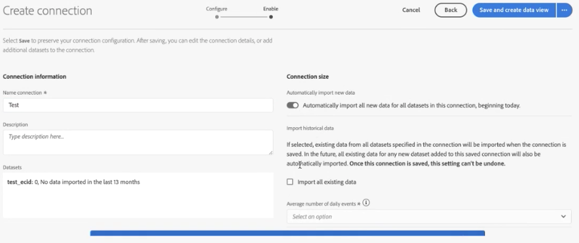

# Skapa en anslutning

Med en anslutning kan du integrera datauppsättningar från [!DNL Adobe Experience Platform] i [!UICONTROL Workspace]. För att rapportera om [!DNL Experience Platform] först måste du upprätta en anslutning mellan datauppsättningar i [!DNL Experience Platform] och [!UICONTROL Workspace].

Klicka [här](https://docs.adobe.com/content/help/en/platform-learn/tutorials/cja/connecting-customer-journey-analytics-to-data-sources-in-platform.html) för en videoöversikt.

>[!IMPORTANT]
>
>Du kan kombinera flera [!DNL Experience Platform] datauppsättningar till en enda anslutning.

## Markera sandlåda och datauppsättningar

1. Gå till [https://analytics.adobe.com](https://analytics.adobe.com).

1. Klicka på **[!UICONTROL Connections]** flik.

1. Klicka **[!UICONTROL Create new connection]** överst till höger.

   

1. Välj en sandlåda i Experience Platform som innehåller den eller de datamängder som du vill skapa en anslutning till.

   Adobe Experience Platform innehåller [sandlådor](https://docs.adobe.com/content/help/en/experience-platform/sandbox/home.html) som delar upp en enda plattformsinstans i separata virtuella miljöer för att hjälpa till att utveckla och utveckla program för digital upplevelse. Du kan tänka dig sandlådor som &quot;datassilor&quot; som innehåller datauppsättningar. Sandboxar används för att kontrollera åtkomst till datauppsättningar.  När du har valt sandlådan visas alla datauppsättningar i sandlådan som du kan dra från.

   >[!IMPORTANT]
   >
   >Du kan inte komma åt data över sandlådor, d.v.s. du kan bara kombinera datauppsättningar som finns i samma sandlåda.

1. Markera en eller flera datamängder som du vill dra in i [!UICONTROL Customer Journey Analytics] och klicka **[!UICONTROL Add]**.

   (Om du har många datauppsättningar att välja mellan kan du söka efter rätt datauppsättningar med hjälp av **[!UICONTROL Search datasets]** sökfältet ovanför listan över datauppsättningar.)

## Konfigurera datauppsättning

På höger sida kan du nu konfigurera den eller de datamängder du har lagt till.

1. **[!UICONTROL Dataset type]**: För varje datamängd som du har lagt till i den här anslutningen [!UICONTROL Customer Journey Analytics] ställer automatiskt in datamängdstypen baserat på de data som kommer in.

   Det finns tre olika datamängdstyper: [!UICONTROL Event] uppgifter, [!UICONTROL Profile] uppgifter, och [!UICONTROL Lookup] uppgifter.

   | Datauppsättningstyp | Beskrivning | Tidsstämpel | Schema | Person-ID |
   |---|---|---|---|---|
   | [!UICONTROL Event] | Data som representerar händelser i tid (t.ex. webbbesök, interaktioner, transaktioner, POS-data, undersökningsdata, intryck-data osv.). Detta kan till exempel vara typiska data för klickstream, med ett kund-ID eller ett cookie-ID och en tidsstämpel. Med händelsedata kan du vara flexibel när det gäller vilket ID som används som person-ID. | Anger automatiskt standardfältet för tidsstämpel från händelsebaserade scheman i [UICONTROL Experience Platform]. | Alla inbyggda eller anpassade scheman som är baserade på en XDM-klass med beteendet &quot;Time Series&quot;. Exempel på detta är XDM Experience Event eller XDM Decision Event. | Du kan välja vilket person-ID du vill inkludera. Varje datamängdsschema som definieras i Experience Platform kan ha en egen uppsättning av en eller flera identiteter som har definierats och associerats med ett identitetsnamnområde. Alla dessa kan användas som ID för person. Exempel är cookie-ID, Stitched ID, User ID, Tracking Code osv. |
   | [!UICONTROL Lookup] | (Analogt med en klassifikationsfil i traditionell Adobe Analytics.) Dessa data används för att söka efter värden eller nycklar som hittats i data för Händelse eller Profil. Du kan t.ex. överföra uppslagsdata som mappar numeriska ID:n i händelsedata till produktnamn. Se [detta användningsfall](/help/use-cases/b2b.md) till exempel. | Ej tillämpligt | Alla inbyggda eller anpassade scheman som är baserade på en XDM-klass med beteendet Record, förutom klassen XDM-individuell profil. | Ej tillämpligt |
   | [!UICONTROL Profile] | Motsvarande [!UICONTROL Customer Attributes] - för attribut som inte ändras och som inte är temporala. Data som används för besökare, användare eller kunder i [!UICONTROL Event] uppgifter. Du kan till exempel överföra CRM-data om dina kunder. | Ej tillämpligt | Ett inbyggt eller anpassat schema som är baserat på klassen XDM-individuell profil. | Du kan välja vilket person-ID du vill inkludera. Varje datamängd som definieras i [!DNL Experience Platform] har en egen uppsättning av ett eller flera angivna person-ID, t.ex. cookie-ID, Stitched ID, User ID, Tracking Code, etc. **Anteckning**: Om du skapar en anslutning som innehåller datauppsättningar med olika ID:n kommer rapporteringen att återspegla detta. Om du verkligen vill sammanfoga datauppsättningar måste du använda samma person-ID. |

1. **[!UICONTROL Dataset ID]**: Detta ID genereras automatiskt.

1. **[!UICONTROL Time stamp]**: lägga till innehåll här

1. **[!UICONTROL Schema]**: Detta är [schema](https://docs.adobe.com/content/help/en/experience-platform/xdm/schema/composition.html) baserat på vilket datamängden skapades i Adobe Experience Platform.

1. **[!UICONTROL Person ID]**: Välj ett person-ID i listrutan med tillgängliga identiteter. Dessa identiteter har definierats i datauppsättningsschemat i Experience Platform. Se nedan för information om hur du använder identitetskarta som ett personID.

   >[!IMPORTANT]
   >
   >Om det inte finns några person-ID att välja bland innebär det att ett eller flera person-ID inte har definierats i schemat. Visa [det här videoklippet](https://youtu.be/G_ttmGl_LRU) om hur man definierar en identitet i Experience Platform.

1. Klicka **[!UICONTROL Next]** för att gå till [!UICONTROL Enable Connection] dialog.

### Använd identitetskarta som person-ID

Customer Journey Analytics stöder nu möjligheten att använda identitetskartan för sitt Person ID. Identitetskarta är en kartdatastruktur som gör att någon kan överföra nyckelpar -> värdepar. Nycklarna är ID-namnutrymmen och värdet är den struktur som innehåller identitetsvärdet. Identitetskartan finns på varje rad/händelse som överförs och fylls i för varje rad i enlighet med detta.

Identitetskartan är tillgänglig för alla datamängder som använder ett schema baserat på [ExperienceEvent XDM](https://docs.adobe.com/content/help/en/experience-platform/xdm/home.html) klass. När du väljer att en sådan datauppsättning ska ingå i en CJA-anslutning kan du välja antingen ett fält som primärt ID eller Identitetskarta:

Om du väljer Identitetskarta får du ytterligare två konfigurationsalternativ:

| Alternativ | Beskrivning |
|---|---|
| [!UICONTROL Use Primary ID Namespace] | Detta instruerar CJA att per rad hitta identiteten i identitetskartan som är markerad med ett primär=true-attribut och använda den som ID för personen för den raden. Detta innebär att detta är den primärnyckel som kommer att användas i Experience Platform for partition. Det är också den primära kandidaten för användning som CJA:s besöks-ID (beroende på hur datamängden är konfigurerad i en CJA-anslutning). |
| [!UICONTROL Namespace] | (Det här alternativet är bara tillgängligt om du inte använder namnområdet Primärt ID.) Identitetsnamnutrymmen är en komponent i [Identitetstjänst för Adobe Experience Platform](https://docs.adobe.com/content/help/en/experience-platform/identity/namespaces.html) som fungerar som indikatorer för det sammanhang som en identitet avser. Om du anger ett namnområde kommer CJA att söka i varje rads identitetskarta för namnområdesnyckeln och använda identiteten under namnområdet som person-ID för den raden. Observera att eftersom CJA inte kan göra en fullständig genomsökning av alla rader för att avgöra vilka namnutrymmen som faktiskt finns, visas alla möjliga namnutrymmen i listrutan. Du måste veta vilka namnutrymmen som anges i data. detta kan inte identifieras automatiskt. |

### Kantfall för identitetskarta

I den här tabellen visas de två konfigurationsalternativen när det finns kantfall och hur de hanteras:

| Alternativ | Inga ID:n finns i identitetskartan | Inga ID har markerats som primära | Flera ID:n markeras som primära | Ett enskilt ID har markerats som primärt | Ogiltigt namnområde med ett ID markerat som primärt |
|---|---|---|---|---|---|
| **&quot;Använd namnområde för primärt ID&quot; markerat** | Raden tappas av CJA. | Raden ignoreras av CJA eftersom inget primärt ID har angetts. | Alla ID som markerats som primära, under alla namnutrymmen, extraheras till en lista. De sorteras sedan alfabetiskt. Med den här nya sorteringen används det första namnområdet med sitt första ID som Person-ID. | Det enskilda ID som markerats som primärt används som ID för person. | Även om namnområdet kan vara ogiltigt (finns inte i AEP) kommer CJA att använda det primära ID:t under namnområdet som Person-ID. |
| **Namnområde för specifik identitetskarta har valts** | Raden tappas av CJA. | Alla ID:n i det valda namnområdet extraheras till en lista och det första används som Person-ID. | Alla ID:n i det valda namnområdet extraheras till en lista och det första används som Person-ID. | Alla ID:n i det valda namnområdet extraheras till en lista och det första används som Person-ID. | Alla ID:n i det valda namnområdet extraheras till en lista och det första används som Person-ID. (Endast ett giltigt namnområde kan väljas när anslutningen skapas, så det är inte möjligt att använda ett ogiltigt namnområde/ID som person-ID) |

## Aktivera anslutning

1. Om du vill aktivera en anslutning definierar du följande inställningar:

   | Alternativ | Beskrivning |
   |---|---|
   | [!UICONTROL Name Connection] | Ge anslutningen ett beskrivande namn. Det går inte att spara anslutningen utan ett namn. |
   | [!UICONTROL Description] | Lägg till mer information om du vill skilja den här anslutningen från andra. |
   | [!UICONTROL Datasets] | Datauppsättningarna som ingår i den här anslutningen. |
   | [!UICONTROL Automatically import all new datasets in this connection, beginning today.] | Välj det här alternativet om du vill upprätta en pågående anslutning så att alla nya datagrupper som läggs till i datauppsättningarna i den här anslutningen automatiskt flödar in i [!UICONTROL Workspace]. |
   | [!UICONTROL Import all existing data] | När du väljer det här alternativet och sparar anslutningen kommer alla befintliga (historiska) data från [!DNL Experience Platform] för alla datauppsättningar som finns i den här anslutningen importeras. I framtiden kommer även alla befintliga historiska data för nya datamängder som lagts till i den här sparade anslutningen att importeras automatiskt.  **Observera att när den här anslutningen har sparats går det inte att ändra den här inställningen.** |

   **Kom ihåg:**

   * Om den kumulativa storleken på historiska data för alla datauppsättningar i anslutningen överstiger 1,5 miljarder rader visas ett felmeddelande om att du inte kan importera den här mängden historiska data. Om du däremot skulle lägga till en datamängd med 1 miljard rader historiska data och importera dessa data, och en vecka senare lägga till ytterligare en datamängd av samma storlek och importera historiska data, skulle det fungera.
   * Vi prioriterar nya data som läggs till i en datamängd i anslutningen, så dessa data har den lägsta latensen.
   * Alla återfyllnadsdata (historiska) importeras långsammare.

1. Klicka på **[!UICONTROL Save]**.

Nästa steg i arbetsflödet är att [skapa en datavy](/help/data-views/create-dataview.md).
