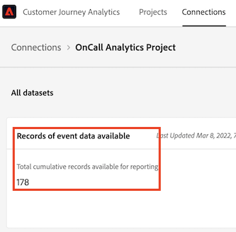

# Beräkna anslutningsstorlek

Du kan behöva veta hur många rader med data du har i [!UICONTROL Customer Journey Analytics]. Gör så här för att få en korrekt redovisning av hur din organisation använder händelsedatarader **för var och en av de anslutningar som din organisation har skapat**.

1. I [!UICONTROL Customer Journey Analytics]klickar du på **[!UICONTROL Connections]** -fliken.

   Nu kan du se en lista över alla dina aktuella anslutningar.

1. Klicka på varje anslutningsnamn för att komma till Anslutningshanteraren.

1. Lägg till **[!UICONTROL Records of event data available]** för alla anslutningar som skapas. (Beroende på storleken på anslutningen kan det ta en stund innan numret visas.)

   

1. När du har angett summan av alla händelsedatarader ska du slå upp behörigheten&quot;Rader med data&quot; i det Customer Journey Analytics-kontrakt som ditt företag signerade med Adobe.

   Detta ger det maximala antalet rader med data som tillåts i försäljningsordern. Om antalet rader med data som kom från steg 3 är större än det här talet, får du ett överskott.

1. Du kan åtgärda detta på flera sätt:

   * Ändra dina [inställningar för datalagring](https://experienceleague.adobe.com/docs/analytics-platform/using/cja-connections/manage-connections.html?lang=en#set-rolling-window-for-connection-data-retention).
   * [Ta bort oanvända anslutningar](https://experienceleague.adobe.com/docs/analytics-platform/using/cja-overview/cja-faq.html?lang=en#implications-of-deleting-data-components).
   * [Ta bort en datauppsättning i AEP](https://experienceleague.adobe.com/docs/analytics-platform/using/cja-overview/cja-faq.html?lang=en#implications-of-deleting-data-components).
   * Kontakta kontohanteraren för Adobe om du vill licensiera ytterligare kapacitet.

## Angående användningsövertäckning

Användningsgränserna övervakas regelbundet och upprätthålls av Adobe. datarader: de dagliga genomsnittliga datarader som finns tillgängliga för analys inom Customer Journey Analytics.

Anta till exempel att ditt avtal ger dig rätt till en miljon rader med data. Anta att du laddar upp två miljoner rader med data dag 1 av Customer Journey Analytics. På dag 2 tar du bort 1 miljon rader och behåller din användning på det högsta tillåtna antalet (dvs. en miljon rader data) under återstoden av licensvillkoren. Beroende på dina avtalsvillkor kan du ändå ådra dig en proportionell överanvändningsavgift för dag 1 eftersom du har överskridit dina licensrättigheter för&quot;datarader&quot;.

## Diagnostisera avvikelser

I vissa fall kanske du märker att det totala antalet händelser som är inkapslade av din anslutning skiljer sig från antalet rader i datauppsättningen i [!UICONTROL Adobe Experience Platform]. I det här exemplet har datauppsättningen &quot;B2B-komprimering&quot; 7 650 rader, men datauppsättningen innehåller 3 830 rader i [!UICONTROL Adobe Experience Platform]. Det finns flera orsaker till varför avvikelser kan inträffa, och följande åtgärder kan vidtas för att diagnostisera:

1. Dela upp den här dimensionen med **[!UICONTROL Platform Dataset ID]** och du kommer att märka två datauppsättningar med samma storlek men olika **[!UICONTROL Platform Dataset IDs]**. Varje datauppsättning har 3825 poster. Det betyder [!UICONTROL Customer Journey Analytics] 5 poster ignorerades på grund av saknade person-ID:n eller saknade tidsstämplar:

   

1. Dessutom, om vi checkar in [!UICONTROL Adobe Experience Platform], det finns ingen datauppsättning med ID:t &quot;5f21c12b732044194bffc1d0&quot;, vilket innebär att någon har tagit bort den här datauppsättningen från [!UICONTROL Adobe Experience Platform] när den första anslutningen skapades. Senare lades det till Customer Journey Analytics igen, men med ett annat [!UICONTROL Platform Dataset ID] genererades av [!UICONTROL Adobe Experience Platform].

Läs mer om [konsekvenser av datauppsättning och borttagning av anslutning](https://experienceleague.adobe.com/docs/analytics-platform/using/cja-overview/cja-faq.html?lang=en#implications-of-deleting-data-components) in [!UICONTROL Customer Journey Analytics] och [!UICONTROL Adobe Experience Platform].
