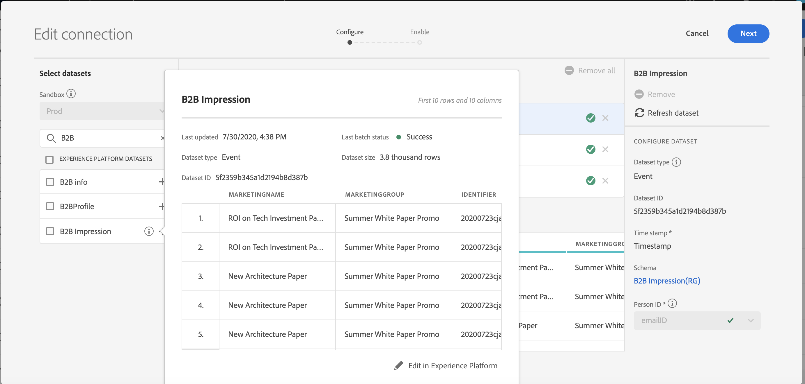

# Beräkna anslutningsstorlek

Du kan behöva veta hur många rader med data du har i [!UICONTROL Customer Journey Analytics]. Syftet med det här avsnittet är att visa hur du rapporterar hur du använder [!UICONTROL Customer Journey Analytics].

1. I [!UICONTROL Customer Journey Analytics]klickar du på **[!UICONTROL Connections]** -fliken.
1. På [!UICONTROL Edit connection] väljer du en anslutning som du vill ange användnings-/anslutningsstorlek för.

   

1. Välj en datauppsättning som är din del av anslutningen från den vänstra listen. I det här fallet är det datauppsättningen&quot;B2B-komprimering&quot;.

   

1. Klicka på den blå (i) ikonen (info) bredvid namnet. Du kommer att märka att datauppsättningen har 3,8 kB rader/händelser. Om du vill se det exakta antalet rader klickar du **[!UICONTROL Edit in Experience Platform]** nedanför förhandsgranskningstabellen. Detta dirigerar om dig till datauppsättningarna i [!UICONTROL Adobe Experience Platform].

   

1. Lägg märke till **[!UICONTROL Total records]** för den här datauppsättningen är 3,83 kB-poster med storleken 388,59 kB.

1. Upprepa steg 1-5 för andra datauppsättningar i anslutningen och lägg till antalet poster/rader. Det slutliga aggregerade numret är anslutningsens användningsmått. Detta är antalet rader i datauppsättningarna för anslutningen som du kommer att importera från [!UICONTROL Adobe Experience Platform].

## Bestämma antalet inkapslade rader

Antalet händelser som faktiskt har skickats in [!UICONTROL Customer Journey Analytics] beror på inställningarna för din anslutningskonfiguration. Om du dessutom har valt fel person-ID eller om detta ID inte är tillgängligt för vissa rader i datauppsättningarna [!UICONTROL Customer Journey Analytics] ignorerar de raderna. Så här avgör du vilka rader av händelser som faktiskt hämtas:

1. När du har sparat anslutningen skapar du en datavy av samma anslutning utan några filter.
1. Skapa ett Workspace-projekt och välj rätt datavy. Skapa en frihandstabell och dra och släpp **[!UICONTROL Events]** med **[!UICONTROL Year]** dimension. Välj ett stort datumintervall i datumvalskalendern för att kapsla in alla data i anslutningen. På så sätt kan du se hur många händelser som inhämtas till [!UICONTROL Customer Journey Analytics].

   

   >[!NOTE]
   >
   >På så sätt kan du se antalet händelser som hämtas från din händelsedatamängd. Det omfattar inte profil- och uppslagstypsdatamängder. Följ steg 1-3 under &quot;Beräkna anslutningsstorlek&quot; för profil- och uppslagsdatauppsättningar och lägg till siffrorna för att få det totala antalet rader för den här anslutningen.

## Diagnostisera avvikelser

I vissa fall kanske du märker att det totala antalet händelser som är inkapslade av din anslutning skiljer sig från antalet rader i datauppsättningen i [!UICONTROL Adobe Experience Platform]. I det här exemplet har datauppsättningen &quot;B2B-komprimering&quot; 7 650 rader, men datauppsättningen innehåller 3 830 rader i [!UICONTROL Adobe Experience Platform]. Det finns flera orsaker till varför avvikelser kan inträffa, och följande åtgärder kan vidtas för att diagnostisera:

1. Dela upp den här dimensionen med **[!UICONTROL Platform Dataset ID]** och du kommer att märka två datauppsättningar med samma storlek men olika **[!UICONTROL Platform Dataset IDs]**. Varje datauppsättning har 3825 poster. Det betyder [!UICONTROL Customer Journey Analytics] 5 poster ignorerades på grund av saknade person-ID:n eller saknade tidsstämplar:

   

1. Dessutom, om vi checkar in [!UICONTROL Adobe Experience Platform], det finns ingen datauppsättning med ID:t &quot;5f21c12b732044194bffc1d0&quot;, vilket innebär att någon har tagit bort den här datauppsättningen från [!UICONTROL Adobe Experience Platform] när den första anslutningen skapades. Senare lades det till i [!UICONTROL Customer Journey Analytics] igen, men en annan [!UICONTROL Platform Dataset ID] genererades av [!UICONTROL Adobe Experience Platform].

Läs mer om [konsekvenser av datauppsättning och borttagning av anslutning](https://experienceleague.adobe.com/docs/analytics-platform/using/cja-overview/cja-faq.html?lang=en#implications-of-deleting-data-components) in [!UICONTROL Customer Journey Analytics] och [!UICONTROL Adobe Experience Platform].
