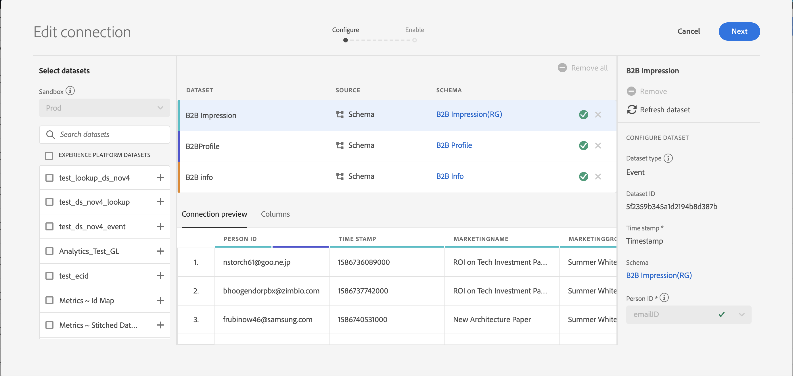

# Beräkna anslutningsstorlek

Du kan behöva veta hur många rader med data du har i [!UICONTROL Customer Journey Analytics]. Syftet med det här avsnittet är att visa hur du rapporterar vad din nuvarande användning av [!UICONTROL Customer Journey Analytics] är, för faktureringsändamål.

1. Klicka på fliken **[!UICONTROL Connections]** i [!UICONTROL Customer Journey Analytics].
1. På skärmen [!UICONTROL Edit connection] väljer du en anslutning som du vill fastställa storleken på användningen/anslutningen för.

   

1. Välj en datauppsättning som är din del av anslutningen från den vänstra listen. I det här fallet är det datauppsättningen&quot;B2B-komprimering&quot;.

   

1. Klicka på den blå (i) ikonen (info) bredvid namnet. Du kommer att märka att datauppsättningen har 3,8 kB rader/händelser. Om du vill se det exakta antalet rader klickar du **[!UICONTROL Edit in Experience Platform]** nedanför förhandsgranskningstabellen. Detta dirigerar om dig till datauppsättningarna i [!UICONTROL Adobe Experience Platform].

   

1. Observera att **[!UICONTROL Total records]** för den här datauppsättningen är 3,83 kB-poster med storleken 388,59 kB.

1. Upprepa steg 1-5 för andra datauppsättningar i anslutningen och lägg till antalet poster/rader. Det slutliga aggregerade talet blir anslutningens användningsmått, och detta är antalet rader i anslutningens datauppsättningar som du kommer att importera från [!UICONTROL Adobe Experience Platform].

## Bestämma antalet inkapslade rader

Hur många händelser som är inkapslade i CJA beror på inställningarna för din anslutningskonfiguration. Om du dessutom har valt fel person-ID eller om detta ID inte är tillgängligt för vissa rader i datauppsättningarna kommer [!UICONTROL Customer Journey Analytics] att ignorera dessa rader. Så här tar du reda på de faktiska händelseraderna som har skickats när en anslutning har sparats.

1. När du har sparat anslutningen skapar du en datavy av samma anslutning utan några filter.
1. Skapa ett Workspace-projekt och välj rätt datavy. Skapa en frihandstabell och dra och släpp **[!UICONTROL Events]**-måttet med dimensionen **[!UICONTROL Year]**. Välj det maximala datumintervallet från din datumvalskalender. På så sätt kan du se hur många händelser som hämtas till [!UICONTROL Customer Journey Analytics].

   

   >[!NOTE]
   >
   >På så sätt kan du se antalet händelser som hämtas från din händelsedatamängd. Det omfattar inte profil- och uppslagstypsdatamängder. Följ steg 1-3 för profil- och uppslagsdatauppsättningar och lägg till siffrorna för att få det totala antalet händelser för den här anslutningen.

## Felsökningsavvikelser

Du kan ha lagt märke till att det totala antalet inskickade händelser är &quot;7650&quot;, men att anslutningen bara hade händelsedatamängden &quot;B2B Impression&quot; med &quot;3830 rader&quot; i AEP. Varför finns det en diskrepans? Låt oss göra lite felsökning.

1. Dela upp den här dimensionen med **[!UICONTROL Platform Dataset ID]** så ser du två datauppsättningar med samma storlek men olika **[!UICONTROL Platform Dataset IDs]**. Varje datauppsättning har 3825 poster. Det innebär att [!UICONTROL Customer Journey Analytics] ignorerade 5 poster på grund av saknade person-ID:n eller BAVID:n (Big Visitor-ID:n):

   

1. Om vi dessutom checkar in [!UICONTROL Adobe Experience Platform] finns det ingen datauppsättning med ID:t &quot;5f21c12b732044194bffc1d0&quot;, vilket innebär att någon tog bort den här datauppsättningen från [!UICONTROL Adobe Experience Platform] när den första anslutningen skapades. Senare lades den till i [!UICONTROL Customer Journey Analytics] igen, men en annan [!UICONTROL Platform Dataset ID] genererades av [!UICONTROL Adobe Experience Platform].

   Läs mer om [konsekvenserna av datauppsättningen och borttagningen av anslutningen](https://experienceleague.adobe.com/docs/analytics-platform/using/cja-overview/cja-faq.html?lang=en#implications-of-deleting-data-components) i [!UICONTROL Customer Journey Analytics] och [!UICONTROL Adobe Experience Platform].