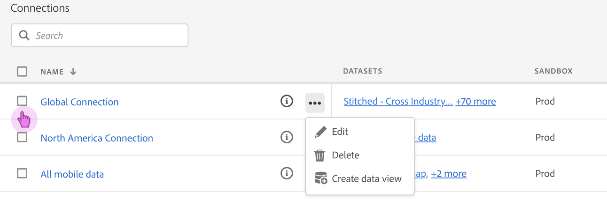

# Hantera anslutningar

När administratörsanvändare har [skapade en eller flera anslutningar](/help/connections/create-connection.md)kan de hantera dem i [!UICONTROL Connections] Chef. Den senaste uppdateringen av anslutningsfunktionen har två viktiga funktioner på sidan Anslutningsinformation som beskrivs längre ned på den här sidan:

* Här kan du kontrollera **status för anslutningsens datauppsättningar och för överföringsprocessen**. Med den här statuskontrollen får du veta när dina data är tillgängliga så att du kan gå till Analysis Workspace och börja analysera.

* Med den kan du **identifiera eventuella dataavvikelser** på grund av felkonfigurering. Saknar du några rader? Om ja, vilka rader saknas och varför? Har du felkonfigurerat anslutningar och orsakat saknade data i CJA?

>[!NOTE]
> Den här funktionen kommer att vara allmänt tillgänglig den 20 september 2021.

## Anslutningshanteraren {#connections-manager}

Med Anslutningshanteraren kan du:

* Visa alla dina anslutningar i en överblick, inklusive ägaren, sandlådan och när de skapades och ändrades.
* Visa alla datauppsättningar i en anslutning.
* Kontrollera status för en anslutning.
* Ta bort en anslutning.
* Byt namn på en anslutning.
* Skapa en datavy från en anslutning.

### Inställningar för Anslutningshanteraren

| Inställning | Beskrivning |
| --- | --- |
| [!UICONTROL Name] | Anslutningens egna namn. När du klickar på namnet på den hyperlänkade länken visas sidan med anslutningsinformation som beskrivs nedan. |
| Anslutningsinformation | Klicka på informationsikonen bredvid anslutningsnamnet för att visa följande information: |
| Redigera en anslutning | Klicka på ellipsen (..) bredvid anslutningsnamnet och klicka sedan på [!UICONTROL Edit]. Mer information finns i Redigera anslutning nedan. |
| Ta bort en anslutning | Klicka på ellipsen (..) bredvid anslutningsnamnet och klicka sedan på [!UICONTROL Delete]. Mer information under rubriken &quot;Ta bort anslutningar&quot; nedan. |
| Skapa datavy | Klicka på ellipsen (..) bredvid anslutningsnamnet och klicka sedan på [!UICONTROL Create data view]. Den här åtgärden skapar en ny datavy baserad på den här anslutningen. [Läs mer](https://experienceleague.adobe.com/docs/analytics-platform/using/cja-dataviews/data-views.html?lang=en) |
| [!UICONTROL Datasets] | De datauppsättningar som ingår i anslutningen. Du kan klicka på hyperlänken om du vill visa alla datauppsättningar i anslutningen. När du klickar på en datauppsättning öppnas datauppsättningen i Adobe Experience Platform på en ny flik. |
| [!UICONTROL Sandbox] | The [Adobe Experience Platform sandlåda](https://experienceleague.adobe.com/docs/experience-platform/sandbox/home.html?lang=en) från vilken den här anslutningen ritar sina datauppsättningar. Den här sandlådan valdes när du först skapade anslutningen. Den kan inte ändras. |
| [!UICONTROL Owner] | Den person som skapade anslutningen. |
| [!UICONTROL Import Data Sets] | Gör att du kan aktivera eller inaktivera det som tidigare kallades&quot;dataströmning&quot;. |
| [!UICONTROL Date Created] | Det datum då anslutningen skapades för första gången. |
| [!UICONTROL Last Modified] | Det datum då anslutningen senast uppdaterades. |

### Ta bort anslutningar {#connections-delete}

Endast administratörer har behörighet att ta bort en anslutning. Den här åtgärden visas inte för icke-administratörer.

1. Klicka på ellipsen (..) bredvid anslutningsnamnet.
1. Klicka på [!UICONTROL Delete].

När du tar bort en anslutning i [!UICONTROL Customer Journey Analytics]visas ett felmeddelande som anger att:

* Datavyer som har skapats baserat på den borttagna anslutningen fungerar inte längre.
* Alla arbetsyteprojekt som är beroende av datavyer i den borttagna anslutningen slutar fungera.

[Läs mer](/help/getting-started/cja-deletion.md) om borttagningskonsekvenser.

### Sök efter en anslutning eller datauppsättning

Du kan söka efter anslutningar med hjälp av sökfältet längst upp under [!UICONTROL Connections] titel.

### Sortera anslutningar

Du kan sortera anslutningar genom att klicka på varje kolumnrubrik och sortera uppåt eller nedåt.

## Sidan Anslutningsinformation {#connection-detail}

På den nya sidan Anslutningsinformation får du en detaljerad bild av anslutningsstatus.

Här kan du:

* Kontrollera status för anslutningsens datauppsättningar och för överföringsprocessen.
* Identifiera konfigurationsproblem som leder till överhoppade eller borttagna poster.
* Se när data är tillgängliga för rapportering.

>[!IMPORTANT]
>Eventuella uppgifter som lämnats in före den 13 augusti 2021 återspeglas inte i detta [!UICONTROL Connections] -dialogrutan.

Här beskrivs widgetar och inställningar:

### Inställningar för anslutningsinformation

| Widget/Setting | Beskrivning |
| --- | --- |
| Datauppsättningsväljare | Gör att du kan välja en eller alla datauppsättningar i anslutningen. Du kan inte markera datauppsättningar i flera steg. Standardvärdet är [!UICONTROL All datasets]. |
| Kalender-/datumintervall | Datumintervallet anger när du lade till data i anslutningen. Alla standardförinställningar för kalendrar ingår. Du kan anpassa datumintervallet, men inga anpassade datumintervall visas i listrutan. |
| [!UICONTROL Records of event data available] widget | Representerar det totala antalet händelsedatarader som är tillgängliga för rapportering, **för hela anslutningen**. Antalet är oberoende av eventuella kalenderinställningar. Den ändras om du väljer en datauppsättning från datauppsättningsväljaren eller genom att markera en datauppsättning i tabellen. (Observera att det finns en fördröjning på 1-2 timmar för att visa data i rapporter, när de har lagts till.) |
| [!UICONTROL Metrics] widget | Sammanfattar de händelseposter som lagts till/hoppats över/tagits bort och antalet batchar som lagts till, **för den datauppsättning och det datumintervall som du har valt**. |
| [!UICONTROL Records added] widget | Anger hur många rader som har lagts till under den valda tidsperioden, **för den datauppsättning och det datumintervall som du har valt**. Uppdaterades var 10:e minut. **Anteckning**: Data för **[!UICONTROL Records added]** inkluderar endast händelsedata för tillfället, inte profil- eller sökdata. |
| [!UICONTROL Records skipped] widget | Anger hur många rader som hoppades över under den valda tidsperioden. **för den datauppsättning och det datumintervall som du har valt**. Orsaker till att hoppa över poster är: Tidsstämplar saknas, person-ID saknas eller är ogiltigt osv. Uppdaterades var 10:e minut.
Ogiltiga person-ID:n (till exempel &quot;undefined&quot; eller &quot;000000&quot;) eller en kombination av siffror och bokstäver i en [!UICONTROL Person ID] som förekommer i en händelse (fler än 1 miljon gånger under en viss månad) inte kan tillskrivas någon specifik användare eller person. De kan inte importeras till systemet och leder till felbenägen intag och rapportering. Du kan åtgärda ogiltiga person-ID:n på tre sätt:<ul><li>Använd [Flerkanalsanalys](/help/connections/cca/overview.md) för att fylla i användar-ID:n som inte definierats eller är helt noll med giltiga användar-ID:n.</li><li>Ta bort användar-ID:t, som också kommer att hoppas över vid förtäring (helst inte med ogiltiga eller helt nolla användar-ID:n).</li><li>Korrigera ogiltiga användar-ID:n i systemet innan data hämtas.</li></ul>
**Anteckning**: Data för **[!UICONTROL Records skipped]** inkluderar endast händelsedata för tillfället, inte profil- eller sökdata. |
| [!UICONTROL Records deleted] widget | Anger hur många rader som har tagits bort under den valda tidsperioden, **för den datauppsättning och det datumintervall som du har valt**. Någon kan till exempel ha tagit bort en datauppsättning i Experience Platform. Uppdaterades var 10:e minut. **Anteckning**: Data för **[!UICONTROL Records deleted]** inkluderar endast händelsedata för tillfället, inte profil- eller sökdata. |
| Sökruta för datauppsättning | Du kan söka efter datauppsättningsnamn eller [!UICONTROL Dataset ID]. |
| [!UICONTROL Datasets] | Visar de datauppsättningar som ingår i anslutningen. Du kan klicka på hyperlänken om du vill visa alla datauppsättningar i anslutningen. |
| [!UICONTROL Dataset ID] | Detta ID genereras automatiskt av Adobe Experience Platform. |
| [!UICONTROL Batches] | Anger hur många databatchar som har lagts till i den här datauppsättningen. |
| [!UICONTROL Last added] | Visar tidsstämpeln för den senast tillagda batchen till den här datauppsättningen. |
| [!UICONTROL Dataset type] | Datamängdstypen för den här datauppsättningen kan [!UICONTROL Event], [!UICONTROL Lookup], eller [!UICONTROL Profile]. [Läs mer](https://experienceleague.adobe.com/docs/analytics-platform/using/cja-connections/create-connection.html?lang=en#configure-dataset) |
| Schema | Det Adobe Experience Platform-schema som datauppsättningarna i den här anslutningen baseras på. |

### Inställningar för höger räls på anslutningsnivå

| Inställning | Beskrivning |
| --- | --- |
| [!UICONTROL Refresh] | Uppdatera anslutningen så att nyligen tillagda poster kan återspeglas. |
| [!UICONTROL Delete] | Ta bort den här anslutningen. |
| [!UICONTROL Create data view] | Skapa en ny datavy baserad på den här anslutningen. [Läs mer](https://experienceleague.adobe.com/docs/analytics-platform/using/cja-dataviews/data-views.html?lang=en) |
| [!UICONTROL Connection name] | Visar det egna namnet för anslutningen. |
| [!UICONTROL Connection description] | Visar en mer detaljerad beskrivning som idealiskt beskriver syftet med den här anslutningen. |
| [!UICONTROL Sandbox] | The [Adobe Experience Platform sandlåda](https://experienceleague.adobe.com/docs/experience-platform/sandbox/home.html?lang=en) som den här anslutningen hämtar sina datauppsättningar från. Den här sandlådan valdes när du först skapade anslutningen. Den kan inte ändras. |
| [!UICONTROL Connection ID] | Detta ID genereras i Adobe Experience Platform. |
| [!UICONTROL Data views using connection] | Visar alla datavyer som använder den här anslutningen. |
| [!UICONTROL Import new data] | (På/av) Anger om nya datagrupper ska läggas till i historiska data (backfill) eller inte. |
| [!UICONTROL Backfill data] | Bakgrundsfyllningsdata (historiska) spåras i tre lägen: [!UICONTROL In queue], [!UICONTROL In progress] (med en förloppsprocent angiven), och [!UICONTROL Complete]. |
| [!UICONTROL Created by] | Visar namnet på den person som skapade anslutningen. |
| [!UICONTROL Last modified] | Visar datum och tid för den senaste ändringen av anslutningen. |
| [!UICONTROL Last modified by] | Visar den person som senast ändrade anslutningen. |

### Inställningar för höger räl på datauppsättningsnivå

| Inställning | Beskrivning |
| --- | --- |
| [!UICONTROL Person ID] | Visar en identitet som definierades i datauppsättningsschemat i Experience Platform. Detta är det person-ID som du valde när anslutningen skapades. Om du skapar en anslutning som innehåller datauppsättningar med olika ID:n, återspeglas detta i rapporten. Om du verkligen vill sammanfoga datauppsättningar måste du använda samma person-ID för alla datauppsättningar. |
| [!UICONTROL Records available] | Representerar det totala antalet rader som kapslats in för den här datauppsättningen, för den angivna tidsperioden som valts genom kalendern. Det finns ingen fördröjning när det gäller att få fram data som ska visas i rapporter när de har lagts till. (Undantaget är att när du skapar en helt ny anslutning kommer det att finnas [latens](https://experienceleague.adobe.com/docs/analytics-platform/using/cja-overview/cja-faq.html?lang=en#3.-getting-data-into-customer-travel-analytics). |
| [!UICONTROL Records added] | Anger hur många rader som har lagts till under den valda tidsperioden. **Anteckning**: Data för **[!UICONTROL Records added]** inkluderar endast händelsedata för tillfället, inte profil- eller sökdata. |
| [!UICONTROL Records deleted] | Anger hur många poster som togs bort under den valda tidsperioden. **Anteckning**: Data för **[!UICONTROL Records deleted]** inkluderar endast händelsedata för tillfället, inte profil- eller sökdata. |
| [!UICONTROL Batches added] | Anger hur många datagrupper som har lagts till i den här datauppsättningen. |
| [!UICONTROL Records skipped] | Anger hur många rader som hoppats över under intag under den valda tidsperioden.
Orsaker till att hoppa över poster är: Tidsstämplar saknas, person-ID saknas eller är ogiltigt osv. Uppdaterades var 10:e minut.
Ogiltiga person-ID:n (till exempel &quot;undefined&quot; eller &quot;000000&quot;) eller en kombination av siffror och bokstäver i en [!UICONTROL Person ID] som förekommer i en händelse (fler än 1 miljon gånger under en viss månad) inte kan tillskrivas någon specifik användare eller person. De kan inte importeras till systemet och leder till felbenägen intag och rapportering. Du kan åtgärda ogiltiga person-ID:n på tre sätt:<ul><li>Använd [Flerkanalsanalys](/help/connections/cca/overview.md) för att fylla i användar-ID:n som inte definierats eller är helt noll med giltiga användar-ID:n.</li><li>Ta bort användar-ID:t, som också kommer att hoppas över vid förtäring (helst inte med ogiltiga eller helt nolla användar-ID:n).</li><li>Korrigera ogiltiga användar-ID:n i systemet innan data hämtas.</li></ul>
**Anteckning**: Data för **[!UICONTROL Records skipped]** inkluderar endast händelsedata för tillfället, inte profil- eller sökdata. |
| [!UICONTROL Last added] | Anger när den senaste batchen lades till. |
| [!UICONTROL Dataset type] | Antingen [!UICONTROL Event], [!UICONTROL Lookup], eller [!UICONTROL Profile]. [Läs mer](https://experienceleague.adobe.com/docs/analytics-platform/using/cja-connections/create-connection.html?lang=en#configure-dataset) |
| [!UICONTROL Schema] | Visar det Adobe Experience Platform-schema som den här datauppsättningen baseras på. |
| [!UICONTROL Dataset ID] | Detta ID genereras i Adobe Experience Platform. |

## Redigera anslutning

Tillåter administratörer att redigera anslutningen. Välj en anslutning och klicka sedan på [!UICONTROL Edit Connection] för att komma till den här dialogrutan. Här kan du göra följande:

* Starta och sluta importera nya data. Denna process kallades tidigare för&quot;dataströmning&quot;.
* Byt namn på en anslutning.
* Uppdatera datauppsättningen/datauppsättningarna.
* Ta bort datauppsättningar från anslutningarna.

