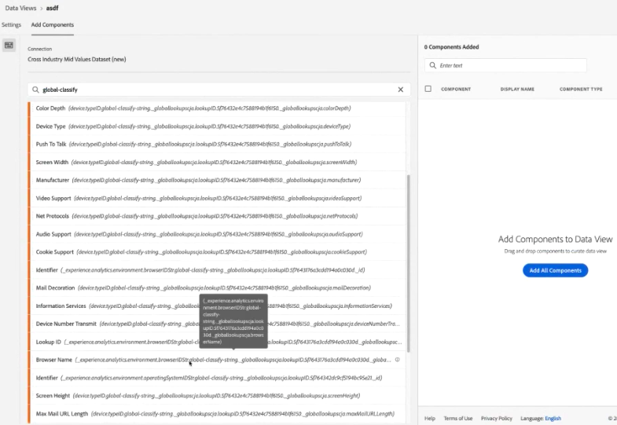

# Lägga till standardsökningar i datauppsättningar

>[!IMPORTANT]
>Standardsökningar är bara tillgängliga för datakällor i Analytics Data Connector i CJA. Du kan använda dem med Adobe Analytics standardimplementeringar eller [Adobe Experience Platform Web SDK](https://experienceleague.adobe.com/docs/experience-platform/edge/home.html)eller Experience Platform datainsamlings-API:erna.

Standarduppslag (kallas även uppslag som tillhandahålls av Adobe) förbättrar möjligheten för Customer Journey Analytics att rapportera om vissa dimensioner/attribut som inte är användbara för sig själva, men som är användbara när de sammanfogas med andra data. Exemplen innehåller attribut för mobila enheter och attribut för OS- och webbläsardimensioner, till exempel versionsnummer för webbläsare. En &#39;standardsökning&#39; liknar en uppsättningen sökdata. Standardsökningar kan användas i olika Experience Cloud-organisationer. De tillämpas automatiskt på alla händelsedatamängder som innehåller vissa XDM-schemafält (se nedan för de specifika fälten). Det finns en standarddatauppsättning för sökning för varje schemaplats som Adobe klassificerar.

I traditionella Adobe Analytics visas de här dimensionerna fristående, men i CJA måste du aktivt ta med de här dimensionerna när du skapar datavyer. I anslutningsarbetsflödet väljer du en datauppsättning som är flaggad som en med en nyckel för standardsökning. Användargränssnittet för datavyer kan automatiskt inkludera alla standardsökningsdimensioner som är tillgängliga för rapportering. Uppslagsfilerna uppdateras automatiskt och är tillgängliga i alla regioner och för alla konton. De lagras i regionspecifika organisationer som är kopplade till kunden.

## Använd standardsökningar med datauppsättningar för Adobe Data Connector

Datauppsättningar för standardsökning tillämpas automatiskt vid rapporttillfället. Om du använder Analytics Data Connector och har en dimension som Adobe tillhandahåller en standardsökning för, tillämpar vi automatiskt den här standardsökningen. Om en händelsedatamängd innehåller XDM-fält kan vi använda standardsökningar på den.

<!--
### Specific IDs that need to be populated

The following IDs need to be populated in the specific XDM mixins for this functionality to work:

* Environment Details Mixin – device/typeID value populated - Must match Device Atlas IDs and will populate device data.
* Adobe Analytics ExperienceEvent Template Mixin or Adobe Analytics ExperienceEvent Full Extension Mixin with analytics/environment/browserIDStr and analytics/environment/operatingSystemIDStr. Both must match the Adobe IDs and  populate browser and OS data, respectively.

You need these mixins with the three IDs populated (device/typeID, environment/browserIDStr, and environment/operatingSystemIDStr). The lookup dimensions will then be pulled automatically by CJA and will be available in the Data View.

The catch here is that they can only populate those IDs today if they have a direct relationship with Device Atlas. They are Device Atlas IDs, and they provide an API to allow a customer to look them up. This is a significant hurdle, and we may just want to take the reference to this capability out of the product documentation until we have a productized way to expose the Device Atlas ID lookup functionality.
-->

### Tillgängliga standardsökfält

* `browser`
   * `browser`, `group_id`, `id`
* `browser_group`
   * `browser_group`, `id`
* `os`
   * `os`, `group_id`, `id`
* `os_group`
   * `os_group`, `id`
* `mobile_audio_support - multi`
* `mobile_color_depth`
* `mobile_cookie_support`
* `mobile_device_name`
* `mobile_device_number_transmit`
* `mobile_device_type`
* `mobile_drm - multi`
* `mobile_image_support - multi`
* `mobile_information_services`
* `mobile_java_vm - multi`
* `mobile_mail_decoration`
* `mobile_manufacturer`
* `mobile_max_bookmark_url_length`
* `mobile_max_browser_url_length`
* `mobile_max_mail_url_length`
* `mobile_net_protocols - multi`
* `mobile_os`
* `mobile_push_to_talk`
* `mobile_screen_height`
* `mobile_screen_size`
* `mobile_screen_width`
* `mobile_video_support - multi`

## Rapport om standardsökningsdimensioner

För att kunna rapportera standarddimensioner för sökning måste du lägga till dem när du skapar en datavy i Customer Journey Analytics:

Du kan sedan se sökdata i arbetsytan:

