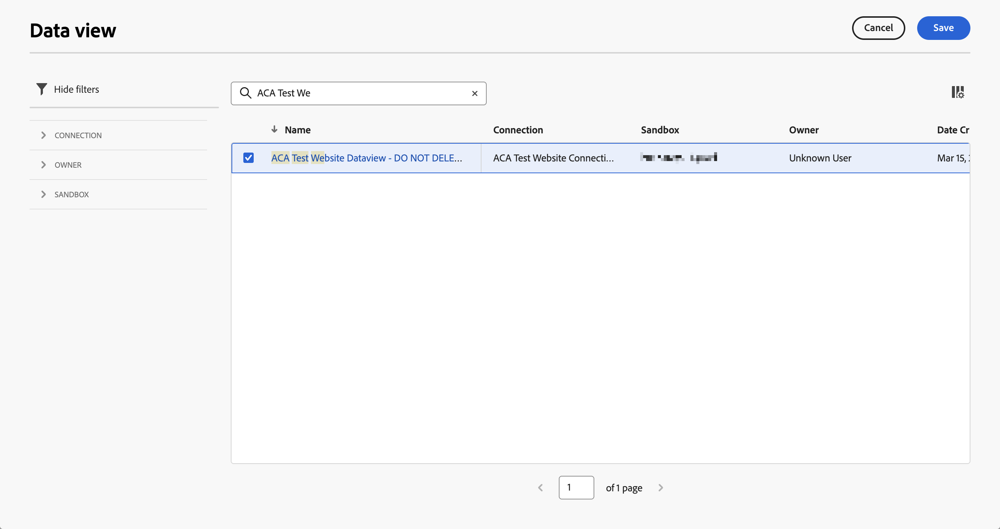

# Guidad konfiguration för innehållsanalys

{{draft-aca}}

{{release-limited-testing}}

Med den guidade konfigurationen kan du konfigurera innehållsanalyser snabbt och enkelt. I den guidade konfigurationen används en guide för att konfigurera kraven för att konfigurera Content Analytics automatiskt för din organisation. På skärmen **[!UICONTROL Configuration]** kan du antingen skapa en ny konfiguration eller redigera en befintlig konfiguration.

>[!IMPORTANT]
>
>Du kan bara ha en Content Analytics-konfiguration per sandlåda i organisationen.

Få åtkomst till konfigurationen för innehållsanalys

* Välj **[!UICONTROL Data Management]** > **[!UICONTROL Content Analytics Configuration]** på huvudmenyn i Customer Journey Analytics.

På skärmen **[!UICONTROL Content Analytics Configurations]** visas en tabell med befintliga Content Analytics-konfigurationer.

För varje konfiguration finns följande information:

| Kolumn | Beskrivning |
|---|---|
| **[!UICONTROL Name]** | Namnet på konfigurationen. |
| **[!UICONTROL Created by]** | Det tekniska konto som skapade konfigurationen. |
| **[!UICONTROL Created on]** | Tidsstämpeln när konfigurationen skapades. |
| **[!UICONTROL Modified on]** | Tidsstämpeln när konfigurationen senast ändrades. |
| **[!UICONTROL Sandbox]** | Sandlådan inom organisationen där innehållsanalys har konfigurerats och implementerats (planeras att konfigureras). |
| **[!UICONTROL Status]** | Konfigurationens status. Statusen kan vara:  **[!UICONTROL Draft]**: Konfigurationen sparas för senare och distribueras inte.  **[!UICONTROL Failed]**: Konfigurationen misslyckades. Du kan välja **[!UICONTROL Edit]** för att få information om felet. Adobe åtgärdar proaktivt misslyckade implementeringar. Du kan kontakta Kundtjänst för mer information.  **[!UICONTROL Complete]**: Konfigurationen har slutförts och implementerats. |

Du kan använda  för att anpassa tabellen. Välj vilka kolumner som ska visas i dialogrutan **[!UICONTROL Customize table]** och välj **[!UICONTROL Apply]** för att tillämpa ändringarna.

På skärmen Content Analytics **[!UICONTROL Configuration]** kan du skapa en ny konfiguration eller redigera en befintlig konfiguration.

Så här skapar du en ny konfiguration:

* Välj **[!UICONTROL Create configuration]**. Den här åtgärden öppnar den [guidade konfigurationsguiden](#guided-configuration-wizard).

Redigera en befintlig konfiguration:

* Välj  och sedan  **[!UICONTROL Edit]** för en befintlig konfiguration för innehållsanalys. Den här åtgärden öppnar den [guidade konfigurationsguiden](#guided-configuration-wizard).

## Guiden Guidad konfiguration

Guiden för guidad konfiguration består av fyra avsnitt ([Detaljer](#details), [Datavy](#data-view), [Experience capture &amp; definition](#experience-capture-and-definition) och [Data collection](#data-collection)), där du uppmanas ange vilka uppgifter som krävs för att konfigurera och konfigurera Content Analytics korrekt. Slutför varje avsnitt innan du går till nästa avsnitt, eftersom vissa inställningar i ett avsnitt kan bero på konfigurationsvärden i tidigare avsnitt.

### Information {#onboarding-details}

<!-- markdownlint-disable MD034 -->

>[!CONTEXTUALHELP]
>id="aca_onboarding_details_button"
>title="Information"
>abstract="Ange ett namn för anslutningen. I avsnitten **[!UICONTROL Data view]**, **[!UICONTROL Experience capture and definition]** och **[!UICONTROL Data collection]** anger du mer information för att säkerställa att innehållsanalysen kan konfigureras korrekt."

>[!CONTEXTUALHELP]
>id="aca_onboarding_details_name_header"
>title="Information"
>abstract="I den här guiden anges de krav som krävs för att konfigurera Content Analytics. Ange ett namn för konfigurationen"

<!-- markdownlint-enable MD034 -->

Varje konfiguration kräver ett unikt namn. Exempel: `Example Content Analytics configuration`. Namnet krävs för att spara eller implementera en konfiguration.

### Datavy {#onboarding-data-view}

<!-- markdownlint-disable MD034 -->

>[!CONTEXTUALHELP]
>id="ac_onboarding_dataview_button"
>title="Datavy"
>abstract="För konfigurationen av innehållsanalysen måste du välja en befintlig datavy. Så att ni kan sammanfoga era innehållsanalysdata med andra data."

>[!CONTEXTUALHELP]
>id="aca_onboarding_dataview_header"
>title="Datavy"
>abstract="Välj en befintlig datavy från Customer Journey Analytics som du vill sammanfoga dina innehållsanalysdata med."

>[!CONTEXTUALHELP]
>id="aca_onboarding_dataview_header_alt"
>title="Datavy"
>abstract="Välj en befintlig datavy från Customer Journey Analytics som du vill sammanfoga dina innehållsanalysdata med. "

>[!CONTEXTUALHELP]
>id="aca_onboarding_dataview_change_dialog"
>title="Ny datavy"
>abstract="Om du väljer en ny datavy uppdateras datavyn så att den innehåller Content Analytics-mått och mått. Om det behövs uppdateras även den associerade anslutningen så att den innehåller innehållsanalysdatauppsättningar. Anslutningen och datavyn som för närvarande är konfigurerad för innehållsanalys ändras inte."

>[!CONTEXTUALHELP]
>id="aca_onboarding_dataview_current_cleanup_labels_dialog"
>title="Rensa den markerade datavyn"
>abstract="Du har valt en datavy som redan har etablerats för Content Analytics. Den befintliga Content Analytics-konfigurationen tas bort och datavyn etableras med den nya konfigurationen."

>[!CONTEXTUALHELP]
>id="aca_onboarding_dataview_prev_cleanup_labels_dialog"
>title="Rensa föregående datavy"
>abstract="Du har valt en ny datavy. Content Analytics-konfigurationen för den tidigare markerade datavyn tas bort."

<!-- markdownlint-enable MD034 -->

Din konfiguration kräver att du väljer en [datavy](/help/data-views/data-views.md).

1. Välj en datavy

   * Använd  **[!UICONTROL Select Data view]** om du vill välja en ny datavy för en konfiguration.

     

   * Om du vill ändra en datavy för en konfiguration väljer du  **[!UICONTROL Edit]**.

     

   I båda scenarierna visas en **[!UICONTROL Data view]**-dialogruta där du kan välja en datavy för din konfiguration.

   

   För en ny konfiguration visar listan endast datavyer som är associerade med sandlådor som inte har någon aktiv konfiguration. Dessutom visas endast datavyer som är kopplade till sandlådor som du har åtkomst till och anslutningar som du har behörighet att ändra.

   Om du redigerar en befintlig konfiguration visas endast datavyer som är tillgängliga i sandlådan som redan är kopplad till den befintliga konfigurationen.

   Du kan utföra följande åtgärder:

   * Om du vill söka efter en viss datavy använder du fältet .
   * Om du vill filtrera listan med tillgängliga datavyer väljer du . Du kan filtrera listan på [!UICONTROL Connection], [!UICONTROL Owner] och [!UICONTROL Sandbox]. Använd  **[!UICONTROL Hide filters]** för att dölja filterrutan.
   * Om du vill definiera vilka kolumner som ska visas i tabellen väljer du . Välj vilka kolumner som ska visas i dialogrutan **[!UICONTROL Customize table]** och välj **[!UICONTROL Apply]** för att tillämpa ändringarna.

1. Välj  för datavyn som du vill använda.
1. Välj **[!UICONTROL Save]** för att bekräfta den valda datavyn. Välj **[!UICONTROL Cancel]** om du vill avbryta.

I Customer Journey Analytics är en datavy knuten till en Customer Journey Analytics [Connection](/help/connections/overview.md). Och en Connection är baserad på en sandlåda i organisationen. När du har sparat konfigurationen fylls **[!UICONTROL Sandbox]** automatiskt i med namnet på sandlådan, baserat på den valda datavyn.

### Upplevelsehantering och -definition {#onboarding-experiences}

<!-- markdownlint-disable MD034 -->

>[!CONTEXTUALHELP]
>id="aca_onboarding_experiences_button"
>title="Upplevelsehantering och -definition"
>abstract="Du kan välja att inkludera upplevelser i de data du samlar in med Content Analytics. När du väljer det här alternativet måste du definiera en eller flera kombinationer av en regex- och frågeparametrar för att definiera för vilka URL:er du vill inkludera upplevelser."

>[!CONTEXTUALHELP]
>id="aca_onboarding_experiences_header"
>title="Upplevelsehantering och -definition"
>abstract="Samla upplevelser i innehållsanalys"

>[!CONTEXTUALHELP]
>id="aca_onboarding_experiences_parameters_header"
>title="Upplevelsehantering och -definition"
>abstract="Ange parametrarna som bestämmer hur innehåll återges på webbplatsen."

>[!CONTEXTUALHELP]
>id="aca_onboarding_experiencecapture_edit_button"
>title="Upplevelsehantering och -definition"
>abstract="Du kan redigera inställningarna i tillägget Adobe Content Analytics i taggegenskapen som är kopplad till den aktuella konfigurationen."

<!-- markdownlint-enable MD034 -->

I det här avsnittet kan du välja att inkludera upplevelser i de data som du samlar in med Content Analytics.  En upplevelse är all text på en webbsida som är reproducerbar med den URL som den första användaren använder när han/hon besöker den webbsidan.

Som standard är **[!UICONTROL Include experiences]** inaktiverad. När du väljer det här alternativet måste du definiera för vilka URL-adresser som du vill inkludera upplevelser.

Inkludera endast upplevelser när följande gäller:

* Du kan bara komma åt webbplatsinnehållet med offentliga URL:er. Åtkomst till webbplatsen kräver inte personliga tokens, cookies eller andra mekanismer som inte är tillgängliga via URL:en.
* Sidorna på webbplatsen måste kunna reproduceras med hjälp av sidans URL.

Så här inkluderar du upplevelser i en ny eller ej implementerad konfiguration:

1. Aktivera **[!UICONTROL Include experiences]**.
1. Du kan också ange parametrar för hur innehåll återges på webbplatsen. Parametrarna är noll eller flera kombinationer av **[!UICONTROL Domain regular expression]** och **[!UICONTROL Query parameters]**. Frågeparametrarna anger vilka parametrar som påverkar innehållet på sidan. Med dessa indata kan Content Analytics ignorera alla parametrar som inte påverkar innehållet på sidan när en unik upplevelse definieras.
   1. Ange en **[!UICONTROL Domain regular expression]**, till exempel `/^(?!.*\b(store|help|admin)\b)/`. Se till att du undviker reguljära uttryck med `/`. Det reguljära uttrycket för domänen anger vilka URL:er dessa parametrar gäller för. Du kan till exempel ha flera platser, och för varje plats styr olika parametrar innehållet. Om frågeparametrarna gäller för alla dina sidor kan du använda `.*` för att ange alla sidor.
   1. Ange en kommaavgränsad lista med **[!UICONTROL Query parameters,]**, till exempel `outdoors, patio, kitchen`.
1. Välj **[!UICONTROL Remove]** om du vill ta bort en kombination av reguljära uttryck och frågeparametrar för domäner.
1. Välj **[!UICONTROL Add Regex]** om du vill lägga till en annan kombination av ett reguljärt uttryck och frågeparametrar.

Så här redigerar du befintliga eller inkluderar nya upplevelser i en implementerad konfiguration:

* Växla **[!UICONTROL Include experiences]** om du vill aktivera eller inaktivera tillgängligheten för upplevelsekomponenter, visualiseringar och paneler i Analysis Workspace.
* Välj  **[!UICONTROL Edit]** om du vill redigera konfigurationen för datainsamling för upplevelser i Content Analytics. Du omdirigeras till [Adobe Content Analytics-tillägget](https://experienceleague.adobe.com/en/docs/experience-platform/tags/extensions/client/content-analytics/overview#configure-event-filtering) i taggegenskapen som är associerad med den aktuella konfigurationen.

### Datainsamling {#onboarding-data-collection}

I det här avsnittet konfigurerar du hur du samlar in innehållsanalysdata.

<!-- markdownlint-disable MD034 -->

>[!CONTEXTUALHELP]
>id="aca_onboarding_datacollection_button"
>title="Datainsamling"
>abstract="Ange vilken taggegenskap du vill använda eller skapa en ny. Och definiera de sidor och resurser som du vill inkludera eller exkludera med hjälp av reguljära uttryck."

>[!CONTEXTUALHELP]
>id="aca_onboarding_datacollection_tag_header"
>title="Datainsamling"
>abstract="**Ange en taggegenskap**"

>[!CONTEXTUALHELP]
>id="aca_onboarding_datacollection_pages_excluded_boldheader"
>title="Datainsamling"
>abstract="**Sidor som ska inkluderas/exkluderas**"

>[!CONTEXTUALHELP]
>id="aca_onboarding_datacollection_pages_excluded_header"
>title="Datainsamling"
>abstract="Ange vilka sidor som ska **inkluderas** eller **exkluderas** vid insamling av data för innehållsanalys"

>[!CONTEXTUALHELP]
>id="aca_onboarding_datacollection_assets_excluded_boldheader"
>title="Datainsamling"
>abstract="**Assets att inkludera/exkludera**"

>[!CONTEXTUALHELP]
>id="aca_onboarding_datacollection_assets_excluded_header"
>title="Datainsamling"
>abstract="Ange vilka resurser som ska **inkluderas** eller **exkluderas** vid insamling av data för innehållsanalys"

>[!CONTEXTUALHELP]
>id="aca_onboarding_datacollection_experiences_edit_button"
>title="Datainsamling"
>abstract="Du kan redigera inställningarna för sidor i tillägget Adobe Content Analytics i taggegenskapen som är kopplad till den aktuella konfigurationen."

>[!CONTEXTUALHELP]
>id="aca_onboarding_datacollection_assets_edit_button"
>title="Datainsamling"
>abstract="Du kan redigera inställningarna för resurser i Adobe Content Analytics-tillägget i taggegenskapen som är kopplad till den aktuella konfigurationen."

<!-- markdownlint-enable MD034 -->

#### Ny konfiguration {#new-configuration}

I en ny konfiguration måste du definiera om du vill använda en befintlig taggegenskap eller skapa en ny taggegenskap. Och du måste definiera sidorna och resurserna som du vill inkludera eller exkludera med hjälp av reguljära uttryck.

* Så här använder du en befintlig taggegenskap:

  

   1. Välj **[!UICONTROL Choose existing]**.
   2. Välj en befintlig egenskap i listrutan **[!UICONTROL Tags property]**. Du kan börja skriva för att söka efter och begränsa de tillgängliga alternativen.

* Så här skapar du en ny taggegenskap:

  

   1. Välj **[!UICONTROL Create new]**.
   1. Ange en **[!UICONTROL Tags name]**, till exempel `ACA Test for Documentation`.
   1. Ange **[!UICONTROL Domains]**, till exempel `example.com`.

* Om du har valt att inkludera upplevelser, ange vilka sidor som ska inkluderas eller exkluderas när du samlar in data för Content Analytics.

   * Ange en sträng för reguljärt uttryck för **[!UICONTROL Pages to include / exclude]**. Till exempel: `/^(?!.*documentation).*/` om du vill exkludera alla dokumentationssidor från Content Analytics. Se till att du undviker reguljära uttryck med `/`.

* Ange vilka resurser som ska inkluderas eller exkluderas när du samlar in data för Content Analytics.

   * Ange en sträng för reguljärt uttryck för **[!UICONTROL Assets to include / exclude]**. Till exempel: `/^(?!.*(logo\.jpg|\.svg)).*$/` om du vill exkludera alla JPEG- och SVG-logotyper från Content Analytics. Se till att du undviker reguljära uttryck med `/`.

#### Befintlig konfiguration {#existing-configuration}

För en befintlig konfiguration kan du inte redigera taggegenskapen. Du kan dock redigera sidor och resurser som ska inkluderas eller exkluderas.

* Om du vill redigera vilka sidor som ska inkluderas eller exkluderas när du samlar in data för innehållsanalys väljer du  **[!UICONTROL Edit]** under **[!UICONTROL Experience]**. Du omdirigeras till det [Adobe Content Analytics-tillägg](https://experienceleague.adobe.com/en/docs/experience-platform/tags/extensions/client/content-analytics/overview#configure-event-filtering) som är associerat med taggegenskapen för den aktuella Content Analytics-konfigurationen. Du kan redigera det reguljära uttrycket så att sidor tas med eller utesluts. Kontrollera att du [publicerar](#publish) dina ändringar.

* Om du vill redigera vilka resurser som ska inkluderas eller exkluderas när du samlar in data för Content Analytics väljer du  **[!UICONTROL Edit]** under **[!UICONTROL Asset]**. Du omdirigeras till det [Adobe Content Analytics-tillägg](https://experienceleague.adobe.com/en/docs/experience-platform/tags/extensions/client/content-analytics/overview#configure-event-filtering) som är associerat med taggegenskapen för den aktuella Content Analytics-konfigurationen. Du kan redigera det reguljära uttrycket för att inkludera eller exkludera resurser. Kontrollera att du [publicerar](#publish) dina ändringar.

### Sammanfattning {#summary}

När du har angett all nödvändig information visas en sammanfattning med information om de artefakter som skapas eller ändras.

* En **[!UICONTROL You're almost ready to implement _konfigurationsnamn _för innehållsanalys]**visas när du implementerar en ny konfiguration.

* För befintliga implementerade konfigurationer visas ett **[!UICONTROL You have implemented _konfigurationsnamn _för en sammanfattning av innehållsanalys]**.

### Åtgärder {#actions}

<!-- markdownlint-disable MD034 -->

>[!CONTEXTUALHELP]
>id="aca_onboarding_implementation_warning_dialog"
>title="Bekräftelse av implementering"
>abstract="Om du väljer **[!UICONTROL Implement]** konfigureras innehållsanalysen baserat på de indata du har angett i det här arbetsflödet. Flera inställningar väljs som standard baserat på vad som är praktiskt för Content Analytics, men du (som registeransvarig) måste granska inställningarna för varje artefakt för att bekräfta att inställningarna har implementerats i enlighet med din sekretesspolicy, avtalsrättigheter och skyldigheter samt krav på samtycke enligt tillämplig lag.  Observera att inga data samlas in förrän taggbiblioteket som är associerat med den här konfigurationen publiceras manuellt.  För att härleda attribut för bilder och text hämtar Adobe attributen med:<ol><li>URL-adressen, som hämtas när användaren besöker webbplatsen, enligt de datainsamlingsinställningar du har konfigurerat, och</li><li>URL-adressen där bilden finns.</li></ol>Du får inte märka bilder som lagras på tredjepartswebbplatser."

<!-- markdownlint-enable MD034 -->

När du har skapat eller redigerat en konfiguration är följande åtgärder tillgängliga.

* **[!UICONTROL Discard]**: Alla ändringar som gjorts som en del av skapandet av en ny konfiguration eller redigeringen av en befintlig konfiguration tas bort.
* **[!UICONTROL Save for later]**: Ändringar som görs i en ny konfiguration eller en befintlig konfiguration som ännu inte implementerats sparas. Du kan gå igenom konfigurationen igen senare om du vill göra ytterligare ändringar eller implementera konfigurationen.
* **[!UICONTROL Implement]**: Inställningar för eller ändringar som gjorts i en ny konfiguration eller befintlig konfiguration som ännu inte implementerats sparas och implementeras. Implementeringen består av följande:

   * **[!UICONTROL Customer Journey Analytics]**-konfiguration:
      * Den valda datavyn uppdateras med mått och mått för innehållsanalys.
      * Anslutningen som är kopplad till den valda datavyn ändras så att den omfattar Content Analytics-händelser och attribut.
      * En rapportmall för Content Analytics läggs till i Workspace.

   * **[!UICONTROL Adobe Experience Platform]**-konfiguration:
      * Skapa scheman för att modellera Content Analytics-händelser, resursattribut och (om de är konfigurerade) upplevelseattribut.
      * Skapa datauppsättningar för att samla in Content Analytics-händelser, resursattribut och (om de är konfigurerade) upplevelseattribut.
      * Skapandet av ett dataflöde som använder funktionstjänsten för att generera och uppdatera innehållsattribut från Content Analytics-händelser.

   * **[!UICONTROL Data collection]**-konfiguration:
      * Den nya eller befintliga taggegenskapen är konfigurerad för Content Analytics datainsamling. Den här konfigurationen innebär att tillägget Adobe Content Analytics för taggar ingår.
      * En datastream skapas för Content Analytics-händelser.
      * Tillägget Adobe Content Analytics är konfigurerat för att säkerställa att Content Analytics-händelser skickas till datastream för Content Analytics.
      * Om Web SDK inte är konfigurerat för taggegenskapen skapas en ny Web SDK-konfiguration som endast skickar Content Analytics-händelser.
      * Om Web SDK är konfigurerat för den här taggegenskapen görs inga ändringar i den befintliga Web SDK-konfigurationen.

* **[!UICONTROL Save]**: Ändringar som görs i en implementerad konfiguration sparas och implementeringen uppdateras.
* **[!UICONTROL Exit]**. Avslutar den guidade konfigurationen. Alla ändringar som görs i en implementerad konfiguration ignoreras.

## Publicera {#publish}

Om du vill börja samla in data för din Content Analytics-konfiguration måste du [manuellt](manual.md) publicera taggegenskapen som skapas när du har valt **[!UICONTROL Implement]**.

>[!MORELIKETHIS]
>
>[Manuell konfiguration](manual.md)
>
