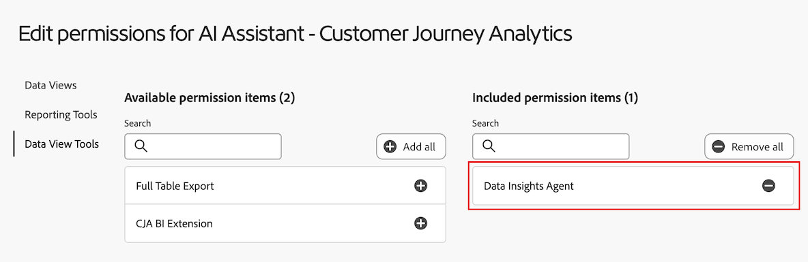

# Visualisera data med Data Insights Agent i Customer Journey Analytics

>[!AVAILABILITY]
>
>Den funktionalitet som beskrivs i den här artikeln är tillgänglig för alla berättigade kunder som en del av en fasversion från och med 28 maj 2025 och är kanske inte tillgänglig i din miljö ännu. Den här anteckningen tas bort när funktionen är allmänt tillgänglig. Mer information om Customer Journey Analytics finns i [Customer Journey Analytics funktionsreleaser](/help/release-notes/releases.md).

>[!AVAILABILITY]
>
>Agenten för datainsikter är tillgänglig för berättigade kunder under en begränsad tid. Åtkomsten till Data Insights Agent upphör 30 november 2025. Om du vill fortsätta använda en Data Insights Agent utan avbrott kan du kontakta din Adobe-kontorepresentant för att få mer information om hur du licensierar Data Insights Agent.

Agenten för datainsikter, som nås från AI Assistant i Customer Journey Analytics, är en generativ AI-konversationsagent som snabbt och effektivt besvarar frågor om dina data. Det bygger upp relevanta visualiseringar i Analysis Workspace med komponenter från datavyn och med era faktiska data.

Med Data Insights Agent kan du besvara datacentrerade frågor i Analysis Workspace och spara massor av tid som du annars skulle behöva lägga på att manuellt skapa visualiseringar i Analysis Workspace och bekanta dig med komponenterna i datavyn.

## Funktioner som är inom och utanför omfånget

| Funktion | I omfånget | Odefinierad |
| --- | --- | --- |
| **Visualiseringstyper** | <ul><li>Linje</li><li>Flera rader</li><li>Frihandsregister</li><li>Liggande</li><li>Munk</li><li>Sammanfattningsnummer</li></ul> | <ul><li>Flöde</li><li>Utfall</li><li>Kohortabell</li><li>Område, staplat område</li><li>Stapel, staplad</li><li>Punkt</li><li>Kombination</li><li>Histogram</li><li>Vågrätt streck, vågrätt streck</li><li>Sammanfattning av nyckelmått</li><li>Spridning</li><li>Sammanfattningsändring</li><li>Text</li><li>Treemap</li><li>Venn</li><li>Guidad analys: aktiv tillväxt, konverteringstrender, engagemang, förstahandseffekt, frekvens, tratt, nettotillväxt, Release impact, Retention, Timeline, Trends</li></ul> |
| **Workspace-åtgärder och agentfunktioner** | <ul><li>Skapa och uppdatera visualiseringar
Skapar en friformstabell och tillhörande visualisering (t.ex. en linje, streck, munstycke).
Exempel: *Vad är vinsten för SKU:er från februari till maj?*
</li><li>Ställ uppföljningsfrågor
Svara på en fråga i sammanhanget från tidigare uppmaningar. Exempel:
 <ul><li>Fråga 1: *Trendhändelser från mars.*</li><li>Fråga 2: *Visa data från mars till april i stället*</li></ul> </li><li>Odefinierad snabb upptäckt
Om du skickar en fråga som ligger utanför omfånget, till exempel *Exportera det här projektet*, svarar Data Insights-agenten genom att informera dig om att frågan ligger utanför omfånget.
</li></ul> | <ul><li>Dela</li><li>Exportera</li><li>Ladda ned</li><li>Hantera användarinställningar</li><li>Hantera datavy</li><li>Analytics Dashboards-app</li><li>Tillskrivning</li><li>Sammanfattning eller svar direkt
Agenten för datainsikter kan inte svara direkt i chattfältet med ett kortfattat svar på en användarfråga. Exempel på uppmaningar som inte omfattas är *Ge mig en sammanfattning av insikterna från min senaste fråga* och *Sammanfatta markeringarna från radvisualiseringen.*
</li></ul> |
| **Tydligare frågor** | Om du ställer en fråga som inte har tillräckligt kontext för att en Data Insights-agent ska kunna svara, eller är för generisk, svarar Data Insights-agenten med en klargörande fråga eller föreslagna alternativ. 
Följande klargörande frågor är exempel på komponentrelaterade frågor:
<ul><li>Mått: *Vilket intäktsmått menade du?*</li><li>Dimension: *Vilka av nedanstående &quot;regioner&quot; vill du fokusera på?*</li><li>Segment: *Vilket kontosegment vill du tillämpa?*</li><li>Datumintervall: *Med&quot;förra månaden&quot;, menade du den senaste hela månaden eller de senaste 30 dagarna?*</li></ul>
Följande klargörande fråga är ett exempel på en fråga som rör dimensionsobjekt:
 <ul><li>Vilket &quot;butiksnamn&quot; menade du? (Exempel: Store #5274, Store #2949 osv.)</li></ul> | Tydliga frågor är begränsade till komponenter och dimensionsobjekt. Data Insights Agent kan inte förtydliga saker som datavyer, visualiseringar, datakornighet, jämförelse och omfång. När klarläggandefrågor inte kan användas, används agenten som standard det som du troligen efterfrågar. Om det returnerar en oväntad visualisering eller datagranularitet kan du ställa en uppföljningsfråga eller justera visualisering och data. |
| **Datasäkerhet och -korrekthet** | Datasäkerheten och korrektheten kan bekräftas genom att man visar den genererade frihandstabellen och datavisualiseringen. 
Om du till exempel ber Data Insights Agent att *Trendbeställa förra månaden* kan du bekräfta att rätt mått (&quot;order&quot;) och datumintervall (&quot;sista månaden&quot;) har valts i den nyligen genererade panelen, datavisualisering och frihandstabellen. | Data Insights Agent svarar inte genom att informera dig om vilka komponenter eller visualiseringar som lagts till.
 |
| **Återkopplingsmekanismer** | <ul><li>Tummen upp</li><li>Tummen ned</li><li>Flagga</li></ul> |  |

## Hantera åtkomst till Data Insights Agent i Customer Journey Analytics

Följande parametrar styr åtkomsten till Data Insights Agent i Customer Journey Analytics:

* **lösningsåtkomst**: Data Insights Agent är tillgänglig för alla Customer Journey Analytics-kunder som en del av ett program med begränsad åtkomst till och med den 30 november 2025. Det finns inte i Adobe Analytics.

* **Contractual access**: Om du inte kan använda Data Insights Agent i AI Assistant kontaktar du organisationens administratör eller Adobe-kontoteam. Innan din organisation kan använda Data Insights Agent måste du godkänna vissa juridiska villkor som rör generativ AI.

* **Behörigheter**: Nödvändiga behörigheter måste beviljas i [!UICONTROL Adobe Admin Console] innan användare kan komma åt Data Insights-agenten.

  Om du vill bevilja behörigheter måste en [produktprofiladministratör](https://helpx.adobe.com/se/enterprise/using/manage-product-profiles.html) utföra följande steg i [!UICONTROL Admin Console]:
   1. I **[!UICONTROL Admin Console]** väljer du fliken **[!UICONTROL Products]** för att visa sidan **[!UICONTROL All products and services]**.
   1. Välj **[!UICONTROL Customer Journey Analytics]**.
   1. På fliken **[!UICONTROL Product Profiles]** väljer du titeln för den produktprofil som du vill ge åtkomst till [!UICONTROL AI Assistant: Product Knowledge].
   1. Välj fliken **[!UICONTROL Permissions]** i den specifika produktprofilen.

      

   1. Markera redigeringsikonen  på raden **[!UICONTROL Reporting Tools]** i den angivna tabellen.
   1. Bläddra till eller sök efter **[!UICONTROL AI Assistant: Product Knowledge]** och välj sedan plusikonen  bredvid den här behörigheten.

      Behörigheten **[!UICONTROL AI Assistant: Product Knowledge]** läggs till i kolumnen **[!UICONTROL Included permission items]**.

      .

   1. Välj fliken **[!UICONTROL Data View Tools]** och välj sedan plusikonen  bredvid behörigheten **[!UICONTROL Data Insights Agent]** .

      Behörigheten **[!UICONTROL Data Insights Agent]** läggs till i kolumnen **[!UICONTROL Included permission items]**.

      .

   1. Välj fliken **[!UICONTROL Data Views]** för att välja de datavyer som du vill aktivera för Data Insights Agent.

      >[!IMPORTANT]
      >
      >Tänk på följande när du aktiverar datavyer:
      >* Du kan aktivera maximalt 50 datavyer per IMS-organisation. Om du aktiverar mer än 50 datavyer över alla produktprofiler för en viss organisation, kommer Data Insights Agent att använda de 50 mest använda datavyer.
      >* Agenten för datainsikter kan referera till de inkluderade datavyerna någon gång under samma dag som du aktiverar dem i Admin Console.

   1. Sök efter eller bläddra till de datavyer som du vill aktivera och välj sedan plusikonen  bredvid namnet på varje datavy.

      Varje datavy som du lägger till visas i kolumnen **[!UICONTROL Included permission items]**.

      .

   1. Välj **[!UICONTROL Save]** om du vill spara behörigheterna.

  Mer information om åtkomstkontroll finns i [Åtkomstkontroll](/help/technotes/access-control.md#access-control).

## Åtkomst till Data Insights-agenten i AI-assistenten

1. Gå till [experience.adobe.com](https://experience.adobe.com/) och logga in med din Adobe ID.

2. Välj **Customer Journey Analytics** från Experience Cloud Home.

3. Välj **[!UICONTROL Blank project]** i banderollen högst upp på projektsidan om du vill öppna ett nytt tomt projekt.

4. Kontrollera att den valda datavyn för panelen är en datavy som har aktiverats för användning med Data Insights Agent, vilket beskrivs i [Hantera åtkomst till Data Insights Agent i Customer Journey Analytics](#manage-access-to-data-insights-agent-in-customer-journey-analytics).

5. Välj ikonen för AI Assistant-chatt längst upp till höger på sidan.

   Om chattikonen inte visas kontaktar du administratören så att han/hon kan aktivera följande funktioner i Admin Console:

   * Rapporteringsverktyg: **[!UICONTROL AI Assistant: Product Knowledge]**

   * Datavy Tools: **[!UICONTROL Data Insights Agent]**

   Mer information finns i [Hantera åtkomst till Data Insights Agent i Customer Journey Analytics](#manage-access-to-data-insights-agent-in-customer-journey-analytics).

   

6. I dialogrutan **[!UICONTROL Ask about Customer Journey Analytics]** längst ned på sidan ställer du en datavisualiseringsfråga med Data Insights Agent.

   Mer information finns i följande exempel.

### Exempel 1

Anta till exempel att du är intresserad av de order ditt företag fick i juli.

**Fråga:** Ange *&quot;Trendorder i juli.&quot;*

**Svar:** Data Insights-agenten samlar in insikter genom att undersöka data i datavyn, inklusive mått och komponenter. Det översätter uppmaningen till rätt dimensioner och mätvärden inom dataområdet.

Som du ser genereras automatiskt ett linjediagram och en frihandstabell för juli.

### Exempel 2

Sedan vill du se hur era intäkter står sig jämfört med region.

**Fråga:** I fönstret anger du *&quot;Visa intäkt per region&quot;*

**Svar:** Data Insights Agent förstår på ett intelligent sätt att efter &quot;region&quot; menar du &quot;kundregion&quot;. Det skapar ett stapeldiagram som bäst visar intäkter per region:

### Exempel 3

Sedan vill ni, förutom att förstå intäkterna per region, också se data för vinst per region. I stället för att upprepa föregående fråga kan du be Data Insights Agent att uppdatera den senaste visualiserings- och frihandstabellen.

**Fråga:** Skriv *&quot;Lägg till vinst&quot;* i fönstret där uppmaningen visas.

**Svar:** Diagrammet **[!UICONTROL Bar]** ger fortfarande det mest kortfattade svaret, men vinstmåttet har lagts till som en kolumn i frihandstabellen:

### Exempel 4

Slutligen ska vi titta på intäkterna per produktkategori.

**Fråga:** I fönstret anger du *&quot;Andel intäkter per produktkategori.&quot;*

**Svar:** Återigen väljer Data Insights-agenten den lämpligaste visualiseringen, i det här fallet **[!UICONTROL Donut]**-visualiseringen, för att svara på frågan.

## Exempel på visualiseringsmeddelanden för data

Nedan följer några exempel på vanliga uppmaningar och de visualiseringar som används av Data Insights Agent för att svara på dessa uppmaningar.

| Exempelfråga | Förväntad visualisering |
| --- | --- |
| Visa vinst i [månad] | Linje
Om du frågar efter en trend eller ett mätvärde inom ett visst tidsintervall returneras som standard en radinvisualisering. |
| Trendorder på [månad] | Linje |
| Visa intäkter per region i [månad] | Liggande |
| Inkomstandel per produktkategori | Munk |
| Beställningar per veckodag, från januari till maj | Liggande |
| Visa order efter kön, från mars till juni | Liggande |
| Vad är vinsten för SKU:er från februari till maj? | Liggande |
| Intäkter efter butiksnamn i [månad] | Liggande |
| Vilka var mina tio största SKU:er med vinst på [månad]? | Liggande |
| Andel inköp per månad på året | Munk |
| Total vinst i [månad] | Sammanfattningsnummer
Om användaren frågar efter&quot;summan&quot; för ett mätvärde i ett visst tidsintervall bör det returnera en visualisering av sammanfattningsnummer. |

## Uppmana till bästa praxis

Data Insights Agent behandlar det sammanhang som anges av varje användaruppmaning och försöker på ett intelligent sätt svara med den lämpligaste visualiseringen och komponenterna i en frihandstabell.

Svaren kan variera beroende på de specifika ord och fraser som används i uppmaningen, och smärre språkändringar kan leda till olika resultat.

För att få bästa möjliga resultat bör du följa följande riktlinjer:

* **Var specifik:** Ta med exakta termer för att begränsa svaret. Följande är ett exempel på en specifik fråga:&quot;Sista månadens försäljning i Kalifornien&quot;

* **Använd tydliga mått, dimensioner och segment:** Genom att lägga till specifika mått (som &quot;Intäkter&quot;), dimensioner (som &quot;webbplatsnamn&quot;), segment (som &quot;iPhone-användare&quot;) och datumintervall (som &quot;de senaste tre månaderna&quot;) kan Data Insights-agenten fokusera på rätt data.

* **Ställ direkta frågor:** Med övergångsfrågor blir det enklare för Data Insights-agenten att ge tydliga, relevanta insikter. Här följer ett exempel på hur du ställer en direkt fråga i en fråga:&quot;Vad är den genomsnittliga intäkten per produktkategori i år?&quot;

Granska följande tabell med exempeltermer och fraser som du kan använda i uppmaningar med Data Insights Agent, tillsammans med de typer av svar du kan förvänta dig.

De här exemplen är utformade för att hjälpa dig att få kunskap om hur specifika ord eller strukturer kan påverka Data Insight-agentens utdata och säkerställa mer exakta och värdefulla insikter. Agenten för datainsikter använder generativ AI, så visualiseringar eller valda data kan variera något mellan liknande uppmaningar.

| Önskat resultat | Exempel på termer och fraser |
| --- | --- |
| Visualisering av sammanfattningsnummer | <ul><li>Totalt</li></ul> |
| Jämför komponenter | <ul><li>Jämför</li><li>VS</li><li>Kontrast</li><li>Vecka för vecka</li><li>Månad för månad</li><li>Kvartal över kvartal</li><li>År-över-år</li></ul> |
| Visualisering av ring | <ul><li>Andel</li><li>Andel av</li><li>Distribution</li><li>Procent</li><li>Bidrag</li><li>Del</li><li>Delar</li></ul> |
| Radvisualisering | <ul><li>Trend</li><li>[Mått] i [Tidsintervall]</li></ul> |
| Streckvisualisering | <ul><li>[Mått] av [Dimension]</li></ul> |

<!--

## Beta testing expectations and requested feedback

After posing each question, carefully review the assistant's provided answer. It's crucial to evaluate the generated visualizations comprehensively before providing feedback. 

Consider the following when evaluating a response from Data Insights Agent: 

* Chat rail response or template: Evaluate the textual response provided. Is the response appropriate given the context of your prompt? 

* Visualization/chart: Evaluate the visualization. Is it the appropriate or expected visualization for your question, or would you have expected a different visualization?  

* Freeform table: Evaluate the freeform table. Is the freeform table data correct? Is it breaking down data where requested? Are the applied segments those that you requested or expected? 

* Error Message / Out-of-Scope: If a generic error message is given stating the question is out of scope, provide feedback on whether you think the out-of-scope message is appropriate, given your prompt. Was your prompt actually in scope? 

**For every response, give a thumbs up or thumbs down, based on the response.**

Following the thumbs up or thumbs down selection, please make a selection for the relevant multi-select feedback boxes. If you want to provide additional feedback, add notes in the open text box.

## Questions and Contact

* Send questions and feedback in the Beta Slack channel: #data-insights-agent-in-cja-beta

-->

