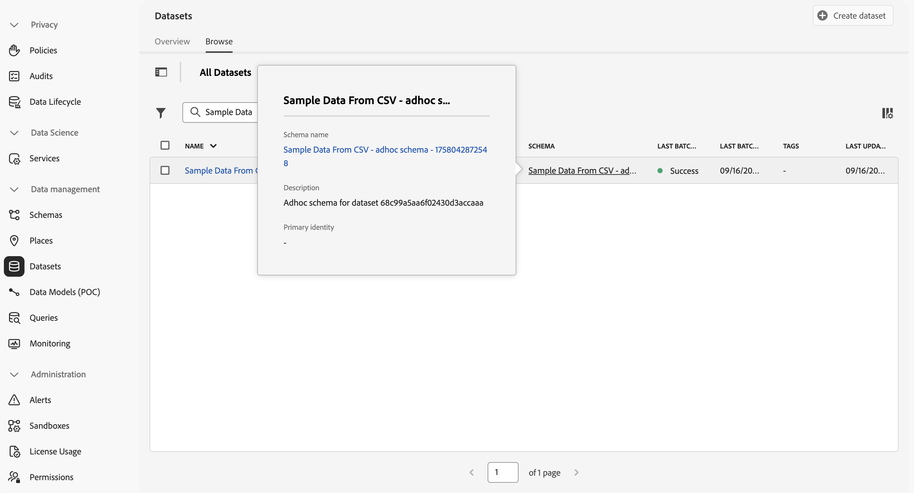

# Importera och använda ad hoc-data

Den här snabbstartsguiden förklarar hur du kan importera ad hoc-data till Experience Platform och sedan använda dessa data i Customer Journey Analytics.

För att uppnå detta måste du:

- **Skapa en datauppsättning med en CSV-fil** i Experience Platform. Det här arbetsflödet definierar modellen (schemat) för de data som du vill samla in och var data (datauppsättningen) ska samlas in.

- **Konfigurera en anslutning** i Customer Journey Analytics. Den här anslutningen bör (åtminstone) innehålla Experience Platform ad hoc-datauppsättning.

- **Konfigurera en datavy** i Customer Journey Analytics för att definiera mått och dimensioner från fälten i dina ad hoc-data som du vill använda i Analysis Workspace.

- **Konfigurera ett projekt** i Customer Journey Analytics för att skapa rapporter och visualiseringar.

>[!NOTE]
>
>Den här snabbstartsguiden är en förenklad guide om hur man importerar ad ad hoc-data med hjälp av i Experience Platform och använder ad hoc-data i Customer Journey Analytics. Vi rekommenderar starkt att man studerar den ytterligare informationen när det hänvisas till.

## Skapa en datauppsättning med en CSV-fil

För den här snabbstarten vill du använda en CSV-fil som representerar sökdata och innehåller information som liknar den som visas nedan.

| _id | tracking_code | ad_group | campaign_name |
| ---: | :---          | :---        | :---          |
| 1 | abc123 | abc-adgroup | 123 Kampanj |
| 2 | def123 | def-adgroup | 123 Kampanj |
| 3 | ghi123 | ghi-adgroup | 123 Kampanj |
| 4 | abc456 | abc-adgroup | 456 Campaign |
| 5 | def456 | def-adgroup | 456 Campaign |

>[!NOTE]
>
>Använd ad hoc-datauppsättningar och scheman för postbaserade data (sökning, profil). Ad hoc-datauppsättningar och -scheman är mindre lämpliga och bör inte beaktas för tidsseriedata (händelsedata, sammanfattningar).

Du behöver inte skapa ett XDM-schema för ad hoc-data. Experience Platform har stöd för ett arbetsflöde som baseras på data i CSV-filen:

1. Skapar ett ad hoc-schema automatiskt. Det schemat följer kolumnerna i CSV-filen.
1. Skapar en datauppsättning som innehåller data från CSV-filen.

Så här startar du arbetsflödet:

1. I Experience Platform-gränssnittet väljer du **[!UICONTROL Workflows]** i den vänstra listen.
1. Välj  **[!UICONTROL Create dataset from CSV file]**.
1. Välj **[!UICONTROL Launch]** i den högra rutan.
1. I guiden **[!UICONTROL Workflows]** > **[!UICONTROL Create dataset from CSV file]**:
   1. I steget **[!UICONTROL Configure dataset]**:
      1. Ange **[!UICONTROL Name]** som datamängd. Till exempel: `Sample Data From CSV`.
      1. Lägg till ett valfritt **[!UICONTROL Description]**. Till exempel: `Sample data from a CSV file`.
      1. Lägg till en eller flera valfria **[!UICONTROL Tags]**, eller markera en eller flera befintliga **[!UICONTROL Tags]**.

         

      1. Välj **[!UICONTROL Next]**.
   1. I steget **[!UICONTROL Add data]**:
      1. Välj **[!UICONTROL Choose Files]** om du vill välja en CSV-fil på datorn eller i nätverket. Du kan också dra och släppa filen från dess plats på datorn eller i nätverket till **[!UICONTROL Drag and drop files]**. Filen överförs och **[!UICONTROL Sample data]** visas.
      1. Aktivera eller inaktivera **[!UICONTROL Error diagnostics]** och **[!UICONTROL Enable partial ingestion]** i enlighet med dina inställningar. När du **[!UICONTROL Enable Partial ingestion]** kan du definiera en **[!UICONTROL Error threshold %]**.

         

      1. Välj **[!UICONTROL Finish]**.

När data har förberetts och överförts omdirigeras du till **[!UICONTROL Datasets]** i Experience Platform-gränssnittet.  Du ser **[!UICONTROL Dataset activity]** för din **[!UICONTROL Sample Data from CSV]**-datauppsättning med statusen  **[!UICONTROL Processing]**.

Så här inspekterar du ad hoc-data:

1. I Experience Platform-gränssnittet väljer du **[!UICONTROL Datasets]** i den vänstra listen.
1. Välj fliken **[!UICONTROL Browse]** i **[!UICONTROL Datasets]**. Du bör se din datamängd.
1. Markera schemats namn i kolumnen **[!UICONTROL Schema]**. Till exempel: **[!UICONTROL Sample Data From CSV…]**

   

1. Välj **[!UICONTROL Schema name]** på popup-menyn. Till exempel: **[!UICONTROL Sample Data From CSV - adhoc schema - XXXXXXXXXXX]**. Du omdirigeras till gränssnittet **[!UICONTROL Schemas]** > **[!UICONTROL Sample Data From CSV - adhoc schema - XXXXXXXXXXX]**.

I gränssnittet **[!UICONTROL Schemas]** > **[!UICONTROL Sample Data From CSV - adhoc schema - XXXXXXXXXXX]**:

- Markera det översta innehavarnamnsobjektet under **[!UICONTROL Schemas]** > **[!UICONTROL Sample Data From CSV - adhoc schema - XXXXXXXXXXX]** för att visa fälten i objektet. Fälten i objektet representerar CSV-filens struktur. Schemat skapas automatiskt baserat på överföringen av ad hoc-data.

  

  >[!NOTE]
  >
  >Arbetsflödet definierar att alla fält i schemat är av typen String. Du kan inte ändra den här typen senare. Om du behöver större flexibilitet i definitionen av ett ad hoc-schema bör du överväga att [använda API:t för att skapa ett ad hoc-schema](https://experienceleague.adobe.com/sv/docs/experience-platform/xdm/tutorials/ad-hoc) och sedan använda arbetsflödet [Skapa datauppsättning från schema](https://experienceleague.adobe.com/sv/docs/experience-platform/catalog/datasets/user-guide#schema).
  > 

## Konfigurera en anslutning

Om du vill använda Experience Platform-datauppsättningen i Customer Journey Analytics skapar du en anslutning som innehåller ad hoc-datauppsättningen från [arbetsflödet](#create-a-dataset-with-a-csv-file)

Med en anslutning kan du integrera datauppsättningar från Experience Platform i Workspace. För att kunna rapportera om dessa datauppsättningar måste du först upprätta en anslutning mellan datauppsättningar i Experience Platform och Workspace.

Så här skapar du en anslutning:

1. I Customer Journey Analytics-gränssnittet väljer du **[!UICONTROL Connections]**, eventuellt från **[!UICONTROL Data management]**, på den översta menyn.

1. Välj **[!UICONTROL Create new connection]**.

1. På skärmen **[!UICONTROL Untitled connection]**:

   1. Namnge och beskriv din anslutning i **[!UICONTROL Connection Settings]**.

   1. Välj rätt sandlåda i listan **[!UICONTROL Sandbox]** i **[!UICONTROL Data settings]** och välj antalet dagliga händelser i listan **[!UICONTROL Average number of daily events]**.

      

   1. Välj **[!UICONTROL Add datasets]**.

1. I steget **[!UICONTROL Select datasets]** i **[!UICONTROL Add datasets]**:

   1. Markera datauppsättningen som du skapade tidigare, till exempel **[!UICONTROL Sample Data From CSV]**, och alla andra datauppsättningar som du vill ta med i anslutningen. Ad hoc-datauppsättningarna har **[!UICONTROL Adhoc]** [!UICONTROL Dataset type].

      

   1. Välj **[!UICONTROL Next]**.

1. I steget **[!UICONTROL Datasets settings]** i **[!UICONTROL Add datasets]**:

   För din ad hoc-datauppsättning:

   1. Välj typ av ad hoc-datauppsättning. Till exempel: **[!UICONTROL Lookup]**.
   1. Välj en **[!UICONTROL Key]** bland de tillgängliga nycklarna som definierats i ad hoc-schemat.
   1. Välj en **[!UICONTROL Matching key]** från en händelsedatamängd som du har lagt till som en del av anslutningen.
   1. Välj rätt datakälla i listan **[!UICONTROL Data source type]**. Om du anger **[!UICONTROL Other]** lägger du till en beskrivning för datakällan.

   1. Ange **[!UICONTROL Import all new data]** och **[!UICONTROL Dataset backfill existing data]** enligt dina inställningar.

      

   1. Välj **[!UICONTROL Add datasets]**.

   1. Välj **[!UICONTROL Save]**.

Mer information om tillgängliga inställningar för ad hoc-datauppsättningar finns i [Ad hoc-datauppsättningsinställningar](/help/connections/create-connection.md#adhoc-dataset).

>[!IMPORTANT]
>
>Utöver den allmänna rekommendationen att inte använda ad hoc-datauppsättningar och scheman för tidsseriedata kan du inte använda arbetsflödet **[!UICONTROL Create dataset from CSV]** för tidsseriedata. I det här arbetsflödet definieras alla fält som av typen String, som du inte kan ändra efteråt. När du lägger till en tidsseriebaserad datauppsättning (händelse eller sammanfattning) till en anslutning, kräver den här typen av datauppsättning definitionen för minst ett fält av typen DateTime. Om du behöver använda ad hoc-tidsseriedata bör du överväga att [använda API:t för att skapa ett ad hoc-schema](https://experienceleague.adobe.com/sv/docs/experience-platform/xdm/tutorials/ad-hoc#token_type=bearer&expires_in=43197438) och sedan använda arbetsflödet [Skapa datauppsättning från schema](https://experienceleague.adobe.com/sv/docs/experience-platform/catalog/datasets/user-guide#schema) .

När du har skapat en [anslutning](/help/connections/overview.md) kan du utföra olika hanteringsåtgärder, till exempel [markera och kombinera datauppsättningar](/help/connections/combined-dataset.md), [kontrollera status för en anslutnings datauppsättningar och status för dataöverföring](/help/connections/manage-connections.md), med mera.

## Konfigurera en datavy

En datavy är en behållare som är specifik för Customer Journey Analytics och som gör att du kan avgöra hur data från en anslutning ska tolkas. Här anges alla mått och mätvärden som är tillgängliga i Analysis Workspace och vilka kolumner som måtten och mätvärdena hämtar data från. Datavyer definieras som förberedelser för rapportering i Analysis Workspace.

Så här skapar du en datavy:

1. I Customer Journey Analytics-gränssnittet väljer du **[!UICONTROL Data views]**, eventuellt från **[!UICONTROL Data management]**, på den översta menyn.

1. Välj **[!UICONTROL Create new data view]**.

1. I steget **[!UICONTROL Configure]**:

   1. Välj din [anslutning](#set-up-a-connection) i listan **[!UICONTROL Connection]**.

   1. Namn och (eventuellt) beskrivning av anslutningen.

      

   1. Välj **[!UICONTROL Save and continue]**.

1. I steget **[!UICONTROL Components]**:

   1. Lägg till alla schemafält och/eller standardkomponenter som du vill inkludera i komponentrutorna **[!UICONTROL METRICS]** eller **[!UICONTROL DIMENSIONS]**. Se till att du lägger till relevanta fält från datauppsättningen som innehåller ad hoc-data. Så här kommer du åt fälten:

      1. Välj **[!UICONTROL Event datasets]**.
      1. Välj **[!UICONTROL Adhoc & Relational fields]**.

         

      1. Dra och släpp fält från ad hoc-scheman till **[!UICONTROL METRICS]** eller **[!UICONTROL DIMENSIONS]**.

   1. Du kan också använda [härledda fält](/help/data-views/derived-fields/derived-fields.md) om du vill ändra något av ad hoc-fälten från standardtypen String och -formatet till en annan typ eller ett annat format.

   1. Välj **[!UICONTROL Save and continue]**.

1. I steget **[!UICONTROL Settings]**:

   Låt inställningarna vara som de är och välj **[!UICONTROL Save and finish]**.

Mer information om hur du skapar och redigerar en datavy finns i [Översikt över datavyer](../data-views/data-views.md). Och vilka komponenter som är tillgängliga för dig att använda i datavyn och hur du använder inställningar för segment och sessioner.

## Konfigurera ett projekt

Analysis Workspace är ett flexibelt webbläsarverktyg som gör det möjligt att snabbt bygga analyser och dela insikter baserat på era data. Du använder Workspace-projekt för att kombinera datakomponenter, tabeller och visualiseringar för att skapa analyser och dela dem med vem som helst i organisationen.

Så här skapar du ditt projekt:

1. I Customer Journey Analytics-gränssnittet väljer du **[!UICONTROL Projects]** på den översta menyn.

1. Välj **[!UICONTROL Projects]** i den vänstra navigeringen.

1. Välj **[!UICONTROL Create project]**.

1. Välj **[!UICONTROL Blank project]**.

1. Välj din [datavy](#set-up-a-data-view) i listan.

1. Om du vill skapa din första rapport börjar du dra och släppa dimensioner och mått på [!UICONTROL Freeform table] i [!UICONTROL Panel]. Inkludera de mätvärden eller mått som baseras på era ad hoc-data.

Mer information om hur du skapar projekt och bygger analyser med komponenter, visualiseringar och paneler finns i [Översikt över Analysis Workspace](../analysis-workspace/home.md) .

>[!SUCCESS]
>
>Du har slutfört alla steg. Du började med att definiera vilka ad hoc-data du vill samla in (CSV-fil). Du använde arbetsflödet för att skapa en ad hoc-datauppsättning och ett schema från den CSV-filen. Du har definierat en anslutning i Customer Journey Analytics för att använda inkapslade ad hoc-data och andra data. Med datavyns definition kan ni ange vilken dimension och vilka mätvärden som ska användas och slutligen skapa ert första projekt som visualiserar och analyserar era data.
