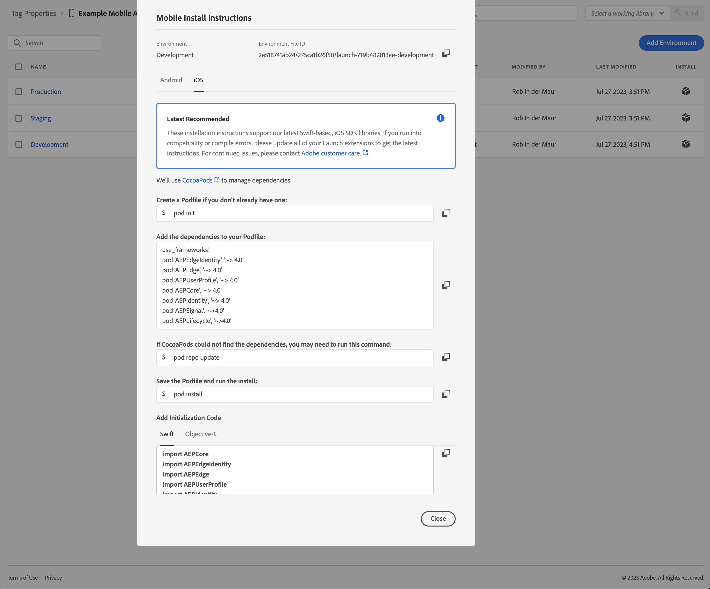
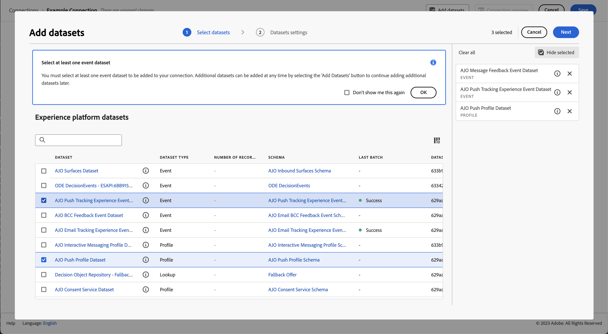

# Importera data via Adobe Experience Platform Mobile SDK

Den här snabbstartsguiden förklarar hur du kan importera spårningsdata för mobilappar direkt till Adobe Experience Platform med Adobe Experience Platform Mobile SDK och Edge Network. Använd sedan dessa data i Customer Journey Analytics.

För att uppnå detta måste du:

- **Konfigurera ett schema och en datauppsättning** i Adobe Experience Platform för att definiera modellen (schemat) för de data som du vill samla in och var data (datauppsättningen) ska samlas in.

- **Konfigurera en datastream** för att konfigurera Adobe Experience Platform Edge Network så att insamlade data dirigeras till datauppsättningen som du konfigurerade i Adobe Experience Platform.

- **Använd taggar** för att enkelt konfigurera regler och dataelement mot data i ditt mobilprogram. Kontrollera sedan att data skickas till den dataström som är konfigurerad på Adobe Experience Platform Edge Network.

- **Distribuera och validera**. Ha en miljö där du kan iterera på taggutvecklingen och när allt har validerats publicerar du det direkt i produktionsmiljön.

- **Konfigurera en anslutning** i Customer Journey Analytics. Den här anslutningen bör (åtminstone) innehålla din Adobe Experience Platform-datauppsättning.

- **Konfigurera en datavy** i Customer Journey Analytics för att definiera mått och dimensioner som du vill använda i Analysis Workspace.

- **Konfigurera ett projekt** i Customer Journey Analytics för att skapa rapporter och visualiseringar.

>[!NOTE]
>
>Den här snabbstartsguiden är en förenklad guide om hur du importerar data som samlats in från programmet till Adobe Experience Platform och använder dem i Customer Journey Analytics. Vi rekommenderar starkt att man studerar den ytterligare informationen när det hänvisas till.

## Konfigurera ett schema och en datauppsättning

Om du vill importera data till Adobe Experience Platform måste du först definiera vilka data du vill samla in. Alla data som hämtas in till Adobe Experience Platform måste överensstämma med en standardiserad, normaliserad struktur för att de ska kunna identifieras och hanteras av funktioner och funktioner längre fram i kedjan. Experience Data Model (XDM) är standardramverket som tillhandahåller en struktur i form av scheman.

När du har definierat ett schema använder du en eller flera datauppsättningar för att lagra och hantera datainsamlingen. En datauppsättning är en lagrings- och hanteringskonstruktion för en datamängd (vanligtvis en tabell) som innehåller ett schema (kolumner) och fält (rader).

Alla data som importeras till Adobe Experience Platform måste överensstämma med ett fördefinierat schema innan de kan sparas som en datauppsättning.

### Konfigurera ett schema

Du vill spåra minimala data från profiler som använder din mobilapp, till exempel scennamn och identifiering.
Först måste du definiera ett schema som modellerar dessa data.

Så här konfigurerar du ditt schema:

1. I Adobe Experience Platform-gränssnittet väljer du **[!UICONTROL Schemas]** inom [!UICONTROL DATA MANAGEMENT].

1. Välj **[!UICONTROL Create schema]**. .
1. I steget Välj en klass i guiden Skapa schema:

   1. Välj **[!UICONTROL Experience Event]**.

      

      >[!INFO]
      >
      >    Ett Experience Event-schema används för att modellera _beteende_ för en profil (som scennamn, tryck på knappen för att lägga till i kundvagnen). Ett enskilt profilschema används för att modellera profilen _attributes_ (som namn, e-post, kön).

   1. Välj **[!UICONTROL Next]**.

1. I [!UICONTROL Name and review step] i [!UICONTROL Create schema] guide:

   1. Ange en **[!UICONTROL Schema display name]** för ditt schema och (valfritt) en **[!UICONTROL Description]**.

      

   1. Välj **[!UICONTROL Finish]**.

1. På fliken Struktur i exempelschemat:

   1. Välj **[!UICONTROL + Add]** in [!UICONTROL Field groups].

      

      Fältgrupper är återanvändbara samlingar av objekt och attribut som gör att du enkelt kan utöka ditt schema.

   1. I [!UICONTROL Add fields groups] väljer du **[!UICONTROL AEP Mobile SDK ExperienceEvent]** fältgrupp från listan.

      

      Du kan välja knappen Förhandsgranska om du vill se en förhandsgranskning av fälten som är en del av den här fältgruppen, som `application > name`.

      

      Välj **[!UICONTROL Back]** för att stänga förhandsgranskningen.

   1. Välj **[!UICONTROL Add field groups]**.

1. Välj **[!UICONTROL +]** bredvid schemanamnet i [!UICONTROL Structure] -panelen.

   

1. I [!UICONTROL Field Properties] panel, ange `identification` som [!UICONTROL Field name], **[!UICONTROL Identification]** som [!UICONTROL Display name], markera **[!UICONTROL Object]** som [!UICONTROL Type] och markera **[!UICONTROL ExperienceEvent Core v2.1]** som [!UICONTROL Field Group].

   

   Identifieringsobjektet lägger till identifieringsfunktioner i ditt schema. I så fall vill du identifiera profiler med din mobilapp med hjälp av Experience Cloud-ID och e-postadress. Det finns många andra attribut som du kan använda för att spåra din persons ID (till exempel kundens ID, lojalitets-ID).

   Välj **[!UICONTROL Apply]** om du vill lägga till det här objektet i ditt schema.

1. Välj **[!UICONTROL ecid]** fält i det identifieringsobjekt som du just lade till, och markera **[!UICONTROL Identity]** och **[!UICONTROL Primary Identity]** och **[!UICONTROL ECID]** från [!UICONTROL Identity namespace] i den högra panelen.

   

   Du anger Experience Cloud Identity som den primära identitet som Adobe Experience Platform Identity-tjänsten kan använda för att kombinera (sy ihop) beteendet hos profiler med samma ECID.

   Välj **[!UICONTROL Apply]**. En fingeravtrycksikon visas i attributet ecid.

1. Välj **[!UICONTROL email]** fält i det identifieringsobjekt som du just lade till, och markera **[!UICONTROL Identity]** och **[!UICONTROL Email]** från [!UICONTROL Identity namespace] listan i [!UICONTROL Field Properties] -panelen.

   

   Du anger e-postadressen som en annan identitet som kan användas av tjänsten Adobe Experience Platform Identity för att kombinera (sammanfoga) beteendet för profiler.

   Välj **[!UICONTROL Apply]**. En fingeravtrycksikon visas i e-postattributet.

   Välj **[!UICONTROL Save]**.

1. Markera rotelementet i schemat som visar schemats namn och välj sedan **[!UICONTROL Profile]** byt.

   Du uppmanas att aktivera schemat för profilen. När data har aktiverats, när data har importerats till datauppsättningar som baseras på detta schema, sammanfogas dessa data i kundprofilen i realtid.

   Se [Aktivera schemat för användning i kundprofilen i realtid](https://experienceleague.adobe.com/docs/experience-platform/xdm/tutorials/create-schema-ui.html?lang=en#profile) för mer information.

   >[!IMPORTANT]
   >
   >    När du har sparat ett schema som är aktiverat för profilen kan det inte längre inaktiveras för profilen.

   

1. Välj **[!UICONTROL Save]** för att spara ditt schema.

Du har skapat ett minimalt schema som modellerar de data du kan hämta från ditt mobilprogram. Schemat gör det möjligt att identifiera profiler med hjälp av Experience Cloud-identitet och e-postadress. Genom att aktivera schemat för profilen ser du till att data som hämtas från mobilappen läggs till i kundprofilen i realtid.

Bredvid beteendedata kan du även hämta profilattributdata från ditt mobilprogram (till exempel information om profiler som prenumererar på ett nyhetsbrev).

Så här hämtar du profildata:

- Skapa ett schema baserat på klassen XDM Individual Profile.

- Lägg till fältgruppen Profilkärna v2 i schemat.

- Lägg till ett identifieringsobjekt baserat på fältgruppen Profile Core v2.

- Definiera Experience Cloud-ID som primär identifierare och e-post som identifierare.

- Aktivera schemat för profilen

Se [Skapa och redigera scheman i användargränssnittet](https://experienceleague.adobe.com/docs/experience-platform/xdm/ui/resources/schemas.html) om du vill ha mer information om hur du lägger till och tar bort fältgrupper och enskilda fält i ett schema.

### Konfigurera en datauppsättning

Med ditt schema har du definierat din datamodell. Nu måste du definiera konstruktionen för att lagra och hantera data med hjälp av datauppsättningar.

Så här konfigurerar du datauppsättningen:

1. I Adobe Experience Platform-gränssnittet väljer du **[!UICONTROL Datasets]** inom [!UICONTROL DATA MANAGEMENT].

2. Välj **[!UICONTROL Create dataset]**.

   

3. Välj **[!UICONTROL Create dataset from schema]**.

   

4. Markera schemat som du skapade tidigare och välj **[!UICONTROL Next]**.

5. Ge datauppsättningen ett namn och (valfritt) ge en beskrivning.

   

6. Välj **[!UICONTROL Finish]**.

7. Välj **[!UICONTROL Profile]** byt.

   Du uppmanas att aktivera datauppsättningen för profilen. När datauppsättningen är aktiverad berikas kundprofiler i realtid med inkapslade data.

   >[!IMPORTANT]
   >
   >    Du kan bara aktivera en datauppsättning för profilen när schemat, som datauppsättningen följer, också är aktiverat för profilen.

   

Se [Användargränssnittshandbok för datauppsättningar](https://experienceleague.adobe.com/docs/experience-platform/catalog/datasets/user-guide.html) om du vill ha mer information om hur du visar, förhandsgranskar, skapar, tar bort en datauppsättning. Och hur man aktiverar en datauppsättning för kundprofil i realtid.

## Konfigurera en datastream

En datastream representerar konfigurationen på serversidan när Adobe Experience Platform Web och Mobile SDK implementeras. När du samlar in data med Adobe Experience Platform SDK:er skickas data till Adobe Experience Platform Edge Network. Det är datastream som avgör vilka tjänster som data vidarebefordras till.

I din konfiguration vill du att de data du samlar in från mobilappen ska skickas till din datauppsättning i Adobe Experience Platform.

Så här konfigurerar du datastream:

1. I användargränssnittet för Adobe Experience Platform väljer du **[!UICONTROL Datastreams]** från [!UICONTROL DATA COLLECTION] till vänster.

2. Välj **[!UICONTROL New Datastream]**.

3. Namnge och beskriv ditt datastream. Välj ditt schema från [!UICONTROL Event Schema] lista.

   

4. Välj **[!UICONTROL Save]**.

5. Välj **[!UICONTROL Add Service]**.

6. I [!UICONTROL Add Service screen]:

   1. Välj **[!UICONTROL Adobe Experience Platform]** från [!UICONTROL Service] lista.

   2. Säkerställ **[!UICONTROL Enabled]** är markerat.

   3. Välj din datauppsättning på [!UICONTROL Event Dataset] lista.

      

   4. Lämna de andra inställningarna och välj **[!UICONTROL Save]** för att spara datastream.

Din datastream är nu konfigurerad för att vidarebefordra data som samlats in från din mobilapp till datauppsättningen i Adobe Experience Platform.

Se [Översikt över datastreams](https://experienceleague.adobe.com/docs/experience-platform/edge/datastreams/overview.html?lang=en) om du vill ha mer information om hur du konfigurerar ett datastam och hur du hanterar känsliga data.

## Använd taggar

Om du vill implementera kod på din webbplats för att samla in data använder du taggfunktionen i Adobe Experience Platform. Med tagghanteringslösningen kan ni driftsätta kod tillsammans med andra taggningskrav. Taggar erbjuder sömlös integrering med Adobe Experience Platform via tillägget Adobe Experience Platform Mobile SDK.

### Skapa en tagg

1. I Adobe Experience Platform-gränssnittet väljer du **[!UICONTROL Tags]** inom [!UICONTROL DATA COLLECTION].

2. Välj **[!UICONTROL New Property]**.

   Namnge taggen och markera **[!UICONTROL Mobile]**. Välj **[!UICONTROL Save]** för att fortsätta.

   

### Konfigurera taggen

När du har skapat taggen måste du konfigurera den med rätt tillägg och konfigurera dataelement och regler efter hur du vill spåra webbplatsen och skicka data till Adobe Experience Platform.

Om du vill konfigurera väljer du den nyligen skapade taggen i listan över [!UICONTROL Tag Properties].

#### **Tillägg**

Lägg till tillägget Adobe Platform Edge Network i taggen så att du kan skicka data till Adobe Experience Platform (via din datastream).

Så här skapar och konfigurerar du Adobe Experience Platform Mobile SDK-tillägget:

1. Välj **[!UICONTROL Extensions]** till vänster. Du ser att tilläggen Mobile Core och Profile redan är tillgängliga.

1. Välj **[!UICONTROL Catalog]** i det övre fältet.

1. Sök efter eller bläddra till **[!UICONTROL Adobe Experience Platform Edge Network]** och välj **[!UICONTROL Install]** i den högra rutan för att installera den.

1. Välj din sandlåda och din tidigare skapade datastream för din [!UICONTROL Production Environment] och (valfritt) [!UICONTROL Staging Environment] och [!UICONTROL Development Environment].

   

1. Ange **[!UICONTROL Edge Network domain]** under [!UICONTROL Domain configuration]. Används vanligtvis `<organizationName>.data.adobedc.net`.

1. Välj **[!UICONTROL Save]**.

Se [Konfigurera Adobe Experience Platform Edge Network-tillägget](https://developer.adobe.com/client-sdks/documentation/edge-network) för mer information.

Du vill också konfigurera följande tillägg från katalogen:

- Identitet.
- AEP Assurance.
- Godkännande.

Se [Konfigurera en taggegenskap](https://experienceleague.adobe.com/docs/platform-learn/implement-mobile-sdk/initial-configuration/configure-tags.html?lang=en) i självstudiekursen för mobilappar för Experience-plattformen för mer information om tillägg och deras konfiguration.

#### **Dataelement**

Dataelement är byggstenarna för dataordlistan (eller datamappningen). Använd dataelement för att samla in, ordna och leverera data över marknadsförings- och annonseringsteknologier. Du ställer in dataelement i taggen som läser från mobilappsdata eller händelser och kan användas för att leverera data till Adobe Experience Platform.

Du vill till exempel samla in transportföretagsnamnet från mobilappen.

Så här definierar du ett dataelement för transportföretagsnamn:

1. Välj **[!UICONTROL Data Elements]** till vänster.

2. Välj **[!UICONTROL Add Data Element]**.

3. I [!UICONTROL Create Data Element] dialog:

   - Ge dataelementet ett namn, till exempel `Carrier Name`.

   - Välj **[!UICONTROL Mobile Core]** från [!UICONTROL Extension] lista.

   - Välj **[!UICONTROL Carrier Name]** från [!UICONTROL Data Element Type] lista.

     

   - Välj **[!UICONTROL Save]**.

Du kan skapa så många dataelement du vill och använda dem i regler.

#### **Regler**

Taggar i Adobe Experience Platform följer ett regelbaserat system. De letar efter användarinteraktion och tillhörande data. När villkoren som beskrivs i reglerna är uppfyllda utlöser regeln det tillägg, skript eller den klientkod som du identifierade. Du kan använda regler för att skicka data (som ett XDM-objekt) till Adobe Experience Platform med tillägget Adobe Experience Platform Edge Network.

Du vill till exempel skicka händelsedata när mobilappen används (i förgrunden) och när mobilappen inte används (överförs tillbaka till bakgrunden).

Så här definierar du en regel:

1. Välj **[!UICONTROL Rules]** till vänster.

2. Välj **[!UICONTROL Create New Rule]**.

3. I [!UICONTROL Create Rule] dialog:

   - Namnge regeln, till exempel `Application Status`.

   - Välj **[!UICONTROL + Add]** under [!UICONTROL Events].

   - I [!UICONTROL Event Configuration] dialog:

      - Välj **[!UICONTROL Mobile Core]** från [!UICONTROL Extension] lista.

      - Välj **[!UICONTROL Foreground]** från [!UICONTROL Event Type] lista.

      - Välj **[!UICONTROL Keep Changes]**.

   - Klicka  nästa [!UICONTROL Mobile Core - Foreground].

      - Välj **[!UICONTROL Mobile Core]** från [!UICONTROL Extension] lista.

      - Välj **[!UICONTROL Background]** från [!UICONTROL Event Type] lista.

      - Välj **[!UICONTROL Keep Changes]**.

   - Klicka  Lägg till under [!UICONTROL ACTIONS]. I [!UICONTROL Action Configuration] dialog:

      - Välj **[!UICONTROL Adobe Experience Platform Edge Network]** från [!UICONTROL Extension] lista.

      - Välj **[!UICONTROL Forward event to Edge Network]** från [!UICONTROL Action Type] lista.

      - Välj **[!UICONTROL Keep Changes]**.

   - Regeln ska se ut så här:

     

   - Välj **[!UICONTROL Save]**.

Ovanstående är bara ett exempel på en regel som skickar XDM-data med programstatus till Adobe Edge-nätverket och till Adobe Experience Platform.

Du kan använda regler på olika sätt i taggen för att hantera variabler (med dataelementen).

Se [Regler](https://developer.adobe.com/client-sdks/documentation/lifecycle-for-edge-network/#configure-a-rule-to-forward-lifecycle-metrics-to-platform) för mer information.

### Skapa och publicera taggen

När du har definierat dataelement och regler måste du skapa och publicera taggen. När du skapar en biblioteksversion måste du tilldela den till en miljö. Byggnadens tillägg, regler och dataelement kompileras sedan och placeras i den tilldelade miljön. Varje miljö har en unik inbäddningskod som gör att du kan integrera den tilldelade inbäddningen på din plats.

Så här skapar och publicerar du en tagg:

1. Välj **[!UICONTROL Publishing Flow]** från den vänstra listen.

2. Välj **[!UICONTROL Select a working library]**, följt av **[!UICONTROL Add Library…]**.

3. I [!UICONTROL Create Library] dialog:

   - Namnge biblioteket.

   - Välj **[!UICONTROL Development (development)]** från [!UICONTROL Environment] lista.

   - Välj **[!UICONTROL + Add All Changed Resources]**.

     

   - Välj **[!UICONTROL Save & Build to Development]**.

   Taggen sparas och byggs för din utvecklingsmiljö. En grön punkt visar att taggen har skapats på utvecklingsmiljön.

4. Du kan välja **[!UICONTROL ...]** för att återskapa biblioteket eller flytta biblioteket till en staging- eller produktionsmiljö.

Adobe Experience Platform Tags har stöd för enkla till komplexa publiceringsarbetsflöden som passar din driftsättning av Adobe Experience Platform Edge Network.

Se [Översikt över publicering](https://developer.adobe.com/client-sdks/documentation/getting-started/create-a-mobile-property/#publish-the-configuration) för mer information.

### Hämta din taggkod

Slutligen måste du använda taggen i den mobilapp du vill spåra.

Så här får du kodanvisningar som förklarar hur du konfigurerar din mobilapp och använder taggen i appen:

1. Välj **[!UICONTROL Environments]** till vänster.

2. Välj rätt installation i listan över miljöer  -knappen.

   I [!UICONTROL Mobile Install Instructions] väljer du lämplig plattform ([!UICONTROL iOS], [!UICONTROL Android]). Använd sedan kopian  -knapp bredvid varje relevant kodfragment som du vill använda för att konfigurera och initiera din mobilapp:

   

3. Välj **[!UICONTROL Close]**.

I stället för koden för utvecklingsmiljön kan du ha valt en annan miljö (testmiljö, produktion) baserat på var du håller på att distribuera Adobe Experience Platform Mobile SDK.

Se [Miljö](https://experienceleague.adobe.com/docs/experience-platform/tags/publish/environments/environments.html?) för mer information.

## Distribuera och validera

Nu kan du distribuera koden i din mobilapp. När appen distribueras börjar den samla in data till Adobe Experience Platform.

Validera implementeringen, korrigera den där det behövs och installera den sedan korrekt i din staging- och produktionsmiljö med publiceringsarbetsflödesfunktionen i Tags.

Se [Implementera Adobe Experience Cloud i mobilappar, genomgång](https://experienceleague.adobe.com/docs/platform-learn/implement-mobile-sdk/overview.html) för mycket mer detaljerad information.

## Konfigurera en anslutning

Om du vill använda Adobe Experience Platform-data i Customer Journey Analytics skapar du en anslutning som innehåller de data som är resultatet av konfigurationen av ditt schema, din datauppsättning och ditt arbetsflöde.

Med en anslutning kan du integrera datauppsättningar från Adobe Experience Platform i Workspace. För att kunna rapportera om dessa datauppsättningar måste du först skapa en anslutning mellan datauppsättningar i Adobe Experience Platform och Workspace.

Så här skapar du en anslutning:

1. I användargränssnittet för Customer Journey Analytics väljer du **[!UICONTROL Connections]** i den övre navigeringen.

2. Välj **[!UICONTROL Create new connection]**.

3. I [!UICONTROL Untitled connection] skärm:

   Namnge och beskriva anslutningen i [!UICONTROL Connection Settings].

   Välj rätt sandlåda i dialogrutan [!UICONTROL Sandbox] lista i [!UICONTROL Data settings] och välj antalet dagliga händelser i dialogrutan [!UICONTROL Average number of daily events] lista.

   

   Välj **[!UICONTROL Add datasets]**.

   I [!UICONTROL Select datasets] stega in [!UICONTROL Add datasets]:

   - Välj datauppsättningar som du har skapat tidigare och/eller andra relevanta datauppsättningar som du vill inkludera i din anslutning (till exempel data för Push Tracking Experience Events och Push Profile från Adobe Journey Optimizer)

     

   - Välj **[!UICONTROL Next]**.

   I [!UICONTROL Datasets settings] stega in [!UICONTROL Add datasets]:

   - För varje datauppsättning:

      - Välj en [!UICONTROL Person ID] från de tillgängliga identiteter som definieras i datauppsättningsscheman i Adobe Experience Platform.

      - Välj rätt datakälla på menyn [!UICONTROL Data source type] lista. Om du anger **[!UICONTROL Other]** lägger du sedan till en beskrivning av datakällan.

      - Ange **[!UICONTROL Import all new data]** och **[!UICONTROL Dataset backfill existing data]** enligt dina önskemål.

     

   - Välj **[!UICONTROL Add datasets]**.

   Välj **[!UICONTROL Save]**.

Se [Anslutningar - översikt](../connections/overview.md) för mer information om hur du skapar och hanterar en anslutning och hur du väljer och kombinerar datauppsättningar.

## Konfigurera en datavy

En datavy är en behållare som är specifik för Customer Journey Analytics och som gör att du kan avgöra hur data från en anslutning ska tolkas. Här anges alla mått och mätvärden som är tillgängliga i Analysis Workspace och vilka kolumner som måtten och mätvärdena hämtar data från. Datavyer definieras som förberedelser för rapportering i Analysis Workspace.

Så här skapar du en datavy:

1. I användargränssnittet för Customer Journey Analytics väljer du **[!UICONTROL Data views]** i den övre navigeringen.

2. Välj **[!UICONTROL Create new data view]**.

3. I [!UICONTROL Configure] steg:

   Välj din anslutning på menyn [!UICONTROL Connection] lista.

   Namn och (eventuellt) beskrivning av anslutningen.

   

   Välj **[!UICONTROL Save and continue]**.

4. I [!UICONTROL Components] steg:

   Lägg till alla schemafält och/eller standardkomponenter som du vill inkludera i [!UICONTROL METRICS] eller [!UICONTROL DIMENSIONS] komponentrutor.

   

   Välj **[!UICONTROL Save and continue]**.

5. I [!UICONTROL Settings] steg:

   

   Låt inställningarna vara som de är och välj **[!UICONTROL Save and finish]**.

Se [Översikt över datavyer](../data-views/data-views.md) för mer information om hur du skapar och redigerar en datavy, vilka komponenter som är tillgängliga för dig och hur du använder filter- och sessionsinställningar.

## Konfigurera ett projekt

Analysis Workspace är ett flexibelt webbläsarverktyg som gör att du snabbt kan skapa analyser och dela insikter baserat på dina data. Du använder Workspace-projekt för att kombinera datakomponenter, tabeller och visualiseringar för att skapa analyser och dela dem med vem som helst i organisationen.

Så här skapar du ditt projekt:

1. I användargränssnittet för Customer Journey Analytics väljer du **[!UICONTROL Projects]** i den övre navigeringen.

2. Välj **[!UICONTROL Projects]** i den vänstra navigeringen.

3. Välj **[!UICONTROL Create project]**.

   

   Välj **[!UICONTROL Blank project]**.

   

4. Välj datavyn i listan.

   .

5. Om du vill skapa din första rapport börjar du dra och släppa dimensioner och mätvärden på [!UICONTROL Freeform table] i [!UICONTROL Panel] . Dra som ett exempel `Events` som mått och `Push Title` som dimension, uppdelad efter `Event Type` för att få en översikt över dina push-meddelanden för din mobilapp och vad som hände med dem.

   

Se [Analysis Workspace - översikt](../analysis-workspace/home.md) om du vill ha mer information om hur du skapar projekt och bygger din analys med hjälp av komponenter, visualiseringar och paneler.

>[!SUCCESS]
>
>Du har slutfört alla steg. Börja med att definiera vilka data du vill samla in (schema) och var de ska lagras (datauppsättning) i Adobe Experience Platform. Du konfigurerade en datastam i Edge Network för att säkerställa att data kan vidarebefordras till den datauppsättningen. Sedan definierade och distribuerade du taggen som innehåller tilläggen (Adobe Experience Platform Edge Network med flera), dataelementen och reglerna för att hämta data från mobilappen och skicka dessa data till din datastam. Du har definierat en anslutning i Customer Journey Analytics för att använda push-meddelandespårningsdata för mobilappar och andra data. Med datavyns definition kan ni ange vilken dimension och vilka mätvärden som ska användas och slutligen skapa ert första projekt som visualiserar och analyserar era mobilappsdata.
