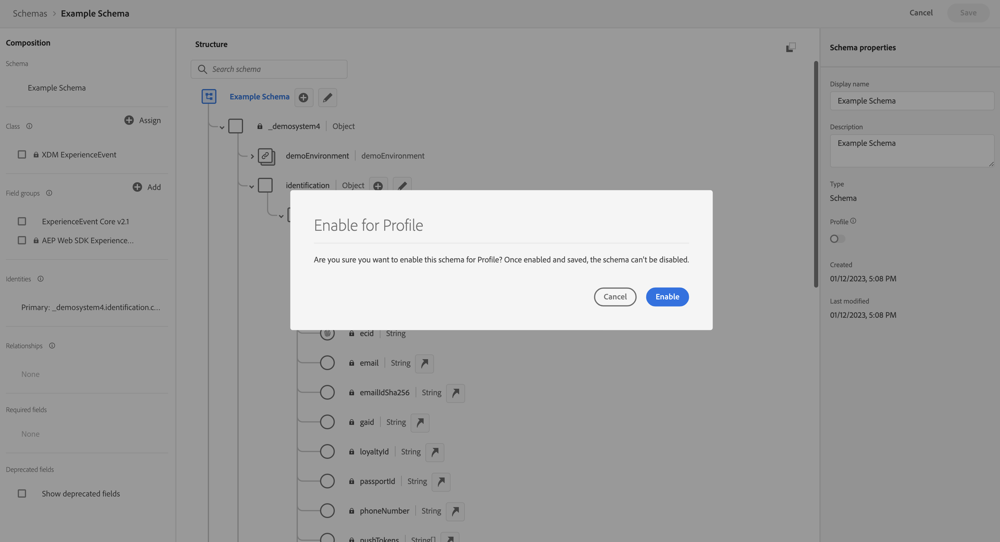

# Importera data via SDK på webben

Den här snabbstartsguiden förklarar hur du kan importera spårningsdata för webbplatser direkt till Adobe Experience Platform med Adobe Experience Platform Web SDK och Edge Network och sedan använda dessa data i Customer Journey Analytics.

För att uppnå detta måste du:

- **Konfigurera ett schema och en datauppsättning** i Adobe Experience Platform för att definiera modellen (schemat) för de data som du vill samla in och var data (datauppsättningen) ska samlas in.

- **Konfigurera en datastream** för att konfigurera Adobe Experience Platform Edge Network att dirigera dina insamlade data till datauppsättningen som du konfigurerade i Adobe Experience Platform.

- **Använd taggar** för att enkelt konfigurera regler och dataelement mot data i datalagret på webbplatsen. Kontrollera sedan att data skickas till den dataström som är konfigurerad på Adobe Experience Platform Edge Network.

- **Distribuera och validera**. Ha en miljö där du kan iterera på taggutvecklingen och när allt har validerats publicerar du det direkt i produktionsmiljön.

- **Konfigurera en anslutning** i Customer Journey Analytics. Den här anslutningen bör (åtminstone) innehålla din Adobe Experience Platform-datauppsättning.

- **Konfigurera en datavy** i Customer Journey Analytics för att definiera mått och dimensioner som du vill använda i Analysis Workspace.

- **Konfigurera ett projekt** i Customer Journey Analytics för att skapa rapporter och visualiseringar.

>[!NOTE]
>
> Den här snabbstartsguiden är en förenklad guide om hur man importerar data som samlats in från er webbplats till Adobe Experience Platform och använder dem i Customer Journey Analytics. Vi rekommenderar starkt att man studerar den ytterligare informationen när det hänvisas till.


## Konfigurera ett schema och en datauppsättning

Om du vill importera data till Adobe Experience Platform måste du först definiera vilka data du vill samla in. Alla data som hämtas in till Adobe Experience Platform måste överensstämma med en standardiserad, normaliserad struktur för att de ska kunna identifieras och hanteras av funktioner och funktioner längre fram i kedjan. Experience Data Model (XDM) är standardramverket som tillhandahåller den här strukturen i form av scheman.

När du har definierat ett schema använder du en eller flera datauppsättningar för att lagra och hantera datainsamlingen. En datauppsättning är en lagrings- och hanteringskonstruktion för en datamängd (vanligtvis en tabell) som innehåller ett schema (kolumner) och fält (rader).

Alla data som importeras till Adobe Experience Platform måste överensstämma med ett fördefinierat schema innan de kan sparas som en datauppsättning.

### Konfigurera ett schema

Du vill spåra minimala data från profiler som besöker webbplatsen, till exempel sidnamn och identifiering.
Du måste först definiera ett schema som modellerar dessa data.

Så här konfigurerar du ditt schema:

1. I Adobe Experience Platform-gränssnittet väljer du **[!UICONTROL Schemas]** i [!UICONTROL DATA MANAGEMENT] till vänster.

1. Välj **[!UICONTROL Create schema]**.
.
1. I steget Välj en klass i guiden Skapa schema:

   1. Välj **[!UICONTROL Experience Event]**.

      

      >[!INFO]
      >
      >    Ett Experience Event-schema används för att modellera _beteendet_ för en profil (som scennamn, push-knapp som läggs till i kundvagnen). Ett enskilt profilschema används för att modellera profilen _attribut_ (som namn, e-post, kön).

   1. Välj **[!UICONTROL Next]**.


1. I [!UICONTROL Name and review step] i guiden [!UICONTROL Create schema]:

   1. Ange en **[!UICONTROL Schema display name]** för ditt schema och (valfritt) en **[!UICONTROL Description]**.

      

   1. Välj **[!UICONTROL Finish]**.

1. På fliken Struktur i exempelschemat:

   1. Välj **[!UICONTROL + Add]** i [!UICONTROL Field groups].

      

      Fältgrupper är återanvändbara samlingar av objekt och attribut som gör att du enkelt kan utöka ditt schema.

   1. I dialogrutan [!UICONTROL Add fields groups] väljer du fältgruppen **[!UICONTROL AEP Web SDK ExperienceEvent]** i listan.

      

      Du kan välja knappen för förhandsgranskning om du vill se en förhandsgranskning av fälten som ingår i den här fältgruppen, till exempel `web > webPageDetails > name`.

      

      Välj **[!UICONTROL Back]** om du vill stänga förhandsgranskningen.

   1. Välj **[!UICONTROL Add field groups]**.

1. Välj **[!UICONTROL +]** bredvid schemanamnet på panelen [!UICONTROL Structure].

   

1. På panelen [!UICONTROL Field Properties] anger du `Identification` som namn, **[!UICONTROL Identification]** som [!UICONTROL Display name], väljer **[!UICONTROL Object]** som [!UICONTROL Type] och väljer **[!UICONTROL ExperienceEvent Core v2.1]** som [!UICONTROL Field Group].

   >[!NOTE]
   >
   >Om fältgruppen inte är tillgänglig söker du efter en annan fältgrupp som innehåller identitetsfält. Eller [skapa en ny fältgrupp](https://experienceleague.adobe.com/docs/experience-platform/xdm/ui/resources/field-groups.html) och [lägg till nya identitetsfält](https://experienceleague.adobe.com/docs/experience-platform/xdm/ui/fields/identity.html#define-a-identity-field) (som `ecid`, `crmId` och andra som du behöver) i fältgruppen och markera den nya fältgruppen.

   

   Identifieringsobjektet lägger till identifieringsfunktioner i ditt schema. I så fall vill du identifiera profiler som besöker din webbplats med hjälp av Experience Cloud ID och e-postadress. Det finns många andra attribut som du kan använda för att spåra din persons ID (till exempel kundens ID, lojalitets-ID).

   Välj **[!UICONTROL Apply]** om du vill lägga till det här objektet i ditt schema.

1. Markera fältet **[!UICONTROL ecid]** i det identifieringsobjekt som du nyss lade till och välj **[!UICONTROL Identity]**, **[!UICONTROL Primary Identity]** och **[!UICONTROL ECID]** i listan [!UICONTROL Identity namespace] i den högra panelen.

   

   Du anger Experience Cloud Identity som den primära identitet som Adobe Experience Platform Identity-tjänsten kan använda för att kombinera (sammanfoga) beteendet hos profiler med samma ECID.

   Välj **[!UICONTROL Apply]**. En fingeravtrycksikon visas i attributet ecid.

1. Markera fältet **[!UICONTROL email]** i det identifieringsobjekt som du nyss lade till och välj **[!UICONTROL Identity]** och **[!UICONTROL Email]** i listan [!UICONTROL Identity namespace] på panelen [!UICONTROL Field Properties].

   

   Du anger e-postadressen som en annan identitet som kan användas av tjänsten Adobe Experience Platform Identity för att kombinera (sammanfoga) beteendet för profiler.

   Välj **[!UICONTROL Apply]**. En fingeravtrycksikon visas i e-postattributet.

   Välj **[!UICONTROL Save]**.

1. Markera rotelementet i schemat som visar schemats namn och välj sedan växeln **[!UICONTROL Profile]**.

   Du uppmanas att aktivera schemat för profilen. När data har aktiverats, när data har importerats till datauppsättningar som baseras på detta schema, sammanfogas dessa data i kundprofilen i realtid.

   Mer information finns i [Aktivera schemat för användning i kundprofilen i realtid](https://experienceleague.adobe.com/docs/experience-platform/xdm/tutorials/create-schema-ui.html#profile).

   >[!IMPORTANT]
   >
   >    När du har sparat ett schema som är aktiverat för profilen kan det inte längre inaktiveras för profilen.

   

1. Välj **[!UICONTROL Save]** om du vill spara ditt schema.

Du har skapat ett minimalt schema som modellerar de data som du kan hämta från webbplatsen. Schemat gör det möjligt att identifiera profiler med hjälp av Experience Cloud Identity och e-postadress. Genom att aktivera schemat för profil ser du till att data som hämtas från din webbplats läggs till i kundprofilen i realtid.

Bredvid beteendedata kan du även hämta profilattributdata från din webbplats (till exempel information om profiler som prenumererar på ett nyhetsbrev).

Så här hämtar du profildata:

- Skapa ett schema baserat på klassen XDM Individual Profile.

- Lägg till fältgruppen Profilkärna v2 i schemat.

- Lägg till ett identifieringsobjekt baserat på fältgruppen Profile Core v2.

- Definiera Experience Cloud ID som primär identifierare och e-postadress som identifierare.

- Aktivera schemat för profilen

Mer information om hur du lägger till och tar bort fältgrupper och enskilda fält i ett schema finns i [Skapa och redigera scheman i användargränssnittet](https://experienceleague.adobe.com/docs/experience-platform/xdm/ui/resources/schemas.html).

### Konfigurera en datauppsättning

Med ditt schema har du definierat din datamodell. Nu måste du definiera konstruktionen för att lagra och hantera data, vilket sker via datauppsättningar.

Så här konfigurerar du datauppsättningen:

1. I Adobe Experience Platform-gränssnittet väljer du **[!UICONTROL Datasets]** i [!UICONTROL DATA MANAGEMENT] till vänster.

2. Välj **[!UICONTROL Create dataset]**.

   

3. Välj **[!UICONTROL Create dataset from schema]**.

   

4. Markera schemat som du skapade tidigare och välj **[!UICONTROL Next]**.

5. Ge datauppsättningen ett namn och (valfritt) ge en beskrivning.

   

6. Välj **[!UICONTROL Finish]**.

7. Välj växeln **[!UICONTROL Profile]**.

   Du uppmanas att aktivera datauppsättningen för profilen. När datauppsättningen är aktiverad berikas kundprofiler i realtid med inkapslade data.

   >[!IMPORTANT]
   >
   >    Du kan bara aktivera en datauppsättning för profilen när schemat, som datauppsättningen följer, också är aktiverat för profilen.

   

Mer information om hur du visar, förhandsgranskar, skapar och tar bort en datauppsättning finns i [Användargränssnittshandbok för datauppsättningar](https://experienceleague.adobe.com/docs/experience-platform/catalog/datasets/user-guide.html). Och hur man aktiverar en datauppsättning för kundprofil i realtid.

## Konfigurera en datastream

En datastream representerar konfigurationen på serversidan när Adobe Experience Platform Web och Mobile SDK implementeras. När du samlar in data med Adobe Experience Platform SDK:er skickas data till Adobe Experience Platform Edge Network. Det är datastream som avgör vilka tjänster som data vidarebefordras till.

I din konfiguration vill du att de data du samlar in från webbplatsen ska skickas till din datauppsättning i Adobe Experience Platform.

Så här konfigurerar du datastream:

1. I Adobe Experience Platform-gränssnittet väljer du **[!UICONTROL Datastreams]** från [!UICONTROL DATA COLLECTION] i den vänstra listen.

2. Välj **[!UICONTROL New Datastream]**.

3. Namnge och beskriv ditt datastream. Välj ditt schema i listan [!UICONTROL Event Schema].

   

4. Välj **[!UICONTROL Save]**.

5. Välj **[!UICONTROL Add Service]**.

6. I [!UICONTROL Add Service screen]:

   1. Välj **[!UICONTROL Adobe Experience Platform]** i listan [!UICONTROL Service].

   2. Kontrollera att **[!UICONTROL Enabled]** är markerat.

   3. Välj datauppsättningen i listan [!UICONTROL Event Dataset].

      

   4. Lämna de andra inställningarna och välj **[!UICONTROL Save]** för att spara dataströmmen.

Din datastream är nu konfigurerad för att vidarebefordra data som samlats in från din webbplats till din datauppsättning i Adobe Experience Platform.

Mer information om hur du konfigurerar ett datastam och hur du hanterar känsliga data finns i [Översikt över datastreams](https://experienceleague.adobe.com/docs/experience-platform/datastreams/overview.html).


## Använd taggar

Om du vill implementera kod på din webbplats för att samla in data använder du taggfunktionen i Adobe Experience Platform . Med tagghanteringslösningen kan ni driftsätta kod tillsammans med andra taggningskrav. Taggar är smidiga att integrera med Adobe Experience Platform via Adobe Experience Platform Web SDK.

### Skapa en tagg

1. I Adobe Experience Platform-gränssnittet väljer du **[!UICONTROL Tags]** i [!UICONTROL DATA COLLECTION] till vänster.

2. Välj **[!UICONTROL New Property]**.

   Namnge taggen, markera **[!UICONTROL Web]** och ange ett domännamn. Välj **[!UICONTROL Save]** om du vill fortsätta.

   

### Konfigurera taggen

När du har skapat taggen måste du konfigurera den med rätt tillägg och konfigurera dataelement och regler efter hur du vill spåra webbplatsen och skicka data till Adobe Experience Platform.

Markera den nyligen skapade taggen i listan med [!UICONTROL Tag Properties] för att öppna den.


#### **Tillägg**

För att vara säker på att du kan skicka data till Adobe Experience Platform (via din datastream) lägger du till Adobe Platform Web SDK-tillägget i taggen.

Så här skapar och konfigurerar du Adobe Experience Platform Web SDK-tillägget:

1. Välj **[!UICONTROL Extensions]** i den vänstra listen.

2. Välj **[!UICONTROL Catalog]** i det övre fältet.

3. Sök efter eller bläddra till Adobe Experience Platform Web SDK-tillägget och välj **[!UICONTROL Install]** för att installera det.

   

4. Välj din sandlåda och din tidigare skapade datastam för [!UICONTROL Production Environment] och (valfritt) [!UICONTROL Staging Environment] och [!UICONTROL Development Environment].

   

   Välj **[!UICONTROL Save]**.

Mer information finns i [Konfigurera Adobe Experience Platform Web SDK-tillägget](https://experienceleague.adobe.com/docs/experience-platform/tags/extensions/client/web-sdk/web-sdk-extension-configuration.html).

SDK-webben innehåller [!UICONTROL Adobe Experience Cloud ID Service] internt, så du behöver inte lägga till ID-tjänsttillägget till din tagg.

#### **Dataelement**

Dataelement är byggstenarna för dataordlistan (eller datamappningen). Använd dataelement för att samla in, ordna och leverera data över marknadsförings- och annonseringsteknologier. Du ställer in dataelement i taggen som läser från datalagret och kan användas för att leverera data till Adobe Experience Platform.

Det finns olika typer av dataelement. Du ställer först in ett dataelement för att fånga det sidnamn som personer tittar på på din webbplats.

Så här definierar du ett dataelement för sidnamn:

1. Välj **[!UICONTROL Data Elements]** i den vänstra listen.

2. Välj **[!UICONTROL Add Data Element]**.

3. I dialogrutan [!UICONTROL Create Data Element]:

   - Ge dataelementet ett namn, till exempel `Page Name`.

   - Välj **[!UICONTROL Core]** i listan [!UICONTROL Extension].

   - Välj **[!UICONTROL Page Info]** i listan [!UICONTROL Data Element Type].

   - Välj **[!UICONTROL Title]** i listan [!UICONTROL Attribute].

     

     Du kan också ha använt värdet från en variabel i datalagret, till exempel `pageName` och dataelementtypen [!UICONTROL JavaScript Variable] för att definiera dataelementet.

     

   - Välj **[!UICONTROL Save]**.

Nu vill du skapa ett dataelement som refererar till det Experience Cloud-id som automatiskt tillhandahålls av Adobe Experience Platform Web SDK och som är tillgängligt via Experience Cloud ID-tjänsttillägget.

Så här definierar du ett ECID-dataelement:

1. Välj **[!UICONTROL Data Elements]** i den vänstra listen.

2. Välj **[!UICONTROL Add Data Element]**.

3. I dialogrutan [!UICONTROL Create Data Element]:

   - Ge dataelementet ett namn, till exempel `ECID`.

   - Välj **[!UICONTROL Experience Cloud ID Service]** i listan [!UICONTROL Extension].

   - Välj **[!UICONTROL ECID]** i listan [!UICONTROL Data Element Type].

     

   - Välj **[!UICONTROL Save]**.

Slutligen vill du nu mappa något av dina specifika dataelement till det schema du definierade tidigare. Du definierar ett annat dataelement som tillhandahåller en representation av XDM-schemat.

Så här definierar du ett XDM-objektdataelement:

1. Välj **[!UICONTROL Data Elements]** i den vänstra listen.

2. Välj **[!UICONTROL Add Data Element]**.

3. I dialogrutan [!UICONTROL Create Data Element]:

   - Ge dataelementet ett namn, till exempel `XDM - Page View`.

   - Välj **[!UICONTROL Adobe Experience Platform Web SDK]** i listan [!UICONTROL Extension].

   - Välj **[!UICONTROL XDM Object]** i listan [!UICONTROL Data Element Type].

   - Välj din sandlåda i listan [!UICONTROL Sandbox].

   - Välj ditt schema i listan [!UICONTROL Schema].

   - Mappa attributet `identification > core > ecid`, som definierats i ditt schema, till ECID-dataelementet. Välj cylinderikonen för att enkelt välja ECID-dataelementet från listan med dataelement.

     

     


   - Mappa attributet `web > webPageDetails > name`, som definierats i ditt schema, till dataelementet för sidnamn.

     

   - Välj **[!UICONTROL Save]**.


#### **Regler**

Taggar i Adobe Experience Platform följer ett regelbaserat system. De letar efter användarinteraktion och tillhörande data. När villkoren som beskrivs i reglerna är uppfyllda utlöser regeln det tillägg, skript eller den klientkod som du identifierade. Du kan använda regler för att skicka data (som ett XDM-objekt) till Adobe Experience Platform med tillägget Adobe Experience Platform Web SDK.

Så här definierar du en regel:

1. Välj **[!UICONTROL Rules]** i den vänstra listen.

2. Välj **[!UICONTROL Create New Rule]**.

3. I dialogrutan [!UICONTROL Create Rule]:

   - Namnge regeln, till exempel `Page View`.

   - Välj **[!UICONTROL + Add]** under [!UICONTROL Events].

   - I dialogrutan [!UICONTROL Event Configuration]:

      - Välj **[!UICONTROL Core]** i listan [!UICONTROL Extension].

      - Välj **[!UICONTROL Window Loaded]** i listan [!UICONTROL Event Type].

        

      - Välj **[!UICONTROL Keep Changes]**.


   - Välj **[!UICONTROL + Add]** under [!UICONTROL Actions].

   - I dialogrutan [!UICONTROL Action Configuration]:

      - Välj **[!UICONTROL Adobe Experience Platform Web SDK]** i listan [!UICONTROL Extension].

      - Välj **[!UICONTROL Send Event]** i listan [!UICONTROL Action Type].

      - Välj **[!UICONTROL web.webpagedetails.pageViews]** i listan [!UICONTROL Type].

      - Välj cylinderikonen bredvid [!UICONTROL XDM data] och välj **[!UICONTROL XDM - Page View]** i listan med dataelement.

     

      - Välj **[!UICONTROL Keep Changes]**.

   - Regeln ska se ut så här:

     

   - Välj **[!UICONTROL Save]**.

Ovanstående är bara ett exempel på en regel som skickar XDM-data, som innehåller värden från andra dataelement, till Adobe Experience Platform.

Du kan använda regler på olika sätt i taggen för att hantera variabler (med dataelementen).

Mer information finns i [Regler](https://experienceleague.adobe.com/docs/experience-platform/tags/ui/rules.html).

### Skapa och publicera taggen

När du har definierat dataelement och regler måste du skapa och publicera taggen. När du skapar en biblioteksversion måste du tilldela den till en miljö. Byggnadens tillägg, regler och dataelement kompileras sedan och placeras i den tilldelade miljön. Varje miljö har en unik inbäddningskod som gör att du kan integrera den tilldelade inbäddningen på din plats.

Så här skapar och publicerar du en tagg:

1. Välj **[!UICONTROL Publishing Flow]** i den vänstra listen.

2. Välj **[!UICONTROL Select a working library]** följt av **[!UICONTROL Add Library…]**.

3. I dialogrutan [!UICONTROL Create Library]:

   - Namnge biblioteket.

   - Välj **[!UICONTROL Development (development)]** i listan [!UICONTROL Environment].

   - Välj **[!UICONTROL + Add All Changed Resources]**.

     

   - Välj **[!UICONTROL Save & Build to Development]**.

   Taggen sparas och är utformad för din utvecklingsmiljö. En grön punkt visar att taggen har skapats på utvecklingsmiljön.

4. Du kan välja **[!UICONTROL ...]** om du vill återskapa biblioteket eller flytta biblioteket till en staging- eller produktionsmiljö.

   

Adobe Experience Platform Tags hanterar enkla till komplexa publiceringsflöden som passar din användning av Adobe Experience Platform Web SDK.

Mer information finns i [Översikt över publicering](https://experienceleague.adobe.com/docs/experience-platform/tags/publish/overview.html).


### Hämta din taggkod

Slutligen måste du installera taggen på den webbplats som du vill spåra, vilket innebär att du måste placera koden i rubriktaggen för webbplatsens mall.

Så här hämtar du koden som refererar till din tagg:

1. Välj **[!UICONTROL Environments]** i den vänstra listen.

2. Välj rätt installationsknapp i listan över miljöer.

   I dialogrutan [!UICONTROL Web Install Instructions] väljer du kopieringsknappen bredvid skriptkoden som ska se ut så här:

   ```
   <script src="https://assets.adobedtm.com/2a518741ab24/.../launch-...-development.min.js" async></script>>
   ```

   

3. Välj **[!UICONTROL Close]**.

I stället för koden för utvecklingsmiljön kan du ha valt en annan miljö (staging, production) baserat på var du håller på att distribuera Adobe Experience Platform Web SDK.

Mer information finns i [Miljö](https://experienceleague.adobe.com/docs/experience-platform/tags/publish/environments/environments.html?).

## Distribuera och validera

Du kan nu distribuera koden på utvecklingsversionen av webbplatsen i taggen `<head>`. När webbplatsen distribueras börjar den samla in data till Adobe Experience Platform.

Validera implementeringen, korrigera den där det behövs och installera den sedan korrekt i din staging- och produktionsmiljö med publiceringsarbetsflödesfunktionen i Tags.

## Konfigurera en anslutning

Om du vill använda Adobe Experience Platform-data i Customer Journey Analytics skapar du en anslutning som innehåller de data som är resultatet av konfigurationen av ditt schema, din datauppsättning och ditt arbetsflöde.

Med en anslutning kan du integrera datauppsättningar från Adobe Experience Platform i Workspace. För att kunna rapportera om dessa datauppsättningar måste du först upprätta en anslutning mellan datauppsättningar i Adobe Experience Platform och Workspace.

Så här skapar du en anslutning:

1. I Customer Journey Analytics-gränssnittet väljer du **[!UICONTROL Connections]**, eventuellt från **[!UICONTROL Data management]**, på den översta menyn.

2. Välj **[!UICONTROL Create new connection]**.

3. På skärmen [!UICONTROL Untitled connection]:

   Namnge och beskriv din anslutning i [!UICONTROL Connection Settings].

   Välj rätt sandlåda i listan [!UICONTROL Sandbox] i [!UICONTROL Data settings] och välj antalet dagliga händelser i listan [!UICONTROL Average number of daily events].

   

   Välj **[!UICONTROL Add datasets]**.

   I steget [!UICONTROL Select datasets] i [!UICONTROL Add datasets]:

   - Markera datauppsättningen som du skapade tidigare (`Example dataset`) och alla andra datauppsättningar som du vill ta med i anslutningen.

     

   - Välj **[!UICONTROL Next]**.

   I steget [!UICONTROL Datasets settings] i [!UICONTROL Add datasets]:

   - För varje datauppsättning:

      - Välj en [!UICONTROL Person ID] bland de tillgängliga identiteter som definieras i datauppsättningsscheman i Adobe Experience Platform.

      - Välj rätt datakälla i listan [!UICONTROL Data source type]. Om du anger **[!UICONTROL Other]** lägger du till en beskrivning för datakällan.

      - Ange **[!UICONTROL Import all new data]** och **[!UICONTROL Dataset backfill existing data]** enligt dina inställningar.

     

   - Välj **[!UICONTROL Add datasets]**.

   Välj **[!UICONTROL Save]**.

Mer information om hur du skapar och hanterar en anslutning och hur du väljer och kombinerar datauppsättningar finns i [Anslutningsöversikt](../connections/overview.md).

## Konfigurera en datavy

En datavy är en behållare som är specifik för Customer Journey Analytics och som gör att du kan avgöra hur data från en anslutning ska tolkas. Här anges alla mått och mätvärden som är tillgängliga i Analysis Workspace och vilka kolumner som måtten och mätvärdena hämtar data från. Datavyer definieras som förberedelser för rapportering i Analysis Workspace.

Så här skapar du en datavy:

1. I Customer Journey Analytics-gränssnittet väljer du **[!UICONTROL Data views]**, eventuellt från **[!UICONTROL Data management]**, på den översta menyn.

2. Välj **[!UICONTROL Create new data view]**.

3. I steget [!UICONTROL Configure]:

   Välj din anslutning i listan [!UICONTROL Connection].

   Namn och (eventuellt) beskrivning av anslutningen.

   

   Välj **[!UICONTROL Save and continue]**.

4. I steget [!UICONTROL Components]:

   Lägg till alla schemafält och/eller standardkomponenter som du vill inkludera i komponentrutorna [!UICONTROL METRICS] eller [!UICONTROL DIMENSIONS].

   

   Välj **[!UICONTROL Save and continue]**.

5. I steget [!UICONTROL Settings]:

   

   Låt inställningarna vara som de är och välj **[!UICONTROL Save and finish]**.

Mer information om hur du skapar och redigerar en datavy finns i [Översikt över datavyer](../data-views/data-views.md), vilka komponenter som är tillgängliga för dig och hur du använder inställningar för segment och sessioner.


## Konfigurera ett projekt

Analysis Workspace är ett flexibelt webbläsarverktyg som gör att du snabbt kan skapa analyser och dela insikter baserat på dina data. Du använder Workspace-projekt för att kombinera datakomponenter, tabeller och visualiseringar för att skapa analyser och dela dem med vem som helst i organisationen.

Så här skapar du ditt projekt:

1. I Customer Journey Analytics-gränssnittet väljer du **[!UICONTROL Projects]** på den översta menyn.

2. Välj **[!UICONTROL Projects]** i den vänstra navigeringen.

3. Välj **[!UICONTROL Create project]**.

   

   Välj **[!UICONTROL Blank project]**.

   

4. Välj datavyn i listan.

   .

5. Om du vill skapa din första rapport börjar du dra och släppa dimensioner och mått på [!UICONTROL Freeform table] i [!UICONTROL Panel]. Dra till exempel `Program Points Balance` och `Page View` som mått och `email` som mått för att få en snabb översikt över profiler som har besökt din webbplats och som ingår i lojalitetsprogrammet som samlar in förmånspoäng.

   

Mer information om hur du skapar projekt och bygger analyser med komponenter, visualiseringar och paneler finns i [Översikt över Analysis Workspace](../analysis-workspace/home.md) .

>[!SUCCESS]
>
>Du har slutfört alla steg. Börja med att definiera vilka data du vill samla in (schema) och var de ska lagras (datauppsättning) i Adobe Experience Platform. Sedan konfigurerade du en datastream på Edge Network för att säkerställa att data kan vidarebefordras till den datauppsättningen. Sedan definierade och distribuerade du taggen som innehåller tilläggen (Adobe Experience Platform Web SDK, Experience Cloud ID Service), dataelement och regler för att hämta data från webbplatsen och skicka dessa data till din datastam. Du har definierat en anslutning i Customer Journey Analytics för att använda data för webbplatsspårning och andra data. Med datavyns definition kan ni ange vilken dimension och vilka mätvärden som ska användas och slutligen skapa ert första projekt som visualiserar och analyserar era data.
