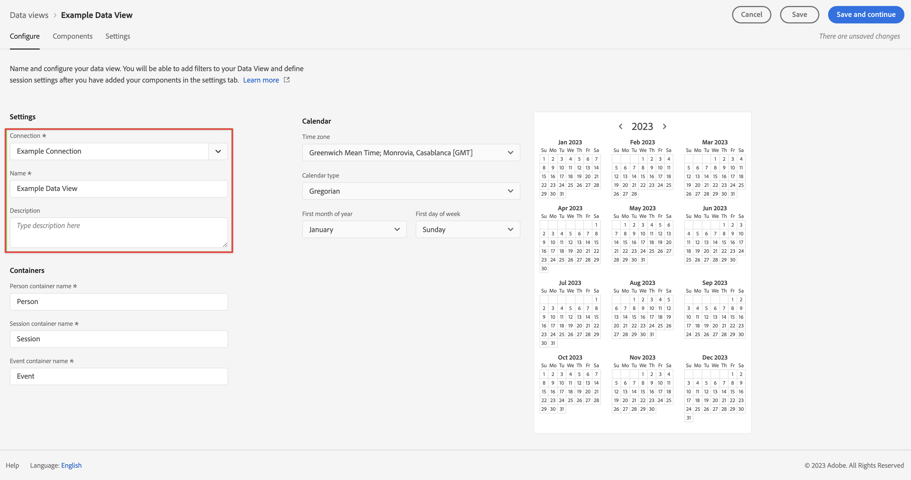

# Importera och använda data från Adobe Analytics

Den här snabbstartsguiden förklarar hur du kan använda de data som samlas in av Adobe Analytics i Customer Journey Analytics.

>[!PREREQUISITES]
>
>Du har Adobe Analytics licensierat och driftsatt på en eller flera av dina webbplatser med någon av de dokumenterade implementeringsmetoderna:
>
>- [Implementera analys med Experience Platform Edge](https://experienceleague.adobe.com/docs/analytics/implementation/aep-edge/overview.html?lang=sv-SE)
>
>- [Implementera analys med Adobe Analytics-tillägg](https://experienceleague.adobe.com/docs/analytics/implementation/launch/overview.html?lang=sv-SE)
>
>- [Implementera analys med JavaScript](https://experienceleague.adobe.com/docs/analytics/implementation/js/overview.html?lang=sv-SE)

För att uppnå detta måste du:

- **Konfigurera en Adobe Analytics-källanslutning** i Adobe Experience Platform. Källkopplingen hanterar inmatning av aktuella Adobe Analytics-data i en datauppsättning i Adobe Experience Platform.

- **Konfigurera en anslutning** i Customer Journey Analytics. Anslutningen bör (åtminstone) innehålla din Adobe Experience Platform-datauppsättning.

- **Konfigurera en datavy** i Customer Journey Analytics för att definiera mått och dimensioner som du vill använda i Analysis Workspace.

- **Konfigurera ett projekt** i Customer Journey Analytics för att skapa rapporter och visualiseringar.

>[!NOTE]
>
>Den här snabbstartsguiden är en förenklad guide om hur du importerar data med hjälp av Adobe Analytics källanslutning och använder dessa data i Customer Journey Analytics. Vi rekommenderar starkt att man studerar den ytterligare informationen när det hänvisas till.

## Konfigurera en Adobe Analytics-källanslutning

Med Adobe Analytics källanslutning kan du överföra data från Adobe Analytics rapportsserie till Adobe Experience Platform.

Så här skapar du en Adobe Analytics-källanslutning:

1. Välj **[!UICONTROL Sources]** i det vänstra fältet i plattformsgränssnittet.

2. Välj **[!UICONTROL Adobe applications]** i listan med [!UICONTROL CATEGORIES].

3. Välj **[!UICONTROL Set up]** eller **[!UICONTROL Add data]** i rutan Adobe Analytics.

   

4. Välj **[!UICONTROL Report suite]**. Välj den som du vill använda i listan över rapportsviter.

   

   Välj **[!UICONTROL Next]**.

5. Välj **[!UICONTROL Default schema]** som [!UICONTROL Target schema]. Adobe Experience Platform skapar automatiskt schemat och motsvarande datauppsättning för att mappa alla standardfält från den valda Adobe Analytics-rapportsviten.

   

   Välj **[!UICONTROL Next]**.

6. Namnge dataflödet och (eventuellt) ge en beskrivning.

   

   Välj **[!UICONTROL Next]**.

7. Granska anslutningen och välj **[!UICONTROL Finish]**.

   

När anslutningen har skapats skapas dataflödet automatiskt för att fylla i en datauppsättning med Adobe Analytics-data från rapportsviten. Dataflödet importerar upp till 13 månaders historiska data för produktionssandlådor. Bakåtfyllnaden i icke-produktionssandlådor är begränsad till tre månader.

När det första intaget är slutfört är dina Adobe Analytics-rapportsviter klara att användas av Customer Journey Analytics.

En mer omfattande självstudiekurs finns i [Skapa en källanslutning till Adobe Analytics i användargränssnittet](https://experienceleague.adobe.com/docs/experience-platform/sources/ui-tutorials/create/adobe-applications/analytics.html?lang=sv-SE).

## Konfigurera en anslutning

Om du vill använda Adobe Experience Platform-data i Customer Journey Analytics skapar du en anslutning som innehåller de data som är resultatet av konfigurationen av ditt schema, din datauppsättning och ditt arbetsflöde.

Med en anslutning kan du integrera datauppsättningar från Adobe Experience Platform i Workspace. För att kunna rapportera om dessa datauppsättningar måste du först upprätta en anslutning mellan datauppsättningar i Adobe Experience Platform och Workspace.

Så här skapar du en anslutning:

1. I Customer Journey Analytics-gränssnittet väljer du **[!UICONTROL Connections]**, eventuellt från **[!UICONTROL Data management]**, på den översta menyn.

2. Välj **[!UICONTROL Create new connection]**.

3. På skärmen [!UICONTROL Untitled connection]:

   Namnge och beskriv din anslutning i [!UICONTROL Connection Settings].

   Välj rätt sandlåda i listan [!UICONTROL Sandbox] i [!UICONTROL Data settings] och välj antalet dagliga händelser i listan [!UICONTROL Average number of daily events].

   

   Välj **[!UICONTROL Add datasets]**.

   I steget [!UICONTROL Select datasets] i [!UICONTROL Add datasets]:

   - Markera datauppsättningen som skapas automatiskt av Adobe Analytics-källkopplingen och andra datauppsättningar som du vill ta med i anslutningen.

     

   - Välj **[!UICONTROL Next]**.

   I steget [!UICONTROL Datasets settings] i [!UICONTROL Add datasets]:

   - För varje datauppsättning:

      - Välj en [!UICONTROL Person ID] bland de tillgängliga identiteter som definieras i datauppsättningsscheman i Adobe Experience Platform.

      - Välj rätt datakälla i listan [!UICONTROL Data source type]. Om du anger **[!UICONTROL Other]** lägger du till en beskrivning för datakällan.

      - Ange **[!UICONTROL Import all new data]** och **[!UICONTROL Dataset backfill existing data]** enligt dina inställningar.

     

   - Välj **[!UICONTROL Add datasets]**.

   Välj **[!UICONTROL Save]**.

Mer information om hur du skapar och hanterar en anslutning och hur du väljer och kombinerar datauppsättningar finns i [Anslutningsöversikt](../connections/overview.md).

## Konfigurera en datavy

En datavy är en behållare som är specifik för Customer Journey Analytics och som gör att du kan avgöra hur data från en anslutning ska tolkas. Här anges alla mått och mätvärden som är tillgängliga i Analysis Workspace och vilka kolumner som måtten och mätvärdena hämtar data från. Datavyer definieras som förberedelser för rapportering i Analysis Workspace.

Så här skapar du en datavy:

1. I Customer Journey Analytics-gränssnittet väljer du **[!UICONTROL Data views]**, eventuellt från **[!UICONTROL Data management]**, på den översta menyn.

2. Välj **[!UICONTROL Create new data view]**.

3. I steget [!UICONTROL Configure]:

   Välj din anslutning i listan [!UICONTROL Connection].

   Namn och (eventuellt) beskrivning av anslutningen.

   

   Välj **[!UICONTROL Save and continue]**.

4. I steget [!UICONTROL Components]:

   Lägg till alla schemafält och/eller standardkomponenter som du vill inkludera i komponentrutorna [!UICONTROL METRICS] eller [!UICONTROL DIMENSIONS].

   

   Välj **[!UICONTROL Save and continue]**.

5. I steget [!UICONTROL Settings]:

   

   Låt inställningarna vara som de är och välj **[!UICONTROL Save and finish]**.

Mer information om hur du skapar och redigerar en datavy finns i [Översikt över datavyer](../data-views/data-views.md), vilka komponenter som är tillgängliga för dig och hur du använder inställningar för segment och sessioner.

## Konfigurera ett projekt

Analysis Workspace är ett flexibelt webbläsarverktyg som gör att du snabbt kan skapa analyser och dela insikter baserat på dina data. Du använder Workspace-projekt för att kombinera datakomponenter, tabeller och visualiseringar för att skapa analyser och dela dem med vem som helst i organisationen.

Så här skapar du ditt projekt:

1. I Customer Journey Analytics-gränssnittet väljer du **[!UICONTROL Projects]** på den översta menyn.

2. Välj **[!UICONTROL Projects]** i den vänstra navigeringen.

3. Välj **[!UICONTROL Create project]**.

   

   Välj **[!UICONTROL Blank project]**.

   

4. Välj datavyn i listan.

   .

5. Om du vill skapa din första rapport börjar du dra och släppa dimensioner och mått på [!UICONTROL Freeform table] i [!UICONTROL Panel] . Dra till exempel `Program Points Balance` och `Page View` som mått och `email` som mått för att få en snabb översikt över profiler som har besökt din webbplats och som ingår i lojalitetsprogrammet som samlar in förmånspoäng.

   

Mer information om hur du skapar projekt och bygger analyser med komponenter, visualiseringar och paneler finns i [Översikt över Analysis Workspace](../analysis-workspace/home.md) .

>[!SUCCESS]
>
>Du har slutfört alla steg. Från och med att du konfigurerar Adobe Analytics datakällanslutning och konfigurerar den kopplingen för rapportsviten överförs dina Adobe Analytics-data automatiskt till Adobe Experience Platform. Du har definierat en anslutning i Customer Journey Analytics för att använda inkapslade Adobe Analytics-data och andra data. Med datavyns definition kan ni ange vilken dimension och vilka mätvärden som ska användas och slutligen skapa ert första projekt som visualiserar och analyserar era data.

