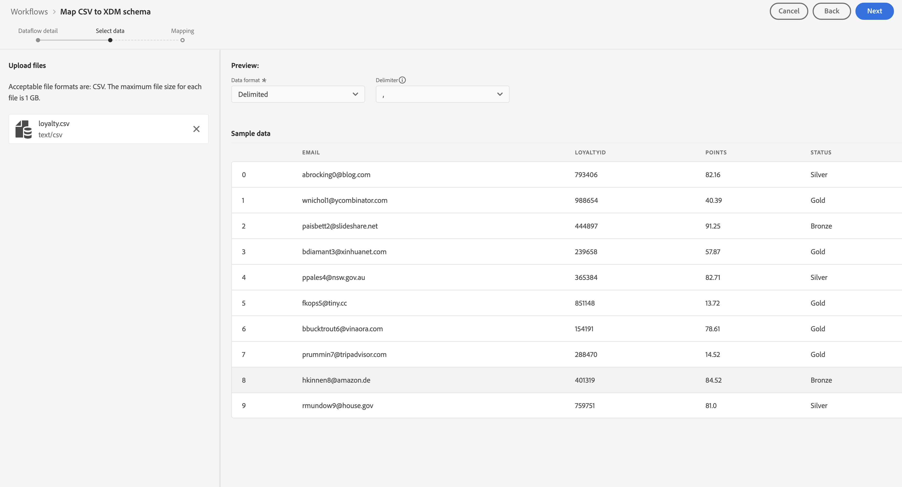

# Importera och använda batchdata

Den här snabbstartsguiden förklarar hur du kan importera batchdata till Adobe Experience Platform och sedan använda dessa data i Customer Journey Analytics.

För att uppnå detta måste du:

- **Konfigurera ett schema och en datauppsättning** i Adobe Experience Platform för att definiera modellen (schemat) för de data som du vill samla in och var data (datauppsättningen) ska samlas in.

- **Använda arbetsflöden** för att enkelt överföra dina gruppdata till datauppsättningen som konfigurerats i Adobe Experience Platform.

- **Konfigurera en anslutning** i Customer Journey Analytics. Den här anslutningen bör (åtminstone) innehålla din Adobe Experience Platform-datauppsättning.

- **Konfigurera en datavy** i Customer Journey Analytics för att definiera mätvärden och dimensioner som du vill använda i Analysis Workspace.

- **Konfigurera ett projekt** i Customer Journey Analytics för att skapa rapporter och visualiseringar.

>[!NOTE]
>
>Det här är en förenklad guide om hur man importerar batchdata till Adobe Experience Platform och använder dem i Customer Journey Analytics.  Vi rekommenderar starkt att man studerar den ytterligare informationen när det hänvisas till.

## Konfigurera ett schema och en datauppsättning

Om du vill importera data till Adobe Experience Platform måste du först definiera vilka data du vill samla in. Alla data som hämtas in till Adobe Experience Platform måste överensstämma med en standardiserad, normaliserad struktur för att de ska kunna identifieras och hanteras av funktioner och funktioner längre fram i kedjan. Experience Data Model (XDM) är standardramverket som tillhandahåller den här strukturen i form av scheman.

När du har definierat ett schema använder du en eller flera datauppsättningar för att lagra och hantera datainsamlingen. En datauppsättning är en lagrings- och hanteringskonstruktion för en datamängd, vanligtvis en tabell, som innehåller ett schema (kolumner) och fält (rader).

Alla data som importeras till Adobe Experience Platform måste överensstämma med ett fördefinierat schema innan de kan sparas som en datauppsättning.

### Konfigurera ett schema

För den här snabbstarten antar vi att du vill samla in vissa lojalitetsdata, t.ex. lojalitets-ID, förmånspoäng och lojalitetsstatus.
Därför måste du först definiera ett schema som modellerar dessa data.

Så här konfigurerar du ditt schema:

1. I Adobe Experience Platform-gränssnittet väljer du **[!UICONTROL Schemas]** inom [!UICONTROL DATA MANAGEMENT].

2. Välj **[!UICONTROL Create schema]**. Välj **[!UICONTROL XDM Individual Profile]** i listan med alternativ.

   

   >[!INFO]
   >
   >    Ett enskilt profilschema används för att modellera profilen _attributes_ (som e-post, lojalitetsstatus, förmånspoäng). Ett Experience Event-schema används för att modellera _beteende_ för en profil (som sidvy, lägg till i kundvagn).


3. I [!UICONTROL Untitled schema] skärm:

   1. Ange ett visningsnamn för ditt schema och (valfritt) en beskrivning.

      

   2. Välj **[!UICONTROL + Add]** in [!UICONTROL Field groups].

      

      Fältgrupper är återanvändbara samlingar av objekt och attribut som gör att du enkelt kan utöka ditt schema.

   3. I [!UICONTROL Add fields groups] väljer du **[!UICONTROL Loyalty Details]** fältgrupp från listan.

      

      Du kan välja knappen Förhandsgranska om du vill se en förhandsvisning av de fält som är en del av den här fältgruppen.

      

      Välj **[!UICONTROL Back]** för att stänga förhandsgranskningen.

   4. Välj **[!UICONTROL Add field groups]**.

4. Välj **[!UICONTROL +]** bredvid schemanamnet i [!UICONTROL Structure] -panelen.

   

5. I [!UICONTROL Field Properties] panel, ange `Identification` som namn, **[!UICONTROL Identification]** som [!UICONTROL Display name], markera **[!UICONTROL Object]** som [!UICONTROL Type] och markera **[!UICONTROL Profile Core v2]** som [!UICONTROL Field Group].

   

   Detta lägger till identifieringsfunktioner i schemat. I ditt fall vill du identifiera lojalitetsinformation med e-postadressen från era batchdata.

   Välj **[!UICONTROL Apply]** om du vill lägga till det här objektet i ditt schema.

6. Välj **[!UICONTROL email]** fält i det identifieringsobjekt som du just lade till, och markera **[!UICONTROL Identity]** och **[!UICONTROL Email]** från [!UICONTROL Identity namespace] i [!UICONTROL Field Properties] -panelen.

   

   Du anger e-postadressen som den identitet som tjänsten Adobe Experience Platform Identity kan använda för att kombinera (sammanfoga) profiler.

   Välj **[!UICONTROL Apply]**. En fingeravtrycksikon visas i e-postattributet.

   Välj **[!UICONTROL Save]**.

7. Välj rotnivån för schemat (med schemanamnet) och välj sedan **[!UICONTROL Profile]** byt.

   Du uppmanas att aktivera profilschemat. När data har aktiverats, när data har importerats till datauppsättningar som baseras på det här schemat, sammanfogas dessa data i kundprofilen i realtid.

   Se [Aktivera schemat för användning i kundprofilen i realtid](https://experienceleague.adobe.com/docs/experience-platform/xdm/tutorials/create-schema-ui.html?lang=en#profile) för mer information.

   >[!IMPORTANT]
   >
   >    När du har sparat ett schema som är aktiverat för profilen kan det inte längre inaktiveras för profilen.

   

8. Välj **[!UICONTROL Save]** för att spara ditt schema.

Du har skapat ett minimalt schema som modellerar de lojalitetsdata som du kan importera till Adobe Experience Platform. Schemat gör det möjligt att identifiera profiler med hjälp av e-postadressen. Genom att aktivera schemat för profilen ser du till att data från din gruppfil läggs till i kundprofilen i realtid.

Se [Skapa och redigera scheman i användargränssnittet](https://experienceleague.adobe.com/docs/experience-platform/xdm/ui/resources/schemas.html) om du vill ha mer information om hur du lägger till och tar bort fältgrupper och enskilda fält i ett schema.

### Konfigurera en datauppsättning

Med ditt schema har du definierat din datamodell. Nu måste du definiera konstruktionen för att lagra och hantera data. Detta görs via datauppsättningar.

Så här konfigurerar du datauppsättningen:

1. I Adobe Experience Platform-gränssnittet väljer du **[!UICONTROL Datasets]** inom [!UICONTROL DATA MANAGEMENT].

2. Välj **[!UICONTROL Create dataset]**.

   

3. Välj **[!UICONTROL Create dataset from schema]**.

   

4. Markera schemat som du skapade tidigare och välj **[!UICONTROL Next]**.

5. Ge datauppsättningen ett namn och (valfritt) ge en beskrivning.

   

6. Välj **[!UICONTROL Finish]**.

7. Välj **[!UICONTROL Profile]** byt.

   Du uppmanas att aktivera datauppsättningen för profilen. När datauppsättningen har aktiverats berikas kundprofiler i realtid med inkapslade data.

   >[!IMPORTANT]
   >
   >    Du kan bara aktivera en datauppsättning för profilen när schemat, som datauppsättningen följer, också är aktiverat för profilen.

   

Se [Användargränssnittshandbok för datauppsättningar](https://experienceleague.adobe.com/docs/experience-platform/catalog/datasets/user-guide.html) om du vill ha mer information om hur du visar, förhandsgranskar, skapar, tar bort en datauppsättning. Och hur man aktiverar en datauppsättning för kundprofil i realtid.


## Använda arbetsflöden

Du använder arbetsflödesfunktionen för att överföra gruppdata till Adobe Experience Platform. Den exempelfil som används är en CSV-fil med följande innehåll:

```
email,loyaltyID,points,status
abrocking0@blog.com,793406,82.16,Silver
wnichol1@ycombinator.com,988654,40.39,Gold
paisbett2@slideshare.net,444897,91.25,Bronze
bdiamant3@xinhuanet.com,239658,57.87,Gold
ppales4@nsw.gov.au,365384,82.71,Silver
...
```

Så här använder du arbetsflöden:

1. Välj **[!UICONTROL Workflows]** till vänster.

2. Välj **[!UICONTROL Map CSV to XDM schema]**. Välj **[!UICONTROL Launch]**.

   

3. I [!UICONTROL Map CSV to XDM schema] på [!UICONTROL Dataflow detail] steg:

   Välj **[!UICONTROL Existing dataset]** väljer du ditt innehåll i datauppsättningslistan och ger ditt namn [!UICONTROL Dataflow name].

   

   Välj **[!UICONTROL Next]**.

4. I [!UICONTROL Select data] steg:

   Dra och släpp eller markera **[!UICONTROL Choose files]** om du vill välja en CSV-fil med lojalitetsdata. Du kommer att se en förhandsgranskning av dina lojalitetsdata.

   

   Välj **[!UICONTROL Next]**.

5. I [!UICONTROL Mapping] steg:

   Mappa data från CSV-filen till data i ditt schema. Med hjälp av AI försöker arbetsflödesfunktionen automatiskt mappa dina gruppdatafält till schemafälten.

   

   Du kan använda **[!UICONTROL Preview data]** om du vill se en förhandsvisning av mappade data.

   

6. Välj **[!UICONTROL Finish]** för att börja inhämta batchdata till Adobe Experience Platform.

Se [Mappa en CSV-fil till ett befintligt XDM-schema](https://experienceleague.adobe.com/docs/experience-platform/ingestion/tutorials/map-csv/existing-schema.html) Om du vill ha mer information om hur du mappar data när inkommande data inte är kompatibla med ditt XDM-schema använder du mappningsmallar, använd beräkningsfält för att säkerställa att batchdata överensstämmer med vad schemat förväntar sig, osv.


## Konfigurera en anslutning

Om du vill använda Adobe Experience Platform-data i Customer Journey Analytics skapar du en anslutning som innehåller de data som är resultatet av konfigurationen av ditt schema, din datauppsättning och ditt arbetsflöde.

Med en anslutning kan du integrera datauppsättningar från Adobe Experience Platform i Workspace. För att kunna rapportera om dessa datauppsättningar måste du först skapa en anslutning mellan datauppsättningar i Adobe Experience Platform och Workspace.

Så här skapar du en anslutning:

1. I användargränssnittet för Customer Journey Analytics väljer du **[!UICONTROL Connections]** i den övre navigeringen.

2. Välj **[!UICONTROL Create new connection]**.

3. I [!UICONTROL Untitled connection] skärm:

   Namnge och beskriva anslutningen i [!UICONTROL Connection Settings].

   Välj rätt sandlåda i dialogrutan [!UICONTROL Sandbox] lista i [!UICONTROL Data settings] och välj antalet dagliga händelser i dialogrutan [!UICONTROL Avergage number of daily events] lista.

   

   Välj **[!UICONTROL Add datsets]**.

   I [!UICONTROL Select datasets] steg in [!UICONTROL Add datasets]:

   - Markera den datauppsättning du skapade tidigare (`Example Loyalty Dataset`) och andra datauppsättningar som du vill inkludera i anslutningen.

      

   - Välj **[!UICONTROL Next]**.
   I [!UICONTROL Datasets settings] steg in [!UICONTROL Add datasets]:

   - För varje datauppsättning:

      - Välj en [!UICONTROL Person ID] från de tillgängliga identiteter som definieras i datauppsättningsscheman i Adobe Experience Platform.

      - Välj rätt datakälla på menyn [!UICONTROL Data source type] lista. Om du anger **[!UICONTROL Other]** lägg sedan till en beskrivning av datakällan.

      - Ange **[!UICONTROL Import all new data]** och **[!UICONTROL Dataset backfill existing data]** enligt dina önskemål.

      

   - Välj **[!UICONTROL Add datasets]**.
   Välj **[!UICONTROL Save]**.

Se [Anslutningar - översikt](../connections/overview.md) om du vill ha mer information om hur du skapar och hanterar en anslutning och hur du väljer och kombinerar datauppsättningar.

## Konfigurera en datavy

En datavy är en behållare som är specifik för Customer Journey Analytics och som gör att du kan avgöra hur data från en anslutning ska tolkas. Här anges alla mått och mätvärden som är tillgängliga i Analysis Workspace och vilka kolumner som måtten och mätvärdena hämtar data från. Datavyer definieras som förberedelser för rapportering i Analysis Workspace.

Så här skapar du en datavy:

1. I användargränssnittet för Customer Journey Analytics väljer du **[!UICONTROL Data views]** i den övre navigeringen.

2. Välj **[!UICONTROL Create new data view]**.

3. I [!UICONTROL Configure] steg:

   Välj din anslutning på menyn [!UICONTROL Connection] lista.

   Namn och (eventuellt) beskrivning av anslutningen.

   

   Välj **[!UICONTROL Save and continue]**.

4. I [!UICONTROL Components] steg:

   Lägg till alla schemafält och/eller standardkomponenter som du vill inkludera i [!UICONTROL METRICS] eller [!UICONTROL DIMENSIONS] komponentrutor.

   

   Välj **[!UICONTROL Save and continue]**.

5. I [!UICONTROL Settings] steg:

   

   Låt inställningarna vara som de är och välj **[!UICONTROL Save and finish]**.

Se [Översikt över datavyer](../data-views/data-views.md) för mer information om hur du skapar och redigerar en datavy, vilka komponenter som är tillgängliga för dig och hur du använder filter- och sessionsinställningar.


## Konfigurera ett projekt

Analysis Workspace är ett flexibelt webbläsarverktyg som gör att du snabbt kan skapa analyser och dela insikter baserat på dina data. Du använder Workspace-projekt för att kombinera datakomponenter, tabeller och visualiseringar för att skapa analyser och dela dem med vem som helst i organisationen.

Så här skapar du ditt projekt:

1. I användargränssnittet för Customer Journey Analytics väljer du **[!UICONTROL Projects]** i den övre navigeringen.

2. Välj **[!UICONTROL Projects]** i den vänstra navigeringen.

3. Välj **[!UICONTROL Create project]**.

   

   Välj **[!UICONTROL Blank project]**.

   

4. Välj datavyn i listan.

   .

5. Börja dra och släppa mått och mätvärden på [!UICONTROL Freeform table] i [!UICONTROL Panel] för att skapa din första rapport. Dra som ett exempel `Program Points Balance` och `Page View` som mått och `email` som en dimension för att få en snabb översikt över profiler som har besökt er webbplats och som också ingår i lojalitetsprogrammet som samlar in förmånspoäng.

   

Se [Analysis Workspace - översikt](../analysis-workspace/home.md) om du vill ha mer information om hur du skapar projekt och bygger din analys med hjälp av komponenter, visualisering och paneler.

>[!SUCCESS]
>
>Du har slutfört alla steg. Börja med att definiera vilka lojalitetsdata som du vill samla in (schema) och var de ska lagras (datauppsättning) i Adobe Experience Platform, så konfigurerade du ett arbetsflöde för att batchöverföra lojalitetsdata till en datauppsättning. Du har definierat en anslutning i Customer Journey Analytics för att använda inmatade lojalitetsdata och andra data. Med datavyns definition kan ni ange vilken dimension och vilka mätvärden som ska användas och slutligen skapa ert första projekt som visualiserar och analyserar era data.
