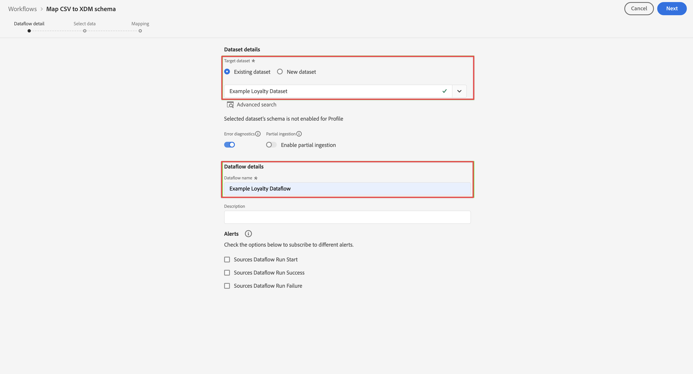
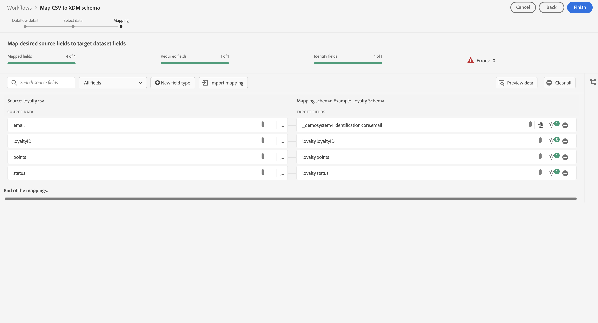

# Importera och använda batchdata

Den här snabbstartsguiden förklarar hur du kan importera batchdata till Adobe Experience Platform och sedan använda dessa data i Customer Journey Analytics.

För att uppnå detta måste du:

- **Konfigurera ett schema och en datauppsättning** i Adobe Experience Platform för att definiera modellen (schemat) för de data som du vill samla in och var data (datauppsättningen) ska samlas in.

- **Använd arbetsflöden** för att enkelt överföra dina gruppdata till datauppsättningen som konfigurerats i Adobe Experience Platform.

- **Konfigurera en anslutning** i Customer Journey Analytics. Den här anslutningen bör (åtminstone) innehålla din Adobe Experience Platform-datauppsättning.

- **Konfigurera en datavy** i Customer Journey Analytics för att definiera mått och dimensioner som du vill använda i Analysis Workspace.

- **Konfigurera ett projekt** i Customer Journey Analytics för att skapa rapporter och visualiseringar.

>[!NOTE]
>
>Den här snabbstartsguiden är en förenklad guide om hur man importerar batchdata till Adobe Experience Platform och använder dem i Customer Journey Analytics. Vi rekommenderar starkt att man studerar den ytterligare informationen när det hänvisas till.

## Konfigurera ett schema och en datauppsättning

Om du vill importera data till Adobe Experience Platform måste du först definiera vilka data du vill samla in. Alla data som hämtas in till Adobe Experience Platform måste överensstämma med en standardiserad, normaliserad struktur för att de ska kunna identifieras och hanteras av funktioner och funktioner längre fram i kedjan. Experience Data Model (XDM) är standardramverket som tillhandahåller den här strukturen i form av scheman.

När du har definierat ett schema använder du en eller flera datauppsättningar för att lagra och hantera datainsamlingen. En datauppsättning är en lagrings- och hanteringskonstruktion för en datamängd (vanligtvis en tabell) som innehåller ett schema (kolumner) och fält (rader).

Alla data som importeras till Adobe Experience Platform måste överensstämma med ett fördefinierat schema innan de kan sparas som en datauppsättning.

### Konfigurera ett schema

För den här snabbstarten vill du samla in vissa lojalitetsdata, till exempel lojalitets-ID, förmånspoäng och lojalitetsstatus.
Du måste först definiera ett schema som modellerar dessa data.

Så här konfigurerar du ditt schema:

1. I Adobe Experience Platform-gränssnittet väljer du **[!UICONTROL Schemas]** i [!UICONTROL DATA MANAGEMENT] till vänster.

1. Välj **[!UICONTROL Create schema]**.
.
1. I steget Välj en klass i guiden Skapa schema:

   1. Välj **[!UICONTROL Individual Profile]**.

      

      >[!INFO]
      >
      >    Ett Experience Event-schema används för att modellera _beteendet_ för en profil (som scennamn, push-knapp som läggs till i kundvagnen). Ett enskilt profilschema används för att modellera profilen _attribut_ (som namn, e-post, kön).

   1. Välj **[!UICONTROL Next]**.


1. I [!UICONTROL Name and review step] i guiden [!UICONTROL Create schema]:

   1. Ange en **[!UICONTROL Schema display name]** för ditt schema och (valfritt) en **[!UICONTROL Description]**.

      

   1. Välj **[!UICONTROL Finish]**.

1. På fliken Struktur i exempelschemat:

   1. Välj **[!UICONTROL + Add]** i [!UICONTROL Field groups].

      

      Fältgrupper är återanvändbara samlingar av objekt och attribut som gör att du enkelt kan utöka ditt schema.

   1. I dialogrutan [!UICONTROL Add fields groups] väljer du fältgruppen **[!UICONTROL Loyalty Details]** i listan.

      

      Du kan välja knappen Förhandsgranska om du vill se en förhandsvisning av de fält som är en del av den här fältgruppen.

      

      Välj **[!UICONTROL Back]** om du vill stänga förhandsgranskningen.

   1. Välj **[!UICONTROL Add field groups]**.

1. Välj **[!UICONTROL +]** bredvid schemanamnet på panelen [!UICONTROL Structure].

   

1. På panelen [!UICONTROL Field Properties] anger du `Identification` som namn, **[!UICONTROL Identification]** som [!UICONTROL Display name], väljer **[!UICONTROL Object]** som [!UICONTROL Type] och väljer **[!UICONTROL Profile Core v2]** som [!UICONTROL Field Group].

   

   Identifieringsobjektet lägger till identifieringsfunktioner i ditt schema. I ditt fall vill du identifiera lojalitetsinformation med e-postadressen från era batchdata.

   Välj **[!UICONTROL Apply]** om du vill lägga till det här objektet i ditt schema.

1. Markera fältet **[!UICONTROL email]** i det identifieringsobjekt som du nyss lade till och välj **[!UICONTROL Identity]** och **[!UICONTROL Email]** i [!UICONTROL Identity namespace] på panelen [!UICONTROL Field Properties].

   

   Du anger e-postadressen som den identitet som tjänsten Adobe Experience Platform Identity kan använda för att kombinera (sammanfoga) profiler.

   Välj **[!UICONTROL Apply]**. En fingeravtrycksikon visas i e-postattributet.

   Välj **[!UICONTROL Save]**.

1. Välj rotnivån för ditt schema (med schemanamnet) och välj sedan växeln **[!UICONTROL Profile]**.

   Du uppmanas att aktivera schemat för profilen. När data har aktiverats, när data har importerats till datauppsättningar som baseras på detta schema, sammanfogas dessa data i kundprofilen i realtid.

   Mer information finns i [Aktivera schemat för användning i kundprofilen i realtid](https://experienceleague.adobe.com/docs/experience-platform/xdm/tutorials/create-schema-ui.html?lang=sv-SE#profile).

   >[!IMPORTANT]
   >
   >    När du har sparat ett schema som är aktiverat för profilen kan det inte längre inaktiveras för profilen.

   

1. Välj **[!UICONTROL Save]** om du vill spara ditt schema.

Du har skapat ett minimalt schema som modellerar de lojalitetsdata som du kan importera till Adobe Experience Platform. Schemat gör att profiler kan identifieras med e-postadressen. Genom att aktivera schemat för profilen ser du till att data från din gruppfil läggs till i kundprofilen i realtid.

Mer information om hur du lägger till och tar bort fältgrupper och enskilda fält i ett schema finns i [Skapa och redigera scheman i användargränssnittet](https://experienceleague.adobe.com/docs/experience-platform/xdm/ui/resources/schemas.html?lang=sv-SE).

### Konfigurera en datauppsättning

Med ditt schema har du definierat din datamodell. Nu måste du definiera konstruktionen för att lagra och hantera data, vilket sker via datauppsättningar.

Så här konfigurerar du datauppsättningen:

1. I Adobe Experience Platform-gränssnittet väljer du **[!UICONTROL Datasets]** i [!UICONTROL DATA MANAGEMENT] till vänster.

2. Välj **[!UICONTROL Create dataset]**.

   

3. Välj **[!UICONTROL Create dataset from schema]**.

   

4. Markera schemat som du skapade tidigare och välj **[!UICONTROL Next]**.

5. Ge datauppsättningen ett namn och (valfritt) ge en beskrivning.

   

6. Välj **[!UICONTROL Finish]**.

7. Välj växeln **[!UICONTROL Profile]**.

   Du uppmanas att aktivera datauppsättningen för profilen. När datauppsättningen är aktiverad berikas kundprofiler i realtid med inkapslade data.

   >[!IMPORTANT]
   >
   >Du kan bara aktivera en datauppsättning för profilen när schemat, som datauppsättningen följer, också är aktiverat för profilen.

   

Mer information om hur du visar, förhandsgranskar, skapar och tar bort en datauppsättning finns i [Användargränssnittshandbok för datauppsättningar](https://experienceleague.adobe.com/docs/experience-platform/catalog/datasets/user-guide.html?lang=sv-SE). Och hur man aktiverar en datauppsättning för kundprofil i realtid.


## Använda arbetsflöden

Du använder arbetsflödesfunktionen för att överföra gruppdata till Adobe Experience Platform. Den exempelgruppfil som du använder är en CSV-fil med följande innehåll:

```
email,loyaltyID,points,status
abrocking0@blog.com,793406,82.16,Silver
wnichol1@ycombinator.com,988654,40.39,Gold
paisbett2@slideshare.net,444897,91.25,Bronze
bdiamant3@xinhuanet.com,239658,57.87,Gold
ppales4@nsw.gov.au,365384,82.71,Silver
...
```

Så här använder du arbetsflöden:

1. Välj **[!UICONTROL Workflows]** i den vänstra listen i plattformens användargränssnitt.

2. Välj **[!UICONTROL Map CSV to XDM schema]**. Välj **[!UICONTROL Launch]**.

   

3. I steget [!UICONTROL Dataflow detail] på skärmen [!UICONTROL Map CSV to XDM schema]:

   Välj **[!UICONTROL Existing dataset]**, markera datauppsättningen i datauppsättningslistan och ge [!UICONTROL Dataflow name] ett namn.

   

   Välj **[!UICONTROL Next]**.

4. I steget [!UICONTROL Select data]:

   Dra och släpp eller välj **[!UICONTROL Choose files]** för att välja din CSV-fil med lojalitetsdata. Du ser en förhandsgranskning av dina lojalitetsdata.

   

   Välj **[!UICONTROL Next]**.

5. I steget [!UICONTROL Mapping]:

   Mappa data från CSV-filen till data i ditt schema. Med hjälp av AI försöker arbetsflödesfunktionen automatiskt mappa dina gruppdatafält till schemafälten.

   

   Du kan använda **[!UICONTROL Preview data]** för att se en förhandsvisning av mappade data.

   

6. Välj **[!UICONTROL Finish]** om du vill börja inhämta batchdata till Adobe Experience Platform.

Se [Mappa en CSV-fil till ett befintligt XDM-schema](https://experienceleague.adobe.com/docs/experience-platform/ingestion/tutorials/map-csv/existing-schema.html?lang=sv-SE) för mer information om:

- hur du mappar data när inkommande data inte är kompatibla med ditt XDM-schema.
- använda mappningsmallar,
- använda beräkningsfält för att säkerställa att batchdata överensstämmer med vad schemat förväntar sig,
- med mera.


## Konfigurera en anslutning

Om du vill använda Adobe Experience Platform-data i Customer Journey Analytics skapar du en anslutning som innehåller de data som är resultatet av konfigurationen av ditt schema, din datauppsättning och ditt arbetsflöde.

Med en anslutning kan du integrera datauppsättningar från Adobe Experience Platform i Workspace. För att kunna rapportera om dessa datauppsättningar måste du först upprätta en anslutning mellan datauppsättningar i Adobe Experience Platform och Workspace.

Så här skapar du en anslutning:

1. I Customer Journey Analytics-gränssnittet väljer du **[!UICONTROL Connections]**, eventuellt från **[!UICONTROL Data management]**, på den översta menyn.

2. Välj **[!UICONTROL Create new connection]**.

3. På skärmen [!UICONTROL Untitled connection]:

   Namnge och beskriv din anslutning i [!UICONTROL Connection Settings].

   Välj rätt sandlåda i listan [!UICONTROL Sandbox] i [!UICONTROL Data settings] och välj antalet dagliga händelser i listan [!UICONTROL Average number of daily events].

   

   Välj **[!UICONTROL Add datasets]**.

   I steget [!UICONTROL Select datasets] i [!UICONTROL Add datasets]:

   - Markera datauppsättningen som du skapade tidigare (`Example Loyalty Dataset`) och alla andra datauppsättningar som du vill ta med i anslutningen.

     

   - Välj **[!UICONTROL Next]**.

   I steget [!UICONTROL Datasets settings] i [!UICONTROL Add datasets]:

   - För varje datauppsättning:

      - Välj en [!UICONTROL Person ID] bland de tillgängliga identiteter som definieras i datauppsättningsscheman i Adobe Experience Platform.

      - Välj rätt datakälla i listan [!UICONTROL Data source type]. Om du anger **[!UICONTROL Other]** lägger du till en beskrivning för datakällan.

      - Ange **[!UICONTROL Import all new data]** och **[!UICONTROL Dataset backfill existing data]** enligt dina inställningar.

     

   - Välj **[!UICONTROL Add datasets]**.

   Välj **[!UICONTROL Save]**.

Mer information om hur du skapar och hanterar en anslutning och hur du väljer och kombinerar datauppsättningar finns i [Anslutningsöversikt](../connections/overview.md).

## Konfigurera en datavy

En datavy är en behållare som är specifik för Customer Journey Analytics och som gör att du kan avgöra hur data från en anslutning ska tolkas. Här anges alla mått och mätvärden som är tillgängliga i Analysis Workspace och vilka kolumner som måtten och mätvärdena hämtar data från. Datavyer definieras som förberedelser för rapportering i Analysis Workspace.

Så här skapar du en datavy:

1. I Customer Journey Analytics-gränssnittet väljer du **[!UICONTROL Data views]**, eventuellt från **[!UICONTROL Data management]**, på den översta menyn.

2. Välj **[!UICONTROL Create new data view]**.

3. I steget [!UICONTROL Configure]:

   Välj din anslutning i listan [!UICONTROL Connection].

   Namn och (eventuellt) beskrivning av anslutningen.

   

   Välj **[!UICONTROL Save and continue]**.

4. I steget [!UICONTROL Components]:

   Lägg till alla schemafält och/eller standardkomponenter som du vill inkludera i komponentrutorna [!UICONTROL METRICS] eller [!UICONTROL DIMENSIONS].

   

   Välj **[!UICONTROL Save and continue]**.

5. I steget [!UICONTROL Settings]:

   

   Låt inställningarna vara som de är och välj **[!UICONTROL Save and finish]**.

Mer information om hur du skapar och redigerar en datavy finns i [Översikt över datavyer](../data-views/data-views.md), vilka komponenter som är tillgängliga för dig och hur du använder inställningar för segment och sessioner.


## Konfigurera ett projekt

Analysis Workspace är ett flexibelt webbläsarverktyg som gör att du snabbt kan skapa analyser och dela insikter baserat på dina data. Du använder Workspace-projekt för att kombinera datakomponenter, tabeller och visualiseringar för att skapa analyser och dela dem med vem som helst i organisationen.

Så här skapar du ditt projekt:

1. I Customer Journey Analytics-gränssnittet väljer du **[!UICONTROL Projects]** på den översta menyn.

2. Välj **[!UICONTROL Projects]** i den vänstra navigeringen.

3. Välj **[!UICONTROL Create project]**.

   

   Välj **[!UICONTROL Blank project]**.

   

4. Välj datavyn i listan.

   .

5. Om du vill skapa din första rapport börjar du dra och släppa dimensioner och mått på [!UICONTROL Freeform table] i [!UICONTROL Panel]. Dra till exempel `Program Points Balance` och `Page View` som mått och `email` som mått för att få en snabb översikt över profiler som har besökt din webbplats och som ingår i lojalitetsprogrammet som samlar in förmånspoäng.

   

Mer information om hur du skapar projekt och bygger analyser med komponenter, visualiseringar och paneler finns i [Översikt över Analysis Workspace](../analysis-workspace/home.md) .

>[!SUCCESS]
>
>Du har slutfört alla steg. Börja med att definiera vilka lojalitetsdata som du vill samla in (schema) och var de ska lagras (datauppsättning) i Adobe Experience Platform, så konfigurerade du ett arbetsflöde för att batchöverföra lojalitetsdata till en datauppsättning. Du har definierat en anslutning i Customer Journey Analytics för att använda inkapslade lojalitetsdata och andra data. Med datavyns definition kan ni ange vilken dimension och vilka mätvärden som ska användas och slutligen skapa ert första projekt som visualiserar och analyserar era data.
