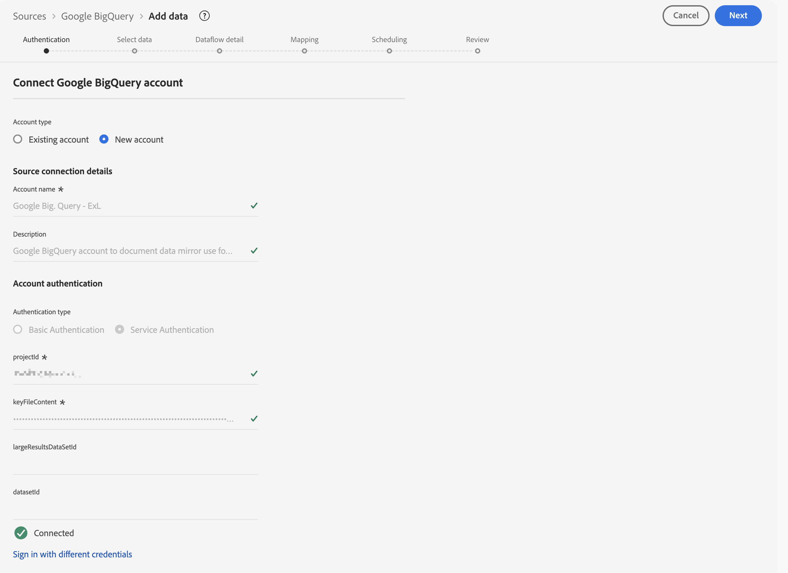

# Spegla och använda modellbaserade data

{{release-limited-testing}}

Den här snabbstartsguiden förklarar hur du använder funktionen [Experience Platform Data Mirror för Customer Journey Analytics](data-mirror.md) för att spegla modellbaserade data från en inbyggd datalagerlösning i Adobe Experience Platform. Och använd sedan dessa data i Customer Journey Analytics.

För att uppnå detta måste du:

* **Använd en inbyggd datalagerlösning** för att lagra data som du vill spegla i Experience Platform. Och använd sedan dessa data i Customer Journey Analytics för att rapportera och analysera.

* **Konfigurera ett schema** i Experience Platform för att definiera modellen (schemat) för de data som du vill spegla.

* **Använd en källanslutning** i Experience Platform för att hämta speglade data till en datauppsättning.

* **Konfigurera en anslutning** i Customer Journey Analytics. Den här anslutningen bör (åtminstone) innehålla din Experience Platform-modellbaserade datauppsättning.

* **Konfigurera en datavy** i Customer Journey Analytics för att definiera mått och dimensioner som du vill använda i Analysis Workspace.

* **Konfigurera ett projekt** i Customer Journey Analytics för att skapa rapporter och visualiseringar.

Experience Platform Data Mirror för Customer Journey Analytics kräver modellbaserade scheman.


>[!NOTE]
>
>Den här snabbstartsguiden är en förenklad guide om hur du speglar modellbaserade data i Adobe Experience Platform och använder dessa data i Customer Journey Analytics. Vi rekommenderar starkt att man studerar den ytterligare informationen när det hänvisas till.


## Använd en inbyggd lösning för datalager

Den här snabbstartsguiden använder [[!DNL Google BigQuery]](datawarehouse.md#google-bigquery) som systemspecifik lösning för datalagret. Andra [lösningar som stöds](datawarehouse.md) är [[!DNL Snowflake]](datawarehouse.md#snowflake) och [[!DNL Azure Databricks]](datawarehouse.md#azure-databricks).

I [!DNL Google BigQuery] lagras och uppdateras följande exempeldata regelbundet i en tabell med namnet **[!UICONTROL eventdata]**.

+++ Information om exempelhändelsedata

| tidsstämpel | id | pagename | personid | trackingcode | order | intäktsbelopp |
| :---                      |  ---: | :---              | :---            | :---          |   ---: | :---           |
| 2025-03-06T19:15:39+00:00 | 10001 | hemsida | person-1abc123 | abc123 |        |                |
| 2025-03-06T19:15:39+00:00 | 10002 | bekräftelsesida | person-1abc123 |               | 1 | 174,25 |
| 2025-03-06T19:15:39+00:00 | 10003 | hemsida | person-2def123 | def123 |        |                |
| 2025-03-06T19:15:39+00:00 | 10004 | hemsida | person-3ghi123 | ghi123 |        |                |
| 2025-03-06T19:15:39+00:00 | 10005 | bekräftelsesida | person-3ghi123 |               | 1 | 149,25 |
| 2025-03-06T19:15:39+00:00 | 10006 | hemsida | person-4abc456 | abc456 |        |                |
| 2025-03-06T19:15:39+00:00 | 10007 | hemsida | person-5def456 | def456 |        |                |
| 2025-03-06T19:15:39+00:00 | 10008 | hemsida | person-6ghi456 | ghi456 |        |                |
| 2025-03-06T19:15:39+00:00 | 10009 | bekräftelsesida | person-6ghi456 |               | 1 | 159,25 |
| 2025-03-06T19:15:39+00:00 | 10010 | hemsida | person-7abc789 | abc789 |        |                |
| 2025-03-06T19:15:39+00:00 | 10011 | hemsida | person-8def789 | def789 |        |                |
| 2025-03-06T19:15:39+00:00 | 10012 | hemsida | person-9ghi789 | ghi789 |        |                |
| 2025-03-06T19:15:39+00:00 | 10013 | bekräftelsesida | person-9ghi789 |               | 1 | 124,25 |
| 2025-03-06T19:15:39+00:00 | 10014 | hemsida | person-10abc987 | abc987 |        |                |
| 2025-03-06T19:15:39+00:00 | 10015 | hemsida | person-11def987 | def987 |        |                |
| 2025-03-06T19:15:39+00:00 | 10016 | hemsida | person-12ghi987 | ghi987 |        |                |
| 2025-03-06T19:15:39+00:00 | 10017 | hemsida | person-13abc654 | abc654 |        |                |
| 2025-03-06T19:15:39+00:00 | 10018 | hemsida | person-14def654 | def654 |        |                |
| 2025-03-06T19:15:39+00:00 | 10019 | hemsida | person-15ghi654 | ghi654 |        |                |
| 2025-03-06T19:15:39+00:00 | 10020 | bekräftelsesida | person-15ghi654 |               | 1 | 174,25 |

+++

Data lagras i en databastabell med ett associerat schema. Så här inspekterar du databastabellen:

1. Logga in på Google BigQuery.
1. Välj **[!UICONTROL BigQuery]** > **[!UICONTROL Studio]**.
1. Välj projekt, datauppsättning och register. På fliken **[!UICONTROL Schema]** visas en översikt över schemat för händelsedata.

   

Så här inspekterar du data:

1. Välj **[!UICONTROL Query]**.
1. Kör en exempelfråga i frågeredigeraren, där `project` är namnet på ditt projekt och `datasets` är namnet på dina datauppsättningar:

   ```sql
   SELECT * FROM `project.datasets.eventdata` LIMIT 100
   ```

   

För Experience Platform Data Mirror för Customer Journey Analytics måste tabellerna i den inbyggda datalagerlösningen aktiveras för ändringshistorik. Så här verifierar du att tabellen är aktiverad för ändringshistorik:

1. Kör följande SQL-sats i frågeredigeraren för att kontrollera inställningen, där `project` är namnet på ditt projekt och `datasets` är namnet på dina datauppsättningar:

   ```sql
   SELECT
      table_name,
      MAX(CASE WHEN option_name = 'enable_change_history' THEN option_value END) AS enable_change_history
   FROM `project.datasets.INFORMATION_SCHEMA.TABLE_OPTIONS`
   WHERE table_name = 'eventdata'
   GROUP BY table_name
   ORDER BY table_name;
   ```

1. Om resultatet inte är **[!UICONTROL TRUE]** använder du följande SQL-sats för att aktivera ändringshistorik, där `project` är namnet på ditt projekt och `datasets` är namnet på dina datauppsättningar:

   ```sql
   ALTER TABLE `project.datasets.eventdata` 
   SET OPTIONS (enable_change_history = TRUE);
   ```

Data i tabellen i den inbyggda datalagerlösningen är klara för Experience Platform Data Mirror för Customer Journey Analytics.


## Konfigurera ett schema

Om du vill spegla data i Experience Platform måste du först definiera dataschemat. Alla data som du vill spegla i Experience Platform och som använder funktionen Experience Platform Data Mirror för Customer Journey Analytics måste överensstämma med ett modellbaserat schema.

Definiera ett schema som modellerar dessa data. Så här konfigurerar du ditt schema:

1. I Adobe Experience Platform-gränssnittet väljer du **[!UICONTROL Schemas]** i **[!UICONTROL Data Management]** till vänster.

1. Välj **[!UICONTROL Create schema]**.
1. Välj **[!UICONTROL Model-based]** i listrutan.
1. Om du ser ett popup-fönster med möjlighet att välja mellan **[!UICONTROL Create manually]** eller **[!UICONTROL Upload a DDL file]**:
   1. Välj **[!UICONTROL select Create manually]**.

      

   1. Välj **[!UICONTROL Next]**.
1. I gränssnittet **[!UICONTROL Schemas]** > **[!UICONTROL Create model-based schema]**:
   1. Ange **[!UICONTROL Schema display name]**. Till exempel: `Sample Event Feed Schema`.
   1. Ange **[!UICONTROL Description]**. Till exempel: `Sample event feed schema for a model-based schema`.
   1. Välj **[!UICONTROL Time series]** som **[!UICONTROL Schema behavior]**. Du väljer **[!UICONTROL Time series]** för tidsseriebaserade data och **[!UICONTROL Record]** för postbaserade data. Beteendet definierar schemats struktur och de egenskaper som ingår.

      Funktionen Experience Platform Data Mirror for Customer Journey Analytics används främst för tidsseriedata (till exempel händelsedata).

      

   1. Välj **[!UICONTROL Finish]**.

1. I gränssnittet **[!UICONTROL Schemas]** > **[!UICONTROL Sample Event Feed Schema]** visas en varning om att modellbaserade scheman stöder inmatning som ändringsrader.

   

   Inmatning som ändringsrader kallas även för registrering av ändringsdata (CDC). Schemat kräver följande för att kunna hantera registrering av ändringsdata:

   * Primärnyckel.
   * Versionsbeskrivare.
   * Tidsstämpelbeskrivare för tidsseriedata.

1. Välj  bredvid **[!UICONTROL Sample Event Feed Schema]** för att börja lägga till fält i schemat. Lägg till följande fält med datatyp och ytterligare attribut i schemat.

   | Fältnamn | Visningsnamn | Typ | Ytterligare attribut |
   |---|---|---|---|
   | `id` | `Id` | **[!UICONTROL Integer]** |  - versionsbeskrivning |
   | `orders` | `Orders` | **[!UICONTROL Integer]** | |
   | `pagename` | `Page Name` | **[!UICONTROL String]** | |
   | `personid` | `Person Id` | **[!UICONTROL String]** |  Primär nyckel<br/> Identity<br/>Välj CRMID för identitetsnamnområde. |
   | `revenueamount` | `Revenue Amount` | **[!UICONTROL Double]** | |
   | `timestamp` | `Timestamp` | **[!UICONTROL DateTime]** |  Tidsstämpelbeskrivning |
   | `trackingcode` | `Tracking Code` | **[!UICONTROL String]** | |


   * Fältet **[!UICONTROL id]** har konfigurerats som **[!UICONTROL Version descriptor]**.

     

   * Fältet **[!UICONTROL personid]** är konfigurerat och **[!UICONTROL timestamp]** är **[!UICONTROL Primary key]**. Välj  **[!UICONTROL Create composite primary key]** om du vill skapa en sammansatt nyckel.

     

     Fältet **[!UICONTROL personid]** är även konfigurerat som **[!UICONTROL Identity]**, med **[!UICONTROL CRMID]** som **[!UICONTROL Identity namespace]**.

     

   * Fältet **[!UICONTROL timestamp]** är konfigurerat och fältet **[!UICONTROL personid]** är **[!UICONTROL Primary key]**. Fältet **[!UICONTROL timestamp]** har även konfigurerats som **[!UICONTROL Timestamp descriptor]**. Du behöver bara definiera ett fält som **[!UICONTROL Timestamp descriptor]** för tidsseriens modellbaserade data.

     


   Om du har definierat **[!UICONTROL Primary key]**, **[!UICONTROL Version descriptor]** och **[!UICONTROL Timestamp descriptor]** korrekt försvinner varningen ovanför schemadefinitionen.

1. Välj **[!UICONTROL Save]** om du vill spara ditt schema.


## Använda en källkoppling

Du använder en källanslutning för att ansluta den inbyggda datalagerlösningen till Experience Platform.

I Experience Platform-gränssnittet:

1. Välj **[!UICONTROL Sources]**.
1. Välj eller sök efter **[!UICONTROL Google BigQuery]**.
1. Välj **[!UICONTROL Add data]**.

Guiden Lägg till data guidar dig genom följande steg för att ansluta data från tabellen i [!DNL Google BigQuery] till Experience Platform.

### Autentisering

I steget **[!UICONTROL Authentication]** väljer du:

* **[!UICONTROL Existing account]** när du redan har en kontokonfiguration för Google BigQuery. Fortsätt till steget [Markera data](#select-data).
* **[!UICONTROL New account]** när du behöver ansluta till Google BigQuery.
   1. Ange **[!UICONTROL Account name]** och (valfritt) **[!UICONTROL Description]**.
   1. Välj din **[!UICONTROL Authentication type]**: **[!UICONTROL Basic Authentication]** eller **[!UICONTROL Service Authentication]**. Baserat på ditt val kan du ange de indata som behövs.
   1. Välj **[!UICONTROL Connect to source]**

      

      Anslutningen har verifierats. En  **[!UICONTROL Connected]** indikerade en lyckad anslutning.

   1. Välj **[!UICONTROL Next]**.

  Mer information om hur du ansluter och autentiserar när du använder [Azure-databaserna](https://experienceleague.adobe.com/en/docs/experience-platform/sources/connectors/databases/databricks) eller [Snowflake](https://experienceleague.adobe.com/en/docs/experience-platform/sources/connectors/databases/snowflake) finns i dokumentationen för Experience Platform.


### Markera data

I steget **[!UICONTROL Select data]**:

1. Markera tabellen i listan med tabeller. Till exempel: **[!UICONTROL eventdata]**.

   

   Ett exempel på data visas för verifiering.

1. Välj **[!UICONTROL Next]** om du vill fortsätta.


### Dataflödesdetaljer

I steget **[!UICONTROL Dataflow detail]**:

1. Välj **[!UICONTROL Enable change data capture]**. En **[!UICONTROL Change data capture requirement]**-informationsruta visas med mer information.
1. Välj **[!UICONTROL New dataset]** för **[!UICONTROL Target dataset]** om du vill skapa en ny datauppsättning som innehåller speglade data.
1. Ange en **[!UICONTROL Output dataset name]**. Till exempel: `event-data-mirror`.
1. Välj det modellbaserade schema som du skapade tidigare i listrutan **[!UICONTROL Schema]**. Till exempel: **[!UICONTROL Sample Event Feed Schema]**.

   

1. Ange annan information.
1. Välj **[!UICONTROL Next]**.


### Mappning

I steget **[!UICONTROL Mapping]**:

1. Mappa fälten. Från schemat i Google BigQuery (**[!UICONTROL Source data]**) till fälten i schemat som du har definierat i Experience Platform (**[!UICONTROL Target fields]**).

   

1. Om alla fält är korrekt mappade väljer du **[!UICONTROL Next]** för att fortsätta.


### Schemaläggning

I steget **[!UICONTROL Scheduling]**:

1. Ange **[!UICONTROL Frequency]** och **[!UICONTROL Interval]** för att schemalägga synkroniseringen av speglade data.
1. Ange **[!UICONTROL Start time]** för schemat.

   

1. Välj **[!UICONTROL Next]** om du vill fortsätta.


### Granska

I steget **[!UICONTROL Review]**.

1. Granska konfigurationen för källkopplingen.

   

1. Välj **[!UICONTROL Finish]**. Du dirigeras till det konfigurerade dataflödet.

   


## Konfigurera en anslutning

I den här snabbstartsguiden skapar du en ny anslutning för att använda speglade data från Experience Platform. Du kan också lägga till speglade data i en befintlig anslutning.

I Customer Journey Analytics-gränssnittet:

1. Välj **[!UICONTROL Connections]** på menyn **[!UICONTROL Data Management]**.
1. Välj **[!UICONTROL Create new connection]**.
1. Ange obligatoriska **[!UICONTROL Connection name]**, **[!UICONTROL Sandbox]**, **[!UICONTROL Average number of daily evens]** och andra valfria parametrar.
1. Välj **[!UICONTROL Add datasets]**.

   1. I **[!UICONTROL Select datasets]**-steget i **[!UICONTROL Add datasets]**:

      1. Markera den datauppsättning som innehåller speglade data. Till exempel: **[!UICONTROL event-data-mirror]**. Datauppsättningen har **[!UICONTROL Model]** som **[!UICONTROL Dataset type]**.

         

      1. Lägg till ytterligare datauppsättningar som är relevanta för anslutningen.
      1. Välj **[!UICONTROL Next]**.

   1. I **[!UICONTROL Dataset settings]**-steget i **[!UICONTROL Add datasets]**:

      För den modellbaserade datamängden **[!UICONTROL event-data-mirror]**

      1. Välj **[!UICONTROL Event]** som **[!UICONTROL Dataset type]**.
      1. Välj fältet **[!UICONTROL PersonId]** som **[!UICONTROL Person ID]**.
      1. **[!UICONTROL Timestamp]** fylls automatiskt i som **[!UICONTROL Timestamp]**.
      1. Välj **[!UICONTROL Other]** som **[!UICONTROL Data source type]**.
      1. Ange `Google BigQuery Event Data` som **[!UICONTROL Data source description]**.
      1. Ange annan information, som **[!UICONTROL Import all new data]** och **[!UICONTROL Backfill all existing data]**.

         

      Du kan också ange information för andra datauppsättningar.

   1. Välj **[!UICONTROL Add datasets]**.
1. Välj **[!UICONTROL Save]**.

När du har skapat en [anslutning](/help/connections/overview.md) kan du utföra olika hanteringsåtgärder. Till exempel [markera och kombinera datauppsättningar](/help/connections/combined-dataset.md), [kontrollera status för en anslutnings datauppsättningar och status för datainmatning](/help/connections/manage-connections.md) med mera.


## Konfigurera en datavy

Så här skapar du en datavy:

1. I Customer Journey Analytics-gränssnittet väljer du **[!UICONTROL Data views]**, eventuellt från **[!UICONTROL Data management]**, på den översta menyn.

2. Välj **[!UICONTROL Create new data view]**.

3. I steget **[!UICONTROL Configure]**:

   1. Välj din anslutning i listan **[!UICONTROL Connection]**.

   1. Namn och (eventuellt) beskrivning av anslutningen.

   1. Välj **[!UICONTROL Save and continue]**.

4. I steget **[!UICONTROL Components]**:

   1. Lägg till alla schemafält och/eller standardkomponenter som du vill inkludera i komponentrutorna **[!UICONTROL METRICS]** eller **[!UICONTROL DIMENSIONS]**. Se till att du lägger till relevanta fält från datauppsättningen som innehåller speglade data. Så här kommer du åt fälten:

      1. Välj **[!UICONTROL Event datasets]**.
      1. Välj **[!UICONTROL Adhoc & Model-based fields]**.
      1. Dra och släpp fält från modellbaserade scheman till **[!UICONTROL METRICS]** eller **[!UICONTROL DIMENSIONS]**.

   1. Definiera härledda fält för fält som inte har rätt typ, som inte har rätt format eller som du vill ändra av andra orsaker. Till exempel för **[!UICONTROL Revenue Amount]**.

      1. Välj **[!UICONTROL Create derived field.]**
      1. I den härledda fältredigeraren:
         1. Definiera ett nytt `Revenue Amount (Numeric)`-fält, som nedan.

            

         1. Välj **[!UICONTROL Save]**.
      1. Dra det nya härledda fältet **[!UICONTROL Revenue Amount (Numeric)]** och släpp fältet i **[!UICONTROL METRICS]**.

         

   1. Välj **[!UICONTROL Save and continue]**.

5. I steget **[!UICONTROL Settings]**:

   Låt inställningarna vara som de är och välj **[!UICONTROL Save and finish]**.

Mer information om hur du skapar och redigerar en datavy finns i [Översikt över datavyer](../data-views/data-views.md). Och vilka komponenter som är tillgängliga för dig att använda i datavyn och hur du använder inställningar för segment och sessioner.


## Konfigurera ett projekt

Analysis Workspace är ett flexibelt webbläsarverktyg som gör det möjligt att snabbt bygga analyser och dela insikter baserat på era data. Du använder Workspace-projekt för att kombinera datakomponenter, tabeller och visualiseringar för att skapa analyser och dela dem med vem som helst i organisationen.

Så här skapar du ditt projekt:

1. I Customer Journey Analytics-gränssnittet väljer du **[!UICONTROL Workspace]** på den översta menyn.

2. Välj **[!UICONTROL Projects]** i den vänstra navigeringen.

3. Välj **[!UICONTROL Create project]**. I popup-fönstret:


   1. Välj **[!UICONTROL Blank Workspace project]**.

   1. Välj **[!UICONTROL Create]**.


4. Kontrollera att **[!UICONTROL New project]** datavyn[ är markerad på arbetsytan ](#set-up-a-data-view). Datavyn länkar till [anslutningen](#set-up-a-connection) som innehåller speglade data.

5. Om du vill skapa din första rapport drar och släpper du mått och mått på **[!UICONTROL Freeform table]** på panelen **[!UICONTROL Freeform]**. Dra till exempel **[!UICONTROL Revenue Amount (Numeric)]** till **[!UICONTROL _Dra ett mätvärde hit_]**. Dra **[!UICONTROL PersonId]** och släpp fältet på den första kolumnrubriken. Gör andra justeringar som du vill.

   Slutresultatet är en översikt över profiler och deras intäkter baserat på speglade data från en Google BigQuery-tabell.

   

Mer information om hur du skapar projekt och bygger analyser med komponenter, visualiseringar och paneler finns i [Översikt över Analysis Workspace](../analysis-workspace/home.md) .

>[!SUCCESS]
>
>Du har slutfört alla steg. Du började med att definiera vilka speglade data som du vill samla in (schema) från en inbyggd datalagerlösning. Och var data (datauppsättningen) ska lagras i Experience Platform. Du konfigurerade rätt källanslutning för att förse dig med speglade data i Experience Platform. Du har definierat en anslutning i Customer Journey Analytics för att använda data för den speglade händelsen och (valfritt) andra data. I datavydefinitionen kan du ange vilken dimension och vilka mått som ska användas från speglade data. Och slutligen skapade ni ert första projekt som visualiserar och analyserar speglade data.
