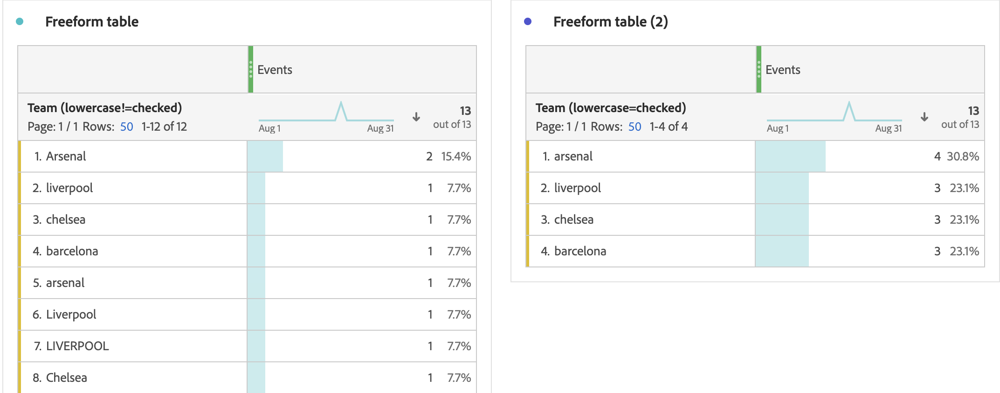

# Inställningar för beteendekomponent

Beteendeinställningar är tillgängliga för både mått och mått. Vilka inställningar som är tillgängliga beror på komponenttypen och schemadatatypen.

## Inställningar för Dimensionens beteende

| Inställning | Beskrivning |
| --- | --- |
| [!UICONTROL Lower case] | Raderar rader som har samma värde men olika skiftläge. Om det här alternativet är aktiverat rapporteras alla instanser av en dimension med samma värde som gemener. Dina data innehåller till exempel värdena `"liverpool"`, `"Liverpool"`och `"LIVERPOOL"` i en strängdimension. If [!UICONTROL Lower case] är aktiverat kombineras alla tre värdena till `"liverpool"`. Om det är inaktiverat behandlas alla tre värdena som distinkta. |

>[!NOTE]
>
>Om du aktiverar [!UICONTROL Lower case] på en sökdatauppsättningsdimension kan det finnas flera uppslagsvärden för samma identifierare. Om den här konflikten inträffar använder CJA det första ASCII-sorterade värdet (versalvärden före gemener). Adobe avråder från att använda uppslagsdatauppsättningar som innehåller samma värde när [!UICONTROL Lower case] är aktiverat.

## Inställningar för mätbeteende

| Inställning | Beskrivning/Använd skiftläge |
| --- | --- |
| [!UICONTROL Count values] | Synlig för datatyperna Integer och Double schema. Öka måttet med den angivna mängden. Ökar till exempel måttet med 50 om värdet för kolumnen är `50`. |
| [!UICONTROL Count instances] | Synlig för datatyperna Integer och Double schema. Öka måttet med ett, oavsett värde. Förekomsten av ett värde ökar mätvärdet. Ökar till exempel måttet med 1 om värdet för kolumnen är `50`. |
| [!UICONTROL Values to count] | Synlig för datatyperna Boolean-schema. Låter dig avgöra om mätvärdena ökar med räkning `true`, `false`eller båda. |

Du kan generera både ett ordervärde och ett intäktsmått i Analysis Workspace med samma kolumn för händelsedatamängd med olika beteenden. Dra datamängdskolumnen för &#39;Intäkter&#39; två gånger till datavyn och ställ in den ena på &#39;Antal värden&#39; och den andra på &#39;Antal instanser&#39;. Mätvärdena för Orders räknar instanser medan måttet Intäkter räknar.
