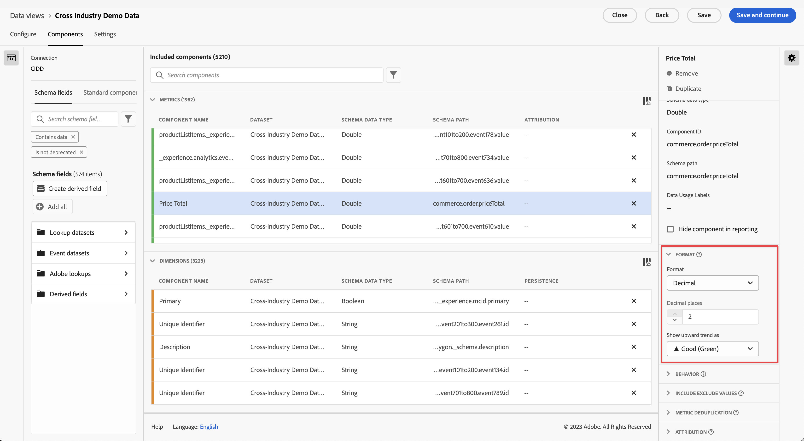

# Formatera komponentinställningar {#format-component-settings}

<!-- markdownlint-disable MD034 -->

>[!CONTEXTUALHELP]
>id="dataview_component_metric_format"
>title="Format"
>abstract="Avgör hur en komponent visas när den används i rapporter."

<!-- markdownlint-enable MD034 -->

Med Format kan du bestämma hur ett givet mätvärde ska visas när det används i rapporter.

## Konfigurera formatinställningar för ett mätvärde

Du kan bestämma hur ett givet mätresultat ska visas genom att justera dess formatinställningar.

1. I Customer Journey Analytics väljer du fliken [!UICONTROL **Datavyer**].

1. Markera datavyn som innehåller komponenten vars formatinställning du vill konfigurera.

1. Välj fliken [!UICONTROL **Komponenter**].

1. Markera den komponent som du vill konfigurera och expandera sedan avsnittet [!UICONTROL **Format**] till höger på sidan.

   

1. Ange följande information:

   | Inställning | Beskrivning |
   | --- | --- |
   | **[!UICONTROL Format]** | Här kan du ange formatering för ett mätresultat som Decimal, Time, Percent eller Currency. |
   | **[!UICONTROL Decimal]** | Visas inte i datatyperna för heltalsschemat. Här kan du ange hur många decimaler ett mätresultat ska visa. |
   | **[!UICONTROL Date]** | Här kan du bestämma hur du vill att datum- och tidsfältet ska visas när det används som en dimension i rapporter. [Läs mer](../../use-cases/data-views/data-views-usecases.md#date-and-date-time-use-cases) |
   | **[!UICONTROL Date-Time]** | Här kan du bestämma hur du vill att datum- och tidsfältet ska visas när det används som en dimension i rapporter. [Läs mer](../../use-cases/data-views/data-views-usecases.md#date-and-date-time-use-cases) |
   | **[!UICONTROL Currency]** | Här kan du bestämma vilken valuta som måttet ska visas i. 
Om du analyserar globala data där transaktioner förekommer i olika valutor, se [Använd valutakonvertering](#use-currency-conversion).
 |
   | **[!UICONTROL Show upward trend as]** | Här kan du ange om en uppåtgående trend för det här måttet är god (grön) eller dålig (röd). |
   | **[!UICONTROL True value]** och **[!UICONTROL False value]** | Endast synlig för datatyperna Boolean-schema. Gör att du kan anpassa dimensionsobjektetiketten för `true`- och `false`-värden. |

   {style="table-layout:auto"}

## Använd valutakonvertering {#use-currency-conversion}

<!-- markdownlint-disable MD034 -->

>[!CONTEXTUALHELP]
>id="dataview_component_metric_format_currencyconversion"
>title="Valutakonvertering"
>abstract="Välj en valutakoddimension för att konfigurera och visa valutan i en vald valutatyp."

<!-- markdownlint-enable MD034 -->

Valutaomvandling i Customer Journey Analytics kan vara mycket värdefullt för företag som är verksamma internationellt. Genom att eliminera komplexiteten i den manuella valutaomräkningen i Customer Journey Analytics kan man få enhetlighet och tydlighet i ekonomiska data. Valutakonverteringen håller reda på de dagliga historiska växelkurserna och bibehåller dessa dagskurser under en period på fyra år.

Om till exempel ett e-handelsföretag är verksamt i USA, Storbritannien och EU kan försäljningsdata automatiskt konverteras till USD, vilket gör det enkelt att jämföra och få en helhetsbild av resultatet.

>[!NOTE]
>
>Innan du börjar konfigurera ett mätvärde för valutakonvertering bör du tänka på följande:
>
>* Det mätvärde som du väljer för valutakonvertering måste ha en numerisk typ (Double, Long, Integer, Short, Byte).
>* Konfigurera din Customer Journey Analytics-anslutning så att den innehåller minst en händelsedatamängd som innehåller en valutakoddimension för varje händelse som innehåller ett valutamått. Den valutakoddimensionen använder en alfabetisk valutakod som överensstämmer med standarden [ISO 4217](https://www.iso.org/iso-4217-currency-codes.html) för att representera valutor. Dessa värden ska vara i versalformat, t.ex. USD för $, EUR för €, GBP för £.

Så här avgör du hur valutor visas och konverteras för ett givet mätvärde:

1. Börja konfigurera måttet som du vill använda valuta för som format, enligt beskrivningen ovan, i [Konfigurera formatinställningar för ett mått](#configure-format-settings-for-a-metric).

1. Markera måttet och gör följande val i avsnittet [!UICONTROL **Format**] till höger på sidan:

   * Välj [!UICONTROL **Valuta**] i fältet [!UICONTROL **Format**].

   * I fältet [!UICONTROL **Decimaler**] väljer du antalet decimaler som måttet ska visa.

     Det här alternativet är bara tillgängligt om måttet har en numerisk typ av Double.

   * Välj alternativet [!UICONTROL **Konvertera valuta**].

   * I fältet [!UICONTROL **Välj valutakoddimension**] väljer du den dimension som representerar valutan som du konverterar från (valutan som dina data baseras på). Välj till exempel en dimension med namnet [!UICONTROL **Valutakod**].

     Om du inte har någon dimension i ditt aktuella dataschema som innehåller ett valutakodfält kan du skapa ett nytt valutakodfält med [Dataprep](https://experienceleague.adobe.com/docs/experience-platform/data-prep/home.html), [Data Distiller](https://experienceleague.adobe.com/docs/experience-platform/query/data-distiller/overview.html) eller [Härledda fält](/help/data-views/derived-fields/derived-fields.md). Data Prep är endast lämpligt för nya implementeringar eftersom det bara är på framåtgående basis. Beroende på en organisations inställningar kan Data Distiller och härledda fält användas för att komma åt valutakodvärden historiskt.

   * I fältet [!UICONTROL **Konvertera och visa valuta i**] väljer du den valuta i vilken du vill att data ska konverteras.

1. Upprepa de här stegen om du vill tillämpa valutakonvertering på ytterligare mått.

### Vanliga frågor

+++ Hur genomförs valutakonvertering?

Vid rapporttiden konverteras värdet för måttet och den ursprungliga valutakoden till USD och konverteras sedan till den valuta som konfigurerats för visning. För denna konvertering används de dagliga valutakurserna som gäller vid tidpunkten för händelsen.

+++

