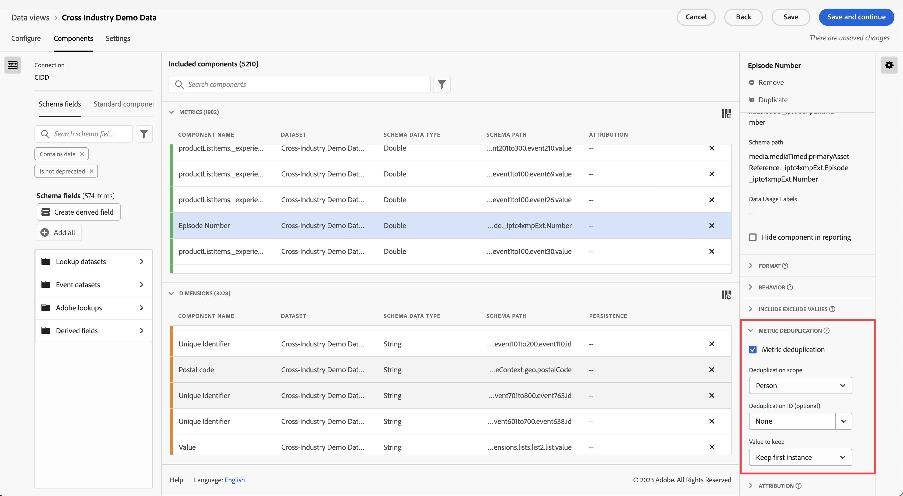

# Komponentinställningar för måttborttagning av dubbletter

Med metrisk borttagning av dubbletter kan du konfigurera ett mätvärde så att det bara räknar värden som inte upprepas.

| Inställning | Beskrivning |
| --- | --- |
| [!UICONTROL Metric deduplication] | En kryssruta där du kan aktivera metrisk deduplicering. Inaktiverad som standard. |
| [!UICONTROL Deduplication scope] | Här kan du bestämma hur långt bakåt den unika kontrollen ska gå. **Session**: Endast den första mätarförekomsten av sessionen räknas. **Person**: Endast den första mätförekomsten i rapporteringsfönstret räknas. |
| [!UICONTROL Deduplication ID] | I stället för att tillämpa borttagning av dubbletter på själva måttet kan du använda metrisk borttagning av dubbletter baserat på en dimension i stället. Värdefull för dimensioner som Inköp-ID för borttagning av dubbletter. |
| [!UICONTROL Value to keep] | <ul><li>**Behåll första instansen**: Använd detta i situationer där den första instansen av mätvärdet är den giltiga. Den vanligaste är förmodligen en inköpsbekräftelse. Även om någon av misstag läser in sidan igen och vi får en ny instans av en inköpsbekräftelse, är den första händelsen den giltiga.</li><li>**Behåll sista instansen**: Använd detta i situationer där den sista instansen är mer användbar att samla in. Exempel: Någon uppdaterar sin onlineprofil. Vi vill bara räkna en av dessa uppdateringar per session. De kan dock uppdatera sin profil flera gånger under sessionen. Om vi behåller den första instansen kan det finnas aktiviteter som inte är kopplade till evenemanget. I det här fallet är det bättre att behålla den sista förekomsten.</li></ul> |

{style="table-layout:auto"}

>[!CAUTION]
>
>Borttagning av dubbletter _person_ omfånget utvärderas av fullständiga månader i UTC-tid. Ett rapportfönster med delar av månaden kanske inte visar alla första eller sista instanser, om vissa inträffade under hela månaden men utanför rapportdatumen.
