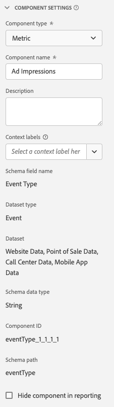

# Komponentinställningar {#component-settings}

<!-- markdownlint-disable MD034 -->

>[!CONTEXTUALHELP]
>id="dataview_component_settings"
>title="Komponentinställningar"
>abstract="Visa och konfigurera namn, beskrivning och andra inställningar för en komponent. Markera den här kryssrutan om du vill dölja den här komponenten för icke-adminanvändare vid rapportering. Administratörer kan fortfarande komma åt komponenten genom att välja **[!UICONTROL Show all components]** i ett Workspace-projekt."

<!-- markdownlint-enable MD034 -->

<!-- markdownlint-disable MD034 -->

>[!CONTEXTUALHELP]
>id="dataview_component_contextlabels"
>title="Sammanhangsetiketter"
>abstract="Om du tar bort en sammanhangsetikett kan det påverka specifika paneler eller rapporter där komponenten krävs."

<!-- markdownlint-enable MD034 -->

Följande information beskriver de inställningar som används av en datavykomponent.

| Inställning | Beskrivning/användningsfall |
| --- | --- |
| [!UICONTROL Component type] | Obligatoriskt. Gör att du kan ändra en komponent från Metric till Dimension eller tvärtom. Om du ändrar den här listrutan flyttas komponenten till respektive komponentområde. |
| [!UICONTROL Component name] | Obligatoriskt. Här kan du ange ett eget namn som visas i Analysis Workspace. Du kan byta namn på en komponent för att ge den ett namn som är specifikt för datavyn. |
| [!UICONTROL Description] | Valfritt, men rekommenderas. Ger information om komponenten till andra användare. |
| [!UICONTROL Tags] | Valfritt. Gör att du kan tagga komponenten med egna eller färdiga taggar för enklare sökning/filtrering i användargränssnittet i Analysis Workspace. |
| [!UICONTROL Context labels] | Valfritt. En nedrullningsbar meny med tillgängliga systemdefinierade [kontextetiketter](#context-labels) som kan tillämpas på en komponent. |
| [!UICONTROL Schema field name] | Schemafältets namn. |
| [!UICONTROL Dataset type] | Obligatoriskt. Ett icke-redigerbart fält som visar vilken datamängdstyp (händelse, sökning eller profil) som komponenten kommer från. |
| [!UICONTROL Dataset] | Ett icke-redigerbart fält som visar vilken datamängd som komponenten kommer från. Det här fältet kan innehålla flera datauppsättningar. |
| [!UICONTROL Schema type] | Ett icke redigerbart fält som visar komponentens datatyp. Även om du kan använda en schemafälttyp som stöds i Platform, stöds inte alla fälttyper i Customer Journey Analytics. Följande datatyper stöds: `Integer`, `Int`, `Long`, `Double`, `Float`, `Number`, `Short`, `Byte`, `String` och `Boolean`. Endast schemadatatypen `String` är tillåten i uppslagsuppsättningar för sökdata. |
| [!UICONTROL Component ID] | Obligatoriskt. [Customer Journey Analytics API](https://www.adobe.io/cja-apis/docs) använder det här fältet för att referera till komponenten. Varje komponent i en datavy måste vara unik. Adobe genererar automatiskt ett ID för varje komponent, men du kan klicka på redigeringsikonen och ändra komponent-ID:t. Om du ändrar komponent-ID:t bryts alla befintliga Workspace-projekt som innehåller den här komponenten. Även om varje komponent behöver ett unikt ID i en enda datavy, kan du använda samma komponent-ID i andra datavyer. Om du använder samma komponent-ID i andra datavyer kan du göra Workspace-projekt kompatibla över datavyer.  För profil- och sökbaserade komponenter har komponent-ID ett ID-prefix baserat på datauppsättnings-ID (till exempel: `642b28fcc1f0ee1c074265a0.person.name.firstName`). När du vill återanvända en profil- eller uppslagsbaserad komponent, som `person.name.firstName`, i ditt Workspace-projekt och konfigurera den här komponenten i olika datavyer måste du se till att du byter namn på komponent-ID:t unikt (till exempel: `myUniqueID.person.name.firstName`) i alla datavyer. |
| [!UICONTROL Path] | Obligatoriskt. Ett icke-redigerbart fält som visar den schemasökväg som komponenten kommer från. |
| [!UICONTROL Data Usage Labels] | Alla dataanvändningsetiketter som har tilldelats den här komponenten i Adobe Experience Platform. [Läs mer](/help/data-views/data-governance.md). |
| [!UICONTROL Hide component in reporting] | Gör att du kan strukturera ut komponenten ur datavyn för icke-administratörer. Administratörer kan fortfarande komma åt den genom att klicka på [!UICONTROL Show All Components] i ett Analysis Workspace-projekt. |

{style="table-layout:auto"}

>[!BEGINSHADEBOX]

Se  [Komponenttypsinställningar](https://video.tv.adobe.com/v/333112/?quality=12&learn=on){target="_blank"} för en demonstrationsvideo.

>[!ENDSHADEBOX]

## Sammanhangsetiketter

Kontextetiketter är systemdefinierade taggar som används på komponenter i en datavy. När kontextetiketter används på komponenter (mått eller mätvärden) instrueras Customer Journey Analytics att använda dessa kontextmärkta komponenter automatiskt i vissa visualiseringar eller funktioner.

Med kontextetiketter kan du skapa semantiska kontexter för enskilda datadelar.  I allmänhet behöver Customer Journey Analytics inte känna till den semantiska innebörden av en dimension eller ett mått för att kunna utföra sin analys.  I vissa situationer (projektmallar och ett fåtal utvalda visualiseringar) måste Customer Journey Analytics förstå semantisk betydelse för att kunna utföra någon typ av analys. Kontextetiketter skapas för dessa situationer.

Kontextetiketter fungerar på komponentnivå (mått eller mätnivå) och ger stor flexibilitet i kundens datavy. Du kan till exempel tilldela en sammanhangsetikett till en dimension efter att du har tillämpat flera efterbearbetningsomformningar på ett fält. Eller till och med en dimension som är baserad på ett härlett fält.  Kontextetiketter innehåller ett lager abstraktion ovanpå komponenter och fält.

Av praktiska skäl används smarta standardetiketter automatiskt på komponenter som baseras på fält med en viss XDM-sökväg. Kontextetiketten **[!UICONTROL Commerce: Product Category]** används till exempel automatiskt på en **[!UICONTROL Category name]**-dimension som baseras på schemasökvägen för `productListItems.productCategories.categoryName`. Du kan emellertid flytta sammanhangsetiketten till en annan komponent utan problem.

För att effektivisera projektmallar som tillhandahålls av Adobe kan flera integreringar (som Journey Optimizer, Content Analytics med flera) ställa in datavyer där komponenter från kartongen konstrueras på ett specifikt sätt. Och lämpliga sammanhangsetiketter används automatiskt. Återigen kan du helt enkelt flytta någon av de här sammanhangsetiketterna till andra komponenter som skapas i datavyn och i stället använda den anpassade komponenten.

Kontextetiketter är också relevanta för att visa upp projektmallar. Projektmallar bygger snabbt upp rapporteringsgrunden för flera olika syften. Alla mallar är dock inte bra för alla datavyer och du vill inte visa mallar som inte är tillämpliga. Kontextetiketter används för att visa mallar baserat på om kontextetiketter inkluderas i den valda datavyn.  Du kan enkelt lägga till fler kontextetiketter i datavyn (komponenter) och fler mallar blir tillgängliga. Eller ta bort sammanhangsetiketter för att dölja specifika mallar.

>[!NOTE]
>
>Du kan använda mer än en kontextetikett för en komponent, men du kan inte använda en kontextetikett för flera komponenter i en datavy.
>

Fördelarna med sammanhangsetiketter är:

* **Praktisk**: Du behöver inte markera om samma komponent på alla paneler eller visualiseringar.
* **Lås upp funktionalitet**: Vissa visualiseringar (som [Karta](/help/analysis-workspace/visualizations/map.md)) kräver kunskap om vilken komponent som är latitud och longitud. När du tilldelar kontextetiketter visas den informationen för visualiseringen.
* **Konsekvens**: Alla i organisationen som arbetar med ett eller flera projekt som är baserade på en datavy som använder kontextetiketter får samma beteende.
* **Synlighet för funktioner och mallar**: Vissa visualiseringar och funktioner visas bara när rätt kontextetikett har tilldelats. Exempel:

   * En [karta](/help/analysis-workspace/visualizations/map.md)-visualisering visas bara korrekt när Customer Journey Analytics vet vilka komponenter som representerar latitud och longitud.
   * Specifika [mallar](/help/analysis-workspace/templates/use-templates.md) visas bara när rätt kontextetiketter används och de associerade komponenterna blir tillgängliga.

Kontextetiketter kan behövas i följande situationer:

* Om du vill definiera en uppsättning komponenter kan du använda i experimentrapporter med hjälp av [panelen Experimentation](/help/analysis-workspace/c-panels/experimentation.md) i Analysis Workspace-projekt.

  Mer information finns i [Integrera med Journey Optimizer](/help/integrations/ajo.md#data-view) och [Målrapportering](/help/integrations/at.md).

* Om du vill definiera en uppsättning komponenter kan du använda i [kartvyn](/help/analysis-workspace/visualizations/map.md) i Analysis Workspace-projekt.

  Mer information finns i [Lägg till kontextetiketter i datavyer](/help/analysis-workspace/visualizations/map.md#add-context-labels-in-data-views) i [Karta](/help/analysis-workspace/visualizations/map.md).

  **Obs!** Kartvyn är i den begränsade testfasen av versionen och är kanske inte tillgänglig än i din miljö.

* Om du vill visa [mallar från Adobe](/help/analysis-workspace/templates/use-templates.md). Vissa mallar från Adobe kanske inte fungerar eftersom vissa komponenter inte finns i datavyn.

  För varje komponent som saknas finns en matchande sammanhangsetikett tillgänglig i datavyn. Du måste antingen lägga till den matchande kontextetiketten i en komponent som redan finns i datavyn. Eller så måste du lägga till en ny komponent i datavyn och lägga till kontextetiketten till komponenten (om den inte redan har angetts automatiskt).

  Mer information finns i [Lägga till saknade komponenter i datavyn för en viss mall](/help/analysis-workspace/templates/create-templates.md#add-missing-components-to-the-data-view-for-a-given-template) i artikeln [Skapa och hantera mallar](/help/analysis-workspace/templates/create-templates.md).

Följande grupper med sammanhangsetiketter är tillgängliga, var och en med en lista med specifika sammanhangsetiketter.

+++ Campaign

| Namn | Beskrivning |
|------|-------------|
| Spårningskod | Spårningskod. |
| Spåra kodinstanser | Spåra kodinstanser. |

+++

+++ Commerce

| Namn | Beskrivning |
|------|-------------|
| Cart Additions | Cart Additions |
| Cart Open | Kundvagnen öppnas. |
| Cart Removals | Cart Removals |
| Vyer | Vyer |
| Utcheckningar | Utcheckningar. |
| Beställningar | Beställningar. |
| Produkt | Produkt. |
| Produktkategori | Produktkategori. |
| Produktvyer | Produktvyer. |
| Intäkter | Intäkter. |
| Butik | Lagra. |
| Enheter | Enheter. |

+++

+++ Experimentation

| Namn | Beskrivning |
|------|-------------|
| Experimentationsexperiment | Ett experiment är en uppsättning variationer av en upplevelse som exponerats för slutanvändarna för att avgöra vilken som är bäst att behålla för all framtid. |
| Experimentationsvariant | Variant är en av två eller flera ändringar i en slutanvändares upplevelse som jämförs i syfte att identifiera det bättre alternativet. |

+++

+++ Media

| Namn | Beskrivning |
|------|-------------|
| Innehålls-ID | Innehålls-ID. |
| Innehållstid | Innehållstid som använts. |
| Episod | Episod. |
| Händelsetyp | Typ av händelse. |
| Medietid tillagd | Medietid tillagd. |
| Säsong | Säsong. |
| Sekunder sedan senaste samtal | Sekunder sedan senaste samtal. |
| Visa | Visa. |
| Tid att starta | Dags att börja. |
| Buffertvaraktighet totalt | Buffertvaraktighet totalt. |
| Total pausvaraktighet | Total pausvaraktighet. |
| Videolängd | Videolängd. |
| Videonamn | Videonamn. |

+++

+++ Call Center

| Namn | Beskrivning |
|------|-------------|
| Namn på samtalscenter | Namn på samtalscenter. |
| Samtalskostnader | Samtalskostnader. |
| Samtalstimmar | Samtalstimmar. |
| Samtalslängd | Samtalslängd. |
| Anledning till samtalet | Anledning till samtalet. |
| Samtalsrapport - poäng | Samla enkätresultat. |
| Samtal | Samtal. |

+++

+++ Demografisk

| Namn | Beskrivning |
|------|-------------|
| Kön | Kön. |

+++

+++ Miljö

| Namn | Beskrivning |
|------|-------------|
| Webbläsare | Webbläsare. |
| Typ av webbläsare | Typ av webbläsare. |
| Språk | Språk. |
| Operativsystem | Operativsystem. |
| Operativsystemgrupp | Operativsystemgrupp. |
| Operativsystemets namn | Operativsystemets namn. |

+++

+++ Allmänt

| Namn | Beskrivning |
|------|-------------|
| Åtgärdsnamn | Åtgärdsnamn. |
| Åtgärder | Åtgärder. |
| Interaktionskanal | Interaktionskanal. |

+++

+++ Geo

| Namn | Beskrivning |
|------|-------------|
| Geo City | Geo City. |
| Geo-land | Geo land. |
| Geo Dma | Geo dma. |
| Georegion | Geo. |
| Latitude | Latitude. |
| Longitud | Longitud. |
| Intressepunkt | Intressepunkt. |
| Läge | Delstat. |

+++

+++ Marknadsföringskanal

| Namn | Beskrivning |
|------|-------------|
| Första beröringskanalen | Första beröringskanalen. |
| Första beröringskanaldetalj | Första beröringskanaldetalj. |
| Senaste beröringskanal | Sista beröringskanalen. |
| Senaste beröringskanaldetalj | Senaste beröringskanaldetalj. |
| Marknadsföringskanal | Marknadsföringskanal. |

+++

+++ Mobil

| Namn | Beskrivning |
|------|-------------|
| Program-ID | Program-ID. |
| Mobiloperatör | Mobiloperatör. |
| Krascher i mobilen | Mobilt kraschar. |
| Namn på mobil enhet | Namn på mobil enhet. |
| Typ av mobil enhet | Typ av mobil enhet. |
| Meddelandenamn för mobil i app | Meddelandenamn för mobilen i appen. |
| Mobilinstallationer | Mobilinstallationer. |
| Mobillanseringar | Mobillanseringar. |
| Mobiltillverkare | Mobiltillverkare. |
| Mobilmeddelande avbryts | Mobilmeddelandet avbryts. |
| Mobilmeddelandeklickningar | Klicka på mobilmeddelanden. |
| Impressions för mobilmeddelanden | Mobilmeddelanden. |
| Push-anmälan för mobilmeddelande | Push-deltagande för mobilmeddelanden. |
| Namn på mobilpush-meddelande | Namn på push-meddelande för mobil. |
| Mobiluppgraderingar | Mobila uppgraderingar. |
| Tidsåtgång per åtgärd | Tidsåtgång per åtgärd. |

+++

+++ Sök

| Namn | Beskrivning |
|------|-------------|
| Sökmotor | Sökmotor. |
| Sökmotornyckelord | Sökmotornyckelord. |
| Naturlig sökmotor | Sökmotorn är naturlig. |
| Naturligt nyckelord för sökmotor | Naturliga nyckelord för sökmotor. |
| Sökmotor betald | Sökmotorn har betalat. |
| Nyckelord för betald sökmotor | Sökmotorn betalade nyckelord. |

+++

+++ Undersökning

| Namn | Beskrivning |
|------|-------------|
| Undersökning | Undersökning. |
| Svar på enkät | Undersökningssvar. |
| Enkäten har slutförts | Undersökningen är klar. |
| Undersökningsfråga | Undersökningsfråga. |
| Undersökningsstart | Undersökningen börjar. |

+++

+++ Webb

| Namn | Beskrivning |
|------|-------------|
| Genomsnittlig sidtid | Genomsnittlig sidtid. |
| Studsar | studsar. |
| Inmatningssida | Startsida. |
| Avsluta sidan | Avsluta sidan. |
| Sida | Sida. |
| Sidvisningar | Sidvyer. |
| Referent | Referent. |
| Referenstyp | Referenstyp. |
| Refererande domän | Refererande domän. |
| Refererande domänoriginal | Domänoriginalet refereras. |
| Läs in igen | Läs in igen. |
| Besök på en sida | Besök enstaka sidor. |
| Platsavsnitt | Webbplatsavsnitt. |

+++

+++ B2B

| Namn | Beskrivning |
|------|-------------|
| Kontonamn | Kontonamn. |
| Namn på inköpsgrupp | Köpgruppens namn |
| Affärsmöjlighetens namn | Affärsmöjlighetens namn |

+++

+++ Content Analytics

| Namn | Beskrivning |
|------|-------------|
| Resurs - absolut vänster | Tillgång absolut vänster. |
| Tillgång absolut överkant | Tillgång absolut överkant. |
| Resursattribut | Resursattribut. |
| Bakgrundsfärger för resurs | Bakgrundsfärger för resurs. |
| Placering av kameran | Placering av kameran. |
| Kameranärhet för tillgångar | Kameraproximiteter för tillgångar. |
| Inställningar för resurskamera | Inställningar för resurskamera. |
| Resursklickningar | Resursklickningar. |
| Resurs skapad av | Resurs skapad av. |
| Skapad resurs | Skapad resurs.e |
| Resursvisningshöjd | Skärmhöjd för resurs. |
| Resursens visningsbredd | Resursens visningsbredd. |
| Förgrundsfärger för resurs | Resursförgrundsfärger. |
| Tillgångs-ID | Resurs-ID. |
| Typer av tillgångsbilder | Resursbildtyper. |
| Resursen uppdaterades senast av | Resursen uppdaterades senast. |
| Senast uppdaterad | Senast uppdaterat datum för resurs. |
| Ljusvillkor för resurs | Ljusvillkor för resurser. |
| Resurslänk-URL | Resurslänk-URL. |
| Resursnamn | Resursnamn. |
| Kategorier för tillgångsanvändare | Kategorier för tillgångsanvändare. |
| Identifierings-ID för resurs | Unik identifierare för resurser som i princip är desamma. |
| Resursfotostilar | Resursfotostilar. |
| Resursscener | Resursscener. |
| Resurs-Source | Asset Source. |
| Resurstaggar | Resurstaggar. |
| Resurstyp | Resurstyp. |
| Resursvyer | Resursvyer. |
| Spridning av visuell uppmärksamhet för resurs | Resursens visuella Attention-spridning. |
| Resursens visuella innehållstäthet | Resursens visuella innehållstäthet. |
| Experience Attributes | Upplevelseattribut. |
| Experience channel | Experience Channel. |
| Experience Clicks | Experience Clicks. |
| Experience Emoji Count | Upplev Emoji Count. |
| Antal Hashtag | Upplev Hashtag Count. |
| Vågrätt procentdjup | Upplev vågrätt procentdjup. |
| Upplevelsenyckelord | Upplev nyckelord. |
| Experience Marketing Eures | Experience Marketing Eures. |
| Upplev berättelser | Upplev berättelser. |
| Experience Persucrap Strategies | Experience Persucrap Strategies. |
| Antal ord per mening för läsbarhet av upplevelse | Upplev hur läsbart ordantal per mening. |
| Upplevelseläsbarhetspoäng | Upplev läsbarhetspoäng. |
| Antal meningar för upplevelseläsbarhet | Upplev hur läsbar meningar är. |
| Antal stoppord för Experience Readability | Upplev läsbarhet, antal stoppord. |
| Antal textofferter för Experience Readability | Upplev läsbarhet - antal textcitattecken. |
| Antal läsbara ord | Upplev läsbarhet - Word Count. |
| Upplev Source | Upplev Source. |
| Upplevelsetoner | Upplev toner. |
| Upplev vertikalt procentdjup | Upplev vertikalt procentdjup. |
| Experience Views | Experience Views. |

+++

+++ Journey Optimizer

| Namn | Beskrivning |
|------|-------------|
| Åtgärdsfel (AJO) | Antal fel som genererats av reseåtgärder. |
| Fel vid körning av åtgärd | Feltillstånd som förhindrade att körtidsmiljön för resan kunde köra åtgärden. |
| Åtgärdsetikett (AJO) | Kundens genererade visningsnamn för elementet som slutanvändaren interagerade med. |
| Alternativa avslut (AJO) | Antal utgångar som inte inträffade på grund av att en profil nådde en slutnod eller misslyckades på grund av ett fel. |
| Appinstallationer (AJO) | Antal programinstallationer. |
| Applanseringar (AJO) | Antal gånger en mobilapp startas. |
| Batch-ID (AJO) | GUID som skapas vid anrop av varje ny batchinstans för en schemalagd resa eller kampanjåtgärd. Exempel: Om en schemalagd resa eller en kampanjåtgärd körs på 08.00 och 01.00 finns det två olika batchInstanceID:n. |
| Tidsstämpel för batchinstans (AJO) | Tidsstämpeln för batchinstansen. |
| studsar för utgående kanaler (borttagna) | Det totala antalet meddelanden som studsas över utgående kanaler. |
| Namn på kampanjåtgärd (AJO) | Namnet på kampanjåtgärden. |
| Kampanj-ID (AJO) | Kampanjens ID. |
| Kampanjnamn (AJO) | Namnet på kampanjen. |
| Kampanjversion-ID (AJO) | Kampanjens version-ID. |
| Kanal | Den kanal som dessa data ska korreleras till. |
| Klicka (AJO) | Totalt antal klick i alla kanaler. |
| Policyavslag (AJO) | Antal reseåtgärder som har avvisats på grund av en eller flera medgivandeprinciper. |
| Fel i innehållsbeslut (AJO) | Felmeddelanden som genereras av noder för innehållsbeslut för resan. |
| Fel i innehållsbeslut (AJO) | Antal fel som genererats av noder för innehållsbeslut för resan. |
| Nodnamn för innehållsbeslut (AJO) | Nodnamnet för innehållsbeslut för resan. |
| Korrelations-ID | Korrelations-ID. |
| Antal erbjudanden (AJO) | Antalet erbjudandeartiklar i förslaget. |
| Bindningsnyckel för beslutsobjekt | En sammansatt identifierare som kombinerar artikel-ID med begäran-ID för Experience Decisioning, vilket möjliggör databeständighet mellan interaktioner. |
| Beslutsleverantör (AJO) | Leverantören som ombads att fatta beslutet. Den här dimensionen används när flera tjänster kan fatta beslut för samma placering eller aktivitet. |
| Beslutsleverantör (beständig) (AJO) | Beslutsprovidern med beständig bindning aktiverad. |
| ID för beslutspolicy (AJO) | ID för beslutspolicyn som används vid beslut om vilka poster som ska tas med i förslaget. |
| Dedupliceringsmått (AJO) | Dedup Metric. |
| Levererat (borttaget) | Totalt antal meddelanden som levererats. |
| Skärmar (AJO) | Det här antalet visar AJO-meddelanden. Det här antalet inkluderar e-postöppningar, webbvisningar och visning i appen. Mobilplattformar rapporterar inte SMS och push-meddelanden, och därför räknas de inte. |
| Avvisad (AJO) | Räknas varje gång inApp-meddelandet stängs av Adobe SDK, oavsett vilken åtgärd slutanvändaren väljer att stänga det. |
| Körnings-ID för torr (AJO) | Unik identifierare för torr körning. |
| E-postroboten öppnas (AJO) | Totalt antal e-postöppningar som gjorts av bots. |
| E-post öppnas (AJO) | Totalt antal e-postöppningar. |
| E-postmottagardomän (AJO) | Domän för e-postadress. |
| E-postämne | Ämne för e-post, icke-personaliserat. |
| Händelse-ID | En unik identifierare för tidsseriehändelsen. |
| ID för avslutningsvillkor (AJO) | ID för de utträdeskriterier som används för att avgöra om resan ska avslutas. |
| Namn på avslutsvillkor (AJO) | Namn på avslutningskriterier. |
| Experiment-ID (AJO) | ID:t för experimentet. |
| Experimentnamn (AJO) | Namnet på experimentet. |
| Antal erbjudanden i reserv (AJO) | Antalet reserverbjudanden. |
| Hämtningsfel | Feltillstånd som förhindrade att hämtningen kördes av körningsmiljön. |
| Inkommande klick (AJO) | Totalt antal klick i inkommande kanaler. |
| Inkommande avstängningar (AJO) | Totalt antal ignorerade kanaler. |
| Inkommande Impressions (AJO) | Totalt antal visningar över inkommande kanaler. |
| Inkommande sändningar (AJO) | Totalt antal utskick över inkommande kanaler. |
| Inkommande utlöst (AJO) | Propositionen valdes för visning av Adobe SDK. Andra faktorer kan förhindra att den faktiskt visas. |
| Är optimerad för överföring (AJO) | Är meddelandekörningen SendTimeOptimized? |
| Är testresa | Är händelsen en del av en testresa? |
| Är testmeddelande (AJO) | Skickas meddelande som testkörning? |
| Artikel-ID (beständig) (AJO) | ID för objektet med beständig bindning aktiverad. |
| Objekt-ID (AJO) | Objektets ID. |
| Objektnamn (AJO) | Namnet på objektet. |
| Objektnamn (beständig) (AJO) | Namnet på objektet med beständig bindning aktiverad. |
| Fel i reseåtgärd (AJO) | Felmeddelanden som genereras av reseåtgärder. |
| Nodnamn för reseåtgärd | Nodnamnet för reseåtgärden. |
| Resebidrag | True if the step event was a travel entrance event for a profile. |
| Reseslut (AJO) | Slutet på resan. |
| Namn på nod för resehändelse | Det här värdet anges när ett segment eller en extern händelse inträffar under en resa. |
| Orsak till reseundantag | Orsak till undantag av reseinstans. |
| Namn på regel för reseundantag | Namnet på den regel som orsakade nekandet av reseanmälan. |
| Reseundantag (AJO) | Ange om händelsen för det aktuella steget resulterade i att en profil ignoreras för en resa. Detta inträffar oftast på grund av att regler för begränsning eller samtidighet tillämpas, vilket förhindrar ytterligare framsteg i resan. |
| Typ av avresa (AJO) | Typen av utförsel som inträffade för reseinstansen. |
| Resefel | Ger det aktuella läget för steget som har slutförts. |
| Rese-ID | ID för resan. |
| Resensnamn | Namnet på resan. |
| Resenamn och version | Namnet på och versionen av resan. |
| Reseversions-ID | Resans version-ID. |
| JourneyExits | True om det aktuella steget ledde till att en instans av resan avslutades. Detta är det sista steget i en resa för en viss profil som utfördes utan fel. |
| Konverteringar av landningssidor (AJO) | Totalt antal konverteringar på landningssidan. |
| ID för landningssida (AJO) | Unik identifierare för landningssida. |
| Landningssida Source (AJO) | Startsidans källa. |
| Landing Page Views (AJO) | Totalt antal visningar på landningssidan. |
| Klickningar på landningssida (AJO) | Totalt antal klick på landningssidan. |
| Länk-URL (AJO) | Den URL som användaren klickade på. |
| Anledning till meddelandeavslut (AJO) | Orsaken till att meddelandet studsade. |
| Orsak till meddelandefel (AJO) | Orsaken till meddelandefelet. |
| Orsak till uteslutning av meddelande (AJO) | Uteslutningsorsak. |
| Meddelandefelkategori (AJO) | Felkategori . |
| Orsak till meddelandefel (AJO) | Felorsak. |
| Meddelandefelstyp (AJO) | Feltyp. |
| Meddelande-ID (AJO) | Det meddelande-ID som dessa data ska korreleras till. |
| Meddelandespråk (AJO) | Meddelandets språk. |
| Meddelandenamn (AJO) | Meddelandets namn. |
| Försök igen (AJO) | Antal nya försök. |
| Meddelandestatus (AJO) | Meddelandestatus (t.ex. skickat, studsat, fel) |
| Meddelandetyp (AJO) | Huruvida budskapet är marknadsföring eller transaktion. |
| Status för meddelandefeedback (borttagen) | Feedback-status. |
| Node Enters | True if the step event was a node entrance event for a profile. |
| Nod-ID | Nod-ID för kundnoden. |
| Nodnamn | Nodnamnet för kundnoden. |
| Nodtyp | Nodtypen för kundnoden. |
| Orchestrated Campaign Action Identity Namespace (AJO) | Identitetsnamnområdet för den orkestrerade kampanjåtgärden. |
| Namn på samordnade kampanjåtgärder (AJO) | Åtgärdsnamnet för den samordnade kampanjen. |
| Orchestrated Campaign Action Node ID (AJO) | Åtgärds-ID för den samordnade kampanjen. |
| Orchestrated Campaign ID (AJO) | ID för den samordnade kampanjen. |
| Orchestrated Campaign Name (AJO) | Namnet på den orkestrerade kampanjen. |
| Version-ID för orkestrerad kampanj (AJO) | Versions-ID för den orkestrerade kampanjen. |
| Utgående klick (AJO) | Totalt antal klick i utgående kanaler. |
| Utgående fel (inaktuellt) | Totalt antal meddelanden med fel i utgående kanaler. |
| Utgående undantag (inaktuellt) | Totalt antal uteslutningshändelser över utgående kanaler. |
| Utgående sändningar (utgått) | Totalt antal meddelanden som skickats över utgående kanaler. |
| Intressepunkt | Intressepunkt. |
| Proposition-ID (AJO) | ID för förslaget. |
| Push Custom Actions (AJO) | Totalt antal anpassade åtgärder i push-interaktion. |
| Push-interaktioner (AJO) | Antal gånger en mobilapp startas på grund av en direkt push-meddelandeinteraktion. |
| Push Platform (AJO) | Push-providertjänst, till exempel APNS eller FCM. |
| Push-titel | Push Title, ej personaliserad. |
| ID för rankningsstrategi (AJO) | ID för rankningsstrategi. |
| Principnamn för avvisat samtycke | Namn på motsvarande princip för avvisat samtycke. |
| Antal nya försök (AJO) | Antal gånger som ett meddelande har skickats på nytt innan det lyckades eller misslyckades. |
| Regelnamn | Namnet på den regel som orsakade nekandet av reseanmälan. |
| Markeringstyp (AJO) | Detta är den typ av val som används när en artikel härleds som en del av ett beslut. |
| Skickar (inaktuellt) | Totalt antal meddelanden som skickats över alla kanaler. |
| SMS inkommande meddelande (AJO) | SMS inkommande svar, till exempel stopp, start, prenumeration osv. |
| SMS inkommande meddelanden (AJO) | SMS inkommande svar, t.ex. stopp, start, prenumeration osv. |
| SMS-meddelandetyp (AJO) | SMS-provider, till exempel inkommande, inkommande svar eller send. |
| SMS-provider (AJO) | SMS-provider, till exempel Sinch eller Twilio. |
| Spam Complaint (AJO) | Totalt antal skräppostklagomål. |
| Strateginamn (AJO) | Strateginamn. Strateginamnet som artikeln härleds från. |
| Strateginamn (beständig) (AJO) | Strateginamnet med beständig bindning aktiverad. |
| Prenumerationslista - tillägg (AJO) | Totalt antal tillägg i en prenumerationslista. |
| Prenumerationslista-ID (AJO) | Unik identifierare för prenumerationslista. |
| Prenumerationslista tas bort (AJO) | Totalt antal borttagningar från en prenumerationslista. |
| Yta (AJO) | Kanalytan som meddelandet visades på. |
| Målinriktad (utgått) | Detta antal gånger ett förslag har riktats till en person. Detta är det antal gånger ett förslag övervägdes för visning till en person. |
| Målregelnamn (AJO) | Målregelns namn. |
| Testhändelse (AJO) | Testhändelse. |
| Tid att starta | Dags att börja. |
| Buffertvaraktighet totalt | Buffertvaraktighet totalt. |
| Total pausvaraktighet | Total pausvaraktighet. |
| Trafiktyp (AJO) | Typ av rankningstrafik. |
| Bearbetnings-ID (AJO) | ID för vald behandling för experimentet. |
| Behandlingsnamn (AJO) | Namnet på behandlingen för experimentet. |
| Unika besökare i expertvyn (AJO) | De unika besökarna i experimentet. |
| Avbeställ (AJO) | Totalt antal avbeställningar. |
| URL-etikett (AJO) | Etikett för personlig URL. |
| URL-ID (AJO) | Unik identifierare för den URL som användaren klickade på. |

+++
