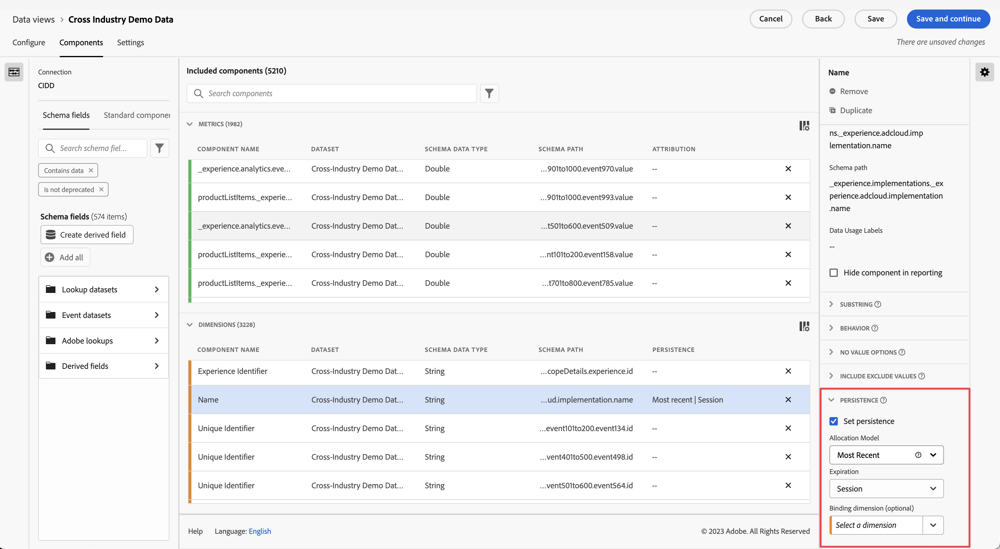

# [!UICONTROL Persistence] komponentinställningar {#persistence-component-settings}

<!-- markdownlint-disable MD034 -->

>[!CONTEXTUALHELP]
>id="dataview_component_dimension_persistence"
>title="Persistence"
>abstract="Konfigurera standardallokeringsmodellen som används för en dimension. Allokering gäller före segment i rapportering."

<!-- markdownlint-enable MD034 -->

[!UICONTROL Persistence] är möjligheten för ett givet dimensionsvärde att attribut till ett mätvärde efter händelsen som det är inställt på. Den använder en kombination av allokering och förfallodatum.

* Med **Allokering** kan du avgöra vilket värde som ska behållas när mer än ett dimensionsobjekt kan finnas i taget i en enda kolumn.

  >[!NOTE]
  >
  >Om du har en [icke-standardattribueringsmodell](/help/data-views/component-settings/attribution.md) angiven för ett mätvärde i en rapport, ignorerar attribueringsmodellen den allokering du har angett för dimensionen för samma rapport.
  >
  >När du gör en [fullständig tabellexport](/help/analysis-workspace/export/export-cloud.md) som innehåller flera dimensioner, behåller attribueringen de allokeringsmodeller som används för varje dimension.

* Med **Förfallotid** kan du bestämma hur länge ett dimensionsobjekt kvarstår efter den händelse det är inställt på.

[!UICONTROL Persistence] är bara tillgänglig i dimensioner och är retroaktiv för de data som används för den. Det är en omedelbar dataomvandling som sker innan segmentering eller andra analysåtgärder tillämpas.

| Inställning | Beskrivning |
| --- | --- |
| [!UICONTROL Set persistence] | Aktivera beständighet för dimensionen. Om persistence inte är aktiverat, relaterar dimensionen endast till mått som finns i samma händelse. Den här inställningen är inaktiverad som standard. |
| [!UICONTROL Allocation] | Ange allokeringsmodellen som används för en dimension för beständighet. Alternativ:<ul><li>**[!UICONTROL Most recent]**: Värdena i dimensionen behålls tills de skrivs över av efterföljande värden</li><li> **[!UICONTROL Original]**: Det första värdet för den här dimensionen kvarstår och skrivs inte över av efterföljande värden</li><li>**[!UICONTROL All]**: Alla värden för den här dimensionen behålls samtidigt</li><li>**[!UICONTROL First known]**: Det första värdet för den här dimensionen används och kommer att tillämpas på alla händelser före och efter.</li><li>**[!UICONTROL Last known]**: Det sista värdet för den här dimensionen används och kommer att tillämpas på alla händelser före och efter.</li></ul> |
| [!UICONTROL Expiration] | Ange det beständiga fönstret för en dimension. Alternativ: <ul><li>**[!UICONTROL Session]** (standard)</li><li>**[!UICONTROL Person]**</li><li>**[!UICONTROL Custom Time]**</li><li>**[!UICONTROL Metric]**</li></ul>. Du kanske måste kunna förfalla dimensionen på ett köp (till exempel interna sökvillkor eller andra användningsfall för varuexponering). Den maximala förfallotiden som du kan ange är 90 dagar. Om du väljer en allokering av [!UICONTROL All] är bara [!UICONTROL Session] eller [!UICONTROL Person] förfallodatum tillgängliga. |

{style="table-layout:auto"}

## Inställningar för [!UICONTROL Allocation]

De tillgängliga allokeringsinställningarna är:

* **[!UICONTROL Most Recent]**: Bevarar det senaste (med tidsstämpel) värdet i dimensionen. Eventuella efterföljande värden som inträffar inom dimensionens förfalloperiod ersätter det tidigare beständiga värdet. Om Behandla &#39;Inget värde&#39; som ett värde&#39; är aktiverat för den här dimensionen under [Inga värdealternativ](no-value-options.md), skriver tomma värden över tidigare beständiga värden. Ta till exempel följande tabell med [!UICONTROL Most recent]-allokering och [!UICONTROL Session]-förfallodatum:

  | Dimension | Träff 1 | Träff 2 | Träff 3 | Träff 4 | Träff 5 |
  | --- | --- | --- | --- | --- | --- |
  | Datamängdsvärden |  | C | B |  | A |
  | Senaste allokering |  | C | B | B | A |

* **[!UICONTROL Original]**: Visar det ursprungliga värdet med en tidsstämpel som finns i dimensionen under förfalloperiodens varaktighet. Om den här dimensionen har ett värde skrivs den inte över när ett annat värde visas i en efterföljande händelse. Ta till exempel följande tabell med [!UICONTROL Original]-allokering och [!UICONTROL Session]-förfallodatum:

  | Dimension | Träff 1 | Träff 2 | Träff 3 | Träff 4 | Träff 5 |
  | --- | --- | --- | --- | --- | --- |
  | Datamängdsvärden |  | C | B |  | A |
  | Ursprunglig allokering |  | C | C | C | C |

* **[!UICONTROL All]**: fungerar på liknande sätt som attributmodellen [!UICONTROL Participation] för mått. Bevarar alla värden lika så att alla får full uppskattning för måttet i rapporteringen. Ta till exempel följande tabell med [!UICONTROL All]-allokering och [!UICONTROL Session]-förfallodatum:

  | Dimension | Träff 1 | Träff 2 | Träff 3 | Träff 4 | Träff 5 |
  | --- | --- | --- | --- | --- | --- |
  | Datamängdsvärden | A | B | C |  | A |
  | Alla allokeringar | A | A,B | A,B,C | A,B,C | A,B,C |

* **[!UICONTROL First Known]** och **[!UICONTROL Last Known]**: (19 januari 2022) Dessa två allokeringsmodeller uppfyller användningsvillkoren för &quot;entry&quot; och &quot;exit&quot;-dimension. De tar det första eller sista observerade värdet för en dimension inom ett angivet beständigt omfång (session, person eller anpassad tidsperiod med uppslag) och tillämpar det på alla händelser inom det angivna omfånget. Exempel:

  | Dimension | Träff 1 | Träff 2 | Träff 3 | Träff 4 | Träff 5 |
  | --- | --- | --- | --- | --- | --- |
  | Tidsstämpel (min) | 1 | 2 | 3 | 6 | 7 |
  | Ursprungliga värden |  | C | B |  | A |
  | Första kända | C | C | C | C | C |
  | Senast känd | A | A | A | A | A |

## Inställningar för [!UICONTROL Expiration]

De tillgängliga förfalloinställningarna är:

* **Session**: Upphör att gälla efter en given session. Förfallotid som standard.
* **Personrapporteringsfönster**: Upphör att gälla i slutet av rapporteringsfönstret.
* **Fönstret Rapportering för globalt konto** [!BADGE B2B edition]{type=Informative url="https://experienceleague.adobe.com/sv/docs/analytics-platform/using/cja-overview/cja-b2b/cja-b2b-edition" newtab=true tooltip="Customer Journey Analytics B2B edition"}: Upphör att gälla i slutet av rapporteringsfönstret.
* **Fönstret Kontorapportering** [!BADGE B2B edition]{type=Informative url="https://experienceleague.adobe.com/sv/docs/analytics-platform/using/cja-overview/cja-b2b/cja-b2b-edition" newtab=true tooltip="Customer Journey Analytics B2B edition"}: Upphör att gälla i slutet av rapportfönstret.
* **Fönstret för säljprojektsrapportering** [!BADGE B2B edition]{type=Informative url="https://experienceleague.adobe.com/sv/docs/analytics-platform/using/cja-overview/cja-b2b/cja-b2b-edition" newtab=true tooltip="Customer Journey Analytics B2B edition"}: Upphör att gälla i slutet av rapportfönstret.
* **Buying Group Reporting Window** [!BADGE B2B edition]{type=Informative url="https://experienceleague.adobe.com/sv/docs/analytics-platform/using/cja-overview/cja-b2b/cja-b2b-edition" newtab=true tooltip="Customer Journey Analytics B2B edition"}: Upphör att gälla i slutet av rapporteringsfönstret.
* **Anpassad tid**: Förfaller efter en angiven tidsperiod (upp till 90 dagar). Det här förfalloalternativet är endast tillgängligt för allokeringsmodellerna Original och Senaste. När du använder tidsbaserad förfallotid beaktas värden som ligger före rapportfönstrets början (upp till 90 dagar).
* **Mått**: När det här måttet visas i en händelse upphör det beständiga värdet i dimensionen omedelbart att gälla. Du kan använda valfritt mätvärde som förfallodatum för den här dimensionen. Det här förfalloalternativet är bara tillgängligt för allokeringsinställningarna Original och Senaste.

## [!UICONTROL Binding Dimension]

En nedrullningsbar meny där du kan binda ett dimensionsvärdes beständighet till dimensionsvärden i en annan dimension. Giltiga alternativ är andra dimensioner som ingår i datavyn.

Se [Använda bindningsdimensioner och mätvärden i Customer Journey Analytics](../../use-cases/data-views/binding-dimensions-metrics.md) för exempel på hur du använder bindningsdimensioner effektivt.

>[!BEGINSHADEBOX]

Se  [Bindningsdimensioner](https://video.tv.adobe.com/v/342694/?quality=12&learn=on){target="_blank"} för en demonstrationsvideo.

>[!ENDSHADEBOX]

## [!UICONTROL Binding Metric]

En nedrullningsbar meny där du kan välja ett mätvärde som fungerar som en bindningsutlösare. Giltiga alternativ är mätvärden som ingår i datavyn.

Den här inställningen visas bara när Binding Dimension är lägre i objektarrayen än komponenten. När bindningsmåttet finns i en händelse kopieras dimensionsvärden från händelsenivådimensionen ned till den lägre schemanivån för bindningsdimensionen.

Se det andra exemplet under [Använda bindningsdimensioner och mätvärden i Customer Journey Analytics](../../use-cases/data-views/binding-dimensions-metrics.md) för mer information om hur du använder bindningsmått effektivt.
