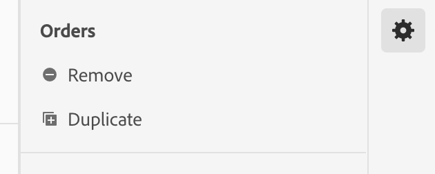

# Skapa en datavy

När du skapar en datavy måste du antingen skapa mått och mått från schemaelement eller använda standardkomponenter. Genom att skapa mätvärden eller dimensioner får du en enorm flexibilitet. Tidigare var antagandet att om du hade datauppsättningar i Adobe Experience Platform användes strängfält som dimensioner och numeriska fält som mått. För att kunna ändra något av dessa fält var du tvungen att redigera schemat i Platform. Gränssnittet för datavyer tillåter nu en [frihandsdefinition av mått och mått](/help/data-views/data-views.md). Mer användningsexempel finns i [Datavyer använder exempel](/help/data-views/data-views-usecases.md).

## 1. Konfigurera inställningar och behållare för datavyer

1. Gå till fliken **[!UICONTROL Data Views]** i Customer Journey Analytics.
2. Klicka på **[!UICONTROL Add]** om du vill skapa en ny datavy och konfigurera dess inställningar.

| Inställning | Beskrivning/Använd skiftläge |
| --- | --- |
| [!UICONTROL Connection] | Det här fältet länkar datavyn till anslutningen som du upprättade tidigare, som innehåller en eller flera Adobe Experience Platform-datauppsättningar. |
| [!UICONTROL Name] | Det är obligatoriskt att ge datavyn ett namn. |
| [!UICONTROL Description] | En detaljerad beskrivning är inte obligatorisk, men rekommenderas. |
| [!UICONTROL Time zone] | Välj vilken tidszon du vill att dina data ska visas i. |
| [!UICONTROL Tags] | [!UICONTROL Tags] kan du ordna datavyer i kategorier. |
| [!UICONTROL Containers] | Du kan byta namn på behållarna här för att bestämma hur de visas i ett arbetsyteprojekt som baseras på den här datavyn. [!UICONTROL Containers] används i filter och utfall/flöde och så vidare för att definiera hur brett eller smalt omfånget eller sammanhanget är. [Läs mer](https://experienceleague.adobe.com/docs/analytics-platform/using/cja-components/cja-filters/filters-overview.html?lang=en#filter-containers) |
| [!UICONTROL Person container name is…] | [!UICONTROL Person] (standard). Behållaren [!UICONTROL Person] innehåller alla besök och sidvisningar för besökare inom en viss tidsperiod. Du kan byta namn på den här behållaren till &quot;Användare&quot; eller något annat uttryck som du föredrar. |
| [!UICONTROL Session container name is…] | [!UICONTROL Session] (standard). Med [!UICONTROL Session]-behållaren kan du identifiera sidinteraktioner, kampanjer eller konverteringar för en viss session. Du kan byta namn på den här behållaren till &#39;Besök&#39; eller någon annan term som du föredrar. |
| [!UICONTROL Event container name is…] | [!UICONTROL Event] (standard). Behållaren [!UICONTROL Event] definierar vilka sidhändelser som du vill ta med eller exkludera från ett filter. |

Sedan kan du skapa mått och mått utifrån schemaelement. Du kan också använda standardkomponenter.

## 2. Skapa mått och dimensioner från schemaelement

1. Klicka på fliken [!UICONTROL Components] i [!UICONTROL Customer Journey Analytics] > [!UICONTROL Data Views].

Du kan se [!UICONTROL Connection] längst upp till vänster, som innehåller datauppsättningarna, och dess [!UICONTROL Schema fields] nedan. Kom ihåg:

* De komponenter som redan ingår är de standardkomponenter som krävs (systemgenererade).
* Adobe använder filtret **[!UICONTROL Contains data]** som standard, så att endast schemafält som innehåller data visas. Om du söker efter ett fält som inte innehåller data tar du bort filtret.

1. Dra nu ett schemafält, till exempel [!UICONTROL pageTitle], från den vänstra listen till avsnittet Metrisk eller Dimensioner.

   Du kan dra samma schemafält till dimensionerna eller måttavsnitten flera gånger och konfigurera samma mått eller mätvärden på olika sätt.
Du kan till exempel skapa en dimension med namnet&quot;Produktsidor&quot; och en annan&quot;Felsidor&quot; från fältet **[!UICONTROL pageTitle]** genom att byta namn på **[!UICONTROL Component Name]** till höger. Från **[!UICONTROL pageTitle]**; kan du också skapa mätvärden från ett strängvärde. Du kan till exempel skapa ett eller flera **[!UICONTROL Orders]**-mått med olika attribueringsinställningar och olika include/exclude-värden.

   

   >[!NOTE]
   >
   >Du kan dra i hela schemafältsmappar från den vänstra listen och de sorteras automatiskt i traditionella avsnitt. Strängfält avslutas med avsnittet [!UICONTROL Dimensions] och siffror i avsnittet [!UICONTROL Metrics]. Du kan också klicka på **[!UICONTROL Add all]** och lägga till alla schemafält.

1. När du har valt komponenten visas ett antal inställningar till höger. Konfigurera komponenten med de inställningar som beskrivs nedan.

### Konfigurera komponentinställningar

| Inställning | Beskrivning/Använd skiftläge |
| --- | --- |
| [!UICONTROL Component type] | Obligatoriskt. Gör att du kan ändra en komponent från Mått till Dimension eller tvärtom. |
| [!UICONTROL Component Name] | Obligatoriskt. Här kan du ange vilket eget namn som ska visas i Analysis Workspace. Du kan byta namn på en komponent om du vill ge den ett datavy-specifikt namn. |
| [!UICONTROL Description] | Valfritt, men rekommenderas, för att ge information om komponenten för andra användare. |
| [!UICONTROL Tags] | Valfritt. Gör att du kan tagga komponenten med egna eller färdiga taggar för enklare sökning/filtrering i Analysis Workspace-gränssnittet. |
| [!UICONTROL Field Name] | Schemafältets namn. |
| [!UICONTROL Dataset type] | Obligatoriskt. Ett icke-redigerbart fält som visar vilken datamängdstyp (händelse, sökning eller profil) som komponenten kommer från. |
| [!UICONTROL Dataset] | Obligatoriskt. Ett icke-redigerbart fält som visar vilken typ av fält som komponenten kommer från (t.ex. String, Integer, osv.). Det här fältet kan innehålla flera datauppsättningar. |
| [!UICONTROL Schema Data Type] | Avser om komponenten är en sträng, ett heltal och så vidare.  Även om du kan använda en schemafälttyp som stöds i Platform stöds inte alla fälttyper i CJA. Följande datatyper stöds: `Integer`, `Int`, `Long`, `Double`, `Float`, `Number`, `Short`, `Byte`, `String` och `Boolean`. Observera att endast strängar tillåts i Uppslagsuppsättningar för närvarande. |
| [!UICONTROL Component ID] | Obligatoriskt. [CJA API](https://adobe.io/cja-apis/docs) använder det här fältet för att referera till komponenten. Du kan klicka på redigeringsikonen och ändra det här komponent-ID:t. Om du ändrar det här komponent-ID:t bryts alla befintliga arbetsyteprojekt som innehåller den här komponenten. Om du någonsin skapar en annan datavy som använder ett annat fält för en pageTitle-dimension, kan du byta namn på den och göra dimensionen tvärdatavyn kompatibel. |
| [!UICONTROL Schema Path] | Obligatoriskt. Ett icke-redigerbart fält som visar schemasökvägen som komponenten kommer från. |
| [!UICONTROL Hide component in reporting] | Standard = av. Gör att du kan strukturera ut komponenten från datavyn när den används i rapporter. Detta påverkar inte behörigheter, bara komponentkurering. Du kan med andra ord dölja komponenten för icke-administratörer i rapporter. Administratörer kan fortfarande komma åt den genom att klicka på [!UICONTROL Show All Components] i ett Analysis Workspace-projekt. |

### Konfigurera formatinställningar

Formatinställningarna gäller endast för mätvärden.

| Inställning | Beskrivning/Använd skiftläge |
| --- | --- |
| [!UICONTROL Format] | Här kan du ange formatering för ett mätresultat, som decimal, tid, procent eller valuta. |
| [!UICONTROL Decimal Places] | Här kan du ange hur många decimaler ett mätresultat ska visa. |
| [!UICONTROL Show upward trend as] | Här kan du ange om en uppåtgående trend för det här måttet ska anses vara bra (grönt) eller dåligt (rött). |
| [!UICONTROL Currency] | Den här inställningen visas bara om det valda måttformatet är [!UICONTROL Currency]. Det finns en lista med valutaalternativ. Standardvärdet är ingen valuta. På så sätt kan du visa intäkter i valfri valuta vid rapportering. Det här är inte en valutakonvertering, bara ett gränssnittsformateringsalternativ. |

### Konfigurera attributinställningar

| Inställning | Beskrivning/Använd skiftläge |
| --- | --- |
| [!UICONTROL Set attribution] | Här kan du ange de attributinställningar som du vill använda för det här måttet som standard när det används. Den här standardinställningen kan åsidosättas i ett [!UICONTROL Freeform Table]-värde eller i ett beräknat mått. |
| [!UICONTROL Attribution model] | Gör att du kan ange en standardattribueringsmodell - bara aktiv när du aktiverar inställningen [!UICONTROL Use Non-default attribution model]. Standardvärdet är [!UICONTROL Last Touch]. Alternativen är: Senaste beröring, första beröring, linjär, deltagande, samma beröring, U-Shaped, J-kurva, omvänd J, tidsfördröjning, anpassad, algoritmisk. Vissa av dessa alternativ skapar ytterligare fält som måste fyllas i, till exempel Anpassad eller Tidsåtgång. Du kan skapa flera mätvärden med samma fält - det innebär att du kan ha ett [!UICONTROL Last touch]-intäktsmått och ett [!UICONTROL First Touch]-intäktsmått, men baserat på samma intäktsfält i schemat. |
| [!UICONTROL Lookback window] | Gör att du kan ange ett standardfönster för sökning till ett mätvärde - bara aktivt när du aktiverar inställningen [!UICONTROL Use Non-default attribution model]. Alternativen är: [!UICONTROL Person] (rapporteringsfönster), [!UICONTROL Session], [!UICONTROL Custom]. När [!UICONTROL Custom] är markerat ger vi dig också möjlighet att välja valfritt antal dagar/veckor/månader/osv. (upp till 90 dagar), precis som [!UICONTROL Attribution IQ]. Du kan ha flera mätvärden med samma schemafält, men var och en med ett separat uppslagsfönster. |

### Konfigurera inställningar för Inkludera/exkludera värden

Med den här inställningen kan du ändra de underliggande data som du rapporterar om vid en fråga. Det är inte detsamma som ett filter. Men filtren kommer att ta hänsyn till denna nya dimension, liksom målning och attribuering.

Du kan t.ex. skapa en dimension utanför pageTitle-fältet, men anropa det som &quot;felsidor&quot; och inkludera alla sidor som [!UICONTROL contains the phrase] &quot;fel&quot;.

| Inställning | Beskrivning/Använd skiftläge |
| --- | --- |
| [!UICONTROL Case sensitive] | Standard = På. Den här inställningen gäller bara för avsnittet [!UICONTROL Include/Exclude Values]. Du kan ange om inkluderings-/exkluderingsregeln som du tillämpar ska vara skiftlägeskänslig. |
| [!UICONTROL Match] | Här kan du ange vilka värden du vill ta hänsyn till för rapportering före attribuering och filter (t.ex. endast använda värden som innehåller frasen &quot;error&quot;). Du kan ange: **[!UICONTROL If all criteria are met]** eller **[!UICONTROL If any criteria are met]**. |
| [!UICONTROL Criteria] | Här kan du ange den matchningslogik som ska användas för en viss filterregel.<ul><li>**Sträng**: Innehåller frasen, Innehåller valfri term, Innehåller alla termer, Innehåller ingen term, Innehåller inte frasen, Lika med, Är inte lika, Börjar med, Slutar med</li><li>**Dubbel/heltal**: är lika med, inte lika med, är större än, är mindre än, är större än eller lika med, är mindre än eller lika med</li><li>**Datum**: är lika med, inte lika med, är senare än, är före, finns i</li></ul> |
| [!UICONTROL Match operand] | Här kan du ange den matchningsoperand som matchningsoperatorn ska användas på.<ul><li>**Sträng**: Textfält</li><li>**Dubbel/heltal**: Textfält med upp-/nedpilar för numeriska värden</li><li>**Datum**: Väljare för daggranularitet (kalender)</li><li>**Datum och tid**: Val för datum- och tidsgranularitet</li></ul> |
| [!UICONTROL Add rule] | Här kan du ange ytterligare en matchningsoperator och -operand. |

### Konfigurera beteendeinställningar

Här kan du ange hur ett mätvärde ska fungera i rapporter.

| Inställning | Beskrivning/Använd skiftläge |
| --- | --- |
| [!UICONTROL Count values] | Endast för booleska värden gör den här inställningen att du kan ange om du vill [!UICONTROL Count True], [!UICONTROL Count False] eller [!UICONTROL Count True or False] som måttvärde. Standardvärdet är [!UICONTROL Count True]. Detta ger dig det faktiska värdet för ett mätvärde, till exempel &quot;50&quot; om det fanns ett ordervärde på 50. |
| [!UICONTROL Count instances] | Här kan du ange om ett numeriskt fält eller ett datumtypsfält som används som ett mätvärde ska räkna tiden som det ställdes in i stället för själva värdet.  Om du vill lägga till förekomsterna av ett numeriskt fält och bara vill lägga till antalet gånger som ett fält har angetts, i stället för det faktiska värdet  ** i fältet. Detta är användbart om du till exempel vill skapa ett  [!UICONTROL Orders] mätvärde från ett  [!UICONTROL Revenue] fält. Om intäkten har ställts in vill vi räkna med en enda order i stället för det numeriska intäktsbeloppet. |
| [!UICONTROL Lower case] | Används med strängdimensioner. Raderar rader som har samma värde men olika fall. Om det här alternativet är aktiverat rapporteras alla instanser av en dimension med samma värde som gemener. Din datauppsättning innehåller till exempel värdena `"liverpool"`, `"Liverpool"` och `"LIVERPOOL"` i en strängdimension. Om [!UICONTROL Lower case] är aktiverat kombineras alla tre värdena till `"liverpool"`. Om det är inaktiverat behandlas alla tre värden som distinkta värden:   |

>[!NOTE]
>
>Om du aktiverar [!UICONTROL Lower case] för en sökdatauppsättningsdimension kan det finnas flera uppslagsvärden för samma identifierare. Om den här konflikten inträffar använder CJA det första ASCII-sorterade värdet (versalvärden före gemener). Adobe rekommenderar att du inte använder uppslagsdatauppsättningar som innehåller samma värde när [!UICONTROL Lower case] är aktiverat.

### Konfigurera [!UICONTROL No Value Options]-inställningar

[!UICONTROL No Value Options] -inställningarna motsvarar  [!UICONTROL Unspecified] eller  [!UICONTROL None] värden vid rapportering. I datavysningsgränssnittet kan du, komponentvis, bestämma hur du vill att dessa värden ska behandlas i rapporter. Du kan också byta namn på [!UICONTROL No value] till något som passar din miljö bättre, till exempel [!UICONTROL Null], [!UICONTROL Not set] eller andra.

Observera också att det du anger i det här fältet kan användas för speciell gränssnittsbehandling av radobjektet [!UICONTROL No Value] vid rapportering enligt inställningen [!UICONTROL No Value Options].

| Inställning | Beskrivning/Använd skiftläge |
| --- | --- |
| [!UICONTROL If shown, call No value...] | Här kan du byta namn på **[!UICONTROL No value]** till något annat. |
| [!UICONTROL Don't show No value by default] | Visar inte det här värdet vid rapportering. |
| [!UICONTROL Show No value by default] | Visar det här värdet vid rapportering. |
| [!UICONTROL Treat No value as a value] | Den här inställningen ersätter tomma värden i data med texten som du angav under [!UICONTROL If shown, call No value ...]. Om du t.ex. har Mobile-enhetstyper som dimension kan du byta namn på **[!UICONTROL No value]**-objektet till &quot;Desktop&quot;. Observera att när du ändrar det här fältet till ett anpassat värde behandlas det anpassade värdet som ett giltigt strängvärde. Om du anger värdet &quot;Red&quot; i det här fältet kommer alla instanser av strängen &quot;Red&quot; som visas i själva data att hamna under samma radobjekt som du har angett. |

### Konfigurera inställningar för beständighet

Mer information finns i avsnittet [Persistence](/help/data-views/persistence.md).

| Inställning | Beskrivning/Använd skiftläge |
| --- | --- |
| [!UICONTROL Set persistence] | Växla nyckel |
| [!UICONTROL Allocation] | Här kan du ange den allokeringsmodell som används för en dimension för beständighet. Alternativen är: [!UICONTROL Most recent], [!UICONTROL Original], [!UICONTROL Instance], [!UICONTROL All]. Om du vill att ett värde ska finnas kvar är det här du ställt in det. Den maximala beständighet du kan ange är 90 dagar. [!UICONTROL Never expire] är inte heller ett alternativ. |
| [!UICONTROL Expiration] | Gör att du kan ange det beständiga fönstret för en dimension. Alternativen är: [!UICONTROL Session] (standard), [!UICONTROL Person], [!UICONTROL Time], [!UICONTROL Metric]. Du kanske måste kunna förfalla dimensionen på ett köp (till exempel interna sökvillkor eller andra användningsfall för varuexponering). [!UICONTROL Metric] gör att du kan ange något av de definierade måtten som förfallodatum för den här dimensionen (t.ex. ett  [!UICONTROL Purchase] mått). **Obs**: Du kan inte ange en anpassad förfallotid för en dimension när du väljer en allokering av  [!UICONTROL All]. |

### Konfigurera inställningar för värdepaketering

En&quot;kryss mellan 5 och 10&quot; kommer till exempel att visas som en radpost&quot;5 till 10&quot; i Workspace-rapportering.

| Inställning | Beskrivning/Använd skiftläge |
| --- | --- |
| [!UICONTROL Bucket value] | Gör att du kan skapa en paketerad version av en numerisk dimension. På så sätt kan du rapportera flera intäktsgrupper eller andra numeriska värden som en dimension i rapporteringen. |
| [!UICONTROL Up to] | Här kan du ange gränserna för den första numeriska dimensionskassetten. Detta gäller endast för numeriska mått. |
| [!UICONTROL Between and up to] | Här kan du ange gränserna för efterföljande numeriska dimensionsintervall. |
| [!UICONTROL Add bucket] | Gör att du kan lägga till ytterligare en bucket i en numerisk dimensionsbucketning. |

### Använd [!UICONTROL Standard components]

Förutom att skapa mått och mått från schemaelement kan du även använda standardkomponenter i datavyer.

[!UICONTROL Standard components] är komponenter som inte genereras från schemafält för datauppsättningar, utan i stället genereras av systemet. Vissa systemkomponenter krävs i alla datavyer för att underlätta rapporteringen i Analysis Workspace, medan andra systemkomponenter är valfria.

Dessa nödvändiga standardkomponenter läggs som standard till i varje datavy.

| Komponentnamn | Dimension eller mått | Anteckningar |
| --- | --- | --- |
| [!UICONTROL People] | Mått | Det här måttet baseras på det person-ID som anges i en [!UICONTROL Connection]. |
| [!UICONTROL Sessions] | Mått | Det här måttet baseras på sessionsinställningarna som anges nedan. |
| [!UICONTROL Events] | Mått | Det här måttet representerar antalet rader från alla händelsedatamängder i en [!UICONTROL Connection]. |
| [!UICONTROL Day] | Dimension | I dimensionen&quot;dag&quot; rapporteras dagen då ett visst mått inträffade. Den första dimensionsartikeln är den första dagen i datumintervallet och den sista dimensionsuppgiften är den sista dagen i datumintervallet. |
| [!UICONTROL Week] | Dimension | Veckodimensionen rapporterar veckan om att ett visst mått har inträffat. Den första dimensionsuppgiften är den första veckan i datumintervallet och den sista dimensionsuppgiften är den sista veckan i datumintervallet. |
| [!UICONTROL Month] | Dimension | Dimensionen Month rapporterar månaden då ett visst mått inträffade. Den första dimensionsuppgiften är den första månaden i datumintervallet och den sista dimensionsuppgiften är den sista månaden i datumintervallet. |
| [!UICONTROL Quarter] | Dimension | Dimensionen&quot;Kvartal&quot; rapporterar kvartalet om att ett visst mått har inträffat. Den första dimensionsuppgiften är det första kvartalet i datumintervallet och den sista dimensionsuppgiften är det sista kvartalet i datumintervallet. |
| [!UICONTROL Year] | Dimension | I dimensionen&quot;År&quot; rapporteras året då ett givet mätresultat inträffade. Den första dimensionsuppgiften är det första året i datumintervallet och den sista dimensionsuppgiften är det senaste året i datumintervallet. |
| [!UICONTROL Hour] | Dimension | I måttet&quot;Timme&quot; rapporteras timmen då ett givet mätresultat inträffade (avrundat nedåt). Den första dimensionsartikeln är den första timmen i datumintervallet, och den sista dimensionsartikeln är den sista timmen i datumintervallet. |
| [!UICONTROL Minute] | Dimension | Minutdimensionen anger den minut då ett givet mätvärde inträffade (avrundat nedåt). Den första dimensionsposten är den första minuten i datumintervallet och den sista dimensionsposten är den sista minuten i datumintervallet. |

### Valfria standardkomponenter

Valfria standardkomponenter finns under fliken **[!UICONTROL Standard Components]**.

| Komponentnamn | Dimension eller mått | Anteckningar |
| --- | --- | --- |
| [!UICONTROL Session Starts] | Mått | Det här måttet räknar antalet händelser som var den första händelsen i en session. Vid användning i en filterdefinition (t.ex. [!UICONTROL Session Starts] existerar&#39;), filtreras ned till den första händelsen i varje session. |
| [!UICONTROL Session Ends] | Mått | Det här måttet räknar antalet händelser som var den sista händelsen i en session. På liknande sätt som [!UICONTROL Session Starts] kan den även användas i en filterdefinition för att filtrera ned saker till den sista händelsen i varje session. |
| [!UICONTROL Time Spent (seconds)] | Mått | Måttet [!UICONTROL Time Spent] sammanställer tiden mellan två olika värden för en dimension. |
| [!UICONTROL Time Spent per Event] | Dimension | [!UICONTROL Time Spent per Event] sätter  [!UICONTROL Time Spent] in mätvärdena i  [!UICONTROL Event] fickorna. |
| [!UICONTROL Time Spent per Session] | Dimension | [!UICONTROL Time Spent per Session] sätter  [!UICONTROL Time Spent] in mätvärdena i  [!UICONTROL Session] fickorna. |
| [!UICONTROL Time Spent per Person] | Dimension | [!UICONTROL Time Spent per Person] sätter  [!UICONTROL Time Spent] in mätvärdena i  [!UICONTROL Person] fickorna. |
| [!UICONTROL Batch ID] | Dimension | Representerar den Experience Platform-batch som en [!UICONTROL Event] var en del av. |
| [!UICONTROL Dataset ID] | Dimension | Representerar datauppsättningen Experience Platform som en [!UICONTROL Event] var en del av. |

## Använd funktionen [!UICONTROL Duplicate]

Att duplicera mått och dimensioner och sedan ändra specifika inställningar är ett enkelt sätt att skapa flera mått eller dimensioner från ett enda schemafält. Välj bara inställningen [!UICONTROL Duplicate] under måttets eller dimensionens namn högst upp till höger. Ändra sedan det nya måttet eller måttet och spara det under ett mer beskrivande namn.

### Filtrera schemafält och dimensioner/mått

Du kan filtrera schemafält i den vänstra listen med följande datatyper:

Du kan också filtrera efter datauppsättningar och efter om ett schemafält innehåller data eller om det är en identitet. Som standard tillämpar vi filtret **[!UICONTROL Contains data]** på alla datavyer.

## Lägga till ett globalt filter i datavyn

Du kan lägga till filter som gäller för hela datavyn. Det här filtret tillämpas på alla rapporter som du kör i Workspace.

1. Klicka på fliken [!UICONTROL Settings] i [!UICONTROL Data views].
1. Dra ett filter från listan i den vänstra listen till fältet [!UICONTROL Add filters].
