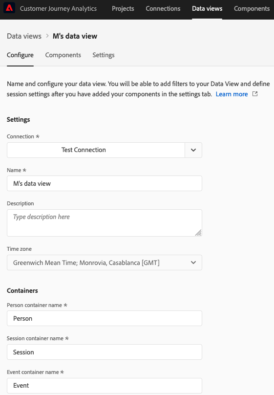

# Skapa eller redigera en datavy

Creating a data view involves either creating metrics and dimensions from schema elements or utilizing standard components. De flesta schemaelement kan antingen vara en dimension eller ett mått beroende på företagets behov. Once you drag a schema element into a data view, options appear on the right where you can adjust how the dimension or metric operates in CJA.

Här är en video om ämnet:

>[!VIDEO](https://video.tv.adobe.com/v/35110/?quality=12&learn=on)

## Konfigurera en datavy

1. Logga in på [Customer Journey Analytics](https://analytics.adobe.com) och går till **[!UICONTROL Data Views]** -fliken.
2. Klicka **[!UICONTROL Add]** om du vill skapa en datavy eller klicka på en befintlig datavy för att redigera den.

### Inställningar för datavy

Innehåller övergripande inställningar för datavyn.

| Inställning | Beskrivning |
| --- | --- |
| [!UICONTROL Connection] | Det här fältet länkar datavyn till anslutningen som du upprättade tidigare, som innehåller en eller flera Adobe Experience Platform-datauppsättningar. |
| [!UICONTROL Name] | Obligatoriskt. Datavyns namn. Det här värdet visas i den övre högra listrutan i Analysis Workspace. |
| [!UICONTROL Description] | Valfritt. Adobe rekommenderar en detaljerad beskrivning så att användarna förstår varför datavyn finns och vem den är avsedd för. |

### Behållare

Anger namnet på behållare för datavyn. Behållarnamn används ofta i [Filter](/help/components/filters/filters-overview.md#Filter-containers).

| Inställning | Beskrivning |
| --- | --- |
| [!UICONTROL Person container name] | [!UICONTROL Person] (default). The [!UICONTROL Person] container includes every session and event for visitors within the specified time frame. Om din organisation använder en annan term (till exempel &quot;Besökare&quot; eller &quot;Användare&quot;) kan du byta namn på behållaren här. |
| [!UICONTROL Session container name] | [!UICONTROL Session] (standard). The [!UICONTROL Session] kan du identifiera sidinteraktioner, kampanjer eller konverteringar för en viss session. You can rename this container to &#39;Visit&#39; or any other term your organization prefers. |
| [!UICONTROL Event container name] | [!UICONTROL Event] (default). The [!UICONTROL Event] container defines individual events in a dataset. Om din organisation använder en annan term (till exempel &quot;träffar&quot; eller &quot;Sidvisningar&quot;) kan du byta namn på behållaren här. |

### Calendar

Indicates the calendar format that you want the data view to follow. Du kan ha flera datavyer baserade på samma [Anslutning](/help/connections/create-connection.md) och ge dem olika kalendertyper eller tidszoner. Dessa datavyer kan göra det möjligt för team som använder olika kalendertyper att tillgodose sina respektive behov med samma underliggande data.

| Inställning | Beskrivning |
| --- | --- |
| [!UICONTROL Time zone] | Välj vilken tidszon du vill att dina data ska visas i. Om du väljer en tidszon som fungerar med sommartid justeras data automatiskt för att återspegla det. På våren, när klockorna justerar en timme framåt, finns det en lucka på en timme. In the fall when clocks adjust one hour behind, one hour is repeated during the DST shift. |
| [!UICONTROL Calendar Type] | Determine how weeks of the month are grouped. **Gregorian:** Standard calendar format. Kvartal grupperas efter månad. **4-5-4 Detaljhandel:** En standardiserad 4-5-4-kalender. The first and last months of the quarter contains 4 weeks, while the second month of the quarter consists of 5 weeks. **Anpassad (4-5-4):** Liknar kalendern 4-5-4 förutom att du kan välja den första dagen på året och vilket år som den extra veckan inträffar. **Custom (4-4-5):** The first and second months of each quarter contain 4 weeks, while the last week of each quarter consist of 5 weeks. **Custom (5-4-4):** The first month of each quarter consists of 5 weeks, while the second and third month of each quarter consists of 4 weeks. |
| [!UICONTROL First month of the year] och [!UICONTROL First day of week] | Synlig för den gregorianska kalendertypen. Ange vilken månad du vill att kalenderåret ska börja på och vilken dag du vill att varje vecka ska börja på. |
| [!UICONTROL First day of current year] | Visible for custom calendar types. Ange vilken dag på året som du vill att det aktuella året ska börja. Kalendern formaterar automatiskt den första dagen i varje vecka baserat på det här värdet. |
| [!UICONTROL Year in which the "extra" week occurs] | Med de flesta 364-dagars kalendrar (52 veckor på 7 dagar vardera) ackumulerar varje år kvarvarande dagar tills de utgör en extra vecka. Den här extra veckan läggs sedan till den sista månaden under det året. Specify which year that you want the extra week added to. |

## Set a data view&#39;s components

Next, you can create metrics and dimensions from schema elements. You can also use Standard components.

1. Log in to [Customer Journey Analytics](https://analytics.adobe.com) and go to the **[!UICONTROL Data Views]** tab.
1. Klicka **[!UICONTROL Add]** om du vill skapa en datavy eller klicka på en befintlig datavy för att redigera den.
1. Click the **[!UICONTROL Components]** tab.

   

   Du kan se [!UICONTROL Connection] överst till vänster, som innehåller datauppsättningarna, och [!UICONTROL Schema fields] nedan. Observera att de komponenter som redan ingår är nödvändiga standardkomponenter (systemgenererade) för alla datavyer. Adobe använder också filtret **[!UICONTROL Contains data]** som standard så att endast schemafält som innehåller data visas. Om du vill ha ett fält som inte innehåller data tar du bort det här filtret.

1. Dra ett schemafält, till exempel `pageTitle`från den vänstra listen till avsnittet Metrisk eller Dimension.

   You can drag the same schema field into the dimensions or metrics sections multiple times and configure the same dimension or metric in different ways. Från `pageTitle` kan du skapa en dimension med namnet&quot;Produktsidor&quot; och en annan&quot;Felsidor&quot; genom att använda olika [Komponentinställningar](component-settings/overview.md) till höger.

   

   Om du drar en mapp för schemafält från den vänstra listen sorteras de automatiskt i vanliga avsnitt. Strängfält hamnar i [!UICONTROL Dimensions] -avsnitt och numeriska schematyper hamnar i [!UICONTROL Metrics] -avsnitt. Du kan också klicka **[!UICONTROL Add all]** och alla schemafält läggs till på respektive plats.

1. När du har valt komponenten visas ett antal inställningar till höger. Configure the component using [Component settings](component-settings/overview.md). Available component settings depend on if the component is a dimension/metric and the schema data type. Inställningarna inkluderar:

   * [[!UICONTROL Attribution]](component-settings/attribution.md)
   * [[!UICONTROL Behavior]](component-settings/behavior.md)
   * [[!UICONTROL Format]](component-settings/format.md)
   * [[!UICONTROL Include exclude values]](component-settings/include-exclude-values.md)
   * [[!UICONTROL Metric deduplication]](component-settings/metric-deduplication.md)
   * [[!UICONTROL No value options]](component-settings/no-value-options.md)
   * [[!UICONTROL Persistence]](component-settings/persistence.md)
   * [[!UICONTROL Value bucketing]](component-settings/value-bucketing.md)

## Duplicera mått eller dimensioner

Att duplicera mått och dimensioner och sedan ändra specifika inställningar är ett enkelt sätt att skapa flera mått eller dimensioner från ett enda schemafält. Välj [!UICONTROL Duplicate] inställningen under måttets eller dimensionernas namn högst upp till höger. Ändra den nya dimensionen eller måttet och spara det under ett mer beskrivande namn.

## Filtrera schemafält eller datauppsättningar

Du kan filtrera schemafält i den vänstra listen med följande datatyper:

Du kan också filtrera efter datauppsättningar och efter om ett schemafält innehåller data eller om det är en identitet. Som standard använder Adobe från början **[!UICONTROL Contains data]** filtrera till alla datavyer.

## Fliken Inställningar

1. Logga in på [Customer Journey Analytics](https://analytics.adobe.com) och går till **[!UICONTROL Data Views]** -fliken.
1. Klicka **[!UICONTROL Add]** om du vill skapa en datavy eller klicka på en befintlig datavy för att redigera den.
1. Klicka på **[!UICONTROL Settings]** -fliken.

### Globalt filter

Du kan lägga till filter som gäller för en hel datavy. Det här filtret tillämpas på alla rapporter som du kör i Workspace. Drag a filter from the list in the left rail to the [!UICONTROL Add filters] field.

### Sessionsinställningar

Fastställ inaktivitetstiden mellan händelser innan en session förfaller och en ny påbörjas.

En tidsperiod krävs. Du kan också tvinga en ny session att starta när en händelse innehåller ett visst mått.

När du har angett alla inställningar klickar du på **[!UICONTROL Save and finish]**.
