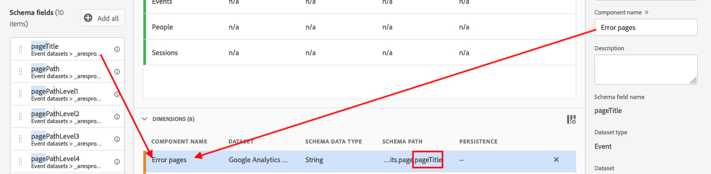

# Skapa en datavy

När du skapar en datavy måste du antingen skapa mått och mått från schemaelement eller använda standardkomponenter. De flesta schemaelement kan antingen vara en dimension eller ett mått beroende på företagets behov. När du drar ett schemaelement till en datavy visas alternativ till höger, där du kan justera hur dimensionen eller måttet fungerar i CJA.

## Konfigurera inställningar och behållare för datavyer

1. Gå till fliken **[!UICONTROL Data Views]** i Customer Journey Analytics.
2. Klicka på **[!UICONTROL Add]** om du vill skapa en ny datavy och konfigurera dess inställningar.

| Inställning | Beskrivning/Använd skiftläge |
| --- | --- |
| [!UICONTROL Connection] | Det här fältet länkar datavyn till anslutningen som du upprättade tidigare, som innehåller en eller flera Adobe Experience Platform-datauppsättningar. |
| [!UICONTROL Name] | Det är obligatoriskt att ge datavyn ett namn. |
| [!UICONTROL Description] | En detaljerad beskrivning är inte obligatorisk, men rekommenderas. |
| [!UICONTROL Time zone] | Välj vilken tidszon du vill att dina data ska visas i. |
| [!UICONTROL Tags] | [!UICONTROL Tags] kan du ordna datavyer i kategorier. |
| [!UICONTROL Containers] | Du kan byta namn på behållarna här för att bestämma hur de visas i ett arbetsyteprojekt som baseras på den här datavyn. [!UICONTROL Containers] används i filter och utfall/flöde och så vidare för att definiera hur brett eller smalt omfånget eller sammanhanget är. [Läs mer](https://experienceleague.adobe.com/docs/analytics-platform/using/cja-components/cja-filters/filters-overview.html?lang=en#filter-containers) |
| [!UICONTROL Person container name is…] | [!UICONTROL Person] (standard). Behållaren [!UICONTROL Person] innehåller alla besök och sidvisningar för besökare inom en viss tidsperiod. Du kan byta namn på den här behållaren till &quot;Användare&quot; eller något annat uttryck som du föredrar. |
| [!UICONTROL Session container name is…] | [!UICONTROL Session] (standard). Med [!UICONTROL Session]-behållaren kan du identifiera sidinteraktioner, kampanjer eller konverteringar för en viss session. Du kan byta namn på den här behållaren till &#39;Besök&#39; eller någon annan term som du föredrar. |
| [!UICONTROL Event container name is…] | [!UICONTROL Event] (standard). Behållaren [!UICONTROL Event] definierar vilka sidhändelser som du vill ta med eller exkludera från ett filter. |

Sedan kan du skapa mått och mått utifrån schemaelement. Du kan också använda standardkomponenter.

## Skapa mått och dimensioner från schemaelement

1. Klicka på fliken [!UICONTROL Components] i [!UICONTROL Customer Journey Analytics] > [!UICONTROL Data Views].

Du kan se [!UICONTROL Connection] längst upp till vänster, som innehåller datauppsättningarna, och dess [!UICONTROL Schema fields] nedan. Kom ihåg:

* De komponenter som redan ingår är de standardkomponenter som krävs (systemgenererade).
* Adobe använder filtret **[!UICONTROL Contains data]** som standard, så att endast schemafält som innehåller data visas. Om du söker efter ett fält som inte innehåller data tar du bort filtret.

1. Dra nu ett schemafält, till exempel [!UICONTROL pageTitle], från den vänstra listen till avsnittet Metrisk eller Dimensioner.

   Du kan dra samma schemafält till dimensionerna eller måttavsnitten flera gånger och konfigurera samma mått eller mätvärden på olika sätt.
Du kan till exempel skapa en dimension med namnet&quot;Produktsidor&quot; och en annan&quot;Felsidor&quot; från fältet **[!UICONTROL pageTitle]** genom att byta namn på **[!UICONTROL Component Name]** till höger. Från **[!UICONTROL pageTitle]**; kan du också skapa mätvärden från ett strängvärde. Du kan till exempel skapa ett eller flera **[!UICONTROL Orders]**-mått med olika attribueringsinställningar och olika include/exclude-värden.

   

   >[!NOTE]
   >
   >Du kan dra i hela schemafältsmappar från den vänstra listen och de sorteras automatiskt i traditionella avsnitt. Strängfält hamnar i [!UICONTROL Dimensions]-avsnittet och siffror i [!UICONTROL Metrics]-avsnittet. Du kan också klicka på **[!UICONTROL Add all]** och lägga till alla schemafält.

1. När du har valt komponenten visas ett antal inställningar till höger. Konfigurera komponenten med de inställningar som beskrivs nedan.

## Använd funktionen [!UICONTROL Duplicate]

Att duplicera mått och dimensioner och sedan ändra specifika inställningar är ett enkelt sätt att skapa flera mått eller dimensioner från ett enda schemafält. Välj bara inställningen [!UICONTROL Duplicate] under måttets eller dimensionens namn högst upp till höger. Ändra sedan det nya måttet eller måttet och spara det under ett mer beskrivande namn.

## Filtrera schemafält och dimensioner/mått

Du kan filtrera schemafält i den vänstra listen med följande datatyper:

Du kan också filtrera efter datauppsättningar och efter om ett schemafält innehåller data eller om det är en identitet. Som standard tillämpar vi filtret **[!UICONTROL Contains data]** på alla datavyer.

## Lägga till ett globalt filter i datavyn

Du kan lägga till filter som gäller för en hel datavy. Det här filtret tillämpas på alla rapporter som du kör i Workspace.

1. Klicka på fliken [!UICONTROL Settings] i [!UICONTROL Data views].
1. Dra ett filter från listan i den vänstra listen till fältet [!UICONTROL Add filters].
