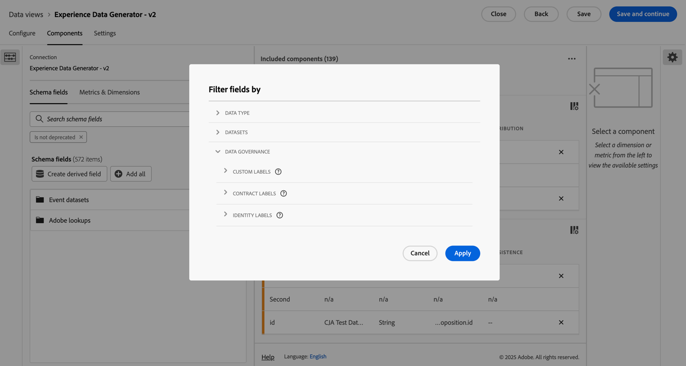

# Skapa eller redigera en datavy

När du skapar en datavy måste du antingen skapa mått och mått från schemaelement eller använda standardkomponenter. De flesta schemaelement kan antingen vara en dimension eller ett mått beroende på företagets behov. När du drar ett schemaelement till en datavy visas alternativ till höger, där du kan justera hur dimensionen eller måtten fungerar i Customer Journey Analytics.

>[!BEGINSHADEBOX]

Se  [Skapa eller redigera en datavy](https://video.tv.adobe.com/v/35110/?quality=12&learn=on){target="_blank"} för en demonstrationsvideo.

>[!ENDSHADEBOX]

Så här skapar eller redigerar du en datavy:

1. Logga in på [Customer Journey Analytics](https://analytics.adobe.com) och välj **[!UICONTROL Data views]**, eventuellt från **[!UICONTROL Data management]**, på den översta menyn.
1. Om du vill skapa en datavy väljer du **[!UICONTROL Create new data view]**. Du kan också välja en befintlig datavy i listan över datavyer för att redigera den.

## Konfigurera {#configure}

Så här konfigurerar du en ny eller befintlig datavy:

>[!BEGINTABS]

>[!TAB Standard]

>[!TAB B2B edition]

>[!ENDTABS]

1. Välj fliken **[!UICONTROL Configure]** (om den inte redan är aktiv).

1. Ange information om [!UICONTROL Settings], [!UICONTROL Container] och [!UICONTROL Calendar] (se nedan).
1. Välj **[!UICONTROL Save and continue]** om du vill fortsätta konfigurera den nya eller befintliga datavyn. Välj **[!UICONTROL Save]** om du vill spara konfigurationen för den befintliga datavyn.

### Inställningar {#configure-settings}

>[!CONTEXTUALHELP]
>id="dataview_externalid"
>title="Externt ID"
>abstract="Om du ändrar det externa ID:t kan det påverka hur datavyns namn visas i externa källor, till exempel affärsinformationsverktyg."

Innehåller övergripande inställningar för datavyn.

| Inställning | Beskrivning |
| --- | --- |
| **[!UICONTROL Connection]** | Det här fältet länkar datavyn till anslutningen som du upprättade tidigare, som innehåller en eller flera Adobe Experience Platform-datauppsättningar. |
| **[!UICONTROL Name]** | Obligatoriskt. Datavyns namn. Värdet visas i den övre högra listrutan i Analysis Workspace. |
| **[!UICONTROL External ID]** | Obligatoriskt. Namnet på datavyn som du kan använda i externa källor, t.ex. affärsinformationsverktyg. Standardvärdet är `unspecified`. Om du inte anger ett externt ID genereras namnet från datavyns namn och blanksteg ersätts med understreck. |
| **[!UICONTROL Description]** | Valfritt. Adobe rekommenderar en detaljerad beskrivning så att användarna förstår varför datavyn finns och vem den är avsedd för. |

{style="table-layout:auto"}

### Kompatibilitet {#compatibility}

>[!CONTEXTUALHELP]
>id="dataview_dataviewsinadobejourneyoptimizer"
>title="Datavyer i Journey Optimizer"
>abstract="Customer Journey Analytics måste använda en anslutning och datavy som är kompatibel med Adobe Journey Optimizer. Som standard skapas en anslutning och en datavy automatiskt för detta. Du kan också aktivera det här alternativet om du vill göra den här datavyn till standarddatavyn som används i Adobe Journey Optimizer-rapporter. När det här alternativet är aktiverat läggs alla nödvändiga komponenter som krävs för Journey Optimizer till i datavyn, och alla nödvändiga Journey Optimizer-datauppsättningar läggs till i anslutningen som är kopplad till datavyn."
>additional-url="https://experienceleague.adobe.com/en/docs/analytics-platform/using/integrations/ajo#connection" text="Vilka komponenter och datauppsättningar som läggs till."

Innehåller inställningar som är tillämpliga när du använder Adobe Journey Optimizer förutom Customer Journey Analytics.

Det här avsnittet visas bara för administratörer som har etablerats med Journey Optimizer.

| Inställning | Beskrivning |
| --- | --- |
| [!UICONTROL **Ange som standarddatavy i Adobe Journey Optimizer**] | Det här konfigurationsalternativet standardiserar rapporteringen i Journey Optimizer och Customer Journey Analytics. Du kan även utföra avancerade analyser av dina Adobe Journey Optimizer-data i Customer Journey Analytics (genom att välja  [!UICONTROL **Analysera i CJA**] i Journey Optimizer).
För att kunna utföra den här typen av analyser måste Journey Optimizer ha tillgång till en datavy från Customer Journey Analytics.
Aktivera det här alternativet om du vill göra det här till standarddatavyn som används i Journey Optimizer-rapporter för din sandlåda.

Det här konfigurationsalternativet automatiskt:
<ul><li>Konfigurerar alla Journey Optimizer-datauppsättningar som behövs i den associerade anslutningen i Customer Journey Analytics för användning med Journey Optimizer.</li><li>Skapar en uppsättning Journey Optimizer-mått och -dimensioner i datavyn (inklusive härledda fält och beräknade värden). Kontextetiketter anges automatiskt för alla dessa mått och mått.</li><li>Aktiverar automatiskt alternativet **[!UICONTROL Use in CJA]** i anslutningen som är associerad med den här datavyn. (Mer information om det här alternativet finns i [Använda en Journey Optimizer-anslutning i Customer Journey Analytics](/help/connections/manage-connections.md).)
Om du inaktiverar den här inställningen manuellt när den har aktiverats återställs anslutningen och alla associerade datavyer till standardläget. Detta kan leda till dataändringar i dina rapporter.
</li></ul>

Tänk på följande när du aktiverar det här alternativet: <ul><li>Du kan ändra standarddatavyn vid ett senare tillfälle, men om du gör det kan Journey Optimizer rapporteringsdata ändras. Om du väljer att inaktivera det här alternativet när det har aktiverats uppmanas du att välja en ny standarddatavy.</li><li>Om du redan har gjort manuella anpassningar av datauppsättningarna, dimensionerna eller mätvärdena i datavyn för Customer Journey Analytics, förblir dina manuella anpassningar intakta när du aktiverar det här konfigurationsalternativet. Det här alternativet gör ytterligare anpassningar som ytterligare standardiserar rapporteringen i Journey Optimizer och Customer Journey Analytics. Du kan också göra manuella anpassningar när du har aktiverat det här alternativet.</li><li>När det här alternativet är markerat kan anslutningen som är kopplad till datavyn inte tas bort.</li></ul>Mer information finns i [Integrera Adobe Journey Optimizer med Adobe Customer Journey Analytics](/help/integrations/ajo.md). |

{style="table-layout:auto"}

### Behållare

Anger namnet på behållare för datavyn. Behållarnamn används ofta i [segment](/help/components/segments/seg-overview.md#containers).

| Inställning | Beskrivning |
| --- | --- |
| [!BADGE B2B edition]{type=Informative url="https://experienceleague.adobe.com/en/docs/analytics-platform/using/cja-overview/cja-b2b/cja-b2b-edition" newtab=true tooltip="Customer Journey Analytics B2B edition"} **[!UICONTROL Global Account container name]** | `Global Account` (standard). Behållaren [!UICONTROL Global Account] innehåller alla sessioner och händelser för globala konton inom den angivna tidsramen. Om din organisation använder en annan term kan du byta namn på behållaren här. |
| [!BADGE B2B edition]{type=Informative url="https://experienceleague.adobe.com/en/docs/analytics-platform/using/cja-overview/cja-b2b/cja-b2b-edition" newtab=true tooltip="Customer Journey Analytics B2B edition"} **[!UICONTROL Account container name]** | `Account` (standard). Behållaren [!UICONTROL Account] innehåller alla sessioner och händelser för konton inom den angivna tidsramen. Om din organisation använder en annan term kan du byta namn på behållaren här. |
| [!BADGE B2B edition]{type=Informative url="https://experienceleague.adobe.com/en/docs/analytics-platform/using/cja-overview/cja-b2b/cja-b2b-edition" newtab=true tooltip="Customer Journey Analytics B2B edition"} **[!UICONTROL Opportunity container name]** | `Opportunity` (standard). Behållaren [!UICONTROL Opportunity] innehåller alla sessioner och händelser för affärsmöjligheter inom den angivna tidsramen. Om din organisation använder en annan term kan du byta namn på behållaren här. |
| [!BADGE B2B edition]{type=Informative url="https://experienceleague.adobe.com/en/docs/analytics-platform/using/cja-overview/cja-b2b/cja-b2b-edition" newtab=true tooltip="Customer Journey Analytics B2B edition"} **[!UICONTROL Buying group container name]** | `Buying Group` (standard). Behållaren [!UICONTROL Buying group] innehåller alla sessioner och händelser för att köpa grupper inom den angivna tidsramen. Om din organisation använder en annan term kan du byta namn på behållaren här. |
| **[!UICONTROL Person container name]** | `Person` (standard). Behållaren [!UICONTROL Person] innehåller alla sessioner och händelser för personer inom den angivna tidsramen. Om din organisation använder en annan term (till exempel &quot;Besökare&quot; eller &quot;Användare&quot;) kan du byta namn på behållaren här. |
| **[!UICONTROL Session container name]** | `Session` (standard). Med behållaren [!UICONTROL Session] kan du identifiera sidinteraktioner, kampanjer eller konverteringar för en viss session. Du kan byta namn på den här behållaren till &#39;Besök&#39; eller någon annan term som din organisation föredrar. |
| **[!UICONTROL Event container name]** | `Event` (standard). Behållaren [!UICONTROL Event] definierar enskilda händelser i en datamängd. Om din organisation använder en annan term (till exempel &quot;träffar&quot; eller &quot;Sidvisningar&quot;) kan du byta namn på behållaren här. |

{style="table-layout:auto"}

### AI-inställningar

Välj **[!UICONTROL Enable for Data Insights Agent]** om du vill aktivera datavyn för [Data Insights Agent](/help/data-analysis-ai.md). Data Insights Agent är en generativ AI-konversationsagent som nås via AI Assistant i Customer Journey Analytics. Det hjälper er att snabbt analysera data med textmeddelanden. Agenten bygger relevanta visualiseringar i Analysis Workspace med komponenter från datavyn och med era faktiska data.

### Kalender

Anger det kalenderformat som du vill att datavyn ska följa. Du kan ha flera datavyer baserade på samma [Connection](/help/connections/create-connection.md) och ge dem olika kalendertyper eller tidszoner. Dessa datavyer kan göra det möjligt för team som använder olika kalendertyper att tillgodose sina respektive behov med samma underliggande data.

| Inställning | Beskrivning |
| --- | --- |
| [!UICONTROL **Tidszon**] | Välj vilken tidszon du vill att dina data ska visas i. Om du väljer en tidszon som fungerar med sommartid justeras data automatiskt för att återspegla det. På våren, när klockorna justerar en timme framåt, finns det en lucka på en timme. I fallet, när klockorna justeras en timme bakåt, upprepas en timme under DST-skiftet. |
| [!UICONTROL **Kalendertyp**] | Bestäm hur veckors i månaden ska grupperas. **Gregoriansk:** Standardkalenderformat. Kvartal grupperas efter månad. **4-5-4 Detaljhandel:** En standardiserad 4-5-4 butikskalender. Den första och sista månaden i kvartalet innehåller 4 veckor, medan den andra månaden i kvartalet består av 5 veckor. **Anpassad (4-5-4):** Liknar 4-5-4-kalendern förutom att du kan välja den första dagen på året och vilket år som den extra veckan inträffar. **Anpassad (4-4-5):** Den första och den andra månaden i varje kvartal innehåller 4 veckor, medan den sista veckan i varje kvartal består av 5 veckor. **Anpassad (5-4-4):** Den första månaden i varje kvartal består av 5 veckor, medan den andra och tredje månaden i varje kvartal består av 4 veckor. |
| [!UICONTROL **Årets första månad**] och [!UICONTROL **veckodag**] | Synlig för den gregorianska kalendertypen. Ange vilken månad du vill att kalenderåret ska börja på och vilken dag du vill att varje vecka ska börja på. |
| [!UICONTROL **Första dagen på aktuellt år**] | Synlig för anpassade kalendertyper. Ange vilken dag på året som du vill att det aktuella året ska börja. Kalendern formaterar automatiskt den första dagen i varje vecka baserat på det här värdet. |
| [!UICONTROL **År då den extra veckan inträffar**] | Med de flesta 364-dagars kalendrar (52 veckor på 7 dagar vardera) ackumulerar varje år kvarvarande dagar tills de blir upp till en extra vecka. Den här extra veckan läggs sedan till den sista månaden under det året. Ange vilket år du vill lägga till den extra veckan i.  **Extra veckor och skottår**  När du väljer en anpassad **[!UICONTROL Calendar type]** (**[!UICONTROL Custom (4‑5‑4)]**, **[!UICONTROL Custom (4‑4‑5)]** eller **[!UICONTROL Custom (5‑4‑4)]**) ackumuleras kvarvarande dagar varje år tills dagarna blir en hel extra vecka (7 dagar). Den här extra veckan läggs till det år du väljer i **[!UICONTROL Year in which the "extra" week occurs]**.  Löpår visas inte avsiktligt i **[!UICONTROL Year in which the "extra" week occurs]**. Ett skottår kan dock fortfarande innehålla 53 veckor. Om du vill tvinga ett skottår att innehålla 53 veckor, väljer du ett år som inte är skottår från **[!UICONTROL Year in which the "extra" week occurs]** för att försäkra dig om att den kumulativa datumavvikelsen blir upp till 7 dagar för målskottsåret. Om du till exempel vill ha 53 veckor 2024 väljer du **[!UICONTROL 2019]**. Under perioden 2019-2024 är den totala tidsskillnaden 7 dagar (2020 (+2), 2021 (+1), 2022 (+1), 2023 (+1) och 2024 (+2), vilket leder till en 53:e vecka 200 24.  Markeringen för **[!UICONTROL First day of current year]** påverkar var den extra veckan hamnar. Bekräfta konfigurationen med hjälp av kalenderförhandsgranskningen. |

{style="table-layout:auto"}

## Komponenter

Sedan kan du ange komponenterna i en datavy, vilket betyder att du kan skapa mått och mått utifrån schemaelement. Du kan också använda standardkomponenter.

>[!IMPORTANT]
>
>Upp till 5 000 mätvärden och 5 000 dimensioner kan läggas till i en enda datavy.

1. Klicka på fliken **[!UICONTROL Components]**.  

   

   Du kan se [!UICONTROL Connection] längst upp till vänster, som innehåller datauppsättningarna, och dess [!UICONTROL Schema fields] nedan.  Komponenterna som redan ingår är standardkomponenter (systemgenererade) som krävs för alla datavyer (som händelser, personer, sessionsmätningar och måtten Minute, Quarter, Week). Adobe använder även filtret **[!UICONTROL Contains data]** och **[!UICONTROL is not deprecated]** som standard, så att endast schemafält som innehåller data visas och som inte är inaktuella.

1. Sök efter ett schemafält med hjälp av  **[!UICONTROL Search schema fields]** eller hitta ett fält genom att flytta till någon av datauppsättningssamlingarna, till exempel  **[!UICONTROL Event datasets]** eller  **[!UICONTROL Lookup datasets]**. För händelsedatamängder finns separata samlingar för  **[!UICONTROL XDM fields]** och  **[!UICONTROL Adhoc and relational fields]** tillgängliga. Du kan också skapa ett härlett fält med hjälp av  **Skapa härlett fält** . Mer information finns i [Härledda fält](./derived-fields/derived-fields.md).

1. När du har hittat ett specifikt schemafält eller definierat det härledda fältet drar du fältet, till exempel  **[!UICONTROL Page Name]** , från den vänstra listen till avsnittet **[!UICONTROL Metrics]** eller **[!UICONTROL Dimensions]** under **[!UICONTROL Included components]** .
Du kan dra samma schemafält till dimensionerna eller måttavsnitten flera gånger och konfigurera samma mått eller mätvärden på olika sätt. Du kan till exempel skapa en dimension med namnet `Product Pages` och en annan med namnet `Error pages` i fältet pageName genom att använda olika [komponentinställningar](component-settings/overview.md) till höger.
Om du drar en mapp för schemafält från den vänstra listen sorteras fälten i mappen automatiskt till rätt avsnitt. Strängfält hamnar i avsnittet [!UICONTROL Dimensions] och numeriska schematyper hamnar i avsnittet [!UICONTROL Metrics]. Du kan också klicka på **[!UICONTROL Add all]** och alla schemafält läggs till i respektive avsnitt.

1. När du har valt en komponent visas inställningarna till höger.

   

   Konfigurera komponenten med [Komponentinställningar](component-settings/overview.md). Vilka komponentinställningar som är tillgängliga beror på om komponenten är en dimension/mätare och schemadatatypen. Inställningarna inkluderar:

   * [[!UICONTROL Attribution]](component-settings/attribution.md)
   * [[!UICONTROL Behavior]](component-settings/behavior.md)
   * [[!UICONTROL Format]](component-settings/format.md)
   * [[!UICONTROL Include exclude values]](component-settings/include-exclude-values.md)
   * [[!UICONTROL Metric deduplication]](component-settings/metric-deduplication.md)
   * [[!UICONTROL No value options]](component-settings/no-value-options.md)
   * [[!UICONTROL Persistence]](component-settings/persistence.md)
   * [[!UICONTROL Value bucketing]](component-settings/value-bucketing.md)

1. Välj **[!UICONTROL Save and continue]** om du vill fortsätta konfigurera den nya eller befintliga datavyn. Välj **[!UICONTROL Save]** om du vill spara konfigurationen för den befintliga datavyn.

### Duplicera mått eller dimensioner

Att duplicera mått och dimensioner och sedan ändra specifika inställningar är ett enkelt sätt att skapa flera mått eller dimensioner från ett enda schemafält. Välj inställningen [!UICONTROL Duplicate] under måttets eller dimensionens namn högst upp till höger. Ändra den nya dimensionen eller måttet och spara det under ett mer beskrivande namn.

### Filtrera schemafält eller datauppsättningar

Du kan filtrera  schemafält i den vänstra listen efter [!UICONTROL data type], [!UICONTROL datasets], [!UICONTROL data governance] och [!UICONTROL other] villkor ([!UICONTROL contains data], [!UICONTROL is identity] och [!UICONTROL is not deprecated]):

>[!TIP]
>
>Om komponenterna inte läses in korrekt i datavyn och du ser ett felmeddelande i stället kan du läsa [Ingen behörighet](../troubleshooting/lack-of-permissions.md) för att få en lösning.

### Inkluderade komponenter {#included-components}

>[!CONTEXTUALHELP]
>id="dataview_includedcomponents_filter_datagovernance_custom"
>title="Egna etiketter"
>abstract="Förutom etiketterna från Adobe kan du även definiera egna etiketter för din organisation."
>additional-url="https://experienceleague.adobe.com/en/docs/experience-platform/data-governance/labels/overview" text="Översikt över etiketter för dataanvändning"

>[!CONTEXTUALHELP]
>id="dataview_includedcomponents_filter_datagovernance_contract"
>title="Kontraktsetiketter"
>abstract="Kontraktsetiketter (C) används för att kategorisera data som har avtalsmässiga skyldigheter eller som är relaterade till organisationens policyer för datastyrning."
>additional-url="https://experienceleague.adobe.com/en/docs/experience-platform/data-governance/labels/overview" text="Översikt över etiketter för dataanvändning"

>[!CONTEXTUALHELP]
>id="dataview_includedcomponents_filter_datagovernance_identity"
>title="Identitetsetiketter"
>abstract="Identity (I)-etiketter används för att kategorisera data som kan identifiera eller kontakta en viss person."
>additional-url="https://experienceleague.adobe.com/en/docs/experience-platform/data-governance/labels/overview" text="Översikt över etiketter för dataanvändning"

>[!CONTEXTUALHELP]
>id="dataview_includedcomponents_filter_datagovernance_sensitive"
>title="Känsliga etiketter"
>abstract="Känsliga (S) etiketter används för att kategorisera data som du, och din organisation, anser vara känsliga."
>additional-url="https://experienceleague.adobe.com/en/docs/experience-platform/data-governance/labels/overview" text="Översikt över etiketter för dataanvändning"

>[!CONTEXTUALHELP]
>id="dataview_includedcomponents_filter_datagovernance_partnerecosystem"
>title="Partnerekosystem"
>abstract="P-etiketter (Partner Ecosystem) används för att kategorisera data som delas med tredjepartspartners."
>additional-url="https://experienceleague.adobe.com/en/docs/experience-platform/data-governance/labels/overview" text="Översikt över etiketter för dataanvändning"

>[!CONTEXTUALHELP]
>id="dataview_includedcomponents_filter_datagovernance_policies"
>title="Policyer"
>abstract="För att dataanvändningsetiketter effektivt ska stödja regelefterlevnad måste dataanvändningsprinciper implementeras. Dataanvändningspolicyer är regler som beskriver den typ av marknadsföringsåtgärder som du tillåts eller begränsas från att utföra på data inom Experience Platform. Filtren Profiler tillämpar den aktiverade principen på datavyn."
>additional-url="https://experienceleague.adobe.com/en/docs/experience-platform/data-governance/labels/overview" text="Översikt över etiketter för dataanvändning"

>[!CONTEXTUALHELP]
>id="dataview_includedcomponents_filter_datagovernance_responsibleengagement"
>title="Ansvariga interaktionsetiketter"
>abstract="Ansvariga interaktionsetiketter används för att stödja ansvarsfullt engagemang."
>additional-url="https://experienceleague.adobe.com/en/docs/experience-platform/data-governance/labels/overview" text="Översikt över etiketter för dataanvändning"

**[!UICONTROL Included components]** innehåller listan med **[!UICONTROL Metrics]** och **[!UICONTROL Dimensions]** som du konfigurerar för datavyn.

* Om du vill söka efter komponenter använder du  **[!UICONTROL _Sök efter komponenter_]**.
* Om du vill filtrera de inkluderade komponenterna väljer du .

  

  I dialogrutan **[!UICONTROL Filter field by]** kan du filtrera efter följande kategorier:

   * **[!UICONTROL Data type]** - Du kan välja en eller flera av följande datatyper: [!UICONTROL String], [!UICONTROL Integer], [!UICONTROL Short], [!UICONTROL Boolean], [!UICONTROL Double], [!UICONTROL Byte], [!UICONTROL Long], [!UICONTROL Date] eller [!UICONTROL Date-time].
   * **[!UICONTROL Datasets]** - Välj en eller flera datauppsättningar.
   * **[!UICONTROL Data governance]**: Välj en eller flera etiketter från underkategorierna [!UICONTROL Custom labels], [!UICONTROL Contract labels], [!UICONTROL Identity labels], [!UICONTROL Sensitivity labels], P[!UICONTROL artner ecosystem] eller [!UICONTROL Policies].
   * **[!UICONTROL Other]** - Välj ett eller flera av alternativen [!UICONTROL Contains data], [!UICONTROL Is identity] eller [!UICONTROL Is not deprecated].

  Välj **[!UICONTROL Apply]** om du vill använda filtren.

## Inställningar {#dataview-settings}

1. Klicka på fliken **[!UICONTROL Settings]**.  

   

1. Konfigurera segment som ska användas i hela datavyn. Se [Inställningar (segment)](#settings-filters) nedan.
1. Konfigurera timeout och mått för sessioner. Se [Sessionsinställningar](#session-settings) nedan.

1. Välj **[!UICONTROL Save and continue]** om du vill fortsätta konfigurera den nya eller befintliga datavyn. Välj **[!UICONTROL Save]** om du vill spara konfigurationen för den befintliga datavyn.

### Inställningar (segment) {#segment-settings}

Du kan lägga till segment som gäller för en hel datavy. Det här segmentet tillämpas på alla rapporter som du kör i Workspace. Dra ett segment från komponenterna i den vänstra listen till fältet **[!UICONTROL Add segments]**.

### Sessionsinställningar

Fastställ inaktivitetstiden mellan händelser innan en session förfaller och en ny påbörjas. En tidsperiod krävs. Du kan också tvinga en ny session att starta när en händelse innehåller ett visst mått. Mer information finns i [Sessionsinställningar](session-settings.md).

### Förhandsgranska data

I dataförhandsvisningen jämförs (för de olika behållarna) data i den här datavyn med data i anslutningen. Procentandelen för förhandsgranskning baseras på det totala antalet i anslutningen under de senaste 90 dagarna.

Om förhandsgranskningen inte läses in kan anslutningen fortfarande återfyllas.

När alla önskade inställningar har angetts klickar du på **[!UICONTROL Save and finish]**.
