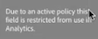

# Etiketter och profiler

>[!NOTE]
>
>Den här funktionen finns för närvarande i [begränsad testning](/help/release-notes/releases.md).

När du skapar en datauppsättning i Experience Platform kan du skapa [etiketter för dataanvändning](https://experienceleague.adobe.com/docs/experience-platform/data-governance/labels/reference.html?lang=en) för vissa eller alla element i datauppsättningen. Hittills har dessa etiketter inte exponerats i CJA. I den här versionen kan du visa dessa etiketter i CJA. Dessa är av särskilt intresse för CJA:

* The `C8` etikett - **[!UICONTROL No measurement]**. Den här etiketten anger att data inte kan användas för analys på organisationens webbplatser eller i appar.

* The `C12` etikett - **[!UICONTROL No General Data Export]**. Schemafält med den här etiketten kan inte exporteras eller hämtas från CJA (via rapportering, export, API, osv.)

Etikettering i sig innebär inte att dessa dataanvändningsetiketter används. Det är det policyer används för. Du skapar dina profiler via [API för principtjänst](https://experienceleague.adobe.com/docs/experience-platform/data-governance/api/overview.html?lang=en) i Experience Platform.

Två Adobe-definierade policyer används i CJA och påverkar rapportering och hämtning/delning:

* [!UICONTROL Enforce Analytics] policy
* [!UICONTROL Enforce Download] policy

## Visa dataetiketter i CJA-datavyer

Dataetiketter som har skapats i Experience Platform visas på tre platser i användargränssnittet för datavyer:

| Plats | Beskrivning |
| --- | --- |
| Informationsknappen i ett schemafält | Om du klickar på den här knappen visas vilka dataanvändningsetiketter som gäller för ett fält:
 |
| Höger räl under [Komponentinställningar](/help/data-views/component-settings/overview.md) | Etiketter för dataanvändning visas här:
 |
| Lägg till dataetiketter som en kolumn | Du kan lägga till dataetiketter som en kolumn i kolumnerna Inkluderade komponenter i datavyer. Klicka bara på ikonen för kolumnväljaren och välj Etiketter för dataanvändning:
 |

## Filtrera på datastyrningsetiketter i datavyer

I redigeraren för datavyer klickar du på ikonen Filter i det vänstra spåret och filtrerar datavykomponenter efter datastyrningsetikett/-er:

Klicka **[!UICONTROL Apply]** för att se vilka komponenter som har etiketter kopplade till sig.

## Filtrera på datastyrningsprinciper i datavyer

Du kan kontrollera om en profil är aktiverad som blockerar användningen av vissa CJA-datavytelement för analys eller export.

Klicka på ikonen Filter igen i den vänstra listen och klicka på Profiler under Datastyrning:

Klicka **[!UICONTROL Apply]** för att se vilka profiler som är aktiverade _för den här datavyn?_

## Hur [!UICONTROL Enforce Analytics] principen påverkar arbetsyteprojekt

Om den här principen är aktiverad kan de schemafält som har vissa dataetiketter (t.ex. C8) kopplade till sig inte användas för analysändamål i CJA-arbetsytan.

För rapportering innebär detta att

* Du kan inte lägga till dessa fält i datavyer, och de är nedtonade i den vänstra listen [!UICONTROL Schema fields] lista.
* Du kan inte spara en datavy som innehåller blockerade fält.

Om du försöker utföra en Workspace-analys på datavyer som innehåller objekt som inte får användas för analys visas ett meddelande som liknar detta:

För enskilda komponenter skulle meddelandet likna detta:

## Hur [!UICONTROL Enforce Download] principen påverkar arbetsyteprojekt

Om den här profilen är aktiverad kommer export eller nedladdning (till exempel e-post eller delning av PDF-filer) av Workspace-projekt att hash-koda de känsliga fälten. Du kan fortfarande analysera dessa fält i Workspace, men om du försöker skicka ett e-postmeddelande eller dela ett projekt på något annat sätt, kommer de blockerade fälten att visas som streckade objekt i PDF-filen.

Lägg till en skärmbild här.

## Visa etiketter i Report Builder

Se _det här avsnittet_ för mer information. (länk till Christine&#39;s doc)
