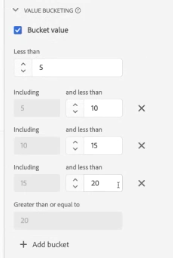

# Datavyer använder exempel

>[!IMPORTANT]
>
>Den här funktionen kommer att vara allmänt tillgänglig den 22 april 2021.

De här användningsexemplen visar flexibiliteten och kraften i datavyer i Customer Journey Analytics.

## Skapa ett ordermått från ett pageTitle-schemafält (sträng)

När du skapar en datavy kan du till exempel skapa ett [!UICONTROL Orders]-mått från ett [!UICONTROL pageTitle]-schemafält som är en sträng. Så här gör du:

1. På fliken Komponenter drar du [!UICONTROL pageTitle] till avsnittet [!UICONTROL Metrics] under [!UICONTROL Included Components].
   
1. Markera nu måttet som du just drog in och ge det ett nytt namn under [!UICONTROL Component Settings] till höger:
   
1. Öppna dialogrutan [!UICONTROL Include/Exclude Values] till höger och ange följande:
   

   &quot;Bekräftelsefrasen&quot; anger att detta är en order. När du har granskat alla sidrubriker där dessa kriterier uppfylls räknas &quot;1&quot; för varje förekomst. Resultatet är ett nytt mått (inte ett beräknat mått). Det fungerar med Attribution IQ, filter och var du än är kan du använda standardvärden.
1. Du kan ange en attribueringsmodell för det här måttet, till exempel [!UICONTROL Last Touch], med [!UICONTROL Lookback window] [!UICONTROL Session].
Du kan också skapa ytterligare ett [!UICONTROL Orders]-mått från samma fält och ange en annan attribueringsmodell för det, till exempel [!UICONTROL First Touch] och en annan [!UICONTROL Lookback window], till exempel [!UICONTROL 30 days].

## Använd heltal som dimensioner

Tidigare behandlades heltal automatiskt som mått i CJA. Nu kan siffror (inklusive anpassade händelser från Adobe Analytics) behandlas som dimensioner. Här är ett exempel:

1. Dra heltalet [!UICONTROL call_length_min] till avsnittet [!UICONTROL Dimensions] under [!UICONTROL Included Components]:

   

1. Nu kan du lägga till [!UICONTROL Value Bucketing] för att presentera den här dimensionen på ett paketerat sätt vid rapportering. (Utan att låsa visas varje instans av den här dimensionen som ett radobjekt i Workspace-rapporten.)

   

Mer information om andra datavyinställningar finns i [Skapa datavyer](/help/data-views/create-dataview2.md).
En konceptuell översikt över datavyer finns i [Översikt över datavyer](/help/data-views/data-views.md).