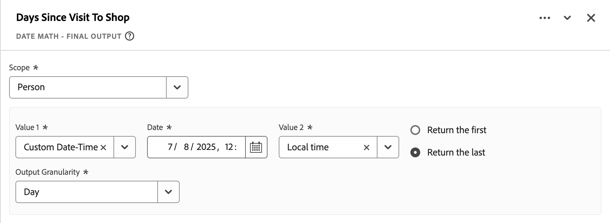

# Härledda fält (begränsad testning){#derived-fields}

{{release-limited-testing}}

>[!IMPORTANT]
>
>Detta är preliminär dokumentation om nya härledda fältfunktioner som ännu inte är allmänt tillgängliga. Använd den här informationen för att lära dig mer om de nya härledda fältsfunktionerna. Dokumentationen kan fortfarande ändras och inga rättsliga skyldigheter kan härledas från den aktuella versionen av den här artikeln.
>> I [Härledda fält](derived-fields.md) finns mer information om de härledda fältsfunktionerna i allmänhet och de tillgängliga funktionerna och funktionsmallarna.
>

## Funktionsreferens

{{select-package}}

För varje funktion som stöds finns information nedan:

- specifikationer:
   - Indatatyp: typ av data som stöds.
   - Indata: möjliga värden för indata.
   - inkluderade operatorer: operatorer som stöds för denna funktion (om sådana finns),
   - begränsningar: begränsningar som gäller för denna specifika funktion,
   - utdata.

- Användningsfall, inklusive
   - (valfria) uppgifter innan det härledda fältet definieras,
   - hur det härledda fältet definieras,
   - (valfria) data efter att du har definierat det härledda fältet.

- begränsningar (om tillämpligt).

<!-- DATE MATH -->

### Datummatematik {#datemath}

>[!CONTEXTUALHELP]
>id="dataview_derivedfields_datemath"
>title="Datummatematik"
>abstract="Med den här funktionen kan du returnera skillnaden mellan två datum- eller datum-/tidsfält."

Returnerar skillnaden mellan två datum- eller två datum-/tidsfält.

+++ Information

## Specifikationer {#datemath-io}

| Typ av indatadata | Indata | Operatorer som ingår | Begränsningar | Utdata |
|---|---|---|---|---|
| <ul><li>Datum</li><li>Datum-tid</li></ul> | <ul><li>[!UICONTROL Scope]<ul><li>Händelse</li><li>Session</li><li>Person</li></ul></li><li>[!UICONTROL Value]:<ul><li>Datum</li><li>Datum-tid</li><li>Statiskt datum (användaren angavs)</li><li>Statiskt datum/tid (användaren angavs)</li><li>Dynamiskt datum<ul><li>Idag</li></ul></li><li>Dynamisk datumtid<ul><li>Nu</li></ul></li></ul></li><li>[!UICONTROL Granularity]:<ul><li>Sekunder</li><li>Minuter</li><li>Timmar</li><li>Dagar</li><li>Veckor</li><li>Månader</li><li>Kvartal</li><li>År</li></ul></li><li>För varje datum- eller Date-time-retur:<ul><li>Första (under session eller person)</li><li>Senaste (under session eller person)</li></ul></li></ul> | 
Ej tillämpligt
 | 
2 funktioner per härlett fält
 | 
Nytt härlett fält
 |

{style="table-layout:auto"}

## Användningsfall 1 {#datemath-uc1}

Som marknadsföringsanalytiker för ett hotellföretag vill du förstå skillnaden mellan antalet dagar mellan kundernas incheckningsdatum och bokningsdatum under den senaste veckan.

### Härlett fält {#datemath-uc1-derivedfield}

Du definierar ett `Days between booking and check-in` härlett fält. Du använder funktionen [!UICONTROL DATE MATH] för att definiera en regel som beräknar dagar för [!UICONTROL Scope] [!DNL Person] mellan [!UICONTROL Booking Date] och [!UICONTROL Check-in Date]. Du väljer [!UICONTROL Day] som [!UICONTROL Output granularity]. Och du väljer [!UICONTROL Return the last] för både [!UICONTROL Booking Date] och [!UICONTROL Check-in Date] för att se till att det sista personomfångsvärdet används i beräkningen.

## Användningsfall 2 {#datemath-uc2}

Som marknadsföringsanalytiker av en tegelsten och murbruk vill ni förstå hur många dagar sedan som kunden senast besökte butiken. Du använder geopositioneringsfunktioner i en mobilapp och fyrar besökare i butiken för att fånga upp kundernas fysiska besök.

### Härlett fält {#datemath-uc2-derivedfield}

Du definierar ett nytt härlett `Days Since Visit To Shop`-fält. Du använder funktionen [!UICONTROL DATE MATH] för att definiera en regel som beräknar dagar mellan ett anpassat datum och tid (som du anger i [!UICONTROL Date]) och [!UICONTROL Local Time] (från fältgruppen [!UICONTROL placeContext] i händelsedatamängden) med [!UICONTROL Deduplication scope] [!UICONTROL Person] . Du väljer [!UICONTROL Return the last] för att se till att det sista personomfångsvärdet för [!UICONTROL Local time] används i beräkningen. Du väljer Dag som [!UICONTROL Output granularity].

## Användningsfall 3 {#datemath-uc3}

Du vill förstå söktiden i minuter innan en kund i en session gör en beställning.

Du definierar ett nytt härlett `Time Between Search And Order In Minutes`-fält som är resultatet av två [[!UICONTROL CASE WHEN] funktioner ](#case-when) som definierar [!UICONTROL Search Time] - och [!UICONTROL Order Time]-värden.
Sedan använder du dessa två värden för att beräkna skillnaden med en [!UICONTROL DATE MATH]-funktion med [!UICONTROL Scope] inställd på [!UICONTROL Session], värden inställda på [!UICONTROL Search Time] och [!UICONTROL Order Time] och [!UICONTROL Output granularity] inställda på [!UICONTROL Minute]. För båda värdena väljer du [!UICONTROL Return the first] för att säkerställa att den första [!UICONTROL Search Time] och [!UICONTROL Order Time] returneras.

<!--
| Visitor ID | Marketing Channel | Events |
|----|---|---:|
| ABC123 | paid search | 1 |
| DEF123 | email | 1 |
| JKL123 | natural search | 1 |

{style="table-layout:auto"}

-->

+++

<!-- DEPTH -->

### Djup {#depth}

>[!CONTEXTUALHELP]
>id="dataview_derivedfields_depth"
>title="Djup"
>abstract="Den här funktionen gör att du kan returnera djupet i vilket fält som helst, på samma sätt som standardkomponenten för händelsdjup."

Returnerar djupet i ett fält, ungefär som är möjligt med [standarddjupdimensionen ](/help/components/dimensions/overview.md#standard-dimensions) som är färdig att användas.

+++ Information

## Specifikationer {#depth-io}

| Typ av indatadata | Indata | Operatorer som ingår | Begränsningar | Utdata |
|---|---|---|---|---|
| Alla | Alla fält | Ej tillämpligt | 3 funktioner per härlett fält | Nytt härlett fält |

{style="table-layout:auto"}

<!--
## Example Data {#depth-example}

| event# | page name | search | product view | cart add  | order |
|:---:|---|:---:|:---:|:---:|:---:|
| 1 |  home page        |  0  | 0  | 0  | 0 |
| 2 |  search page      |  1  | 0  | 0  | 0 |
| 3 |  product page     |  0  | 0  | 0  | 0 |
| 4 |  cart page        |  0  | 0  | 1  | 0 |
| 5 |  confirmation     |  0  | 0  | 0  | 1 |

-->

## Använd skiftläge {#depth-uc1}

Du vill förstå sökdjupet (som du också kan tolka som antalet sökningar). Du kan använda sökdjupet senare för att söka efter söktermen som är kopplad till ett visst sökdjup.

### Härlett fält {#depth-uc1-derivedfield}

Du definierar ett nytt härlett `Search Depth`-fält. Du använder funktionen [!UICONTROL DEPTH] för att definiera en regel som hämtar djupet för [!UICONTROL Search] och lagrar det i ett nytt härlett fält.

+++

<!-- TYPECASE -->

### Typecast {#typecast}

>[!CONTEXTUALHELP]
>id="dataview_derivedfields_typecast"
>title="Typecast"
>abstract="Med den här funktionen kan du ändra fälttypen direkt för att göra fältet tillgängligt för ytterligare omformningar i Customer Journey Analytics."

Ändra fälttypen för ett fält så att det blir tillgängligt för ytterligare omformningar i Customer Journey Analytics.

+++ Information

## Specifikationer {#typecast-io}

| Typ av indatadata | Indata | Operatorer som ingår | Gräns | Utdata |
|---|---|---|---|---|
| <ul><li>Numeriskt</li><li>Datum</li><li>Datum-tid</li><li>Sträng</li></ul> | <ul><li>[!UICONTROL Field] | 
<ul><li>Heltal<ul><li>Till sträng <strong>(must)</strong></li></ul></li><li>Dubbel<ul><li>Till sträng <strong>(must)</strong><ul><li>Inkludera antal decimaler att ärva (max 5?)</li></ul></li><li>Till heltal <strong>(borde)</strong></li></ul></li><li>Byte<ul><li>Till sträng <strong>(must)</strong></li></ul></li><li>Lång<ul><li>Till sträng <strong>(must)</strong></li></ul></li><li>Datum<ul><li>Till sträng <strong>(must)</strong><ul><li>Möjlighet att definiera utdataformatet</li></ul></li><li>Exempel<ul><li>Datum (exempel 7 januari 2025)<ul><li data-stringify-indent="1" data-stringify-border="0">MM-DD-YY<ul><li data-stringify-indent="2" data-stringify-border="0">Ex. 01-07-25</li></ul></li><li data-stringify-indent="1" data-stringify-border="0">MM-DD-YYY<ul><li data-stringify-indent="2" data-stringify-border="0">Ex. 01-07-2025</li></ul></li><li data-stringify-indent="1" data-stringify-border="0">DD-MM-YY<ul><li data-stringify-indent="2" data-stringify-border="0">Ex. 07-01-25</li></ul></li><li data-stringify-indent="1" data-stringify-border="0">DD-MM-YYY<ul><li data-stringify-indent="2" data-stringify-border="0">Ex. 07-01-2025</li></ul></li><li data-stringify-indent="1" data-stringify-border="0">YY-MM-DD<ul><li data-stringify-indent="2" data-stringify-border="0">Ex. 25-01-07</li></ul></li><li data-stringify-indent="1" data-stringify-border="0">YYY-MM-DD<ul><li data-stringify-indent="2" data-stringify-border="0">Ex. 2025-01-07</li></ul></li><li data-stringify-indent="1" data-stringify-border="0">MM/DD/YY<ul><li data-stringify-indent="2" data-stringify-border="0">Ex. 01/07/25</li></ul></li><li data-stringify-indent="1" data-stringify-border="0">MM/DD/ÅÅÅ<ul><li data-stringify-indent="2" data-stringify-border="0">Ex. 01/07/2025</li></ul></li><li data-stringify-indent="1" data-stringify-border="0">YYYY/MM/DD<ul><li data-stringify-indent="2" data-stringify-border="0">Ex. 2025/01/07</li></ul></li><li data-stringify-indent="1" data-stringify-border="0">YY/MM/DD<ul><li data-stringify-indent="2" data-stringify-border="0">Ex. 25/01/07</li></ul></li><li data-stringify-indent="1" data-stringify-border="0">DD MMM YYYY<ul><li data-stringify-indent="2" data-stringify-border="0">Ex. 7 januari 2025</li></ul></li></ul></li></ul></li></ul></li><li>Datum-tid<ul><li>Till sträng <strong>(must)</strong><ul><li>Möjlighet att definiera utdataformatet</li></ul></li><li>Exempel<ul><li data-stringify-indent="0" data-stringify-border="0">Datum-Tid (Exempel på 7 januari 2025 vid 1:30pm, 52 sekunder)<ul><li data-stringify-indent="2" data-stringify-border="0">MM-DD-YY-ttmmss<ul><li data-stringify-indent="3" data-stringify-border="0">Ex. 01-07-25 13:30:52</li></ul></li><li data-stringify-indent="2" data-stringify-border="0">MM-DD-YYYY-ttmmss<ul><li data-stringify-indent="3" data-stringify-border="0">Ex. 01-07-2025 13:30:52</li></ul></li><li data-stringify-indent="2" data-stringify-border="0">DD-MM-YY-ttmmss<ul><li data-stringify-indent="3" data-stringify-border="0">Ex. 07-01-25 13:30:52</li></ul></li><li data-stringify-indent="2" data-stringify-border="0">DD-MM-ÅÅÅÅ-ttmmss<ul><li data-stringify-indent="3" data-stringify-border="0">Ex. 07-01-2025 13:30:52</li></ul></li><li data-stringify-indent="2" data-stringify-border="0">YY-MM-DD ttmmss<ul><li data-stringify-indent="3" data-stringify-border="0">Ex. 25-01-07 13:30:52</li></ul></li><li data-stringify-indent="2" data-stringify-border="0">YYYY-MM-DD ttmmss<ul><li data-stringify-indent="3" data-stringify-border="0">Ex. 2025-01-07 13:30:52</li></ul></li><li data-stringify-indent="2" data-stringify-border="0">MM/DD/YY-ttmmss<ul><li data-stringify-indent="3" data-stringify-border="0">Ex. 01/07/25 13:30:52</li></ul></li><li data-stringify-indent="2" data-stringify-border="0">MM/DD/ÅÅÅÅ-ttmmmm<ul><li data-stringify-indent="3" data-stringify-border="0">Ex. 01/07/2025 13:30:52</li></ul></li><li data-stringify-indent="2" data-stringify-border="0">YYYY/MM/DD ttmmss<ul><li data-stringify-indent="3" data-stringify-border="0">Ex. 13:30:52</li></ul></li><li data-stringify-indent="2" data-stringify-border="0">YY/MM/DD hh:mm :ss<ul><li data-stringify-indent="3" data-stringify-border="0">Ex. 25/01/07 13:30:52</li></ul></li><li data-stringify-indent="2" data-stringify-border="0">MMM DD, YYYY ttmmss<ul><li data-stringify-indent="3" data-stringify-border="0">Ex. 7 januari 2025 13:30:52</li></ul></li></ul></li></ul></li><li>Sträng<ul><li>Till numeriskt <strong>(borde)</strong><ul><li>Om vi har värden som inte är numeriska till sin natur returneras null.</li><li>Användaren måste ange den precision och det språk som ska användas. </li></ul></li></ul></li></ul></li></ul>
 | 
3 funktioner per härlett fält
 | 
Nytt härlett fält
 |

{style="table-layout:auto"}

## Användningsfall 1 {#typecast-uc1}

Du har ett heltalsfält, skärmshöjd (till exempel device.screenHeight från din händelsedatamängd), som du vill använda som en strängbaserad dimension.

### Härlett fält {#typecast-uc1-derivedfield}

Du definierar ett `Screen Height` härlett fält. Du använder funktionen [!UICONTROL TYPECAST] för att definiera en regel för [!UICONTROL Typecast to] [!UICONTROL String] i fältet [!UICONTROL Screen height] och lagra den i det nya härledda fältet.

## Användningsfall 2 {#typecast-uc2}

Du vill använda Intäkter i en kohorttabell (som bara har stöd för heltal), men fältet Intäkter har typen Dubbel.

### Härlett fält {#typecast-uc2-derivedfield}

Du definierar ett `Revenue (integer)` härlett fält. Du använder funktionen [!UICONTROL TYPECAST] för att definiera en regel för [!UICONTROL Typecast to] [!UICONTROL Integer] i fältet [!UICONTROL Revenue] och lagra den i det nya härledda fältet.

+++
