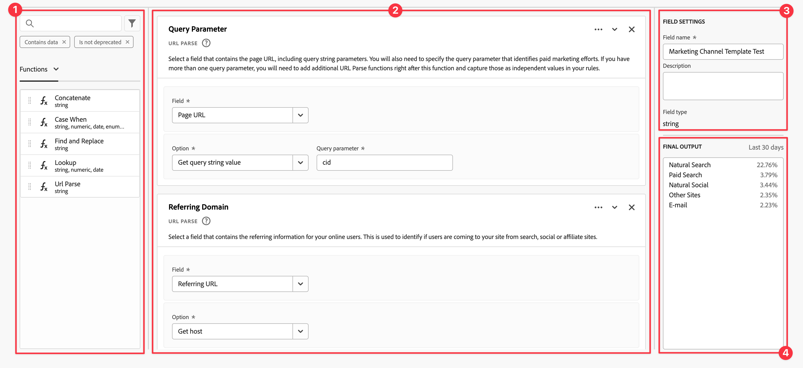

# Härledda fält

Härledda fält är en viktig del av realtidsrapportfunktionen i Customer Journey Analytics (CJA). Med ett härlett fält kan du definiera (ofta komplexa) dataändringar direkt, via en anpassningsbar regelbyggare. Du kan sedan använda det härledda fältet som en komponent (mått eller dimension) i [Arbetsyta](../../analysis-workspace/home.md) eller ännu mer definiera det härledda fältet som en komponent i [Datavy](../data-views.md).

Härledda fält kan spara mycket tid och arbete jämfört med att omforma eller ändra data på andra platser än CJA. Som [Dataprep](https://experienceleague.adobe.com/docs/experience-platform/data-prep/home.html), [Data Distiller](https://experienceleague.adobe.com/docs/experience-platform/query/data-distiller/overview.html?lang=en)eller i dina egna ETL-/ELT-processer.

Härledda fält definieras i [Datavyer](../data-views.md), baseras på en uppsättning funktioner som definieras som regler och tillämpas på tillgängliga standard- och/eller schemafält.

Exempel:

- Definiera ett härlett sidnamnsfält som korrigerar felaktiga insamlade sidnamnsvärden för att korrigera sidnamnsvärden.

- Definiera ett härlett fält för marknadsföringskanal som fastställer rätt marknadsföringskanal baserat på ett eller flera villkor (t.ex. URL-parameter, sidadress, sidnamn).

## Härlett fältgränssnitt

När du skapar eller redigerar ett härlett fält använder du det härledda fältgränssnittet.

|  | Namn | Beskrivning |
|---------|----------|--------|
| 1 | **Väljare** | Du använder väljarområdet för att markera och dra och släppa funktionen, funktionsmallen, schemafältet eller standardfältet till regelbyggaren.  Använd listrutan för att välja mellan:   [!UICONTROL Functions] - listor tillgängliga [funktioner](#function-reference),   [!UICONTROL Function templates] - listor tillgängliga [funktionsmallar](#function-templates),    [!UICONTROL Schema fields] - listar fält som är tillgängliga från datauppsättningskategorier (händelse, profil, sökning) och tidigare definierade härledda fält, och   [!UICONTROL Standard fields] - standardfält (t.ex. ID för plattformsdatauppsättning). Endast strängfält och numeriska standardfält visas i väljaren. Om funktionen stöder andra datatyper kan standardfält med dessa andra datatyper väljas för värden eller fält i regelgränssnittet. Du kan söka efter funktioner, funktionsmallar, schema och standardfält med  Sökruta.  Du kan filtrera den markerade objektlistan genom att välja  Filtrera och ange filter i [!UICONTROL Filter fields by] -dialogrutan. Du kan enkelt ta bort filter med  för varje filter. |
| 2 | **Regelverktyget** | Du skapar det härledda fältet sekventiellt med en eller flera regler. En regel är en specifik implementering av en funktion och är därför alltid kopplad till endast en funktion. Du skapar en regel genom att dra och släppa en funktion i regelbyggaren. Funktionstypen bestämmer regelns gränssnitt. Se [Regelgränssnitt](#rule-interface) för mer information.  Du kan infoga en funktion i början, slutet eller mellan regler som redan finns i regelbyggaren. Den sista regeln i regelbyggaren avgör det härledda fältets slutliga utdata. |
| 3 | **[!UICONTROL ** Fältinställningar **]** | Du kan namnge och beskriva det härledda fältet och kontrollera dess fälttyp. |
| 4 | **[!UICONTROL ** Slutlig utmatning **]** | I det här området visas en direkt uppdaterad förhandsvisning av utdatavärden, baserat på data under de senaste 30 dagarna och de ändringar du gör i det härledda fältet i regelbyggaren. |

{style="table-layout:auto"}

## Guiden Fältmall

När du använder det härledda fältgränssnittet för första gången [!UICONTROL Start with a field template] guiden visas.

1. Välj den mall som bäst beskriver den typ av fält som du försöker skapa.
2. Välj **[!UICONTROL ** Välj **]** för att fortsätta

Dialogrutan för det härledda fältet innehåller regler (och funktioner) som är nödvändiga eller användbara för den typ av fält som du har valt. Se [Funktionsmallar](#function-templates) om du vill ha mer information om de tillgängliga mallarna.

## Regelgränssnitt

När du definierar en regel i regelbyggaren använder du regelgränssnittet.

|  | Namn | Beskrivning |
|---------|----------|--------|
| A | **Regelnamn** | Regelnamnet är som standard **Regel X** (X refererar till ett sekvensnummer). Om du vill redigera namnet på en regel markerar du dess namn och skriver in det nya namnet, till exempel `Query Parameter`. |
| B | **Funktionsnamn** | Det valda funktionsnamnet för regeln, till exempel [!UICONTROL URL PARSE]. När funktionen är den sista i funktionssekvensen och fastställer de slutliga utdatavärdena följs funktionsnamnet av [!UICONTROL - FINAL OUTPUT], till exempel [!UICONTROL URL PARSE - FINAL OUTPUT].  Om du vill visa ett popup-fönster med mer information om funktionen väljer du . |
| C | **Regelbeskrivning** | Du kan också lägga till en beskrivning till en regel. Välj väljer **[!UICONTROL ** Lägg till beskrivning **]** för att lägga till en beskrivning eller **[!UICONTROL ** Redigera beskrivning **]** om du vill redigera en befintlig beskrivning. Använd redigeraren för att ange en beskrivning. Du kan använda verktygsfältet för att formatera texten (med formatväljare, fet, kursiv, understrykning, höger, vänster, centrerad, färg, nummerlista, punktlista) och lägga till länkar till extern information.  Klicka utanför redigeraren för att slutföra redigeringen av beskrivningen. |
| D | **Funktionsområde** | Definierar funktionens logik. Gränssnittet beror på funktionstypen. Listrutan för [!UICONTROL Field] eller [!UICONTROL Value] visar alla kategorier av fält (regler, standardfält, fält) som är tillgängliga, baserat på den typ av indata som funktionen förväntar sig. Se [Funktionsreferens](#function-reference) Detaljerad information om varje funktion som stöds. |

{style="table-layout:auto"}

## Skapa ett härlett fält

1. Välj en befintlig datavy eller skapa en datavy. Se [Datavyer](../data-views.md) för mer information.

2. Välj **[!UICONTROL ** Komponenter **]** i datavyn.

3. Välj **[!UICONTROL ** Skapa härlett fält **]** från den vänstra listen.

4. Använd [!UICONTROL Create derived field] gränssnitt. Se [Härlett fältgränssnitt](#derived-field-interface).

   Om du vill spara ditt nya härledda fält väljer du **[!UICONTROL ** Spara **]**.

5. Ditt nya härledda fält läggs till i [!UICONTROL Derived fields >] behållare, som en del av **[!UICONTROL ** Schemafält **]** till vänster i datavyn.

## Redigera ett härlett fält

1. Välj en befintlig datavy. Se [Datavyer](../data-views.md) för mer information.

2. Välj **[!UICONTROL ** Komponenter **]** i datavyn.

3. Välj **[!UICONTROL ** Schemafält **]** i [!UICONTROL Connection] till vänster.

4. Välj **[!UICONTROL ** Härledda fält >**]** behållare.

5. Håll pekaren över det härledda fält som du vill redigera och markera .

6. Om du vill redigera det härledda fältet använder du [!UICONTROL Edit derived field] gränssnitt. Se [Härlett fältgränssnitt](#derived-field-interface).

   - Välj **[!UICONTROL ** Spara **]** för att spara det uppdaterade härledda fältet.

   - Välj **[!UICONTROL ** Avbryt **]** om du vill avbryta alla ändringar du har gjort i det härledda fältet.

   - Välj **[!UICONTROL ** Spara som **]** för att spara det härledda fältet som ett nytt härlett fält. Det nya härledda fältet har samma namn som det ursprungliga redigerade härledda fältet med `(copy)` läggs till i den.

## Ta bort ett härlett fält

1. Välj en befintlig datavy. Se [Datavyer](../data-views.md) för mer information.

2. Välj **[!UICONTROL ** Komponenter **]** i datavyn.

3. Välj **[!UICONTROL ** Schemafält **]** tabba in [!UICONTROL Connection] fönster.

4. Välj **[!UICONTROL ** Härledda fält >**]** behållare.

5. Håll pekaren över det härledda fält som du vill ta bort och markera .

6. Används **[!UICONTROL ** Redigera härlett fält **]** väljer du Ta bort.

   A [!UICONTROL Delete component] uppmanas du att bekräfta borttagningen. Ta hänsyn till eventuella externa referenser som finns till det härledda fältet utanför datavyn.

   - Välj **[!UICONTROL ** Fortsätt **]** för att ta bort det härledda fältet.

>[!NOTE]
>
>Härledda fält hanteras på anslutningsnivå i CJA. Alla ändringar som görs i ett härlett fält i någon av de datavyer som är kopplade till anslutningen gäller för alla dessa associerade datavyer.

## Funktionsmallar

Funktionsmallar är tillgängliga för att snabbt skapa ett härlett fält för specifika användningsområden. Dessa funktionsmallar kan nås från väljarområdet i det härledda fältgränssnittet eller presenteras vid första användningen i [!UICONTROL Start with a field template] guide.

### Marknadsföringskanaler

Den här mallen är konfigurerad att använda [URL-parsning](#dnl-url-parse) och [Skiftläge](#dnl-case-when) används flera gånger för att hämta lämpliga värden från en URL. Logiken tillämpas sedan på dessa värden för att koppla URL:en till en viss marknadsföringskanal.

+++ Detaljer

Om du vill använda mallen måste du ange rätt parametrar för varje funktion som listas som en del av reglerna i mallen. Se [Funktionsreferens](#function-reference) för mer information.

+++

<!--

+++ Data clean up template

>[!WARNING]
>
>Could not find any information on this template.
+++

-->

## Funktionsreferens

För varje funktion som stöds finns information nedan:

- specifikationer:
   - datatyp: typ av data som stöds,
   - indata: möjliga värden för indata,
   - inkluderade operatorer: operatorer som stöds för denna funktion (om sådana finns),
   - begränsningar: begränsningar som gäller för denna specifika funktion,
   - utdata.

- Användningsfall, inklusive
   - data innan det härledda fältet definieras,
   - hur det härledda fältet definieras,
   - efter att ha definierat det härledda fältet.

- begränsningar (om tillämpligt).

<!-- Concatenate -->

### Sammanfoga

Kombinerar två eller flera fält, härledda fält eller användarinmatade värden till ett enda fält med definierade avgränsare.

+++ Detaljer

## Specifikationer {#concatenate-io}

| Typ av indatadata | Indata | Operatorer som ingår | Begränsningar | Utdata |
|---|---|---|---|---|
| 
Sträng
 | <ul><li>För varje [!UICONTROL Value]:<ul><li>Regel</li><li>Standardfält</li><li>Fält</li><li>Användarinmatade indata</li></ul></li><li>För varje [!UICONTROL Delimiter]:<ul><li>Användarinmatade indata</li></ul></li> </ul> | 
Ej tillämpligt
 | 
2 funktioner per härlett fält
 | 
Nytt härlett fält
 |

{style="table-layout:auto"}

## Använd skiftläge {#concatenate-uc}

Du samlar för närvarande in kod för ursprung och destinationsflygplats som separata fält. Du vill använda de två fälten och kombinera dem till ett enda mått, avgränsade med ett bindestreck (-). Så att du kan analysera kombinationen av ursprung och mål för att identifiera de vanligaste rutterna som bokats.

Antaganden:

- Origo- och målvärden samlas i separata fält i samma tabell.
- Användaren bestämmer sig för att använda avgränsaren &#39;-&#39; mellan värdena.

Tänk dig följande bokningar:

- Kund ABC123 bokar en flygning mellan Salt Lake City (SLC) och Orlando (MCO)
- Kund ABC456 bokar ett flyg mellan Salt Lake City (SLC) och Los Angeles (LAX)
- Kund ABC789 bokar ett flyg mellan Salt Lake City (SLC) och Seattle (SEA)
- Kund ABC987 bokar ett flyg mellan Salt Lake City (SLC) och San Jose (SJO)
- Kund ABC654 bokar en flygning mellan Salt Lake City (SLC) och Orlando (MCO)

Rapporten ska se ut så här:

| Ursprung / Mål | Bokningar |
|----|---:|
| SLC-MCO | 2 |
| SLC-LAX | 1 |
| SLC-SEA | 1 |
| SLC-SJO | 1 |

{style="table-layout:auto"}

### Data före {#concatenate-uc-databefore}

| Ursprung | Mål |
|----|---:|
| SLC | MCO |
| SLC | LAX |
| SLC | SEA |
| SLC | SJO |
| SLC | MCO |

{style="table-layout:auto"}

### Härlett fält {#concatenate-derivedfield}

Du definierar ett nytt [!UICONTROL Origin - Destination] härlett fält. Du använder [!UICONTROL CONCATENATE] funktion som definierar en regel som sammanfogar [!UICONTROL Original] och [!UICONTROL Destination] fält med `-` [!UICONTROL Delimiter].

### Data efter {#concatenate-dataafter}

| Ursprung - destination (härlett fält) |
|---|
| SLC-MCO |
| SLC-LAX |
| SLC-SEA |
| SLC-SJO |
| SLC-MCO |

{style="table-layout:auto"}

+++

<!-- CASE WHEN -->

### Skiftläge

Använder villkorliga värden som baseras på definierade villkor från ett eller flera fält. Dessa kriterier används sedan för att definiera värdena i ett nytt härlett fält, baserat på villkorens sekvens.

+++ Detaljer

## Specifikationer {#casewhen-io}

| Typ av indatadata | Indata | Operatorer som ingår | Begränsningar | Utdata |
|---|---|---|---|---|
| <ul><li>Sträng</li><li>Numeriskt</li><li>Datum</li></ul> | <ul><li>För varje [!UICONTROL If], [!UICONTROL Else If] container:
<ul><li>[!UICONTROL Value]</li><ul><li>Regel</li><li>Standardfält</li><li>Fält</li></ul><li>[!UICONTROL Criterion] (se inkluderade operatorer, baserat på vald värdetyp)</li></ul></li><li>För varje [!UICONTROL Then set value to], [!UICONTROL Otherwise set value to]:
<ul><li>[!UICONTROL Value]</li><ul><li>Regel</li><li>Standardfält</li><li>Fält</li></ul></ul></li></ul> | 
Strängar
<ul><li>Är lika med</li><li>Liknar alla termer</li><li>Innehåller frasen</li><li>Innehåller valfri term</li><li>Innehåller alla termer</li><li>Börjar med</li><li>Börjar med valfri term</li><li>Slutar med</li><li>Slutar med valfri term</li><li>Är inte lika med</li><li>Motsvarar inte någon term</li><li>Innehåller inte frasen</li><li>Innehåller inga termer</li><li>Innehåller inte alla termer</li><li>Börjar inte med</li><li>Börjar inte med någon term</li><li>Slutar inte med</li><li>Slutar inte med någon term</li><li>Är inställd</li><li>Har inte angetts</li></ul>
Numeriskt
<ul><li>Är lika med</li><li>Är inte lika med</li><li>Är större än</li><li>Är större än eller lika med</li><li>Är mindre än</li><li>Är mindre än eller lika med</li><li>Är inställd</li><li>Har inte angetts</li></ul>
Datum
<ul><li>Är lika med</li><li>Är inte lika med</li><li>Är senare än</li><li>Är senare än eller lika med</li><li>Är före</li><li>Är före eller lika med</li><li>Är inställd</li><li>Har inte angetts</li></ul> | <ul><li>5 funktioner per härlett fält</li><li>200 operatorer per härlett fält. Ett exempel på en enskild operator är &#39;Referensdomän innehåller google&#39;. </li></ul> | 
Nytt härlett fält
 |

{style="table-layout:auto"}

## Användningsfall 1 {#casewhen-uc1}

Du vill definiera regler för att identifiera olika marknadsföringskanaler genom att tillämpa överlappande logik för att ange ett marknadsföringskanalfält till rätt värde:

- Om referenten kommer från en sökmotor och sidan har ett frågesträngsvärde där `cid` innehåller `ps_`bör marknadsföringskanalen identifieras som en [!DNL *Betalsökning*].
- Om referenten kommer från en sökmotor och sidan inte har frågesträngen `cid`bör marknadsföringskanalen identifieras som en [!DNL *Naturlig sökning*].
- Om en sida har ett frågesträngsvärde där `cid` innehåller `em_`bör marknadsföringskanalen identifieras som en [!DNL *E-post*].
- Om en sida har ett frågesträngsvärde där `cid` innehåller `ds_`bör marknadsföringskanalen identifieras som en [!DNL *Visa annons*].
- Om en sida har ett frågesträngsvärde där `cid` innehåller `so_`bör marknadsföringskanalen identifieras som en [!DNL *Betald social*].
- Om referenten kommer från en hänvisande domän till [!DNL twitter.com], [!DNL facebook.com], [!DNL linkedin.com], eller [!DNL tiktok.com]bör marknadsföringskanalen identifieras som en [!DNL *Naturlig social*].
- Om ingen av ovanstående regler överensstämmer bör marknadsföringskanalen identifieras som [!DNL *Annan referent*].

Om din plats får följande exempelhändelser, som innehåller [!UICONTROL Referrer] och [!UICONTROL Page URL]bör dessa händelser identifieras enligt följande:

| [!DNL Event] | [!DNL Referrer] | [!DNL Page URL] | [!DNL Marketing Channel] |
|:--:|----|----|----|
| 1 | `https://facebook.com` | `https://site.com/home` | [!DNL Natural Social] |
| 2 | `https://abc.com` | `https://site.com/?cid=ds_12345678` | [!DNL Display] |
| 3 | | `https://site.com/?cid=em_12345678` | [!DNL Email] |
| 4 | `https://google.com` | `https://site.com/?cid=ps_abc098765` | [!DNL Paid Search] |
| 5 | `https://google.com` | `https://site.com/?cid=em_765544332` | [!DNL Email] |
| 6 | `https://google.com` |  | [!DNL Natural Search] |

{style="table-layout:auto"}

### Data före {#casewhen-uc1-databefore}

| [!DNL Referrer] | [!DNL Page URL] |
|----|----|
| `https://facebook.com` | `https://site.com/home` |
| `https://abc.com` | `https://site.com/?cid=ds_12345678` |
|  | `https://site.com/?cid=em_12345678` |
| `https://google.com` | `https://site.com/?cid=ps_abc098765` |
| `https://google.com` | `https://site.com/?cid=em_765544332` |
| `https://google.com` |

{style="table-layout:auto"}

### Härlett fält {#casewhen-uc1-derivedfield}

Du definierar ett nytt `Marketing Channel` härlett fält. Du använder [!UICONTROL CASE WHEN] funktioner för att definiera regler som skapar värden för den baserat på befintliga värden för båda `Page URL` och `Referring URL` fält.

Observera hur funktionen används [!UICONTROL URL PARSE] för att definiera regler för hämtning av värden för `Page Url` och `Referring Url` före [!UICONTROL CASE WHEN] regler tillämpas.

### Data efter {#casewhen-uc1-dataafter}

| [!DNL Marketing Channel] |
|----|
| [!DNL Natural Social] |
| [!DNL Display] |
| [!DNL Email] |
| [!DNL Paid Search] |
| [!DNL Email] |
| [!DNL Natural Search] |

{style="table-layout:auto"}

## Användningsfall 2 {#casewhen-uc2}

Du har samlat in flera olika varianter av sökningar i [!DNL Product Finding Methods] dimension. Om du vill förstå det övergripande resultatet för sökning och bläddring måste du lägga mycket tid på att kombinera resultaten manuellt.

Din webbplats samlar in följande värden för din [!DNL Product Finding Methods] dimension. Alla dessa värden anger slutligen en sökning.

| Insamlat värde | Faktiskt värde |
|---|---|
| [!DNL search p13n_no] | [!DNL search] |
| [!DNL search p13n_yes] | [!DNL search] |
| [!DNL search refine p13n_no] | [!DNL search] |
| [!DNL search refine p13n_yes] | [!DNL search] |
| [!DNL search redirect p13n_yes] | [!DNL search] |
| [!DNL search-redirect] | [!DNL search] |

{style="table-layout:auto"}

### Data före {#casewhen-uc2-databefore}

| [!DNL Product Finding Methods] |
|----|
| [!DNL search p13_no] |
| [!DNL search p13_yes] |
| [!DNL browse] |
| [!DNL search refine p13_no] |
| [!DNL search refine p13_yes] |
| [!DNL browse] |
| [!DNL search redirect p13_yes] |
| [!DNL search-redirect] |
| [!DNL browse] |

{style="table-layout:auto"}

### Härlett fält {#casewhen-uc2-derivedfield}

Du definierar en `Product Finding Methods (new)` härlett fält. Du skapar följande [!UICONTROL CASE WHEN] regler i regelbyggaren. Dessa regler tillämpar logik för alla möjliga varianter av det gamla [!UICONTROL Product Finding Methods] fältvärden för `search` och `browse` med [!UICONTROL Contains the phrase] kriterium.

### Data efter {#casewhen-uc2-dataafter}

| [!DNL Product Finding Methods (new)] |
|----|
| [!DNL search] |
| [!DNL search] |
| [!DNL browse] |
| [!DNL search] |
| [!DNL search] |
| [!DNL browse] |
| [!DNL search] |
| [!DNL search] |
| [!DNL browse] |

{style="table-layout:auto"}

## Användningsfall 3 {#casewhen-uc3}

Som reseföretag vill du korta resetiden för bokade resor så att du kan rapportera om hur långa resorna är.

Antaganden:

- Organisationen samlar ihop resans varaktighet till ett numeriskt fält.
- De skulle vilja lägga in 1-3 dagars varaktighet i en hink som kallas[!DNL short trip]&#39;
- De skulle vilja lägga in 4-7 dagars varaktighet i en hink som kallas[!DNL medium trip]&#39;
- De vill lägga in mer än 8 dagars varaktighet i en hink som kallas[!DNL long trip]&#39;
- 132 resor bokades för en dag
- 110 resor bokades för en tvådagarsperiod
- 105 resor bokades för en 3-dagarsperiod
- 99 resor var bokade i 4 dagar
- 92 resor bokades för en femdagarsperiod
- 85 resor bokades för en sexdagarsperiod
- 82 resor bokades för en 7-dagarsperiod
- 78 resor var bokade i 8 dagar
- 50 resor bokades för en 9-dagarsperiod
- 44 resor bokades under en 10-dagarsperiod
- 38 resor bokades för en 11-dagarsperiod
- 31 resor bokades för en tolvdagarsperiod

Din rapport ska se ut så här:

| [!DNL Trip Duration Type] | [!DNL Bookings] |
|----|---:|
| [!DNL medium trip] | 358 |
| [!DNL short trip] | 347 |
| [!DNL long trip] | 241 |

{style="table-layout:auto"}

### Data före {#casewhen-uc3-databefore}

| [!DNL Trip Duration] |
|---:|
| 1 |
| 12 |
| 3 |
| 6 |
| 4 |
| 8 |
| 6 |
| 2 |
| 1 |
| 2 |
| 21 |
| 8 |

### Härlett fält {#casewhen-uc3-derivedfield}

Du definierar en `Trip Duration (bucketed)` härlett fält. Du skapar följande [!UICONTROL CASE WHEN] regel i regelbyggaren. Den här regeln använder logik för att bucket den gamla [!UICONTROL Trip Duration] fältvärden i tre värden: `short trip`, `medium  trip`och `long trip`.

### Data efter {#casewhen-uc3-dataafter}

| [!DNL Trip Duration (bucketed)] |
|---|
| [!DNL short trip] |
| [!DNL long trip] |
| [!DNL short trip] |
| [!DNL medium trip] |
| [!DNL medium trip] |
| [!DNL long trip] |
| [!DNL medium trip] |
| [!DNL short trip] |
| [!DNL short trip] |
| [!DNL short trip] |
| [!DNL long trip] |
| [!DNL long trip] |

## Begränsningar

CJA använder en kapslad behållarstruktur, som bygger på Adobe Experience Platform [XDM](https://experienceleague.adobe.com/docs/experience-platform/xdm/home.html?lang=sv) (Experience Data Model). Se [Behållare](../create-dataview.md#containers) och [Filterbehållare](../../components/filters/filters-overview.md#filter-containers) för mer bakgrundsinformation. Den här behållarmodellen är flexibel till sin natur men medför vissa begränsningar när regelverktyget används.

CJA använder följande standardbehållarmodell:

Följande begränsningar gäller och används när *markera* och *inställning* värden.

|  | Begränsningar |
|:---:|----|
| **A** | Värden du *välj* inom samma [!UICONTROL If], [!UICONTROL Else If] construct (med [!UICONTROL And] eller [!UICONTROL Or]) i en regel måste komma från samma behållare och kan vara av valfri typ (sträng) , numerisk och så vidare).   |
| **B** | Alla värden du anger *set* över en regel måste komma från samma behållare och ha samma typ eller ett härlett värde av samma typ.    |
| **C** | Värdena du *välj* tvärs över [!UICONTROL If], [!UICONTROL Else If] i regeln do *not* måste komma från samma behållare och gör *not* måste vara av samma typ.    |

{style="table-layout:auto"}

+++

<!-- FIND AND REPLACE -->

### Sök och ersätt

Söker efter alla värden i ett markerat fält och ersätter dessa värden med ett annat värde i ett nytt härlett fält.

+++ Detaljer

## Specifikationer {#findreplace-io}

| Typ av indatadata | Indata | Operatorer som ingår | Begränsningar | Utdata |
|---|---|---|---|---|
| 
Sträng
 | <ul><li>För kriterier:<ul><li>[!UICONTROL Value]<ul><li>Regel</li><li>Standardfält</li><li>Fält</li></ul></li></ul></li><li>För varje [!UICONTROL Find all], [!UICONTROL and replace all with]:<ul><li>[!UICONTROL Value]</li><ul><li>Användarinmatade indata</li></ul></li></ul></ul> | 
Strängar
<ul><li>[!UICONTROL Find all], [!UICONTROL and replace all with]</li></ul> | 
5 funktioner per härlett fält
 | 
Nytt härlett fält
 |

{style="table-layout:auto"}

## Använd skiftläge {#findreplace-uc}

Du har fått felaktiga värden för din rapport om externa marknadsföringskanaler, till exempel `email%20 marketing` i stället för `email marketing`. Dessa felformaterade värden utgör en del av rapporteringen och gör det svårare att se hur e-postmeddelanden fungerar. Du vill ersätta `email%20marketing` med `email marketing`.

**Ursprunglig rapport**

| [!DNL External Marketing Channels] | [!DNL Sessions] |
|---|--:|
| [!DNL email marketing] | 500 |
| [!DNL email %20marketing] | 24 |

{style="table-layout:auto"}

**Önskad rapport**

| [!DNL External Marketing Channels] | [!DNL Sessions] |
|---|--:|
| [!DNL email marketing] | 524 |

### Data före {#findreplace-uc-databefore}

| [!DNL External Marketing] |
|----|
| [!DNL email marketing] |
| [!DNL email%20marketing] |
| [!DNL email marketing] |
| [!DNL email marketing] |
| [!DNL email%20marketing] |

{style="table-layout:auto"}

### Härlett fält {#findreplace-uc-derivedfield}

Du definierar en `Email Marketing (updated)` härlett fält. Du använder [!UICONTROL FIND AND REPLACE] funktion för att definiera en regel för att söka efter och ersätta alla förekomster av `email%20marketing` med `email marketing`.

### Data efter {#findreplace-uc-dataafter}

| [!DNL External Marketing (updated)] |
|----|
| [!DNL email marketing] |
| [!DNL email marketing] |
| [!DNL email marketing] |
| [!DNL email marketing] |
| [!DNL email marketing] |

{style="table-layout:auto"}

+++

<!-- LOOKUP -->

### Sök

Definierar en uppsättning uppslagsvärden som ersätts av motsvarande värden.

+++ Detaljer

## Specifikationer {#lookup-io}

| Typ av indatadata | Indata | Operatorer som ingår | Begränsningar | Utdata |
|---|---|---|---|---|
| <ul><li>Sträng</li><li>Numeriskt</li><li>Datum</li></ul> | <ul><li>För [!UICONTROL Field to apply lookup]:<ul><li>Regel</li><li>Standardfält</li><li>Fält</li></ul></li><li>För [!UICONTROL When value equals] och [!UICONTROL Replace values with]:
<ul><li>Användarinmatade indata</li></ul></li></ul> | 
Ej tillämpligt
 | 
5 funktioner per härlett fält
 | 
Nytt härlett fält
 |

{style="table-layout:auto"}

## Användningsfall 1 {#lookup-uc1}

Du har en CSV-fil som innehåller en nyckelkolumn för `hotelID` och en eller flera kolumner som är associerade med `hotelID`: `city`, `rooms`, `hotel name`.
Du samlar in [!DNL Hotel ID] i en dimension men vill skapa en [!DNL Hotel Name] dimension härledd från `hotelID` i CSV-filen.

**CSV-filstruktur och innehåll**

| [!DNL hotelID] | [!DNL city] | [!DNL rooms] | [!DNL hotel name] |
|---|---|---:|---|
| [!DNL SLC123] | [!DNL Salt Lake City] | 40 | [!DNL SLC Downtown] |
| [!DNL LAX342] | [!DNL Los Angeles] | 60 | [!DNL LA Airport] |
| [!DNL SFO456] | [!DNL San Francisco] | 75 | [!DNL Market Street] |

{style="table-layout:auto"}

**Aktuell rapport**

| [!DNL Hotel ID] | Produktvisningar |
|---|---:|
| [!DNL SLC123] | 200 |
| [!DNL LX342] | 198 |
| [!DNL SFO456] | 190 |

{style="table-layout:auto"}

**Önskad rapport**

| [!DNL Hotel Name] | Produktvisningar |
|----|----:|
| [!DNL SLC Downtown] | 200 |
| [!DNL LA Airport] | 198 |
| [!DNL Market Street] | 190 |

{style="table-layout:auto"}

### Data före {#lookup-uc1-databefore}

| [!DNL Hotel ID] |
|----|
| [!DNL SLC123] |
| [!DNL LAX342] |
| [!DNL SFO456] |

{style="table-layout:auto"}

### Härlett fält {#lookup-uc1-derivedfield}

Du definierar en `Hotel Name` härlett fält. Du använder [!UICONTROL LOOKUP] funktion för att definiera en regel där du kan slå upp värden för [!UICONTROL Hotel ID] och ersätt med nya värden.

### Data efter {#lookup-uc1-dataafter}

| [!DNL Hotel Name] |
|----|
| [!DNL SLC Downtown] |
| [!DNL LA Airport] |
| [!DNL Market Street] |

{style="table-layout:auto"}

## Användningsfall 2 {#lookup-uc2}

Du har samlat in URL:er i stället för det egna sidnamnet för flera sidor. Den här blandade uppsättningen värden bryter rapporteringen.

### Data före {#lookup-uc2-databefore}

| [!DNL Page Name] |
|---|
| [!DNL Home Page] |
| [!DNL Flight Search] |
| `http://www.adobetravel.ca/Hotel-Search` |
| `https://www.adobetravel.com/Package-Search` |
| [!DNL Deals & Offers] |
| `http://www.adobetravel.ca/user/reviews` |
| `https://www.adobetravel.com.br/Generate-Quote/preview` |

{style="table-layout:auto"}

### Härlett fält {#lookup-uc2-derivedfield}

Du definierar en `Page Name (updated)` härlett fält. Du använder [!UICONTROL LOOKUP] funktion för att definiera en regel där du kan slå upp värden för dina befintliga [!UICONTROL Page Name] och ersätt med uppdaterade korrekta värden.

### Data efter {#lookup-uc2-dataafter}

| [!DNL Page Name (updated)] |
|---|
| [!DNL Home Page] |
| [!DNL Flight Search] |
| [!DNL Hotel Search] |
| [!DNL Package Search] |
| [!DNL Deals & Offers] |
| [!DNL Reviews] |
| [!DNL Generate Quote] |

+++

<!-- URL PARSE -->

### URL-parsning

Tolkar olika delar av en URL, inklusive protokoll, värd, sökväg eller frågeparametrar.

+++ Detaljer

## Specifikationer {#urlparse-io}

| Typ av indatadata | Indata | Operatorer som ingår | Gräns | Utdata |
|---|---|---|---|---|
| <ul><li>Sträng</li></ul> | <ul><li>För [!UICONTROL Field]:</li><ul><li>Regel</li><li>Standardfält</li><li>Fält</li></ul><li>För [!UICONTROL Option]:<ul><li>[!UICONTROL Get protocol]</li><li>[!UICONTROL Get host]</li><li>[!UICONTROL Get path]</li><li>[!UICONTROL Get query string value]<ul><li>[!UICONTROL Query parameter]:<ul><li>Användarinmatade indata</li></ul></li></ul></li><li>[!UICONTROL Get hash value]</li></ul></li></ul></li></ul> | 
Ej tillämpligt
 | 
5 funktioner per härlett fält
 | 
Nytt härlett fält
 |

{style="table-layout:auto"}

## Användningsfall 1 {#urlparse-uc1}

Du vill bara använda den refererande domänen från den refererande URL:en som en del av en marknadsföringskanals uppsättning regler.

### Data före {#urlparse-uc1-databefore}

| [!DNL Referring URL] |
|----|
| `https://www.google.com/` |
| `https://duckduckgo.com/` |
| `https://t.co/` |
| `https://l.facebook.com/` |

{style="table-layout:auto"}

### Härlett fält {#urlparse-uc1-derivedfield}

Du definierar en  `Referring Domain` härlett fält. Du använder [!UICONTROL URL PARSE] funktion som definierar en regel som hämtar värden från [!UICONTROL Referring URL] och lagra det i det nya härledda fältet.

### Data efter {#urlparse-uc1-dataafter}

| [!DNL Referrer Domain] |
|----|
| [!DNL www.google.com] |
| [!DNL duckduckgo.com] |
| [!DNL t.co] |
| [!DNL l.facebook.com] |

{style="table-layout:auto"}

## Användningsfall 2 {#urlparse-uc2}

Du vill använda värdet för `cid` parameter för en frågesträng i en [!DNL Page URL] som en del av utdata från en härledd spårningskodrapport.

### Data före {#urlparse-uc2-databefore}

| [!DNL Page URL] |
|----|
| `https://www.adobe.com/?cid=abc123` |
| `https://www.adobe.com/?em=email1234&cid=def123` |
| `https://www.adobe.com/landingpage?querystring1=test&test2=1234&cid=xyz123` |

{style="table-layout:auto"}

### Härlett fält {#urlparse-uc2-derivedfield}

Du definierar en `Query String CID` härlett fält. Du använder [!UICONTROL URL PARSE] funktion för att definiera en regel som hämtar värdet för frågesträngsparametern i [!UICONTROL Page URL] fält, ange `cid` som frågeparametern. Utdatavärdet lagras i det nya härledda fältet.

### Data efter {#urlparse-uc2-dataafter}

| [!DNL Query String CID] |
|----|
| [!DNL abc123] |
| [!DNL def123] |
| [!DNL xyz123] |

{style="table-layout:auto"}

+++

## Begränsningar

Följande begränsningar gäller för funktionen Härledda fält i allmänhet:

- Du kan använda högst 10 olika schemafält (exklusive standardfält) när du definierar regler för ett härlett fält.
- Du kan ha högst 100 härledda fält per CJA-anslutning.
