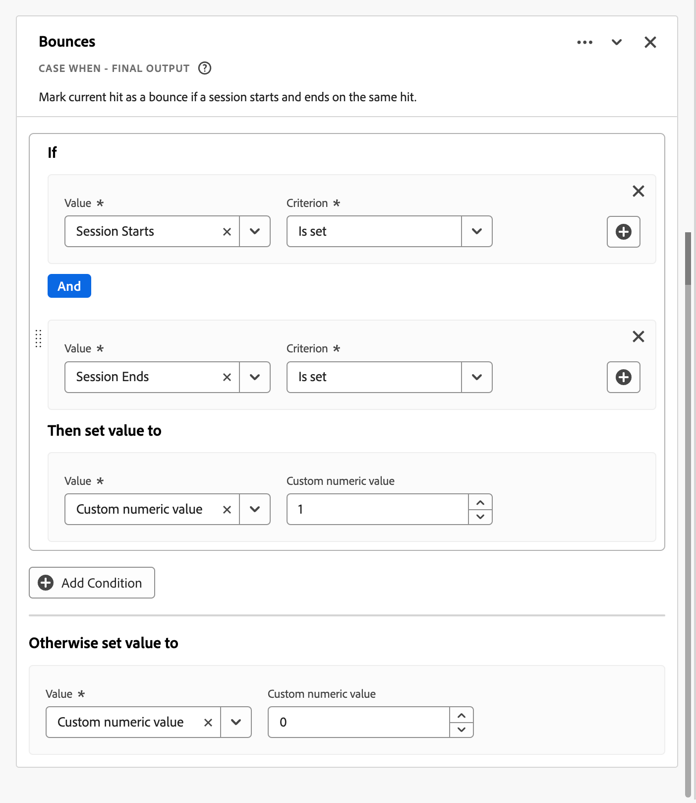

# Härledda fält {#derived-fields}

>[!CONTEXTUALHELP]
>id="dataview_derivedfields"
>title="Härledda fält"
>abstract="Med ett härlett fält kan du definiera dataändringar direkt med hjälp av ett anpassningsbart regelverktyg. Du kan sedan använda det härledda fältet som en komponent (mått eller dimension) i Workspace eller ytterligare definiera det som en komponent i datavyn."

Härledda fält är en viktig aspekt av rapportfunktionen i realtid i Adobe Customer Journey Analytics. Med ett härlett fält kan du definiera (ofta komplexa) dataändringar direkt, via en anpassningsbar regelbyggare. Du kan sedan använda det härledda fältet som en komponent (mått eller dimension) i [Workspace](../../analysis-workspace/home.md) eller ytterligare definiera det härledda fältet som en komponent i [datavyn](../data-views.md).

Härledda fält kan spara mycket tid och arbete jämfört med att omforma eller ändra data på andra platser än Customer Journey Analytics. Till exempel [Data Prep](https://experienceleague.adobe.com/docs/experience-platform/data-prep/home.html), [Data Distiller](https://experienceleague.adobe.com/docs/experience-platform/query/data-distiller/overview.html) eller inom dina egna ETL-/ELT-processer (Extract Transform).

Härledda fält definieras i [datavyer](../data-views.md), baseras på en uppsättning funktioner som definierats som regler och tillämpas på tillgängliga standard- och/eller schemafält.

>[!NOTE]
>
>[Standardkomponenter](../component-reference.md) är kopplade till och associerade med händelsedatamängder. Därför fungerar standardkomponenter som används som en del av ett härlett fält bara mot data från en händelsedatamängd.
>

Exempel:

- Definiera ett härlett sidnamnsfält som korrigerar felaktiga insamlade sidnamnsvärden för att korrigera sidnamnsvärden.

- Definiera ett härlett fält för marknadsföringskanal som fastställer rätt marknadsföringskanal baserat på ett eller flera villkor (till exempel URL-parameter, sidadress, sidnamn).

Standardkomponenter stöds bara på händelsedatamängder i härledda fält.

## Härlett fältgränssnitt {#interface}

När du skapar eller redigerar ett härlett fält använder du det härledda fältgränssnittet.

|  | Namn | Beskrivning |
|---------|----------|--------|
| 1 | **Väljare** | Du använder väljarområdet för att markera och dra och släppa funktionen, funktionsmallen, schemafältet eller standardfältet till regelbyggaren.  Använd listrutan för att välja mellan:   [!UICONTROL Functions] - visar tillgängliga [funktioner](#function-reference),   [!UICONTROL Function templates] - visar tillgängliga [funktionsmallar](#function-templates),   [!UICONTROL Schema fields] - listar tillgängliga fält från datauppsättningskategorier (händelse, profil, sökning) och tidigare definierade fält och   [!UICONTROL Standard fields] - tillgängliga standardfält (t.ex. ID för plattformsdatauppsättning). Endast strängfält och numeriska standardfält visas i väljaren. Om funktionen stöder andra datatyper kan standardfält med dessa andra datatyper väljas för värden eller fält i regelgränssnittet. Du kan söka efter funktioner, funktionsmallar, schema och standardfält med sökrutan  .  Du kan filtrera den markerade objektlistan genom att välja  och ange filter i dialogrutan [!UICONTROL Filter fields by] . Du kan enkelt ta bort filter med hjälp av ikonen  för varje filter. |
| 2 | **Regelverktyget** | Du skapar det härledda fältet sekventiellt med en eller flera regler. En regel är en specifik implementering av en funktion och är därför alltid kopplad till endast en funktion. Du skapar en regel genom att dra och släppa en funktion i regelbyggaren. Funktionstypen bestämmer regelns gränssnitt. Mer information finns i [Regelgränssnittet](#rule-interface).  Du kan infoga en funktion i början, slutet eller mellan regler som redan är tillgängliga i regelbyggaren. Den sista regeln i regelbyggaren avgör det härledda fältets slutliga utdata. |
| 3 | **[!UICONTROL ** Fältinställningar **]** | Du kan namnge och beskriva det härledda fältet och kontrollera dess fälttyp. |
| 4 | **[!UICONTROL ** Slutliga utdata **]** | I det här området visas en direkt uppdaterad förhandsvisning av utdatavärden, baserat på data under de senaste 30 dagarna och de ändringar du gör i det härledda fältet i regelbyggaren. |

{style="table-layout:auto"}

## Guiden Fältmall {#wizard}

När du använder det härledda fältgränssnittet för första gången visas guiden [!UICONTROL Start with a field template].

1. Välj den mall som bäst beskriver den typ av fält som du försöker skapa.
2. Klicka på knappen **[!UICONTROL ** Välj **]** för att fortsätta.

Dialogrutan för det härledda fältet innehåller regler (och funktioner) som är nödvändiga eller användbara för den typ av fält som du har valt. Mer information om tillgängliga mallar finns i [Funktionsmallar](#function-templates).

## Regelgränssnitt {#rules}

När du definierar en regel i regelbyggaren använder du regelgränssnittet.

|  | Namn | Beskrivning |
|---------|----------|--------|
| A | **Regelnamn** | Regelnamnet är som standard **Regel X** (X refererar till ett sekvensnummer). Om du vill redigera namnet på en regel markerar du dess namn och skriver in det nya namnet, till exempel `Query Parameter`. |
| B | **Funktionsnamn** | Det valda funktionsnamnet för regeln, till exempel [!UICONTROL URL PARSE]. När funktionen är den sista i funktionssekvensen och fastställer de slutliga utdatavärdena följs funktionsnamnet av [!UICONTROL - FINAL OUTPUT], till exempel [!UICONTROL URL PARSE - FINAL OUTPUT].  Om du vill visa ett popup-fönster med mer information om funktionen väljer du . |
| C | **Regelbeskrivning** | Du kan också lägga till en beskrivning till en regel. Välj  och välj sedan **[!UICONTROL ** Lägg till beskrivning **]** om du vill lägga till en beskrivning eller **[!UICONTROL ** Redigera beskrivning **]** om du vill redigera en befintlig beskrivning. Använd redigeraren för att ange en beskrivning. Du kan använda verktygsfältet för att formatera texten (med formatväljare, fet, kursiv, understrykning, höger, vänster, centrerad, färg, nummerlista, punktlista) och lägga till länkar till extern information.  Klicka utanför redigeraren om du vill redigera beskrivningen. |
| D | **Funktionsområde** | Definierar funktionens logik. Gränssnittet beror på funktionstypen. Listrutan för [!UICONTROL Field] eller [!UICONTROL Value] visar alla kategorier av fält (regler, standardfält, fält) som är tillgängliga, baserat på den typ av indata som funktionen förväntar sig. Du kan också dra och släppa ett fält från väljaren för schema- och standardfält till ett fält eller ett värde. När det dragna fältet kommer från en uppslagsuppsättning infogas en uppslagsfunktion automatiskt före den funktion som du definierar.  Se [Funktionsreferens](#function-reference) om du vill ha detaljerad information om alla funktioner som stöds. |

{style="table-layout:auto"}

## Skapa ett härlett fält {#create}

1. Välj en befintlig datavy eller skapa en datavy. Mer information finns i [Datavyer](../data-views.md).

2. Välj fliken **[!UICONTROL ** Komponenter **]** i datavyn.

3. Välj **[!UICONTROL ** Skapa härlett fält **]** från den vänstra listen.

4. Använd gränssnittet [!UICONTROL Create derived field] för att definiera ditt härledda fält. Se [Härlett fältgränssnitt](#derived-field-interface).

   Välj **[!UICONTROL ** Spara **]** om du vill spara det nya härledda fältet.

5. Det nya härledda fältet läggs till i behållaren [!UICONTROL Derived fields >], som en del av **[!UICONTROL ** schemafälten **]** i den vänstra listen i datavyn.

## Redigera ett härlett fält {#edit}

1. Välj en befintlig datavy. Mer information finns i [Datavyer](../data-views.md).

2. Välj fliken **[!UICONTROL ** Komponenter **]** i datavyn.

3. Välj fliken **[!UICONTROL ** Schemafält **]** i rutan [!UICONTROL Connection] till vänster.

4. Välj **[!UICONTROL ** Härledda fält >**]** behållare.

5. Håll markören över det härledda fält som du vill redigera och välj .

6. Använd gränssnittet [!UICONTROL Edit derived field] om du vill redigera det härledda fältet. Se [Härlett fältgränssnitt](#derived-field-interface).

   - Välj **[!UICONTROL ** Spara **]** om du vill spara det uppdaterade härledda fältet.

   - Välj **[!UICONTROL ** Avbryt **]** om du vill avbryta alla ändringar du har gjort i det härledda fältet.

   - Välj **[!UICONTROL ** Spara som **]** om du vill spara det härledda fältet som ett nytt härlett fält. Det nya härledda fältet har samma namn som det ursprungliga redigerade härledda fältet med `(copy)` tillagt.

Om du har använt ett härlett fält som en komponent för mått eller mätvärden i datavyn kan du även:

1. Markera komponenten. Observera att komponenten kan ha ett annat namn än det härledda fältet.

1. I panelen Komponenter väljer du ikonen  bredvid det härledda fältet, under namnet på schemafältet.

1. Använd gränssnittet [!UICONTROL Edit derived field] om du vill redigera det härledda fältet. Se [Härlett fältgränssnitt](#derived-field-interface).

   - Välj **[!UICONTROL ** Spara **]** om du vill spara det uppdaterade härledda fältet.

   - Välj **[!UICONTROL ** Avbryt **]** om du vill avbryta alla ändringar du har gjort i det härledda fältet.

   - Välj **[!UICONTROL ** Spara som **]** om du vill spara det härledda fältet som ett nytt härlett fält. Det nya härledda fältet har samma namn som det ursprungliga redigerade härledda fältet med `(copy)` tillagt.

## Ta bort ett härlett fält {#delete}

1. Välj en befintlig datavy. Mer information finns i [Datavyer](../data-views.md).

2. Välj fliken **[!UICONTROL ** Komponenter **]** i datavyn.

3. Välj fliken **[!UICONTROL ** Schemafält **]** i rutan [!UICONTROL Connection].

4. Välj **[!UICONTROL ** Härledda fält >**]** behållare.

5. Håll markören över det härledda fält som du vill ta bort och välj .

6. Välj [!UICONTROL Edit derived field] i gränssnittet **[!UICONTROL Delete]**.

   En [!UICONTROL Delete component]-dialogruta ber dig bekräfta borttagningen. Ta hänsyn till eventuella externa referenser som finns till det härledda fältet utanför datavyn.

   - Välj **[!UICONTROL ** Fortsätt **]** om du vill ta bort det härledda fältet.

Om du har använt ett härlett fält som en komponent för mått eller mätvärden i datavyn kan du även:

1. Markera komponenten. Observera att komponenten kan ha ett annat namn än det härledda fältet.

1. I panelen Komponenter väljer du ikonen  bredvid det härledda fältet, under namnet på schemafältet.

1. Välj [!UICONTROL Edit derived field] i gränssnittet **[!UICONTROL Delete]**.

   En [!UICONTROL Delete component]-dialogruta ber dig bekräfta borttagningen. Ta hänsyn till eventuella externa referenser som finns till det härledda fältet utanför datavyn.

   - Välj **[!UICONTROL ** Fortsätt **]** om du vill ta bort det härledda fältet.

>[!NOTE]
>
>Härledda fält hanteras på anslutningsnivå i Customer Journey Analytics. Alla ändringar som görs i ett härlett fält i någon av de datavyer som är kopplade till anslutningen gäller för alla dessa associerade datavyer.

## Funktionsmallar {#templates}

Funktionsmallar är tillgängliga för att snabbt skapa ett härlett fält för specifika användningsområden. Dessa funktionsmallar kan nås från väljarområdet i det härledda fältgränssnittet eller presenteras vid första användningen i guiden [!UICONTROL Start with a field template].

### Marknadsföringskanaler {#mchannel}

Den här funktionsmallen använder en samling regler för att skapa marknadsföringskanaler.

+++ Information

Om du vill använda mallen måste du ange rätt parametrar för varje funktion som listas som en del av reglerna i mallen. Mer information finns i [Funktionsreferens](#function-reference).

+++

### Studsar {#bounces}

Den här funktionsmallen använder en samling regler för att identifiera webbplatsens gränser.

+++ Information

{{select-package}}

Om du vill använda mallen måste du ange rätt parametrar för varje funktion som listas som en del av reglerna i mallen. Mer information finns i [Funktionsreferens](#function-reference).

+++

### Kombinera flera Dimension {#multi-dim}

Den här funktionsmallen kombinerar två värden till ett.

+++ Information

{{select-package}}

Om du vill använda mallen måste du ange rätt parametrar för varje funktion som listas som en del av reglerna i mallen. Mer information finns i [Funktionsreferens](#function-reference).

+++

### Eget namn på datauppsättning {#friendlyname}

Den här funktionsmallen ger ett läsbart datauppsättningsnamn.

+++ Information

{{select-package}}

Om du vill använda mallen måste du ange rätt parametrar för varje funktion som listas som en del av reglerna i mallen. Mer information finns i [Funktionsreferens](#function-reference).

+++

### Sidnamn från URL {#pagename}

Den här funktionsmallen skapar ett enkelt sidnamn.

+++ Information

{{select-package}}

Om du vill använda mallen måste du ange rätt parametrar för varje funktion som listas som en del av reglerna i mallen. Mer information finns i [Funktionsreferens](#function-reference).

+++

### Semestersäsong {#holiday}

Den här funktionsmallen klassificerar nyckeltider för året.

+++ Information

{{select-package}}

Om du vill använda mallen måste du ange rätt parametrar för varje funktion som listas som en del av reglerna i mallen. Mer information finns i [Funktionsreferens](#function-reference).

+++

### Månadsmål {#goals}

Den här funktionsmallen ställer in anpassade månatliga mål.

+++ Information

{{select-package}}

Om du vill använda mallen måste du ange rätt parametrar för varje funktion som listas som en del av reglerna i mallen. Mer information finns i [Funktionsreferens](#function-reference).

+++

### Hämta alla värden i avgränsad lista {#allvalues}

Den här funktionsmallen konverterar en begränsad lista till en array.

+++ Information

{{select-package}}

Om du vill använda mallen måste du ange rätt parametrar för varje funktion som listas som en del av reglerna i mallen. Mer information finns i [Funktionsreferens](#function-reference).

+++

### Hämta första värdet i avgränsad lista {#firstvalue}

Den här funktionsmallen hämtar det första värdet i en avgränsad lista.

+++ Information

{{select-package}}

Om du vill använda mallen måste du ange rätt parametrar för varje funktion som listas som en del av reglerna i mallen. Mer information finns i [Funktionsreferens](#function-reference).

+++

### Hämta sista värdet i avgränsad lista {#lastvalue}

Den här funktionsmallen hämtar det sista värdet i en avgränsad lista.

+++ Information

{{select-package}}

Om du vill använda mallen måste du ange rätt parametrar för varje funktion som listas som en del av reglerna i mallen. Mer information finns i [Funktionsreferens](#function-reference).

+++

### Domännamn {#domain}

Den här funktionsmallen extraherar domännamnet med ett reguljärt uttryck.

+++ Information

{{select-package}}

Om du vill använda mallen måste du ange rätt parametrar för varje funktion som listas som en del av reglerna i mallen. Mer information finns i [Funktionsreferens](#function-reference).

+++

### Hämta frågesträngsparameter {#querystring}

Den här funktionsmallen extraherar frågesträngsvärden.

+++ Information

{{select-package}}

Om du vill använda mallen måste du ange rätt parametrar för varje funktion som listas som en del av reglerna i mallen. Mer information finns i [Funktionsreferens](#function-reference).

+++

### Övergångsfält {#transition}

Den här funktionsmallen övergår från ett fält till ett annat.

+++ Information

{{select-package}}

Om du vill använda mallen måste du ange rätt parametrar för varje funktion som listas som en del av reglerna i mallen. Mer information finns i [Funktionsreferens](#function-reference).

+++

### Enkel punktidentifiering {#botdetection}

Den här funktionsmallen implementerar identifiering av ljusrobotar.

+++ Information

{{select-package}}

Om du vill använda mallen måste du ange rätt parametrar för varje funktion som listas som en del av reglerna i mallen. Mer information finns i [Funktionsreferens](#function-reference).

+++

### Avsluta länk {#exit}

Den här funktionsmallen identifierar den senaste länken som klickats i en session.

+++ Information

{{select-package}}

Om du vill använda mallen måste du ange rätt parametrar för varje funktion som listas som en del av reglerna i mallen. Mer information finns i [Funktionsreferens](#function-reference).

+++

### Hämta länk {#download}

Den här funktionsmallen flaggar vanliga nedladdningslänkar.

+++ Information

{{select-package}}

Om du vill använda mallen måste du ange rätt parametrar för varje funktion som listas som en del av reglerna i mallen. Mer information finns i [Funktionsreferens](#function-reference).

+++

<!--

+++ Data clean up template

>[!WARNING]
>
>Could not find any information on this template.
+++

-->

## Funktionsreferens {#functionref}

{{select-package}}

För varje funktion som stöds finns information nedan:

- specifikationer:
   - Indatatyp: typ av data som stöds.
   - Indata: möjliga värden för indata.
   - inkluderade operatorer: operatorer som stöds för denna funktion (om sådana finns),
   - begränsningar: begränsningar som gäller för denna specifika funktion,
   - utdata.

- Användningsfall, inklusive
   - data innan härlett fält definieras,
   - hur det härledda fältet definieras,
   - efter att ha definierat det härledda fältet.

- begränsningar (om tillämpligt).

<!-- CASE WHEN -->

### Skiftläge {#casewhen}

>[!CONTEXTUALHELP]
>id="dataview_derivedfields_casewhen"
>title="Skiftläge"
>abstract="Med den här funktionen kan du använda villkor som baseras på definierade villkor från ett eller flera fält. Dessa kriterier används sedan för att definiera värdena i det nya härledda fältet baserat på villkorens sekvens."

Använder villkorliga värden som baseras på definierade villkor från ett eller flera fält. Dessa kriterier används sedan för att definiera värdena i ett nytt härlett fält, baserat på villkorens sekvens.

+++ Information

## Specifikationer {#casewhen-io}

| Typ av indatadata | Indata | Operatorer som ingår | Begränsningar | Utdata |
|---|---|---|---|---|
| <ul><li>Sträng</li><li>Numeriskt</li><li>Datum</li></ul> | <ul><li>[!UICONTROL If], [!UICONTROL Else If] behållare:
<ul><li>[!UICONTROL Value]</li><ul><li>Regler</li><li>Standardfält</li><li>Fält</li></ul><li>[!UICONTROL Criterion] (se inkluderade operatorer, baserat på vald värdetyp)</li></ul></li><li>[!UICONTROL Then set value to], [!UICONTROL Otherwise set value to]:
<ul><li>[!UICONTROL Value]</li><ul><li>Regler</li><li>Standardfält</li><li>Fält</li></ul></ul></li></ul> | 
Strängar
<ul><li>Är lika med</li><li>Liknar alla termer</li><li>Innehåller frasen</li><li>Innehåller valfri term</li><li>Innehåller alla termer</li><li>Börjar med</li><li>Börjar med valfri term</li><li>Slutar med</li><li>Slutar med valfri term</li><li>Är inte lika med</li><li>Motsvarar inte någon term</li><li>Innehåller inte frasen</li><li>Innehåller inga termer</li><li>Innehåller inte alla termer</li><li>Börjar inte med</li><li>Börjar inte med någon term</li><li>Slutar inte med</li><li>Slutar inte med någon term</li><li>Är inställd</li><li>Har inte angetts</li></ul>
Numeriskt
<ul><li>Är lika med</li><li>Är inte lika med</li><li>Är större än</li><li>Är större än eller lika med</li><li>Är mindre än</li><li>Är mindre än eller lika med</li><li>Är inställd</li><li>Har inte angetts</li></ul>
Datum
<ul><li>Är lika med</li><li>Är inte lika med</li><li>Är senare än</li><li>Är senare än eller lika med</li><li>Är före</li><li>Är före eller lika med</li><li>Är inställd</li><li>Har inte angetts</li></ul> | <ul><li>5 funktioner per härlett fält</li><li>200 [operatorer](#operators) per härlett fält. Ett exempel på en enskild operator är &#39;Referensdomän innehåller google&#39;. </li></ul> | 
Nytt härlett fält
 |

{style="table-layout:auto"}

## Användningsfall 1 {#casewhen-uc1}

Du vill definiera regler för att identifiera olika marknadsföringskanaler genom att tillämpa överlappande logik för att ange ett marknadsföringskanalfält till rätt värde:

- Om referenten kommer från en sökmotor och sidan har ett frågesträngsvärde där `cid` innehåller `ps_`, bör marknadsföringskanalen identifieras som en [!DNL *betald sökning*].
- Om referenten kommer från en sökmotor och sidan inte har frågesträngen `cid`, ska marknadsföringskanalen identifieras som en [!DNL *naturlig sökning*].
- Om en sida har ett frågesträngsvärde där `cid` innehåller `em_` ska marknadsföringskanalen identifieras som [!DNL *E-post*].
- Om en sida har ett frågesträngsvärde där `cid` innehåller `ds_` ska marknadsföringskanalen identifieras som [!DNL *Display Ad*].
- Om en sida har ett frågesträngsvärde där `cid` innehåller `so_` ska marknadsföringskanalen identifieras som [!DNL *Betald social*].
- Om referenten kommer från en hänvisande domän av [!DNL twitter.com], [!DNL facebook.com], [!DNL linkedin.com] eller [!DNL tiktok.com] bör marknadsföringskanalen identifieras som [!DNL *Naturlig social*].
- Om ingen av ovanstående regler matchas bör marknadsföringskanalen identifieras som [!DNL *Annan referent*].

Om din plats får följande exempelhändelser, som innehåller [!UICONTROL Referrer] och [!UICONTROL Page URL], ska dessa händelser identifieras enligt följande:

| [!DNL Event] | [!DNL Referrer] | [!DNL Page URL] | [!DNL Marketing Channel] |
|:--:|----|----|----|
| 1 | `https://facebook.com` | `https://site.com/home` | [!DNL Natural Social] |
| 2 | `https://abc.com` | `https://site.com/?cid=ds_12345678` | [!DNL Display] |
| 3 | | `https://site.com/?cid=em_12345678` | [!DNL Email] |
| 4 | `https://google.com` | `https://site.com/?cid=ps_abc098765` | [!DNL Paid Search] |
| 5 | `https://google.com` | `https://site.com/?cid=em_765544332` | [!DNL Email] |
| 6 | `https://google.com` |  | [!DNL Natural Search] |

{style="table-layout:auto"}

### Data före {#casewhen-uc1-databefore}

| [!DNL Referrer] | [!DNL Page URL] |
|----|----|
| `https://facebook.com` | `https://site.com/home` |
| `https://abc.com` | `https://site.com/?cid=ds_12345678` |
|  | `https://site.com/?cid=em_12345678` |
| `https://google.com` | `https://site.com/?cid=ps_abc098765` |
| `https://google.com` | `https://site.com/?cid=em_765544332` |
| `https://google.com` | |

{style="table-layout:auto"}

### Härlett fält {#casewhen-uc1-derivedfield}

Du definierar ett `Marketing Channel` härlett fält. Du använder funktionerna [!UICONTROL CASE WHEN] för att definiera regler som skapar värden för objektet baserat på befintliga värden för både fältet `Page URL` och fältet `Referring URL`.

Observera hur funktionen [!UICONTROL URL PARSE] används för att definiera regler för att hämta värden för `Page Url` och `Referring Url` innan reglerna för [!UICONTROL CASE WHEN] tillämpas.

### Data efter {#casewhen-uc1-dataafter}

| [!DNL Marketing Channel] |
|----|
| [!DNL Natural Social] |
| [!DNL Display] |
| [!DNL Email] |
| [!DNL Paid Search] |
| [!DNL Email] |
| [!DNL Natural Search] |

{style="table-layout:auto"}

## Användningsfall 2 {#casewhen-uc2}

Du har samlat in flera olika varianter av sökningen i din [!DNL Product Finding Methods]-dimension. Om du vill förstå det övergripande resultatet för sökning och bläddring måste du lägga mycket tid på att kombinera resultaten manuellt.

Din webbplats samlar in följande värden för din [!DNL Product Finding Methods]-dimension. Alla dessa värden anger slutligen en sökning.

| Insamlat värde | Faktiskt värde |
|---|---|
| [!DNL search p13n_no] | [!DNL search] |
| [!DNL search p13n_yes] | [!DNL search] |
| [!DNL search refine p13n_no] | [!DNL search] |
| [!DNL search refine p13n_yes] | [!DNL search] |
| [!DNL search redirect p13n_yes] | [!DNL search] |
| [!DNL search-redirect] | [!DNL search] |

{style="table-layout:auto"}

### Data före {#casewhen-uc2-databefore}

| [!DNL Product Finding Methods] |
|----|
| [!DNL search p13_no] |
| [!DNL search p13_yes] |
| [!DNL browse] |
| [!DNL search refine p13_no] |
| [!DNL search refine p13_yes] |
| [!DNL browse] |
| [!DNL search redirect p13_yes] |
| [!DNL search-redirect] |
| [!DNL browse] |

{style="table-layout:auto"}

### Härlett fält {#casewhen-uc2-derivedfield}

Du definierar ett `Product Finding Methods (new)` härlett fält. Du skapar följande [!UICONTROL CASE WHEN] regler i regelbyggaren. Dessa regler tillämpar logik för alla möjliga variationer av de gamla [!UICONTROL Product Finding Methods]-fältvärdena för `search` och `browse` med kriteriet [!UICONTROL Contains the phrase].

### Data efter {#casewhen-uc2-dataafter}

| [!DNL Product Finding Methods (new)] |
|----|
| [!DNL search] |
| [!DNL search] |
| [!DNL browse] |
| [!DNL search] |
| [!DNL search] |
| [!DNL browse] |
| [!DNL search] |
| [!DNL search] |
| [!DNL browse] |

{style="table-layout:auto"}

## Användningsfall 3 {#casewhen-uc3}

Som reseföretag vill du korta resetiden för bokade resor så att du kan rapportera om hur långa resorna är.

Antaganden:

- Organisationen samlar ihop resans varaktighet till ett numeriskt fält.
- De vill krympa 1-3 dagars varaktighet till en hink med namnet [!DNL short trip]
- De vill krympa 4-7-dagars varaktighet till en hink med namnet [!DNL medium trip]
- De vill bucket 8+-dagars varaktighet i en hink med namnet [!DNL long trip]
- 132 resor bokades för en dag
- 110 resor bokades för en tvådagarsperiod
- 105 resor bokades för en 3-dagarsperiod
- 99 resor var bokade i 4 dagar
- 92 resor bokades för en femdagarsperiod
- 85 resor bokades för en sexdagarsperiod
- 82 resor bokades för en 7-dagarsperiod
- 78 resor var bokade i 8 dagar
- 50 resor bokades för en 9-dagarsperiod
- 44 resor bokades under en 10-dagarsperiod
- 38 resor bokades för en 11-dagarsperiod
- 31 resor bokades för en tolvdagarsperiod

Din rapport ska se ut så här:

| [!DNL Trip Duration Type] | [!DNL Bookings] |
|----|---:|
| [!DNL medium trip] | 358 |
| [!DNL short trip] | 347 |
| [!DNL long trip] | 241 |

{style="table-layout:auto"}

### Data före {#casewhen-uc3-databefore}

| [!DNL Trip Duration] |
|---:|
| 1 |
| 12 |
| 3 |
| 6 |
| 4 |
| 8 |
| 6 |
| 2 |
| 1 |
| 2 |
| 21 |
| 8 |

### Härlett fält {#casewhen-uc3-derivedfield}

Du definierar ett `Trip Duration (bucketed)` härlett fält. Du skapar följande [!UICONTROL CASE WHEN]-regel i regelbyggaren. Den här regeln använder logik för att bucket de gamla [!UICONTROL Trip Duration]-fältvärdena i tre värden: `short trip`, `medium  trip` och `long trip`.

### Data efter {#casewhen-uc3-dataafter}

| [!DNL Trip Duration (bucketed)] |
|---|
| [!DNL short trip] |
| [!DNL long trip] |
| [!DNL short trip] |
| [!DNL medium trip] |
| [!DNL medium trip] |
| [!DNL long trip] |
| [!DNL medium trip] |
| [!DNL short trip] |
| [!DNL short trip] |
| [!DNL short trip] |
| [!DNL long trip] |
| [!DNL long trip] |

## Mer information {#casewhen-more-info}

Customer Journey Analytics använder en kapslad behållarstruktur som har utformats efter Adobe Experience Platform [XDM](https://experienceleague.adobe.com/docs/experience-platform/xdm/home.html?lang=sv) (Experience Data Model). Mer bakgrundsinformation finns i [Behållare](../create-dataview.md#containers) och [Segmentbehållare](/help/components/segments/seg-overview.md#containers). Den här behållarmodellen är flexibel till sin natur men medför vissa begränsningar när regelverktyget används.

Customer Journey Analytics använder följande standardbehållarmodell:

Följande begränsningar gäller och används när värden för *markera* och *ange* används.

|  | Begränsningar |
|:---:|----|
| **A** | Värden som du *väljer* i samma [!UICONTROL If], [!UICONTROL Else If] konstruerar (med [!UICONTROL And] eller [!UICONTROL Or]) i en regel måste komma från samma behållare och kan vara av valfri typ (sträng , numeriskt  o.s.v.).   |
| **B** | Alla värden som du *anger* för en regel måste komma från samma behållare och ha samma typ eller ett härlett värde av samma typ.    |
| **C** | De värden som du *väljer* i [!UICONTROL If], [!UICONTROL Else If] i regeln *behöver inte* härröra från samma behållare och måste *inte* vara av samma typ.    |

{style="table-layout:auto"}

+++

<!-- CLASSIFY -->

### Klassificera {#classify}

>[!CONTEXTUALHELP]
>id="dataview_derivedfields_classify"
>title="Klassificera"
>abstract="Med den här funktionen kan du definiera en uppsättning värden som ersätts av motsvarande värden med en textinmatning."

Definierar en uppsättning värden som ersätts av motsvarande värden i ett nytt härlett fält.

+++ Information

## Specifikationer {#classify-io}

| Typ av indatadata | Indata | Operatorer som ingår | Begränsningar | Utdata |
|---|---|---|---|---|
| <ul><li>Sträng</li><li>Numeriskt</li><li>Datum</li></ul> | <ul><li>[!UICONTROL Field to classify]:<ul><li>Regler</li><li>Standardfält</li><li>Fält</li></ul></li><li>[!UICONTROL When value equals] och [!UICONTROL Replace values with]:
<ul><li>Sträng</li></ul><li>Visa originalvärden<ul><li>Boolean</li></ul></li></ul> | 
Ej tillämpligt
 | <ul><li>5 funktioner per härlett fält</li><li>200 [operatorer](#operators) per härlett fält. Alla poster för [!UICONTROL When value equals original value] [!UICONTROL Replace value with New value] betraktas som en åtgärd.</li></ul> | 
Nytt härlett fält
 |

{style="table-layout:auto"}

## Användningsfall 1 {#classify-uc1}

Du har en CSV-fil som innehåller en nyckelkolumn för `hotelID` och en eller flera andra kolumner som är associerade med `hotelID`: `city`, `rooms`, `hotel name`.
Du samlar in [!DNL Hotel ID] i en dimension men vill skapa en [!DNL Hotel Name]-dimension som härleds från `hotelID` i CSV-filen.

**Struktur och innehåll för CSV-filer**

| [!DNL hotelID] | [!DNL city] | [!DNL rooms] | [!DNL hotel name] |
|---|---|---:|---|
| [!DNL SLC123] | [!DNL Salt Lake City] | 40 | [!DNL SLC Downtown] |
| [!DNL LAX342] | [!DNL Los Angeles] | 60 | [!DNL LA Airport] |
| [!DNL SFO456] | [!DNL San Francisco] | 75 | [!DNL Market Street] |
| [!DNL AMS789] | [!DNL Amsterdam] | 50 | [!DNL Okura] |

{style="table-layout:auto"}

**Aktuell rapport**

| [!DNL Hotel ID] | Produktvyer |
|---|---:|
| [!DNL SLC123] | 200 |
| [!DNL LX342] | 198 |
| [!DNL SFO456] | 190 |
| [!DNL AMS789] | 150 |

{style="table-layout:auto"}

**Önskad rapport**

| [!DNL Hotel Name] | Produktvyer |
|----|----:|
| [!DNL SLC Downtown] | 200 |
| [!DNL LA Airport] | 198 |
| [!DNL Market Street] | 190 |

{style="table-layout:auto"}

### Data före {#classify-uc1-databefore}

| [!DNL Hotel ID] |
|----|
| [!DNL SLC123] |
| [!DNL LAX342] |
| [!DNL SFO456] |
| [!DNL AMS789] |

{style="table-layout:auto"}

### Härlett fält {#classify-uc1-derivedfield}

Du definierar ett `Hotel Name` härlett fält. Du använder funktionen [!UICONTROL CLASSIFY] för att definiera en regel där du kan klassificera värden i fältet [!UICONTROL Hotel ID] och ersätta dem med nya värden.

Om du vill inkludera originalvärden som du inte har definierat som en del av värdena som ska klassificeras (till exempel Hotel-ID AMS789) måste du markera **[!UICONTROL Show original values]**. Detta garanterar att AMS789 är en del av utdata för det härledda fältet, trots att det värdet inte klassificeras.

### Data efter {#classify-uc1-dataafter}

| [!DNL Hotel Name] |
|----|
| [!DNL SLC Downtown] |
| [!DNL LA Airport] |
| [!DNL Market Street] |

{style="table-layout:auto"}

## Användningsfall 2 {#classify-uc2}

Du har samlat in URL:er i stället för det egna sidnamnet för flera sidor. Den här blandade mängden värden bryter rapporteringen.

### Data före {#classify-uc2-databefore}

| [!DNL Page Name] |
|---|
| [!DNL Home Page] |
| [!DNL Flight Search] |
| `http://www.adobetravel.ca/Hotel-Search` |
| `https://www.adobetravel.com/Package-Search` |
| [!DNL Deals & Offers] |
| `http://www.adobetravel.ca/user/reviews` |
| `https://www.adobetravel.com.br/Generate-Quote/preview` |

{style="table-layout:auto"}

### Härlett fält {#classify-uc2-derivedfield}

Du definierar ett `Page Name (updated)` härlett fält. Du använder funktionen [!UICONTROL CLASSIFY] för att definiera en regel där du kan klassificera värden i det befintliga [!UICONTROL Page Name]-fältet och ersätta med uppdaterade korrekta värden.

### Data efter {#classify-uc2-dataafter}

| [!DNL Page Name (updated)] |
|---|
| [!DNL Home Page] |
| [!DNL Flight Search] |
| [!DNL Hotel Search] |
| [!DNL Package Search] |
| [!DNL Deals & Offers] |
| [!DNL Reviews] |
| [!DNL Generate Quote] |

## Mer information {#classify-moreinfo}

Följande ytterligare funktioner är tillgängliga i gränssnittet Klassifiera regel:

- Om du snabbt vill ta bort alla tabellvärden väljer du  **[!UICONTROL Clear all table values]**.
- Om du vill överföra en CSV-fil som innehåller originalvärden för När värden är lika och nya värden för Ersätt värden med väljer du  **[!UICONTROL Upload CSV]**.
- Om du vill hämta en mall för att skapa en CSV-fil med ursprungliga och nya värden som ska överföras väljer du  **[!UICONTROL Download CSV template]**.
- Om du vill hämta en CSV-fil med alla ursprungliga och nya värden ifyllda i regelgränssnittet väljer du  **[!UICONTROL Download CSV values]**.

+++

<!-- CONCATENATE -->

### Sammanfoga {#concatenate}

<!-- markdownlint-disable MD034 -->

>[!CONTEXTUALHELP]
>id="dataview_derivedfields_concatenate"
>title="Sammanfoga"
>abstract="Den här funktionen ger möjlighet att kombinera två eller flera fält, härledda fält eller användarinmatade strängvärden till ett enda fält med definierade avgränsare"

<!-- markdownlint-enable MD034 -->

Kombinerar fältvärden till ett nytt härlett fält med definierade avgränsare.

+++ Information

## Specifikationer {#concatenate-io}

| Typ av indatadata | Indata | Operatorer som ingår | Begränsningar | Utdata |
|---|---|---|---|---|
| <ul><li>Sträng</li></ul> | <ul><li>[!UICONTROL Value]:<ul><li>Regler</li><li>Standardfält</li><li>Fält</li><li>Sträng</li></ul></li><li>[!UICONTROL Delimiter]:<ul><li>Sträng</li></ul></li> </ul> | 
Ej tillämpligt
 | 
2 funktioner per härlett fält
 | 
Nytt härlett fält
 |

{style="table-layout:auto"}

## Använd skiftläge {#concatenate-uc}

Du samlar för närvarande in kod för ursprung och destinationsflygplats som separata fält. Du vill använda de två fälten och kombinera dem till ett enda mått, avgränsade med ett bindestreck (-). Så att du kan analysera kombinationen av ursprung och mål för att identifiera de vanligaste rutterna som bokats.

Antaganden:

- Origo- och målvärden samlas i separata fält i samma tabell.
- Användaren bestämmer sig för att använda avgränsaren &#39;-&#39; mellan värdena.

Tänk dig följande bokningar:

- Kund ABC123 bokar en flygning mellan Salt Lake City (SLC) och Orlando (MCO)
- Kund ABC456 bokar ett flyg mellan Salt Lake City (SLC) och Los Angeles (LAX)
- Kund ABC789 bokar ett flyg mellan Salt Lake City (SLC) och Seattle (SEA)
- Kund ABC987 bokar ett flyg mellan Salt Lake City (SLC) och San Jose (SJO)
- Kund ABC654 bokar en flygning mellan Salt Lake City (SLC) och Orlando (MCO)

Rapporten ska se ut så här:

| Ursprung / Mål | Bokningar |
|----|---:|
| SLC-MCO | 2 |
| SLC-LAX | 1 |
| SLC-SEA | 1 |
| SLC-SJO | 1 |

{style="table-layout:auto"}

### Data före {#concatenate-uc-databefore}

| Ursprung | Mål |
|----|---:|
| SLC | MCO |
| SLC | LAX |
| SLC | SEA |
| SLC | SJO |
| SLC | MCO |

{style="table-layout:auto"}

### Härlett fält {#concatenate-derivedfield}

Du definierar ett `Origin - Destination` härlett fält. Du använder funktionen [!UICONTROL CONCATENATE] för att definiera en regel som sammanfogar fälten [!UICONTROL Original] och [!UICONTROL Destination] med `-` [!UICONTROL Delimiter].

### Data efter {#concatenate-dataafter}

| Ursprung - mål   (härlett fält) |
|---|
| SLC-MCO |
| SLC-LAX |
| SLC-SEA |
| SLC-SJO |
| SLC-MCO |

{style="table-layout:auto"}

+++

<!-- DEDUPLICATE -->

### Deduplicera {#dedup}

>[!CONTEXTUALHELP]
>id="dataview_derivedfields_deduplicate"
>title="Deduplicera"
>abstract="Med den här funktionen kan du konfigurera ett fält så att värden endast räknas som icke-repetitiva på antingen sessions- eller personnivå. Dessutom kan ett ID för borttagning av dubbletter användas för att säkerställa att endast ett värde används baserat på ett visst ID (t.ex. ett köp-ID) (antingen den första instansen eller den sista instansen)."

Förhindrar att ett värde räknas flera gånger.

+++ Information

## Specifikationer {#deduplicate-io}

| Typ av indatadata | Indata | Operatorer som ingår | Begränsningar | Utdata |
|---|---|---|---|---|
| <ul><li>Sträng</li><li>Numeriskt</li></ul> | <ul><li>[!UICONTROL Value]:<ul><li>Regler</li><li>Standardfält</li><li>Fält</li><li>Sträng</li></ul></li><li>[!UICONTROL Scope]:<ul><li>Person</li><li>Session</li></ul></li><li>[!UICONTROL Deduplication ID]:<ul><li>Regler</li><li>Standardfält</li><li>Fält</li><li>Sträng</li></ul><li>[!UICONTROL Value to keep]:<ul><li>Behåll första instansen</li><li>Behåll sista instansen</li></ul></li></ul> | 
Ej tillämpligt
 | 
5 funktioner per härlett fält
 | 
Nytt härlett fält
 |

{style="table-layout:auto"}

## Användningsfall 1 {#deduplicate-uc1}

Du vill förhindra att dubblettintäkter räknas när en användare läser in bekräftelsesidan för bokningen igen. Du använder bokningsbekräftelsens ID vid identifieraren för att inte räkna intäkten igen när den tas emot vid samma händelse.

### Data före {#deduplicate-uc1-databefore}

| Bokningsbekräftelse-ID | Intäkter |
|----|---:|
| ABC123456789 | 359 |
| ABC123456789 | 359 |
| ABC123456789 | 359 |

{style="table-layout:auto"}

### Härlett fält {#deduplicate-uc1-derivedfield}

Du definierar ett `Booking Confirmation` härlett fält. Du använder funktionen [!UICONTROL DEDUPLICATE] för att definiera en regel för att deduplicera [!UICONTROL Value] [!DNL Booking] för [!UICONTROL Scope] [!DNL Person] med [!UICONTROL Deduplication ID] [!UICONTROL Booking Confirmation ID]. Du väljer [!UICONTROL Keep first instance] som [!UICONTROL Value to keep].

### Data efter {#deduplicate-uc1-dataafter}

| Bokningsbekräftelse-ID | Intäkter |
|----|---:|
| ABC123456789 | 359 |
| ABC123456789 | 0 |
| ABC123456789 | 0 |

{style="table-layout:auto"}

## Användningsfall 2 {#deduplicate-uc2}

Ni använder händelser som en proxy för kampanjklickningar med externa marknadsföringskampanjer. Läser in igen och omdirigeringar gör att händelsemätningen blir hög. Du vill deduplicera spårningskoddimensionen så att bara den första samlas in och minimera händelseöverräkningen.

### Data före {#deduplicate-uc2-databefore}

| Besökar-ID | Marknadsföringskanal | Händelser |
|----|---|---:|
| ABC123 | betalsökningar | 1 |
| ABC123 | betalsökningar | 1 |
| ABC123 | betalsökningar | 1 |
| DEF123 | e-post | 1 |
| DEF123 | e-post | 1 |
| JKL123 | naturlig sökning | 1 |
| JKL123 | naturlig sökning | 1 |

{style="table-layout:auto"}

### Härlett fält {#deduplicate-uc2-derivedfield}

Du definierar ett nytt härlett `Tracking Code (deduplicated)`-fält. Du använder funktionen [!UICONTROL DEDUPLICATE] för att definiera en regel för att deduplicera [!UICONTROL Tracking Code] med [!UICONTROL Deduplication scope] av [!UICONTROL Session] och [!UICONTROL Keep first instance] som [!UICONTROL Value to keep].

### Data efter {#deduplicate-uc2-dataafter}

| Besökar-ID | Marknadsföringskanal | Händelser |
|----|---|---:|
| ABC123 | betalsökningar | 1 |
| DEF123 | e-post | 1 |
| JKL123 | naturlig sökning | 1 |

{style="table-layout:auto"}

+++

<!-- FIND AND REPLACE -->

### Sök och ersätt {#find-and-replace}

<!-- markdownlint-disable MD034 -->

>[!CONTEXTUALHELP]
>id="dataview_derivedfields_findandreplace"
>title="Sök och ersätt"
>abstract="Med den här funktionen kan du söka efter alla värden i ett markerat fält och ersätta dessa värden med ett annat värde i ett nytt härlett fält."

Söker efter alla värden i ett markerat fält och ersätter dessa värden med ett annat värde i ett nytt härlett fält.

+++ Information

## Specifikationer {#findreplace-io}

| Typ av indatadata | Indata | Operatorer som ingår | Begränsningar | Utdata |
|---|---|---|---|---|
| <ul><li>Sträng</li></ul> | <ul><li>[!UICONTROL Value]<ul><li>Regler</li><li>Standardfält</li><li>Fält</li></ul></li><li>[!UICONTROL Find all], [!UICONTROL and replace all with]:<ul><li>Sträng</li></ul></li></ul></ul> | 
Strängar
<ul><li>[!UICONTROL Find all], [!UICONTROL and replace all with]</li></ul> | 
5 funktioner per härlett fält
 | 
Nytt härlett fält
 |

{style="table-layout:auto"}

## Använd skiftläge {#findreplace-uc}

Du har fått några felaktiga värden för din rapport över externa marknadsföringskanaler, till exempel `email%20 marketing` i stället för `email marketing`. Dessa felformaterade värden utgör en del av rapporteringen och gör det svårare att se hur e-postmeddelanden fungerar. Du vill ersätta `email%20marketing` med `email marketing`.

**Ursprunglig rapport**

| [!DNL External Marketing Channels] | [!DNL Sessions] |
|---|--:|
| [!DNL email marketing] | 500 |
| [!DNL email %20marketing] | 24 |

{style="table-layout:auto"}

**Önskad rapport**

| [!DNL External Marketing Channels] | [!DNL Sessions] |
|---|--:|
| [!DNL email marketing] | 524 |

### Data före {#findreplace-uc-databefore}

| [!DNL External Marketing] |
|----|
| [!DNL email marketing] |
| [!DNL email%20marketing] |
| [!DNL email marketing] |
| [!DNL email marketing] |
| [!DNL email%20marketing] |

{style="table-layout:auto"}

### Härlett fält {#findreplace-uc-derivedfield}

Du definierar ett `Email Marketing (updated)` härlett fält. Du använder funktionen [!UICONTROL FIND AND REPLACE] för att definiera en regel som söker efter och ersätter alla förekomster av `email%20marketing` med `email marketing`.

### Data efter {#findreplace-uc-dataafter}

| [!DNL External Marketing (updated)] |
|----|
| [!DNL email marketing] |
| [!DNL email marketing] |
| [!DNL email marketing] |
| [!DNL email marketing] |
| [!DNL email marketing] |

{style="table-layout:auto"}

+++

<!-- LOOKUP -->

### Sök {#lookup}

>[!CONTEXTUALHELP]
>id="dataview_derivedfields_lookup"
>title="Sök"
>abstract="Den här funktionen ger möjlighet att använda fält från en uppslagsdatauppsättning med hjälp av en matchande nyckel mellan datauppsättningar."

Sök efter värden med hjälp av ett fält från en uppslagsdatauppsättning och returnerar ett värde i ett nytt härlett fält eller för vidare regelbearbetning.

+++ Information

## Specifikation {#lookup-io}

| Typ av indatadata | Indata | Operatorer som ingår | Gräns | Utdata |
|---|---|---|---|---|
| <ul><li>Sträng</li><li>Numeriskt</li><li>Datum</li></ul> | <ul><li>[!UICONTROL Field to apply lookup]:</li><ul><li>Regler</li><li>Standardfält</li><li>Fält</li></ul><li>[!UICONTROL Lookup dataset]</li><ul><li>Datauppsättning</li></ul><li>[!UICONTROL Matching key]<ul><li>Regler</li><li>Fält</li></ul></li><li>Värden som ska returneras<ul><li>Regler</li><li>Fält</li></ul></li></ul> | 
Ej tillämpligt
 | 
3 funktioner per härlett fält
 | 
Nytt härlett fält eller värde för vidare bearbetning i nästa regel
 |

{style="table-layout:auto"}

## Använd skiftläge {#lookup-uc}

Du vill söka efter aktivitetsnamnet med aktivitets-ID som samlats in när kunderna klickade på en anpassad banderoll som visas via Adobe Target. Du vill använda en uppslagsdatauppsättning med A4T-aktiviteter (Analytics for Target) som innehåller aktivitets-ID och aktivitetsnamn.

### A4T-datauppsättning för sökning {#lookup-uc-lookup}

| Aktivitets-ID | Aktivitetsnamn |
|---|---|
| 415851 | Kategorisidor för MVT-provning |
| 415852 | Luma - kampanj max 2022 |
| 402922 | Banderoller på startsidan |

{style="table-layout:auto"}

### Härlett fält {#lookup-uc-derivedfield}

Du definierar ett `Activity Name` härlett fält. Du använder funktionen [!UICONTROL LOOKUP] för att definiera en regel som söker efter värdet från dina insamlade data, som anges i fältet [!UICONTROL Field to apply lookup] (till exempel **[!DNL ActivityIdentifier]**). Du väljer uppslagsdatauppsättningen i listan [!UICONTROL Lookup dataset] (till exempel **[!DNL New CJA4T Activities]**). Sedan väljer du identifierarfältet (till exempel **[!DNL ActivityIdentifier]**) i listan [!UICONTROL Matching key] och det fält som ska returneras från listan [!UICONTROL Values to return] (till exempel **[!DNL ActivityName]**).

## Mer information {#lookup-more-info}

Uppslagsfunktionen tillämpas vid rapporttillfället på data som hämtas av Customer Journey Analytics från den uppslagsuppsättning som du har konfigurerat som en del av anslutningen.

Du kan snabbt infoga en [!UICONTROL Lookup]-funktion i regelbyggaren som redan innehåller en eller flera andra funktioner.

1. Välj **[!UICONTROL Schema fields]** från väljaren.
1. Välj  **[!UICONTROL Lookup datasets]**.
1. Välj din uppslagsdatauppsättning och sök efter det fält som du vill använda för sökning.
1. Dra och släpp sökfältet på något av de tillgängliga inmatningsfälten för en funktion (till exempel Skiftläge). När det är giltigt kan du i en blå ruta med namnet **[!UICONTROL + Add]** släppa fältet och automatiskt infoga en uppslagsfunktion innan funktionen du släppte uppslagsfältet. Den infogade uppslagsfunktionen fylls automatiskt i med relevanta värden för alla fält.
   

+++

<!-- LOWERCASE -->

### Gemener {#lowercase}

>[!CONTEXTUALHELP]
>id="dataview_derivedfields_lowercase"
>title="Gemener"
>abstract="Den här funktionen konverterar hela strängtexten till gemener."

Konverterar värden från ett fält till gemener och lagrar dem i ett nytt härlett fält.

+++ Information

## Specifikation {#lowercase-io}

| Typ av indatadata | Indata | Operatorer som ingår | Gräns | Utdata |
|---|---|---|---|---|
| <ul><li>Sträng</li><li>Numeriskt</li><li>Datum</li></ul> | <ul><li>[!UICONTROL Field]:</li><ul><li>Regler</li><li>Standardfält</li><li>Fält</li></ul> | 
Ej tillämpligt
 | 
2 funktioner per härlett fält
 | 
Nytt härlett fält
 |

{style="table-layout:auto"}

## Använd skiftläge {#lowercase-uc}

Du vill konvertera alla insamlade produktnamn till gemener för korrekt rapportering.

### Data före {#lowercase-uc-databefore}

| Samlade produktnamn | Produktvyer |
|---|---:|
| Tennisracket | 35 |
| Tennis Racket | 33 |
| tennisracket | 21 |
| Baseboll | 15 |
| Baseball Bat | 12 |
| baseboll | 10 |

{style="table-layout:auto"}

### Härlett fält {#lowercase-uc-derivedfield}

Du definierar ett `Product Names` härlett fält. Du använder funktionen [!UICONTROL LOWERCASE] för att definiera en regel som konverterar värdet från fältet [!UICONTROL Collected Product Names] till gemener och lagrar det i det nya härledda fältet.

### Data efter {#lowercase-uc-dataafter}

| Produktnamn | Produktvyer |
|---|---|
| tennisracket | 89 |
| baseboll | 37 |

{style="table-layout:auto"}

+++

<!-- MATH -->

### Matematik {#math}

>[!CONTEXTUALHELP]
>id="dataview_derivedfields_math"
>title="Matematik"
>abstract="Med den här funktionen kan du utföra matematiska operationer i ett fält. Funktionen kan användas för att utföra grundläggande aritmetiska operationer, som addition, subtraktion, multiplikation och division."

Använd enkla matematiska operatorer (lägg till, subtrahera, multiplicera, dela och höj till en potens) i numeriska fält.

+++ Information

## Specifikation {#math-io}

| Typ av indatadata | Indata | Operatorer som ingår | Gräns | Utdata |
|---|---|---|---|---|
| <ul><li>Numeriskt</li></ul> | <ul><li>Ett eller flera numeriska fält</li><li>En eller flera operatorer (lägg till, subtrahera, multiplicera, dividera, öka till en effekt)</li><li>Indatavärde från användare</li></ul> | <ul><li>`+` (lägg till)</li><li>`-` (subtrahera)</li><li>`*` (multiplicera)</li><li>`/` (dividera)</li><li>`^` (höj till strömmen)</li></ul> | <ul><li>25 operationer per härlett fält</li><li>5 Matematiska funktioner per härlett fält</li></ul> | 
Nytt härlett fält
 |

{style="table-layout:auto"}

## Använd skiftläge {#math-uc}

På grund av inflationen vill du korrigera intäktssiffrorna för inmatade CRM-data med 5 % uppblåsning.

### Data före {#math-uc-databefore}

| CRM-ID | Årsintäkt |
|---|---:|
| 1234 | 35 070 000 |
| 4133 | 7 500 000 |
| 8110 | 10 980 |
| 2201 | 42 620 |

{style="table-layout:auto"}

### Härlett fält {#math-uc-derivedfield}

Du definierar ett `Corrected Annual Revenue` härlett fält. Du använder funktionen [!UICONTROL MATH] för att definiera en regel som multiplicerar det ursprungliga årsomsättningsnumret med 1,05.

### Data efter {#math-uc-dataafter}

| CRM-ID | Korrigerad årsomsättning |
|---|---:|
| 1234 | 36 823 500 |
| 4133 | 7 875 000 |
| 8110 | 11 529,00 |
| 2201 | 44 751 |

{style="table-layout:auto"}

## Mer information {#math-more-info}

Så här skapar du en formel:

1. Börja skriva i formelfältet och i numeriska fält som matchar det du skriver. Du kan också dra och släppa ett numeriskt fält från de tillgängliga fälten i den vänstra rutan.
   

1. Lägg till operanden (till exempel `*` för att multiplicera) följt av ett annat fält eller ett statiskt värde. Du kan använda parenteser för att definiera mer komplexa formler.

1. Om du vill infoga ett statiskt värde (till exempel `1.05`) skriver du värdet och väljer **[!UICONTROL Add *x *som ett statiskt värde]**eller **[!UICONTROL Add -*x* som ett negativt statiskt värde]** på snabbmenyn.
   

1. En grön bock  anger om matematiska formler är giltiga, annars visas en varning . [!UICONTROL Invalid formula expression]
   

Det finns några viktiga saker att tänka på när du arbetar med statiska tal i funktionen [!UICONTROL MATH]:

- Statiska värden måste associeras med ett fält. Det går inte att använda funktionen [!UICONTROL MATH] med enbart statiska fält.
- Du kan inte använda upphöjningsoperatorn (`ˆ`) för ett statiskt värde.
- Om du använder flera statiska värden i en formel bör dessa statiska värden grupperas med parentes för att formeln ska vara giltig. Exempel:

   - Den här formeln returnerar ett fel.
     

   - Den här formeln är giltig.
     

Använd Math-funktionen för träffnivåbaserade beräkningar. Använd funktionen [Sammanfattning](#summarize) för händelse-, sessions- eller personomfångsbaserade beräkningar.

+++

<!-- MERGE FIELDS -->

### Sammanfoga fält {#merge}

>[!CONTEXTUALHELP]
>id="dataview_derivedfields_mergefields"
>title="Sammanfoga fält"
>abstract="Med den här funktionen kan du ta värden från två olika fält och inkludera deras respektive värden i en enda dimension. Regeln kontrollerar först om det första värdet har angetts. Annars används det andra värdet och så vidare."

Sammanfogar värden från två olika fält till ett nytt härlett fält.

+++ Information

## Specifikation {#merge-fields-io}

| Typ av indatadata | Indata | Operatorer som ingår | Gräns | Utdata |
|---|---|---|---|---|
| <ul><li>Sträng</li><li>Numeriskt</li><li>Datum</li></ul> | <ul><li>[!UICONTROL Field]:</li><ul><li>Regler</li><li>Standardfält</li><li>Fält</li></ul> | 
Ej tillämpligt
 | 
5 funktioner per härlett fält
 | 
Nytt härlett fält
 |

{style="table-layout:auto"}

## Använd skiftläge {#merge-fields-uc}

Du vill skapa en dimension från sidnamnsfältet och anropsorsaksfältet med syftet att analysera resan över flera kanaler.

### Data före {#merge-fields-uc-databefore}

| Sidnamn | Session | Besökare |
|---|--:|--:|
| hjälpsida | 250 | 200 |
| hemsida | 500 | 250 |
| produktinformationssida | 300 | 200 |

{style="table-layout:auto"}

| Anledning till samtalet | Session | Besökare |
|---|--:|--:|
| frågor om min beställning | 275 | 250 |
| ändra min beställning | 150 | 145 |
| problem med beställning | 100 | 95 |

{style="table-layout:auto"}

### Härlett fält {#merge-fields-uc-derivedfield}

Du definierar ett `Cross Channel Interactions` härlett fält. Du använder funktionen [!UICONTROL MERGE FIELDS] för att definiera en regel som sammanfogar värdena från fältet [!UICONTROL Page Name] och fältet [!UICONTROL Call Reason] och lagrar värdena i det nya härledda fältet.

### Data efter {#merge-fields-uc-dataafter}

| Interaktion över flera kanaler | Sessioner | Besökare |
|---|--:|--:|
| hemsida | 500 | 250 |
| produktinformationssida | 300 | 200 |
| frågor om min beställning | 275 | 250 |
| hjälpsida | 250 | 200 |
| ändra min beställning | 150 | 145 |
| problem med beställning | 100 | 95 |

{style="table-layout:auto"}

## Mer information {#merge-fields-moreinfo}

Du måste välja samma typ av fält i en regel för att slå samman fält. Om du till exempel markerar ett datumfält måste alla andra fält som du vill sammanfoga vara datumfält.

+++

<!-- NEXT OR PREVIOUS -->

### Nästa eller Föregående {#next-previous}

>[!CONTEXTUALHELP]
>id="dataview_derivedfields_nextprevious"
>title="Nästa eller Föregående"
>abstract="Med den här funktionen kan du titta på nästa eller föregående värde som samlats in för ett givet fält."

Tar ett fält som indata och löser nästa eller föregående värde för det fältet inom sessionens eller användningens omfattning. Detta gäller endast fälten i tabellerna Besök och Händelse.

+++ Information

## Specifikation {#prevornext-io}

| Typ av indatadata | Indata | Operatorer som ingår | Gräns | Utdata |
|---|---|---|---|---|
| <ul><li>Sträng</li><li>Numeriskt</li><li>Datum</li></ul> | <ul><li>[!UICONTROL Field]:</li><ul><li>Regler</li><li>Standardfält</li><li>Fält</li></ul><li>[!UICONTROL Method]:<ul><li>Föregående värde</li><li>Nästa värde</li></ul></li><li>[!UICONTROL Scope]:<ul><li>Person</li><li>Session</li></ul></li><li>[!UICONTROL Index]:<ul><li>Numeriskt</li></ul><li>[!UICONTROL Include repeats]:<ul><li>Boolean</li></ul></li></ul> | 
Ej tillämpligt
 | 
3 funktioner per härlett fält
 | 
Nytt härlett fält
 |

{style="table-layout:auto"}

## Använd skiftläge {#prevornext-uc1}

Du vill förstå vad värdet **next** eller **previous** är för de data som du tar emot, med hänsyn tagen till upprepade värden.

### Data {#prevornext-uc1-databefore}

**Exempel 1 - Hantera inklusive upprepningar**

| Mottagna data | Nästa värde: Session Index = 1 Inkludera upprepningar | Nästa värde: Session Index = 1 Inkludera inte upprepningar | Föregående värde: Session Index = 1 Inkludera upprepningar | Föregående värde: Session Index = 1 Inkludera inte upprepningar |
|---|---|---|---|---|
| home | home | sök | *Inget värde* | *Inget värde* |
| home | sök | sök | home | *Inget värde* |
| sök | sök | produktinformation | home | home |
| sök | produktinformation | produktinformation | sök | home |
| produktinformation | sök | sök | sök | sök |
| sök | produktinformation | produktinformation | produktinformation | produktinformation |
| produktinformation | sök | sök | sök | sök |
| sök | sök | *Inget värde* | produktinformation | produktinformation |
| sök | *Inget värde* | *Inget värde* | sök | produktinformation |

{style="table-layout:auto"}

**Exempel 2 - Hanteringen inkluderar upprepningar med tomma värden i mottagna data**

| Mottagna data | Nästa värde: Session Index = 1 Inkludera upprepningar | Nästa värde: Session Index = 1 Inkludera inte upprepningar | Föregående värde: Session Index = 1 Inkludera upprepningar | Föregående värde: Session Index = 1 Inkludera inte upprepningar |
|---|---|---|---|---|
| home | home | sök | *Inget värde* | *Inget värde* |
| home | home | sök | home | *Inget värde* |
| home | sök | sök | home | *Inget värde* |
| sök | sök | produktinformation | home | home |
|   |   |   |   |   |
| sök | sök | produktinformation | sök | home |
| sök | produktinformation | produktinformation | sök | home |
| produktinformation | *Inget värde* | *Inget värde* | sök | sök |
|   |   |   |   |   |

{style="table-layout:auto"}

### Härlett fält {#prevnext-uc1-derivedfield}

Du definierar ett `Next Value`- eller `Previous value`-härlett fält. Du använder funktionen [!UICONTROL NEXT OR PREVIOUS] för att definiera en regel som markerar fältet [!UICONTROL Data received], väljer [!UICONTROL Next value] eller [!UICONTROL Previous value] som [!UICONTROL Method], [!UICONTROL Session] som omfång och anger värdet [!UICONTROL Index] till `1`.

## Mer information {#prevnext-moreinfo}

Du kan bara markera fält som tillhör tabellen Besök eller Händelse.

[!UICONTROL Include repeats] avgör hur upprepade värden för funktionen [!UICONTROL NEXT OR PREVIOUS] ska hanteras.

- Inkludera upprepande utseenden och nästa eller föregående värden. Om [!UICONTROL Include Repeats] väljs ignoreras alla sekventiella upprepningar av nästa eller föregående värden från den aktuella träffen.

- Rader utan (tomma) värden för ett markerat fält returneras inte med nästa eller föregående värden som en del av [!UICONTROL NEXT OR PREVIOUS]-funktionens utdata.

+++

<!-- REGEX REPLACE -->

### Regex Replace {#regex-replace}

>[!CONTEXTUALHELP]
>id="dataview_derivedfields_regexreplace"
>title="Regex Replace"
>abstract="Med den här funktionen kan du extrahera delar av en sträng med reguljära uttryck."

Ersätter ett värde från ett fält med ett reguljärt uttryck i ett nytt härlett fält.

+++ Information

## Specifikation {#regex-replace-io}

| Typ av indatadata | Indata | Operatorer som ingår | Gräns | Utdata |
|---|---|---|---|---|
| <ul><li>Sträng</li><li>Numeriskt</li></ul> | <ul><li>[!UICONTROL Field]:</li><ul><li>Regler</li><li>Standardfält</li><li>Fält</li></ul></ul><ul><li>[!UICONTROL Regex]:</li><ul><li>Sträng</li></ul></li><li>[!UICONTROL Output Format]:<ul><li>Sträng</li></ul></ul><ul><li>Skiftlägeskänslig</li><ul><li>Boolean</li></ul></li></ul></li> | 
Ej tillämpligt
 | 
1 funktion per härlett fält
 | 
Nytt härlett fält
 |

{style="table-layout:auto"}

## Använd skiftläge {#regex-replace-uc}

Du vill hämta ett alternativ för en URL och använda det som en unik sididentifierare för att analysera trafik. Du använder `[^/]+(?=/$|$)` som reguljärt uttryck för att hämta slutet av URL:en och `$1` som utdatamönster.

### Data före {#regex-replace-uc-databefore}

| Sidans URL |
|---|
| `https://business.adobe.com/products/analytics/adobe-analytics-benefits.html` |
| `https://business.adobe.com/products/analytics/adobe-analytics.html` |
| `https://business.adobe.com/products/experience-platform/customer-journey-analytics.html` |
| `https://business.adobe.com/products/experience-platform/adobe-experience-platform.html` |

{style="table-layout:auto"}

### Härlett fält {#regex-replace-uc-derivedfield}

Du skapar ett `Page Identifier` härlett fält. Du använder funktionen [!UICONTROL REGEX REPLACE] för att definiera en regel som ersätter värdet för fältet [!UICONTROL Referring URL] med [!UICONTROL Regex] av `[^/]+(?=/$|$)` och [!UICONTROL Output format] av `$1`.

### Data efter {#regex-replace-uc-dataafter}

| Sididentifierare |
|---|
| adobe-analytics-benefits.html |
| adobe-analytics.html |
| customer-journey-analytics.html |
| adobe-experience-platform.html |

## Mer information {#regex-replace-more-info}

Customer Journey Analytics använder en delmängd av Perl-regex-syntaxen. Följande uttryck stöds:

| Uttryck | Beskrivning |
| --- | --- |
| `a` | Ett enskilt tecken `a`. |
| `a\|b` | Ett enskilt tecken `a` eller `b`. |
| `[abc]` | Ett enskilt tecken `a`, `b` eller `c`. |
| `[^abc]` | Ett enda tecken förutom `a`, `b` eller `c`. |
| `[a-z]` | Ett enskilt tecken i intervallet `a`-`z`. |
| `[a-zA-Z0-9]` | Ett enskilt tecken i intervallet `a`-`z`, `A`-`Z` eller siffror `0`-`9`. |
| `^` | Matchar början av raden. |
| `$` | Matchar radens slut. |
| `\A` | Strängstart. |
| `\z` | Strängslut. |
| `.` | Matchar alla tecken. |
| `\s` | Alla blankstegstecken. |
| `\S` | Alla tecken som inte är blanksteg. |
| `\d` | Alla siffror. |
| `\D` | Alla icke-siffror. |
| `\w` | Alla bokstäver, siffror eller understreck. |
| `\W` | Alla tecken som inte är ord. |
| `\b` | Alla ordgränser. |
| `\B` | Alla tecken som inte är en ordgräns. |
| `\<` | Ordets början. |
| `\>` | Slut på ordet. |
| `(...)` | Fånga allt inneslutet. |
| `(?:...)` | Ej markerad hämtning. Förhindrar att matchningen refereras i utdatasträngen. |
| `a?` | Noll eller något av `a`. |
| `a*` | Noll eller mer av `a`. |
| `a+` | En eller flera av `a`. |
| `a{3}` | Exakt 3 av `a`. |
| `a{3,}` | 3 eller fler av `a`. |
| `a{3,6}` | Mellan 3 och 6 av `a`. |

Du kan använda de här sekvenserna i [!UICONTROL Output format] hur många gånger som helst och i vilken ordning som helst för att få önskat strängresultat.

| Utdataplatshållarsekvens | Beskrivning |
| --- | --- |
| `$&` | Visar det som matchade hela uttrycket. |
| `$n` | Matchar det n:te underuttrycket. `$1` matar till exempel ut det första underuttrycket. |
| ``$` `` | Texten skapas mellan slutet av den senaste matchningen (eller början av texten om ingen tidigare matchning hittades) och början av den aktuella matchningen. |
| `$+` | Matchar det senast markerade underuttrycket i det reguljära uttrycket. |
| `$$` | Matar ut strängtecknet `"$"`. |

{style="table-layout:auto"}

+++

<!-- SPLIT -->

### Dela {#split}

>[!CONTEXTUALHELP]
>id="dataview_derivedfields_split"
>title="Dela"
>abstract="Med den här funktionen kan du dela upp ett fält i flera fält baserat på en avgränsare."

Delar ett värde från ett fält i ett nytt härlett fält.

+++ Information

## Specifikation {#split-io}

| Typ av indatadata | Indata | Operatorer som ingår | Gräns | Utdata |
|---|---|---|---|---|
| <ul><li>Sträng</li><li>Numeriskt</li></ul> | <ul><li>[!UICONTROL Field]:</li><ul><li>Regler</li><li>Standardfält</li><li>Fält</li></ul></ul><ul><li>[!UICONTROL Method]:</li><ul><li>Från vänster</li><li>Från höger</li><li>Konvertera till array</li></ul></li><li>För avgränsare:<ul><li>Sträng</li></ul><li>För index:<ul><li>Numeriskt</li></ul></li> | 
Ej tillämpligt
 | 
2 funktioner per härlett fält
 | 
Nytt härlett fält
 |

{style="table-layout:auto"}

## Användningsfall 1 {#split-uc1}

Ni samlar in röstappssvar i en avgränsad lista i en enda dimension. Du vill att varje värde i listan ska vara ett unikt värde i svarsrapporten.

### Data före {#split-uc1-databefore}

| Röstappssvar | Händelser |
|---|--:|
| det var bra, lite vettigt, kommer att rekommendera andra | 1 |
| det var fantastiskt, lite förvirrande, kommer att rekommendera andra | 1 |
| det var inte bra, mycket förvirrande, kommer inte att rekommenderas för andra | 1 |

{style="table-layout:auto"}

### Härlett fält {#split-u1-derivedfield}

Du skapar ett `Responses` härlett fält. Du använder funktionen [!UICONTROL SPLIT] för att definiera en regel som använder metoden [!UICONTROL Convert to array] för att konvertera värdena från fältet [!UICONTROL Voice App Response] med `,` som [!UICONTROL Delimiter].

### Data efter {#split-uc1-dataafter}

| Svar | Händelser |
|---|--:|
| det var fantastiskt | 2 |
| kommer att rekommendera andra | 2 |
| det var inte fantastiskt | 1 |
| perfekt känsla | 1 |
| lite förvirrande | 1 |
| väldigt förvirrande | 1 |
| rekommenderar inte andra | 1 |

{style="table-layout:auto"}

## Användningsfall 2 {#split-uc2}

Ni samlar in röstappssvar i en avgränsad lista i en enda dimension. Du vill att svaren från det första värdet i listan ska få en egen dimension. Du vill placera det sista värdet i listan i en egen dimension.

### Data före {#split-uc2-databefore}

| Svar | Händelser |
|---|--:|
| det var bra, lite förnuftigt, kommer att rekommenderas för andra | 1 |
| det var fantastiskt, lite förvirrande, kommer att rekommendera andra | 1 |
| det var inte bra, mycket förvirrande, kommer inte att rekommenderas för andra | 1 |

{style="table-layout:auto"}

### Härlett fält {#split-u2-derivedfield}

Du skapar ett `First Response` härlett fält. Du använder funktionen [!UICONTROL SPLIT] för att definiera en regel som ska ta det första värdet från fältet [!UICONTROL Responses] från vänster om svaret `,` som avgränsare.

Du skapar ett `Second Response` härlett fält som ska ta det senaste värdet från fältet [!UICONTROL Responses] genom att välja Från höger, 1 som avgränsare och 1 som index.

### Data efter {#split-uc2-dataafter}

| Första svar | Händelser |
|---|--:|
| det var fantastiskt | 2 |
| det var inte fantastiskt | 1 |

{style="table-layout:auto"}

| Andra svaret | Händelser |
|---|--:|
| kommer att rekommendera andra | 2 |
| rekommenderar inte andra | 1 |

{style="table-layout:auto"}

+++

<!-- SUMMARIZE -->

### Sammanfatta {#summarize}

>[!CONTEXTUALHELP]
>id="dataview_derivedfields_summarize"
>title="Sammanfatta"
>abstract="Den här funktionen gör det möjligt att samla värden på en händelse-, sessions- eller personnivå. Beroende på fälttypen för det valda fältet är olika alternativ tillgängliga."

Tillämpar aggregeringsfunktioner på mått och mått på händelse-, sessions- och användarnivå.

+++ Information

## Specifikation {#summarize-io}

| Typ av indatadata | Indata | Operatorer som ingår | Gräns | Utdata |
|---|---|---|---|---|
| <ul><li>Sträng</li><li>Numeriskt</li><li>Datum</li></ul> | <ul><li>Värde<ul><li>Regler</li><li>Standardfält</li><li>Fält</li></ul></li><li>Sammanfattningsmetoder</li><li>Omfång<ul><li>Händelse</li><li>Session</li><li>Person</li></ul></li></ul> | <ul><li>Numeriskt<ul><li>MAX - returnera det största värdet från en uppsättning värden</li><li>MIN - returnerar det minsta värdet från en uppsättning värden</li><li>MEDIAN - returnerar median för en uppsättning värden</li><li>MEAN - returnerar medelvärde för en uppsättning värden</li><li>SUM - returnerar summan för en uppsättning värden</li><li>COUNT - returnerar antalet mottagna värden</li><li>DISTINCT - returnerar en uppsättning distinkta värden</li></ul></li><li>Strängar<ul><li>DISTINCT - returnerar en uppsättning distinkta värden</li><li>COUNT DISTINCT - returnerar antalet distinkta värden</li><li>MEST COMMON - returnerar det strängvärde som oftast tas emot</li><li>LEAST COMMON - returnerar det strängvärde som oftast tas emot</li><li>FÖRSTA - Det första mottagna värdet; endast tillämpligt för sessions- och händelsetabellerna</li><li>SIST - Det senaste mottagna värdet; gäller endast för sessions- och händelsetabellerna</li></ul></li><li>Datum<ul><li>DISTINCT - returnerar en uppsättning distinkta värden</li><li>COUNT DISTINCT - returnerar antalet distinkta värden</li><li>MEST COMMON - returnerar det strängvärde som oftast tas emot</li><li>LEAST COMMON - returnerar det strängvärde som oftast tas emot</li><li>FÖRSTA - Det första mottagna värdet; endast tillämpligt för sessions- och händelsetabellerna</li><li>SIST - Det senaste mottagna värdet; gäller endast för sessions- och händelsetabellerna</li><li>EARLIEST - Det tidigaste mottagna värdet (fastställt i tid); gäller endast för sessions- och händelsetabellerna</li><li>SENASTE - Det senaste mottagna värdet (fastställt i tid); gäller endast för sessions- och händelsetabellerna</li></ul></li></ul> | 3 funktion per härlett fält | Nytt härlett fält |

{style="table-layout:auto"}

## Använd skiftläge {#summarize-uc}

Du vill kategorisera Lägg till i kundvagnsintäkt i tre olika kategorier: Liten, Medium och Stor. På så sätt kan ni analysera och identifiera egenskaper hos värdefulla kunder.

### Data före {#summarize-uc-databefore}

Antaganden:

- Lägg till i Kundomsättning samlas in som ett numeriskt fält.

Scenarier:

- CustomerABC123 lägger till 35 USD i kundvagnen för ProductABC och lägger sedan separat ProductDEF i kundvagnen för 75 USD.
- CustomerDEF456 lägger till 50 USD i kundvagnen för ProductGHI och lägger sedan ProductJKL separat i kundvagnen för 275 USD.
- CustomerGHI789 lägger 500 USD i kundvagnen för ProductMNO.

Logic:

- Om Total Add to Cart Revenue (Lägg till i kundvagnsintäkt) för en besökare är mindre än $150 anges till Small (liten).
- Om Total Add to Cart Revenue (Lägg till i kundvagnsintäkt) för en besökare är större än $150, men mindre än $500, anges till Medium.
- Om Total Add to Cart Revenue (Lägg till i kundvagnsintäkt) för en besökare är större än eller lika med $500, anges som Large.

Resultat:

- Totalt för 110 USD för CustomerABC123.
- Total Add to Cart Revenue (Lägg till i kundvagnsintäkt) för $325 för CustomerDEF456.
- Total Add to Cart Revenue (Lägg till i kundvagnsintäkt för 500 USD för CustomerGHI789.

### Härlett fält {#summarize-uc-derivedfield}

Du skapar ett `Add To Cart Revenue Size` härlett fält. Du använder funktionen [!UICONTROL SUMMARIZE] och funktionen [!UICONTROL Sum] [!UICONTROL Summarize method] med [!UICONTROL Scope] inställd på [!UICONTROL Person] för att summera värdena för fältet [!UICONTROL cart_add]. Sedan använder du en andra [!UICONTROL CASE WHEN]-regel för att dela resultatet i trädkategoristorlekarna.

### Data efter {#summarize-uc-dataafter}

| Lägg till i kundvagnsintäktsstorlek | Besökare |
|---|--:|
| Liten | 1 |
| Medium | 1 |
| Stor | 1 |

{style="table-layout:auto"}

## Mer information {#summarize-more-info}

Använd funktionen Summera för händelse-, sessions- eller personomfattningsbaserade beräkningar. Använd funktionen [Math](#math) för träffnivåbaserade beräkningar.

+++

<!-- TRIM -->

### Rensa {#trim}

>[!CONTEXTUALHELP]
>id="dataview_derivedfields_trim"
>title="Rensa"
>abstract="Med den här funktionen kan du trimma antingen blanksteg eller specialtecken från början eller slutet av en sträng. Det går också att ange antalet tecken som ska användas för det returnerade värdet, antingen från strängens början eller slut."

Beskär tomt utrymme, specialtecken eller antal tecken från början eller slutet av fältvärden till ett nytt härlett fält.

+++ Information

## Specifikation {#trim-io}

| Typ av indatadata | Indata | Operatorer som ingår | Gräns | Utdata |
|---|---|---|---|---|
| <ul><li>Sträng</li></ul> | <ul><li>[!UICONTROL Field]<ul><li>Regler</li><li>Standardfält</li><li>Fält</li></ul></li><li>Beskär tomt utrymme</li><li>Trimma specialtecken<ul><li>Indata för specialtecken</li></ul></li><li>Trimma från vänster<ul><li>Från <ul><li>Strängstart</li><li>Position<ul><li>Positionsnummer</li></ul></li><li>Sträng<ul><li>Strängvärde</li><li>Index</li><li>Flagga som ska innehålla sträng</li></ul></li></ul></li><li>Till<ul><li>Strängslut</li><li>Position<ul><li>Positionsnummer</li></ul></li><li>Sträng<ul><li>Strängvärde</li><li>Index</li><li>Flagga som ska innehålla sträng</li></ul></li><li>Längd</li></ul></li></ul></li><li>Trimma från höger<ul><li>Från <ul><li>Strängslut</li><li>Position<ul><li>Positionsnummer</li></ul></li><li>Sträng<ul><li>Strängvärde</li><li>Index</li><li>Flagga som ska innehålla sträng</li></ul></li></ul></li><li>Till<ul><li>Strängstart</li><li>Position<ul><li>Positionsnummer</li></ul></li><li>Sträng<ul><li>Strängvärde</li><li>Index</li><li>Flagga som ska innehålla sträng</li></ul></li><li>Längd</li></ul></li></ul></li></ul> | 
Ej tillämpligt
 | 
1 funktion per härlett fält
 | 
Nytt härlett fält
 |

## Användningsfall 1 {#trim-uc1}

Du samlar in produktdata, men data innehåller dolda blankstegstecken som fragmentrapportering. Du vill enkelt trimma bort överflödiga blanksteg

### Data före {#trim-uc1-databefore}

| Produkt-ID | Händelser |
|---|--:|
| `"prod12356 "` | 1 |
| `"prod12356"` | 1 |
| `" prod12356"` | 1 |

{style="table-layout:auto"}

### Härlett fält {#trim-u1-derivedfield}

Du skapar ett `Product Identifier` härlett fält. Du använder funktionen [!UICONTROL TRIM] för att definiera en regel för **[!UICONTROL Trim whitespace]** från fältet **[!UICONTROL Product ID]**.

### Data efter {#trim-uc1-dataafter}

| Produktidentifierare | Händelser |
|---|--:|
| `"prod12356"` | 3 |

{style="table-layout:auto"}

## Användningsfall 2 {#trim-uc2}

De data på sidnamn som samlas in innehåller vissa felaktiga specialtecken i slutet av sidnamnet som måste tas bort.

### Data före {#trim-uc2-databefore}

| Namn | Händelser |
|---|--:|
| startsida# | 1 |
| hemsida? | 1 |
| startsida% | 1 |
| startsida | 1 |
| startsida/ | 1 |

{style="table-layout:auto"}

### Härlett fält {#trim-u2-derivedfield}

Du skapar ett `Page Name` härlett fält. Du använder funktionen [!UICONTROL TRIM] för att definiera en regel som ska vara [!UICONTROL Trim special characters] från fältet [!UICONTROL Name] med hjälp av [!UICONTROL Special characters] `#?%&/`.

### Data efter {#trim-uc2-dataafter}

| Sidnamn | Händelser |
|---|--:|
| hemsida | 5 |

{style="table-layout:auto"}

## Användningsfall 3 {#trim-uc3}

Du samlar in data inklusive ett storeID. storeID innehåller den förkortade amerikanska statuskoden som de två första tecknen. Du vill bara använda den statuskoden i din rapportering.

### Data före {#trim-uc3-databefore}

| storeID | Händelser |
|---|--:|
| CA293842 | 1 |
| CA423402 | 1 |
| UT123418 | 1 |
| UT189021 | 1 |
| ID028930 | 1 |
| OR234223 | 1 |
| NV22342 | 1 |

{style="table-layout:auto"}

### Härlett fält {#trim-u3-derivedfield}

Du skapar ett `Store Identifier` härlett fält. Du använder funktionen [!UICONTROL TRIM] för att definiera en regel för [!UICONTROL Truncate from right] fältet [!UICONTROL storeID] från strängänden till positionen `3`.

### Data efter {#trim-uc3-dataafter}

| Butiksidentifierare | Händelser |
|---|--:|
| CA | 2 |
| UT | 2 |
| ID | 1 |
| ELLER | 1 |
| NV | 1 |

{style="table-layout:auto"}
+++

<!-- URL PARSE -->

### URL-parsning {#urlparse}

>[!CONTEXTUALHELP]
>id="dataview_derivedfields_urlparse"
>title="URL-parsning"
>abstract="Den här funktionen gör det möjligt att analysera olika delar av en URL, inklusive värden, sökvägar eller frågeparametrar."

Tolkar olika delar av en URL, inklusive protokoll, värd, sökväg eller frågeparametrar.

+++ Information

## Specifikationer {#urlparse-io}

| Typ av indatadata | Indata | Operatorer som ingår | Gräns | Utdata |
|---|---|---|---|---|
| <ul><li>Sträng</li></ul> | <ul><li>[!UICONTROL Field]:</li><ul><li>Regler</li><li>Standardfält</li><li>Fält</li></ul><li>[!UICONTROL Option]:<ul><li>[!UICONTROL Get protocol]</li><li>[!UICONTROL Get host]</li><li>[!UICONTROL Get path]</li><li>[!UICONTROL Get query string value]<ul><li>[!UICONTROL Query parameter]:<ul><li>Sträng</li></ul></li></ul></li><li>[!UICONTROL Get hash value]</li></ul></li></ul></li></ul> | 
Ej tillämpligt
 | 
5 funktioner per härlett fält
 | 
Nytt härlett fält
 |

{style="table-layout:auto"}

## Användningsfall 1 {#urlparse-uc1}

Du vill bara använda den refererande domänen från den refererande URL:en som en del av en marknadsföringskanals uppsättning regler.

### Data före {#urlparse-uc1-databefore}

| [!DNL Referring URL] |
|----|
| `https://www.google.com/` |
| `https://duckduckgo.com/` |
| `https://t.co/` |
| `https://l.facebook.com/` |

{style="table-layout:auto"}

### Härlett fält {#urlparse-uc1-derivedfield}

Du definierar ett `Referring Domain` härlett fält. Du använder funktionen [!UICONTROL URL PARSE] för att definiera en regel som hämtar värden från fältet [!UICONTROL Referring URL] och lagrar den i det nya härledda fältet.

### Data efter {#urlparse-uc1-dataafter}

| [!DNL Referrer Domain] |
|----|
| [!DNL www.google.com] |
| [!DNL duckduckgo.com] |
| [!DNL t.co] |
| [!DNL l.facebook.com] |

{style="table-layout:auto"}

## Användningsfall 2 {#urlparse-uc2}

Du vill använda värdet för parametern `cid` i en frågesträng i [!DNL Page URL] som en del av utdata från en härledd spårningskodrapport.

### Data före {#urlparse-uc2-databefore}

| [!DNL Page URL] |
|----|
| `https://www.adobe.com/?cid=abc123` |
| `https://www.adobe.com/?em=email1234&cid=def123` |
| `https://www.adobe.com/landingpage?querystring1=test&test2=1234&cid=xyz123` |

{style="table-layout:auto"}

### Härlett fält {#urlparse-uc2-derivedfield}

Du definierar ett `Query String CID` härlett fält. Du använder funktionen [!UICONTROL URL PARSE] för att definiera en regel som hämtar värdet för frågesträngsparametern i fältet [!UICONTROL Page URL] och anger `cid` som frågeparameter. Utdatavärdet lagras i det nya härledda fältet.

### Data efter {#urlparse-uc2-dataafter}

| [!DNL Query String CID] |
|----|
| [!DNL abc123] |
| [!DNL def123] |
| [!DNL xyz123] |

{style="table-layout:auto"}

+++

## Begränsningar

Följande begränsningar gäller för funktionen Härledda fält i allmänhet:

- Du kan använda högst tio olika schemafält (exklusive standardfält) när du definierar regler för ett härlett fält.
   - Från det här maxantalet på tio olika schemafält tillåts bara maximalt tre sökschemafält eller profilschemafält.
- Du kan ha maximalt antal härledda fält per Customer Journey Analytics-anslutning beroende på vilket paket du licensierar. Mer information finns i [Produktbeskrivning](https://helpx.adobe.com/legal/product-descriptions/customer-journey-analytics.html){target="_blank"}.

### Sammanfattning av funktionsbegränsningar

| Funktion | Begränsningar |
|---|---|
| 
Skiftläge
 | <ul><li>5 Skiftläge När funktioner per härlett fält</li><li>200 [operatorer](#operators) per härlett fält</li></ul> |
| 
Klassificera
 | <ul><li>5 Klassificera funktioner per härlett fält</li><li>200 [operatorer](#operators) per härlett fält</li></ul> |
| 
Sammanfoga
 | <ul><li>2 Sammanfogningsfunktioner per härlett fält</li></ul> |
| 
Deduplicera
 | <ul><li>5 Deduplicera funktioner per härlett fält</li></ul> |
| 
Sök och ersätt
 | <ul><li>2 Sök och ersätt-funktioner per härlett fält</li></ul> |
| 
Sök
 | <ul><li>5 Sökfunktioner per härlett fält</li></ul> |
| 
Gemener
 | <ul><li>2 Gemener per härlett fält</li></ul> |
| 
Matematik
 | <ul><li>25 operationer per härlett fält</li><li>5 Matematiska funktioner per härlett fält</li></ul> |
| 
Sammanfoga fält
 | <ul><li>2 Funktioner för att slå samman fält per härlett fält</li></ul> |
| 
Nästa eller Föregående
 | <ul><li>3 Nästa eller Föregående funktion per härlett fält</li></ul> |
| 
Regex Replace
 | <ul><li>1 Regex Replace-funktion per härlett fält</li></ul> |
| 
Dela
 | <ul><li>2 Delningsfunktioner per härlett fält</li></ul> |
| 
Sammanfatta
 | <ul><li>3 Sammanfatta funktioner per härlett fält</li></ul> |
| 
Rensa
 | <ul><li>1 Trimningsfunktion per härlett fält</li></ul> |
| 
URL-parsning
 | <ul><li>5 URL-tolkningsfunktioner per härlett fält</li></ul> |

{style="table-layout:auto"}

### Operatorer

En operator i en If- eller Else If-konstruktion i en Case When-funktion är kombinationen av ett villkor med värdet **one**. Varje ytterligare värde för kriteriet ökar antalet operatorer.

I följande villkor används till exempel 13 operatorer.

En operator i funktionen Klassificera är en enda post för [!UICONTROL When value equal Original value] [!UICONTROL Replace value with New value].

I regeln Klassificera nedan används till exempel tre operatorer.

## Mer information {#trim-more-info}

[`Trim`](#trim) och [`Lowercase`](#lowercase) är funktioner som redan är tillgängliga i komponentinställningarna i [datavyer](../component-settings/overview.md). Med hjälp av härledda fält kan du kombinera dessa funktioner för att göra mer komplex dataomvandling direkt i Customer Journey Analytics. Du kan till exempel använda `Lowercase` för att ta bort skiftlägeskänslighet i ett händelsefält och sedan använda [`Lookup`](#lookup) för att matcha det nya gemena fältet med en uppslagsuppsättning som bara har uppslagstangenter i gemener. Du kan också använda `Trim` för att ta bort tecken innan du konfigurerar `Lookup` för det nya fältet.

Stöd för sök- och profilfält i härledda fält gör att du kan omforma data baserat på händelseuppslag och profilattribut. Detta kan vara praktiskt i B2B-scenarier med kontonivådata i uppslags- eller profildatauppsättningar. Dessutom är det här stödet användbart för att hantera data i vanliga fält från sökdata (som kampanjinformation och erbjudandetyp) eller från profildata (som medlemsnivå och kontotyp).

>[!MORELIKETHIS]
>
>- [Blogg: Making the Most of Your Data: A Framework for Using Derived Fields in Customer Journey Analytics](https://experienceleaguecommunities.adobe.com/t5/adobe-analytics-blogs/making-the-most-of-your-data-a-framework-for-using-derived/ba-p/601670)
>- [Blogg: Exempel på härledda fält för Customer Journey Analytics](https://experienceleaguecommunities.adobe.com/t5/adobe-analytics-blogs/derived-fields-use-cases-for-customer-journey-analytics/ba-p/601679)
>- [Blogg: Förbättringar av Adobe Customer Journey Analytics-härledda fält](https://experienceleaguecommunities.adobe.com/t5/adobe-analytics-blogs/adobe-customer-journey-analytics-derived-fields-enhancements/ba-p/697808)

