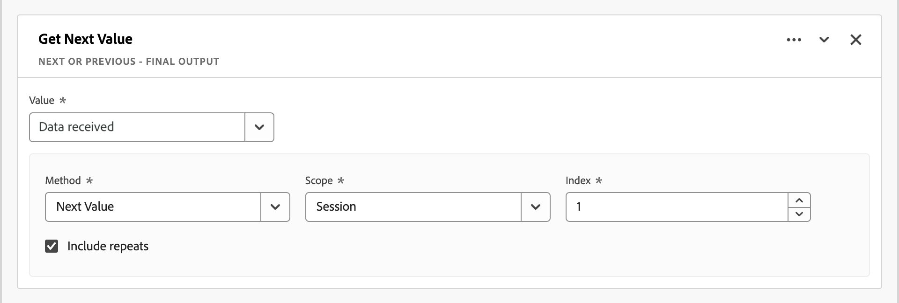

# Härledda fält

Härledda fält är en viktig aspekt av rapportfunktionen i realtid i Adobe Customer Journey Analytics. Med ett härlett fält kan du definiera (ofta komplexa) dataändringar direkt, via en anpassningsbar regelbyggare. Du kan sedan använda det härledda fältet som en komponent (mått eller dimension) i [Arbetsyta](../../analysis-workspace/home.md) eller ännu mer definiera det härledda fältet som en komponent i [Datavy](../data-views.md).

Härledda fält kan spara mycket tid och arbete jämfört med att omforma eller ändra data på andra platser utanför Customer Journey Analytics. Som [Dataprep](https://experienceleague.adobe.com/docs/experience-platform/data-prep/home.html), [Data Distiller](https://experienceleague.adobe.com/docs/experience-platform/query/data-distiller/overview.html)eller i dina egna ETL-/ELT-processer.

Härledda fält definieras i [Datavyer](../data-views.md), baseras på en uppsättning funktioner som definieras som regler och tillämpas på tillgängliga standard- och/eller schemafält.

Exempel:

- Definiera ett härlett sidnamnsfält som korrigerar felaktiga insamlade sidnamnsvärden för att korrigera sidnamnsvärden.

- Definiera ett härlett fält för marknadsföringskanal som fastställer rätt marknadsföringskanal baserat på ett eller flera villkor (till exempel URL-parameter, sidadress, sidnamn).

## Härlett fältgränssnitt

När du skapar eller redigerar ett härlett fält använder du det härledda fältgränssnittet.

|  | Namn | Beskrivning |
|---------|----------|--------|
| 1 | **Väljare** | Du använder väljarområdet för att markera och dra och släppa funktionen, funktionsmallen, schemafältet eller standardfältet till regelbyggaren.  Använd listrutan och välj mellan:   [!UICONTROL Functions] - listor tillgängliga [funktioner](#function-reference),   [!UICONTROL Function templates] - listor tillgängliga [funktionsmallar](#function-templates),    [!UICONTROL Schema fields] - listar fält som är tillgängliga från datauppsättningskategorier (händelse, profil, sökning) och tidigare definierade härledda fält, och   [!UICONTROL Standard fields] - standardfält (t.ex. ID för plattformsdatauppsättning). Endast strängfält och numeriska standardfält visas i väljaren. Om funktionen stöder andra datatyper kan standardfält med dessa andra datatyper väljas för värden eller fält i regelgränssnittet. Du kan söka efter funktioner, funktionsmallar, schema och standardfält med  Sökruta.  Du kan filtrera den markerade objektlistan genom att välja  Filtrera och ange filter i [!UICONTROL Filter fields by] -dialogrutan. Du kan enkelt ta bort filter med  för varje filter. |
| 2 | **Regelverktyget** | Du skapar det härledda fältet sekventiellt med en eller flera regler. En regel är en specifik implementering av en funktion och är därför alltid kopplad till endast en funktion. Du skapar en regel genom att dra och släppa en funktion i regelbyggaren. Funktionstypen bestämmer regelns gränssnitt. Se [Regelgränssnitt](#rule-interface) för mer information.  Du kan infoga en funktion i början, slutet eller mellan regler som redan finns i regelbyggaren. Den sista regeln i regelbyggaren avgör det härledda fältets slutliga utdata. |
| 3 | **[!UICONTROL ** Fältinställningar **]** | Du kan namnge och beskriva det härledda fältet och kontrollera dess fälttyp. |
| 4 | **[!UICONTROL ** Slutlig utmatning **]** | I det här området visas en direkt uppdaterad förhandsvisning av utdatavärden, baserat på data under de senaste 30 dagarna och de ändringar du gör i det härledda fältet i regelbyggaren. |

{style="table-layout:auto"}

## Guiden Fältmall

När du använder det härledda fältgränssnittet för första gången [!UICONTROL Start with a field template] guiden visas.

1. Välj den mall som bäst beskriver den typ av fält som du försöker skapa.
2. Välj **[!UICONTROL ** Välj **]** för att fortsätta

Dialogrutan för det härledda fältet innehåller regler (och funktioner) som är nödvändiga eller användbara för den typ av fält som du har valt. Se [Funktionsmallar](#function-templates) för mer information om de tillgängliga mallarna.

## Regelgränssnitt

När du definierar en regel i regelbyggaren använder du regelgränssnittet.

|  | Namn | Beskrivning |
|---------|----------|--------|
| A | **Regelnamn** | Regelnamnet är som standard **Regel X** (X refererar till ett sekvensnummer). Om du vill redigera namnet på en regel markerar du dess namn och skriver in det nya namnet, till exempel `Query Parameter`. |
| B | **Funktionsnamn** | Det valda funktionsnamnet för regeln, till exempel [!UICONTROL URL PARSE]. När funktionen är den sista i funktionssekvensen och fastställer de slutliga utdatavärdena följs funktionsnamnet av [!UICONTROL - FINAL OUTPUT], till exempel [!UICONTROL URL PARSE - FINAL OUTPUT].  Om du vill visa ett popup-fönster med mer information om funktionen väljer du . |
| C | **Regelbeskrivning** | Du kan också lägga till en beskrivning till en regel. Välj väljer **[!UICONTROL ** Lägg till beskrivning **]** för att lägga till en beskrivning eller **[!UICONTROL ** Redigera beskrivning **]** om du vill redigera en befintlig beskrivning. Använd redigeraren för att ange en beskrivning. Du kan använda verktygsfältet för att formatera texten (med formatväljare, fet, kursiv, understrykning, höger, vänster, centrerad, färg, nummerlista, punktlista) och lägga till länkar till extern information.  Klicka utanför redigeraren för att slutföra redigeringen av beskrivningen. |
| D | **Funktionsområde** | Definierar funktionens logik. Gränssnittet beror på funktionstypen. Listrutan för [!UICONTROL Field] eller [!UICONTROL Value] visar alla kategorier av fält (regler, standardfält, fält) som är tillgängliga, baserat på den typ av indata som funktionen förväntar sig. Du kan också dra och släppa ett fält från väljaren för schema- och standardfält till ett fält eller ett värde. När det dragna fältet kommer från en uppslagsuppsättning infogas en uppslagsfunktion automatiskt före den funktion som du definierar.  Se [Funktionsreferens](#function-reference) Detaljerad information om varje funktion som stöds. |

{style="table-layout:auto"}

## Skapa ett härlett fält

1. Välj en befintlig datavy eller skapa en datavy. Se [Datavyer](../data-views.md) för mer information.

2. Välj **[!UICONTROL ** Komponenter **]** -fliken i datavyn.

3. Välj **[!UICONTROL ** Skapa härlett fält **]** från den vänstra listen.

4. Använd [!UICONTROL Create derived field] gränssnitt. Se [Härlett fältgränssnitt](#derived-field-interface).

   Om du vill spara ditt nya härledda fält väljer du **[!UICONTROL ** Spara **]**.

5. Ditt nya härledda fält läggs till i [!UICONTROL Derived fields >] behållare, som en del av **[!UICONTROL ** Schemafält **]** till vänster i datavyn.

## Redigera ett härlett fält

1. Välj en befintlig datavy. Se [Datavyer](../data-views.md) för mer information.

2. Välj **[!UICONTROL ** Komponenter **]** -fliken i datavyn.

3. Välj **[!UICONTROL ** Schemafält **]** i [!UICONTROL Connection] till vänster.

4. Välj **[!UICONTROL ** Härledda fält >**]** behållare.

5. Håll pekaren över det härledda fält som du vill redigera och markera .

6. Använd knappen [!UICONTROL Edit derived field] gränssnitt. Se [Härlett fältgränssnitt](#derived-field-interface).

   - Välj **[!UICONTROL ** Spara **]** för att spara det uppdaterade härledda fältet.

   - Välj **[!UICONTROL ** Avbryt **]** om du vill avbryta alla ändringar du har gjort i det härledda fältet.

   - Välj **[!UICONTROL ** Spara som **]** för att spara det härledda fältet som ett nytt härlett fält. Det nya härledda fältet har samma namn som det ursprungliga redigerade härledda fältet med `(copy)` läggs till i den.

Om du har använt ett härlett fält som en komponent för mått eller mätvärden i datavyn kan du även:

1. Markera komponenten. Observera att komponenten kan ha ett annat namn än det härledda fältet.

1. I panelen Komponenter väljer du  bredvid det härledda fältet, under schemafältnamnet.

1. Använd knappen [!UICONTROL Edit derived field] gränssnitt. Se [Härlett fältgränssnitt](#derived-field-interface).

   - Välj **[!UICONTROL ** Spara **]** för att spara det uppdaterade härledda fältet.

   - Välj **[!UICONTROL ** Avbryt **]** om du vill avbryta alla ändringar du har gjort i det härledda fältet.

   - Välj **[!UICONTROL ** Spara som **]** för att spara det härledda fältet som ett nytt härlett fält. Det nya härledda fältet har samma namn som det ursprungliga redigerade härledda fältet med `(copy)` läggs till i den.

## Ta bort ett härlett fält

1. Välj en befintlig datavy. Se [Datavyer](../data-views.md) för mer information.

2. Välj **[!UICONTROL ** Komponenter **]** -fliken i datavyn.

3. Välj **[!UICONTROL ** Schemafält **]** tabba in [!UICONTROL Connection] fönster.

4. Välj **[!UICONTROL ** Härledda fält >**]** behållare.

5. Håll pekaren över det härledda fält som du vill ta bort och markera .

6. I [!UICONTROL Edit derived field] gränssnitt, välja **[!UICONTROL Delete]**.

   A [!UICONTROL Delete component] uppmanas du att bekräfta borttagningen. Ta hänsyn till eventuella externa referenser som finns till det härledda fältet utanför datavyn.

   - Välj **[!UICONTROL ** Fortsätt **]** för att ta bort det härledda fältet.

Om du har använt ett härlett fält som en komponent för mått eller mätvärden i datavyn kan du även:

1. Markera komponenten. Observera att komponenten kan ha ett annat namn än det härledda fältet.

1. I panelen Komponenter väljer du  bredvid det härledda fältet, under schemafältnamnet.

1. I [!UICONTROL Edit derived field] gränssnitt, välja **[!UICONTROL Delete]**.

   A [!UICONTROL Delete component] uppmanas du att bekräfta borttagningen. Ta hänsyn till eventuella externa referenser som finns till det härledda fältet utanför datavyn.

   - Välj **[!UICONTROL ** Fortsätt **]** för att ta bort det härledda fältet.

>[!NOTE]
>
>Härledda fält hanteras på anslutningsnivå i Customer Journey Analytics. Alla ändringar som görs i ett härlett fält i någon av de datavyer som är kopplade till anslutningen gäller för alla dessa associerade datavyer.

## Funktionsmallar

Funktionsmallar är tillgängliga för att snabbt skapa ett härlett fält för specifika användningsområden. Dessa funktionsmallar kan nås från väljarområdet i det härledda fältgränssnittet eller presenteras vid första användningen i [!UICONTROL Start with a field template] guide.

### Marknadsföringskanaler

Den här funktionsmallen använder en samling regler för att skapa marknadsföringskanaler.

+++ Information

Om du vill använda mallen måste du ange rätt parametrar för varje funktion som listas som en del av reglerna i mallen. Se [Funktionsreferens](#function-reference) för mer information.

+++

### Studsar

Den här funktionsmallen använder en samling regler för att identifiera webbplatsens gränser.

+++ Information

Om du vill använda mallen måste du ange rätt parametrar för varje funktion som listas som en del av reglerna i mallen. Se [Funktionsreferens](#function-reference) för mer information.

+++

### Kombinera flera Dimensioner

Den här funktionsmallen kombinerar två värden till ett.

+++ Information

Om du vill använda mallen måste du ange rätt parametrar för varje funktion som listas som en del av reglerna i mallen. Se [Funktionsreferens](#function-reference) för mer information.

+++

### Eget namn på datauppsättning

Den här funktionsmallen ger ett läsbart datauppsättningsnamn.

+++ Information

Om du vill använda mallen måste du ange rätt parametrar för varje funktion som listas som en del av reglerna i mallen. Se [Funktionsreferens](#function-reference) för mer information.

+++

### Sidnamn från URL

Den här funktionsmallen skapar ett enkelt sidnamn.

+++ Information

Om du vill använda mallen måste du ange rätt parametrar för varje funktion som listas som en del av reglerna i mallen. Se [Funktionsreferens](#function-reference) för mer information.

+++

### Semestersäsong

Den här funktionsmallen klassificerar nyckeltider för året.

+++ Information

Om du vill använda mallen måste du ange rätt parametrar för varje funktion som listas som en del av reglerna i mallen. Se [Funktionsreferens](#function-reference) för mer information.

+++

### Månadsmål

Den här funktionsmallen ställer in anpassade månatliga mål.

+++ Information

Om du vill använda mallen måste du ange rätt parametrar för varje funktion som listas som en del av reglerna i mallen. Se [Funktionsreferens](#function-reference) för mer information.

+++

### Hämta alla värden i avgränsad lista

Den här funktionsmallen konverterar en begränsad lista till en array.

+++ Information

Om du vill använda mallen måste du ange rätt parametrar för varje funktion som listas som en del av reglerna i mallen. Se [Funktionsreferens](#function-reference) för mer information.

+++

### Hämta första värdet i avgränsad lista

Den här funktionsmallen hämtar det första värdet i en avgränsad lista.

+++ Information

Om du vill använda mallen måste du ange rätt parametrar för varje funktion som listas som en del av reglerna i mallen. Se [Funktionsreferens](#function-reference) för mer information.

+++

### Hämta sista värdet i avgränsad lista

Den här funktionsmallen hämtar det sista värdet i en avgränsad lista.

+++ Information

Om du vill använda mallen måste du ange rätt parametrar för varje funktion som listas som en del av reglerna i mallen. Se [Funktionsreferens](#function-reference) för mer information.

+++

### Domännamn

Den här funktionsmallen extraherar domännamnet med ett reguljärt uttryck.

+++ Information

Om du vill använda mallen måste du ange rätt parametrar för varje funktion som listas som en del av reglerna i mallen. Se [Funktionsreferens](#function-reference) för mer information.

+++

### Hämta frågesträngsparameter

Den här funktionsmallen extraherar frågesträngsvärden.

+++ Information

Om du vill använda mallen måste du ange rätt parametrar för varje funktion som listas som en del av reglerna i mallen. Se [Funktionsreferens](#function-reference) för mer information.

+++

### Övergångsfält

Den här funktionsmallen övergår från ett fält till ett annat.

+++ Information

Om du vill använda mallen måste du ange rätt parametrar för varje funktion som listas som en del av reglerna i mallen. Se [Funktionsreferens](#function-reference) för mer information.

+++

### Enkel punktidentifiering

Den här funktionsmallen implementerar identifiering av ljusrobotar.

+++ Information

Om du vill använda mallen måste du ange rätt parametrar för varje funktion som listas som en del av reglerna i mallen. Se [Funktionsreferens](#function-reference) för mer information.

+++

### Avsluta länk

Den här funktionsmallen identifierar den senaste länken som klickats i en session.

+++ Information

Om du vill använda mallen måste du ange rätt parametrar för varje funktion som listas som en del av reglerna i mallen. Se [Funktionsreferens](#function-reference) för mer information.

+++

### Hämta länk

Den här funktionsmallen flaggar vanliga nedladdningslänkar.

+++ Information

Om du vill använda mallen måste du ange rätt parametrar för varje funktion som listas som en del av reglerna i mallen. Se [Funktionsreferens](#function-reference) för mer information.

+++

<!--

+++ Data clean up template

>[!WARNING]
>
>Could not find any information on this template.
+++

-->

## Funktionsreferens

{{select-package}}

För varje funktion som stöds finns information nedan:

- specifikationer:
   - Indatatyp: typ av data som stöds.
   - Indata: möjliga värden för indata.
   - inkluderade operatorer: operatorer som stöds för denna funktion (om sådana finns),
   - begränsningar: begränsningar som gäller för denna specifika funktion,
   - utdata.

- Användningsfall, inklusive
   - data innan härlett fält definieras,
   - hur det härledda fältet definieras,
   - efter att ha definierat det härledda fältet.

- begränsningar (om tillämpligt).

>[!NOTE]
>
>Uppslagsfunktionen har bytt namn till [Klassificera](#classify). Se [Klassificera](#classify) om du vill ha mer information.

<!-- CASE WHEN -->

### Skiftläge

Använder villkorliga värden som baseras på definierade villkor från ett eller flera fält. Dessa kriterier används sedan för att definiera värdena i ett nytt härlett fält, baserat på villkorens sekvens.

+++ Information

## Specifikationer {#casewhen-io}

| Typ av indatadata | Indata | Operatorer som ingår | Begränsningar | Utdata |
|---|---|---|---|---|
| <ul><li>Sträng</li><li>Numeriskt</li><li>Datum</li></ul> | <ul><li>[!UICONTROL If], [!UICONTROL Else If] container:
<ul><li>[!UICONTROL Value]</li><ul><li>Regler</li><li>Standardfält</li><li>Fält</li></ul><li>[!UICONTROL Criterion] (se inkluderade operatorer, baserat på vald värdetyp)</li></ul></li><li>[!UICONTROL Then set value to], [!UICONTROL Otherwise set value to]:
<ul><li>[!UICONTROL Value]</li><ul><li>Regler</li><li>Standardfält</li><li>Fält</li></ul></ul></li></ul> | 
Strängar
<ul><li>Är lika med</li><li>Liknar alla termer</li><li>Innehåller frasen</li><li>Innehåller valfri term</li><li>Innehåller alla termer</li><li>Börjar med</li><li>Börjar med valfri term</li><li>Slutar med</li><li>Slutar med valfri term</li><li>Är inte lika med</li><li>Motsvarar inte någon term</li><li>Innehåller inte frasen</li><li>Innehåller inga termer</li><li>Innehåller inte alla termer</li><li>Börjar inte med</li><li>Börjar inte med någon term</li><li>Slutar inte med</li><li>Slutar inte med någon term</li><li>Är inställd</li><li>Har inte angetts</li></ul>
Numeriskt
<ul><li>Är lika med</li><li>Är inte lika med</li><li>Är större än</li><li>Är större än eller lika med</li><li>Är mindre än</li><li>Är mindre än eller lika med</li><li>Är inställd</li><li>Har inte angetts</li></ul>
Datum
<ul><li>Är lika med</li><li>Är inte lika med</li><li>Är senare än</li><li>Är senare än eller lika med</li><li>Är före</li><li>Är före eller lika med</li><li>Är inställd</li><li>Har inte angetts</li></ul> | <ul><li>5 funktioner per härlett fält</li><li>200 [operatorer](#operators) per härlett fält. Ett exempel på en enskild operator är &#39;Referensdomän innehåller google&#39;. </li></ul> | 
Nytt härlett fält
 |

{style="table-layout:auto"}

## Användningsfall 1 {#casewhen-uc1}

Du vill definiera regler för att identifiera olika marknadsföringskanaler genom att tillämpa överlappande logik för att ange ett marknadsföringskanalfält till rätt värde:

- Om referenten kommer från en sökmotor och sidan har ett frågesträngsvärde där `cid` innehåller `ps_`bör marknadsföringskanalen identifieras som en [!DNL *Betalsökning*].
- Om referenten kommer från en sökmotor och sidan inte har frågesträngen `cid`bör marknadsföringskanalen identifieras som en [!DNL *Naturlig sökning*].
- Om en sida har ett frågesträngsvärde där `cid` innehåller `em_`bör marknadsföringskanalen identifieras som en [!DNL *E-post*].
- Om en sida har ett frågesträngsvärde där `cid` innehåller `ds_`bör marknadsföringskanalen identifieras som en [!DNL *Visa annons*].
- Om en sida har ett frågesträngsvärde där `cid` innehåller `so_`bör marknadsföringskanalen identifieras som en [!DNL *Betald social*].
- Om referenten kommer från en hänvisande domän till [!DNL twitter.com], [!DNL facebook.com], [!DNL linkedin.com], eller [!DNL tiktok.com]bör marknadsföringskanalen identifieras som en [!DNL *Naturlig social*].
- Om ingen av ovanstående regler överensstämmer bör marknadsföringskanalen identifieras som [!DNL *Annan referent*].

Om din plats får följande exempelhändelser, som innehåller [!UICONTROL Referrer] och [!UICONTROL Page URL]bör dessa händelser identifieras enligt följande:

| [!DNL Event] | [!DNL Referrer] | [!DNL Page URL] | [!DNL Marketing Channel] |
|:--:|----|----|----|
| 1 | `https://facebook.com` | `https://site.com/home` | [!DNL Natural Social] |
| 2 | `https://abc.com` | `https://site.com/?cid=ds_12345678` | [!DNL Display] |
| 3 | | `https://site.com/?cid=em_12345678` | [!DNL Email] |
| 4 | `https://google.com` | `https://site.com/?cid=ps_abc098765` | [!DNL Paid Search] |
| 5 | `https://google.com` | `https://site.com/?cid=em_765544332` | [!DNL Email] |
| 6 | `https://google.com` |  | [!DNL Natural Search] |

{style="table-layout:auto"}

### Data före {#casewhen-uc1-databefore}

| [!DNL Referrer] | [!DNL Page URL] |
|----|----|
| `https://facebook.com` | `https://site.com/home` |
| `https://abc.com` | `https://site.com/?cid=ds_12345678` |
|  | `https://site.com/?cid=em_12345678` |
| `https://google.com` | `https://site.com/?cid=ps_abc098765` |
| `https://google.com` | `https://site.com/?cid=em_765544332` |
| `https://google.com` | |

{style="table-layout:auto"}

### Härlett fält {#casewhen-uc1-derivedfield}

Du definierar ett nytt `Marketing Channel` härlett fält. Du använder [!UICONTROL CASE WHEN] funktioner för att definiera regler som skapar värden för den baserat på befintliga värden för båda `Page URL` och `Referring URL` fält.

Observera hur funktionen används [!UICONTROL URL PARSE] för att definiera regler för hämtning av värden för `Page Url` och `Referring Url` före [!UICONTROL CASE WHEN] regler tillämpas.

### Data efter {#casewhen-uc1-dataafter}

| [!DNL Marketing Channel] |
|----|
| [!DNL Natural Social] |
| [!DNL Display] |
| [!DNL Email] |
| [!DNL Paid Search] |
| [!DNL Email] |
| [!DNL Natural Search] |

{style="table-layout:auto"}

## Användningsfall 2 {#casewhen-uc2}

Du har samlat in flera olika varianter av sökningar i [!DNL Product Finding Methods] dimension. Om du vill förstå det övergripande resultatet för sökning och bläddring måste du lägga mycket tid på att kombinera resultaten manuellt.

Din webbplats samlar in följande värden för din [!DNL Product Finding Methods] dimension. Alla dessa värden anger slutligen en sökning.

| Insamlat värde | Faktiskt värde |
|---|---|
| [!DNL search p13n_no] | [!DNL search] |
| [!DNL search p13n_yes] | [!DNL search] |
| [!DNL search refine p13n_no] | [!DNL search] |
| [!DNL search refine p13n_yes] | [!DNL search] |
| [!DNL search redirect p13n_yes] | [!DNL search] |
| [!DNL search-redirect] | [!DNL search] |

{style="table-layout:auto"}

### Data före {#casewhen-uc2-databefore}

| [!DNL Product Finding Methods] |
|----|
| [!DNL search p13_no] |
| [!DNL search p13_yes] |
| [!DNL browse] |
| [!DNL search refine p13_no] |
| [!DNL search refine p13_yes] |
| [!DNL browse] |
| [!DNL search redirect p13_yes] |
| [!DNL search-redirect] |
| [!DNL browse] |

{style="table-layout:auto"}

### Härlett fält {#casewhen-uc2-derivedfield}

Du definierar en `Product Finding Methods (new)` härlett fält. Du skapar följande [!UICONTROL CASE WHEN] regler i regelbyggaren. Dessa regler tillämpar logik för alla möjliga varianter av det gamla [!UICONTROL Product Finding Methods] fältvärden för `search` och `browse` med [!UICONTROL Contains the phrase] kriterium.

### Data efter {#casewhen-uc2-dataafter}

| [!DNL Product Finding Methods (new)] |
|----|
| [!DNL search] |
| [!DNL search] |
| [!DNL browse] |
| [!DNL search] |
| [!DNL search] |
| [!DNL browse] |
| [!DNL search] |
| [!DNL search] |
| [!DNL browse] |

{style="table-layout:auto"}

## Användningsfall 3 {#casewhen-uc3}

Som reseföretag vill du korta resetiden för bokade resor så att du kan rapportera om hur långa resorna är.

Antaganden:

- Organisationen samlar ihop resans varaktighet till ett numeriskt fält.
- De skulle vilja lägga in 1-3 dagars varaktighet i en hink som kallas[!DNL short trip]&#39;
- De skulle vilja lägga in 4-7 dagars varaktighet i en hink som kallas[!DNL medium trip]&#39;
- De vill lägga in mer än 8 dagars varaktighet i en hink som kallas[!DNL long trip]&#39;
- 132 resor bokades för en dag
- 110 resor bokades för en tvådagarsperiod
- 105 resor bokades för en 3-dagarsperiod
- 99 resor var bokade i 4 dagar
- 92 resor bokades för en femdagarsperiod
- 85 resor bokades för en sexdagarsperiod
- 82 resor bokades för en 7-dagarsperiod
- 78 resor var bokade i 8 dagar
- 50 resor bokades för en 9-dagarsperiod
- 44 resor bokades under en 10-dagarsperiod
- 38 resor bokades för en 11-dagarsperiod
- 31 resor bokades för en tolvdagarsperiod

Din rapport ska se ut så här:

| [!DNL Trip Duration Type] | [!DNL Bookings] |
|----|---:|
| [!DNL medium trip] | 358 |
| [!DNL short trip] | 347 |
| [!DNL long trip] | 241 |

{style="table-layout:auto"}

### Data före {#casewhen-uc3-databefore}

| [!DNL Trip Duration] |
|---:|
| 1 |
| 12 |
| 3 |
| 6 |
| 4 |
| 8 |
| 6 |
| 2 |
| 1 |
| 2 |
| 21 |
| 8 |

### Härlett fält {#casewhen-uc3-derivedfield}

Du definierar en `Trip Duration (bucketed)` härlett fält. Du skapar följande [!UICONTROL CASE WHEN] regel i regelbyggaren. Den här regeln använder logik för att bucket den gamla [!UICONTROL Trip Duration] fältvärden i tre värden: `short trip`, `medium  trip`och `long trip`.

### Data efter {#casewhen-uc3-dataafter}

| [!DNL Trip Duration (bucketed)] |
|---|
| [!DNL short trip] |
| [!DNL long trip] |
| [!DNL short trip] |
| [!DNL medium trip] |
| [!DNL medium trip] |
| [!DNL long trip] |
| [!DNL medium trip] |
| [!DNL short trip] |
| [!DNL short trip] |
| [!DNL short trip] |
| [!DNL long trip] |
| [!DNL long trip] |

## Mer information

Customer Journey Analytics använder en kapslad behållarstruktur, som utformats efter Adobe Experience Platform [XML](https://experienceleague.adobe.com/docs/experience-platform/xdm/home.html?lang=sv) (Experience Data Model). Se [Behållare](../create-dataview.md#containers) och [Filterbehållare](../../components/filters/filters-overview.md#filter-containers) för mer bakgrundsinformation. Den här behållarmodellen är flexibel till sin natur men medför vissa begränsningar när regelverktyget används.

Customer Journey Analytics använder följande standardbehållarmodell:

Följande begränsningar gäller och används när *markera* och *inställning* värden.

|  | Begränsningar |
|:---:|----|
| **A** | Värden du *välj* inom samma [!UICONTROL If], [!UICONTROL Else If] construct (med [!UICONTROL And] eller [!UICONTROL Or]) i en regel måste komma från samma behållare och kan vara av valfri typ (sträng) , numerisk och så vidare).   |
| **B** | Alla värden du anger *set* över en regel måste komma från samma behållare och ha samma typ eller ett härlett värde av samma typ.    |
| **C** | Värdena du anger *välj* över [!UICONTROL If], [!UICONTROL Else If] konstruerar i regeln do *not* måste komma från samma behållare och gör *not* måste vara av samma typ.    |

{style="table-layout:auto"}

+++

<!-- CLASSIFY -->

### Klassificera

Definierar en uppsättning värden som ersätts av motsvarande värden i ett nytt härlett fält.

+++ Information

>[!NOTE]
>
>Den här funktionen hette ursprungligen Sök efter, men har bytt namn till Klassificera för att få plats med sökfunktionen med olika funktioner.

## Specifikationer {#classify-io}

| Typ av indatadata | Indata | Operatorer som ingår | Begränsningar | Utdata |
|---|---|---|---|---|
| <ul><li>Sträng</li><li>Numeriskt</li><li>Datum</li></ul> | <ul><li>[!UICONTROL Field to classify]:<ul><li>Regler</li><li>Standardfält</li><li>Fält</li></ul></li><li>[!UICONTROL When value equals] och [!UICONTROL Replace values with]:
<ul><li>Sträng</li></ul><li>Visa originalvärden<ul><li>Boolean</li></ul></li></ul> | 
Ej tillämpligt
 | <ul><li>5 funktioner per härlett fält</li><li>200 [operatorer](#operators) per härlett fält. Varje post för [!UICONTROL When value equals original value] [!UICONTROL Replace value with New value] betraktas som en åtgärd.</li></ul> | 
Nytt härlett fält
 |

{style="table-layout:auto"}

## Användningsfall 1 {#classify-uc1}

Du har en CSV-fil som innehåller en nyckelkolumn för `hotelID` och en eller flera kolumner som är associerade med `hotelID`: `city`, `rooms`, `hotel name`.
Du samlar in [!DNL Hotel ID] i en dimension men vill skapa en [!DNL Hotel Name] dimension härledd från `hotelID` i CSV-filen.

**CSV-filstruktur och innehåll**

| [!DNL hotelID] | [!DNL city] | [!DNL rooms] | [!DNL hotel name] |
|---|---|---:|---|
| [!DNL SLC123] | [!DNL Salt Lake City] | 40 | [!DNL SLC Downtown] |
| [!DNL LAX342] | [!DNL Los Angeles] | 60 | [!DNL LA Airport] |
| [!DNL SFO456] | [!DNL San Francisco] | 75 | [!DNL Market Street] |
| [!DNL AMS789] | [!DNL Amsterdam] | 50 | [!DNL Okura] |

{style="table-layout:auto"}

**Aktuell rapport**

| [!DNL Hotel ID] | Produktvyer |
|---|---:|
| [!DNL SLC123] | 200 |
| [!DNL LX342] | 198 |
| [!DNL SFO456] | 190 |
| [!DNL AMS789] | 150 |

{style="table-layout:auto"}

**Önskad rapport**

| [!DNL Hotel Name] | Produktvyer |
|----|----:|
| [!DNL SLC Downtown] | 200 |
| [!DNL LA Airport] | 198 |
| [!DNL Market Street] | 190 |

{style="table-layout:auto"}

### Data före {#classify-uc1-databefore}

| [!DNL Hotel ID] |
|----|
| [!DNL SLC123] |
| [!DNL LAX342] |
| [!DNL SFO456] |
| [!DNL AMS789] |

{style="table-layout:auto"}

### Härlett fält {#classify-uc1-derivedfield}

Du definierar en `Hotel Name` härlett fält. Du använder [!UICONTROL CLASSIFY] funktion som definierar en regel där du kan klassificera värden för [!UICONTROL Hotel ID] och ersätt med nya värden.

Om du vill inkludera originalvärden som du inte har definierat som en del av värdena som ska klassificeras (till exempel Hotel-ID AMS789) måste du markera **[!UICONTROL Show original values]**. Detta garanterar att AMS789 är en del av utdata för det härledda fältet, trots att det värdet inte klassificeras.

### Data efter {#classify-uc1-dataafter}

| [!DNL Hotel Name] |
|----|
| [!DNL SLC Downtown] |
| [!DNL LA Airport] |
| [!DNL Market Street] |

{style="table-layout:auto"}

## Användningsfall 2 {#classify-uc2}

Du har samlat in URL:er i stället för det egna sidnamnet för flera sidor. Den här blandade mängden värden bryter rapporteringen.

### Data före {#classify-uc2-databefore}

| [!DNL Page Name] |
|---|
| [!DNL Home Page] |
| [!DNL Flight Search] |
| `http://www.adobetravel.ca/Hotel-Search` |
| `https://www.adobetravel.com/Package-Search` |
| [!DNL Deals & Offers] |
| `http://www.adobetravel.ca/user/reviews` |
| `https://www.adobetravel.com.br/Generate-Quote/preview` |

{style="table-layout:auto"}

### Härlett fält {#classify-uc2-derivedfield}

Du definierar en `Page Name (updated)` härlett fält. Du använder [!UICONTROL CLASSIFY] funktion som definierar en regel där du kan klassificera värden för dina befintliga [!UICONTROL Page Name] och ersätt med uppdaterade korrekta värden.

### Data efter {#classify-uc2-dataafter}

| [!DNL Page Name (updated)] |
|---|
| [!DNL Home Page] |
| [!DNL Flight Search] |
| [!DNL Hotel Search] |
| [!DNL Package Search] |
| [!DNL Deals & Offers] |
| [!DNL Reviews] |
| [!DNL Generate Quote] |

## Mer information {#classify-moreinfo}

Följande ytterligare funktioner är tillgängliga i gränssnittet Klassifiera regel:

- Om du snabbt vill ta bort alla tabellvärden väljer du  **[!UICONTROL Clear all table values]**.
- Om du vill överföra en CSV-fil som innehåller originalvärden för När värden är lika och nya värden för Ersätt värden med väljer du  **[!UICONTROL Upload CSV]**.
- Om du vill hämta en mall för att skapa en CSV-fil med ursprungliga och nya värden att överföra väljer du  **[!UICONTROL Download CSV template]**.
- Om du vill hämta en CSV-fil med alla ursprungliga och nya värden ifyllda i regelgränssnittet väljer du  **[!UICONTROL Download CSV values]**.

+++

<!-- CONCATENATE -->

### Sammanfoga

Kombinerar fältvärden till ett nytt härlett fält med definierade avgränsare.

+++ Information

## Specifikationer {#concatenate-io}

| Typ av indatadata | Indata | Operatorer som ingår | Begränsningar | Utdata |
|---|---|---|---|---|
| <ul><li>Sträng</li></ul> | <ul><li>[!UICONTROL Value]:<ul><li>Regler</li><li>Standardfält</li><li>Fält</li><li>Sträng</li></ul></li><li>[!UICONTROL Delimiter]:<ul><li>Sträng</li></ul></li> </ul> | 
Ej tillämpligt
 | 
2 funktioner per härlett fält
 | 
Nytt härlett fält
 |

{style="table-layout:auto"}

## Använd skiftläge {#concatenate-uc}

Du samlar för närvarande in kod för ursprung och destinationsflygplats som separata fält. Du vill använda de två fälten och kombinera dem till ett enda mått, avgränsade med ett bindestreck (-). Så att du kan analysera kombinationen av ursprung och mål för att identifiera de vanligaste rutterna som bokats.

Antaganden:

- Origo- och målvärden samlas i separata fält i samma tabell.
- Användaren bestämmer sig för att använda avgränsaren &#39;-&#39; mellan värdena.

Tänk dig följande bokningar:

- Kund ABC123 bokar en flygning mellan Salt Lake City (SLC) och Orlando (MCO)
- Kund ABC456 bokar ett flyg mellan Salt Lake City (SLC) och Los Angeles (LAX)
- Kund ABC789 bokar ett flyg mellan Salt Lake City (SLC) och Seattle (SEA)
- Kund ABC987 bokar ett flyg mellan Salt Lake City (SLC) och San Jose (SJO)
- Kund ABC654 bokar en flygning mellan Salt Lake City (SLC) och Orlando (MCO)

Rapporten ska se ut så här:

| Ursprung / Mål | Bokningar |
|----|---:|
| SLC-MCO | 2 |
| SLC-LAX | 1 |
| SLC-SEA | 1 |
| SLC-SJO | 1 |

{style="table-layout:auto"}

### Data före {#concatenate-uc-databefore}

| Ursprung | Mål |
|----|---:|
| SLC | MCO |
| SLC | LAX |
| SLC | SEA |
| SLC | SJO |
| SLC | MCO |

{style="table-layout:auto"}

### Härlett fält {#concatenate-derivedfield}

Du definierar ett nytt [!UICONTROL Origin - Destination] härlett fält. Du använder [!UICONTROL CONCATENATE] funktion som definierar en regel som sammanfogar [!UICONTROL Original] och [!UICONTROL Destination] fält med `-` [!UICONTROL Delimiter].

### Data efter {#concatenate-dataafter}

| Ursprung - destination (härlett fält) |
|---|
| SLC-MCO |
| SLC-LAX |
| SLC-SEA |
| SLC-SJO |
| SLC-MCO |

{style="table-layout:auto"}

+++

<!-- FIND AND REPLACE -->

### Sök och ersätt

Söker efter alla värden i ett markerat fält och ersätter dessa värden med ett annat värde i ett nytt härlett fält.

+++ Information

## Specifikationer {#findreplace-io}

| Typ av indatadata | Indata | Operatorer som ingår | Begränsningar | Utdata |
|---|---|---|---|---|
| <ul><li>Sträng</li></ul> | <ul><li>[!UICONTROL Value]<ul><li>Regler</li><li>Standardfält</li><li>Fält</li></ul></li><li>[!UICONTROL Find all], [!UICONTROL and replace all with]:<ul><li>Sträng</li></ul></li></ul></ul> | 
Strängar
<ul><li>[!UICONTROL Find all], [!UICONTROL and replace all with]</li></ul> | 
5 funktioner per härlett fält
 | 
Nytt härlett fält
 |

{style="table-layout:auto"}

## Använd skiftläge {#findreplace-uc}

Du har fått vissa felformaterade värden för din rapport om externa marknadsföringskanaler, till exempel `email%20 marketing` i stället för `email marketing`. Dessa felformaterade värden utgör en del av rapporteringen och gör det svårare att se hur e-postmeddelanden fungerar. Du vill ersätta `email%20marketing` med `email marketing`.

**Ursprunglig rapport**

| [!DNL External Marketing Channels] | [!DNL Sessions] |
|---|--:|
| [!DNL email marketing] | 500 |
| [!DNL email %20marketing] | 24 |

{style="table-layout:auto"}

**Önskad rapport**

| [!DNL External Marketing Channels] | [!DNL Sessions] |
|---|--:|
| [!DNL email marketing] | 524 |

### Data före {#findreplace-uc-databefore}

| [!DNL External Marketing] |
|----|
| [!DNL email marketing] |
| [!DNL email%20marketing] |
| [!DNL email marketing] |
| [!DNL email marketing] |
| [!DNL email%20marketing] |

{style="table-layout:auto"}

### Härlett fält {#findreplace-uc-derivedfield}

Du definierar en `Email Marketing (updated)` härlett fält. Du använder [!UICONTROL FIND AND REPLACE] funktion för att definiera en regel för att söka efter och ersätta alla förekomster av `email%20marketing` med `email marketing`.

### Data efter {#findreplace-uc-dataafter}

| [!DNL External Marketing (updated)] |
|----|
| [!DNL email marketing] |
| [!DNL email marketing] |
| [!DNL email marketing] |
| [!DNL email marketing] |
| [!DNL email marketing] |

{style="table-layout:auto"}

+++

<!-- LOOKUP -->

### Sök

Sök efter värden med hjälp av ett fält från en uppslagsdatauppsättning och returnerar ett värde i ett nytt härlett fält eller för vidare regelbearbetning.

+++ Information

## Specifikation {#lookup-io}

| Typ av indatadata | Indata | Operatorer som ingår | Gräns | Utdata |
|---|---|---|---|---|
| <ul><li>Sträng</li><li>Numeriskt</li><li>Datum</li></ul> | <ul><li>[!UICONTROL Field to apply lookup]:</li><ul><li>Regler</li><li>Standardfält</li><li>Fält</li></ul><li>[!UICONTROL Lookup dataset]</li><ul><li>Datauppsättning</li></ul><li>[!UICONTROL Matching key]<ul><li>Regler</li><li>Fält</li></ul></li><li>Värden som ska returneras<ul><li>Regler</li><li>Fält</li></ul></li></ul> | 
Ej tillämpligt
 | 
3 funktioner per härlett fält
 | 
Nytt härlett fält eller värde för vidare bearbetning i nästa regel
 |

{style="table-layout:auto"}

## Använd skiftläge {#lookup-uc}

Du vill söka efter aktivitetsnamnet med aktivitets-ID som samlats in när kunderna klickade på en anpassad banderoll som visas via Adobe Target. Du vill använda en uppslagsdatauppsättning med A4T-aktiviteter (Analytics for Target) som innehåller aktivitets-ID och aktivitetsnamn.

### A4T-datauppsättning för sökning {#lookup-uc-lookup}

| Aktivitets-ID | Aktivitetsnamn |
|---|---|
| 415851 | Kategorisidor för MVT-provning |
| 415852 | Luma - kampanj max 2022 |
| 402922 | Banderoller på startsidan |

{style="table-layout:auto"}

### Härlett fält {#lookup-uc-derivedfield}

Du definierar en `Activity Name` härlett fält. Du använder [!UICONTROL LOOKUP] -funktion för att definiera en regel för att söka efter värdet från dina insamlade data, som anges i [!UICONTROL Field to apply lookup] fält (till exempel **[!DNL ActivityIdentifier]**). Du väljer uppslagsdatauppsättning på menyn [!UICONTROL Lookup dataset] list (till exempel **[!DNL New CJA4T Activities]**). Sedan markerar du identifierarfältet (till exempel **[!DNL ActivityIdentifier]**) från [!UICONTROL Matching key] listan och fältet som ska returneras från [!UICONTROL Values to return] list (till exempel **[!DNL ActivityName]**).

## Mer info

Du kan snabbt infoga en [!UICONTROL Lookup] funktionen i regelbyggaren som redan innehåller en eller flera andra funktioner.

1. Välj **[!UICONTROL Schema fields]** från väljare.
1. Välj  **[!UICONTROL Lookup datasets]**.
1. Välj din uppslagsdatauppsättning och sök efter det fält som du vill använda för sökning.
1. Dra och släpp sökfältet på något av de tillgängliga inmatningsfälten för en funktion (till exempel Skiftläge). Om det är giltigt, en blå ruta med etiketten **[!UICONTROL + Add]**kan du släppa fältet och automatiskt infoga en sökfunktion innan funktionen som du släppte sökfältet på. Den infogade uppslagsfunktionen fylls automatiskt i med relevanta värden för alla fält.
   

+++

<!-- LOWERCASE -->

### Gemener

Konverterar värden från ett fält till gemener och lagrar dem i ett nytt härlett fält.

+++ Information

## Specifikation {#lowercase-io}

| Typ av indatadata | Indata | Operatorer som ingår | Gräns | Utdata |
|---|---|---|---|---|
| <ul><li>Sträng</li><li>Numeriskt</li><li>Datum</li></ul> | <ul><li>[!UICONTROL Field]:</li><ul><li>Regler</li><li>Standardfält</li><li>Fält</li></ul> | 
Ej tillämpligt
 | 
2 funktioner per härlett fält
 | 
Nytt härlett fält
 |

{style="table-layout:auto"}

## Använd skiftläge {#lowercase-uc}

Du vill konvertera alla insamlade produktnamn till gemener för korrekt rapportering.

### Data före {#lowercase-uc-databefore}

| Samlade produktnamn | Produktvyer |
|---|---:|
| Tennisracket | 35 |
| Tennis Racket | 33 |
| tennisracket | 21 |
| Baseboll | 15 |
| Baseball Bat | 12 |
| baseboll | 10 |

{style="table-layout:auto"}

### Härlett fält {#lowercase-uc-derivedfield}

Du definierar en `Product Names` härlett fält. Du använder [!UICONTROL LOWERCASE] för att definiera en regel som konverterar värdet från [!UICONTROL Collected Product Names] fält till gemener och lagra det i det nya härledda fältet.

### Data efter {#lowercase-uc-dataafter}

| Produktnamn | Produktvyer |
|---|---|
| tennisracket | 89 |
| baseboll | 37 |

{style="table-layout:auto"}

+++

<!-- MATH -->

### Matematik

Använd enkla matematiska operatorer (lägg till, subtrahera, multiplicera, dela och höj till en potens) i numeriska fält.

+++ Information

## Specifikation {#math-io}

| Typ av indatadata | Indata | Operatorer som ingår | Gräns | Utdata |
|---|---|---|---|---|
| <ul><li>Numeriskt</li></ul> | <ul><li>Ett eller flera numeriska fält</li><li>En eller flera operatorer (lägg till, subtrahera, multiplicera, dividera, öka till en effekt)</li><li>Indatavärde från användare</li></ul> | <ul><li>`+` (lägg till)</li><li>`-` (subtrahera)</li><li>`*` (multiplicera)</li><li>`/` (dividera)</li><li>`^` (kraftökning)</li></ul> | <ul><li>25 operationer per härlett fält</li><li>5 Matematiska funktioner per härlett fält</li></ul> | 
Nytt härlett fält
 |

{style="table-layout:auto"}

## Använd skiftläge {#math-uc}

På grund av inflationen vill du korrigera intäktssiffrorna för inmatade CRM-data med 5 % uppblåsning.

### Data före {#math-uc-databefore}

| CRM-ID | Årsintäkt |
|---|---:|
| 1234 | 35 070 000 |
| 4133 | 7 500 000 |
| 8110 | 10 980 |
| 2201 | 42 620 |

{style="table-layout:auto"}

### Härlett fält {#math-uc-derivedfield}

Du definierar en `Corrected Annual Revenue` härlett fält. Du använder [!UICONTROL MATH] för att definiera en regel som multiplicerar det ursprungliga årsomsättningsnumret med 1,05.

### Data efter {#math-uc-dataafter}

| CRM-ID | Korrigerad årsomsättning |
|---|---:|
| 1234 | 36 823 500 |
| 4133 | 7 875 000 |
| 8110 | 11 529,00 |
| 2201 | 44 751 |

{style="table-layout:auto"}

## Mer info {#math-more-info}

Så här skapar du en formel:

1. Börja skriva i formelfältet och i numeriska fält som matchar det du skriver. Du kan också dra och släppa ett numeriskt fält från de tillgängliga fälten i den vänstra rutan.
   

1. Lägg till operanden (till exempel `*` att multiplicera) följt av ett annat fält eller ett statiskt värde. Du kan använda parenteser för att definiera mer komplexa formler.

1. Infoga ett statiskt värde (till exempel `1.05`) skriver du värdet och väljer **[!UICONTROL Add *x *som ett statiskt värde]**eller **[!UICONTROL Add -*x* som ett negativt statiskt värde]** på snabbmenyn.
   

1. En grön bock  anger om matematiska formler är giltiga, annars visas en varning  och meddelandet [!UICONTROL Invalid formula expression].
   

Det finns viktiga saker att tänka på när du arbetar med statiska siffror i [!UICONTROL MATH] funktion:

- Statiska värden måste associeras med ett fält. Använd till exempel [!UICONTROL MATH] Funktionen med bara statiska fält stöds inte.
- Du kan inte använda kraftvärmeoperatorn (`ˆ`) på ett statiskt värde.
- Om du använder flera statiska värden i en formel bör dessa statiska värden grupperas med parentes för att formeln ska vara giltig. Exempel:

   - Den här formeln returnerar ett fel.
     

   - Den här formeln är giltig.
     

+++

<!-- MERGE FIELDS -->

### Sammanfoga fält

Sammanfogar värden från två olika fält till ett nytt härlett fält.

+++ Information

## Specifikation {#merge-fields-io}

| Typ av indatadata | Indata | Operatorer som ingår | Gräns | Utdata |
|---|---|---|---|---|
| <ul><li>Sträng</li><li>Numeriskt</li><li>Datum</li></ul> | <ul><li>[!UICONTROL Field]:</li><ul><li>Regler</li><li>Standardfält</li><li>Fält</li></ul> | 
Ej tillämpligt
 | 
5 funktioner per härlett fält
 | 
Nytt härlett fält
 |

{style="table-layout:auto"}

## Använd skiftläge {#merge-fields-uc}

Du vill skapa en dimension från sidnamnsfältet och anropsorsaksfältet med syftet att analysera resan över flera kanaler.

### Data före {#merge-fields-uc-databefore}

| Sidnamn | Session | Besökare |
|---|--:|--:|
| hjälpsida | 250 | 200 |
| hemsida | 500 | 250 |
| produktinformationssida | 300 | 200 |

{style="table-layout:auto"}

| Anledning till samtalet | Session | Besökare |
|---|--:|--:|
| frågor om min beställning | 275 | 250 |
| ändra min beställning | 150 | 145 |
| problem med beställning | 100 | 95 |

{style="table-layout:auto"}

### Härlett fält {#merge-fields-uc-derivedfield}

Du definierar en `Cross Channel Interactions` härlett fält. Du använder [!UICONTROL MERGE FIELDS] funktion som definierar en regel som sammanfogar värdena från [!UICONTROL Page Name] fält och [!UICONTROL Call Reason] och lagra det i det nya härledda fältet.

### Data efter {#merge-fields-uc-dataafter}

| Interaktion över flera kanaler | Sessioner | Besökare |
|---|--:|--:|
| hemsida | 500 | 250 |
| produktinformationssida | 300 | 200 |
| frågor om min beställning | 275 | 250 |
| hjälpsida | 250 | 200 |
| ändra min beställning | 150 | 145 |
| problem med beställning | 100 | 95 |

{style="table-layout:auto"}

## Mer information {#merge-fields-moreinfo}

Du måste välja samma typ av fält i en regel för att slå samman fält. Om du till exempel markerar ett datumfält måste alla andra fält som du vill sammanfoga vara datumfält.

+++

<!-- NEXT OR PREVIOUS -->

### Nästa eller Föregående

Tar ett fält som indata och löser nästa eller föregående värde för det fältet inom sessionens eller användningens omfattning. Detta gäller endast fälten i tabellerna Besök och Händelse.

+++ Information

## Specifikation {#prevornext-io}

| Typ av indatadata | Indata | Operatorer som ingår | Gräns | Utdata |
|---|---|---|---|---|
| <ul><li>Sträng</li><li>Numeriskt</li><li>Datum</li></ul> | <ul><li>[!UICONTROL Field]:</li><ul><li>Regler</li><li>Standardfält</li><li>Fält</li></ul><li>[!UICONTROL Method]:<ul><li>Föregående värde</li><li>Nästa värde</li></ul></li><li>[!UICONTROL Scope]:<ul><li>Person</li><li>Session</li></ul></li><li>[!UICONTROL Index]:<ul><li>Numeriskt</li></ul><li>[!UICONTROL Include repeats]:<ul><li>Boolean</li></ul></li><li>[!UICONTROL Include 'No Values']:<ul><li>Boolean</li></ul></li></ul> | 
Ej tillämpligt
 | 
3 funktioner per härlett fält
 | 
Nytt härlett fält
 |

{style="table-layout:auto"}

## Använd skiftläge {#prevornext-uc1}

Du skulle vilja förstå vad **nästa** eller **föregående** är värdet för de data som du tar emot, med hänsyn tagen till upprepningsvärden.

### Data {#prevornext-uc1-databefore}

**Exempel 1 - Hantera inklusive upprepningar**

| Mottagna data | Nästa värde Session Index = 1 Inkludera upprepningar | Nästa värde Session Index = 1 Inkludera inte upprepningar | Föregående värde Session Index = 1 Inkludera upprepningar | Föregående värde Session Index = 1 Inkludera inte upprepningar |
|---|---|---|---|---|
| home | home | sök | *Inget värde* | *Inget värde* |
| home | sök | sök | home | *Inget värde* |
| sök | sök | produktinformation | home | home |
| sök | produktinformation | produktinformation | sök | home |
| produktinformation | sök | sök | sök | sök |
| sök | produktinformation | produktinformation | produktinformation | produktinformation |
| produktinformation | sök | sök | sök | sök |
| sök | sök | *Inget värde* | produktinformation | produktinformation |
| sök | *Inget värde* | *Inget värde* | sök | produktinformation |

{style="table-layout:auto"}

**Exempel 2 - Hanteringen inkluderar upprepningar med tomma värden i mottagna data**

| Mottagna data | Nästa värde Session Index = 1 Inkludera upprepningar | Nästa värde Session Index = 1 Inkludera inte upprepningar | Föregående värde Session Index = 1 Inkludera upprepningar | Föregående värde Session Index = 1 Inkludera inte upprepningar |
|---|---|---|---|---|
| home | home | sök | *Inget värde* | *Inget värde* |
| home | home | sök | home | *Inget värde* |
| home | sök | sök | home | *Inget värde* |
| sök | sök | produktinformation | home | home |
|   |   |   |   |   |
| sök | sök | produktinformation | sök | home |
| sök | produktinformation | produktinformation | sök | home |
| produktinformation | *Inget värde* | *Inget värde* | sök | sök |
|   |   |   |   |   |

{style="table-layout:auto"}

### Härlett fält {#prevnext-uc1-derivedfield}

Du definierar en `Next Value` eller `Previous value` härlett fält. Du använder [!UICONTROL NEXT OR PREVIOUS] -funktion för att definiera en regel som markerar [!UICONTROL Data received] fält, markera [!UICONTROL Next value] eller [!UICONTROL Previous value] as [!UICONTROL Method], [!UICONTROL Session] som omfång och ange värdet för [!UICONTROL Index] till `1`.

## Mer information {#prevnext-moreinfo}

Du kan bara markera fält som tillhör tabellen Besök eller Händelse.

[!UICONTROL Include repeats] avgör hur upprepade värden för [!UICONTROL NEXT OR PREVIOUS] funktion.

- Inkludera upprepande utseenden och nästa eller föregående värden. If [!UICONTROL Include Repeats] om du väljer det här alternativet ignoreras alla sekventiella upprepningar av nästa eller föregående värden från den aktuella träffen.

- Rader utan (tomma) värden för ett markerat fält returneras inte med nästa eller föregående värden som en del av [!UICONTROL NEXT OR PREVIOUS] funktionsutdata.

+++

<!-- REGEX REPLACE -->

### Regex Replace

Ersätter ett värde från ett fält med ett reguljärt uttryck i ett nytt härlett fält.

+++ Information

## Specifikation {#regex-replace-io}

| Typ av indatadata | Indata | Operatorer som ingår | Gräns | Utdata |
|---|---|---|---|---|
| <ul><li>Sträng</li><li>Numeriskt</li></ul> | <ul><li>[!UICONTROL Field]:</li><ul><li>Regler</li><li>Standardfält</li><li>Fält</li></ul></ul><ul><li>[!UICONTROL Regex]:</li><ul><li>Sträng</li></ul></li><li>[!UICONTROL Output Format]:<ul><li>Sträng</li></ul></ul><ul><li>Skiftlägeskänslig</li><ul><li>Boolean</li></ul></li></ul></li> | 
Ej tillämpligt
 | 
1 funktion per härlett fält
 | 
Nytt härlett fält
 |

{style="table-layout:auto"}

## Använd skiftläge {#regex-replace-uc}

Du vill hämta ett alternativ för en URL och använda det som en unik sididentifierare för att analysera trafik. Du använder `[^/]+(?=/$|$)` för det reguljära uttrycket att hämta slutet på URL:en och `$1` som utdatamönster.

### Data före {#regex-replace-uc-databefore}

| Sidans URL |
|---|
| `https://business.adobe.com/products/analytics/adobe-analytics-benefits.html` |
| `https://business.adobe.com/products/analytics/adobe-analytics.html` |
| `https://business.adobe.com/products/experience-platform/customer-journey-analytics.html` |
| `https://business.adobe.com/products/experience-platform/adobe-experience-platform.html` |

{style="table-layout:auto"}

### Härlett fält {#regex-replace-uc-derivedfield}

Du skapar en `Page Identifier` härlett fält. Du använder [!UICONTROL REGEX REPLACE] funktion som definierar en regel som ersätter värdet för [!UICONTROL Referring URL] fält med en [!UICONTROL Regex] av `[^/]+(?=/$|$)` och [!UICONTROL Output format] av `$1`.

### Data efter {#regex-replace-uc-dataafter}

| Sididentifierare |
|---|
| adobe-analytics-benefits.html |
| adobe-analytics.html |
| customer-journey-analytics.html |
| adobe-experience-platform.html |

## Mer information

Customer Journey Analytics använder en delmängd av Perl-regex-syntaxen. Följande uttryck stöds:

| Uttryck | Beskrivning |
| --- | --- |
| `a` | Ett enda tecken `a`. |
| `a\|b` | Ett enda tecken `a` eller `b`. |
| `[abc]` | Ett enda tecken `a`, `b`, eller `c`. |
| `[^abc]` | Ett enda tecken förutom `a`, `b`, eller `c`. |
| `[a-z]` | Ett enstaka tecken i intervallet `a`-`z`. |
| `[a-zA-Z0-9]` | Ett enstaka tecken i intervallet `a`-`z`, `A`-`Z`, eller siffror `0`-`9`. |
| `^` | Matchar början av raden. |
| `$` | Matchar radens slut. |
| `\A` | Strängstart. |
| `\z` | Strängslut. |
| `.` | Matchar alla tecken. |
| `\s` | Alla blankstegstecken. |
| `\S` | Alla tecken som inte är blanksteg. |
| `\d` | Alla siffror. |
| `\D` | Alla icke-siffror. |
| `\w` | Alla bokstäver, siffror eller understreck. |
| `\W` | Alla tecken som inte är ord. |
| `\b` | Alla ordgränser. |
| `\B` | Alla tecken som inte är en ordgräns. |
| `\<` | Ordets början. |
| `\>` | Slut på ordet. |
| `(...)` | Fånga allt inneslutet. |
| `(?:...)` | Ej markerad hämtning. Förhindrar att matchningen refereras i utdatasträngen. |
| `a?` | Noll eller något av `a`. |
| `a*` | Noll eller mer av `a`. |
| `a+` | En till `a`. |
| `a{3}` | Exakt 3 av `a`. |
| `a{3,}` | 3 eller fler av `a`. |
| `a{3,6}` | Mellan 3 och 6 av `a`. |

Du kan använda dessa sekvenser i [!UICONTROL Output format] hur många gånger och i vilken ordning som helst för att uppnå önskat strängresultat.

| Utdataplatshållarsekvens | Beskrivning |
| --- | --- |
| `$&` | Visar det som matchade hela uttrycket. |
| `$n` | Matchar det n:te underuttrycket. Till exempel: `$1` returnerar det första underuttrycket. |
| ``$` `` | Texten skapas mellan slutet av den senaste matchningen (eller början av texten om ingen tidigare matchning hittades) och början av den aktuella matchningen. |
| `$+` | Matchar det senast markerade underuttrycket i det reguljära uttrycket. |
| `$$` | Visar strängtecknet `"$"`. |

{style="table-layout:auto"}

+++

<!-- SPLIT -->

### Dela

Delar ett värde från ett fält i ett nytt härlett fält.

+++ Information

## Specifikation {#split-io}

| Typ av indatadata | Indata | Operatorer som ingår | Gräns | Utdata |
|---|---|---|---|---|
| <ul><li>Sträng</li><li>Numeriskt</li></ul> | <ul><li>[!UICONTROL Field]:</li><ul><li>Regler</li><li>Standardfält</li><li>Fält</li></ul></ul><ul><li>[!UICONTROL Method]:</li><ul><li>Från vänster</li><li>Från höger</li><li>Konvertera till array</li></ul></li><li>För avgränsare:<ul><li>Sträng</li></ul><li>För index:<ul><li>Numeriskt</li></ul></li> | 
Ej tillämpligt
 | 
5 funktioner per härlett fält
 | 
Nytt härlett fält
 |

{style="table-layout:auto"}

## Användningsfall 1 {#split-uc1}

Ni samlar in röstappssvar i en avgränsad lista i en enda dimension. Du vill att varje värde i listan ska vara ett unikt värde i svarsrapporten.

### Data före {#split-uc1-databefore}

| Röstappssvar | Händelser |
|---|--:|
| det var bra, lite vettigt, kommer att rekommendera andra | 1 |
| det var fantastiskt, lite förvirrande, kommer att rekommendera andra | 1 |
| det var inte bra, mycket förvirrande, kommer inte att rekommenderas för andra | 1 |

{style="table-layout:auto"}

### Härlett fält {#split-u1-derivedfield}

Du skapar en `Responses` härlett fält. Du använder [!UICONTROL SPLIT] för att definiera en regel som ska använda  [!UICONTROL Convert to array] metod för att konvertera värden från [!UICONTROL Voice App Response] fält använda `,` som [!UICONTROL Delimiter].

### Data efter {#split-uc1-dataafter}

| Svar | Händelser |
|---|--:|
| det var fantastiskt | 2 |
| kommer att rekommendera andra | 2 |
| det var inte fantastiskt | 1 |
| perfekt känsla | 1 |
| lite förvirrande | 1 |
| väldigt förvirrande | 1 |
| rekommenderar inte andra | 1 |

{style="table-layout:auto"}

## Användningsfall 2 {#split-uc2}

Ni samlar in röstappssvar i en avgränsad lista i en enda dimension. Du vill att svaren från det första värdet i listan ska få en egen dimension. Du vill placera det sista värdet i listan i en egen dimension.

### Data före {#split-uc2-databefore}

| Svar | Händelser |
|---|--:|
| det var bra, lite förnuftigt, kommer att rekommenderas för andra | 1 |
| det var fantastiskt, lite förvirrande, kommer att rekommendera andra | 1 |
| det var inte bra, mycket förvirrande, kommer inte att rekommenderas för andra | 1 |

{style="table-layout:auto"}

### Härlett fält {#split-u2-derivedfield}

Du skapar en  `First Response` härlett fält. Du använder [!UICONTROL SPLIT] funktionen för att definiera en regel som ska ta det första värdet från [!UICONTROL Responses] fält från vänster om svaret `,` som avgränsare.

Du skapar en `Second Response` härlett fält som tar det senaste värdet från [!UICONTROL Responses] genom att välja Från höger, 1 som avgränsare och 1 som index.

### Data efter {#split-uc2-dataafter}

| Första svar | Händelser |
|---|--:|
| det var fantastiskt | 2 |
| det var inte fantastiskt | 1 |

{style="table-layout:auto"}

| Andra svaret | Händelser |
|---|--:|
| kommer att rekommendera andra | 2 |
| rekommenderar inte andra | 1 |

{style="table-layout:auto"}

+++

<!-- TRIM -->

### Rensa

Beskär tomt utrymme, specialtecken eller antal tecken från början eller slutet av fältvärden till ett nytt härlett fält.

+++ Information

## Specifikation {#trim-io}

| Typ av indatadata | Indata | Operatorer som ingår | Gräns | Utdata |
|---|---|---|---|---|
| <ul><li>Sträng</li></ul> | <ul><li>[!UICONTROL Field]<ul><li>Regler</li><li>Standardfält</li><li>Fält</li></ul></li><li>Beskär tomt utrymme</li><li>Trimma specialtecken<ul><li>Indata för specialtecken</li></ul></li><li>Trimma från vänster<ul><li>Från <ul><li>Strängstart</li><li>Position<ul><li>Positionsnummer</li></ul></li><li>Sträng<ul><li>Strängvärde</li><li>Index</li><li>Flagga som ska innehålla sträng</li></ul></li></ul></li><li>Till<ul><li>Strängslut</li><li>Position<ul><li>Positionsnummer</li></ul></li><li>Sträng<ul><li>Strängvärde</li><li>Index</li><li>Flagga som ska innehålla sträng</li></ul></li><li>Längd</li></ul></li></ul></li><li>Trimma från höger<ul><li>Från <ul><li>Strängslut</li><li>Position<ul><li>Positionsnummer</li></ul></li><li>Sträng<ul><li>Strängvärde</li><li>Index</li><li>Flagga som ska innehålla sträng</li></ul></li></ul></li><li>Till<ul><li>Strängstart</li><li>Position<ul><li>Positionsnummer</li></ul></li><li>Sträng<ul><li>Strängvärde</li><li>Index</li><li>Flagga som ska innehålla sträng</li></ul></li><li>Längd</li></ul></li></ul></li></ul> | 
Ej tillämpligt
 | 
1 funktion per härlett fält
 | 
Nytt härlett fält
 |

{style="table-layout:auto"}

## Användningsfall 1 {#trim-uc1}

Du samlar in produktdata, men data innehåller dolda blankstegstecken som fragmentrapportering. Du vill enkelt trimma bort överflödiga blanksteg

### Data före {#trim-uc1-databefore}

| Produkt-ID | Händelser |
|---|--:|
| `"prod12356 "` | 1 |
| `"prod12356"` | 1 |
| `" prod12356"` | 1 |

{style="table-layout:auto"}

### Härlett fält {#trim-u1-derivedfield}

Du skapar en `Product Identifier` härlett fält. Du använder [!UICONTROL TRIM] funktion som definierar en regel till **[!UICONTROL Trim whitespace]** från **[!UICONTROL Product ID]** fält.

### Data efter {#trim-uc1-dataafter}

| Produktidentifierare | Händelser |
|---|--:|
| `"prod12356"` | 3 |

{style="table-layout:auto"}

## Användningsfall 2 {#trim-uc2}

De data på sidnamn som samlas in innehåller vissa felaktiga specialtecken i slutet av sidnamnet som måste tas bort.

### Data före {#trim-uc2-databefore}

| Namn | Händelser |
|---|--:|
| startsida# | 1 |
| hemsida? | 1 |
| startsida% | 1 |
| startsida | 1 |
| startsida/ | 1 |

{style="table-layout:auto"}

### Härlett fält {#trim-u2-derivedfield}

Du skapar en  `Page Name` härlett fält. Du använder [!UICONTROL TRIM] funktion som definierar en regel till [!UICONTROL Trim special characters] från [!UICONTROL Name] fält med [!UICONTROL Special characters] `#?%&/`.

### Data efter {#trim-uc2-dataafter}

| Sidnamn | Händelser |
|---|--:|
| hemsida | 5 |

{style="table-layout:auto"}

## Användningsfall 3 {#trim-uc3}

Du samlar in data inklusive ett storeID. storeID innehåller den förkortade amerikanska statuskoden som de två första tecknen. Du vill bara använda den statuskoden i din rapportering.

### Data före {#trim-uc3-databefore}

| storeID | Händelser |
|---|--:|
| CA293842 | 1 |
| CA423402 | 1 |
| UT123418 | 1 |
| UT189021 | 1 |
| ID028930 | 1 |
| OR234223 | 1 |
| NV22342 | 1 |

{style="table-layout:auto"}

### Härlett fält {#trim-u3-derivedfield}

Du skapar en  `Store Identifier` härlett fält. Du använder [!UICONTROL TRIM] funktion som definierar en regel till [!UICONTROL Truncate from right] den [!UICONTROL storeID] fält från strängslut till position `3`.

### Data efter {#trim-uc3-dataafter}

| Butiksidentifierare | Händelser |
|---|--:|
| CA | 2 |
| UT | 2 |
| ID | 1 |
| ELLER | 1 |
| NV | 1 |

{style="table-layout:auto"}
+++

<!-- URL PARSE -->

### URL-parsning

Tolkar olika delar av en URL, inklusive protokoll, värd, sökväg eller frågeparametrar.

+++ Information

## Specifikationer {#urlparse-io}

| Typ av indatadata | Indata | Operatorer som ingår | Gräns | Utdata |
|---|---|---|---|---|
| <ul><li>Sträng</li></ul> | <ul><li>[!UICONTROL Field]:</li><ul><li>Regler</li><li>Standardfält</li><li>Fält</li></ul><li>[!UICONTROL Option]:<ul><li>[!UICONTROL Get protocol]</li><li>[!UICONTROL Get host]</li><li>[!UICONTROL Get path]</li><li>[!UICONTROL Get query string value]<ul><li>[!UICONTROL Query parameter]:<ul><li>Sträng</li></ul></li></ul></li><li>[!UICONTROL Get hash value]</li></ul></li></ul></li></ul> | 
Ej tillämpligt
 | 
5 funktioner per härlett fält
 | 
Nytt härlett fält
 |

{style="table-layout:auto"}

## Användningsfall 1 {#urlparse-uc1}

Du vill bara använda den refererande domänen från den refererande URL:en som en del av en marknadsföringskanals uppsättning regler.

### Data före {#urlparse-uc1-databefore}

| [!DNL Referring URL] |
|----|
| `https://www.google.com/` |
| `https://duckduckgo.com/` |
| `https://t.co/` |
| `https://l.facebook.com/` |

{style="table-layout:auto"}

### Härlett fält {#urlparse-uc1-derivedfield}

Du definierar en  `Referring Domain` härlett fält. Du använder [!UICONTROL URL PARSE] funktion som definierar en regel som hämtar värden från [!UICONTROL Referring URL] och lagra det i det nya härledda fältet.

### Data efter {#urlparse-uc1-dataafter}

| [!DNL Referrer Domain] |
|----|
| [!DNL www.google.com] |
| [!DNL duckduckgo.com] |
| [!DNL t.co] |
| [!DNL l.facebook.com] |

{style="table-layout:auto"}

## Användningsfall 2 {#urlparse-uc2}

Du vill använda värdet för `cid` parameter för en frågesträng i en [!DNL Page URL] som en del av utdata från en härledd spårningskodrapport.

### Data före {#urlparse-uc2-databefore}

| [!DNL Page URL] |
|----|
| `https://www.adobe.com/?cid=abc123` |
| `https://www.adobe.com/?em=email1234&cid=def123` |
| `https://www.adobe.com/landingpage?querystring1=test&test2=1234&cid=xyz123` |

{style="table-layout:auto"}

### Härlett fält {#urlparse-uc2-derivedfield}

Du definierar en `Query String CID` härlett fält. Du använder [!UICONTROL URL PARSE] funktion för att definiera en regel som hämtar värdet för frågesträngsparametern i [!UICONTROL Page URL] fält, ange `cid` som frågeparametern. Utdatavärdet lagras i det nya härledda fältet.

### Data efter {#urlparse-uc2-dataafter}

| [!DNL Query String CID] |
|----|
| [!DNL abc123] |
| [!DNL def123] |
| [!DNL xyz123] |

{style="table-layout:auto"}

+++

## Begränsningar

Följande begränsningar gäller för funktionen Härledda fält i allmänhet:

- Du kan använda högst tio olika schemafält (exklusive standardfält) när du definierar regler för ett härlett fält.
   - Från det här maxantalet på tio olika schemafält tillåts bara maximalt tre sökschemafält eller profilschemafält.
- Du kan ha högst 100 härledda fält per Customer Journey Analytics-anslutning.

### Sammanfattning av funktionsbegränsningar

| Funktion | Begränsningar |
|---|---|
| 
Skiftläge
 | <ul><li>5 Skiftläge När funktioner per härlett fält</li><li>200 [operatorer](#operators) per härlett fält</li></ul> |
| 
Klassificera
 | <ul><li>5 Klassificera funktioner per härlett fält</li><li>200 [operatorer](#operators) per härlett fält</li></ul> |
| 
Sammanfoga
 | <ul><li>2 Sammanfogningsfunktioner per härlett fält</li></ul> |
| 
Sök och ersätt
 | <ul><li>2 Sök och ersätt-funktioner per härlett fält</li></ul> |
| 
Sök
 | <ul><li>5 Sökfunktioner per härlett fält</li></ul> |
| 
Gemener
 | <ul><li>2 Gemener per härlett fält</li></ul> |
| 
Matematik
 | <ul><li>25 operationer per härlett fält</li><li>5 Matematiska funktioner per härlett fält</li></ul> |
| 
Sammanfoga fält
 | <ul><li>2 Funktioner för att slå samman fält per härlett fält</li></ul> |
| 
Nästa eller Föregående
 | <ul><li>3 Nästa eller Föregående funktion per härlett fält</li></ul> |
| 
Regex Replace
 | <ul><li>1 Regex Replace-funktion per härlett fält</li></ul> |
| 
Dela
 | <ul><li>5 Delningsfunktioner per härlett fält</li></ul> |
| 
Rensa
 | <ul><li>1 Trimningsfunktion per härlett fält</li></ul> |
| 
URL-parsning
 | <ul><li>5 URL-tolkningsfunktioner per härlett fält</li></ul> |

{style="table-layout:auto"}

### Operatorer

En operator i en If- eller Else If-konstruktion i en Case When-funktion är kombinationen av ett kriterium med **en** värde. Varje ytterligare värde för kriteriet ökar antalet operatorer.

I följande villkor används till exempel 13 operatorer.

En operator i funktionen Klassificera är en enda post för [!UICONTROL When value equal Original value] [!UICONTROL Replace value with New value].

I regeln Klassificera nedan används till exempel tre operatorer.

## Mer information

[`Trim`](#trim) och [`Lowercase`](#lowercase) är funktioner som redan finns i komponentinställningarna i [Datavyer](../component-settings/overview.md). Med hjälp av härledda fält kan du kombinera dessa funktioner för att göra mer komplex dataomvandling direkt i Customer Journey Analytics. Du kan till exempel använda `Lowercase` för att ta bort skiftlägeskänslighet i ett händelsefält och sedan använda [`Lookup`](#lookup) för att matcha det nya gemena fältet med en uppslagsdatauppsättning som bara har uppslagsnycklar i gemener. Eller så kan du använda `Trim` för att ta bort tecken innan du ställer in `Lookup` på det nya fältet.

Stöd för sök- och profilfält i härledda fält gör att du kan omforma data baserat på händelseuppslag och profilattribut. Detta kan vara praktiskt i B2B-scenarier med kontonivådata i uppslags- eller profildatauppsättningar. Dessutom är det här stödet användbart för att hantera data i vanliga fält från sökdata (som kampanjinformation och erbjudandetyp) eller från profildata (som medlemsnivå och kontotyp).

Mer bakgrundsinformation om härledda fält finns i:

- [Making the Most Your Data: A Framework for Using Derived Fields in Customer Journey Analytics](https://experienceleaguecommunities.adobe.com/t5/adobe-analytics-blogs/making-the-most-of-your-data-a-framework-for-using-derived/ba-p/601670)

- [Exempel för härledda fält för Customer Journey Analytics](https://experienceleaguecommunities.adobe.com/t5/adobe-analytics-blogs/derived-fields-use-cases-for-customer-journey-analytics/ba-p/601679)
