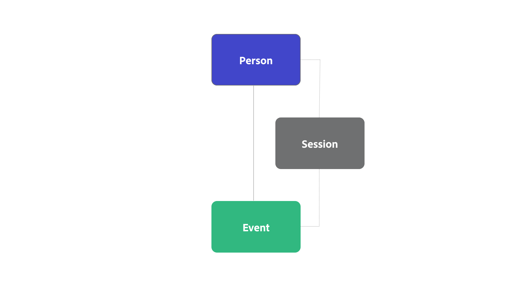

# B2B edition koncept och funktioner

I den här artikeln beskrivs begrepp som anslutningar, identifierare, behållare och datauppsättningar, som ofta används i Customer Journey Analytics. Och hur Customer Journey Analytics B2B edition lägger till ytterligare funktioner i dessa koncept.

## Anslutningar och identifierare

I Customer Journey Analytics väljer du en vanlig identifierare, som kallas person-ID, för att ansluta dina händelsedata till andra datauppsättningar som profildatauppsättningar och uppslagsdatauppsättningar. Denna typ av anslutning kallas en personbaserad anslutning som underlättar personbaserad rapportering och analys.

I Customer Journey Analytics B2B edition kan du välja mellan en personbaserad anslutning eller en kontobaserad anslutning. En kontobaserad anslutning underlättar kontobaserad rapportering och analys.

* För en personbaserad anslutning väljer du Person som primär identifierare. Du kan sedan konfigurera och konfigurera dina projekt för anslutning, datavy och arbetsyta för personbaserad rapportering.
* För en kontobaserad anslutning väljer du Konto som primär identifierare. Du kan sedan välja att lägga till ytterligare behållare för Global Account, Buying Group och Opportunity. Baserat på om du lägger till ett globalt konto eller inte är din primära identifierare en kontoidentifierare eller en global kontoidentifierare.

## Behållare

I Customer Journey Analytics genereras behållare som en del av konfigurationen av en anslutning och datavy och tillhandahåller datastruktur och omfattning. Behållare lagrar grupper av identifierare för att sekvensera alla händelsetidsstämplar med unika identifierare. Lagringsutrymmet underlättar snabb och effektiv körning av funktioner som segmentering, attribuering och visualiseringar.

### Standardbehållare

Customer Journey Analytics bygger på konceptet med tre behållare: Person, Session och Event. Under en konfiguration genereras dessa behållare implicit.

Du kan definiera om hur de här behållarna ska namnges när du konfigurerar en datavy, men hierarkin och relationerna mellan behållarna är förbestämda. Sessionsbehållaren genereras baserat på hur du definierar en session i [sessionsinställningarna](/help/data-views/session-settings.md) i datavyn.

{zoomable="yes"}

### B2B-behållare

I Customer Journey Analytics B2B edition läggs en kontobehållare till i listan över genererade behållare. Och du kan konfigurera genereringen av ytterligare behållare, som t.ex. Global Account, Buying Group och Opportunity.

Hierarkin och relationerna mellan behållarna är förbestämda. Affärsmöjlighet, inköpsgrupp och person är alla jämställda behållare för kontobehållaren. I den hierarkin genereras sessionsbehållaren mellan personbehållaren och händelsebehållaren baserat på hur du definierar en session i [sessionsinställningarna](/help/data-views/session-settings.md) i datavyn. Ytterligare sessionsbehållare, till exempel mellan behållaren Konto och Händelsebehållaren, genereras och stöds för närvarande inte. I tabellen nedan finns en beskrivning och grundläggande användning av B2B-behållarna.

{zoomable="yes"}

| B2B-behållare | Beskrivning Grundläggande användningsfall |
|---|---|
| Konto | Ett företag som är kund eller potentiell kund till ditt företag. Företaget kan vara ett dotterbolag eller en division i en större organisation. Kontot representerar den organisation som du säljer till och vill spåra på den organisationsnivån. |
| Global konto (valfritt) | Det översta moderföretaget i en grupp av närstående företag. Ett globalt konto har inget moderföretag, men kan ha dotterföretag eller divisioner som tillhör det globala kontot. När du har konfigurerat behållaren för det globala kontot i din anslutning, ska ett konto som inte har något överordnat eller dotterbolag listas både i kontofältet och i det globala kontofältet. |
| Möjligheter (valfritt) | En samling produkter och tjänster som säljs tillsammans. En affärsmöjlighet omfattade ofta olika faser i säljcykeln fram till försäljningsavslut. Du använder data för att mäta säljprojektets förlopp genom säljprocessen. Till exempel en rapport som innehåller information om de viktigaste möjligheterna som flyttades från fas 3 till fas 4. |
| Köpgrupp (valfritt) | En samling personer inom en organisation som deltar i beslutsprocessen för att köpa en produkt eller tjänst.  Du använder inköpsgruppdata för att spåra inköpsgrupper via kampanjhantering. Du kan t.ex. skapa ett målgruppssegment av nyckelinköpsgrupper.  Du vill troligen ha en sökning från inköpsgruppen till profildata, så att du kan rapportera om personerna i en inköpsgrupp. |
| Person | En person som ofta identifieras av en unik e-postadress som har interagerat med företaget.  Du använder profildata för att identifiera personer som arbetar för ett konto. Till exempel: rikta alla personer på ett konto som har registrerat sig för en konferens. |

>[!IMPORTANT]
>
>* Om du har **aktiverat** som global kontobehållare i en kontobaserad anslutning, ska alla poster i dina händelsedatamängder innehålla ett konto-ID och ett globalt konto-ID. Annars hoppas posten över.
>* Om du **inte har aktiverat** som global kontobehållare i en kontobaserad anslutning, ska alla poster i dina händelsedatamängder innehålla ett konto-ID. Annars hoppas posten över.

Du kan använda B2B-behållare för specifika B2B-funktioner i Analysis Workspace:

* **Segmentering**: [B2B-segmentbehållare](/help/components/segments/seg-overview.md#b2b-containers) gör att du kan skapa segment med ett behållaromfång bortom person, session eller händelse. Exempel: ett konto med ett händelseregistreringssegment, eller ett amerikanskt konto med inköpsgrupper och affärssegment på stadium 5.

  >[!NOTE]
  >
  >Data för B2B-händelser i en kontobaserad konfiguration i Customer Journey Analytics B2B edition kan innehålla datarader utan person eller session. Till exempel: en rad som innehåller information om förloppet för affärsmöjlighetsfasen. När du utvärderar ditt segment bör du tänka på att personer och sessioner kanske inte längre är rätt kriterier.
  >

* **Attribution**: Du kan använda de nya B2B-behållarna i [attribueringspanelen](/help/analysis-workspace/c-panels/attribution.md), i [attribueringskomponentsinställningarna](/help/data-views/component-settings/attribution.md), i [beräknade värden](/help/components/calc-metrics/cm-workflow/m-metric-type-alloc.md) eller i [kolumner i en frihandstabell](/help/analysis-workspace/visualizations/freeform-table/column-row-settings/column-settings.md). Kontosökningar förlängs till 13 månader.

* **Visualiseringar**: [Fall out](/help/analysis-workspace/visualizations/fallout/fallout-flow.md), [Flow](/help/analysis-workspace/visualizations/c-flow/flow.md), [Journey Canvas](/help/analysis-workspace/visualizations/journey-canvas/journey-canvas.md) och [Cohort table](/help/analysis-workspace/visualizations/cohort-table/cohort-analysis.md) har stöd för de nya B2B-behållarna. Du kan till exempel använda de nya behållarna för att förstå hur köpgrupper konsumerar innehåll eller hur affärsmöjlighetskohorter rör sig mot slutet av en försäljning.
Du kan också ange standardbehållaren för dessa visualiseringar i [användarinställningarna](/help/analysis-workspace/user-preferences.md#visualizations-preferences).

Segment, attribuering och visualiseringar tillsammans med B2B-behållare ger stöd för djupgående B2B-analyser och insikter.

## Datauppsättningar

Customer Journey Analytics B2B skiljer mellan följande datatyper och datamängder.

| Datatyp | Tidsserie | Behållarposter | Fältposter |
|---|---|---|---|
| **Datauppsättningar** | **Händelsedatamängder**  Till exempel:<ul><li>Digital analys</li><li>CRM-händelser</li><li>Personliga händelser</li><li>Data för kundtjänst</li></ul> | **Profildatauppsättningar**  Exempel:<ul><li>CRM-poster</li><li>AJO B2B</li><li>CDP-poster</li><ul> | **Klasser**  Exempel:<ul><li>Kampanjposter</li><li>Marknadsföringslistposter</li><li>Metadata för innehåll</li><li>Produktposter</li></ul> |
| Krav | **Tidsstämpel**  Alla poster behöver:<ul><li>Konto-ID</li><li>ID för globalt konto (valfritt)</li></ul> | **Konto-ID**  Poster behöver ett behållar-ID, som:<ul><li>Konto</li><li>Person</li><li>Möjligheter</li><li>Buying Group</li></ul> | **Matchande nyckel**  Poster behöver ett ID i en behållare eller i en händelsedatamängd, som:<ul><li>Kampanj-ID</li><li>Innehålls-ID</li><li>Produkt-ID</li></ul> |

{style="table-layout:fixed"}

Ett exempel på en kontobaserad anslutning i Customer Journey Analytics B2B edition:

Customer Journey Analytics B2B edition har gränssnittet [Anslutningskarta](/help/connections/create-connection.md#connection-map) som ger dig en översikt över relationerna mellan datauppsättningar i anslutningen.

På samma sätt som Customer Journey Analytics är händelsebaserade tidsseriedata kärnan i Customer Journey Analytics B2B edition. Den största skillnaden för en kontobaserad anslutning är att du behöver ett konto-ID för alla poster i händelsedatamängden i stället för ett person-ID.

När du konfigurerar [datauppsättningsinställningar](/help/connections/create-connection.md#dataset-settings) för din kontobaserade anslutning i Customer Journey Analytics B2B edition beror alternativen som är tillgängliga för vissa av inställningarna på [datamängdstypen](/help/connections/create-connection.md#dataset-types). Du måste till exempel:

* Ange identifierare för var och en av behållarna som du har konfigurerat för dina händelsedatamängder.
* Definiera ett kontofält eller globalt kontofält för dina profildatauppsättningar.
* Definiera nycklar och matcha dessa nycklar (efter fältbehållare) för uppslagsdatauppsättningar.

## Matcha efter behållare eller fält

Du kan definiera för varje uppslagsdatauppsättning, oavsett om du matchar datauppsättningen per fält eller per behållare.

### Matcha efter behållare

Om en postdatamängd använder en matchning per behållare behandlas postdatamängden som en profildatamängdstyp och som en profildatamängd i användargränssnittet. Använd matchning efter behållare för datauppsättningar som innehåller behållarposter och som stöder dina konfigurerade behållare. Exempel: en Buying Group-datauppsättning.

### Matcha efter fält

Om en postdatauppsättning använder en matchning per fält behandlas postdatauppsättningen som en uppslagsdatatyp och som en uppslagsdatauppsättning i användargränssnittet. Använd matchning efter fält på datauppsättningar som innehåller ytterligare klassificeringsinformation via sökning. Till exempel en medlemsuppsättning för marknadsföringslista eller en produktinformationsuppsättning.

## Rapport om person- och kontouppgifter

Om du vill rapportera om personbaserade behållare (och personidentiteter) och kontobaserade behållare (och kontoidentiteter) bör du skapa två separata anslutningar i Customer Journey Analytics. En anslutning där du väljer Person som primärt ID och en anslutning där du väljer Konto som primärt ID. Customer Journey Analytics stöder inte personbaserad och kontobaserad rapportering från en enda behållarhierarki.

