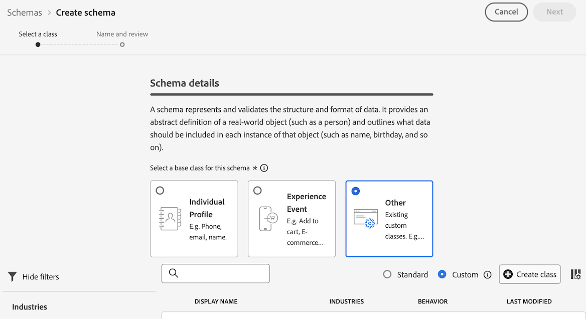

# Skapa uppslagsdatauppsättningar för att klassificera data i Customer Journey Analytics {#upgrade-lookup-dataset}

<!-- markdownlint-disable MD034 -->

>[!CONTEXTUALHELP]
>id="cja-upgrade-lookup-dataset-create"
>title="Skapa en uppslagsdatauppsättning för varje dimension som innehåller klassificeringsdata"
>abstract="På samma sätt som med klassificeringsdata i Adobe Analytics är uppslagsuppsättningar en metod för att klassificera data i Customer Journey Analytics."

<!-- markdownlint-enable MD034 -->

{{upgrade-note-step}}

På samma sätt som med klassificeringsdata i Adobe Analytics är uppslagsuppsättningar en metod för att klassificera data i Customer Journey Analytics.

När du använder Analytics-källkopplingen tillämpas vissa standardsökdatauppsättningar automatiskt vid rapporttillfället. Mer information finns i [Lägga till standardsökningar i dina datauppsättningar](/help/connections/standard-lookups.md).

För att kunna klassificera data i Customer Journey Analytics när du använder Experience Platform Web SDK måste du skapa ett anpassat schema och en uppslagsdatauppsättning för varje dimension som innehåller data som du vill klassificera.

## Skapa ett anpassat schema som ska användas med uppslagsdatauppsättningen

Skapa ett nytt anpassat schema för varje dimension som innehåller data som ska klassificeras i Customer Journey Analytics. När du skapar uppslagsdatauppsättningen i ett senare steg kommer den att referera till det här schemat.

Upprepa den här processen för varje dimension som innehåller data som du vill klassificera.

Så här skapar du ett schema som ska användas med en uppslagsdatauppsättning i Customer Journey Analytics:

1. I Adobe Experience Platform väljer du **[!UICONTROL Schemas]** i avsnittet **[!UICONTROL Data Management]** i den vänstra listen.

1. Välj **[!UICONTROL Create schema]**.

   

1. Välj **[!UICONTROL Manual]**. Detta gör att du kan lägga till fält och fältgrupper manuellt i schemat. Välj **[!UICONTROL Select]** om du vill fortsätta till nästa sida i guiden.

1. På sidan **[!UICONTROL Schema details]** väljer du **[!UICONTROL Other]** och sedan **[!UICONTROL Custom]**.

   

1. Välj **[!UICONTROL Create class]**.

   <!-- add screenshot -->

1. I dialogrutan **[!UICONTROL Create class]** anger du ett namn och en beskrivning för schemat, väljer **[!UICONTROL Record]** och sedan **[!UICONTROL Create]**.

1. Fortsätt med [Skapa en uppslagsdatauppsättning](#create-a-lookup-dataset).

## Skapa en uppslagsdatauppsättning

När du har [skapat ett anpassat schema](#create-a-custom-schema-to-use-with-the-lookup-dataset) som ska användas för en uppslagsdatauppsättning måste du skapa uppslagsdatauppsättningen och mappa den till ditt schema.

Upprepa den här processen för varje dimension som innehåller data som du vill klassificera.

Så här skapar du en uppslagsdatauppsättning som ska användas med ett schema i Customer Journey Analytics:

>[!NOTE]
>
>I följande process används en CSV-fil för att skapa datauppsättningen. Du kan också använda någon annan metod som är tillgänglig för import av data till Experience Platform, till exempel för att konfigurera ett datastream.

1. I Adobe Experience Platform väljer du **[!UICONTROL Workflows]** i den vänstra listen.

   

1. Välj **[!UICONTROL Map CSV to XDM schema]** och sedan **[!UICONTROL Launch]**.

1. Välj **[!UICONTROL New dataset]** i avsnittet **[!UICONTROL Dataset details]**.

1. Ange ett namn och en beskrivning för datauppsättningen.

1. I fältet **[!UICONTROL Schema]** väljer du det schema som du skapade för uppslagsdatauppsättningar, vilket beskrivs i [Skapa ett schema för uppslagsdatauppsättningar](#create-a-schema-for-lookup-datasets).

1. Välj **[!UICONTROL Next]**.

1. I **[!UICONTROL Map CSV to XDM schema page]**, i avsnittet **[!UICONTROL Upload files]**, väljer du **[!UICONTROL Choose files]** och bläddrar sedan i filsystemet efter filen som innehåller klassificeringsinformationen för dimensionen som du vill använda klassificeringsdata för. Detta kan till exempel vara ett kalkylblad som innehåller fält-ID:n och motsvarande fältnamn. <!-- correct? How can I better explain what this file is?-->

   

1. Välj **[!UICONTROL Next]**

1. Granska mappningarna efter att filen har överförts för att säkerställa att de är korrekta. Kolumnerna i CSV-filen listas under **[!UICONTROL Source Data]** och deras motsvarande XDM-schemafält listas under **[!UICONTROL Target Field]**.

   Plattformen ger automatiskt intelligenta rekommendationer för automatiskt mappade fält baserat på det målschema eller den datamängd du valt. Du kan justera mappningsreglerna manuellt så att de passar dina användningsfall.

   Mer information om mappningsprocessen finns i [Mappa en CSV-fil till ett befintligt XDM-schema](https://experienceleague.adobe.com/en/docs/experience-platform/ingestion/tutorials/map-csv/existing-schema) i Experience Platform-dokumentationen.

1. Välj **[!UICONTROL Finish]**.

1. Fortsätt med [Lägg till sökdatauppsättningen i anslutningen i Customer Journey Analytics](#add-the-lookup-dataset-to-your-connection-in-customer-journey-analytics).

## Lägg till uppslagsdatauppsättningen i din anslutning i Customer Journey Analytics

När du har [skapat ett anpassat schema](#create-a-custom-schema-to-use-with-the-lookup-dataset) och [skapat en uppslagsdatauppsättning](#create-a-lookup-dataset) måste du lägga till uppslagsdatauppsättningen i anslutningen i Customer Journey Analytics.

Upprepa den här processen för varje dimension som innehåller data som du vill klassificera.

Så här lägger du till uppslagsdatauppsättningen i anslutningen i Customer Journey Analytics:

1. I Customer Journey Analytics väljer du fliken **[!UICONTROL Connections]**.

1. Välj  bredvid anslutningen där du vill lägga till uppslagsdatauppsättningen och välj sedan **[!UICONTROL Edit]**.

   <!-- add screenshot -->

1. Välj **[!UICONTROL Add datasets]**.

1. I dialogrutan **[!UICONTROL Add datasets]** markerar du den uppslagsuppsättning som du skapade och väljer sedan **[!UICONTROL Next]**.

1. I fältet **[!UICONTROL Person ID]** väljer du ett person-ID bland de tillgängliga identiteter som definieras i datamängdsschemat som du konfigurerade i Experience Platform. <!-- fill out other fields? -->

1. Välj **[!UICONTROL Add datasets]** och sedan **[!UICONTROL Save]**.

   <!-- is there a step right in between here where you select the dataset -->

1. Använd fältet **[!UICONTROL Key]** och fältet **[!UICONTROL Matching key]** för att skapa en korrelation mellan fältet i din uppslagsdatauppsättning och det i din händelse- eller sammanfattningsdatauppsättning.

1. Upprepa den här processen tills alla uppslagsdatauppsättningar har lagts till i anslutningen i Customer Journey Analytics.

{{upgrade-final-step}}

