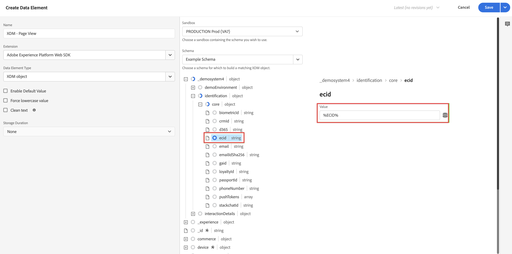

# Lägg till logik för XDM-datainsamling i taggen {#upgrade-tag-xdm}

<!-- markdownlint-disable MD034 -->

>[!CONTEXTUALHELP]
>id="cja-upgrade-tag-xdm"
>title="Lägg till logik för XDM-datainsamling i taggen"
>abstract="Med inläsartaggen installerad på din webbplats kan du lägga till regler och dataelement för att fylla i ett XDM-objekt som ska skickas till Adobe. Adobe rekommenderar att du underhåller ett designdokument för en lösning som håller reda på hur taggarna är konfigurerade.  Det här steget innehåller mycket arbete eftersom det handlar om att konfigurera all Analytics-logik för din egenskap. Förvänta dig att en månad eller längre ska dedikera rätt taggregler, testa dem och distribuera dem på din webbplats."

<!-- markdownlint-enable MD034 -->

{{upgrade-note-step}}

När du har [skapat taggen och lagt till Web SDK-tillägget](/help/getting-started/cja-upgrade/cja-upgrade-tag-property.md) måste du konfigurera den med dataelement och regler, beroende på hur du vill spåra din webbplats och skicka data till Adobe Experience Platform. När du har konfigurerat dataelement och regler för taggen kan du skapa och publicera den.

## Konfigurera dataelement

Dataelement är byggstenarna för dataordlistan (eller datamappningen). Använd dataelement för att samla in, ordna och leverera data över marknadsförings- och annonseringsteknologier. Du ställer in dataelement i taggen som läser från datalagret och kan användas för att leverera data till Adobe Experience Platform. (Mer information om dataelement finns i [Dataelement](https://experienceleague.adobe.com/en/docs/experience-platform/tags/ui/data-elements) i taggdokumentationen.)

I följande avsnitt beskrivs föreslagna dataelement och andra vanliga dataelement som du kan konfigurera.

Det finns olika typer av dataelement. Två vanliga dataelement som du kanske vill konfigurera är: ett som hämtar sidnamnet som personer visar på din webbplats och ett som hämtar Experience Cloud-ID för varje person som besöker din webbplats.

När du har konfigurerat dessa två dataelement kan du konfigurera ytterligare dataelement för de specifika data som du vill hämta.

När du har definierat alla önskade dataelement måste du tilldela dataelementen till [schemat som du skapade](/help/getting-started/cja-upgrade/cja-upgrade-schema-create.md) tidigare. För att göra detta definierar du ett XDM-dataelement, som tillhandahåller en representation av ditt XDM-schema.

<!-- Assigning data elements to an XDM object. All of the available XDM objects are based on the schema -->

### Skapa föreslagna dataelement

I följande avsnitt beskrivs hur du skapar gemensamma dataelement som gäller för de flesta organisationer.

#### Dataelement för sidnamn

Ett vanligt dataelement som gäller för de flesta organisationer är ett dataelement som hämtar det sidnamn som personen visar.

Så här skapar du ett dataelement för sidnamn:

1. Logga in på experience.adobe.com med dina Adobe ID-uppgifter.

1. Gå till **[!UICONTROL Data Collection]** > **[!UICONTROL Tags]** i Adobe Experience Platform.

1. På sidan **[!UICONTROL Tag Properties]** väljer du den nyligen skapade taggen i listan över egenskaper för att öppna den.

1. Välj **[!UICONTROL Data Elements]** i den vänstra listen.

1. Välj **[!UICONTROL Add Data Element]**.

1. Ange följande information i dialogrutan **[!UICONTROL Create Data Element]**:

   * **[!UICONTROL Name]**: Namnet på dataelementet. Till exempel `Page Name`.

   * **[!UICONTROL Extension]**: Välj **[!UICONTROL Core]** i listan.

   * **[!UICONTROL Data Element Type]**: Välj **[!UICONTROL Page Info]** i listan.

   * **[!UICONTROL Attribute]**: Välj **[!UICONTROL Title]** i listan.

     

     Du kan också ha använt värdet från en variabel i datalagret, till exempel `pageName` och dataelementtypen [!UICONTROL JavaScript Variable] för att definiera dataelementet.

     

1. Välj **[!UICONTROL Save]**.

   Nu vill du skapa ett dataelement som refererar till det Experience Cloud-id som automatiskt tillhandahålls av Adobe Experience Platform Web SDK och som är tillgängligt via Experience Cloud ID-tjänsttillägget.

1. Fortsätt med [ECID-dataelementet](#ecid-data-element).

#### ECID-dataelement

Ett vanligt dataelement som gäller de flesta organisationer är ett dataelement som samlar in Experience Cloud-id:t för varje person som besöker er webbplats.

Så här skapar du ett ECID-dataelement:

1. Logga in på experience.adobe.com med dina Adobe ID-uppgifter.

1. Gå till **[!UICONTROL Data Collection]** > **[!UICONTROL Tags]** i Adobe Experience Platform.

1. Markera den nyligen skapade taggen i listan med [!UICONTROL Tag Properties] för att öppna den.

1. (Villkorligt) Installera Experience Cloud ID-tjänsttillägget om det inte redan är installerat:

   1. Välj **[!UICONTROL Extensions]** i den vänstra listen.

   1. Fliken **[!UICONTROL Installed]** är markerad som standard. Om rutan **[!UICONTROL Experience Cloud ID Service]** visas går du till steg 5.

   1. Om rutan **[!UICONTROL Experience Cloud ID Service]** inte visas väljer du fliken **[!UICONTROL Catalog]**.

   1. Sök efter **[!UICONTROL Experience Cloud ID Service]** i sökfältet och markera sedan rutan när den visas

   1. Välj **[!UICONTROL Install]** > **[!UICONTROL Save]**.

1. Välj **[!UICONTROL Data Elements]** i den vänstra listen.

1. Välj **[!UICONTROL Add Data Element]**.

1. Ange följande information i dialogrutan **[!UICONTROL Create Data Element]**:

   * **[!UICONTROL Name]**: Namnet på dataelementet. Till exempel `ECID`.

   * **[!UICONTROL Extension]**: Välj **[!UICONTROL Experience Cloud ID Service]** i listan.

   * **[!UICONTROL Data Element Type]**: Välj **[!UICONTROL ECID]** i listan.

     

1. Välj **[!UICONTROL Save]**.

1. Fortsätt med [Skapa ytterligare dataelement](#create-additional-data-elements).

### Skapa ytterligare dataelement

Skapa ett dataelement för varje typ av data som du vill samla in. Använd samma process som beskrivs i [Dataelementet för sidnamn](#page-name-data-element) och [ECID-dataelementet](#ecid-data-element) för att skapa ytterligare dataelement.

De dataelement som du skapar bör ha ett motsvarande fält i schemat.

Vanliga dataelement varierar beroende på bransch- och verksamhetskrav. Här följer några vanliga dataelement, ordnade efter bransch:

**Butiksdataelement**

* Produkter

* Kundtillägg

* Utcheckningar

**Finansiella dataelement**

* Transaktions-ID

* Transaktionsdatum

* Tjänsttyp

**Dataelement för hälso- och sjukvård**

* Leverantörs-ID

* Besöksdatum

* Typ av behandling

När du har skapat alla dataelement som krävs av organisationen för implementeringen fortsätter du med [XDM-objektdataelementet](#xdm-object-data-element).

### XDM-objektdataelement

Slutligen vill du nu mappa alla dataelement som du har skapat till [schemat som du skapade](/help/getting-started/cja-upgrade/cja-upgrade-schema-create.md) tidigare. Det gör du genom att definiera ett XDM-objektdataelement som ger en representation av ditt XDM-schema.

Så här definierar du ett XDM-objektdataelement:

1. Logga in på experience.adobe.com med dina Adobe ID-uppgifter.

1. Gå till **[!UICONTROL Data Collection]** > **[!UICONTROL Tags]** i Adobe Experience Platform.

1. Markera den nyligen skapade taggen i listan med [!UICONTROL Tag Properties] för att öppna den.

1. Välj **[!UICONTROL Data Elements]** i den vänstra listen.

1. Välj **[!UICONTROL Add Data Element]**.

1. Ange följande information i dialogrutan **[!UICONTROL Create Data Element]**:

   * **[!UICONTROL Name]**: Namnet på dataelementet. Till exempel `XDM - Page View`.

   * **[!UICONTROL Extension]**: Välj **[!UICONTROL Adobe Experience Platform Web SDK]** i listan.

   * **[!UICONTROL Data Element Type]**: Välj **[!UICONTROL XDM Object]** i listan.

   * **[!UICONTROL Sandbox]**: Välj din sandlåda i listan.

   * **[!UICONTROL Schema]**: Välj ditt schema i listan.

1. Mappa attributet `identification > core > ecid`, som definierats i ditt schema, till ECID-dataelementet. Välj cylinderikonen för att enkelt välja ECID-dataelementet från listan med dataelement.

   

   

1. Mappa attributet `web > webPageDetails > name`, som definierats i ditt schema, till dataelementet för sidnamn.

   

1. Välj **[!UICONTROL Save]**.

1. Fortsätt med [Konfigurera regler](#configure-rules).

## **Konfigurera regler**

Taggar i Adobe Experience Platform följer ett regelbaserat system. De letar efter användarinteraktion och tillhörande data. När villkoren som beskrivs i reglerna är uppfyllda utlöser regeln det tillägg, skript eller den klientkod som du identifierade. Du kan använda regler för att skicka data (som ett XDM-objekt) till Adobe Experience Platform med tillägget Adobe Experience Platform Web SDK.

Så här definierar du en regel:

>[!NOTE]
>
>Följande steg är ett exempel på hur du definierar en regel som skickar XDM-data, som innehåller värden från andra dataelement, till Adobe Experience Platform.
>
>Du kan använda regler på olika sätt i taggen för att hantera variabler (med dataelementen).
>
>Mer information finns i [Regler](https://experienceleague.adobe.com/docs/experience-platform/tags/ui/rules.html).

1. Logga in på experience.adobe.com med dina Adobe ID-uppgifter.

1. Gå till **[!UICONTROL Data Collection]** > **[!UICONTROL Tags]** i Adobe Experience Platform.

1. Markera den nyligen skapade taggen i listan med [!UICONTROL Tag Properties] för att öppna den.

1. Välj **[!UICONTROL Rules]** i den vänstra listen.

1. Välj **[!UICONTROL Add Rule]**.

1. Ange följande information i dialogrutan **[!UICONTROL Create Rule]**:

   * **[!UICONTROL Name]**: Namnet på regeln. Till exempel `Page View`.

   * **[!UICONTROL Events]**: Välj **[!UICONTROL + Add]**. Ange sedan följande information i dialogrutan **[!UICONTROL Event Configuration]**. När du är klar väljer du **[!UICONTROL Keep Changes]**.

      * **[!UICONTROL Extension]**: Välj **[!UICONTROL Core]** i listan.

      * **[!UICONTROL Event Type]**: Välj **[!UICONTROL Window Loaded]** i listan.

        

   * **[!UICONTROL Actions]**: Välj **[!UICONTROL + Add]**. Ange sedan följande information i dialogrutan [!UICONTROL Action Configuration]. När du är klar väljer du **[!UICONTROL Keep Changes]**.

      * **[!UICONTROL Extension]**: Välj **[!UICONTROL Adobe Experience Platform Web SDK]** i listan.

      * **[!UICONTROL Action Type]**: Välj **[!UICONTROL Send event]** i listan.

      * **[!UICONTROL Type]**: Välj **[!UICONTROL Web Webpagedetails Page Views]** i listan.

      * **[!UICONTROL XDM data]**: Välj cylinderikonen och välj sedan **[!UICONTROL XDM - Page View]** i listan med dataelement.

        

        Regeln ska se ut så här:

        

1. Välj **[!UICONTROL Save]**.

1. Upprepa den här processen för varje regel som du vill lägga till på webbplatsen.

   Mer information om regler finns i [Regler](https://experienceleague.adobe.com/en/docs/experience-platform/tags/ui/rules) i taggdokumentationen.

1. Fortsätt med [Skapa och publicera taggen](#build-and-publish-your-tag).

## Bygg och publicera taggen

När du har definierat dataelement och regler måste du skapa och publicera taggen. När du skapar en biblioteksversion måste du tilldela den till en miljö. Byggnadens tillägg, regler och dataelement kompileras sedan och placeras i den tilldelade miljön. Varje miljö har en unik inbäddningskod som gör att du kan integrera den tilldelade inbäddningen på din plats.

Adobe Experience Platform Tags hanterar enkla till komplexa publiceringsflöden som passar din användning av Adobe Experience Platform Web SDK. Mer information finns i [Översikt över publicering](https://experienceleague.adobe.com/docs/experience-platform/tags/publish/overview.html).

Så här skapar och publicerar du en tagg:

1. Logga in på experience.adobe.com med dina Adobe ID-uppgifter.

1. Gå till **[!UICONTROL Data Collection]** > **[!UICONTROL Tags]** i Adobe Experience Platform.

1. Markera den nyligen skapade taggen i listan med [!UICONTROL Tag Properties] för att öppna den.

1. Välj **[!UICONTROL Publishing Flow]** i den vänstra listen.

1. Välj **[!UICONTROL Add Library]**.

1. Ange följande information i dialogrutan **[!UICONTROL Create Library]**:

   * **[!UICONTROL Name]**: Bibliotekets namn.

   * **[!UICONTROL Environment]**: Välj **[!UICONTROL Development (development)]** i listan.

1. Välj **[!UICONTROL + Add All Changed Resources]**.

   

1. Välj **[!UICONTROL Save & Build to Development]**.

   Taggen sparas och är utformad för din utvecklingsmiljö. En grön punkt visar att taggen har skapats på utvecklingsmiljön.

1. Du kan välja **[!UICONTROL ...]** om du vill återskapa biblioteket eller flytta biblioteket till en staging- eller produktionsmiljö.

   
