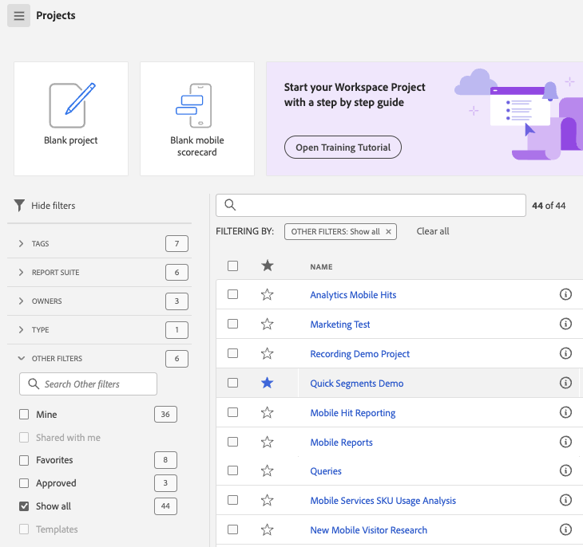

# Customer Journey Analytics landningssida

Landningssidan för högdagrar i Customer Journey Analytics [!DNL Analysis Workspace] och innehåller en startsida för projektledare och en utbildningssektion som hjälper er att hantera kundresedata mer effektivt.

>[!VIDEO](https://video.tv.adobe.com/v/334278/?quality=12)

## Nya funktioner på landningssidan {#new-features}

| Funktion | Beskrivning | Skärmbild |
| --- | --- | --- |
| Expandera [!UICONTROL Projects] tabell till helskärm | Om du vill expandera tabellen klickar du bara på menyikonen för hamburgaren. Den här åtgärden komprimerar flikarna till vänster. |  |
| Anpassa kolumnbredd | Tidigare var kolumnbredden fast. Nu kan du justera den genom att dra kolumnavgränsaren. |  |
| Ändra ordning på fästa objekt | Om du vill flytta fasta objekt uppåt och nedåt klickar du på ellipsen bredvid det fästa objektet och väljer **[!UICONTROL Move up]** eller **[!UICONTROL Move down]**. |  |
| Nya tabellkolumner | Klicka på [!UICONTROL Customize table] ikonen längst upp till höger i tabellen. Nya tabellkolumner innehåller: <ul><li>**[!UICONTROL Scheduled]**: Ange till [!UICONTROL On] när ett projekt är schemalagt eller [!UICONTROL Off] när det inte är det. Klicka på [!UICONTROL On] -länken kan du visa information om det schemalagda projektet. Du kan också [redigera projektschemat](/help/analysis-workspace/export/t-schedule-report.md) om du är projektägare.</li><li>**[!UICONTROL Project ID]**: Projekt-ID kan användas för felsökningsprojekt.</li><li>**[!UICONTROL Longest Date Range]**: Längre datumintervall ökar projektets komplexitet och kan öka bearbetnings- och inläsningstiderna. </li><li>**[!UICONTROL Number of Queries]**: Det totala antalet begäranden som görs till Analytics när projektet läses in. Ett högre antal projektfrågor ökar projektets komplexitet och kan öka bearbetnings- och inläsningstiden. Dessa data är bara tillgängliga när ett projekt har lästs in eller när ett schemalagt projekt har skickats. </li></ul> |  |
| **[!UICONTROL Create Project]** modal är tillbaka | När du klickar **[!UICONTROL Create Project]** i arbetsytan får du ännu en gång möjlighet att välja mellan [!UICONTROL Blank project] och [!UICONTROL Blank mobile scorecard]. Du kan också välja bland de mallar som företaget har skapat. |  |

{style="table-layout:auto"}

## Navigera i [!UICONTROL Projects] tab {#navigate-projects}

[!UICONTROL Projects] fungerar som [!UICONTROL Workspace] hemsida. Fliken Projekt visar företagsmappen, eventuella personliga mappar som du har skapat, dina projekt och Mobile Scorecards. Använd den här sidan om du vill visa, skapa och ändra mappar, projekt och mobila styrkort. Mer information finns i [Om mappar i Analytics](/help/analysis-workspace/build-workspace-project/workspace-folders/about-folders.md).

**[!UICONTROL Projects]** är anpassade designer som kombinerar datakomponenter, tabeller och visualiseringar som du har skapat eller som någon annan har skapat och delat med dig. [!UICONTROL Projects] hänvisar också till tomma projekt och tomma mobilstyrkort.

>[!NOTE]
>
>Flera av följande inställningar finns kvar under sessionen och mellan sessionerna. Till exempel den flik du har markerat, de markerade filtren, de markerade kolumnerna och kolumnsorteringsriktningen. Sökresultaten är inte beständiga.

| UI-element | Definition |
| --- | --- |
| Redigera inställningar | Låter dig [!UICONTROL View Tutorials]och [Redigera användarinställningar](/help/analysis-workspace/user-preferences.md). |
| [!UICONTROL Create new] | Öppnar det modala projektet där du kan skapa ett Workspace-projekt eller ett Mobile-styrkort eller öppna en företagsmall. |
| [!UICONTROL Show less  Visa mer] | Växlar mellan att inte visa och visa banderollen:  |
| [!UICONTROL Workspace project] | Skapar en tom [Arbetsyteprojekt](https://experienceleague.adobe.com/docs/analytics/analyze/analysis-workspace/home.html) så att du kan designa och bygga. |
| [!UICONTROL Mobile scorecard] | Skapar en tom [mobilstyrkort](https://experienceleague.adobe.com/docs/analytics/analyze/mobapp/curator.html) så att du kan designa och bygga. |
| [!UICONTROL Open Training Tutorial] | Öppnar självstudiekursen om arbetsytan där du får hjälp med att skapa ett nytt startprojekt i en stegvis självstudiekurs. |
| [!UICONTROL Open release notes] | Öppnar Adobe Analytics-delen av den senaste versionsinformationen för Adobe Experience Cloud. |
| Filterikon | Filter efter taggar, datavyer, ägare, typer och andra filter (Min, Delad med mig, Favoriter och Godkänd) |
| Sökfältet | Söker igenom alla kolumner i tabellen. |
| Markeringsruta | Väljer ett eller flera projekt för att visa de projekthanteringsåtgärder du kan utföra: **Ta bort**, **Dela**, **Byt namn**, **Kopiera**, **Ta bort**, **Flytta uppåt**, **Flytta nedåt**, **Tagg**, **Godkänn**, **Exportera CSV** och **Flytta till**. Du kanske inte har behörighet att utföra alla listade åtgärder. |
| [!UICONTROL Favorites] | Lägger till en stjärna bredvid ett favoritprojekt eller en mapp som kan användas som filter. |
| [!UICONTROL Name] | Identifierar namnet på projektet. |
| Fäst ikon | Fäster objekt så att de alltid visas högst upp i listan, men du kan ändra ordningen genom att flytta dem uppåt eller nedåt i den ordning som de visas. Använd ellipsalternativmenyn och välj **Flytta uppåt** eller **Flytta nedåt** i listan. |
| Info (i), ikon | Visar följande information om ett projekt: Typ, Projektroll, Ägare, Beskrivning och vem det delas med. Det anger också vem som kan [redigera eller duplicera](https://experienceleague.adobe.com/docs/analytics/analyze/analysis-workspace/curate-share/share-projects.html) det här projektet. |
| Ellips (...) | Visar de projekthanteringsåtgärder du kan utföra: **Ta bort**, **Dela**, **Byt namn**, **Kopiera**, **Ta bort**, **Flytta uppåt**, **Flytta nedåt**, **Tagg**, **Godkänn**, **Exportera CSV** och **Flytta till**. Du kanske inte har behörighet att utföra alla listade åtgärder. |
| [!UICONTROL Type] | Anger om den här typen är ett Workspace-projekt, ett Mobile-styrkort eller en mapp. |
| [!UICONTROL Tags] | Taggar projekt för att ordna dem i grupper. |
| [!UICONTROL Project Role] | Identifierar projektrollerna: om du är projektägare och om du har behörighet att redigera eller duplicera projektet. |
| [!UICONTROL Data View] | Identifierar datavyer som är associerade med projektet. Tabeller och visualiseringar i en panel hämtar data från den datavy som är vald i panelens övre högra hörn. Datavyn avgör också vilka komponenter som är tillgängliga i den vänstra listen. Inom ett projekt kan du använda en eller flera datavyer beroende på dina analysexempel. Listan med datavyer sorteras efter relevans. Adobe definierar relevansen baserat på hur nyligen och ofta sviten har använts av den aktuella användaren och hur ofta sviten används i organisationen. |
| [!UICONTROL Owner] | Identifierar den person som skapade projektet. |
| [!UICONTROL Last opened] | Identifierar det datum du senast öppnade projektet. |
| Anpassa tabellikon | Väljer vilka kolumner som ska visas i tabellen. Om du vill lägga till eller ta bort kolumner från listan med projekt klickar du på kolumnikonen ( ) i det övre högra hörnet och markera eller avmarkera sedan kolumnrubriker. |
| VISA: Mappar och projekt eller alla projekt | Ändrar visningsinställningen för tabellen så att mappar och projekt visas enligt mappordningen **eller** visa alla dina projekt i en oordnad lista. |
| &lt; (Bakåt-knappen) | Returnerar dig till den senaste konfigurationen av landningssidan i ett Workspace-projekt. Sidkonfigurationen som du hade när du lämnade landningssidan kommer att finnas kvar när du kommer tillbaka. |

### Borttagning av Project Manager-sidan {#deprecate-pm-page}

I och med lanseringen av den nya landningssidan har vi ersatt Project Manager som listats under Components Manager. Den nya landningssidan hanterar alla funktioner på den gamla Project Manager-sidan med mera.

Ett vanligt användningsexempel för Project Manager-sidan var att visa alla dina projekt. Om du vill visa alla dina projekt på den nya landningssidan med filterspåret väljer du **ANDRA FILTER** och sedan **Visa alla**.

Om du arbetar i vyn &quot;Mappar och projekt&quot; visas ett modalt popup-fönster där du får frågan om du vill växla till vyn &quot;Alla projekt&quot;, vilket gör det enklare att visa alla dina projekt utanför de mappar där de är organiserade.   Välj **Växla till vyn Alla projekt** för att bättre visa alla projekt du har tillgång till.

## Använda fliken Utbildning {#navigate-learning}

Utbildningssidan innehåller praktiska videoutgångar, självstudiekurser och länkar till dokumentation.

Lär dig mer med utbildningssidan i Customer Journey Analytics:

* Nybörjare, mellanliggande eller avancerade funktioner och användningsområden i CJA
* Gå smidigare från Adobe Analytics till CJA

### Gå till sidan Utbildning

1. I Customer Journey Analytics väljer du [!UICONTROL **Arbetsyta**] > [!UICONTROL **Utbildning**].

### Funktioner för utbildningssidor

* **Filterinnehåll:** Med ikonen Filter i den vänstra listen kan du filtrera utbildningsinnehåll efter erfarenhetsnivå (Nybörjare, Mellan eller Avancerat) och efter innehållstyp (Dokument, Video eller Tours och självstudiekurser).
* **Spåra förlopp:** När du har markerat en del av innehållet **[!UICONTROL Viewed]** -taggen visas. Den här taggen hjälper dig att spåra dina framsteg med utbildningsinnehållet. Du kan välja **[!UICONTROL Viewed]** för att ta bort den från ett visst innehåll.
* **Visa ytterligare innehåll:** När du visar en video väljer du **[!UICONTROL Learn more]** för att visa relaterat dokumentationsinnehåll på Experience League. Du kan också välja något av följande alternativ på sidan Lär dig mer om du vill visa ytterligare innehåll:
   * **[!UICONTROL Visit YouTube]:** Se hela spellistan för Analysis Workspace YouTube.
   * [!UICONTROL **Besök Experience League**]: Se hela sviten med CJA-dokumentation på Experience League.
* **Grundläggande för nya användare:** The [!UICONTROL Workspace Fundamentals] vi rekommenderar för nya användare. Den här demon tar dig direkt till Workspace och leder dig igenom de vanligaste åtgärderna. Den här demon kan också öppnas igen när som helst i Workspace via verktygstipset i panelhuvudet.

## Ange landningssida {#set-landing}

Användare kan ange sin favoritlandningssida.

1. Gå till Analytics > [!UICONTROL Components] > [!UICONTROL Preferences] > [!UICONTROL General].
1. Kontrollera vilken landningssida du vill använda:

   

## Vanliga frågor om landningssidan {#landing-faq}

| Fråga | Svar |
| --- | --- |
| Överför mitt arbete i betaprogrammets användargränssnitt till produktionen [!UICONTROL Workspace] upplevelse? | Ja, allt arbete som görs i betan överförs till den gamla/aktuella [!UICONTROL Workspace] upplevelse. |
| Finns det ett maximalt antal projekt jag kan fästa? | Nej, det finns ingen gräns för hur många projekt du kan fästa. |
| Kan administratörer ange den här landningssidan för sina användare? | Nej, administratörer kan inte ange landningssidan för användarnas räkning. Enskilda användare måste aktivera växeln själva. |
<!-- | Are all reports that currently exist in [!DNL Reports & Analytics] still available? | No, the following reports were phased out, based on overall usage data: <ul><li>Any custom eVars/props/events/classifications<li>My Recommended Reports</li><li>Hourly/Daily/Weekly/Monthly/Quarterly/Yearly unique visitors</li><li>DailyWeekly/Monthly/Quarterly/Yearly unique customers</li><li>Action name depth</li><li>Action name summary</li><li>Add dashboard</li><li>Age</li><li>Audio support</li><li>Billing information</li><li>Clicks to page</li><li>Color depth</li><li>Cookie support</li><li>Cookies</li><li>Connection types</li><li>Creative elements</li><li>Credit card type</li><li>Cross sell</li><li>Custom event funnels</li><li>Custom links</li><li>Customer ID</li><li>Day of week</li><li>Entry action name</li><li>Exit action name</li><li>Exit links</li><li>Fallout</li><li>File downloads</li><li>Find in store</li><li>Full paths</li><li>Gender</li><li>Hit ype VISTA rule</li><li>Image support</li><li>Java</li><li>JavaScript</li><li>JavaScript version</li><li>Manage bookmarks</li><li>Manage dashboards</li><li>Monitor color depth</li><li>Monitor resolutions</li><li>Newsletter signups</li><li>Next action name</li><li>Next action name flow</li><li>Null searches</li><li>Operating system</li><li>Order review</li><li>Page of day</li><li>Pages not found</li><li>Pathfinder</li><li>Path length</li><li>Previous action name</li><li>Previous action name flow</li><li>Product activity</li><li>Product cost</li><li>Product department</li><li>Product inventory category</li><li>Product name</li><li>Product reviews</li><li>Product season</li><li>Product shares</li><li>Product zooms</li><li>Reload</li><li>Searches</li><li>Servers</li><li>Single page visits</li><li>Shipping information</li><li>Site hierarchy</li><li>Social mentions</li><li>Time of day</li><li>Time spent on action name</li><li>Video support</li><li>Visitor state</li></ul> | -->
