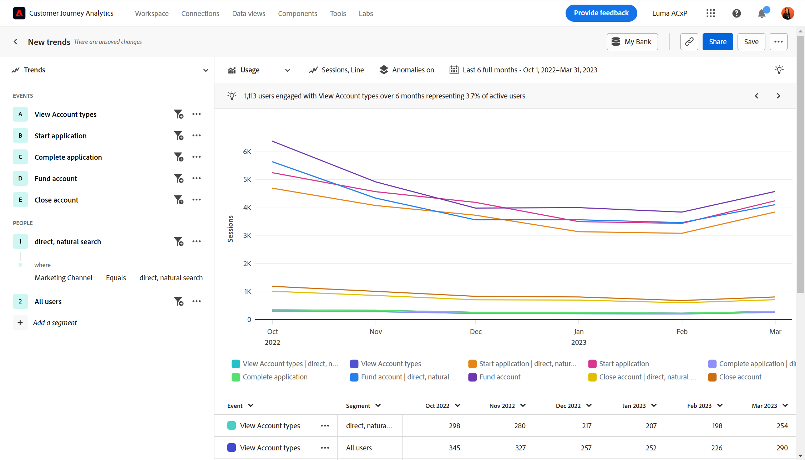

# Användningsexempel

Den här sidan innehåller illustrativa exempel på vad produktteam i olika branscher kan åstadkomma med hjälp av guidad analys.

+++**Detaljhandel**

| Använd skiftläge | Exempel | Effekt | Analys |
| --- | --- | --- | --- |
| **Optimera mobilshoppingsappen** | Många kunder laddade ned en organisations mobilapp men kom aldrig tillbaka. Företaget anser att kunderna använder det bara för det första erbjudandet. De engagerade de vilande kunderna. | **Öka LTV för mobilanvändare.** Mät och öka appanvändningen för att utveckla en mer användarupplevelse med en glad sökväg. | [Vyn Aktiv användartillväxt](types/active.md) [Vyn Nettotillväxt](types/net-growth.md) |
| **Kvantifiera påverkan av nya utcheckningsfunktioner** | En mataffär testar sin väg in i webbutiken. De mäter snabbt effekten av nya utcheckningsfunktioner som produktrekommendationer eller urbside pickup. | **Öka konverteringsgraden.** Mät effekten av verksamheten i stället för att bara använda funktioner. | [Vyn Versionseffekt](types/release.md) [Vyn Första användningen](types/first-use.md) |
| **Minska antalet medlemmar** | En organisation upptäcker friktionspunkter i kundresorna som får kunderna att tappa sina kunder. De kan granska medlemsprogram och analysera riskmedlemmarnas beteenden. | **Minska bortfall.** Identifiera sätt att främja och vårda klientrelationer för att förhindra attribuering och minska bortfall. | [Vyn Aktiv användartillväxt](types/active.md) [Vyn Funktion](types/friction.md) |
| **Hitta ineffektiva försäljningsresor** | En organisation upptäcker ineffektivitet i kundresan för säljare i butiken där de dras ifrån kunderna. De anpassar sin process, vilket ger kunderna en roligare shoppingupplevelse i butiken. | **Förbättra säljsvaren.** Minska ineffektiva processer, vilket ger bättre interna resor och en positiv kundupplevelse. | [Bildvy](types/friction.md) |

{style="table-layout:auto"}

{style="border:1px solid gray"}

{style="border:1px solid gray"}

+++

+++**Finansiella tjänster**

| Använd skiftläge | Exempel | Effekt | Analys |
| --- | --- | --- | --- |
| **Kvantifiera påverkan av nya funktioner** | Ett finansinstitut gör banköverföringar med Zelle och vill förstå hur den nya funktionen påverkar slutförandet av överföringar. Med hjälp av guidad analys kan de se hur kunderna reagerar så att marknadsföringsteamet kan lansera det. | **Öka konverteringsgraden.** Mät effekten av nya funktioner på överföringskonverteringar. | [Vyn Versionseffekt](types/release.md) [Vyn Första användningen](types/first-use.md) |
| **Avaktivera samtal till callcenter** | Guidad analys visar att en organisations fem-stegsprocess för mobilanspråk driver samtal till deras callcenter. De skapar en målgrupp och skickar ett e-postmeddelande till dessa kunder för att bättre förstå deras upplevelse. | **Isolera friktionen i upplevelsen.** Förbättra&quot;lyckliga kundresor&quot; och minska samtalen. | [Vyn Funktion](types/friction.md) [Vyn Konverteringstrender](types/conversion-trends.md) |
| **Minska kundbortfallet** | En organisation lär sig att kunder som loggar in på bankappen med månadsintervall blir kunder längre. Med hjälp av guidad analys kan de identifiera vem som löper risk att försvinna och skapa en strategi för att vinna tillbaka. | **Minska bortfall.** Behåll kundnivån när du spenderar för att förvärva nya kunder. | [Vyn Aktiv användartillväxt](types/active.md) [Vyn Nettotillväxt](types/net-growth.md) |
| **Rekommendera nya funktioner** | En organisation uppger att de digitala återtagen har minskat under de senaste månaderna. Antalet samtal till en finansiell rådgivare har ökat. Med hjälp av guidad analys kan organisationen prioritera optimering av digitala processer med en styrkommitté. | **Skapa en datadriven färdplan.** Använd data för att planera och implementera optimeringar. | [Vyn Användningstrender](types/usage.md) |

{style="table-layout:auto"}

{style="border:1px solid gray"}

{style="border:1px solid gray"}

{style="border:1px solid gray"}

+++

+++**Resor och turism**

| Använd skiftläge | Exempel | Effekt | Analys |
| --- | --- | --- | --- |
| **Kvantifiera påverkan av nya bokningsflödesfunktioner** | En organisation använder guidad analys för att snabbt se effekten av en ny bokningsstegsfunktion på konverteringsgraden. De identifierar den del av upplevelsen som har de största vinsterna. | **Öka bokningsfrekvensen.** Mät effekten av verksamheten i stället för att bara använda funktioner. | [Vyn Frigör påverkan](types/release.md) [Vyn Friktion](types/friction.md) |
| **Optimera upplevelsen av mobilappar** | En organisation kan snabbt och enkelt förstå månadsanvändare av aktiva appar över tid och identifierar positiva effekter per version. | **Öka MAU:er.** Mät och öka appanvändningen, vilket står i relation till kundernas lycka. | [Vyn Aktiv användartillväxt](types/active.md) [Vyn Nettotillväxt](types/net-growth.md) |
| **Hitta friktion i incheckningsflöde för mobiler** | Genom att se var människor lyckas eller faller bort från den förväntade incheckningsprocessen för mobila enheter kan en organisation enkelt identifiera områden för upplevelseoptimering. | **Öka CSAT och minska antalet IROP.** Om du tar bort friktionen blir upplevelsen mer sömlös. | [Vyn Funktion](types/friction.md) [Vyn Konverteringstrender](types/conversion-trends.md) |
| **Avaktivera samtal till callcenter** | När du ser en användarupplevelse i en trattvy ser du en användare där besökarna råkar ut för friktionen, vilket leder till kostsam telefonvolym. Nästa steg du ska fokusera på är tydliga. | **Minska användningen av callcenter.** Få mer användarupplevelser med en &quot;glad sökväg&quot; och minska antalet kostsamma samtal. | [Vyn Funktion](types/friction.md) [Vyn Konverteringstrender](types/conversion-trends.md) |

{style="table-layout:auto"}

{style="border:1px solid gray"}

{style="border:1px solid gray"}

{style="border:1px solid gray"}

+++

+++**Media och underhållning**

| Använd skiftläge | Exempel | Effekt | Analys |
| --- | --- | --- | --- |
| **Kvantifiera påverkan av nya program eller serier** | En direktuppspelningstjänst kan analysera effekten på tittandet efter att användarna har tittat på ett nytt program eller en ny serie och bättre förstå vad innehållet ger. | **Öka visningsmängden.** Hitta innehåll som har störst påverkan på tittandet. | [Vyn Första användningen](types/first-use.md) |
| **Identifiera kurvrisk** | En organisation ser en hög omsättningsfrekvens för kunder som vill delta i en plattform för att se en säsongshändelse och avbryta omedelbart efter att evenemanget är slut. Genom att snabbt identifiera dessa användare kan de visa rekommendationer som uppmuntrar kunderna att hålla sig engagerade med plattformen. | **Behåll lyckliga prenumeranter.** Sök efter innehåll som engagerar ett tillväxtsegment att ingripa med rekommendationer. | [Vyn Aktiv användartillväxt](types/active.md) [Vyn Nettotillväxt](types/net-growth.md) |
| **Hitta möjligheter till merförsäljning** | En viktig del av en organisations ökade intäkter är att förstå vad erbjudanden i appen är som mest lockande för fansen medan de befinner sig på stadion. Med hjälp av guidad analys kan de se exakt vilka erbjudanden som är mest effektiva. | **Öka extraintäkterna.** Förstå effekten av erbjudanden i appen för att få fler köpbeteenden att fungera. | [Vyn Första användningen](types/first-use.md) [Bildvyn](types/friction.md) |
| **Optimera upplevelsen mellan olika enheter** | En organisation vill analysera hur prenumeranter interagerar med flera enheter/appar. Tack vare den här kunskapen kan de förstå mönster för innehållskonsumtion och avgöra var det bästa är att rikta om till dem. | **Anpassa upplevelsen.** Förstå vilket innehåll som fungerar bäst för prenumeranter på varje enhet. | [Vyn Användningstrender](types/usage.md) |
| **Avaktivera samtal till callcenter** | En organisation använder guidad analys för att identifiera ett problem där automatisk kopiering inte fungerar, vilket medförde att frustrerade kunder ringde sitt supportcenter för att avbryta sin plan. | **Minska antalet supportsamtal.** Skapa en bättre kundupplevelse och minska samtalen till kundtjänst. | [Vyn Funktion](types/friction.md) [Vyn Konverteringstrender](types/conversion-trends.md) |

{style="table-layout:auto"}

{style="border:1px solid gray"}

{style="border:1px solid gray"}

{style="border:1px solid gray"}

+++

+++**Hälsovård**

| Använd skiftläge | Exempel | Effekt | Analys |
| --- | --- | --- | --- |
| **Förbättra patienternas hälsa** | En organisation har data som kan fokusera på tillväxt. Innan de använde sig av en guidad analys hade de ingen tydlig förståelse för hur många medlemmar i en hälsovårdsplan per vecka som helt enkelt slutade använda den. | **Minska antalet läkarbesök.** identifierade snabbt vilande användare för återengagemang. | [Vyer för aktiv användartillväxt](types/active.md) |
| **Förbättra patientupplevelsen** | Synligheten i hur många patienter som kontaktade samtalscentra för en enkel lösenordsåterställning förnyade en analytikers passion till laserfokus för att stärka deras patientupplevelse. | **Minska den totala kostnaden.** Skapa en bättre patientupplevelse och minska antalet samtal till patienttjänster. | [Vyn Användningstrender](types/usage.md) [Vyn Funktionsmakron](types/friction.md) |
| **Identifiera upprepade flerkanalsåtgärder per segment** | En organisation vill förstå hur aktiva medlemmar i Medicare är med sin plananvändning för att kunna ge dem specifika budskap i sina digitala produkter. Insikter från guidad analys hjälper er att effektivisera marknadsföringen. | **Anpassa registreringsalternativ för Medicare.** Jämför vanliga sekventiella åtgärder med mina mest aktiva planmedlemmar. | [Vyn Funktion](types/friction.md) [Vyn Aktiv användartillväxt](types/active.md) |
| **Behåll branschens topptalanger** | Analysresurser för en organisation stoppas för tid. Med hjälp av guidad analys kan organisationen snabbt få de produktanvändningsdata som behövs för att ringa ledande samtal om uppdatering. | **Minska analytikernas arbetsbelastning.** Få svar snabbare. Lättillgänglig rapportering för när det är viktigast. | [Guidad analys](overview.md) |

{style="table-layout:auto"}

{style="border:1px solid gray"}

+++

+++**Högteknologi och B2B**

| Använd skiftläge | Exempel | Effekt | Analys |
| --- | --- | --- | --- |
| **Kvantifiera påverkan av nya funktioner** | En organisation kan analysera användningen av en ny produktfunktion och avgöra vilka segment som fungerar bäst. Denna analys hjälper dem att prioritera var de ska spendera resurser för att maximera användarengagemanget och stärka sitt partnerskap med marknadsföring. | **Datadriven prioritering.** Fatta välgrundade beslut om att allokera resurser. | [Vyn Versionseffekt](types/release.md) [Vyn Första användningen](types/first-use.md) |
| **Identifiera roller som inte använder produkten** | En organisation utformar en produkt som ska användas av ingenjörer, produktchefer och marknadsföring. Den guidade analysen visade att medan produktchefer och marknadsförare använder den nästan dagligen så var det i stort sett ingen teknisk personal som använde den. | **Utöka produktanvändningen.** Identifiera snabbt användarbeteenden på olika sätt. | [Vyn Aktiv användartillväxt](types/active.md) [Vyn Nettotillväxt](types/net-growth.md) |
| **Ta bort friktionspunkter i konverteringsprocessen** | Om du kräver ett inköpsordernummer i inköpsflödet hindras användare som föredrar kreditkort från att slutföra sina beställningar. Konverteringarna ökade när fältet blev valfritt. | **Förbättra kundupplevelsen.** Minska potentiella bortfall. | [Vyn Funktion](types/friction.md) [Vyn Konverteringstrender](types/conversion-trends.md) |
| **Lås upp självbetjäningsanalys** | Det är en utmaning att få tillgång till insikter, och vissa användare i en organisation har inte tränats för analys. Med hjälp av guidad analys kan de få svar och utnyttja samma data som resten av organisationen använder, vilket leder till starkare partnerskap och möjliggör sanna datadrivna beslut. | **närmare partnerskap i hela organisationen.** Ge produktansvariga åtkomst till data som tidigare har placerats på samma plats. | [Guidad analys](overview.md) |

{style="table-layout:auto"}

{style="border:1px solid gray"}

+++
