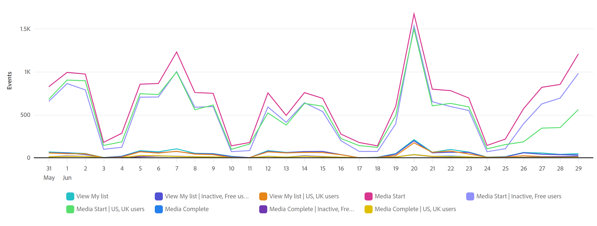

# Översikt över guidad analys

Med hjälp av guidad analys kan användare, från marknadsföring till produkter och analytiker, själva leverera högkvalitativa data och insikter om kundresan via guidade arbetsflöden som bygger på Customer Journey Analytics flerkanalsdata. I den guidade analysen, som liknar Analysis Workspace- och Mobile-styrkort, används data från en [datavy](/help/data-views/data-views.md) som refererar till data i Adobe Experience Platform via en [anslutning](../connections/overview.md). Många rapporter som skapas i den guidade analysen kan smidigt överföras till Analysis Workspace för ytterligare forskning.

Följande guidade analyser är tillgängliga:

| Ikon | Analys | Beskrivning |
| :----:|--- | --- |
|  | [Aktiv tillväxt](types/active-growth.md) | Identifiera vem som är ny, bevarad, återvändande eller vilande. |
|  | [Konverteringstrender](types/conversion-trends.md) | Spåra förändringar i konverteringsgrader över tid. |
|  | [Engagemang](types/engagement.md) | Förstå bredden och djupet av engagemanget. |
|  | [Inverkan vid första användningen](types/first-use-impact.md) | Mät effekten av förstagångsanvändning på nyckelindikatorer. |
|  | [Frekvens](types/frequency.md) | Mät engagemang efter användningsfrekvens. |
|  | [Tratt](types/funnel.md) | Jämför konverteringsgrader mellan steg. |
|  | [Nettotillväxt](types/net-growth.md) | Kommer du att få eller förlora användare? |
|  | [Versionseffekt](types/release-impact.md) | Jämför prestanda i lika stora perioder före och efter lanseringen. |
|  | [Kvarhållning](types/retention.md) | Mät användarnas återkommande returvanor. |
|  | [Tidslinje](types/timeline.md) | Utforska mönster i sessionsaktivitet. |
|  | [Trends](types/trends.md) | Mät användarengagemanget över tid. |

## Åtkomst

Du kan få tillgång till den guidade analysen från Customer Journey Analytics hemsida.

1. Välj **[!UICONTROL Guided analysis]** från hemsidan, som tar dig direkt till [Trends analysis](types/trends.md).

   {style="border:1px solid gray"}

1. Välj **[!UICONTROL Create new]** om du vill visa de olika visningsalternativen och välja en annan startpunkt för analysen.

   {style="border:1px solid gray"}

Du kan även komma åt guidad analys inifrån ett Analysis Workspace-projekt.

1. Välj **[!UICONTROL Blank project]** på startsidan om du vill skapa ett tomt Workspace-projekt.

   {style="border:1px solid gray"}

1. Välj  **[!UICONTROL Guided Analysis]** i den vänstra listen.

   {style="border:1px solid gray"}

1. Dra en ny analys till Workspace Canvas och välj sedan **[!UICONTROL Create]** för att generera önskad analys (till exempel: **[!UICONTROL Create Trends]**). Du kan också dra en befintlig analys till Workspace Canvas från avsnittet **[!UICONTROL Saved]**.

   

## Gränssnitt

Gränssnittet för guidad analys följer ett fråge- och svarsformat. Formulera frågan i frågefältet och få sedan ett svar med en skriftlig insikt, diagram och tabell. Du kan sedan ställa nästa fråga med analyser och visualiseringsinställningar.

I den guidade analysen används följande gränssnittselement:

| Förhandsgranska gränssnitt | Gränssnittselement | Beskrivning |
| --- | --- | --- |
| {style="border:1px solid gray"} | **[!UICONTROL Query rail]** | Konfigurera *frågan* genom att välja de komponenter (händelser, egenskaper och segment) som ska ingå i en analys. Följande alternativ är tillgängliga för alla analyser, med ytterligare inställningar tillgängliga per vy. <ul><li>**Visa**: Välj bland alternativen för att växla till en ny analys. Dina frågeval ligger inom de tillåtna gränserna för den nya analysen.</li><li>**Händelser**: De händelser som du vill mäta. Varje analys tillämpar olika gränser för antalet händelser som du kan konfigurera.  Händelser kallas ibland **[!UICONTROL Start and return events]**, **[!UICONTROL Steps]** eller **[!UICONTROL Key indicators]**. Händelser identifieras i analysen med 1, 2, ... Välj  **[!UICONTROL Add an event]** för att lägga till nya händelser.</li><li>**[!UICONTROL Factors]**: Om det är tillgängligt kan du ange faktorer som datum sedan och första gången.</li><li>**Räknas som**: Den räkningsmetod som du vill använda för de markerade händelserna. Välj i listrutan.</li><li>**Segment**: Segmenten som du vill mäta. Varje analys tillämpar olika gränser för antalet segment som du kan konfigurera. Segment identifieras i analysen med A, B, ... Välj  **[!UICONTROL Add a segment]** för att lägga till nya segment.</li><li>**[!UICONTROL Breakdown]**: Om det är tillgängligt, den uppdelning som du vill använda för analysen.</li></ul>På vissa av inställningarna finns ytterligare konfiguration tillgänglig.<ul><li>**Filter**: Använd  om du vill begränsa händelser eller segment efter specifika dimensioner. När en dimension har valts är båda standardfiltervillkoren (till exempel **[!UICONTROL Equals]**, **[!UICONTROL Contains]** eller **[!UICONTROL Ends with]**) och de 1 000 översta dimensionsvärdena tillgängliga. Välj  om du vill lägga till fler filter. Välj  om du vill ta bort ett filter.</li><li>**Fler åtgärder**: Använd  för att välja åtgärder, som<ul><li> **[!UICONTROL Rename]**: om du vill byta namn på en händelse eller ett segment.</li><li> **[!UICONTROL Duplicate]**: om du vill duplicera en händelse eller ett segment.</li><li> **[!UICONTROL Remove]**: om du vill ta bort en händelse, ett segment eller en nedbrytning.</li><li> **[!UICONTROL Edit segment]**: om du vill redigera ett segment i [segmentverktyget](/help/components/segments/seg-builder.md).</li><li> **[!UICONTROL Add to favorites]**: om du vill lägga till segmentet i listan över favoritsegment i [Segmenthanteraren](/help/components/segments/seg-manage.md).</li><li> **[!UICONTROL Save as]**: om du vill spara segmentet som en ny komponent. I dialogrutan **[!UICONTROL Save segments to components]** kan du ange ett segmentnamn och en beskrivning. Du kan markera  för att markera det nya segmentet som en favorit. Välj **[!UICONTROL Save]** om du vill spara segmentet som ett nytt segment.</li><li> **[!UICONTROL Link start and return events]**.: om du vill länka start- och returhändelser i en [Retention](types/retention.md) -analys.</li><li> **[!UICONTROL Unlink start and return events]**: om du vill bryta länken mellan start- och returhändelser i en [kvarhållningsanalys](types/retention.md).</li></ul></li></ul> |
| {style="border:1px solid gray"} | **[!UICONTROL Chart]** | En visualisering av de data som returneras baserat på dina indata från frågespelaren och inställningarna. Vilken visualisering du ser beror på vyn och inställningarna ovanför diagrammet. Diagrammet innehåller även: <ul><li>**Verktygstips**: Håll pekaren över en diagramdatapunkt för att visa ett verktygstips med mer information.</li><li>**Förklaring**: Håll pekaren över teckenförklaringsserien för att visa definitioner där de är tillgängliga, fokusera på serien och dölja tillfälligt andra serier. Markera en serie i teckenförklaringen om du vill dölja serien.</li><li>**Anteckningar**: Tillämpliga [anteckningar](../components/annotations/overview.md) visas mellan visualiseringen och teckenförklaringen. Den visas som en  i anteckningens konfigurerade färg. Analyser som visar data över tid placerar ikonen  under det konfigurerade datumet eller datumintervallet. Analyser som inte visar data över tid visar ikonen  i diagrammets nedre högra hörn.</li><li>**Välj åtgärder**: Visa nästa tillgängliga åtgärd genom att markera en datapunkt. Du kan välja mellan **Spara segment**.</li></ul> |
| {style="border:1px solid gray"} | **[!UICONTROL Table]** | En tabellrepresentation av de data som returneras baserat på dina indata från frågespelaren och inställningarna. Rader i tabellen som använder händelseidentifierare (1, 2, ...) och segmentidentifierare (A, B, ...) som referens. Kolumnerna i tabellen beror på analysen ovanför diagrammet. Tabellen innehåller även följande för varje rad: <ul><li>**Välj åtgärder**: Växla  om du vill dölja eller visa en diagramserie för en rad. Välj  om du vill ha fler åtgärder. Du kan välja mellan **Spara segment**.</li></ul> |
| {style="border:1px solid gray"} | **[!UICONTROL Visualization settings]** | Alternativ ovanför diagrammet som gör att du kan ställa nästa fråga och anpassa hur diagrammet och tabellen returnerar data. Följande alternativ är tillgängliga för alla analyser, med ytterligare inställningar tillgängliga per analys. <ul><li> **Diagraminställningar**: Finjustera hur diagrammet och tabellen visas. Vilka alternativ som är tillgängliga beror på vald analys.</li><li> **Övertäckningsinställningar**: Lägg till en övertäckning. Vilka alternativ som är tillgängliga beror på vald analys.</li><li> **[!UICONTROL Bucket settings]**: Automatisk bucket eller använd anpassade bucket-inställningar på data. Vilka alternativ som är tillgängliga beror på vald analys.<li> **[!UICONTROL Compare settings]**: Jämför data med ett visst datumintervall. Vilka alternativ som är tillgängliga beror på vald analys.</li><li> **[!UICONTROL Display settings]**: Välj hur data ska visas. Vilka alternativ som är tillgängliga beror på vald analys.<li> **Datumintervall**: En kalenderväljare som du kan använda för att bestämma datumintervallet för analysen. Du kan också välja ett intervall för trendanalyser, t.ex. varje dag, varje vecka eller varje månad.</li><li> **Insights**: Sammanhangsberoende insikter beroende på vilken analys du visar. Dessa insikter ger observationer för den aktuella analysen. Om det finns flera tillgängliga insikter kan du visa dem med pilarna till höger. Du kan växla synlighet för den här rutan genom att använda glödlampsikonen i det övre högra hörnet.</li></ul> |
| {style="border:1px solid gray"} | **[!UICONTROL Menu]** Tillgängligt i ett projekt för guidad analys | Kommandon i det övre högra hörnet av ett guidat analysprojekt som ger övergripande åtgärder för din analys.<ul><li> ***Datavyns namn***: Ändra datavyn som analysen använder. När du ändrar datavyn ändras även de tillgängliga komponenterna i frågerinjen.</li><li> **Kopiera länk**: Kopierar en länk till analysen till Urklipp. Du uppmanas att spara innan du delar.</li><li>**Dela**: Öppnar den modala delningen, med ytterligare alternativ för delning till enskilda användare eller grupper. Du kan dela en analys med andra användare eller skapa en länk som du kan dela med vem som helst.</li><li>**Spara**: Sparar analysen. Om du sparar en ny analys visas dialogrutan **[!UICONTROL Save analysis]** som begär ett namn och en beskrivning. När du har sparat en **[!UICONTROL Analysis saved]**-dialogruta kan du dela din analys.</li><li> **[!UICONTROL Add to Workspace]**: Visar tillgängliga Workspace-projekt som du kan lägga till den här analysen i. Om du väljer ett Workspace-projekt öppnas det Workspace-projektet på en ny flik, och analysen läggs till längst ned i projektet.</li></ul>Välj  om du vill ha fler åtgärder, som:<ul><li>**[!UICONTROL Save as]**: Sparar analysen separat från den aktuella analysen och skapar en kopia. En dialogruta med en begäran om ett nytt namn och en beskrivning visas.</li><li>**[!UICONTROL Export to Workspace]**: Återskapar den aktuella guidade analysfrågan i Analysis Workspace. Workspace-projektet skapas på en ny flik, vilket förhindrar avbrott när du arbetar i den guidade analysen. Det är en kopia av analysen och är inte synkroniserat med den ursprungliga analysen när den väl har öppnats. Använd det här kommandot när du vill skicka vidare till analytikerteamet, eller fördjupa dig i data än vad analysen tillåter.</li><li>**[!UICONTROL Copy chart to clipboard]**: Kopierar diagramgrafiken till Urklipp, och klistras in i andra program. Frågefältet och tabellen tas inte med i bilden.</li><li>**[!UICONTROL Download PNG]**: Hämtar diagramgrafiken som en `.png`. Frågefältet och tabellen tas inte med i bilden.</li><li>**[!UICONTROL Download CSV]**: Hämtar tabelldata som en `.csv`. Frågefältet och -diagrammet inkluderas inte i filen.</li></ul> |
| {style="border:1px solid gray"} | **Meny**  Tillgänglig i en visualisering av guidad analys på arbetsytan för analys. | Kommandon i en visualisering av guidad analys på arbetsytan för analys.<ul><li> **[!UICONTROL Chart]**: om du bara vill visa analysdiagrammet.</li><li> **[!UICONTROL Table]**: om du bara vill visa analystabellen.</li><li> **[!UICONTROL All]**: om du vill visa diagram och tabell för analysen.</li><li> **[!UICONTROL Edit]**: om du vill redigera konfigurationen för analysen</li><li> **[!UICONTROL *Datumintervall *]**: för att konfigurera datumintervallet för analysen.</li></ul> |

## Provisionering

Guidade analyser ingår i Customer Journey Analytics-paket på följande sätt:

| Paket | Tillgängliga analyser |
| --- | --- |
| [!UICONTROL Customer Journey Analytics add-ons] | Aktiv tillväxt, konverteringstrender, frekvens, tratt, nettotillväxt, lagring, trender |
| [!UICONTROL Customer Journey Analytics Foundation] | Trender |
| [!UICONTROL Customer Journey Analytics Select] | Foundation views + Active growth, Conversion trends, Frequency, Funnel, Net growth, Retention |
| [!UICONTROL Customer Journey Analytics Prime] | Välja vyer + engagemang, Första användningen, Versionseffekt, Tidslinje |
| [!UICONTROL Customer Journey Analytics Ultimate] | Prime-vyer |

{style="table-layout:auto"}

Administratörer av produktprofiler kan lägga till eller ta bort åtkomst till guidad analys i Adobe Admin Console.

1. Logga in på [Adobe Admin Console](https://adminconsole.adobe.com).
1. Välj **[!UICONTROL Customer Journey Analytics]** i listan över produkter.
1. Välj önskad produktprofil för de behörigheter som du vill redigera.
1. Välj fliken **[!UICONTROL Permissions]** och klicka sedan på **[!UICONTROL Edit]** under [!UICONTROL Reporting Tools].
1. Välj  bredvid **[!UICONTROL Guided Analysis Access]** i listan med [!UICONTROL Available Permission Items], som lägger till den i listan med [!UICONTROL Included Permission Items].
1. Välj **[!UICONTROL Save]**.

Mer information finns i [Åtkomst på användarnivå](/help/technotes/access-control.md#user-level-access).

>[!TIP]
>
>Vissa administratörer föredrar att aktivera guidad analys och inaktivera Analysis Workspace för nya användare för Customer Journey Analytics. När dessa användare har kommit överens med produkten och era organisationsdata kan ni aktivera åtkomst till Analysis Workspace.
