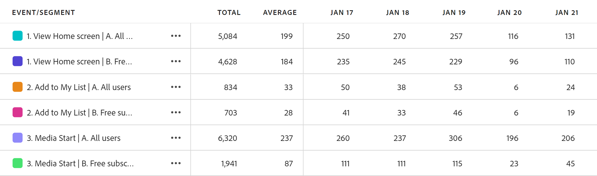

# Översikt över guidad analys

{{release-limited-testing}}

Guidad analys är ett rapportformat som gör att produktteamen snabbt kan ta hand om sina databehov så att de kan fatta mer databaserade produktbeslut. Funktionsövergripande team kan kommunicera i realtid för att använda och förstå dessa rapporter.

I en rapport om guidad analys, som liknar Analysis Workspace- och Mobile-styrkort, används data från en [Datavy](../data-views/data-views.md), som refererar till data i Adobe Experience Platform via en [Anslutning](../connections/overview.md). Alla rapporter som skapas i den guidade analysen kan smidigt överföras till Analysis Workspace för ytterligare forskning.

Med hjälp av guidad analys kan du analysera data på flera olika sätt. Dessa vytyper kan visa samma data på olika sätt, vilket leder till olika insikter med samma händelser och segment. Du får olika frågerader och visualiseringsalternativ beroende på vilken vytyp du väljer. Du kan fritt växla mellan visningstyper, och eventuella tillämpliga frågespårskomponenter överförs om vytypen stöder dem.

Med guidad analys kategoriseras vytyperna i **Analystyper**. Följande analys- och vytyper är tillgängliga:

| Analystyp | Vytyp | Beskrivning |
| --- | --- | --- |
| Effekt | [Frigör](types/release.md) | Jämför prestanda i lika stora perioder före och efter lanseringen. |
| Effekt | [Första användningen](types/first-use.md) | Mät effekten av förstagångsanvändning på nyckelindikatorer. |
| Tratt | [Funktion](types/friction.md) | Jämför konverteringsgrader mellan steg. |
| Tratt | [Konverteringstrender](types/conversion-trends.md) | Spåra förändringar i konverteringsgrader över tid. |
| Användartillväxt | [Aktiv](types/active.md) | Mät tillväxten hos era användare. |
| Användartillväxt | [Nettotillväxt](types/net-growth.md) | Balansera användarvinster och -förluster. |
| Trender | [Användning](types/usage.md) | Mät användarengagemanget över tid. |

{style="table-layout:auto"}

## Gränssnitt

Gränssnittet för guidad analys, oavsett analystyp, innehåller följande huvudgränssnittselement:

1. **Frågerår**: Använd den här listen till vänster för att bygga upp din analys.
1. **Diagram**: När du har valt händelser, personer eller steg visas ett diagram till höger som visar data.
1. **Tabell**: En tabell under diagrammet som visar de siffror som används i visualiseringen.
1. **Inställningar och insikter**: Flera gränssnittselement ovanför diagrammet som gör att du kan anpassa de data som returneras.

[Skärmbild av användargränssnitt]

Guidad analys innehåller följande gränssnittsdelar:

| Förhandsgranska gränssnitt | Gränssnittselement | Beskrivning |
| --- | --- | --- |
|  | Frågerår | Konfigurera önskade komponenter som utgör en rapport. Olika analystyper delar flera frågealternativ. om två analystyper delar frågealternativ, överförs de när analystyperna ändras. |
|  | Diagram | En visualisering av de data som returneras baserat på dina indata från frågespelaren och inställningarna. Vilken visualisering du ser beror på vytypen ovanför diagrammet. Vilka vytyper som är tillgängliga beror på analystypen ovanför frågerinjen. |
|  | Tabell | En tabellrepresentation av de data som returneras baserat på dina indata från frågespelaren och inställningarna. Kolumnerna i tabellen beror på vytypen ovanför diagrammet. Vilka vytyper som är tillgängliga beror på analystypen ovanför frågerinjen. |
|  | Visualiseringsinställningar | Flera alternativ ovanför diagrammet som gör att du kan anpassa hur diagrammet och tabellen returnerar data.<ul><li>**Vytyp**: En nedrullningsbar väljare som gör att du kan presentera data för en viss analystyp på ett annat sätt. Varje analystyp har minst två vytyper.</li><li>**Diagraminställningar**: Finjustera hur diagrammet ser ut och vilka händelser du vill att det ska användas. Vilka alternativ som är tillgängliga beror på vilken vytyp du har valt.</li><li>**Datumintervall**: En kalenderväljare som gör att du kan fastställa rapportens datumintervall. Vissa analystyper tillåter även intervaller, t.ex. varje dag, varje vecka eller varje månad.</li><li>**Insikter**: Ger sammanhangsbaserade insikter beroende på vilken rapport du visar. Du kan visa eller dölja dessa insikter med glödlampsikonen i det övre högra hörnet.</li></ul> |
|  | Analysmeny | Kommandon i det övre högra hörnet i den guidade analysen som ger övergripande åtgärder.<ul><li>**Datavyväljare**: Ändra datavyn som den här analysen använder. När du ändrar datavyn ändras även de tillgängliga komponenterna i frågerinjen.</li><li>**Spara**: Sparar analysen. Om du sparar en ny analys visas ett modalt fönster som begär ett namn och en beskrivning.</li><li>**Spara som**: Sparar analysen separat från den aktuella analysen och skapar en kopia. Ett modalt fönster visas där ett nytt namn och en beskrivning begärs.</li><li>**Öppna i arbetsytan**: Återskapar den aktuella guidade analysen i Analysis Workspace. Arbetsyteprojektet skapas på en ny flik, vilket förhindrar avbrott när du arbetar i den guidade analysen. Använd det här kommandot när den guidade analysen inte ger dig den flexibilitet eller specifika insikt du vill ha. Du vill till exempel ha en [Användning](types/usage.md) som använder sessioner för ett segment och personer för ett annat segment.</li><li>**Hämta PNG**: Hämtar diagramgrafiken som en `.png`. Frågefältet och tabellen tas inte med i bilden.</li><li>**Hämta SVG**: Hämtar diagramgrafiken som en `.svg`. Frågefältet och tabellen tas inte med i bilden.</li></ul> |

{style="table-layout:auto"}

## Provisionering

Guidad analys ingår i Adobe Product Analytics, som är ett betalt tillägg till Customer Journey Analytics. Om din organisation vill börja använda den här funktionen kontaktar du kontoteamet på Adobe.

När organisationen har etablerats för att använda den guidade analysen kan produktprofiladministratörer bevilja åtkomst till den i Adobe Admin Console.

1. Logga in på [Admin Console för Adobe](https://adminconsole.adobe.com).
1. Välj **[!UICONTROL Customer Journey Analytics]** i produktlistan.
1. Välj önskad produktprofil för att redigera behörigheter.
1. Klicka på **[!UICONTROL Permissions]** tabbtangenten och sedan klicka **[!UICONTROL Edit]** under [!UICONTROL Reporting Tools].
1. Klicka på plusikonen bredvid **[!UICONTROL Guided Analysis Access]** i listan över [!UICONTROL Available Permission Items] för att lägga till den i listan över [!UICONTROL Included Permission Items].
1. Klicka på **[!UICONTROL Save]**.
