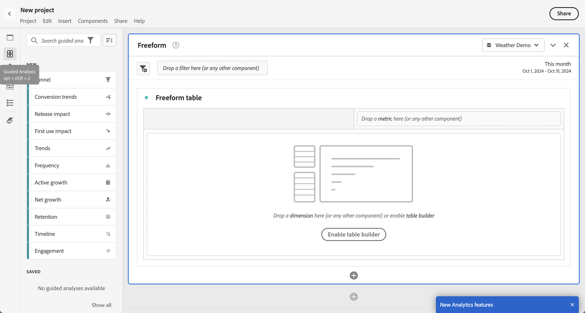
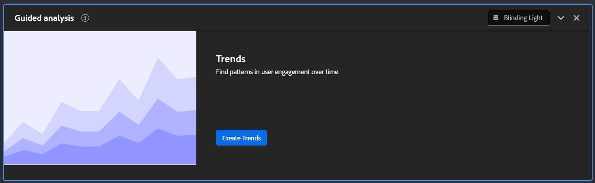

# Översikt över guidad analys

Med hjälp av guidad analys kan användarna själva leverera högkvalitativa data och insikter om kundresan via guidade arbetsflöden som bygger på data från olika kanaler i Customer Journey Analytics. Funktionsövergripande team, från marknadsföring till produkt, kan kommunicera i realtid för att använda och förstå dessa rapporter.

I likhet med Analysis Workspace- och Mobile-styrkort använder guidad analys data från en [datavy](../data-views/data-views.md) som refererar till data i Adobe Experience Platform via en [anslutning](../connections/overview.md). Många rapporter som skapas i guidad analys kan smidigt överföras till Analysis Workspace för ytterligare forskning.

Följande guidade analysvyer är tillgängliga:

| Vytyp | Beskrivning |
| --- | --- |
| [Engagemang](types/engagement.md) | Förstå bredden och djupet av engagemanget. |
| [Funktion](types/friction.md) | Jämför konverteringsgrader mellan steg. |
| [Konverteringstrender](types/conversion-trends.md) | Spåra förändringar i konverteringsgrader över tid. |
| [Utgåva](types/release.md) | Jämför prestanda i lika stora perioder före och efter lanseringen. |
| [Första användningen](types/first-use.md) | Mät effekten av förstagångsanvändning på nyckelindikatorer. |
| [Kvarhållningsfrekvenser](types/retention-rates.md) | Mät användarnas återkommande returvanor. |
| [Användning](types/usage.md) | Mät användarengagemanget över tid. |
| [Frekvens](types/frequency.md) | Mät engagemang efter användningsfrekvens. |
| [Aktiv](types/active.md) | Identifiera vem som är ny, bevarad, återvändande eller vilande. |
| [Nettotillväxt](types/net-growth.md) | Kommer du att få eller förlora användare? |
| [Tidslinje](types/timeline.md) | Utforska mönster i sessionsaktivitet. |

{style="table-layout:auto"}

## Åtkomst

Du kommer åt Guidad analys från Customer Journey Analytics hemsida.

1. Välj **[!UICONTROL Guided analysis]** på hemsidan, som tar dig direkt till [vyn Användningstrender](types/usage.md).

   {style="border:1px solid gray"}

1. Välj **[!UICONTROL Create new]** om du vill visa de olika visningsalternativen och välja en annan startpunkt för analysen.

   {style="border:1px solid gray"}

Du kan även komma åt Guidad analys inifrån ett Analysis Workspace-projekt.

1. Välj **[!UICONTROL Blank project]** på startsidan om du vill skapa ett tomt Workspace-projekt.

   {style="border:1px solid gray"}

1. Välj  **[!UICONTROL Guided Analysis]** i den vänstra listen.

   {style="border:1px solid gray"}

1. Dra en visningstyp till Workspace arbetsyta och välj sedan knappen **[!UICONTROL Create]** för att generera önskad analys. Du kan också dra en befintlig analys till Workspace Canvas från avsnittet **[!UICONTROL Saved]**.

   

## Gränssnitt

Gränssnittet för guidad analys följer ett fråge- och svarsformat. Formulera frågan i frågefältet och få sedan ett svar med en skriftlig insikt, diagram och tabell. Du kan sedan ställa nästa fråga med vytyper och visualiseringsinställningar.

I den guidade analysen används följande gränssnittselement:

| Förhandsgranska gränssnitt | Gränssnittselement | Beskrivning |
| --- | --- | --- |
| {style="border:1px solid gray"} | Frågerår | Konfigurera din&quot;fråga&quot; genom att välja de komponenter (händelser, egenskaper och segment) som en analys består av. Följande alternativ är tillgängliga för alla vytyper, med ytterligare inställningar tillgängliga per vy. <ul><li>**Analysväljare**: En listruta där du kan växla till en ny analystyp. Dina frågeval ligger inom de tillåtna gränserna för den nya analystypen.</li><li>**Vyväljare**: En listruta där du kan växla till en ny vy (&quot;svar&quot;) för frågan som du skapade. Dina frågeval ligger inom de tillåtna gränserna för den nya vytypen.</li><li>**Händelser**: De händelser som du vill mäta. Varje vytyp tillämpar olika gränser för antalet händelser som du kan konfigurera.</li><li>**Filter**: Använd ikonen  i avsnittet Händelser eller segment om du vill begränsa efter specifika egenskaper. När en egenskap är markerad är båda standardfiltervillkoren (till exempel [!UICONTROL Equals], [!UICONTROL Contains] eller [!UICONTROL Ends with]) och de övre 1 000 egenskapsvärdena tillgängliga.</li><li>**Räknas som**: Den räkningsmetod som du vill använda för de markerade händelserna.</li><li>**Segment**: Segmenten som du vill mäta. Varje vytyp tillämpar olika gränser för antalet segment som du kan konfigurera.</li></ul> |
| {style="border:1px solid gray"} | Diagram | En visualisering av de data som returneras baserat på dina indata från frågespelaren och inställningarna. Vilken visualisering du ser beror på vyn och inställningarna ovanför diagrammet. Diagrammet innehåller även: <ul><li>**Verktygstips**: Håll pekaren över en diagramdatapunkt för att visa ett verktygstips med mer information.</li><li>**Förklaring**: Håll pekaren över teckenförklaringsserien för att visa definitioner där de är tillgängliga, fokusera på serien och dölja tillfälligt andra serier. Dölj en serie i teckenförklaringen genom att klicka på den.</li><li>**Anteckningar**: Tillämpliga [anteckningar](../components/annotations/overview.md) visas mellan visualiseringen och teckenförklaringen. Den visas som en  i anteckningens konfigurerade färg. Visa typer som visar data över tid genom att placera ikonen  under det konfigurerade datumet eller datumintervallet. Visa typer som inte visar data över tid genom att visa ikonen  i diagrammets nedre högra hörn.</li><li>**Klicka på åtgärder**: Visa tillgängliga nästa åtgärd genom att vänsterklicka på en datapunkt. Du kan välja mellan **Spara segment**.</li></ul> |
| {style="border:1px solid gray"} | Tabell | En tabellrepresentation av de data som returneras baserat på dina indata från frågespelaren och inställningarna. Kolumnerna i tabellen beror på vilken vytyp som finns ovanför diagrammet. Tabellen innehåller även följande: <ul><li>**Klicka på åtgärder**: Dölj eller visa en diagramserie genom att växla ikonen  i varje rad. Ytterligare åtgärder är tillgängliga genom att klicka på menyn **[!UICONTROL More]**. Du kan välja mellan **Spara segment**.</li></ul> |
| {style="border:1px solid gray"} | Visualiseringsinställningar | Alternativ ovanför diagrammet som gör att du kan ställa nästa fråga och anpassa hur diagrammet och tabellen returnerar data. Följande alternativ är tillgängliga för alla vytyper, med ytterligare inställningar tillgängliga per vy. <ul><li>**Diagraminställningar**: Finjustera hur diagrammet och tabellen visas. Vilka alternativ som är tillgängliga beror på vilken vy du har valt.</li><li>**Datumintervall**: En kalenderväljare som gör att du kan bestämma datumintervallet för analysen. Du kan också välja ett intervall för trendvyer, till exempel dagliga, veckovisa eller månadsvisa.</li><li>**Insikter**: Sammanhangsberoende insikter beroende på vilken analys du visar. Dessa insikter ger observationer för den aktuella analysen. Om det finns flera tillgängliga insikter kan du visa dem med pilarna till höger. Du kan växla synlighet för den här rutan genom att använda glödlampsikonen i det övre högra hörnet.</li></ul> |
| {style="border:1px solid gray"} | Meny | Kommandon i det övre högra hörnet av guidad analys som ger övergripande åtgärder för din analys.<ul><li>**Datavyväljare**: Ändra datavyn som analysen använder. När du ändrar datavyn ändras även de tillgängliga komponenterna i frågerinjen.</li><li>**Kopiera länk**: Kopierar en länk till analysen till Urklipp. Du uppmanas att spara innan du delar.</li><li>**Dela**: Öppnar den modala delningen, med ytterligare alternativ för delning till enskilda användare eller grupper. Du kan dela en analys med andra användare eller skapa en länk som du kan dela med vem som helst.</li><li>**Spara**: Sparar analysen. Om du sparar en ny analys visas ett modalt fönster som begär ett namn och en beskrivning.</li><li>**Spara som**: Sparar analysen separat från den aktuella analysen och skapar en kopia. Ett modalt fönster visas där ett nytt namn och en beskrivning efterfrågas.</li><li>**Öppna i Workspace**: Återskapar den aktuella guidade analysen i Analysis Workspace. Workspace-projektet skapas på en ny flik, vilket förhindrar avbrott när du arbetar i en guidad analys. Det är en kopia av analysen och är inte synkroniserat med den ursprungliga guidade analysen när den väl har öppnats. Använd det här kommandot när du vill skicka vidare till analytikerteamet, eller fördjupa dig i data än vad som tillåts med guidad analys.</li><li>**Kopiera till Urklipp**: Kopierar diagramgrafiken till Urklipp och klistras in i andra program. Frågefältet och tabellen tas inte med i bilden.</li><li>**Hämta PNG**: Hämtar diagramgrafiken som en `.png`. Frågefältet och tabellen tas inte med i bilden.</li><li>**Hämta CSV**: Hämtar tabelldata som en `.csv`. Frågefältet och -diagrammet inkluderas inte i filen.</li></ul> |

{style="table-layout:auto"}

## Provisionering

Vyer med guidad analys ingår i Customer Journey Analytics-paket på följande sätt:

| Paket | Tillgängliga vyer |
| --- | --- |
| [!UICONTROL CJA add-ons] | Trends: Usage, Trends: Frequency, Funnel: Friction, Funnel: Conversion trends, Retention: Retention rate, User growth: Active, User growth: Net growth |
| [!UICONTROL CJA Foundation] | Trender: Användning |
| [!UICONTROL CJA Select] | Foundation views + Trends: Frequency, Funnel: Friction, Funnel: Conversion trends, Retention: Retention rate, User growth: Active, User growth: Net growth |
| [!UICONTROL CJA Prime] | Välj vyer + användarström: Tidslinje, funktionsmatris: engagemang, effekt: release, effekt: första användningen |
| [!UICONTROL CJA Ultimate] | Prime views |

{style="table-layout:auto"}

Administratörer av produktprofiler kan lägga till eller ta bort åtkomst till guidad analys i Adobe Admin Console.

1. Logga in på [Adobe Admin Console](https://adminconsole.adobe.com).
1. Välj **[!UICONTROL Customer Journey Analytics]** i listan över produkter.
1. Välj önskad produktprofil för de behörigheter som du vill redigera.
1. Klicka på fliken **[!UICONTROL Permissions]** och sedan på **[!UICONTROL Edit]** under [!UICONTROL Reporting Tools].
1. Klicka på plusikonen bredvid **[!UICONTROL Guided Analysis Access]** i listan med [!UICONTROL Available Permission Items], som lägger till den i listan med [!UICONTROL Included Permission Items].
1. Klicka på **[!UICONTROL Save]**.

>[!TIP]
>
>Vissa administratörer föredrar att aktivera guidad analys och inaktivera Analysis Workspace för nya användare i Customer Journey Analytics. När dessa användare har kommit överens med produkten och era organisationsdata kan ni aktivera åtkomst till Analysis Workspace.
