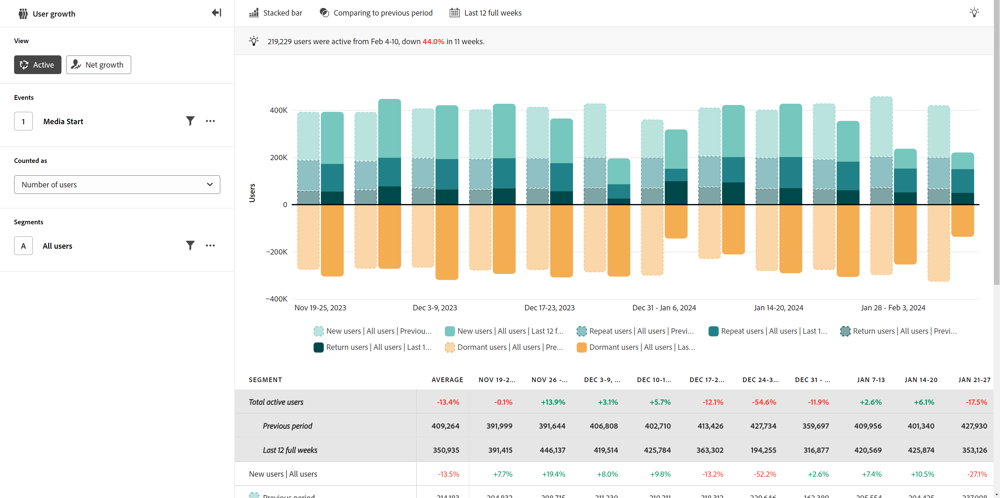

# Aktiv

{{release-limited-testing}}

The **Aktiv** ger insikter om användarnas tillväxt och förvärv under en viss period. Den vågräta axeln är ett tidsintervall, medan den lodräta axeln är ett mått på användare. Användarna är indelade i fyra kategorier:

* **Nytt**: Användaren var aktiv under den aktuella perioden, men inte tidigare. Se hur långt analysen ser tillbaka genom att hålla pekaren över[!UICONTROL New users]&#39; i diagramförklaringen. Uppslagsintervallet bestäms dynamiskt utifrån det valda datumintervallet och intervallet.
* **Upprepa**: Användaren var aktiv i den aktuella och omedelbart föregående perioden.
* **Retur**: Användaren var aktiv under den aktuella perioden och inte aktiv under den omedelbart föregående perioden, men var tidigare aktiv vid något tillfälle. Se hur långt analysen ser tillbaka genom att hålla pekaren över[!UICONTROL Return users]&#39; i diagramförklaringen. Uppslagsintervallet bestäms dynamiskt utifrån det valda datumintervallet och intervallet.
* **Vilande**: Användaren var aktiv i den omedelbart föregående perioden, men är inte aktiv i den aktuella perioden. Vilande användare räknas inte med i det totala antalet aktiva användare.

Alla aktiva användare (nya + upprepning + retur) visas som en provton ovanför den vågräta axeln, medan alla vilande användare visas orangefärgade under den vågräta axeln.

Exempel:

* **Bevarande och bortfall av användare:** Ger en tydlig visualisering runt perioder med hög eller låg användarlojalitet. Genom att känna igen dessa perioder av hög eller låg lojalitet kan du fatta produktbeslut för att öka kundlojaliteten eller hjälpa till att minimera bortfallet.
* **Kampanjbedömning**: Att visa en viss kampanj kan hjälpa er att förstå inte bara hur mycket trafik den genererade, utan även hur väl kampanjen hjälpte användarna att hålla sig engagerade.
* **Livscykelanalys för användare**: Genom att analysera aktiv användartillväxt under hela användarlivscykeln kan man identifiera specifika faser där användarengagemanget minskar. Om det till exempel finns ett stort antal vilande användare för enskilda personer i ett introduktionsstadium kan det tyda på användarvänlighetsproblem eller ett behov av bättre produktvägledning.

## Frågerår

Med frågerefältet kan du konfigurera följande komponenter:

* **Händelser**: Händelsen som du vill mäta. Eftersom den här vytypen är användarbaserad räknas en användare som interagerar med händelsen en gång inom perioden som en aktiv användare. Du kan inkludera en händelse i en fråga.
* **Folk**: Det segment som du vill mäta. Du kan inkludera ett segment i en fråga.

## Diagraminställningar

I vyn Aktiv finns följande diagraminställningar som du kan justera på menyn ovanför diagrammet:

* **Mått**: Det mått som du vill mäta. Alternativen är Antal användare och Procent av användare.
* **Diagramtyp**: Den typ av visualisering som du vill använda. Alternativen är Staplad liggande och Staplad yta.

## Använd tidsjämförelse

{{apply-time-comparison}}

## Datumintervall

Det önskade datumintervallet för analysen. Den här inställningen har två komponenter:

* **Intervall**: Datumgranulariteten som du vill visa data efter. Giltiga alternativ är Timly, Daily, Weekly, Monthly och Quarterly. Samma datumintervall kan ha olika intervall som påverkar antalet datapunkter i diagrammet och antalet kolumner i tabellen. Om du till exempel visar en analys som sträcker sig över tre dagar med daglig granularitet visas bara tre datapunkter, medan en analys som sträcker sig över tre dagar med timgranularitet visar 72 datapunkter.
* **Datum**: Start- och slutdatumet. Förinställningar för rullande datumintervall och tidigare sparade anpassade intervall är tillgängliga för att underlätta, eller så kan du använda kalenderväljaren och välja ett fast datumintervall.
