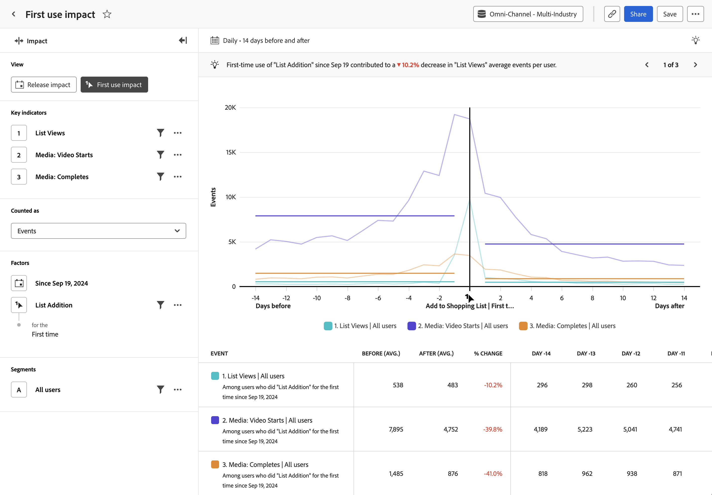

# [!UICONTROL First use impact]-analys {#first-use-impact}

<!-- markdownlint-disable MD034 -->

>[!CONTEXTUALHELP]
>id="workspace_guidedanalysis_firstuseimpact_button"
>title="Effekt för första användningen"
>abstract="Mät effekten av förstagångsanvändning på nyckelindikatorer."

<!-- markdownlint-enable MD034 -->

Analysen  **[!UICONTROL First use impact]** visar en jämförelse av hur nyckelindikatorer som har utförts före och efter det att en användare använder en produktfunktion för första gången. Den vågräta axeln i den här rapporten är ett relativt tidsintervall före och efter händelsen, medan den lodräta axeln mäter de önskade nyckelindikatorerna. Ett lodrätt streck i mitten av diagrammet representerar dag 0 när en funktion först används av en viss användare. Eftersom användare inte alltid använder funktioner på samma dag och dina rollouter kan inträffa under flera dagar, kan dag 0 betyda något som skiljer sig åt för varje enskild användare.

>[!VIDEO](https://experienceleague.adobe.com/sv/docs/customer-journey-analytics-learn/tutorials/guided-analysis/first-use-impact)

## Användningsexempel

Användningsexempel för den här analysen är:

* **Analys av nya funktioner**: Om du startar en ny funktion i produkten kan du jämföra hur nyckelindikatorer som utförts före och efter det att användarna exponerats för den nya funktionen för första gången.
* **Avfasade utrullningar**: Eftersom analysen söker efter första användningstillfället i stället för ett fast datum, är den här analysen användbar om du fasar ut utrullningen av funktionerna över tid.
* **Ny produktversionsanalys**: Om du startar en ny version av produkten kan du jämföra hur nyckelindikatorer som utförts före och efter det att användarna exponerats för den nya versionen för första gången. Välj&quot;any event&quot; som första användningshändelse och filtrera den till egenskapen för versionsnummer.
* **Befintliga funktionsförbättringar**: Om du gör förbättringar av en befintlig funktion i produkten kan du jämföra hur nyckelindikatorer som utförts före och efter det att användarna exponerades för de nya förbättringarna för första gången. Du kan utföra den här analysen på ett eller flera sätt beroende på vilken funktionsinstrumentation du har.
   * Välj en händelse som representerar förbättringen som första användningshändelse
   * Välj det datum då ändringarna började rulla ut
   * Segmentera analysen till den grupp personer som exponeras för förbättringarna
* **Kampanjeffektivitet**: När en användare klickar igenom från en viss kampanj kan du jämföra hur nyckelindikatorer utfördes före och efter att användaren interagerade med kampanjen.

## Gränssnitt

I [Gränssnitt](../overview.md#interface) finns en översikt över gränssnittet för guidad analys. Följande inställningar är specifika för den här analysen:

### Frågerår

Med frågerefältet kan du konfigurera följande komponenter:

* **[!UICONTROL View]**: Växla mellan den här analysen och [versionen](release-impact.md).
* **[!UICONTROL Key indicators]**: De händelser som du vill mäta per användare. Varje markerad tangentindikator representeras som en färgad linje. En rad som representerar händelsen läggs till i tabellen. Du kan inkludera upp till tre händelser.
* **[!UICONTROL Counted as]**: Den beräkningsmetod som du vill använda för de markerade händelserna. Alternativen är [!UICONTROL Events per user], [!UICONTROL Events], [!UICONTROL Sessions] och [!UICONTROL Users].
* **[!UICONTROL Factors]**: Det finns två faktorer för den här analysen:
   * **[!UICONTROL Date]**: Hur långt tillbaka du vill börja leta efter den första gångshändelsen som har inträffat.
   * **[!UICONTROL Event]**: Den händelse som du vill söka efter första användningen av, för att centrera analysen på.
* **[!UICONTROL Segments]**: Det segment som du vill mäta. Det valda segmentet filtrerar data så att de bara fokuserar på de personer som matchar dina segmentkriterier. Det finns stöd för ett enskilt segment för den här analysen.

### Diagraminställningar

Analysen av [!UICONTROL First use impact] innehåller följande diagraminställningar som kan justeras i menyn ovanför diagrammet:

* **[!UICONTROL Chart type]**: Den typ av visualisering som du vill använda. Alternativen är Line.

### Datumintervall

Datumval i [!UICONTROL First use impact]-analysen fungerar annorlunda än andra analyser, eftersom analysen kretsar kring det datum som anges i frågerinjen. Följande alternativ är tillgängliga:

* **[!UICONTROL Interval]**: Datumgranulariteten som du vill visa data efter. Giltiga alternativ är [!UICONTROL Daily], [!UICONTROL Weekly], [!UICONTROL Monthly] och [!UICONTROL Quarterly]. Om du ändrar intervallet påverkas alternativen för perioden Före och efter.
* **[!UICONTROL Before and after period]**: Den tid det tar att analysera före och efter den första use-händelsen som anges i frågerinjen. Vilka alternativ som är tillgängliga beror på valet av [!UICONTROL Interval].

<!--
## Example

See below for an example of the analysis.

-->
