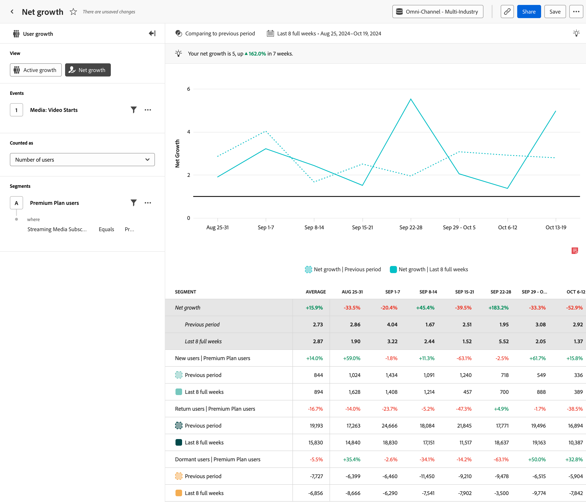

# [!UICONTROL Net growth]-analys {#net-growth}

<!-- markdownlint-disable MD034 -->

>[!CONTEXTUALHELP]
>id="workspace_guidedanalysis_netgrowth_button"
>title="Nettotillväxt"
>abstract="Kommer du att få eller förlora användare?"

<!-- markdownlint-enable MD034 -->

Analysen  **[!UICONTROL Net growth]** ger insikter om i vilken takt du får eller förlorar användare under en viss period. Den vågräta axeln är ett tidsintervall, medan den lodräta axeln är tillväxtmåttet.

Varje datapunkt representerar nettotillväxt, som beräknas med följande formel:

`([New users] + [Return users]) / [Dormant users]`

Resultatet av den här formeln är ett förhållande. En nettoökning på `1` representerar en jämvikt. Produkten fick samma antal användare som den förlorade. En nettotillväxt som är större än `1` representerar positiv tillväxt. Det fanns fler nya +-användare än vilande användare. En nettotillväxt på mindre än `1` innebär också en förlust. Det fanns fler vilande användare än nya +-användare.

Ungefär som i analysen [Aktiv](active-growth.md) definieras användare enligt följande:

* **[!UICONTROL New]**: Användaren var aktiv under den aktuella perioden, men inte tidigare. Se hur långt analysen ser tillbaka för att avgöra om en ny användare är markerad genom att hålla markören över [!UICONTROL New users] i diagramförklaringen. Uppslagsintervallet bestäms dynamiskt utifrån det valda datumintervallet och intervallet.
* **[!UICONTROL Return]**: Användaren var aktiv under den aktuella perioden och inte aktiv under den omedelbart föregående perioden, men var tidigare aktiv vid något tillfälle. Se hur långt analysen ser tillbaka för att fastställa en returanvändare genom att hålla markören över [!UICONTROL Return users] i diagramförklaringen. Uppslagsintervallet bestäms dynamiskt utifrån det valda datumintervallet och intervallet.
* **[!UICONTROL Dormant]**: Användaren var aktiv i den omedelbart föregående perioden, men är inte aktiv i den aktuella perioden. Vilande användare räknas inte med i det totala antalet aktiva användare.

>[!NOTE]
>
>Upprepade användare tas inte med i beräkningen eftersom de inte representerar någon ökning eller förlust av användare.

>[!VIDEO](https://video.tv.adobe.com/v/3421664/?quality=12&learn=on)

## Användningsexempel

Användningsexempel för den här analysen är:

* **Prestandautvärdering**: Gör att du kan utvärdera den övergripande prestandan för din produkt när det gäller att köpa nya användare. Genom att följa tillväxttrender kan du bättre förstå om produkten lockar och behåller användare i önskad takt.
* **Analys av kundvärvning**: Gör att du kan bedöma hur effektiva era strategier för kundvärvning är. Genom att analysera källor till användartillväxt, t.ex. sökmotorer, kampanjer eller andra marknadsföringskanaler, kan ni identifiera de viktigaste tillväxtkällorna så att ni kan tilldela resurser i enlighet med detta.
* **Kurnanalys**: Nettotillväxt inkluderar attribut i sin formel (vilande användare). Du kan utvärdera den övergripande statusen för din användarbas över tiden. Om nettotillväxten är konsekvent under `1` indikerar det en hög mängd attribut som kan leda till implementering av strategier för kvarhållning.

## Gränssnitt

I [Gränssnitt](../overview.md#interface) finns en översikt över gränssnittet för guidad analys. Följande inställningar är specifika för den här analysen:

### Frågerår

Med frågerefältet kan du konfigurera följande komponenter:

* **[!UICONTROL View]**: Växla mellan den här analysen och [Aktiv tillväxt](active-growth.md).
* **[!UICONTROL Events]**: Den händelse som du vill mäta. Eftersom den här analysen är användarbaserad räknas en användare som interagerar med händelsen en gång inom perioden som en aktiv användare. Du kan inkludera en händelse i en fråga.
* **[!UICONTROL Counted as]**: Den beräkningsmetod som du vill använda för de markerade händelserna. <ul><li>**[!UICONTROL Options]** omfattar [!UICONTROL Number of users] och [!UICONTROL Percentage of users].</li><li>[!BADGE B2B edition]{type=Informative url="https://experienceleague.adobe.com/en/docs/analytics-platform/using/cja-overview/cja-b2b/cja-b2b-edition" newtab=true tooltip="Customer Journey Analytics B2B edition"} Ytterligare **[!UICONTROL B2B options]** är tillgängliga för Customer Journey Analytics B2B edition: [!UICONTROL Global accounts], [!UICONTROL Accounts], [!UICONTROL Buying groups], [!UICONTROL Opportunities], [!UICONTROL Percentage of global accounts], [!UICONTROL Percentage of accounts], [!UICONTROL Percentage of buying groups] och [!UICONTROL Percentage of opportunities].</li></ul>
* **[!UICONTROL Segments]**: Det segment som du vill mäta. Du kan inkludera ett segment i en fråga.

### Tidsjämförelse

{{apply-time-comparison}}

### Datumintervall

Det önskade datumintervallet för analysen. Den här inställningen har två komponenter:

* **[!UICONTROL Interval]**: Datumgranulariteten som du vill visa data efter. Giltiga alternativ är Timly, Daily, Weekly, Monthly och Quarterly. Samma datumintervall kan ha olika intervall som påverkar antalet datapunkter i diagrammet och antalet kolumner i tabellen. Om du till exempel visar en analys som sträcker sig över tre dagar med daglig granularitet visas bara tre datapunkter, medan en analys som sträcker sig över tre dagar med timgranularitet visar 72 datapunkter.
* **[!UICONTROL Date]**: Start- och slutdatumet. Förinställningar för rullande datumintervall och tidigare sparade anpassade intervall är tillgängliga för att underlätta, eller så kan du använda kalenderväljaren och välja ett fast datumintervall.

<!-- 
## Example

See below for an example of the analysis.

-->
